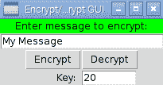
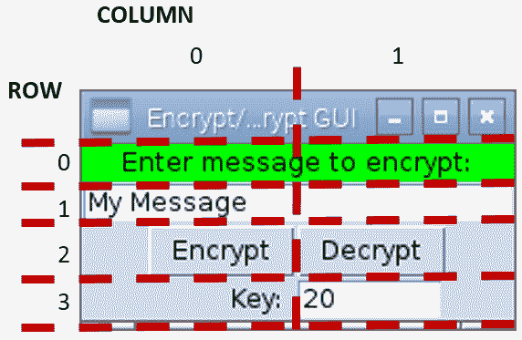
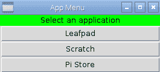
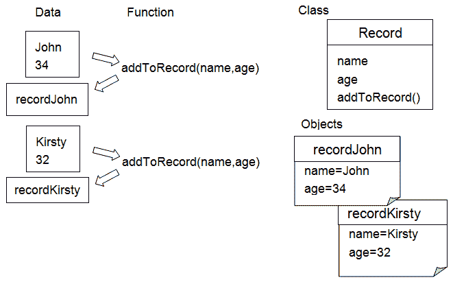
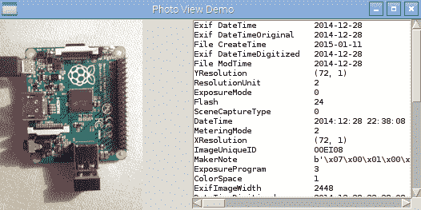
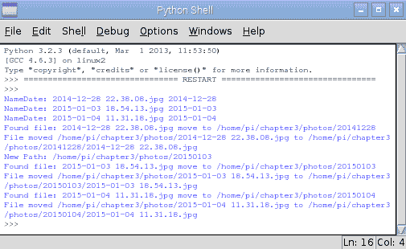
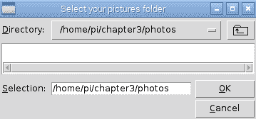

# 三、使用 Python 实现自动化和生产力

在本章中，我们将介绍以下主题：

*   使用 Tkinter 创建图形用户界面
*   创建图形开始菜单应用程序
*   在应用程序中显示照片信息
*   自动组织您的照片

# 介绍

到目前为止，我们只关注命令行应用程序；然而，Raspberry Pi 不仅仅是命令行。通过使用**图形用户界面**（**GUI**，通常更容易从用户处获取输入并以更简单的方式提供反馈。毕竟，我们一直在不断地处理多个输入和输出，那么，为什么不必限制自己使用命令行的过程格式呢？

幸运的是，Python 可以支持这一点。与其他编程语言（如 Visual Basic 和 C/C++/C#）一样，这可以通过使用提供标准控件的预构建对象来实现。我们将使用一个名为**Tkinter**的模块，它提供了一系列用于创建图形应用程序的控件（也称为**小部件**）和工具。

首先，我们将以`encryptdecrypt.py`为例，演示如何以各种方式编写和重用有用的模块。这是一个良好编码实践的示例。我们应该致力于编写能够被彻底测试并在许多地方重用的代码。

接下来，我们将通过创建一个小的图形开始菜单应用程序来扩展前面的示例，以便从中运行我们喜欢的应用程序。

然后，我们将探索在我们的应用程序中使用**类**来显示和
组织照片。

# 使用 Tkinter 创建图形用户界面

我们将创建一个基本的 GUI，允许用户输入信息，然后可以使用该程序对其进行加密和解密。

# 准备

必须确保此文件位于同一目录中。

Since we are using Tkinter (one of many available add-ons for Python), we need to ensure that it is installed. It should be installed by default on the standard Raspbian image. We can confirm it is installed by importing it from the Python prompt, as follows:

`   Python3`
`   >>> import tkinter`

如果未安装，则会引发`ImportError`异常，您可以使用以下命令进行安装（使用*Ctrl*+*Z*退出 Python 提示）：

`   sudo apt-get install python3-tk`

如果模块没有加载，您可以使用以下命令阅读更多关于模块的信息（阅读完毕后使用*Q*退出）：

`   >>>help(tkinter)`

您还可以使用以下命令获取有关模块中所有类、函数和方法的信息：

`   >>>help(tkinter.Button)`

下面的`dir`命令将列出`module:`范围内的任何有效命令或变量

`   >>>dir(tkinter.Button)`

您将看到，我们自己的模块将具有关于用三重引号标记的函数的信息；如果我们使用`help`命令，将显示此消息。

命令行将无法显示本章中创建的图形显示，因此您必须启动 Raspberry Pi desktop（使用命令`startx`），或者如果您正在远程使用它。

Make sure you have **X11 forwarding** enabled and an **X server** running (see [Chapter 1](03.html), *Getting Started with a Raspberry Pi 3 Computer*).

# 怎么做。。。

我们将使用`tkinter`模块为`encryptdecrypt.py`脚本生成 GUI。

要生成 GUI，我们将创建以下`tkencryptdecrypt.py`脚本：

```py
#!/usr/bin/python3 
#tkencryptdecrypt.py 
import encryptdecrypt as ENC 
import tkinter as TK 

def encryptButton(): 
    encryptvalue.set(ENC.encryptText(encryptvalue.get(), 
                                     keyvalue.get())) 

def decryptButton(): 
    encryptvalue.set(ENC.encryptText(encryptvalue.get(), 
                                     -keyvalue.get())) 
#Define Tkinter application 
root=TK.Tk() 
root.title("Encrypt/Decrypt GUI") 
#Set control & test value 
encryptvalue = TK.StringVar() 
encryptvalue.set("My Message")  
keyvalue = TK.IntVar() 
keyvalue.set(20) 
prompt="Enter message to encrypt:" 
key="Key:" 

label1=TK.Label(root,text=prompt,width=len(prompt),bg='green') 
textEnter=TK.Entry(root,textvariable=encryptvalue, 
                   width=len(prompt)) 
encryptButton=TK.Button(root,text="Encrypt",command=encryptButton) 
decryptButton=TK.Button(root,text="Decrypt",command=decryptButton) 
label2=TK.Label(root,text=key,width=len(key)) 
keyEnter=TK.Entry(root,textvariable=keyvalue,width=8) 
#Set layout 
label1.grid(row=0,columnspan=2,sticky=TK.E+TK.W) 
textEnter.grid(row=1,columnspan=2,sticky=TK.E+TK.W) 
encryptButton.grid(row=2,column=0,sticky=TK.E) 
decryptButton.grid(row=2,column=1,sticky=TK.W) 
label2.grid(row=3,column=0,sticky=TK.E) 
keyEnter.grid(row=3,column=1,sticky=TK.W) 

TK.mainloop() 
#End 
```

使用以下命令运行脚本：

```py
python3 tkencryptdecrypt
```

# 它是如何工作的。。。

我们首先导入两个模块；第一个是我们自己的`encryptdecrypt`模块，第二个是`tkinter`模块。为了便于查看哪些项目来自何处，我们使用了`ENC`/`TK`。如果您想避免额外引用，可以使用`from <module_name> import *`直接引用模块项。

点击加密和解密按钮时会调用`encryptButton()`和`decryptButton()`函数；下文将对其进行解释。

Tkinter 主窗口是使用`Tk()`命令创建的，该命令返回可放置所有小部件/控件的主窗口。

我们将定义以下六种控制：

*   `Label`：显示提示输入加密信息：
*   `Entry`：提供一个文本框，用于接收用户要加密的消息
*   `Button`：这是一个加密按钮，用于触发要加密的消息
*   `Button`：这是一个解密按钮，用于反向加密
*   `Label`：显示 Key:字段，提示用户输入加密密钥值
*   `Entry`：这提供了第二个文本框来接收加密密钥的值

这些控件将生成一个类似于以下屏幕截图所示的 GUI：



The GUI to encrypt/decrypt messages

让我们看一下第一个定义：

```py
label1=TK.Label(root,text=prompt,width=len(prompt),bg='green') 
```

所有控件必须链接到应用程序窗口；因此，我们必须指定 Tkinter 窗口`root`。标签使用的文本由`text`设置；在本例中，我们将其设置为一个名为`prompt`的字符串，该字符串已在前面用我们需要的文本定义。我们还将`width`设置为与消息的字符数相匹配（虽然不是必需的，但如果我们以后在标签上添加更多文本，它会提供更整洁的结果），最后，我们使用`bg='green'`设置背景色。

接下来，我们为我们的消息定义文本`Entry`框：

```py
textEnter=TK.Entry(root,textvariable=encryptvalue, 
                   width=len(prompt)) 
```

我们将定义`textvariable`——一种将变量链接到特殊字符串变量框内容的有用方法。我们可以使用`textEnter.get()`直接访问`text`，但我们将使用`Tkinter StringVar()`对象来间接访问它。如果需要，这将允许我们将正在处理的数据与处理 GUI 布局的代码分离。无论何时使用`.set()`命令，`enycrptvalue`变量都会自动更新其链接的`Entry`小部件（并且`.get()`命令从`Entry`小部件获取最新值）。

接下来，我们有两个`Button`小部件，加密和解密，如下所示：

```py
encryptButton=TK.Button(root,text="Encrypt",command=encryptButton) 
decryptButton=TK.Button(root,text="Decrypt",command=decryptButton) 
```

在这种情况下，我们可以通过设置`command`属性来设置在点击`Button`小部件时调用的函数。我们可以定义单击每个按钮时将调用的两个函数。在下面的代码片段中，我们有`encryptButton()`函数，它将设置控制第一个`Entry`框内容的`encryptvalue StringVar`。该字符串设置为我们通过调用`ENC.encryptText()`得到的结果，其中包含我们想要加密的消息（当前值为`encryptvalue`）和`keyvalue`变量。`decrypt()`函数完全相同，只是我们将`keyvalue`变量设为负数以解密消息：

```py
def encryptButton(): 
    encryptvalue.set(ENC.encryptText(encryptvalue.get(), 
                                     keyvalue.get())) 
```

然后，我们以类似的方式设置最终的`Label`和`Entry`小部件。请注意，如果需要，`textvariable`也可以是整数（数值），但没有内置检查以确保只能输入数字。当使用`.get()`命令时，您将遇到`ValueError`异常。

在定义了 Tkinter 窗口中要使用的所有小部件之后，我们必须设置布局。在 Tkinter 中定义布局有三种方式：*地点*、*包装*和*网格*。

位置布局允许我们使用精确的像素位置指定位置和大小。“包布局”将项目按添加顺序放置在窗口中。网格布局允许我们将项目放置在特定的布局中。建议尽可能避免放置布局，因为对一个项目的任何微小更改都可能对所有其他项目的位置和大小产生连锁效应；其他布局通过确定它们相对于窗口中其他项目的位置来解释这一点。

我们将按照以下屏幕截图中的布局放置项目：



Grid layout for the Encrypt/Decrypt GUI

GUI 中前两项的位置使用以下代码设置：

```py
label1.grid(row=0,columnspan=2,sticky= TK.E+TK.W) 
textEnter.grid(row=1,columnspan=2,sticky= TK.E+TK.W) 
```

我们可以指定第一个`Label`和`Entry`框将跨越两列（`columnspan=2`，我们可以设置粘滞值，以确保它们跨越到边缘。这是通过设置东侧的`TK.E`和西侧的`TK.W`来实现的。如果我们需要在垂直方向上做同样的事情，我们会在北面使用`TK.N`，在南面使用`TK.S`。如果未指定`column`值，则网格函数默认为`column=0`。其他项目的定义类似。

最后一步是调用`TK.mainloop()`，允许 Tkinter 运行；这允许监控按钮的点击，并调用链接到按钮的功能。

# 创建图形应用程序–开始菜单

本配方中的示例演示了如何定义 Tkinter 对象的变体，以生成自定义控件并使用它们动态构建菜单。我们还将简要介绍如何使用线程在执行特定任务时允许其他任务继续运行。

# 准备

要查看 GUI 显示，您需要一个显示 Raspberry Pi 桌面的监视器，或者需要连接到另一台运行 X 服务器的计算机。

# 怎么做。。。

1.  要创建图形开始菜单应用程序，请创建以下`graphicmenu.py`脚本：

```py
#!/usr/bin/python3 
# graphicmenu.py 
import tkinter as tk 
from subprocess import call 
import threading 

#Define applications ["Display name","command"] 
leafpad = ["Leafpad","leafpad"] 
scratch = ["Scratch","scratch"] 
pistore = ["Pi Store","pistore"] 
app_list = [leafpad,scratch,pistore] 
APP_NAME = 0 
APP_CMD  = 1 

class runApplictionThread(threading.Thread): 
    def __init__(self,app_cmd): 
        threading.Thread.__init__(self) 
        self.cmd = app_cmd 
    def run(self): 
        #Run the command, if valid 
        try: 
            call(self.cmd) 
        except: 
            print ("Unable to run: %s" % self.cmd) 

class appButtons: 
    def __init__(self,gui,app_index): 
        #Add the buttons to window 
        btn = tk.Button(gui, text=app_list[app_index][APP_NAME], 
                        width=30, command=self.startApp) 
        btn.pack() 
        self.app_cmd=app_list[app_index][APP_CMD] 
    def startApp(self): 
        print ("APP_CMD: %s" % self.app_cmd) 
        runApplictionThread(self.app_cmd).start()        

root = tk.Tk() 
root.title("App Menu") 
prompt = '      Select an application      ' 
label1 = tk.Label(root, text=prompt, width=len(prompt), bg='green') 
label1.pack() 
#Create menu buttons from app_list 
for index, app in enumerate(app_list): 
    appButtons(root,index) 
#Run the tk window 
root.mainloop() 
#End
```

2.  前面的代码生成以下应用程序：



The App Menu GUI

# 它是如何工作的。。。

我们像以前一样创建 Tkinter 窗口；但是，我们没有单独定义所有项，而是为应用程序按钮创建了一个特殊类。

我们创建的类充当我们希望`appButtons`项包含的内容的蓝图或规范。每个项目将由一个用于`app_cmd`的字符串值、一个名为`startApp()`的函数和一个`__init__()`函数组成。`__init__()`函数是一个特殊函数（称为**构造函数**），在创建`appButtons`项时调用；它将允许我们创建所需的任何设置。

在这种情况下，`__init__()`功能允许我们创建一个新的 Tkinter 按钮，其中文本将设置为`app_list`中的一个项目，并且当点击按钮时，将在`startApp()`功能中调用命令。使用`self`关键字，以便调用的命令将是该项的一部分；这意味着每个按钮将调用一个本地定义的函数，该函数可以访问项目的本地数据。

我们将`self.app_cmd`的值设置为来自`app_list`的命令，并通过`startApp()`函数使其准备好使用。我们现在创建`startApp()`函数。如果我们在这里直接运行应用程序命令，Tkinter 窗口将冻结，直到我们打开的应用程序再次关闭。为了避免这种情况，我们可以使用 Python 线程模块，它允许我们同时执行多个操作。

`runApplicationThread()`类是使用`threading.Thread`类作为模板创建的，它继承了`threading.Thread`类在新类中的所有特性。就像我们上一节课一样，我们也为此提供了一个`__init__()`函数。我们首先调用继承类的`__init__()`函数以确保其设置正确，然后将`app_cmd`值存储在`self.cmd`中。创建并初始化`runApplicationThread()`函数后，调用`start()`函数。此函数是`threading.Thread`的一部分，我们的类可以使用它。当调用`start()`函数时，它将创建一个单独的应用程序线程（即，模拟同时运行两个东西），允许 Tkinter 在类内执行`run()`函数的同时继续监视按钮的点击。

因此，我们可以将代码放在`run()`函数中运行所需的应用程序（使用`call(self.cmd)`。

# 还有更多。。。

Python 特别强大的一个方面是它支持**面向对象设计**（**OOD**中使用的编程技术。现代编程语言通常使用它来帮助将我们希望程序执行的任务转换为代码中有意义的构造和结构。OOD 的原理在于，我们认为大多数问题都是由几个对象（GUI 窗口、按钮等）组成的，这些对象相互作用以产生所需的结果。

在上一节中，我们发现可以使用类来创建可以多次重用的唯一对象。我们创建了一个`appButton`类，该类生成了一个具有该类所有特性的对象，包括它自己的`app_cmd`个人版本，该版本将由`startApp()`函数使用。`appButton`类型的另一个对象将拥有其`startApp()`函数将使用的自身不相关的`[app_cmd]`数据。

您可以看到，类对于将相关变量和函数的集合保存在单个对象中非常有用，并且类将在一个位置保存自己的数据。拥有多个相同类型（类）的对象，每个对象都有自己的函数和数据，这会产生更好的程序结构。传统的方法是将所有信息保存在一个地方，并将每个项目来回发送给各种功能进行处理；但是，在大型系统中，这可能会变得很麻烦。

下图显示了相关功能和数据的组织：



Data and functions

到目前为止，我们已经使用 Python 模块将程序的各个部分分割成不同的
文件；这允许我们在概念上分离程序的不同部分（接口、编码器/解码器或类库，如 Tkinter）。模块可以提供控制特定硬件位的代码、定义互联网接口或提供公共功能库；但是，它最重要的功能是控制接口（导入项时可用的函数、变量和类的集合）。一个实现良好的模块应该有一个清晰的接口，该接口的中心是如何使用它，而不是如何实现它。这允许您创建多个模块，这些模块可以轻松交换和更改，因为它们共享相同的接口。在我们前面的示例中，想象一下仅仅通过支持`encryptText(input_text,key)`就可以将`encryptdecrypt`模块更改为另一个模块是多么容易。复杂的功能可以划分为更小的、可管理的块，这些块可以在多个应用程序中重用。

Python 一直在使用类和模块。每次导入库（如`sys`或 Tkinter）或使用`value.str()`转换值并使用`for...in`遍历列表时，您都可以使用它们，而无需担心细节。您不必在编写的每一段代码中都使用类或模块，但它们是非常有用的工具，可以随时保存在程序员的工具箱中，以备不时之需。

在本书的示例中，我们将了解类和模块如何允许我们生成易于测试和维护的结构良好的代码。

# 在应用程序中显示照片信息

在本例中，我们将创建一个工具类来处理照片，其他应用程序（作为模块）可以使用这些照片轻松访问照片元数据和显示预览图像。

# 准备

以下脚本使用了**Python 图像库**（**PIL**）；Python 3 的兼容版本是**枕头**。

枕头未包含在 Raspbian 存储库中（由`apt-get`使用）；因此，我们需要使用名为**PIP**的**Python 包管理器**来安装枕头。

为了安装 Python3 的软件包，我们将使用 Python3 版本的 PIP（这需要 50MB 的可用空间）。

以下命令可用于安装 PIP：

```py
sudo apt-get update
sudo apt-get install python3-pip 
```

在使用 PIP 之前，请确保已安装`libjpeg-dev`以允许枕头处理 JPEG 文件。可以使用以下命令执行此操作：

```py
sudo apt-get install libjpeg-dev

```

现在，您可以使用以下 PIP 命令安装枕头：

```py
sudo pip-3.2 install pillow  
```

PIP 还可以使用`uninstall`而不是`install`轻松卸载软件包。

最后，您可以通过运行`python3`确认安装成功：

```py
>>>import PIL
>>>help(PIL)  
```

您应该不会得到任何错误，并且会看到很多关于 PIL 及其使用的信息（按*Q*完成）。检查安装的版本，如下所示：

```py
>>PIL.PILLOW_VERSION
```

您应该看到`2.7.0`（或类似内容）。

PIP can also be used with Python 2 by installing pip-2.x using the following command:

`   sudo apt-get install python-pip`

使用`sudo pip install`安装的任何软件包都将仅为 Python 2 安装。

# 怎么做。。。

要在应用程序中显示照片信息，请创建以下`photohandler.py`脚本：

```py
##!/usr/bin/python3 
#photohandler.py 
from PIL import Image 
from PIL import ExifTags 
import datetime 
import os 

#set module values 
previewsize=240,240 
defaultimagepreview="./preview.ppm" 
filedate_to_use="Exif DateTime" 
#Define expected inputs 
ARG_IMAGEFILE=1 
ARG_LENGTH=2 

class Photo: 
    def __init__(self,filename): 
        """Class constructor""" 
        self.filename=filename 
        self.filevalid=False 
        self.exifvalid=False 
        img=self.initImage() 
        if self.filevalid==True: 
            self.initExif(img) 
            self.initDates() 

    def initImage(self): 
        """opens the image and confirms if valid, returns Image""" 
        try: 
            img=Image.open(self.filename) 
            self.filevalid=True 
        except IOError: 
            print ("Target image not found/valid %s" % 
                   (self.filename)) 
            img=None 
            self.filevalid=False 
        return img 

    def initExif(self,image): 
        """gets any Exif data from the photo""" 
        try: 
            self.exif_info={ 
                ExifTags.TAGS[x]:y 
                for x,y in image._getexif().items() 
                if x in ExifTags.TAGS 
            } 
            self.exifvalid=True 
        except AttributeError: 
            print ("Image has no Exif Tags") 
            self.exifvalid=False 

    def initDates(self): 
        """determines the date the photo was taken""" 
        #Gather all the times available into YYYY-MM-DD format 
        self.filedates={} 
        if self.exifvalid: 
            #Get the date info from Exif info 
            exif_ids=["DateTime","DateTimeOriginal", 
                      "DateTimeDigitized"] 
            for id in exif_ids: 
                dateraw=self.exif_info[id] 
                self.filedates["Exif "+id]= 
                                dateraw[:10].replace(":","-") 
        modtimeraw = os.path.getmtime(self.filename) 
        self.filedates["File ModTime"]="%s" % 
            datetime.datetime.fromtimestamp(modtimeraw).date() 
        createtimeraw = os.path.getctime(self.filename) 
        self.filedates["File CreateTime"]="%s" % 
            datetime.datetime.fromtimestamp(createtimeraw).date() 

    def getDate(self): 
        """returns the date the image was taken""" 
        try: 
            date = self.filedates[filedate_to_use] 
        except KeyError: 
            print ("Exif Date not found") 
            date = self.filedates["File ModTime"] 
        return date 

    def previewPhoto(self): 
        """creates a thumbnail image suitable for tk to display""" 
        imageview=self.initImage() 
        imageview=imageview.convert('RGB') 
        imageview.thumbnail(previewsize,Image.ANTIALIAS) 
        imageview.save(defaultimagepreview,format='ppm') 
        return defaultimagepreview         
```

前面的代码定义了我们的`Photo`类；除非我们在*中运行它，否则它对我们没有任何用处。还有更多。。。*节和下一个示例中。

# 它是如何工作的。。。

我们定义了一个名为`Photo`的通用类；包含自身详细信息，提供
功能访问**可交换图像文件格式**（**EXIF**信息并生成
预览图像。

在`__init__()`函数中，我们为类变量设置值并调用`self.initImage()`，它将使用 PIL 中的`Image()`函数打开图像。然后我们调用`self.initExif()`和`self.initDates()`，并设置一个标志来指示文件是否有效。如果无效，`Image()`函数将引发`IOError`异常。

`initExif()`函数使用 PIL 从`img`对象读取 EXIF 数据，如下代码段所示：

```py
self.exif_info={ 
                ExifTags.TAGS[id]:y 
                for id,y in image._getexif().items() 
                if id in ExifTags.TAGS 
               } 
```

前面的代码是一系列复合语句，导致用标记名及其相关值的字典填充`self.exif_info`。

`ExifTag.TAGS`是一个字典，其中包含与 ID 链接的可能标记名列表，如以下代码段所示：

```py
ExifTag.TAGS={ 
4096: 'RelatedImageFileFormat', 
513: 'JpegIFOffset', 
514: 'JpegIFByteCount', 
40963: 'ExifImageHeight', 
...etc...}
```

`image._getexif()`函数返回一个字典，其中包含图像摄像机设置的所有值，每个值都链接到它们的相关 ID，如以下代码段所示：

```py
Image._getexif()={ 
256: 3264, 
257: 2448, 
37378: (281, 100), 
36867: '2016:09:28 22:38:08', 
...etc...} 
```

`for`循环将遍历图像的 EXIF 值字典中的每个项目，并检查其在`ExifTags.TAGS`字典中的出现情况；结果将存储在`self.exif_info`中。其代码如下：

```py
self.exif_info={ 
'YResolution': (72, 1), 
 'ResolutionUnit': 2, 
 'ExposureMode': 0,  
'Flash': 24, 
...etc...} 
```

同样，如果没有异常，我们设置一个标志来指示 EXIF 数据是有效的，或者如果没有 EXIF 数据，我们引发一个`AttributeError`异常。

`initDates()`功能允许我们从 EXIF 数据中收集所有可能的文件日期和日期，以便我们可以选择其中一个作为我们希望用于文件的日期。例如，它允许我们将所有图像重命名为标准日期格式的文件名。我们创建了一个`self.filedates`字典，其中包含从 EXIF 信息中提取的三个日期。然后添加文件系统日期（创建和修改），以防没有可用的 EXIF 数据。`os`模块允许我们使用`os.path.getctime()`和`os.path.getmtime()`获取文件创建的历元值。它还可以是文件移动的日期和时间，以及文件修改的日期和时间（例如，它通常指照片拍摄的日期）。历元值是自 1970 年 1 月 1 日以来的秒数，但我们可以使用`datetime.datetime.fromtimestamp()`将其转换为年、月、日、小时和秒。添加`date()`只是将其限制为年、月和日。

现在，如果`Photo`类将由另一个模块使用，并且我们希望知道拍摄图像的日期，我们可以查看`self.dates`字典并选择合适的日期。然而，这需要程序员知道`self.dates`值是如何排列的，如果我们以后改变它们的存储方式，就会破坏它们的程序。因此，建议我们通过访问函数访问类中的数据，以便实现独立于接口（此过程称为**封装**。我们提供了一个调用时返回日期的函数；程序员不需要知道它可能是五个可用日期中的一个，甚至不需要知道它们存储为历元值。使用函数，我们可以确保无论数据如何存储或收集，接口都保持不变。

最后，我们希望`Photo`类提供的最后一个函数是`previewPhoto()`。此功能提供生成小缩略图图像的方法，并将其保存为**便携式 Pixmap 格式**（**PPM**文件。稍后我们会发现，Tkinter 允许我们将图像放在它的`Canvas`小部件上，但不幸的是，它不直接支持 JPEG，只支持 GIF 或 PPM。因此，我们只需保存一份要以 PPM 格式显示的图像的小副本，并附加警告，即图像托盘也必须转换为 RGB，然后在需要时让 Tkinter 将其加载到`Canvas`上。

总之，我们创建的`Photo`类如下：

| **操作** | **说明** |
| `__init__(self,filename)` | 这是对象初始值设定项。 |
| `initImage(self)` | 这将返回`img`，一个 PIL 类型的图像对象。 |
| `initExif(self,image)` | 这将提取所有 EXIF 信息（如果存在）。 |
| `initDates(self)` | 这将创建一个包含文件和照片信息中所有可用日期的字典。 |
| `getDate(self)` | 这将返回照片拍摄/创建日期的字符串。 |
| `previewPhoto(self)` | 这将返回预览缩略图的文件名字符串。 |

特性及其各自的描述如下所示：

| **属性** | **说明** |
| `self.filename` | 照片的文件名。 |
| `self.filevalid` | 如果文件打开成功，则设置为`True`。 |
| `self.exifvalid` | 如果照片包含 EXIF 信息，则设置为`True`。 |
| `self.exif_info` | 这包含照片中的 EXIF 信息。 |
| `self.filedates` | 这包含文件中可用日期的字典和照片信息。 |

为了测试这个新类，我们将创建一些测试代码来确认一切都按照我们的预期工作；请参阅以下部分。

# 还有更多。。。

我们之前创建了`Photo`类。现在，我们可以向模块中添加一些测试代码，以确保它按预期运行。我们可以像以前一样使用`__name__ ="__main__"`属性
来检测模块是否已经直接运行。

我们可以在`photohandler.py`脚本的末尾添加后续的代码部分，以生成以下测试应用程序，如下所示：



The Photo View Demo application

在`photohandler.py`末尾添加以下代码：

```py
#Module test code 
def dispPreview(aPhoto): 
    """Create a test GUI""" 
    import tkinter as TK 

    #Define the app window 
    app = TK.Tk() 
    app.title("Photo View Demo") 

    #Define TK objects 
    # create an empty canvas object the same size as the image 
    canvas = TK.Canvas(app, width=previewsize[0], 
                       height=previewsize[1]) 
    canvas.grid(row=0,rowspan=2) 
    # Add list box to display the photo data 
    #(including xyscroll bars) 
    photoInfo=TK.Variable() 
    lbPhotoInfo=TK.Listbox(app,listvariable=photoInfo, 
                           height=18,width=45, 
                           font=("monospace",10)) 
    yscroll=TK.Scrollbar(command=lbPhotoInfo.yview, 
                         orient=TK.VERTICAL) 
    xscroll=TK.Scrollbar(command=lbPhotoInfo.xview, 
                         orient=TK.HORIZONTAL) 
    lbPhotoInfo.configure(xscrollcommand=xscroll.set, 
                          yscrollcommand=yscroll.set) 
    lbPhotoInfo.grid(row=0,column=1,sticky=TK.N+TK.S) 
    yscroll.grid(row=0,column=2,sticky=TK.N+TK.S) 
    xscroll.grid(row=1,column=1,sticky=TK.N+TK.E+TK.W) 

    # Generate the preview image 
    preview_filename = aPhoto.previewPhoto() 
    photoImg = TK.PhotoImage(file=preview_filename) 
    # anchor image to NW corner 
    canvas.create_image(0,0, anchor=TK.NW, image=photoImg)  

    # Populate infoList with dates and exif data 
    infoList=[] 
    for key,value in aPhoto.filedates.items(): 
        infoList.append(key.ljust(25) + value) 
    if aPhoto.exifvalid: 
        for key,value in aPhoto.exif_info.items(): 
           infoList.append(key.ljust(25) + str(value)) 
    # Set listvariable with the infoList 
    photoInfo.set(tuple(infoList)) 

    app.mainloop() 

def main(): 
    """called only when run directly, allowing module testing""" 
    import sys 
    #Check the arguments 
    if len(sys.argv) == ARG_LENGTH: 
        print ("Command: %s" %(sys.argv)) 
        #Create an instance of the Photo class 
        viewPhoto = Photo(sys.argv[ARG_IMAGEFILE]) 
        #Test the module by running a GUI 
        if viewPhoto.filevalid==True: 
            dispPreview(viewPhoto) 
    else: 
        print ("Usage: photohandler.py imagefile") 

if __name__=='__main__': 
  main() 
#End 
```

前面的测试代码将运行`main()`函数，该函数获取要使用的照片的文件名，并创建一个名为`viewPhoto`的新`Photo`对象。如果`viewPhoto`打开成功，我们将调用`dispPreview()`显示图像及其详细信息。

`dispPreview()`功能创建四个 Tkinter 小部件进行显示：一个`Canvas`加载缩略图，一个`Listbox`小部件显示照片信息，两个滚动条控制`Listbox`。首先，我们创建一个与缩略图大小相同的`Canvas`小部件（`previewsize`。

接下来，我们创建`photoInfo`，它将是链接到`Listbox`小部件的`listvariable`参数。由于 Tkinter 不提供`ListVar()`函数来创建合适的项，因此我们使用泛型类型`TK.Variable()`，然后确保在设置值之前将其转换为元组类型。添加了`Listbox`小部件；我们需要确保将`listvariable`参数设置为`photoInfo`，并将字体设置为`monospace`。这将允许我们使用空格来排列数据值，因为`monospace`是一种固定宽度的字体，所以每个字符占用的宽度与其他字符相同。

通过将垂直和水平滚动条的`Scrollbar`命令参数设置为`lbPhotoInfo.yview`和`lbPhotoInfo.xview`，我们定义了两个滚动条，并将它们链接到`Listbox`小部件。然后，我们使用以下命令调整`Listbox`的参数：

```py
lbPhotoInfo.configure(xscrollcommand=xscroll.set, 
 yscrollcommand=yscroll.set)

```

`configure`命令允许我们在创建小部件后添加或更改小部件的参数，在这种情况下，链接两个滚动条，因此如果用户在列表中滚动，`Listbox`小部件也可以控制它们。

与前面一样，我们使用网格布局来确保`Listbox`小部件旁边正确放置了两个滚动条，`Canvas`小部件位于`Listbox`小部件的左侧。

我们现在使用`Photo`对象创建`preview.ppm`缩略图文件（使用`aPhoto.previewPhoto()`函数），并创建一个`TK.PhotoImage`对象，然后可以使用以下命令将其添加到`Canvas`小部件中：

```py
canvas.create_image(0,0, anchor=TK.NW, image=photoImg)

```

最后，我们使用`Photo`类收集的日期信息和 EXIF 信息（首先确保其有效）来填充`Listbox`小部件。我们通过将每个项目转换成一个字符串列表来实现这一点，该列表使用`.ljust(25)`隔开-它在名称中添加左对齐，并将其填充，使字符串宽 25 个字符。一旦我们有了列表，我们将其转换为元组类型，并设置`listvariable`（`photoInfo`参数。

和往常一样，我们调用`app.mainloop()`开始监控要响应的事件。

# 自动组织您的照片

现在我们有了一个类，它允许我们收集有关照片的信息，我们可以应用这些信息来执行有用的任务。在本例中，我们将使用文件信息根据照片拍摄日期自动将一个装满照片的文件夹组织到文件夹的子集中。

以下屏幕截图显示了脚本的输出：



Script output to organize photos in folder

# 准备

您将需要选择的照片放在 RespberryPi 上的文件夹中。或者，您可以插入 USB 记忆棒或带有照片的读卡器，它们将位于`/mnt/`中。但是，请确保先用照片副本测试脚本，以防出现任何问题。

# 怎么做。。。

在`filehandler.py`中创建以下脚本以自动组织您的照片：

```py
#!/usr/bin/python3 
#filehandler.py 
import os 
import shutil 
import photohandler as PH 
from operator import itemgetter 

FOLDERSONLY=True 
DEBUG=True 
defaultpath="" 
NAME=0 
DATE=1 

class FileList: 
  def __init__(self,folder): 
    """Class constructor""" 
    self.folder=folder 
    self.listFileDates() 

  def getPhotoNamedates(self): 
    """returns the list of filenames and dates""" 
    return self.photo_namedates 

  def listFileDates(self): 
    """Generate list of filenames and dates""" 
    self.photo_namedates = list() 
    if os.path.isdir(self.folder): 
      for filename in os.listdir(self.folder): 
        if filename.lower().endswith(".jpg"): 
          aPhoto = PH.Photo(os.path.join(self.folder,filename)) 
          if aPhoto.filevalid: 
            if (DEBUG):print("NameDate: %s %s"% 
                             (filename,aPhoto.getDate())) 
            self.photo_namedates.append((filename, 
                                         aPhoto.getDate())) 
            self.photo_namedates = sorted(self.photo_namedates, 
                                    key=lambda date: date[DATE]) 

  def genFolders(self): 
    """function to generate folders""" 
    for i,namedate in enumerate(self.getPhotoNamedates()): 
      #Remove the - from the date format 
      new_folder=namedate[DATE].replace("-","") 
      newpath = os.path.join(self.folder,new_folder) 
      #If path does not exist create folder 
      if not os.path.exists(newpath): 
        if (DEBUG):print ("New Path: %s" % newpath) 
        os.makedirs(newpath) 
      if (DEBUG):print ("Found file: %s move to %s" % 
                        (namedate[NAME],newpath)) 
      src_file = os.path.join(self.folder,namedate[NAME]) 
      dst_file = os.path.join(newpath,namedate[NAME]) 
      try: 
        if (DEBUG):print ("File moved %s to %s" % 
                          (src_file, dst_file)) 
        if (FOLDERSONLY==False):shutil.move(src_file, dst_file) 
      except IOError: 
        print ("Skipped: File not found") 

def main(): 
  """called only when run directly, allowing module testing""" 
  import tkinter as TK 
  from tkinter import filedialog 
  app = TK.Tk() 
  app.withdraw() 
  dirname = TK.filedialog.askdirectory(parent=app, 
      initialdir=defaultpath, 
      title='Select your pictures folder') 
  if dirname != "": 
    ourFileList=FileList(dirname) 
    ourFileList.genFolders() 

if __name__=="__main__": 
  main() 
#End 
```

# 它是如何工作的。。。

我们将创建一个名为`FileList`的类；它将使用`Photo`类来管理
特定文件夹中的照片。这有两个主要步骤：首先需要找到文件夹中的所有图像，然后生成一个包含文件名和照片日期的列表。我们将使用此信息生成新的子文件夹，并将照片移动到这些文件夹中。

当我们创建`FileList`对象时，我们将使用`listFileDates()`创建列表。然后，我们将确认提供的文件夹有效，并使用`os.listdir`获取目录中文件的完整列表。我们将检查每个文件是否为 JPEG 文件，并获取每个照片的日期（使用`Photo`类中定义的函数）。接下来，我们将把文件名和日期作为元组添加到`self.photo_namedates`列表中。

最后，我们将使用内置的`sorted`功能将所有文件按日期顺序放置。虽然我们不需要在这里这样做，但如果我们在其他地方使用此模块，此函数将使删除重复日期变得更容易。

The `sorted` function requires the list to be sorted, and, in this case, we want to sort it by the `date values:`

`   sorted(self.photo_namedates,key=lambda date: date[DATE])`

我们将用`lambda date:`替换`date[DATE]`作为排序依据的值。

一旦`FileList`对象被初始化，我们就可以通过调用`genFolders()`来使用它。首先，我们将日期文本转换为适合文件夹的格式（YYYYMMDD），这样就可以方便地按日期顺序对文件夹进行排序。接下来，它将在当前目录中创建文件夹（如果它们还不存在）。最后，它会将每个文件移动到所需的子文件夹中。

我们的`FileList`类已经准备好接受测试：

| **操作** | **说明** |
| `__init__(self,folder)` | 这是对象初始值设定项。 |
| `getPhotoNamedates(self)` | 这将返回照片日期的文件名列表。 |
| `listFileDates(self)` | 这将创建文件夹中照片的文件名和日期列表。 |
| `genFolders(self)` | 这将根据照片的日期创建新文件夹，并将文件移动到其中。 |

这些特性如下所示：

| **属性** | **说明** |
| `self.folder` | 我们正在使用的文件夹。 |
| `self.photo_namedates` | 其中包含文件名和日期的列表。 |

`FileList`类将所有函数和相关数据封装在一起，将所有内容保存在一个逻辑位置：



Tkinter filediaglog.askdirectory() is used to select the photo directory

为了测试这一点，我们使用 Tkinter`filedialog.askdirectory()`小部件来选择图片的目标目录。我们使用`app.withdrawn()`隐藏 Tkinter 主窗口，因为这次不需要它。我们只需要创建一个新的`FileList`对象，然后调用`genFolders()`将所有照片移动到新位置！

Two additional flags have been defined in this script that provide extra control for testing. `DEBUG` allows us to enable or disable extra debugging messages by setting them to either `True` or `False`. Furthermore, `FOLDERSONLY`, when set to `True`, only generates the folders and doesn't move the files (this is helpful for testing whether the new subfolders are correct).

运行脚本后，可以检查是否已正确创建所有文件夹。最后，将`FOLDERSONLY`更改为`True`，您的程序将在下次根据日期自动移动和整理您的照片。建议您仅在照片副本上运行此操作，以防出现错误。