# 八、感知和显示真实世界的数据

在本章中，我们将介绍以下主题：

*   使用具有 I<sup>2</sup>C 总线的设备
*   使用模数转换器读取模拟数据
*   测井和绘图数据
*   使用 I/O 扩展器扩展 Raspberry Pi GPIO
*   在 SQLite 数据库中捕获数据
*   从您自己的 web 服务器查看数据
*   感知数据并将数据发送到在线服务

# 介绍

在本章中，我们将学习如何从现实世界收集模拟数据并对其进行处理，以便我们能够显示、记录、绘制和共享数据，并在我们的程序中使用这些数据。

我们将通过使用 Raspberry Pi 的 GPIO 连接与**模数转换器**（**ADC**）、LCD 字母数字显示器和数字端口扩展器进行接口来扩展 Raspberry Pi 的功能。

# 使用具有 I2C 总线的设备

Raspberry Pi 可以支持多种更高级别的协议，可以轻松连接各种设备。在本章中，我们将重点介绍最常见的总线，称为**I-squared-C**（**I<sup>2</sup>C**。它提供了一个中速总线，用于通过两根导线与设备进行通信。在本节中，我们将使用 I<sup>2</sup>C 与 8 位 ADC 进行接口。该设备将测量模拟信号，将其转换为 0 和 255 之间的相对值，并通过 I<sup>2</sup>C 总线将该值作为数字信号（由 8 位表示）发送到 Raspberry Pi。

I<sup>2</sup>C 的优点可以总结如下：

*   保持较低的引脚/信号计数，即使总线上有许多设备
*   适应不同从设备的需要
*   随时支持多个主机
*   结合 ACK/NACK 功能以改进错误处理

# 准备

I<sup>2</sup>C 总线未在所有 Raspberry Pi 图像中启用；因此，我们需要启用该模块并安装一些支持工具。较新版本的 Raspbian 使用**设备树**处理硬件外围设备和驱动程序。

为了使用 I<sup>2</sup>C 总线，我们需要在`bootconfig.txt`文件中启用 ARM I<sup>2</sup>C。

可以使用以下命令自动执行此操作：

```py
sudo raspi-config
```

从菜单中选择高级选项，然后选择 I<sup>2</sup>C，如下图所示。当被询问时，选择“是”以启用界面，然后单击“是”以默认加载模块：

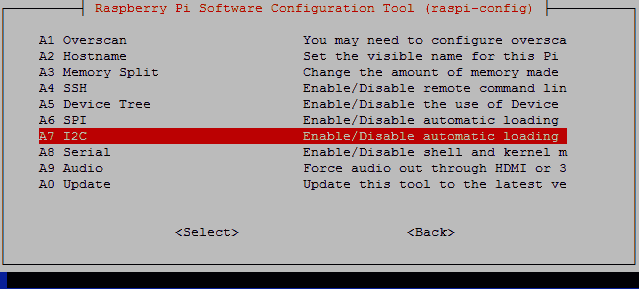

The raspi-config menu

从菜单中，选择 I2C，然后选择 Yes（是）以启用接口并默认加载模块。

The `raspi-config` program enables the `I2C_ARM` interface by altering `/boot/config.txt` to include `dtparam=i2c_arm=on`. The other bus (I2C_VC) is typically reserved for interfacing with Raspberry Pi HAT add-on boards (to read the configuration information from the on-board memory devices); however, you can enable this using `dtparam=i2c_vc=on`.

如果您愿意，还可以使用`raspi-config`列表启用 SPI，这是另一种总线类型。

接下来，我们应该包括在打开 Raspberry Pi 时加载的 I<sup>2</sup>C 模块，如下所示：

```py
sudo nano /etc/modules  
```

在单独的行中添加以下内容并保存（*Ctrl*+*X*、*Y*、*输入*：

```py
i2c-dev
i2c-bcm2708  
```

同样，我们也可以通过添加`spi-bcm2708`来启用 SPI 模块。

接下来，我们将安装一些工具，直接从命令行使用 I<sup>2</sup>C 设备，如下所示：

```py
sudo apt-get update
sudo apt-get install i2c-tools  
```

最后，在连接硬件之前关闭 Raspberry Pi，以便应用更改，如下所示：

```py
sudo halt  
```

您将需要一个 PCF8591 模块（这些模块的零售商在附录*硬件和软件列表*中列出），或者您可以单独获得 PCF8591 芯片并构建自己的电路（有关电路的详细信息，请参见*有更多…*部分）：

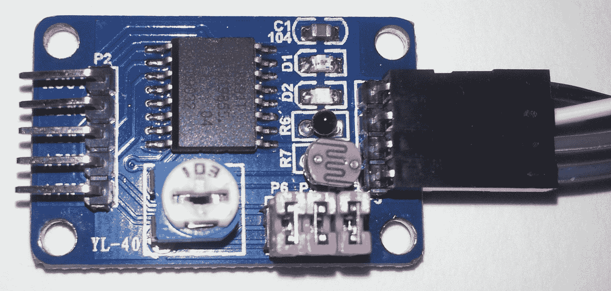

The PCF8591 ADC and sensor module from dx.com

将 GND、VCC、SDA 和 SCL 引脚连接至 Raspberry Pi GPIO 头，如下所示：


I2C connections on the Raspberry Pi GPIO header You can use the same I<sup>2</sup>C tools/code with other I<sup>2</sup>C devices by studying the datasheet of the device to find out what messages to send/read and which registers are used to control your device.

# 怎么做。。。

1.  `i2cdetect`命令用于检测 I<sup>2</sup>C 设备（`--y`选项跳过任何可能干扰 I<sup>2</sup>C 总线的其他硬件的警告）。以下命令用于扫描两条总线：

```py
sudo i2cdetect -y 0
sudo i2cdetect -y 1 
```

2.  根据您的 Raspberry Pi 板版本，设备的地址应列在总线 0（用于型号 B Rev1 板）或总线 1（用于 Raspberry Pi 2 和 3，以及 Raspberry Pi 1 型号 A 和型号 B revision 2）上。默认情况下，PCF8591 地址为`0x48`：

| **I<sup>2</sup>C 要使用的公交车号** | **公交车 00** | **总线 11** |
| RespberryPi 2 和 3 | 帽子 ID（I2C\U VC） | GPIO（I2C_ARM） |
| 模型 A 和模型 B 第 2 版 | P5 | GPIO |
| 模式 B 第 1 版 | GPIO | 不适用 |

3.  下面的屏幕截图显示了`i2cdetect`的输出：

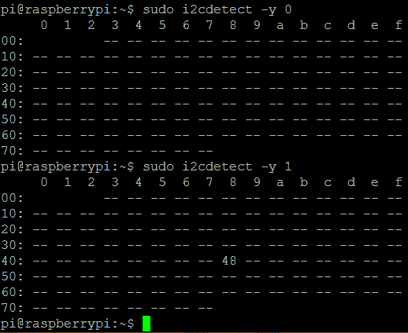

The PCF8591 address (48) is displayed here on bus 1

如果未列出任何内容，请关闭并仔细检查您的连接（来自[www.dx.com](http://www.dx.com/)的 ADC 模块在通电时将点亮红色 LED）。

If you receive an error stating that the `/dev/i2c1` bus doesn't exist, you can perform the following checks:

*   确保`/etc/modprobe.d/raspi-blacklist.conf`文件为空（即模块未被列入黑名单），使用以下命令查看该文件：

`           sudo nano /etc/modprobe.d/raspi-blacklist.conf`

*   如果文件中有任何内容（如`blacklist i2c-bcm2708`），请将其删除并保存

*   检查`/boot/config`并确保没有包含`device_tree_param=`的行（这将禁用对新设备树配置的支持，并禁用对某些 Raspberry Pi HAT 插件板的支持）

*   使用`lsmod`检查模块是否已加载，查找`i2c-bcm2708`和`i2c_dev`

4.  使用检测到的总线号（`0`或`1`和设备地址（`0x48`），使用`i2cget`从设备中读取（通电或通道改变后，您需要读取设备两次才能看到最新值），如下所示：

```py
sudo i2cget -y 1 0x48
sudo i2cget -y 1 0x48 
```

5.  要读取通道`1`（这是模块上的温度传感器），我们可以使用`i2cset`将`0x01`写入 PCF8591 控制寄存器。同样，使用两次读取从通道`1`获取新样本，如下所示：

```py
sudo i2cset -y 1 0x48 0x01
sudo i2cget -y 1 0x48
sudo i2cget -y 1 0x48
```

6.  要循环通过每个输入通道，请使用`i2cset`将控制寄存器设置为`0x04`，如下所示：

```py
sudo i2cset -y 1 0x48 0x04
```

7.  我们还可以使用以下命令控制 AOUT 引脚以将其完全打开（点亮 LED D1）：

```py
sudo i2cset -y 1 0x48 0x40 0xff 
```

8.  最后，我们可以使用以下命令将其完全关闭（关闭 LED D1）：

```py
sudo i2cset -y 1 0x48 0x40 0x00  
```

# 它是如何工作的。。。

设备开启后的第一次读取将返回`0x80`，并从通道 0 触发新样本。如果您再次读取，它将返回先前读取的样本并生成新样本。每个读数将是一个 8 位值（范围从`0`到`255`），表示到 VCC 的电压（在本例中为 0 V 到 3.3 V）。在[www.dx.com](http://www.dx.com)模块上，通道 0 连接到一个光传感器，因此如果您用手盖住模块并重新发送命令，您将观察到值的变化（越暗表示值越高，越亮表示值越低）。你会发现读数总是落后一个；这是因为，当它返回上一个样本时，它会捕获下一个样本。

我们使用以下命令指定要读取的特定通道：

```py
sudo i2cset -y 1 0x48 0x01  
```

这将更改读取到通道 1 的通道（在模块上标记为**AIN1**。请记住，在看到来自新选择通道的数据之前，需要执行两次读取。下表显示了通道和引脚名称，以及启用/禁用每个传感器的跨接接头：

| **频道** | **0** | **1** | **2** | **3** |
| 密码名 | AIN0 | AIN1 | AIN2 | AIN3 |
| 传感器 | 光敏电阻器 | 热敏电阻 | 外销 | 电位计 |
| 跳跃者 | P5 | P4 |  | P6 |

接下来，我们通过设置控制寄存器的模拟输出启用标志（位 6）并使用下一个值设置模拟电压（0V-3.3V，0x00-0xFF），控制 AOUT 引脚，如下所示：

```py
sudo i2cset -y 1 0x48 0x40 0xff   
```

最后，您可以将位 2（`0x04`设置为自动递增，并通过输入通道循环，如下所示：

```py
sudo i2cset -y 1 0x48 0x04
```

每次运行`i2cget -y 1 0x48`时，将选择下一个通道，从通道 AIN0 开始，然后从 AIN1 运行到 AIN3，然后再次返回到 AIN0。

To understand how to set a particular bit in a value, it helps to look at the binary representation of the number. The 8-bit value `0x04` can be written as `b0000 0100` in binary (`0x` indicates the value is written in hexadecimal, or hex, and b indicates a binary number).

二进制数中的位从右到左计数，从 0 开始-即 MSB 7 6 5 4 3 2 1 0 LSB。

位 7 被称为**最高有效位**（**MSB**），位 0 被称为**最低有效位**（**LSB**）。因此，通过设置位 2，我们最终得到了`b0000 0100`（即`0x04`。

# 还有更多。。。

I<sup>2</sup>C 总线允许我们只需几根电线即可轻松连接多个设备。PCF8591 芯片可用于将您自己的传感器连接到模块或芯片。

# 使用多个 I2C 设备

I<sup>2</sup>C 总线上的所有命令都发往特定的 I<sup>2</sup>C 设备（许多设备可以选择将一些引脚设置为高或低，以选择其他地址，并允许多个设备存在于同一总线上）。每个设备必须有一个唯一的地址，以便在任何时候只有一个设备响应。PCF8591 起始地址为`0x48`，三个地址引脚可选择附加地址至`0x4F`。这允许在同一总线上使用多达八个 PCF8591 设备。

If you decide to use the I2C_VC bus that is located on GPIO pins 27 and 2828 (or on the P5 header on Model A and Revision 2 Model B devices), you may need to add a 1k8 ohm pull-up resistor between the I<sup>2</sup>C lines and 3.3 V. These resistors are already present on the I<sup>2</sup>C bus on the GPIO connector. However, some I<sup>2</sup>C modules, including the PCF8591 module, have their own resistors fitted, so it will work without the extra resistors.

# I2C 总线与电平转换

I<sup>2</sup>C 总线由两根导线、一个数据（SDA）和一个时钟（SCL）组成。这两个都是被动拉到 VCC（在覆盆子 Pi 上，这是 3.3 V）与上拉电阻。Raspberry Pi 将通过每个周期将时钟拉低来控制时钟，Raspberry Pi 可将数据线拉低以发送命令，或通过连接的设备以数据响应：


The Raspberry Pi I<sup>2</sup>C pins include pull-up resistors on SDA and SCL

由于从设备只能将数据线拉至**GND**，因此该设备可能由 3.3 V 甚至 5 V 供电，而不会导致 GPIO 引脚电压过高（请记住，Raspberry Pi GPIO 无法处理超过 3.3 V 的电压）。只要设备的 I<sup>2</sup>C 总线能够识别出逻辑最大值为 3.3 V 而不是 5 V，该功能就可以工作。I<sup>2</sup>C 设备不得安装自己的上拉电阻器，因为这将导致 GPIO 引脚被拉至 I<sup>2</sup>C 设备的电源电压。

请注意，本章中使用的 PCF8591 模块已安装电阻器；因此，我们只能使用**VCC=3V3**。双向逻辑电平转换器可用于克服任何逻辑电平问题。**Adafruit**I<sup>2</sup>C 双向逻辑电平转换器模块就是这样一个设备，如下图所示：

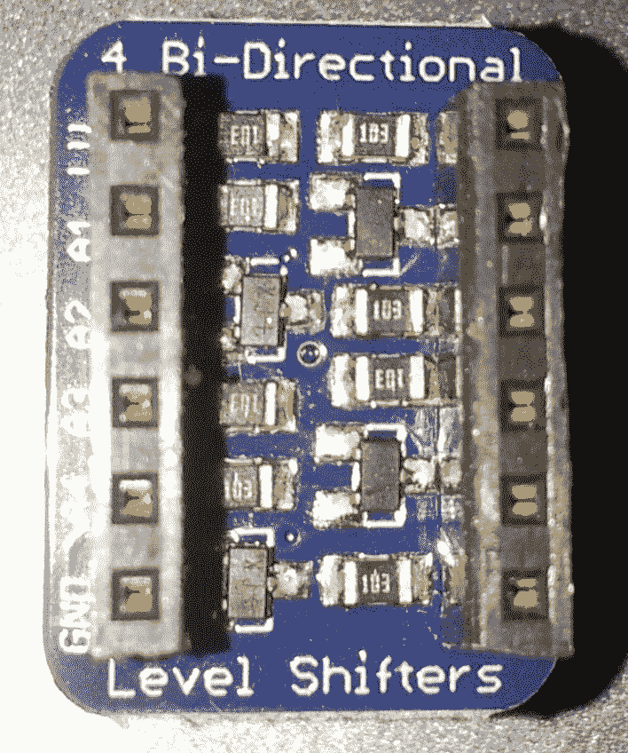

Adafruit I<sup>2</sup>C Bidirectional logic level translator module

除了确保所用设备的任何逻辑电压处于合适的水平外，它还将允许总线延伸到更长的电线上（电平移位器也将充当总线中继器）。

# 仅使用 PCF8591 芯片或添加替代传感器

未连接传感器的 PCF8591 模块的电路图如下图所示：


Circuit diagram of the PCF8591 module without sensor attachment

如您所见，除传感器外，只有五个附加组件。我们有一个功率滤波电容器（C1）和一个带限流电阻器（R5）的功率指示 LED（D2），所有这些都是可选的。

请注意，该模块包括两个 10K 上拉电阻器（R8 和 R9），用于 SCL 和 SDA 信号。但是，由于 Raspberry Pi 上的 GPIO I<sup>2</sup>C 连接也包括上拉电阻器，因此模块上不需要这些电阻器（可以移除）。这也意味着我们应该只将该模块连接到 VCC=3.3 V（如果我们使用 5 V，则 SCL 和 SDA 上的电压将在 3.56 V 左右，这对于 Raspberry Pi GPIO 引脚来说太高）。

PCF891 模块上的传感器都是电阻式的，因此随着传感器电阻的变化，模拟输入上的电压电平将在**GND**和**VCC**之间变化：


A potential divider circuit. This provides voltage proportional to the sensor's resistance.

该模块使用一种称为分压器的电路。顶部的电阻器平衡底部传感器提供的电阻，以提供介于**VCC**和**GND 之间的电压。**

分压器的输出电压（*V<sub>out</sub>*可计算如下：


R<sub>t</sub>和 R<sub>b</sub>分别为顶部和底部的电阻值，VCC 为电源电压。

根据调节器的位置，模块中的电位计在顶部和底部之间有 10K 欧姆的电阻。所以，一半的时候，我们每边有 5 欧姆，输出电压为 1.65 伏；四分之一的方向（顺时针方向），我们有 2.5K 欧姆和 7.5K 欧姆，产生 0.825V。

I haven't shown the AOUT circuit, which is a resistor and LED. However, as you will find, an LED isn't suited to indicate an analog output (except to show the on/off states).

对于更敏感的电路，您可以使用更复杂的电路，例如**惠斯通电桥**（允许检测电阻的微小变化），或者您可以使用基于其读数输出模拟电压的专用传感器（例如**TMP36**温度传感器）。PCF891 还支持差分输入模式，其中一个通道的输入可以与另一个通道的输入进行比较（结果读数将是两个通道之间的差值）。

有关 PCF8591 芯片的更多信息，请参阅[中的数据表 http://www.nxp.com/documents/data_sheet/PCF8591.pdf](http://www.nxp.com/documents/data_sheet/PCF8591.pdf) 。

# 使用模数转换器读取模拟数据

I<sup>2</sup>C 工具（在上一节中使用）对于在命令行中调试 I<sup>2</sup>C 设备非常有用，但它们不适合在 Python 中使用，因为它们速度慢并且需要大量开销。幸运的是，有几个 Python 库提供了 I<sup>2</sup>C 支持，允许有效地使用 I<sup>2</sup>C 与连接的设备通信，并提供了简单的操作。

我们将使用这样一个库来创建我们自己的 Python 模块，该模块将允许我们快速、轻松地从 ADC 设备获取数据，并在我们的程序中使用它。模块的设计方式是，在不影响其余示例的情况下，可以将其他硬件或数据源放置到位。

# 准备

要使用 Python 3 使用 I<sup>2</sup>C 总线，我们将使用*Gordon Henderson 的*WiringPi2（参见[http://wiringpi.com/](http://wiringpi.com/) 了解更多详细信息）。

安装`wiringpi2`最简单的方法是为 Python 3 使用`pip`。`pip`是 Python 的包管理器，其工作方式与`apt-get`类似。您希望安装的任何软件包都将从在线存储库中自动下载和安装。

要安装`pip`，请使用以下命令：

```py
sudo apt-get install python3-dev python3-pip  
```

然后，使用以下命令安装`wiringpi2`：

```py
sudo pip-3.2 install wiringpi2
```

安装完成后，您将看到以下内容，表示安装成功：


Successfully installed WiringPi2

您需要连接 PCF8591 模块，因为它以前用于 Raspberry Pi 的 I<sup>2</sup>C 连接：


The PCF8591 module and pin connections to the Raspberry Pi GPIO connector

# 怎么做。。。

在下一节中，我们将编写一个脚本，以允许我们收集数据，然后在本章后面使用这些数据。

创建以下脚本`data_adc.py`，如下所示：

1.  首先，导入模块并创建我们将使用的变量，如下所示：

```py
#!/usr/bin/env python3 
#data_adc.py 
import wiringpi2 
import time 

DEBUG=False 
LIGHT=0;TEMP=1;EXT=2;POT=3 
ADC_CH=[LIGHT,TEMP,EXT,POT] 
ADC_ADR=0x48 
ADC_CYCLE=0x04 
BUS_GAP=0.25 
DATANAME=["0:Light","1:Temperature", 
          "2:External","3:Potentiometer"] 
```

2.  使用构造函数创建`device`类进行初始化，如下所示：

```py
class device: 
  # Constructor: 
  def __init__(self,addr=ADC_ADR): 
    self.NAME = DATANAME 
    self.i2c = wiringpi2.I2C() 
    self.devADC=self.i2c.setup(addr) 
    pwrup = self.i2c.read(self.devADC) #flush powerup value 
    if DEBUG==True and pwrup!=-1: 
      print("ADC Ready") 
    self.i2c.read(self.devADC) #flush first value 
    time.sleep(BUS_GAP) 
    self.i2c.write(self.devADC,ADC_CYCLE) 
    time.sleep(BUS_GAP) 
    self.i2c.read(self.devADC) #flush first value 
```

3.  在类中，定义一个函数以提供通道名称列表，如下所示：

```py
def getName(self): 
  return self.NAME
```

4.  定义另一个函数（仍然是类的一部分）以从 ADC 通道返回一组新样本，如下所示：

```py
def getNew(self): 
  data=[] 
  for ch in ADC_CH: 
    time.sleep(BUS_GAP) 
    data.append(self.i2c.read(self.devADC)) 
  return data 
```

5.  最后，在设备类之后，创建一个测试函数来练习我们的新`device`类，如下所示。这仅在直接执行脚本时运行：

```py
def main(): 
  ADC = device(ADC_ADR) 
  print (str(ADC.getName())) 
  for i in range(10): 
    dataValues = ADC.getNew() 
    print (str(dataValues)) 
    time.sleep(1) 

if __name__=='__main__': 
  main() 
#End 
```

您可以使用以下命令运行此模块的测试功能：

```py
sudo python3 data_adc.py  
```

# 它是如何工作的。。。

我们从导入`wiringpi2`开始，以便稍后可以与 I<sup>2</sup>C 设备进行通信。我们将创建一个类来包含控制 ADC 所需的功能。当我们创建类时，我们可以初始化`wiringpi2`，这样它就可以使用 I<sup>2</sup>C 总线（使用`wiringpi2.I2C()`），并且我们将使用芯片的总线地址（使用`self.i2c.setup(0x48)`设置一个通用 I<sup>2</sup>C 设备。

`wiringpi2` also has a dedicated class to use with the PCF8591 chip; however, in this case, it is more useful to use the standard I<sup>2</sup>C functionality to illustrate how any I<sup>2</sup>C device can be controlled using `wiringpi2`. By referring to the device datasheet, you can use similar commands to communicate to any connected I<sup>2</sup>C device (whether it is directly supported or not).

与之前一样，我们执行设备读取并配置 ADC 在通道中循环，但我们使用`I2C`对象的`wiringpi2`读取和写入功能，而不是`i2cget`和`i2cset`。一旦初始化，设备将准备好读取每个通道上的模拟信号。

该类还将有两个成员函数。第一个函数`getName()`返回通道名称列表（我们可以使用该列表将数据与其源关联），第二个函数`getNew()`返回所有通道的一组新数据。使用`i2c.read()`功能从 ADC 读取数据，由于我们已经将其置于循环模式，每次读取将来自下一个通道。

当我们计划稍后重用这个类时，我们将使用`if __name__`测试来定义一个代码，以便在直接执行该文件时运行。在我们的`main()`函数中，我们创建了 ADC，它是我们新设备类的一个实例。如果需要，我们可以选择非默认地址；否则，将使用芯片的默认地址。我们使用`getName()`功能打印出通道名称，然后我们可以从`ADC`（使用`getNew()`采集数据并显示它们。

# 还有更多。。。

以下允许我们在`data_adc.py`中定义设备类的替代版本，以便替代 ADC 模块。这将允许在不需要任何特定硬件的情况下尝试本章的其余部分。

# 无硬件采集模拟数据

如果您没有可用的 ADC 模块，则可以使用 Raspberry Pi 中的大量数据。

创建`data_local.py`脚本，如下所示：

```py
#!/usr/bin/env python3 
#data_local.py 
import subprocess 
from random import randint 
import time 

MEM_TOTAL=0 
MEM_USED=1 
MEM_FREE=2 
MEM_OFFSET=7 
DRIVE_USED=0 
DRIVE_FREE=1 
DRIVE_OFFSET=9 
DEBUG=False 
DATANAME=["CPU_Load","System_Temp","CPU_Frequency", 
          "Random","RAM_Total","RAM_Used","RAM_Free", 
          "Drive_Used","Drive_Free"] 

def read_loadavg(): 
  # function to read 1 minute load average from system uptime 
  value = subprocess.check_output( 
            ["awk '{print $1}' /proc/loadavg"], shell=True) 
  return float(value) 

def read_systemp(): 
  # function to read current system temperature 
  value = subprocess.check_output( 
            ["cat /sys/class/thermal/thermal_zone0/temp"], 
            shell=True) 
  return int(value) 

def read_cpu(): 
  # function to read current clock frequency 
  value = subprocess.check_output( 
            ["cat /sys/devices/system/cpu/cpu0/cpufreq/"+ 
             "scaling_cur_freq"], shell=True) 
  return int(value) 

def read_rnd(): 
  return randint(0,255) 

def read_mem(): 
  # function to read RAM info 
  value = subprocess.check_output(["free"], shell=True) 
  memory=[] 
  for val in value.split()[MEM_TOTAL+ 
                           MEM_OFFSET:MEM_FREE+ 
                           MEM_OFFSET+1]: 
    memory.append(int(val)) 
  return(memory) 

def read_drive(): 
  # function to read drive info 
  value = subprocess.check_output(["df"], shell=True) 
  memory=[] 
  for val in value.split()[DRIVE_USED+ 
                           DRIVE_OFFSET:DRIVE_FREE+ 
                           DRIVE_OFFSET+1]: 
    memory.append(int(val)) 
  return(memory) 

class device: 
  # Constructor: 
  def __init__(self,addr=0): 
    self.NAME=DATANAME 

  def getName(self): 
    return self.NAME 

  def getNew(self): 
    data=[] 
    data.append(read_loadavg()) 
    data.append(read_systemp()) 
    data.append(read_cpu()) 
    data.append(read_rnd()) 
    memory_ram = read_mem() 
    data.append(memory_ram[MEM_TOTAL]) 
    data.append(memory_ram[MEM_USED]) 
    data.append(memory_ram[MEM_FREE]) 
    memory_drive = read_drive() 
    data.append(memory_drive[DRIVE_USED]) 
    data.append(memory_drive[DRIVE_FREE]) 
    return data 

def main(): 
  LOCAL = device() 
  print (str(LOCAL.getName())) 
  for i in range(10): 
    dataValues = LOCAL.getNew() 
    print (str(dataValues)) 
    time.sleep(1) 

if __name__=='__main__': 
  main() 
#End 
```

前面的脚本允许我们使用以下命令从 Raspberry Pi 收集系统信息（`subprocess`模块允许我们捕获结果并进行处理）：

*   CPU 速度：

```py
cat /sys/devices/system/cpu/cpu0/cpufreq/scaling_cur_freq  
```

*   CPU 负载：

```py
awk '{print $1}' /proc/loadavg
```

*   堆芯温度（按 1000 标度）：

```py
cat /sys/class/thermal/thermal_zone0/temp  
```

*   驱动器信息：

```py
df  
```

*   RAM 信息：

```py
free  
```

使用其中一个函数对每个数据项进行采样。对于驱动器和 RAM 信息，我们将响应拆分为一个列表（用空格分隔），并选择要监视的项目（如可用内存和已用驱动器空间）。

这与`data_adc.py`文件和`device`类的功能打包方式相同（因此，您可以通过将`data_adc`包含替换为`data_local`来选择在以下示例中使用其中一种）。

# 测井和绘图数据

既然我们能够对大量数据进行采样和收集，我们就必须能够捕获和分析这些数据。为此，我们将使用一个名为`matplotlib`的 Python 库，其中包含许多用于操作、绘制和分析数据的有用工具。我们将使用`pyplot`（它是`matplotlib`的一部分）生成捕获数据的图形。有关`pyplot`的更多信息，请访问[http://matplotlib.org/users/pyplot_tutorial.html](http://matplotlib.org/users/pyplot_tutorial.html) 。

它是一个针对 Python 的 MATLAB 风格的数据可视化框架。

# 准备

要使用`pyplot`，我们需要安装`matplotlib`。

Because of a problem with the `matplotlib` installer, performing the installation using `pip-3.2` doesn't always work correctly. The method that follows will overcome this problem by performing all the steps `pip` does manually; however, this can take over 30 minutes to complete.

为了节省时间，您可以尝试`pip`安装，这要快得多。如果它不工作，您可以使用前面提到的手动方法安装它。

使用以下命令尝试使用`pip`安装`matplotlib`：

`  sudo apt-get install tk-dev python3-tk libpng-dev`
`  sudo pip-3.2 install numpy`
`  sudo pip-3.2 install matplotlib`

您可以通过运行`python3`并尝试从 Python 终端导入来确认`matplotlib`已安装，如下所示：

```py
import matplotlib  
```

If the installation fails, it will respond with the following:

`  ImportError: No module named matplotlib`

否则，就不会有错误。

使用以下步骤手动安装`matplotlib`：

1.  按如下方式安装支持包：

```py
sudo apt-get install tk-dev python3-tk python3-dev libpng-dev
sudo pip-3.2 install numpy
sudo pip-3.2 install matplotlib  
```

2.  从 Git 存储库下载源文件（命令应为单行），如下所示：

```py
wget https://github.com/matplotlib/matplotlib/archive/master.zip
```

3.  解压缩并打开创建的`matplotlib-master`文件夹，如下所示：

```py
unzip master.zip
rm master.zip
cd matplotlib-master
```

4.  运行要生成的安装文件（这需要一段时间）并按如下方式安装：

```py
sudo python3 setup.py build
sudo python3 setup.py install  
```

5.  以与自动安装相同的方式测试安装。

我们需要 PCF8591 ADC 模块（和前面一样安装的`wiringpi2`，或者我们可以使用上一节中的`data_local.py`模块（只需在脚本的导入部分将`data_adc`替换为`data_local`。我们还需要将`data_adc.py`和`data_local.py`与新脚本放在同一目录中，具体取决于您使用的脚本。

# 怎么做。。。

1.  创建一个名为`log_adc.py`的脚本：

```py
#!/usr/bin/python3 
#log_adc.c 
import time 
import datetime 
import data_adc as dataDevice 

DEBUG=True 
FILE=True 
VAL0=0;VAL1=1;VAL2=2;VAL3=3 #Set data order 
FORMATHEADER = "t%st%st%st%st%s" 
FORMATBODY = "%dt%st%ft%ft%ft%f" 

if(FILE):f = open("data.log",'w') 

def timestamp(): 
  ts = time.time()  
  return datetime.datetime.fromtimestamp(ts).strftime( 
                                    '%Y-%m-%d %H:%M:%S') 

def main(): 
    counter=0 
    myData = dataDevice.device() 
    myDataNames = myData.getName() 
    header = (FORMATHEADER%("Time", 
                        myDataNames[VAL0],myDataNames[VAL1], 
                        myDataNames[VAL2],myDataNames[VAL3])) 
    if(DEBUG):print (header) 
    if(FILE):f.write(header+"n") 
    while(1): 
      data = myData.getNew() 
      counter+=1 
      body = (FORMATBODY%(counter,timestamp(), 
                        data[0],data[1],data[2],data[3])) 
      if(DEBUG):print (body) 
      if(FILE):f.write(body+"n") 
      time.sleep(0.1) 

try: 
  main() 
finally: 
  f.close() 
#End 
```

2.  创建第二个名为`log_graph.py`的脚本，如下所示：

```py
#!/usr/bin/python3 
#log_graph.py 
import numpy as np 
import matplotlib.pyplot as plt 

filename = "data.log" 
OFFSET=2 
with open(filename) as f: 
    header = f.readline().split('t') 

data = np.genfromtxt(filename, delimiter='t', skip_header=1, 
                    names=['sample', 'date', 'DATA0', 
                           'DATA1', 'DATA2', 'DATA3']) 
fig = plt.figure(1) 
ax1 = fig.add_subplot(211)#numrows, numcols, fignum 
ax2 = fig.add_subplot(212) 
ax1.plot(data['sample'],data['DATA0'],'r', 
         label=header[OFFSET+0]) 
ax2.plot(data['sample'],data['DATA1'],'b', 
         label=header[OFFSET+1]) 
ax1.set_title("ADC Samples")     
ax1.set_xlabel('Samples') 
ax1.set_ylabel('Reading') 
ax2.set_xlabel('Samples') 
ax2.set_ylabel('Reading') 

leg1 = ax1.legend() 
leg2 = ax2.legend() 

plt.show() 
#End 
```

# 它是如何工作的。。。

第一个脚本`log_adc.py`允许我们收集数据并将其写入日志文件。

我们可以通过导入`data_adc`作为`dataDevice`来使用 ADC 设备，也可以导入`data_local`来使用系统数据。通过`VAL0`至`VAL3`的编号，我们可以更改通道的顺序（如果使用`data_local`设备，请选择其他通道）。我们还可以使用`%s`、`%d`和`%f`定义日志文件中标题和每一行的格式字符串（创建一个数据以制表符分隔的文件），以允许我们替换字符串、整数和浮点值，如下表所示：


The table of data captured from the ADC sensor module

登录文件时（当`FILE=True`时），我们使用`'w'`选项以写模式打开`data.log`（这将覆盖任何现有文件；要附加到文件，请使用`'a'`。

作为数据日志的一部分，我们使用`time`和`datetime`生成`timestamp`，以使用`time.time()`命令获取当前**历元时间**（这是自 1970 年 1 月 1 日以来的毫秒数）。我们使用`strftime()`将值转换为更友好的`year-month-day hour:min:sec`格式。

`main()`函数首先创建`device`类的一个实例（我们在上一个示例中创建了这个实例），该实例将提供数据。我们从`data`设备获取通道名称并构造`header`字符串。如果`DEBUG`设置为`True`，则将数据打印到屏幕上；如果`FILE`设置为`True`，则会写入文件。

在主循环中，我们使用设备的`getNew()`功能来收集数据并将其格式化以显示在屏幕上或记录到文件中。使用`try: finally:`命令调用`main()`函数，这将确保脚本中止时，文件将正确关闭。

第二个脚本`log_graph.py`允许我们读取日志文件并生成记录数据的图表，如下图所示：

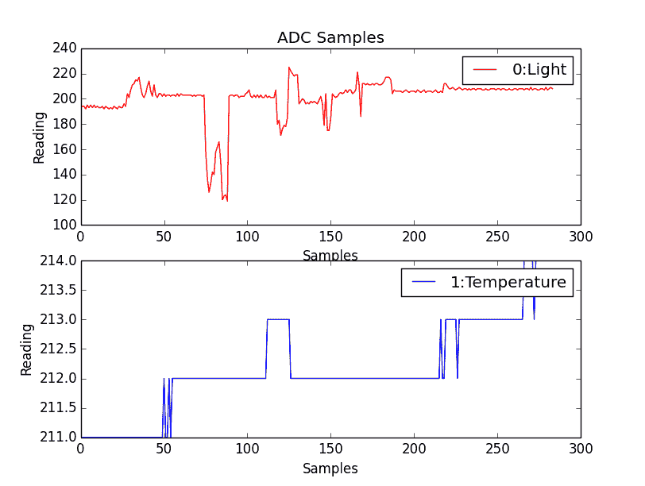

Graphs produced by log_graph.py from the light and temperature sensors

我们首先打开日志文件并读取第一行；它包含标题信息（我们可以稍后使用它来标识数据）。接下来，我们使用`numpy`，这是一个专业的 Python 库，它扩展了我们如何操作数据和数字。在本例中，我们使用它从文件中读入数据，根据制表符分隔符将其拆分，并为每个数据通道提供标识符。

我们定义了一个图形来保存图形，添加了两个子图（位于网格中位置 1 和 2 处的 2x1 网格中-由值`211`和`212`设置）。接下来，我们定义要绘制的值，提供`x`值（`data['sample']`）、`y`值（`data['DATA0']`）、`color`值（`Red`的`'r'`或`Blue`的`'b'`和`label`（设置为我们之前从文件顶部读取的标题文本）。

最后，我们为每个子批次设置标题和`x`和`y`标签，启用图例（显示标签），并显示绘图（使用`plt.show()`。

# 还有更多。。。

现在，我们已经能够看到我们捕获的数据，我们可以在采样时显示数据，从而进一步了解情况。这将使我们能够立即看到数据对环境或刺激变化的反应。我们还可以校准我们的数据，以便我们可以指定适当的比例，以产生实际单位的测量值。

# 绘制实时数据

除了从文件中绘制数据外，我们还可以在采样时使用`matplotlib`绘制传感器数据。为了实现这一点，我们可以使用`plot-animation`功能，它自动调用一个函数来收集新数据并更新绘图。

创建以下脚本，称为`live_graph.py`：

```py
#!/usr/bin/python3 
#live_graph.py 
import numpy as np 
import matplotlib.pyplot as plt 
import matplotlib.animation as animation 
import data_local as dataDevice 

PADDING=5 
myData = dataDevice.device() 
dispdata = [] 
timeplot=0 
fig, ax = plt.subplots() 
line, = ax.plot(dispdata) 

def update(data): 
  global dispdata,timeplot 
  timeplot+=1 
  dispdata.append(data) 
  ax.set_xlim(0, timeplot) 
  ymin = min(dispdata)-PADDING 
  ymax = max(dispdata)+PADDING 
  ax.set_ylim(ymin, ymax) 
  line.set_data(range(timeplot),dispdata) 
  return line 

def data_gen(): 
  while True: 
    yield myData.getNew()[1]/1000 

ani = animation.FuncAnimation(fig, update,  
                              data_gen, interval=1000) 
plt.show() 
#End 
```

我们首先定义`dataDevice`对象并创建一个空数组`dispdata[]`，该数组将保存已收集的所有数据。接下来，我们定义子图和要绘制的线。

`FuncAnimation()`函数允许我们通过定义更新函数和生成器函数来更新图形（`fig`。发电机功能（`data_gen()`将每隔 1000 毫秒调用一次，并产生一个数据值。

本例使用的堆芯温度读数除以 1000 时，给出了`degC`中的实际温度：

To use the ADC data instead, change the import for `dataDevice` to `data_adc` and adjust the following line to use a channel other than `[1]` and apply a scaling that is different from 1,000:

`yield myData.getNew()[1]/1000`

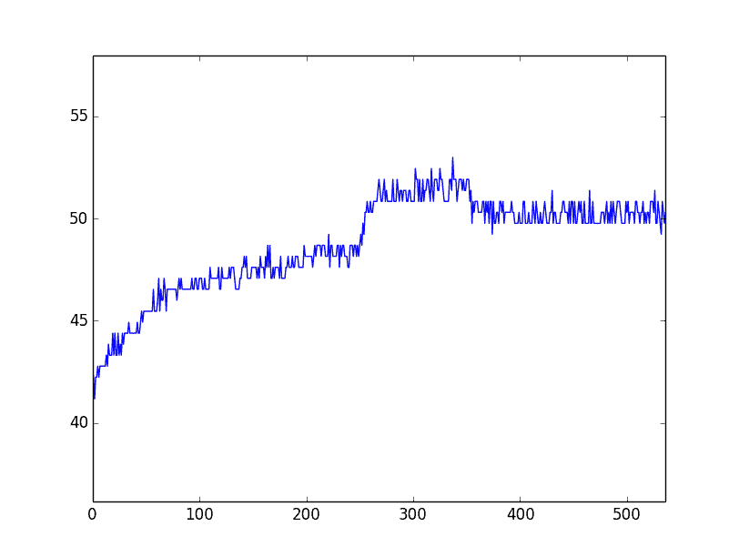

Raspberry Pi plotting in real time

数据值被传递到`update()`函数，该函数允许我们将其添加到`dispdata[]`数组中，该数组将包含要在绘图中显示的所有数据值。我们将*x*轴范围调整为接近数据的`min`和`max`值。我们还调整*y*轴，使其随着我们继续采样更多数据而增长。

The `FuncAnimation()` function requires the `data_gen()` object to be a special type of function called a `generator`. A `generator` function produces a continuous series of values each time it is called, and can even use its previous state to calculate the next value if required. This is used to perform continuous calculations for plotting; this is why it is used here. In our case, we just want to run the same sampling function (`new_data()`) continuously so that each time it is called, it will yield a new sample.

最后，我们使用`dispdata[]`数组（使用`set_data()`函数）更新*x*和*y*轴数据，该数组将根据采样的秒数绘制样本。要使用其他数据或从 ADC 绘制数据，请调整`dataDevice`的导入，并在`data_gen()`功能中选择所需的通道（和缩放）。

# 缩放和校准数据

您可能已经注意到，有时很难解释从 ADC 读取的数据，因为该值只是一个数字。数字本身并没有多大帮助；它所能告诉您的只是环境比上一个示例稍微热一些或稍暗一些。但是，如果可以使用其他设备提供可比较的值（如当前室温），则可以校准传感器数据以提供更有用的真实信息。

为了获得粗略校准，我们将使用两个样本创建一个线性拟合模型，然后该模型可用于估计其他 ADC 读数的真实值（这假设传感器本身的响应基本上是线性的）。下图显示了使用 25℃和 30℃下的两个读数的线性拟合图，提供了其他温度下的估计 ADC 值：

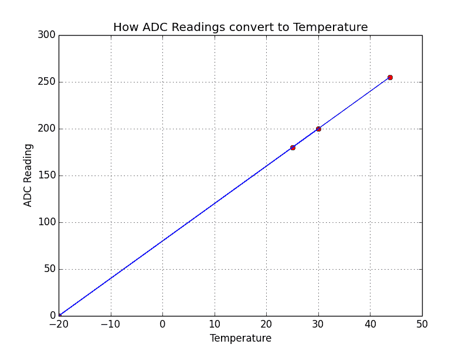

Samples are used to linearly calibrate temperature sensor readings

我们可以使用以下函数计算我们的模型：

```py
def linearCal(realVal1,readVal1,realVal2,readVal2): 
  #y=Ax+C 
  A = (realVal1-realVal2)/(readVal1-readVal2) 
  C = realVal1-(readVal1*A) 
  cal = (A,C) 
  return cal 
```

这将返回`cal`，其中将包含模型坡度（`A`和偏移量（`C`。

然后，我们可以使用以下函数，通过使用该通道的计算`cal`值来计算任何读数的值：

```py
def calValue(readVal,cal = [1,0]): 
  realVal = (readVal*cal[0])+cal[1] 
  return realVal 
```

为了获得更高的精度，如果需要，可以采集多个样本并在值之间使用线性插值（或将数据拟合到其他更复杂的数学模型）。

# 使用 I/O 扩展器扩展 Raspberry Pi GPIO

正如我们所看到的，使用高级总线协议可以让我们快速、轻松地连接到更复杂的硬件。通过使用 I<sup>2</sup>C 扩展 Raspberry Pi 上的可用 I/O，以及提供额外的电路保护（在某些情况下，还可以提供额外的电源来驱动更多硬件），I<sup>2</sup>C 可以得到极大的利用。

有很多设备可以通过 I<sup>2</sup>C 总线（以及 SPI）提供 I/O 扩展，但最常用的是 28 针设备 MCP23017，它提供 16 个额外的数字输入/输出引脚。作为一个 I<sup>2</sup>C 设备，它只需要两个信号（SCL 和 SDA 连接，加上接地和电源），并且可以与同一总线上的其他 I<sup>2</sup>C 设备一起愉快地工作。

我们将看到 Adafruit I<sup>2</sup>C16x2 RGB LCD Pi 板如何利用这些芯片之一通过 I<sup>2</sup>C 总线控制 LCD 字母数字显示器和键盘（如果没有 I/O 扩展器，通常需要多达 15 个 GPIO 引脚）。

来自其他制造商的电路板也将起作用。16x2 液晶显示模块和 I<sup>2</sup>C-to-serial 接口模块可以组合在一起，形成我们自己的低成本 I<sup>2</sup>C 液晶显示模块。

# 准备

您将需要 Adafruit I<sup>2</sup>C 16x2 RGB LCD Pi 板（还包括五个键盘按钮），如下图所示：

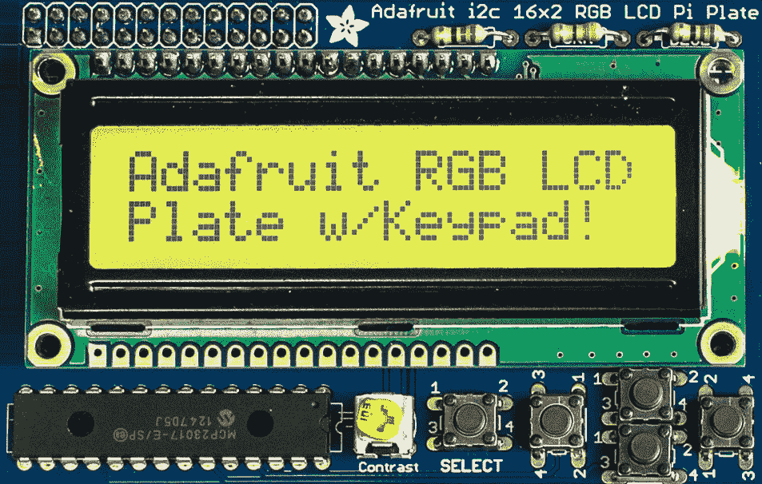

Adafruit I<sup>2</sup>C 16x2 RGB LCD Pi Plate with keypad buttons

Adafruit I<sup>2</sup>C 16x2 RGB LCD Pi 板直接连接到树莓 Pi 的 GPIO 连接器。

如前所述，我们可以使用 PCF8591 ADC 模块或使用上一节中的`data_local.py`模块（在脚本的导入部分使用`data_adc`或`data_local`。`data_adc.py`和`data_local.py`文件应与新脚本位于同一目录中。

The LCD Pi Plate only requires four pins (SDA, SCL, GND, and 5V); it connects over the whole GPIO header. If we want to use it with other devices, such as the PCF8591 ADC module, then something similar to a TriBorg from PiBorg (which splits the GPIO port into three) can be used to add ports.

# 怎么做。。。

1.  创建以下脚本，称为`lcd_i2c.py`：

```py
#!/usr/bin/python3 
#lcd_i2c.py 
import wiringpi2 
import time 
import datetime 
import data_local as dataDevice 

AF_BASE=100 
AF_E=AF_BASE+13;     AF_RW=AF_BASE+14;   AF_RS=AF_BASE+15 
AF_DB4=AF_BASE+12;   AF_DB5=AF_BASE+11;  AF_DB6=AF_BASE+10 
AF_DB7=AF_BASE+9 

AF_SELECT=AF_BASE+0; AF_RIGHT=AF_BASE+1; AF_DOWN=AF_BASE+2 
AF_UP=AF_BASE+3;     AF_LEFT=AF_BASE+4;  AF_BACK=AF_BASE+5 

AF_GREEN=AF_BASE+6;  AF_BLUE=AF_BASE+7;  AF_RED=AF_BASE+8 
BNK=" "*16 #16 spaces 

def gpiosetup(): 
  global lcd 
  wiringpi2.wiringPiSetup() 
  wiringpi2.mcp23017Setup(AF_BASE,0x20) 
  wiringpi2.pinMode(AF_RIGHT,0) 
  wiringpi2.pinMode(AF_LEFT,0) 
  wiringpi2.pinMode(AF_SELECT,0) 
  wiringpi2.pinMode(AF_RW,1) 
  wiringpi2.digitalWrite(AF_RW,0) 
  lcd=wiringpi2.lcdInit(2,16,4,AF_RS,AF_E, 
                        AF_DB4,AF_DB5,AF_DB6,AF_DB7,0,0,0,0) 

def printLCD(line0="",line1=""): 
  wiringpi2.lcdPosition(lcd,0,0) 
  wiringpi2.lcdPrintf(lcd,line0+BNK) 
  wiringpi2.lcdPosition(lcd,0,1) 
  wiringpi2.lcdPrintf(lcd,line1+BNK) 

def checkBtn(idx,size): 
  global run 
  if wiringpi2.digitalRead(AF_LEFT): 
    idx-=1 
    printLCD() 
  elif wiringpi2.digitalRead(AF_RIGHT): 
    idx+=1 
    printLCD() 
  if wiringpi2.digitalRead(AF_SELECT): 
    printLCD("Exit Display") 
    run=False 
  return idx%size 

def main(): 
  global run 
  gpiosetup() 
  myData = dataDevice.device() 
  myDataNames = myData.getName() 
  run=True 
  index=0 
  while(run): 
    data = myData.getNew() 
    printLCD(myDataNames[index],str(data[index])) 
    time.sleep(0.2) 
    index = checkBtn(index,len(myDataNames)) 

main() 
#End 
```

2.  连接 LCD 模块后，按如下方式运行脚本：

```py
sudo python3 lcd_i2c.py  
```

使用左右按钮选择要显示的数据通道，然后按选择按钮退出。

# 它是如何工作的。。。

`wiringpi2`库对 I/O 扩展器芯片有很好的支持，就像用于 Adafruit LCD 字符模块的芯片一样。要使用 Adafruit 模块，我们需要为 MCP23017 端口 A 的所有引脚设置引脚映射，如下表所示（然后，我们设置偏移量为`100`的 I/O 扩展器引脚）：

| **名称** | **选择** | **对** | **向下** | **向上** | **左** | **绿色** | **蓝色** | **红色** |
| MCP23017 端口 A | A0 | A1 | A2 | A3 | A4 | A6 | A7 | A8 |
| 接线针 | 100 | 101 | 102 | 103 | 104 | 106 | 107 | 108 |

所有 MCP23017 端口 B 引脚的引脚映射如下：

| **名称** | **DB7** | **DB6** | **DB5** | **DB4** | **E** | **RW** | **RS** |
| MCP23017 端口 B | 地下一层 | 地下二层 | 地下三层 | B4 | B5 | B6 | B7 |
| 接线针 | 109 | 110 | 111 | 112 | 113 | 114 | 115 |

为了设置 LCD 屏幕，我们初始化`wiringPiSetup()`和 I/O 扩展器`mcp23017Setup()`。然后指定 I/O 扩展器的引脚偏移量和总线地址。接下来，我们将所有硬件按钮设置为输入（使用`pinMode(pin number,0)`，并将 LCD 的 RW 引脚设置为输出。`wiringpi2`LCD 库希望 RW 引脚设置为`LOW`（强制进入只读模式），因此我们将引脚设置为`LOW`（使用`digitalWrite(AF_RW,0)`。

我们通过定义屏幕的行数和列数并说明我们使用的是 4 位还是 8 位数据模式（我们使用 8 条数据线中的 4 条，因此我们将使用 4 位模式），来创建一个`lcd`对象。我们还提供了我们正在使用的管脚的管脚映射（最后四个管脚被设置为`0`，因为我们只使用了四条数据线）。

现在，我们将创建一个名为`PrintLCD()`的函数，该函数将允许我们发送字符串以显示显示器的每一行。我们使用`lcdPosition()`为每行设置`lcd`对象上的光标位置，然后打印每行的文本。我们还在每行末尾添加一些空格，以确保覆盖整行。

下一个功能`checkBtn()`简要检查左/右和选择按钮，查看它们是否被按下（使用`digitalRead()`功能）。如果已按下左/右按钮，则索引将设置为数组中的上一个/下一个项目。如果按下选择按钮，`run`标志设置为`False`（这将退出主循环，允许脚本完成）。

`main()`函数调用`gpiosetup()`创建我们的`lcd`对象；然后，我们创建`dataDevice`对象并获取数据名。在主循环中，我们得到新的数据；然后，我们使用`printLCD()`函数在顶行显示数据名称，在第二行显示数据值。最后，我们检查按钮是否被按下，并根据需要设置数据索引。

# 还有更多。。。

使用诸如 MCP23017 之类的扩展器芯片提供了一种极好的方法来增加与 Raspberry Pi 的硬件连接量，同时还提供了额外的保护层（更换扩展器芯片 Raspberry Pi 更便宜）。

# I/O 扩展器电压和极限

端口扩展器在使用时仅使用少量电源，但如果使用 3.3 V 电源为其供电，则您仍然只能从所有管脚中总共提取 50 mA 的最大电流。如果耗电过多，则可能会遇到系统冻结或 SD 卡上的读/写损坏。

如果您使用 5V 电源为扩展器供电，则只要您的 USB 电源足够强大，就可以使用扩展器所能支持的最大功率（每个引脚的最大功率约为 25 mA，总共 125 mA）。

我们必须记住，如果扩展器使用 5V 电源供电，则输入/输出和中断线也将为 5V，并且不得连接回 Raspberry Pi（不使用电平移位器将电压转换为 3.3V）。

通过改变扩展器芯片上地址引脚（A0、A1 和 A2）的布线，同一 I<sup>2</sup>C 总线上最多可同时使用八个模块。为了确保每个电源都有足够的可用电流，我们需要使用单独的 3.3 V 电源。线性稳压器（如 LM1117-3.3）将是合适的（这将在 3.3 V 下提供高达 800 mA 的电压，每个稳压器 100 mA），并且只需要以下简单电路：

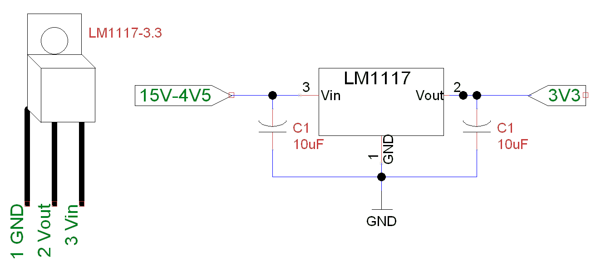

The LM1117 linear voltage regulator circuit

下图显示了如何将电压调节器连接到 I/O 扩展器（或其他设备）以提供更多电流以驱动额外硬件：


Using a voltage regulator with the Raspberry Pi

输入电压（Vin）由 Raspberry Pi 提供（例如，来自 GPIO 引脚头，例如 5 V 引脚 2）。但是，Vin 可以由任何其他电源（或电池组）提供，只要它在 4.5 V 和 15 V 之间，并且能够提供足够的电流。重要的部分是确保 Raspberry Pi 的接地连接（GND）、电源（如果使用单独的电源）、调节器和 I/O 扩展器都连接在一起（作为公共接地）。

# 使用您自己的 I/O 扩展器模块

您可以使用一个可用的 I/O 扩展器模块（或以下电路中的 MCP23017 芯片）来控制大多数与 HD44780 兼容的 LCD 显示器：

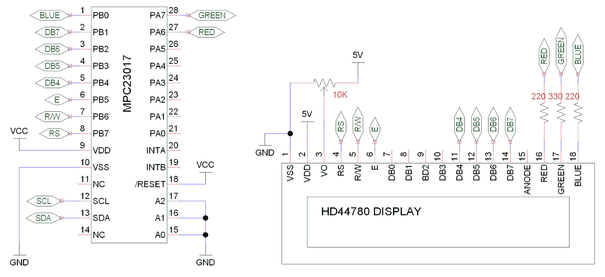

The I/O expander and a HD44780-compatible display

D-Pad 电路，u*使用 Python 驱动硬件*，也可以连接到扩展器的剩余端口 A 引脚（`PA0`到按钮 1，`PA1`到右，`PA2`到下，`PA3`到上，`PA4`到左，`PA5`到按钮 2）。如前一示例所示，按钮将为`PA0`至`PA4`（WiringPi 引脚编号 100 至 104）；除此之外，我们还在`PA5`中添加了第二个按钮（WiringPi 引脚编号 105）。

# 直接控制 LCD 字母数字显示器

或者，您也可以通过以下连接直接从 Raspberry Pi 驱动屏幕：

We are not using the I<sup>2</sup>C bus here.

| **液晶显示器** | **VSS** | **VDD** | **V0** | **RS** | **RW** | **E** | **DB4** | **DB5** | **DB6** | **DB7** |
| **LCD 引脚** | 1. | 2. | 3. | 4. | 5. | 6. | 11 | 12 | 13 | 14 |
| **覆盆子皮 GPIO** | 6（GND） | 2（5 伏） | 明显的差异 | 11 | 13（GND） | 15 | 12 | 16 | 18 | 22 |

上表列出了 Raspberry Pi 与 HD44780 兼容的字母数字显示模块之间所需的连接。

对比管脚（V0）可以像以前一样连接到可变电阻器（一侧连接到 5 V 电源，另一侧连接到 GND）；不过，根据屏幕的不同，您可能会发现可以直接连接到 GND/5 V 以获得最大对比度。

`wiringpi2`LCD 库假设 RW 引脚连接到 GND（只读）；这避免了 LCD 直接连接到 Raspberry Pi 时将数据发送回的风险（这将是一个问题，因为屏幕由 5 V 供电，并将使用 5 V 逻辑发送数据）。

确保使用新的`AF_XX`参考更新代码，并通过更改`gpiosetup()`功能内的设置来参考物理 pin 码。我们也可以跳过 MCP23017 设备的设置。

请查看以下命令：

```py
wiringpi2.wiringPiSetup()
wiringpi2.mcp23017Setup(AF_BASE,0x20)  
```

用以下命令替换前面的命令：

```py
wiringpi.wiringPiSetupPhys()  
```

您可以看到，我们只需更改管脚引用即可在使用 I/O 扩展器和不使用 I/O 扩展器之间切换，这表明了`wiringpi2`实现是多么方便。

# 在 SQLite 数据库中捕获数据

数据库是存储大量结构化数据的完美方式，同时保持访问和搜索特定数据的能力。**结构化查询语言**（**SQL**是一组标准化的命令集，用于更新和查询数据库。对于本例，我们将使用 SQLite（SQL 数据库系统的轻量级、自包含的实现）。

在本章中，我们将从 ADC（或本地数据源）收集原始数据，并构建自己的数据库。然后，我们可以使用一个名为`sqlite3`的 Python 库向数据库添加数据，然后查询它：

```py
   ##            Timestamp  0:Light  1:Temperature   2:External  3:Potentiometer 
    0 2015-06-16 21:30:51      225            212          122              216 
    1  2015-06-16 21:30:52      225            212          148              216 
    2  2015-06-16 21:30:53      225            212          113              216 
    3  2015-06-16 21:30:54      225            212          137              216 
    4  2015-06-16 21:30:55      225            212          142              216 
    5  2015-06-16 21:30:56      225            212          115              216 
    6  2015-06-16 21:30:57      225            212          149              216 
    7  2015-06-16 21:30:58      225            212          128              216 
    8  2015-06-16 21:30:59      225            212          123              216 
    9  2015-06-16 21:31:02      225            212          147              216  
```

# 准备

为了捕获数据库中的数据，我们将安装 SQLite，以便它可以与 Python 的`sqlite3`内置模块一起使用。使用以下命令安装 SQLite：

```py
sudo apt-get install sqlite3  
```

接下来，我们将使用 SQLite 执行一些基本操作，以了解如何使用 SQL 查询。

直接运行 SQLite，使用以下命令创建一个新的`test.db`数据库文件：

```py
sqlite3 test.db
SQLite version 3.7.13 2012-06-11 02:05:22
Enter ".help" for instructions
Enter SQL statements terminated with a ";"
sqlite>  
```

这将打开一个 SQLite 控制台，在其中我们直接输入 SQL 命令。例如，以下命令将创建新表、添加一些数据、显示内容，然后删除该表：

```py
CREATE TABLE mytable (info TEXT, info2 TEXT,);
INSERT INTO mytable VALUES ("John","Smith");
INSERT INTO mytable VALUES ("Mary","Jane");
John|Smith
Mary|Jane
DROP TABLE mytable;
.exit  
```

您将需要与上一个配方相同的硬件设置，如使用 I<sup>2</sup>C 总线配方的设备的*中的*准备*部分所述。*

# 怎么做。。。

创建以下脚本，称为`mysqlite_adc.py`：

```py
#!/usr/bin/python3 
#mysql_adc.py 
import sqlite3 
import datetime 
import data_adc as dataDevice 
import time 
import os 

DEBUG=True 
SHOWSQL=True 
CLEARDATA=False 
VAL0=0;VAL1=1;VAL2=2;VAL3=3 #Set data order 
FORMATBODY="%5s %8s %14s %12s %16s" 
FORMATLIST="%5s %12s %10s %16s %7s" 
DATEBASE_DIR="/var/databases/datasite/" 
DATEBASE=DATEBASE_DIR+"mydatabase.db" 
TABLE="recordeddata" 
DELAY=1 #approximate seconds between samples 

def captureSamples(cursor): 
    if(CLEARDATA):cursor.execute("DELETE FROM %s" %(TABLE)) 
    myData = dataDevice.device() 
    myDataNames=myData.getName() 

    if(DEBUG):print(FORMATBODY%("##",myDataNames[VAL0], 
                                myDataNames[VAL1],myDataNames[VAL2], 
                                myDataNames[VAL3])) 
    for x in range(10): 
        data=myData.getNew() 
        for i,dataName in enumerate(myDataNames): 
            sqlquery = "INSERT INTO %s (itm_name, itm_value) " %(TABLE) +  
                       "VALUES('%s', %s)"  
                        %(str(dataName),str(data[i])) 
            if (SHOWSQL):print(sqlquery) 
            cursor.execute(sqlquery) 

        if(DEBUG):print(FORMATBODY%(x, 
                                    data[VAL0],data[VAL1], 
                                    data[VAL2],data[VAL3])) 
        time.sleep(DELAY) 
    cursor.commit() 

def displayAll(connect): 
    sqlquery="SELECT * FROM %s" %(TABLE) 
    if (SHOWSQL):print(sqlquery) 
    cursor = connect.execute (sqlquery) 
    print(FORMATLIST%("","Date","Time","Name","Value")) 

    for x,column in enumerate(cursor.fetchall()): 
       print(FORMATLIST%(x,str(column[0]),str(column[1]), 
                         str(column[2]),str(column[3]))) 

def createTable(cursor): 
    print("Create a new table: %s" %(TABLE)) 
    sqlquery="CREATE TABLE %s (" %(TABLE) +  
             "itm_date DEFAULT (date('now','localtime')), " +  
             "itm_time DEFAULT (time('now','localtime')), " +  
             "itm_name, itm_value)"  
    if (SHOWSQL):print(sqlquery) 
    cursor.execute(sqlquery) 
    cursor.commit() 

def openTable(cursor): 
    try: 
        displayAll(cursor) 
    except sqlite3.OperationalError: 
        print("Table does not exist in database") 
        createTable(cursor) 
    finally: 
        captureSamples(cursor) 
        displayAll(cursor) 

try: 
    if not os.path.exists(DATEBASE_DIR): 
        os.makedirs(DATEBASE_DIR) 
    connection = sqlite3.connect(DATEBASE) 
    try: 
        openTable(connection) 
    finally: 
        connection.close() 
except sqlite3.OperationalError: 
    print("Unable to open Database") 
finally: 
    print("Done") 

#End 
```

If you do not have the ADC module hardware, you can capture local data by setting the `dataDevice` module as `data_local`. Ensure you have `data_local.py` (from the *There's more...* section in the *Reading analog data using an analog-to-digital converter* recipe) in the same directory as the following script:

`import data_local as dataDevice`

这会将本地数据（RAM、CPU 活动、温度等）捕获到 SQLite 数据库，而不是 ADC 样本。

# 它是如何工作的。。。

当脚本第一次运行时，它将创建一个名为`mydatabase.db`的新 SQLite 数据库文件，该文件将添加一个名为`recordeddata`的表。该表由`createTable()`生成，它运行以下 SQLite 命令：

```py
CREATE TABLE recordeddata 
( 
    itm_date DEFAULT (date('now','localtime')), 
    itm_time DEFAULT (time('now','localtime')), 
    itm_name, 
    itm_value 
) 
```

新表将包含以下数据项：

| **名称** | **说明** |
| `itm_date` | 用于存储数据样本的日期。创建数据记录时，默认值为当前日期（使用`date('now','localtime')`。 |
| `itm_time` | 用于存储数据样本的时间。创建数据记录时，应用当前时间（使用`time('now','localtime')`作为默认值。 |
| `itm_name` | 用于记录样本的名称。 |
| `itm_value` | 用于保持采样值。 |

然后，我们使用与之前在*记录和绘制**数据*配方中相同的方法从 ADC 采集 10 个数据样本（如`captureSamples()`函数所示）。但是，这一次，我们将使用以下 SQL 命令（使用`cursor.execute(sqlquery)`应用）将捕获的数据添加到新的 SQLite 数据库表中：

```py
INSERT INTO recordeddata 
    (itm_name, itm_value) VALUES ('0:Light', 210) 
```

默认情况下，当前日期和时间将在创建记录时添加到每个记录中。我们最终得到一组 40 条记录（每捕获一个 ADC 样本周期 4 条记录），这些记录现在存储在 SQLite 数据库中：

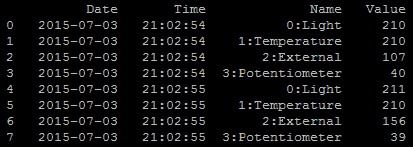

Eight ADC samples have been captured and stored in the SQLite database

在创建记录之后，我们必须记住调用`cursor.commit()`，这将把所有新记录保存到数据库中。

脚本的最后一部分调用`displayAll()`，它将使用以下 SQL 命令：

```py
SELECT * FROM recordeddata 
```

这将选择`recordeddata`表中的所有数据记录，我们使用`cursor.fetch()`将所选数据作为列表提供，我们可以迭代：

```py
for x,column in enumerate(cursor.fetchall()): 
    print(FORMATLIST%(x,str(column[0]),str(column[1]), 
                      str(column[2]),str(column[3]))) 
```

这允许我们打印出数据库的全部内容，显示捕获的数据。

Note that here we use the `try`, `except`, and `finally` constructs in this script to attempt to handle the mostly likely scenario that users will face when running the script.

首先，我们确保如果数据库目录不存在，我们将创建它。接下来，我们尝试打开数据库文件；如果数据库文件不存在，此过程将自动创建一个新的数据库文件。如果这些初始步骤中的任何一个失败（例如，因为它们没有读/写权限），我们将无法继续，因此我们报告无法打开数据库并简单地退出脚本。

接下来，我们尝试在数据库中打开所需的表并显示它。如果数据库文件是全新的，此操作将始终失败，因为它将为空。但是，如果发生这种情况，我们只需捕获异常并创建表，然后继续使用脚本将采样数据添加到表中并显示它。

这允许脚本优雅地处理潜在问题，采取纠正措施，然后顺利继续。下次运行脚本时，数据库和表将已经存在，因此我们无需再次创建它们，并且可以将示例数据附加到同一数据库文件中的表中。

# 还有更多。。。

有许多可用的 SQL Server 变体（如 MySQL、Microsoft SQL Server 和 PostgreSQL），但它们至少应具有以下主要命令（或等效命令）：

```py
CREATE, INSERT, SELECT, WHERE, UPDATE, SET, DELETE, and DROP 
```

您应该发现，即使您选择使用与此处使用的 SQLite 不同的 SQL server，SQL 命令也会相对类似。

# “创建表”命令

`CREATE TABLE`命令用于通过指定列名定义新表（如果需要，还可以设置默认值）：

```py
CREATE TABLE table_name ( 
    column_name1 TEXT,  
    column_name2 INTEGER DEFAULT 0, 
    column_name3 REAL ) 
```

前面的 SQL 命令将创建一个名为`table_name`的新表，其中包含三个数据项。一列将包含文本，其他整数（例如，1，3，-9），最后一列将包含实数（例如，5.6，3.1749，1.0）。

# 插入命令

`INSERT`命令将向数据库中的表中添加特定条目：

```py
INSERT INTO table_name (column_name1name1, column_name2name2, column_name3)name3) 
    VALUES ('Terry'Terry Pratchett', 6666, 27.082015)082015) 
```

这将在表中的相应列中输入提供的值。

# 选择命令

`SELECT`命令允许我们从数据库表中指定一个或多个特定列，返回包含数据的记录列表：

```py
SELECT column_name1, column_name2 FROM table_name 
```

它还允许我们使用以下命令选择所有项目：

```py
SELECT * FROM table_name 
```

# WHERE 命令

`WHERE`命令用于指定要选择、更新或删除的特定条目：

```py
SELECT * FROM table_name 
    WHERE column_name1= 'Terry Pratchett' 
```

这将`SELECT`任何`column_name1`匹配`'Terry Pratchett'`的记录。

# 更新命令

`UPDATE`命令将允许我们更改（`SET`每个指定列中的数据值。我们还可以将其与`WHERE`命令结合使用，以限制应用更改的记录：

```py
UPDATE table_name 
    SET column_name2=49name2=49,column_name3=30name3=30.111997 
    WHERE column_name1name1= 'Douglas Adams'Adams'; 
```

# 删除命令

`DELETE`命令允许从指定表中删除使用`WHERE`选择的任何记录。但是，如果选择了整个表格，则使用`DELETE * FROM table_name`将删除表格的全部内容：

```py
DELETE FROM table_name 
    WHERE columncolumn_name2=9999 
```

# DROP 命令

`DROP`命令允许从数据库中完全删除一个表：

```py
DROP table_name  
```

请注意，这将永久删除存储在指定表和结构中的所有数据。

# 从您自己的 Web 服务器查看数据

收集信息并将其收集到数据库中是非常有用的，但是如果它被锁定在数据库或文件中，则没有多大用处。然而，如果我们允许通过网页查看存储的数据，它将更容易访问；我们不仅可以查看来自其他设备的数据，还可以与同一网络上的其他设备共享数据。

我们将创建一个本地 web 服务器来查询和显示捕获的 SQLite 数据，并允许通过 PHP web 界面查看这些数据。这样不仅可以通过 Raspberry Pi 上的 web 浏览器查看数据，还可以通过本地网络上的其他设备（如手机或平板电脑）查看数据：

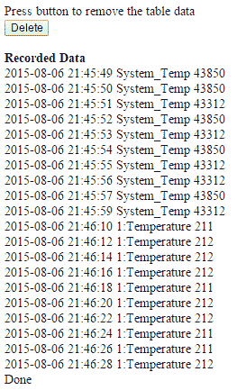

Data captured in the SQLite database displayed via a web page

使用 web 服务器输入和显示信息是允许广泛用户与项目交互的一种强大方式。下面的示例演示了一个 web 服务器设置，可以针对各种用途进行自定义。

# 准备

确保已完成上一个配方，以便传感器数据已收集并存储在 SQLite 数据库中。我们需要安装一个 web 服务器（**Apache2**，并启用 PHP 支持以允许 SQLite 访问。

使用以下命令安装 web 服务器和 PHP：

```py
sudo apt-get update
sudo aptitude install apache2 php5 php5-sqlite  
```

网络服务器使用`/var/www/`目录；默认情况下，它将加载`index.html`（或`index.php`）——否则，它将只显示指向目录中文件的链接列表。

要测试 web 服务器是否正在运行，请创建一个默认的`index.html`页面。为此，您需要使用`sudo`权限创建文件（保护`/var/www/`目录不受普通用户的更改）。使用以下命令：

```py
sudo nano /var/www/index.html  
```

创建具有以下内容的`index.html`：

```py
<h1>It works!</h1> 
```

关闭并保存文件（使用*Ctrl*+*X*、*Y*和*输入*）。

如果您正在使用带有屏幕的 Raspberry Pi，则可以通过加载桌面来检查它是否正常工作：

```py
startx  
```

然后，打开 web 浏览器（**顿悟浏览器**，输入`http://localhost`作为地址。您应该看到以下测试页面，指示 web 服务器处于活动状态：


Raspberry Pi browser displaying the test page, located at http://localhost

如果您正在远程使用 Raspberry Pi 或它已连接到您的网络，您还应该能够在网络上的另一台计算机上查看该页面。首先，识别树莓 Pi 的 IP 地址（使用`sudo hostname -I`），然后在 web 浏览器中将其用作地址。您甚至可能会发现您可以使用 Raspberry Pi 的实际主机名（默认情况下，这是`http://raspberrypi/`）。

If you are unable to see the web page from another computer, ensure that you do not have a firewall enabled (on the computer itself, or on your router) that could be blocking it.

接下来，我们可以测试 PHP 是否正常运行。我们可以创建一个名为`test.php`的网页，并确保它位于`/var/www/ directory`中：

```py
<?php 
  phpinfo(); 
?>; 
```

用于查看 SQLite 数据库中数据的 PHP 网页包含以下详细信息：

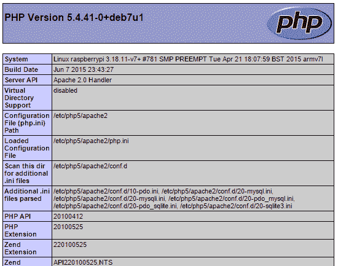

Viewing the test.php page at http://localhost/test.php

我们现在准备编写自己的 PHP 网页，以查看 SQLite 数据库中的数据。

# 怎么做。。。

1.  创建以下 PHP 文件并将其保存在名为`/var/www/./`的 web 服务器目录中。
2.  使用以下命令创建 PHP 文件：

```py
sudo nano /var/www/show_data_lite.php

```

3.  `show_data_lite.php`文件应包含以下内容：

```py
<head> 
<title>DatabaseDatabase Data</title> 
<meta http-equiv="refresh" content="10" > 
</head> 
<body> 

Press button to remove the table data 
<br> 
<input type="button" onclick="location.href = 'del_data_lite.php';" value="Delete"> 
<br><br> 
<b>Recorded Data</b><br> 
<?php 
$db = new PDO("sqlite:/var/databases/datasitedatasite/mydatabase.db"); 
//SQL query 
$strSQL = "SELECT * FROM recordeddatarecordeddata WHERE itmitm_name LIKE '%'%temp%'"; 
//Execute the query 
$response = $db->query($strSQL); 
//Loop through the response 
while($column = $response->fetch()) 
{ 
   //Display the content of the response 
   echo $column[0] . " "; 
   echo $column[1] . " "; 
   echo $column[2] . " "; 
   echo $column[3] . "<br />"; 
} 
?> 
Done 
</body> 
</html>
```

4.  使用以下命令创建 PHP 文件：

```py
sudo nano /var/www/del_data_lite.php
<html>
<body>

Remove all the data in the table.
<br>
<?php
$db = new PDO("sqlite:/var/databases/datasitedatasite/mydatabase.db");
//SQL query
$strSQL = "DROPDROP TABLErecordeddata recordeddata";
//ExecuteExecute the query
$response = $db->query($strSQL);

if ($response == 1)
    {
      echo "Result: DELETED DATA";
    }
else
    {
      echo "Error: Ensure table exists and database directory is owned    
by www-data";
    }
?>
<br><br>
Press button to return to data display.
<br>
<input type="button" onclick="location.href = 'show'show_data_lite.php';" value="Return">

</body>
</html>     
```

In order for the PHP code to delete the table within the database, it needs to be writable by the web server. Use the following command to allow it to be writable:

`sudo chown www-data /var/databases/datasite -R`

5.  如果使用以下地址在 web 浏览器中打开`show_data_lite.php`文件，则该文件将显示为网页：

```py
http://localhost/showshow_data_lite.php
```

6.  或者，您可以通过参考树莓 Pi 的 IP 地址（使用`hostname -I`确认 IP 地址）打开网页（如果您愿意，请在网络中的另一台计算机上）：

```py
http://192.168.1.101/showshow_data_lite.php 
```

您可以改为使用主机名（默认情况下，这将使地址成为`http://raspberrypi/show_data_lite.php`。但是，这可能取决于您的网络设置。

如果没有数据，请确保运行`mysqlite_adc.py`脚本以捕获其他数据。

7.  要在您访问树莓 Pi 的网址时自动显示`show_data_lite.php`页面（而不是*页面有效！*页面），我们可以将`index.html`更改为以下内容：

```py
<meta http-equiv="refresh" content="0; URL='show_data_lite.php' " /> 
```

这将自动重定向浏览器以加载我们的`show_data_lite.php`页面。

# 它是如何工作的。。。

`show_data_lite.php`文件应显示存储在 SQLite 数据库中的温度数据（来自 ADC 样本或本地数据源）。

`show_data_lite.php`文件由标准 HTML 代码以及特殊的 PHP 代码部分组成。HTML 代码将`ACD Data`设置为页面头部的标题，并使用以下命令使页面每 10 秒自动重新加载一次：

```py
<meta http-equiv="refresh" content="10" > 
```

接下来，我们定义一个`Delete`按钮，点击后会加载`del_data_lite.php`页面：

```py
<input type="button" onclick="location.href = 'del_data_lite.php';" value="Delete"> 
```

最后，我们使用 PHP 代码部分加载 SQLite 数据库并显示通道 0 数据。

我们使用以下 PHP 命令打开之前存储数据的 SQLite 数据库（位于`/var/databases/testsites/mydatabase.db`：

```py
$db = new PDO("sqlite:/var/databases/testsite/mydatabase.db"); 
```

接下来，我们使用以下 SQLite 查询来选择区域在文本中包含`0:`的所有条目（例如`0:Light`：

```py
SELECT * FROM recordeddatarecordeddata WHERE itm_namename LIKE '%temp%''
```

Note that even though we are now using PHP, the queries we use with the SQLite database are the same as we would use when using the `sqlite3` Python module.

我们现在在`$response`变量中收集查询结果：

```py
$response = $db->query($strSQL); 
Allowing us to use fetch() (like we used cursor.fetchall() previously) to list all the data columns in each of the data entries within the response. 
while($column = $response->fetch()) 
{ 
   //Display the content of the response 
   echo $column[0] . " "; 
   echo $column[1] . " "; 
   echo $column[2] . " "; 
   echo $column[3] . "<br />"; 
} 
?> 
```

`del_data_lite.php`文件非常相似；它首先像以前一样重新打开`mydatabase.db`文件。然后执行以下 SQLite 查询：

```py
DROP TABLE recordeddata 
```

如*中所述，还有更多。。。*节，这将从数据库中删除`recordeddata`表。如果`response`不等于 1，则表示动作未完成。最可能的原因是，包含`mydatabase.db`文件的目录不能被 web 服务器写入（请参阅*如何写入…*部分中关于将文件所有者更改为`www-data`的说明）。

最后，我们提供了另一个按钮，将用户带回`show_data_lite.php`页面（显示记录的数据现在已被清除）：


Show_data_lite.php

# 还有更多。。。

您可能已经注意到，这个食谱更多地关注 HTML 和 PHP，而不是 Python（是的，请查看封面–这仍然是 Python 程序员的一本书！）。然而，重要的是要记住，工程的一个关键部分是集成和组合不同的技术，以产生预期的结果。

从设计上讲，Python 非常适合这类任务，因为它允许轻松定制并与大量其他语言和模块集成。我们可以用 Python 来完成这一切，但为什么不使用现有的解决方案呢？毕竟，它们通常有很好的文档记录，经过了广泛的测试，并且通常符合行业标准。

# 安全

SQL 数据库在许多地方用于存储从产品信息到客户详细信息的广泛信息。在这种情况下，用户可能需要输入信息，然后这些信息形成 SQL 查询。在一个实施不善的系统中，恶意用户可能会在其响应中包含额外的 SQL 语法，从而使他们能够破坏 SQL 数据库（可能通过访问敏感信息、修改敏感信息或简单地删除敏感信息）。

例如，当在网页中请求用户名时，用户可以输入以下文本：

```py
John; DELETE FROM Orders  
```

如果将其直接用于构造 SQL 查询，我们将得到以下结果：

```py
SELECT * FROM Users WHERE UserName = John; DELETE FROM CurrentOrders  
```

我们刚刚允许攻击者删除`CurrentOrders`表中的所有内容！

使用用户输入构成 SQL 查询的一部分意味着我们必须小心允许执行哪些命令。在本例中，用户可能能够删除潜在的重要信息，这可能会对公司及其声誉造成巨大损失。

这种技术称为 SQL 注入，通过使用 SQLite`execute()`函数的参数选项，可以很容易地防止这种技术。我们可以用更安全的版本替换 Python SQLite 查询，如下所示：

```py
sqlquery = "INSERT INTO %s (itm_name, itm_value) VALUES(?, ?)" %(TABLE) 
cursor.execute(sqlquery, (str(dataName), str(data[i])) 
```

SQLite 模块不会盲目地构建 SQL 查询，而是首先检查提供的参数是否为有效值，以输入数据库。然后，它将确保在命令中插入 SQL 操作不会产生额外的 SQL 操作。最后，将使用`dataName`和`data[i]`参数的值替换`?`字符，以生成最终的安全 SQLite 查询。

# 改用 MySQL

本配方中使用的 SQLite 只是众多可用 SQL 数据库之一。对于只需要相对较小的数据库和最少资源的小型项目来说，它是很有帮助的。但是，对于需要附加功能（如控制访问和附加安全性的用户帐户）的大型项目，可以使用 MySQL 等替代方案。

要使用不同的 SQL 数据库，您需要调整 Python 代码，我们使用适当的 Python 模块来捕获条目。

对于 MySQL（`mysql-server`，我们可以使用一个名为**PyMySQL**的 Python-3 兼容库与之进行接口。请参见 PyMySQL 网站（[https://github.com/PyMySQL/PyMySQL](https://github.com/PyMySQL/PyMySQL) 了解有关如何使用此库的更多信息。

要将 PHP 与 MySQL 结合使用，还需要 PHP MySQL（`php5-mysql`）；有关更多信息，请参阅 W3 学校的优秀资源（[http://www.w3schools.com/php/php_mysql_connect.asp](http://www.w3schools.com/php/php_mysql_connect.asp) 。

您会注意到，尽管 SQL 实现之间有一些小的差异，但是您现在应该熟悉一般的概念和命令，无论您选择哪一个。

# 感知数据并将数据发送到在线服务

在本节中，我们将使用名为 Xively 的在线服务。该服务允许我们在线连接、传输和查看数据。Xively 使用一个公共协议，该协议用于通过 HTTP 传输信息，称为**表示状态传输**（**REST**。许多服务（如 Facebook 和 Twitter）都使用 REST，使用各种密钥和访问令牌确保数据在授权应用程序和验证站点之间安全传输。

您可以使用名为`requests`（[的 Python 库手动执行大多数 REST 操作（如`POST`、`GET`、`SET`等方法）http://docs.python-requests.org](http://docs.python-requests.org) ）。

但是，使用特定的库来提供您想要使用的服务通常更容易。它们将处理授权过程并提供访问功能，如果服务发生更改，则可以更新库而不是您的代码。

我们将使用`xively-python`库，它提供 Python 函数，使我们能够轻松地与站点交互。

有关`xively-python`库的详细信息，请参阅[http://xively.github.io/xively-python/](http://xively.github.io/xively-python/) 。

Xively 收集的数据如以下屏幕截图所示：

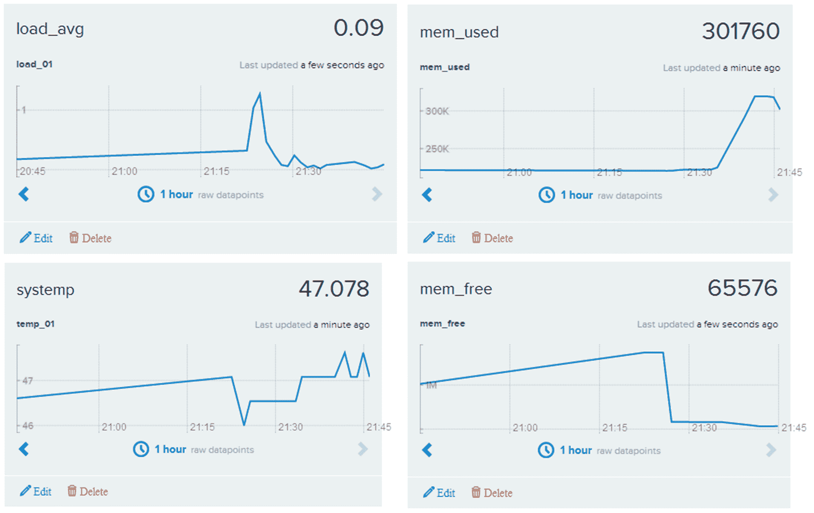

Xively collects and graphs data transferred using REST

# 准备

您需要在[www.xively.com](http://www.xively.com)上创建一个账户，我们将使用该账户接收我们的数据。转到该网站并注册一个免费的开发者帐户：


Signing up and creating a Xively account

注册并验证帐户后，您可以按照将引导您完成试驾示例的说明进行操作。这将演示如何从智能手机链接到数据（陀螺数据、位置等），这将让您体验我们可以用树莓 Pi 做什么。

登录时，您将进入“开发设备”仪表板（位于 WebTools 下拉菜单中）：

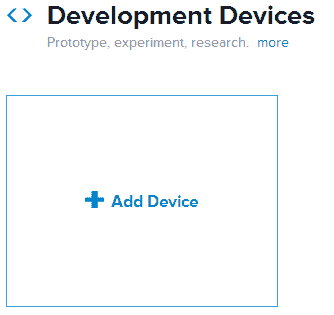

Adding a new device

选择+添加设备并填写详细信息，为设备命名并将设备设置为专用设备。

现在，您将看到远程设备的控制页面，其中包含连接该设备所需的所有信息以及显示数据的位置：

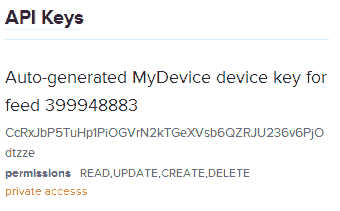

Example API key and feed number (this will be unique for your device)

尽管此页面上有很多信息，但您只需要两条关键信息：

*   API 键（即`API Keys`部分的长代码），如下所示：

```py
API_KEY = CcRxJbP5TuHp1PiOGVrN2kTGeXVsb6QZRJU236v6PjOdtzze 
```

*   进料编号（参见`API Keys`部分，也在页面顶部列出），如下所示：

```py
FEED_ID = 399948883 
```

现在我们有了需要与 Xively 联系的详细信息，我们可以将重点放在 Raspberry Pi 方面。

我们将使用`pip-3.2`安装 Xively，如下所示：

```py
sudo pip-3.2 install xively-python  
```

确保报告以下内容：

```py
Successfully installed xively-python requests  
```

您现在可以从 Raspberry Pi 发送一些数据了。

# 怎么做。。。

创建以下脚本，名为`xivelyLog.py`。确保您在代码中设置了`FEED_ID`和`API_KEY`以匹配您创建的设备：

```py
#!/usr/bin/env python3 
#xivelylog.py 
import xively 
import time 
import datetime 
import requests 
from random import randint 
import data_local as dataDevice 

# Set the FEED_ID and API_KEY from your account 
FEED_ID = 399948883 
API_KEY = "CcRxJbP5TuHp1PiOGVrN2kTGeXVsb6QZRJU236v6PjOdtzze" 
api = xively.XivelyAPIClient(API_KEY) # initialize api client 
DEBUG=True 

myData = dataDevice.device() 
myDataNames=myData.getName() 

def get_datastream(feed,name,tags): 
  try: 
    datastream = feed.datastreams.get(name) 
    if DEBUG:print ("Found existing datastream") 
    return datastream 
  except: 
    if DEBUG:print ("Creating new datastream") 
    datastream = feed.datastreams.create(name, tags=tags) 
    return datastream 

def run(): 
  print ("Connecting to Xively") 
  feed = api.feeds.get(FEED_ID) 
  if DEBUG:print ("Got feed" + str(feed)) 
  datastreams=[] 
  for dataName in myDataNames: 
    dstream = get_datastream(feed,dataName,dataName) 
    if DEBUG:print ("Got %s datastream:%s"%(dataName,dstream)) 
    datastreams.append(dstream) 

  while True: 
    data=myData.getNew() 
    for idx,dataValue in enumerate(data): 
      if DEBUG: 
        print ("Updating %s: %s" % (dataName,dataValue)) 
      datastreams[idx].current_value = dataValue 
      datastreams[idx].at = datetime.datetime.utcnow() 
    try: 
      for ds in datastreams: 
        ds.update() 
    except requests.HTTPError as e: 
      print ("HTTPError({0}): {1}".format(e.errno, e.strerror)) 
    time.sleep(60) 

run() 
#End 
```

# 它是如何工作的。。。

首先，我们初始化 Xively API 客户端，向其提供`API_KEY`（这授权我们向之前创建的`Xively`设备发送数据）。接下来，我们使用`FEED_ID`将我们链接到我们要将数据发送到的特定提要。最后，我们请求连接到的数据流（如果它在提要中不存在，`get_datastream()`函数将为我们创建一个）。

对于提要中的每个数据流，我们提供了一个`name`函数和`tags`（这些关键字帮助我们识别数据；我们可以使用我们的数据名称）。

一旦我们定义了数据流，我们就进入了`main`循环。这里，我们从`dataDevice`收集数据值。然后，我们为每个数据项设置`current_value`函数和数据的时间戳，并将它们应用于数据流对象。

最后，当所有数据准备就绪时，我们更新每个数据流，并将数据发送到 Xively，几分钟后显示在设备的仪表板上。

我们可以登录到我们的 Xively 帐户，并使用标准的 web 浏览器查看数据。这提供了在世界任何地方发送数据和远程监控数据的方法（如果需要，可以同时从多个树莓 PI）。该服务甚至支持创建触发器，当某些项目超出预期范围、达到特定值或符合设置标准时，这些触发器可以发送额外的消息。反过来，触发器可用于控制其他设备或发出警报等。它们也可以用于其他平台，如 ThingSpeak 或 plot.ly。

# 另见

AirPi 空气质量和天气项目（[http://airpi.es](http://airpi.es) 向您展示如何添加您自己的传感器或使用他们的 AirPi 套件创建您自己的空气质量和气象站（将数据记录到您自己的帐户中）。该网站还允许您与世界各地的其他人共享您的数据源。