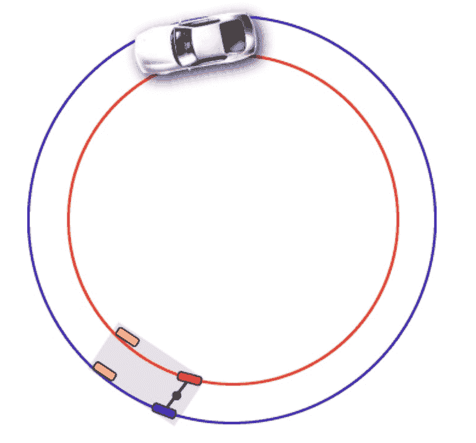
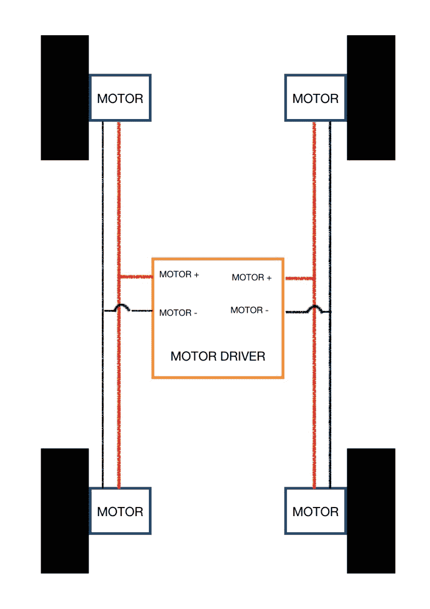
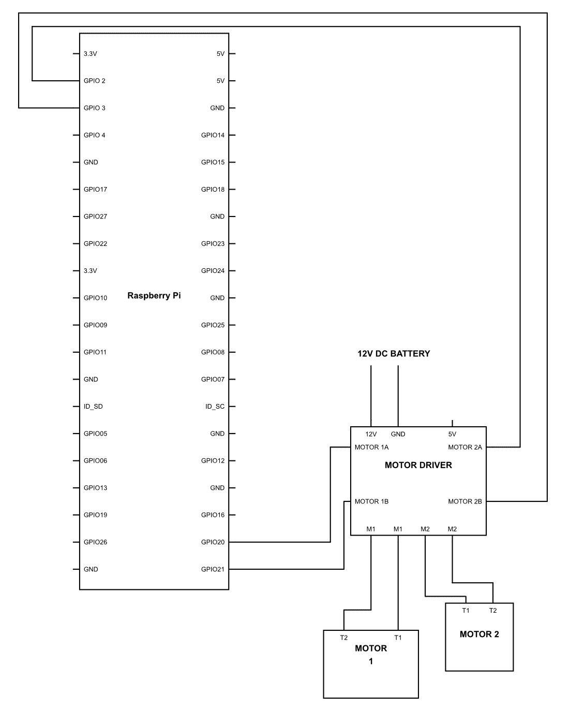
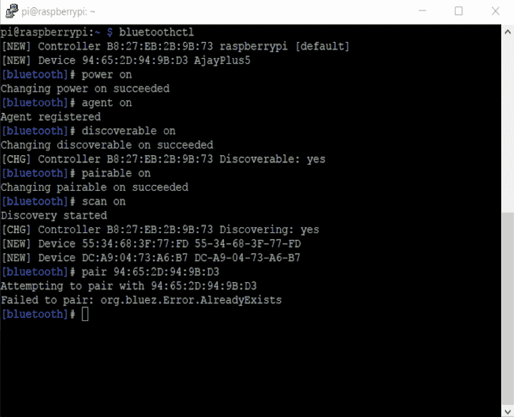

# 二十一、蓝牙控制的机器人汽车

我们已经走了很长的路；现在是时候继续前进，让事情变得更好了。全世界都在为自动驾驶汽车的诞生而欢呼雀跃，在这十年内，这将成为新常态。这些车里有这么多东西。多个传感器、GPS 和遥测都是实时计算的，以确保汽车在正确的路线上，并由系统在道路上安全驾驶，因此制造机器人车辆被证明是学习机器人技术和未来技术的理想方式。在本书中，我们将始终努力使技术不仅与现有技术一样好，而且在某些方面甚至更好。那么，让我们开始一步一步地制造这种自动驾驶汽车。

本章将涵盖以下主题：

*   车辆的基本知识
*   准备好车辆
*   通过蓝牙控制车辆

# 车辆的基本知识

你一定在想：对于我们还不知道的车辆，我们可以了解到什么？这可能是真的，但在开始本章之前，我们必须确保了解其中的一些。那么，让我们开始吧

首先是底盘，我们将使用它：它是一个四轮驱动底盘，所有四个车轮都由一个专用电机独立控制。因此，我们可以根据需要改变每个车轮的速度。我们选择了四轮驱动的传动系统，因为它更难卡在地毯和凹凸不平的表面上。你也可以选择两轮驱动的传动系统，如果你想这样做，因为它不会有很大的区别

现在，组装底盘后，您可能会看到它没有转向机构。这是否意味着汽车只能直行？显然不是。在制造小型车辆时，我们可以通过多种方法来控制汽车的方向。最好的一种称为差速车削

在传统汽车中，只有一个发动机，该发动机为车轮提供动力；因此，原则上所有车轮都以相同的速度转动。现在，当我们笔直行驶时，这项功能可以正常工作，但每当汽车想要转弯时，就会出现新问题。请参阅下图：



您将看到位于内曲线上的车轮直径较小，而位于外缘的车轮直径较大。你可能还记得小学时的一个事实：直径越大，周长越大，反之亦然。因此，与外缘上的车轮相比，朝向内缘的车轮同时覆盖的距离更短，或者简单地说，内侧车轮的旋转速度将减慢，外侧车轮的旋转速度将加快。

这个问题导致人们在汽车中发现了差速器，它是汽车车轴中心的一个圆形块。它的作用是根据转弯半径改变车轮的旋转速度。天才，不是吗？现在，你一定在想：这没关系，但你为什么要告诉我这些？好吧，因为我们会做完全相反的事情来转动机器人。如果我们在转弯圈的内边缘和外边缘改变电机的速度，那么汽车将尝试向内转弯，同样，如果我们在另一端这样做，那么它将尝试向另一个方向转弯。在制造轮式机器人时，这种策略一点也不新鲜。转向机构很复杂，在小型机器人上实现它们只是一个挑战。因此，这是一种更简单、更容易的方法来调头

这种方法不仅简单，而且是一种非常有效和简单的策略，需要最少的组件。这也是更好的，因为车辆的转弯半径也减小了。事实上，如果我们以相同的速度以相反的方向旋转车轮的两侧，那么车辆将完全绕其自身的轴旋转，从而使旋转半径完全为零。这种类型的配置被称为滑移转向驱动。对于一个在室内工作的轮式机器人来说，这是一个致命的特征。

To know more about it read more here: [https://groups.csail.mit.edu/drl/courses/cs54-2001s/skidsteer.html](https://groups.csail.mit.edu/drl/courses/cs54-2001s/skidsteer.html)

# 准备好车辆

现在是让机器人车辆成为现实的时候了。因此，让我们拆开车辆底盘，并将每个零件拧在一起。装配手册通常随套件一起提供，因此完成它不会花费很长时间

完成套件的构建后，继续并隔离每个电机的导线。这将是准备好车辆的一个非常重要的部分。所以，一旦你把所有的电线都从车里拔出来，拿一个电池给每个轮子通电。注意连接的极性，车轮在前进方向上旋转。你所要做的就是拿一个永久性的记号笔，或者是一个指甲油，在电机正向旋转时，在通向正极端子的电线上做上记号。因为所有这些电机都完全依赖于方向的极性，这一步是确保每当我们给它们通电时，它们总是朝着同一方向旋转的关键。相信我，这会帮你省去很多麻烦。

现在，完成所有操作后，将导线连接到电机驱动器，如下图所示（红色标记的导线是您之前标记的导线）：



完美的现在，除了电机驱动器与电源的连接和 Raspberry Pi 外，一切似乎都已安排妥当。让我们看看我们将如何做到这一点：



那好吧！是时候做真正的交易了！因此，我们要确保的第一件事是，所有的连接都按照我们计划的方式工作。对于这一点，我们将从一个虚拟代码开始，该代码将简单地打开所有电机并朝着前进方向。下面是代码：

```py
import RPi.GPIO as GPIO
import time
GPIO.setmode(GPIO.BCM)
Motor1a = 20
Motor1b = 21
Motor2a = 2
Motor2b = 3
GPIO.setup(Motor1a,GPIO.OUT)
GPIO.setup(Motor1b,GPIO.OUT)
GPIO.setup(Motor2a,GPIO.OUT)
GPIO.setup(Motor2b,GPIO.OUT)
GPIO.output(Motor1a,1)
GPIO.output(Motor1b,0)
GPIO.output(Motor2a,1)
GPIO.output(Motor2b,0)
time.sleep(10)
GPIO.cleanup()

```

程序再简单不过了；我们在这里所做的就是给电机驱动器一个命令，使电机朝一个方向旋转。可能有一组电机会朝相反的方向旋转，在这种情况下，您应该更改电机驱动器上连接的极性。这应该可以解决问题。有些人可能会认为，我们也可以对代码进行更改来实现这一点，但根据我的经验，它从那里开始变得复杂，如果您选择另一条路径，就会给您带来麻烦

好吧，一切都准备好了，一切都很顺利。继续，尝试其他输出排列和组合，看看汽车会发生什么。别担心，无论你做什么，你都不会损坏这辆车，除非它从车顶上掉下来！ 

# 通过蓝牙控制车辆

尝试这些组合有没有乐趣？现在是我们向前迈出一步的时候了，看看还有什么是可能的。我们都玩过遥控车，我相信每个人都会玩得很开心。我们将以一种更为复杂的方式做类似的事情。

我们都知道蓝牙：这是与近距离设备通信的最佳方式之一。蓝牙通信是一种中等数据速率、低功耗的通信方式。这在移动设备中几乎无处不在，因此这是一种理想的启动方式。在本章中，我们将使用蓝牙通过手机控制汽车。现在让我们看看我们能怎么做。

我们要做的第一件事是将智能手机与机器人车辆配对，为此，我们需要在 Raspberry Pi 上打开终端并执行以下步骤：

1.  输入命令`~ $ bluetoothctl`；这是一个蓝牙代理，允许两个蓝牙设备通信。如果没有蓝牙代理，这两个设备首先将无法相互通信。
***   `[Bluetooth] # power on`命令只需启动覆盆子上的蓝牙。*   `[Bluetooth] # agent on`命令启动代理，然后代理可以为我们启动连接。*   `[Bluetooth] # discoverable on`命令使 Raspberry Pi 的蓝牙可被发现。蓝牙可能已打开，但我们必须使其可被发现，以确保其他设备可以找到它并连接到它。*   `[Bluetooth] # pairable on`命令使设备可配对。如果蓝牙已打开，这并不意味着您的设备将能够连接，因此我们需要使其可配对，而此命令正是这样做的。*   `[Bluetooth] # scan on`命令开始扫描附近的蓝牙设备。此命令的输出将是两个 MAC 地址以及蓝牙名称。MAC 地址是设备的物理地址；这是一个唯一的地址，因此两台设备的地址永远不会相同。*   `[Bluetooth] # pair 94:65:2D:94:9B:D3`命令可帮助您与所需的设备配对。您只需键入带有 MAC 地址的上述命令。**

 **为了清楚起见，您的屏幕应该是这样的：



完成此过程后，您应该能够将 Raspberry Pi 连接到移动设备。现在你已经连接好了，是时候继续写代码了，通过这些代码，我们可以使用我们的移动设备控制蓝牙汽车。继续，看一看，然后我们将得到解释：

```py
import bluetooth
import time
import RPi.GPIO as GPIO
Motor1a = 20
Motor1b = 21
Motor2a = 2
Motor2b = 3
GPIO.setmode(GPIO.BCM)
GPIO.setwarnings(False)
GPIO.setup(Motor1a,GPIO.OUT)
GPIO.setup(Motor1b,GPIO.OUT)
GPIO.setup(Motor2a,GPIO.OUT)
GPIO.setup(Motor2b,GPIO.OUT)
server_socket=bluetooth.BluetoothSocket( bluetooth.RFCOMM )
port = 1
server_socket.bind(("",port))
server_socket.listen(1)
client_socket,address = server_socket.accept()
print ("Accepted connection from "+str(address))
def stop_car():
  GPIO.output(Motor1a,0)
  GPIO.output(Motor1b,0)
  GPIO.output(Motor2a,0)
  GPIO.output(Motor2b,0)

while True:
  data = client_socket.recv(1024)
  if (data == "B" or data== "b"):
    GPIO.output(Motor1a,1)
    GPIO.output(Motor1b,0)
    GPIO.output(Motor2a,1)
    GPIO.output(Motor2b,0)
    time.sleep(1)
    stop_car()

  if (data == "F" or data == "f"):
    GPIO.output(Motor1a,0)
    GPIO.output(Motor1b,1)
    GPIO.output(Motor2a,0)
    GPIO.output(Motor2b,1)
    time.sleep(1)
    stop_car()

  if (data == "R" or data == "r"):
    GPIO.output(Motor1a,0)
    GPIO.output(Motor1b,1)
    GPIO.output(Motor2a,1)
    GPIO.output(Motor2b,0)
    time.sleep(1)
    stop_car()

  if (data == "L" or data == "l"):
    GPIO.output(Motor1a,1)
    GPIO.output(Motor1b,0)
    GPIO.output(Motor2a,0)
    GPIO.output(Motor2b,1)
    time.sleep(1)
    stop_car()

  if (data == "Q" or data =="q"):
    stop_car()

  if (data =='Z' or data == "z"):
    client_socket.close()
    server_socket.close()

```

现在让我们看看这段代码实际上在做什么：

```py
import bluetooth
```

在本程序中，我们将使用蓝牙的一些通用功能，因此我们将调用库`bluetooth`，以便能够调用这些方法：

```py
server_socket=bluetooth.BluetoothSocket( bluetooth.RFCOMM )
```

现在，无论何时我们连接两个蓝牙设备，我们都有各种各样的通信方式；其中最简单的是射频通信，这里称为`RFCOMM`。现在，在这一行中，我们使用`bluetooth`库的`BluetoothSocket`方法来定义我们在程序中使用的通信协议，现在您知道它是`RFCOMM`。我们进一步将这些数据存储在一个名为`server_socket`的变量中，这样我们就不必一遍又一遍地重复这个步骤。相反，每当我们需要这些数据时，它都会存储在名为`server_socket`的变量中：

```py
port = 1
```

现在，蓝牙有多个端口；这是一个非常有用的概念，因为通过一个蓝牙连接，我们可以将各种数据流传输到各种设备和程序。这避免了数据冲突，并确保数据安全地传送到正确的接收器。我们现在使用的程序非常简单，数据通信不需要多个端口。因此，我们可以使用任何可用的`1`至`60`端口进行通信。在程序的这一部分中，您可以编写任何端口，程序将正常运行：

```py
server_socket.bind(("",port))
```

现在，无论何时连接两台设备，我们都需要确保它们在整个通信过程中保持连接。因此，我们在这里编写这个命令：`server_socket.bind`，它将确保在整个通信过程中保持蓝牙连接。

如您所见，参数中的第一个参数为空。在这里，我们通常编写它必须绑定的 MAC 地址。然而，由于我们已经将其设置为空，它将自动绑定到我们已经配对的 MAC 地址。第二个参数是它必须连接的端口。我们知道，`port`变量的值被设置为`1`。因此，它将自动连接到端口号`1`：

```py
server_socket.listen(1)
```

这是一条非常有趣的线路。正如我们所知，我们可能不是唯一一个尝试连接到 Raspberry 蓝牙设备的人，因此当 Raspberry 收到另一个连接请求时，它应该怎么做？

在这一行中，我们只是定义：我们正在调用一个名为`listen(1)`的方法。在这个函数中，我们将参数的值定义为`1`。这意味着它将只连接到一个设备。任何其他尝试连接的设备都无法通过。如果我们将此参数更改为`2`，则它将连接到两个设备，但它将留在队列中，因此称为**队列连接**：

```py
client_socket,address = server_socket.accept()
```

现在连接的大部分工作已经完成，我们还需要知道是否连接到了正确的地址。方法`server_socket.accept()`的作用是返回套接字号和它服务的地址。因此，我们将其存储在两个变量中，分别称为`client_socket`和`address`。但是，正如我们所知，插座将仅保留为`1`，因此我们将不再使用它：

```py
print ("Accepted connection from "+str(address))
```

在这一行中，我们只是告诉用户，通过使用函数`str(address)`成功建立了连接，我们正在打印连接到的地址的值。通过这种方式，我们可以双重确保已连接到正确的设备

```py
data = client_socket.recv(1024)
```

在这一行中，我们从客户处接收数据；此外，我们正在定义数据的长度。因此，在方法`client_socket.recv(1024)`中，我们在参数中传递了一个参数`1024`，它基本上表示数据包的最大长度为`1024`字节。一旦接收到数据，它就会被传递到变量`data`以供进一步使用

在这之后，程序的其余部分就相当简单了。我们只需要比较移动设备接收到的价值，让汽车做我们想做的事情。在这里，我们使汽车朝着四个方向行驶，即向前、向后、向右和向左。您还可以根据需要添加特定条件：

```py
        client_socket.close()
```

在这一行中，我们将关闭客户端套接字的连接，以便断开客户端连接并终止数据传输：

```py
 server_socket.close()
```

在前一行中，我们正在关闭服务器套接字的连接，以便可以断开服务器连接。

# 总结

本章教我们通过数据采集和共享，使用蓝牙接口自动控制汽车。下一步，我们将开发到目前为止所学的知识，以连接红外传感器，用于避障和补丁规划。**