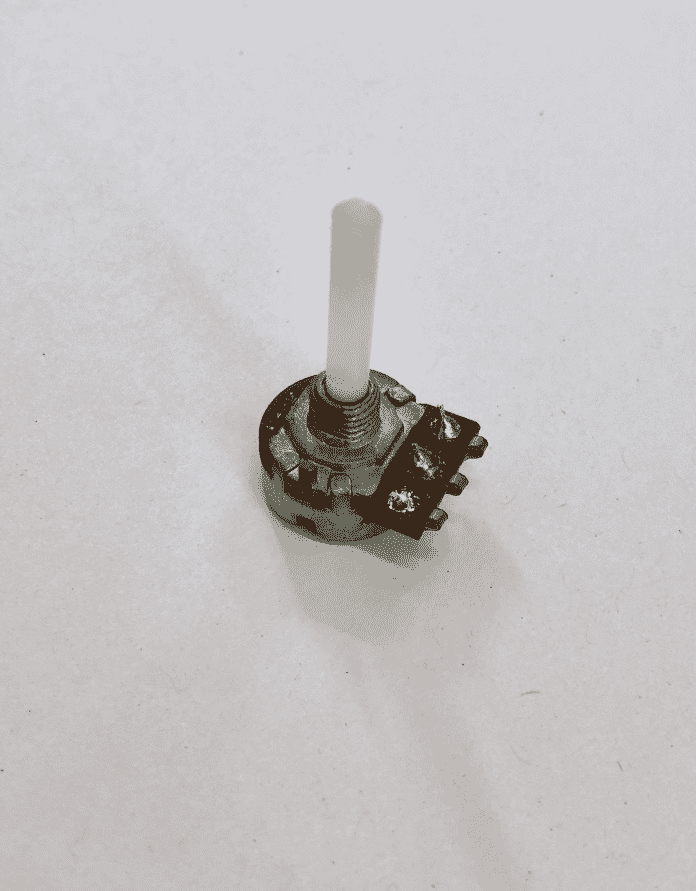
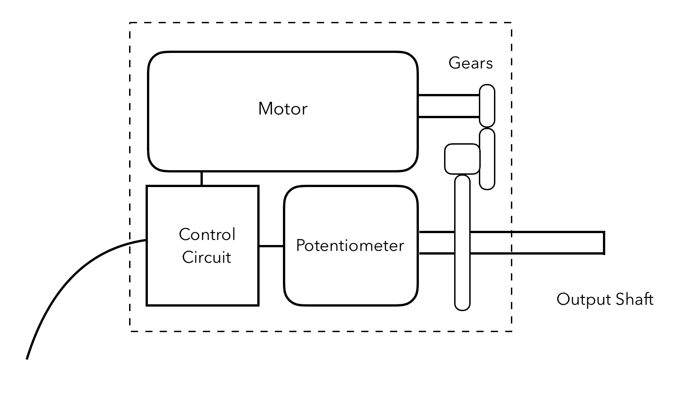
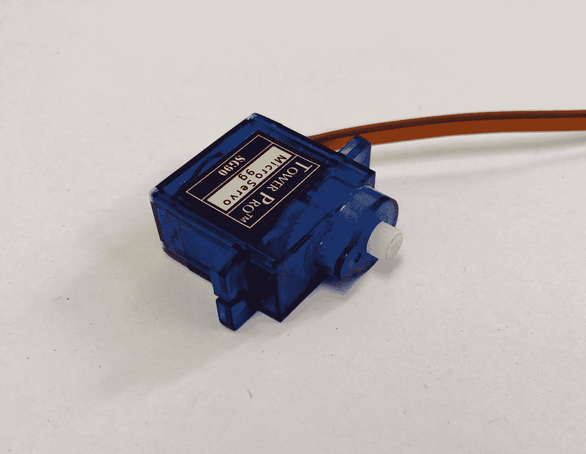
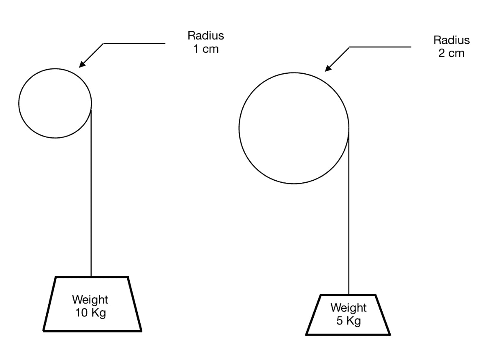
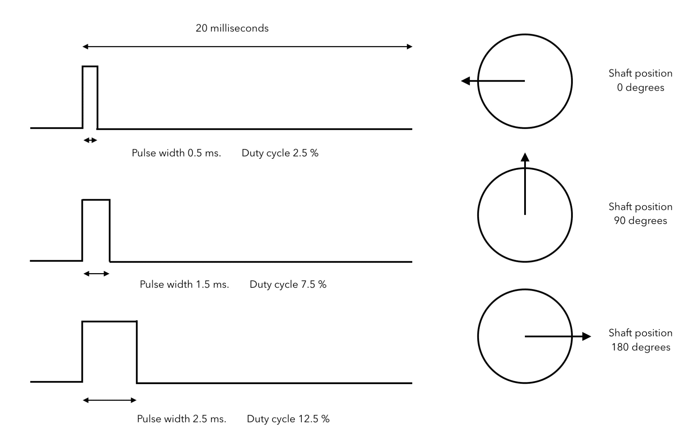
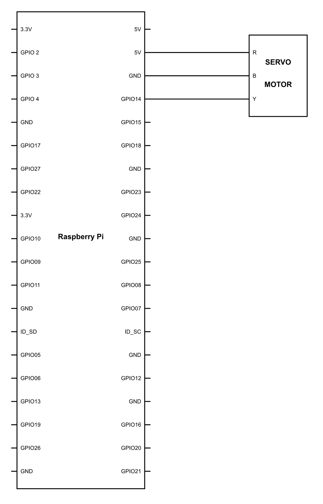
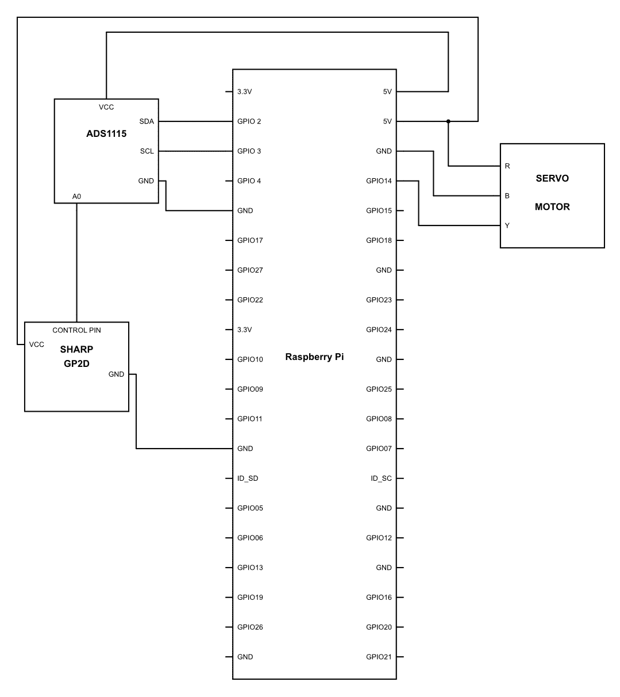
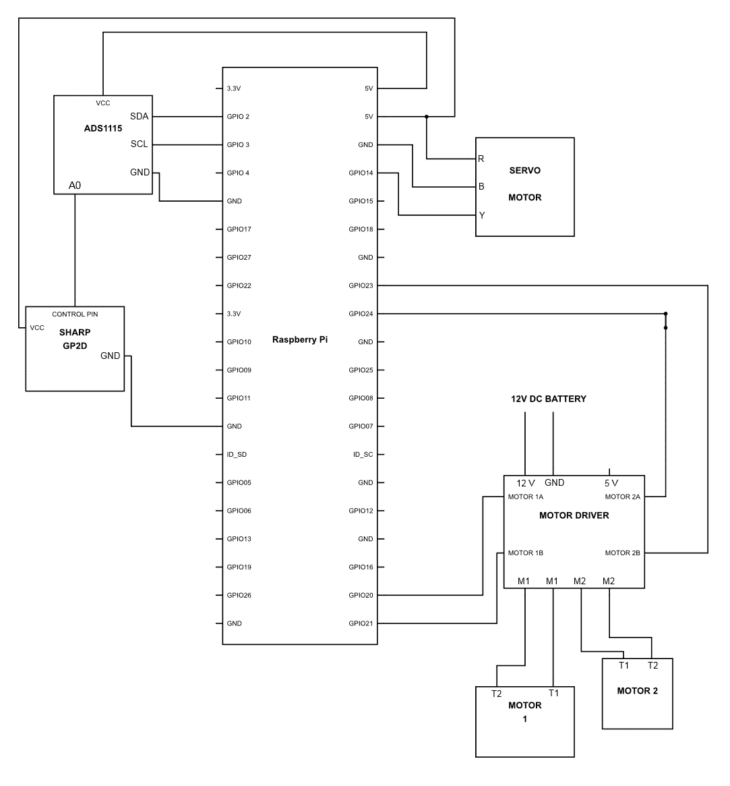

# 二十三、制造自己的区域扫描器

马达是神奇的东西；它们有各种形状和大小。首先，它们可以被认为是大多数机器人的骨干。然而，这个世界上没有什么是完美的。这些电机肯定也有一些缺点。到现在为止，你可能已经自己找到了一些。在上一章中，当我们让汽车转弯时，你可能已经看到转弯角度从来都不是一样的。此外，当车辆被命令直行时，它实际上不会这样做。相反，它会尝试轻微地向一边跑

向第一个问题问好。电机的控制非常简单，但当我们只能将电机旋转到特定角度时，这些电机的问题就出现了。如果您只需要将机器人车辆的电机旋转 90 度，那么您将如何操作？你想到的第一件也是最重要的事情就是摆弄马达的计时。你可能就在这里。但是，仍然不可能确保每一次都精确到 90 度

但当我们谈到机器人时，即使是 1 度的精度也可能不够。这些天来，机器人专家们期待着精度在两个小数位数以内。所以，我们所说的精度接近 0.01 度。你现在怎么想？我们如何使用电机达到这种精度水平？

本章将通过以下主题回答所有这些问题：

*   伺服电机
*   列表
*   激光雷达

# 伺服电机

那么，让我向您介绍一下*伺服电机*。伺服电机基本上是一个带有几个附加组件的电机。现在，为了了解这些添加的组件是什么，让我们先看一下这个示例。假设你想去伦敦。现在看看你要怎么去那里，去伦敦的路线是什么，你需要知道的第一件事是你现在的确切位置。如果您不知道当前所在的位置，则无法计算路线。类似地，如果我们想到达电机的某个位置，我们需要知道电机轴现在的位置。为此，我们使用**电位计**。电位计基本上是一个可变电阻器，它的轴在旋转时会改变电阻值。可变电阻器如下所示：



当电阻器的值改变时，电阻器的输出电压也会改变。有趣的是，如果电位计的输入电压是众所周知的，那么它的输出电压可以用来推断轴在哪里。让我们看看如何：


现在，假设在 0 度的位置，电位计的输出电压是 4.8V；当我们把它向上移动 90 度时，电压值变为 3.2V 左右，完全旋转 180 度时，由于电阻的变化，电压降低到 2V 左右

不需要真正观察电位计的轴，我们可以很容易地得出，如果电阻器的电压输出为 4.8V，那么轴必须位于 0 度的位置。同样，我们可以说，如果电压为 3.2V，则为 90 度；如果电压为 2V，则为 180 度

这里，我们刚刚画了三个点，但是对于电位计上的任何一个给定点，都会有一个非常特殊的电阻。通过这个，我们可以精确地计算出电位计轴的位置。现在，让我们把它放在一个有趣的组合中：



现在我们有一个电机，通过多个减速齿轮与电位计耦合，可以降低电机的速度并增加扭矩。在最终齿轮处，轴安装在与电位计连接的阀体外部。

因此，正如您所了解的，电位计将能够感测输出轴指向的角度。然后，电位计连接到一个控制电路，该电路读取电位计的读数，并进一步引导电机移动多少以达到目标位置。由于这种闭环布置，控制电路知道轴的位置，因此可以计算出需要移动电机多少才能到达目标位置。因此，这种布置能够将输出轴精确地转动到任何给定位置。

这种布置通常称为**伺服电机**。在整个机器人工业中，它是控制精确运动最广泛使用的硬件之一。基本上，有三根导线进入控制电路 VCC、接地和信号。信号线将从我们的 Raspberry Pi 接收数据，接收后，它将进行必要的电机移动，使轴达到所需位置。伺服电机的图像如下所示：



这些可以从非常便宜开始，大约 4 到 5 美元，但它们可以高达数千美元。但究竟是什么决定了这些伺服电机的价格？在选择伺服电机时，我们需要记住几个因素，但最重要的是**扭矩**。

扭矩基本上是一种旋转力，通过该力，电机可以旋转输出轴。通常以 kg·cm 或 N·m 为单位进行测量。这到底意味着什么？让我们看看下图：



假设在上图中，我们有一个电机，扭矩为 10 kg·cm，与之相连的转子为 1 cm。因此，它应该能够从地面垂直向上拉动 10 公斤的重物。然而，当我们将转子半径改为 2 厘米时，可提升的重量减半。同样，如果半径增加到 10 厘米，则可提升的重量只会减少到 1 公斤。所以基本上，可以提升的重量是扭矩/半径。

但就我们的大多数目的而言，我们不会使用前面所示的机制，因此让我们看下一张图，看看如何进行计算：


现在，假设我们有一个长度为**L**的轴，在轴的最边缘有一个载荷。为了便于计算，我们认为轴的重量可以忽略不计。现在，如果伺服力矩为 100 千克·cm，轴的长度为 10 厘米，则通过简单的计算，我们可以拾取的载荷为 100/10＝10 公斤。同样，如果长度增加到 100 厘米，可以提升的载荷将减少到 1 公斤

那好,；我们接触过大量伺服电机。现在的问题是我们如何控制伺服电机？正如我提到的，有不同类型的伺服电机可用，可以通过各种方式解决。然而，最常见的用于业余爱好的是数字伺服电机。这些伺服电机需要**PWM**，并且根据 PWM 的占空比，轴的角度会发生变化。那么，让我们看看它是如何发生的。

通常，这些伺服系统的频率大多为 50 Hz。因此，基本上每个脉冲的长度是 1/50=0.02 秒，或者换句话说是 20 毫秒。此外，这些伺服电机的占空比可以是 2.5%到 12.5%，这基本上意味着脉冲宽度为 0.5 毫秒到 2.5 毫秒。现在让我们看看它是如何工作的：



如您所见，当给定 2.5%的占空比时，轴下降到 0 度的最小位置，当占空比增加到 7.5%时，轴进入 90 度的中间位置。最后，当占空比增加到 12.5%时，轴转到 180 度的最大位置。如果你想要在两者之间的任何位置，那么你可以简单地选择与之对应的 PWM，它将改变伺服位置到所需的角度。

但你可能会想，如果我们想让它超过 180 度怎么办？好的，好问题，但是大多数数字伺服只有 180 度的旋转范围。有伺服系统可以完全旋转其轴，即 360 度；然而，他们的地址略有不同。在本章之后，您几乎可以继续查看任何数字伺服电机的数据表，并以您想要的方式控制它。

好了，理论够了；是时候做点有趣的事了。所以，让我们继续设置硬件，用我们的双手控制伺服！将伺服连接至 Raspberry Pi，如下所示：



电线的颜色编码如下所示：


接下来，我们需要上传以下代码，看看会发生什么：

```py
import RPi.GPIO as GPIO
import time

GPIO.setmode(GPIO.BCM)
GPIO.setup(14,GPIO.OUT)

pwm = GPIO.PWM(14, 50)
pwm.start(0)

while 1:

        pwm.ChangeDutyCycle(2.5)
        time.sleep(2)

        pwm.ChangeDutyCycle(5)
        time.sleep(2)

        pwm.ChangeDutyCycle(7.5)
        time.sleep(2)

        pwm.ChangeDutyCycle(10)
        time.sleep(2)

        pwm.ChangeDutyCycle(12.5)
        time.sleep(2)
```

运行此程序后，您将看到伺服轴从左向右移动，分别以 0 度、45 度、90 度、135 度和 180 度移动

让我们看看我们在计划中为实现这一目标做了什么：

```py
pwm = GPIO.PWM(14, 50)
pwm.start(0)
```

在线路`pwm = GPIO.PWM(14, 50)`中，我们定义了用于 PWM 的 GPIO 引脚号`14`，PWM 的频率为`50`。我们在前面的章节中也使用了`pwm.start(0)`一行。基本上将 PWM 引脚设置为无占空比的`0`：

```py
        pwm.ChangeDutyCycle(2.5)
        time.sleep(2)

        pwm.ChangeDutyCycle(5)
        time.sleep(2)

        pwm.ChangeDutyCycle(7.5)
        time.sleep(2)

        pwm.ChangeDutyCycle(10)
        time.sleep(2)

        pwm.ChangeDutyCycle(12.5)
        time.sleep(2)
```

否所有之前的程序都在`while`循环中，也就是说，它将反复执行，直到程序被迫退出。现在线路`pwm.ChangeDutyCycle(2.5)`向伺服电机发送 2.5%占空比的 PWM。这将简单地将伺服电机旋转到 0 度角。接下来，我们使用老的`time.sleep(2)`，我们都知道它会使该行的程序停止两秒钟。

同样的循环在 5%的不同 PWM 值下重复，这将使轴转动 45 度，90 度转动 7.5%，135 度转动 10%，180 度转动 12.5%。这是一个非常简单的程序，可以清除伺服电机的基本知识

到现在为止，你们已经学会了如何控制伺服电机，并将其移动到我们想要的方向。现在，让我们前进一步，稍微更改代码，以使伺服平稳运行：

```py
import RPi.GPIO as GPIO
import time

GPIO.setmode(GPIO.BCM)
GPIO.setup(14,GPIO.OUT)

pwm = GPIO.PWM(14, 50)
pwm.start(0)

i=2.5
j=12.5

while 1:
        while i<=12.5:
                pwm.ChangeDutyCycle(i)
                time.sleep(0.1)
                i = i + 0.1

        while j>=2.5:
                pwm.ChangeDutyCycle(j)
                time.sleep(0.1)
                j = j - 0.1
```

当你把这个代码上传到你的 Pi 时发生了什么？您可能已经注意到伺服从左向右滑动非常平稳，然后从右向左滑动。我们做了一个非常简单的把戏；让我们看看它是什么：

```py
        while i<=12.5:
                pwm.ChangeDutyCycle(i)
                time.sleep(0.1)
                i = i + 0.1
```

这里，我们正在运行一个循环，该循环将一直运行到`i<=12.5`的值，正如我们之前在程序中定义的，`i`的值在程序启动时被设置为`2.5`作为默认值。此后，每次代码运行时，占空比都被设置为`I`的值，程序停止 0.1 秒，然后`i`的值增加`0.1`的值。这会增加 PWM 的占空比。一旦该值达到 12.5，循环将退出。

我们拥有的整个 PWM 范围是 2.5%到 12.5%，因此我们有 10%的空间可以使用。现在，如果我们将其映射到伺服电机的角旋转，那么 PWM 的每一个百分比对应于 180/10=18 度的变化。同样，每 0.1%的变化将导致 180/100=1.8 度的变化。因此，每 0.1 秒，我们将占空比增加 0.1%，或者换句话说，我们将角度增加 1.8 度。因此，我们认为这一行动非常顺利

我们在节目的下一部分也在做类似的事情；然而，我们这样做是为了反向运动

# 列表

好吧，那么，我们很确定如何使用伺服，并根据我们的需要控制运动。现在是时候向前迈进，理解另一个我们将非常使用的概念了。它被命名为**数组**。如果你用其他语言编程，你必须熟悉它。但我们需要了解一些基本的 it 概念，这将使我们的生活更加轻松。那么，让我们开始吧。

第一件事，第一件事。Python 中的数组不是命名数组，而是命名为**列表**。列表基本上是一种可以同时存储多个元素的数据结构。唯一的限制是元素必须是相同的数据类型。例如，如果您正在存储整数，那么所有的值都应该是`int`。同样，如果您正在存储一个字符，那么列表中的每个元素都应该是`char`。要定义一个列表，您需要做的就是命名该列表，就像我们通过`myList`所做的那样；列表的名称可以是下一步我们需要告诉编译器它实际上是一个列表。为此，我们需要将值放在方括号内。它看起来像：

```py
myList = [14,35,108,64,9]
```

需要记住的一件事是，每个值都应该用逗号分隔。每当我们想要处理列表中的任何单个元素时，我们可以通过调用它们的索引号来使用它。这基于元素在列表中的位置。Python 列表中的索引值从 0 开始。因此，根据前面在索引 0 处的声明，值将为`14`，在地址 4 处，值将为`9`。现在，当我们需要在程序之间打印这些元素时，我们需要编写以下代码：

```py
print myList[2] 
```

一旦我们写了这个，程序将打印列表中第二个值的值。在我们的例子中，它将是`35`

现在，这是访问列表元素的一种方法；但是，我们也可以按相反的顺序访问它。假设您想访问数组的最后一项。然后，我们可以编写以下代码：

```py
print myList[-1] 
```

此代码将返回数组最后一个元素的值。现在，每当我们在列表中使用负值时，它就会以相反的顺序开始索引。假设我们输入`print myList[-2]`，这将给出数组中第二个最后一个值的值。在整个示意图中需要记住的一点是，编号将从 0 开始，而当我们以相反的顺序开始时，编号将从-1 开始。

如果你知道正确的工具，Python 真的很有趣而且很简单。Python 的开发人员提供了一些非常有用的函数，可以在列表中使用。所以，让我们去探索一下

第一个是向数组中添加元素。为此，我们使用一个名为`append()`的函数。`append()`函数的作用是将值相加，该值应该位于数组的末尾。因此，写下以下内容：

```py
myList.append(45)
```

这样做的目的是将元素`45`添加到`myList`的末尾。因此，现在的清单如下：

```py
myList = [14,35,108,64,9, 45]
```

很简单，不是吗？但是，如果要在列表之间添加一个元素，该怎么办？显然，开发者不会让你干的。它们也包含了一个功能；它的名字叫`insert(index, element)`。现在，无论何时使用此函数，都需要确保提及希望此元素所在的索引，其次是希望放置的元素。看起来是这样的：

```py
myList.insert(3,23)
```

使用此函数后，数组将如下所示：

```py
myList = [14,35,108,23,64,9,45]
```

显然，只要开发人员提供了添加元素的函数，那么他们肯定也会提供一个删除元素的函数。但诀窍是，你可以用两种方法来做。第一，共同的方式。我们只需选择索引号并将其删除。我们现在就要做：

```py
del myList[2]
```

现在，这将删除数组的第二个元素，因此执行此操作后，数组将如下所示：

```py
myList = [14,35,108,64,9,45]
```

但现在真正的把戏来了；也可以通过简单地指定元素来删除该元素。这是如何做到的：

```py
myList.remove(9)
```

现在，当您执行此操作时，它将找到元素`9`在列表中的任何位置，并将其从位置中删除。所以你不必关心元素在哪里；这个函数会说，我会找到你，我会杀了你！ 

# 环顾四周

好吧，那就别再引用电影名言了。我们可以讨论许多其他可以在列表上使用的函数，但现在我们所做的已经足够了。我们将在需要时看到其余的人。但现在，让我们在机器人技术上更进一步。你可能在许多自动驾驶汽车的顶部看到一个旋转的物体。由于价格高，生产型汽车一般不倾向于有，但研究型汽车总是装载着它。

那么这个设备是什么呢？命名为**激光雷达**；它是**光探测和测距**的首字母缩写。我知道一个糟糕的首字母缩略词。激光雷达非常普遍是有原因的。它以非常精确的方式对周围区域进行远距离读取。然而，为我们的项目购买它会有点过头，因为一个好的会花费你将近 500 到 10000 美元。如果你仍然认为这是在你的预算，那么你将是非常幸运的！但对于那些不想买它的人来说。我有个好消息要告诉你。今天，我们将要建造我们自己的激光雷达扫描器。因此，为了制造一个区域扫描器，我们需要一个伺服装置，我们将在其上安装红外接近传感器。现在要做到这一点，我们需要一个小小的临时安排。你可以拿一块硬纸板，像我们在图中所做的那样来固定它，或者，如果你想用专业的方法来固定部件，你也可以用直角的铝板来钻孔。要记住的一点是，传感器必须完全平行于地面，而不是向上或向下

安装完成后，就可以连接其余的硬件了。因此，继续连接硬件，如下图所示：



好的，让我们看看这个东西能做什么，准备好并上传以下代码：

```py
import RPi.GPIO as GPIO
import time
import Adafruit_ADS1x15

adc = Adafruit_ADS1x15.ADS1115()
GAIN = 1

adc.start_adc(0, gain=GAIN)
GPIO.setmode(GPIO.BCM)
GPIO.setup(14,GPIO.OUT)
GPIO.setwarnings(False)

servo = GPIO.PWM(14, 50)

servo.start(0)

Def Distance():
    D_value = adc0.get_last_result()
    D =    (1.0 / (F_value / 13.15)) - 0.35
    Return D

j=12.5
k=2.5
i=0

distLR=[] 
distRL=[]

while True:
        while k<=12.5:
                servo.ChangeDutyCycle(k)
                time.sleep(.1)
                distLR.insert(i,Distance())
                k = k + 2.5
                i = i + 1
        print distLR

        i=0
        k=0

        del distLR[:]

        while j>=2.5:
                servo.ChangeDutyCycle(j)
                time.sleep(.1)
                j = j - 2.5
                distRL.insert(i,Distance())
                i = i + 1

        print distRL

        i=0
        k=2.5
        j=12.5

       del distRL[:]
```

代码做了什么？如果运行良好，则应返回扫描读数，整个 180 度细分为 10 个偶数步。继续尝试，然后回来看看实际发生了什么。

现在，大部分代码都是基本的，您还必须了解这些代码实际上在做什么。不过，让我们深入了解一下，看看具体情况：

```py
Def Distance():
    D_value = adc0.get_last_result()
    D =    (1.0 / (F_value / 13.15)) - 0.35
    Return D
```

在程序的这一部分中，我们定义了一个名为`Distance()`的函数。如您所见，它只是在步骤`D_value = adc0.get_last_result()`中从 ADC 获取读数；此后，这是存储在变量`D`中的值，然后在行`D = (1.0/F-value/13.15)) - 0.35`中计算该值，以从 ADC 读数获得度量读数。最后，使用行`Return D`，我们从函数返回值`D`：

```py
distLR=[] 
distRL=[]
```

我们已经声明了两个列表：`distLR`，即伺服从左向右滑动的距离，`distRL`表示伺服从右向左滑动的距离。你可能想知道为什么这些括号里什么都没有。声明空数组是完全正常的。它们最初不需要有价值：

```py

        while k<=12.5:
                servo.ChangeDutyCycle(k)
                time.sleep(.1)
                distLR.insert(i,Distance())
                k = k + 1
                i = i + 1
        print distLR
```

现在这才是真正的行动发生的地方。只有当`k`的值小于或等于`12.5`时，才会执行`while`循环。在下一行`servo.ChangeDutyCycle(k)`中，占空比的值将是`k`的值。最初，`k`的值将是`2.5`，正如我们在程序开始时已经定义的那样。现在我们添加另一行`time sleep(.1)`，这将使程序暂停`.1`秒。这是必要的；否则，程序将在毫秒内解析这个循环，伺服将无法处理它。因此，这是一个短暂的延迟。在下一行中，我们有`distLR.insert(I,Distance())`。这一行的程序正在做很多事情。首先，我们在这行中命名了一个`Distance()`函数。根据我们的定义，它将使用 ADC 和红外接近传感器计算距离。此后，它将在列表`distLR`中的位置`I`处插入该距离值。之前在我们的程序中，我们已经分配了值`i = 0`；因此，距离值将放在数组中的第一个位置。完成整个过程后，我们继续前进，并在此行`k = k + 1`中增加一个值；此后，我们在`I = I + 1`中做同样的事情。最后，一旦执行了该循环，列表的值将使用行`print distLR`打印：

```py
        i=0
        k=0
```

在这一行中，我们只是为下一个循环重置`i = 0`和`k = 0`的值：

```py
        del distLR[:]
```

这对你来说可能有点新。每当我们在括号内使用冒号时，这基本上意味着数组的整个元素都将被删除：

```py
 while j>=2.5:
                servo.ChangeDutyCycle(j)
                time.sleep(.1)
                j = j - 2.5
                distRL.insert(i,Distance())
                i = i + 1

        print distRL
```

在这段代码中，发生了与我们从左向右滑动相同的事情；唯一的区别是，我们正在将其保存为一个名为`distRL`的新列表，刷卡从 12.5%的占空比开始，到 2.5%结束：

```py
   i=0
        k=2.5
        j=12.5

       del distRL[:]
```

当我们打印完所有值后，我们再次重置`i = 1`、`k = 2.5`和`j = 12.5`的值，以便我们的第一个循环可以无缝地开始，我们还确保列表`distRL`中没有任何内容。

这就是我们的代码是如何工作的，简单明了！

# 自动驾驶车辆上的激光雷达

还记得上次我们制造自动驾驶汽车的时候吗。这很酷，当然也可能是你可以向朋友炫耀的东西。然而，现在我们要做的肯定比我们迄今为止做过的任何事情都要酷。

我们将把这个区域扫描器放在我们的机器人车上。但是等等，我们之前不是用同一个传感器扫描了这个区域，然后把车转向另一边吗。我们做到了，效果很好，几乎很好。我打赌有时候它并不像你想象的那样准确。但这不是真正的问题。主要问题是它不是无缝的。它必须停在两个方向之间，检查是否有空格，然后向任意一个方向移动。我们现在要做的是向前迈出一步。所以在做更多的解释之前，让我们先做一个新的机器人车辆，然后由你来判断它是否更酷

因此，要做到这一点，您需要在车辆上安装区域扫描器。建议将其设置在车辆前端，并确保伺服臂能够旋转 180 度。您可以使用与我们相同的方法将 IR 传感器固定在伺服装置顶部。在执行所有操作时，请尝试使用电缆扎带，以确保电缆不凌乱，并确保为轴和传感器顶部的移动留出一定的间隙。这些电缆扎带可以让您的生活变得非常简单。一旦我们都设置好了，您应该使用 ADS1115 将 IR 接近装置连接到 Raspberry Pi，然后连接电机驱动器，如下图所示：



完成后，继续并上传以下代码：

```py
import RPi.GPIO as GPIO
import time
import Adafruit_ADS1x15

adc0 = Adafruit_ADS1x15.ADS1115()
GAIN = 1
adc0.start_adc(0, gain=GAIN)

GPIO.setmode(GPIO.BCM)
GPIO.setup(14,GPIO.OUT)

servo = GPIO.PWM(14, 50)
servo.start(0)

def Distance():
    D_value = adc0.get_last_result()
    D =    (1.0 / (F_value / 13.15)) - 0.35
    Return D

GPIO.setup(20,GPIO.OUT)
GPIO.setup(21,GPIO.OUT)
GPIO.setup(23,GPIO.OUT)
GPIO.setup(24,GPIO.OUT)

LForward = GPIO.PWM(20, 50)
LReverse = GPIO.PWM(21, 50)
RForward = GPIO.PWM(23,50)
RReverse = GPIO.PWM(24,50)

def stop():
    LForward.changeDutyCycle(0)
    LReverse.changeDutyCycle(0)
    RForward.changeDutyCycle(0)
    RReverse.changeDutyCycle(0)

def direction(index):

 if index == 0 :
    LForward.changeDutyCycle(0)
    LReverse.changeDutyCycle(30)
    RForward.changeDutyCycle(30)
    RReverse.changeDutyCycle(0)

elif index == 1

    LForward.changeDutyCycle(20)
    LReverse.changeDutyCycle(0)
    RForward.changeDutyCycle(50)
    RReverse.changeDutyCycle(0)

 elif index == 2 :

    LForward.changeDutyCycle(50)
    LReverse.changeDutyCycle(0)
    RForward.changeDutyCycle(50)
    RReverse.changeDutyCycle(0)

elif index == 3 :

    LForward.changeDutyCycle(50)
    LReverse.changeDutyCycle(0)
    RForward.changeDutyCycle(20)
    RReverse.changeDutyCycle(0)

 elif index == 4 :

    LForward.changeDutyCycle(20)
    LReverse.changeDutyCycle(0)
    RForward.changeDutyCycle(0)
    RReverse.changeDutyCycle(20)

 else:
 stop()

j=12.5
k=2.5
i=0

dist1=[]
dist2=[]

while True:

    while k<=12.5:
    servo.ChangeDutyCycle(k)
    time.sleep(.2)
    dist1.insert(i,Distance())
    k = k + 2.5
    i = i + 1

 print dist1

 i=0
 k=2

 max_dist1 = max(dist1)
 max_dist1_index = dist1.index(max_dist1)

 direction(max_dist1_index)

 del dist1[:]

 print max_dist1
 print max_dist1_index

 while j>=2.5:
    servo.ChangeDutyCycle(j)
    time.sleep(.2)
     j = j - 2.5
     dist2.insert(i,Distance())
    i = i + 1

print dist2

i=0
j=12

 max_dist2 = max(dist2)
 max_dist2_index = dist2.index(max_dist2)

 direction(max_dist2_index)

 del dist2[:]

 print max_dist2
 print max_dist2_index
```

呸！很长时间了，不是吗？但相信我，这可能很长，但并不难。让我们看看这段代码在做什么：

```py
LForward = GPIO.PWM(20, 50)
LReverse = GPIO.PWM(21, 50)
RForward = GPIO.PWM(23,50)
RReverse = GPIO.PWM(24,50)
```

你可能觉得这东西很新。虽然不是。我们所做的是定义哪个管脚号将在什么 PWM 频率下工作。此外，我们还命名了用于电机控制的每个 GPIO 引脚。好的，那么，我们正在做所有这些是好的，但是为什么我们突然开始给电机驱动器提供 PWM。我们是不是不高兴给一个简单的高脉搏？

答案很简单。通过使用 PWM，我们能够在前面的章节中改变 LED 的亮度。类似地，通过改变电机驱动器控制引脚的 PWM 输出，您不能仅定义旋转方向。还有它旋转的速度。这一切都是通过 PWM 完成的。假设管脚编号`20`在 50%的占空比下获得 PWM。因此，它基本上意味着连接到它的电机将获得电机驱动器接收的一半输入电压。因此，现在我们不仅可以控制电机旋转的方向，还可以控制电机旋转的速度：

```py
def direction(index):

 if index == 0 :
    LForward.changeDutyCycle(0)
    LReverse.changeDutyCycle(30)
    RForward.changeDutyCycle(30)
    RReverse.changeDutyCycle(0)

elif index == 1
    LForward.changeDutyCycle(20)
    LReverse.changeDutyCycle(0)
    RForward.changeDutyCycle(50)
    RReverse.changeDutyCycle(0)
```

在此语句中，我们定义了一个函数`direction(index)`。这样做的目的是比较索引的值，并以此为基础。电源将提供给电机。所以我们假设索引为 0。在这种情况下，左侧的车轮将反向移动，而右侧的车轮将反向移动，这将使机器人绕轴转动

在下一个语句中，我们已经写了一个`elif`语句，所以如果`else`语句不正确，那么它将检查身体中的其余`else if`语句。在`direction(index)`的整个定义中有四条`elif`语句，这基本上意味着它将检查每一条语句，并根据参数的值执行其中一项活动。在本例中，它是索引。此外，还有一个最终的`else`声明，如果没有一个案例是真实的，那么将进行该声明。因此，根据该语句，它将调用 stop 函数。这将使车辆停止：

```py
max_dist1 = max(dist1)
```

这一行非常有趣，因为我们使用的是列表中另一个有趣的部分。因此，通过`max()`方法，我们可以找到列表中的最大值。因此，在这行中，我们只需找到最大值并将其放入名为`max_dist1`的变量中：

```py
max_dist1_index = dist1.index(max_dist1)
```

列表之美似乎还没有结束。在这行中，我们使用的是另一个名为`index()`的方法；此方法为我们提供列表中值的索引。因此，我们可以知道值在列表中的位置。因此，在这一行中，我们正在证明`max_dist1`的值。方法`index()`搜索索引号并将该值向下存储到名为`max_dist1_index`的变量中：

```py
 direction(max_dist1_index)
```

由于我们已经定义了功能`Direction()`，现在我们所做的就是调用该功能来决定进入哪个方向。然后，给您的车辆通电，看看他们的驾驶状况如何，不要忘记拍摄视频并将其发布到网上。

玩得高兴

# 总结

专业激光扫描器非常昂贵，因此，在本章中，我们继续自己制造一种替代品，并将其安装在我们的车辆上。在下一章中，我们将介绍视觉处理、目标检测和目标跟踪等主题，这将使我们能够进行基本的视觉处理，并使汽车朝着特定对象（如球）的方向移动。