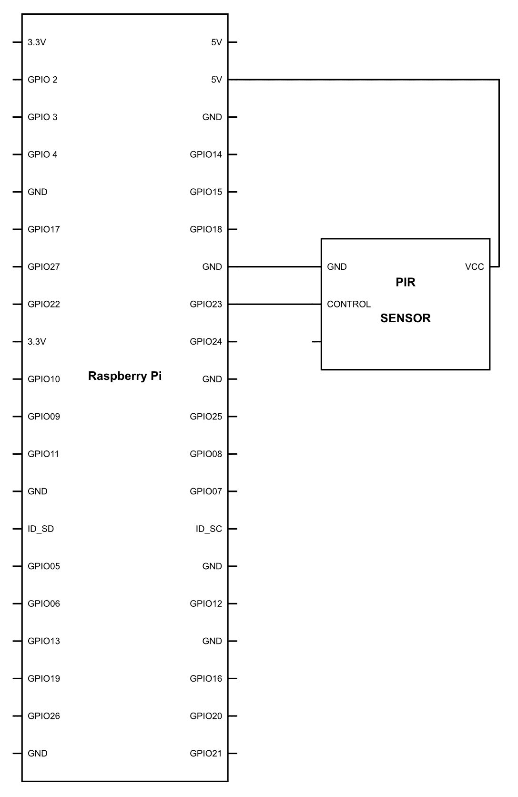
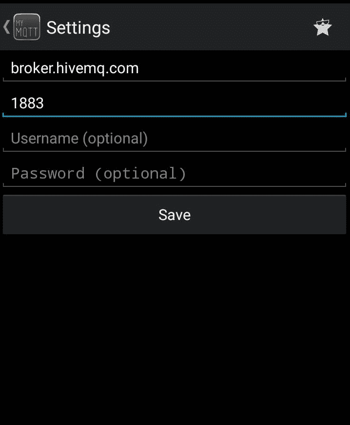
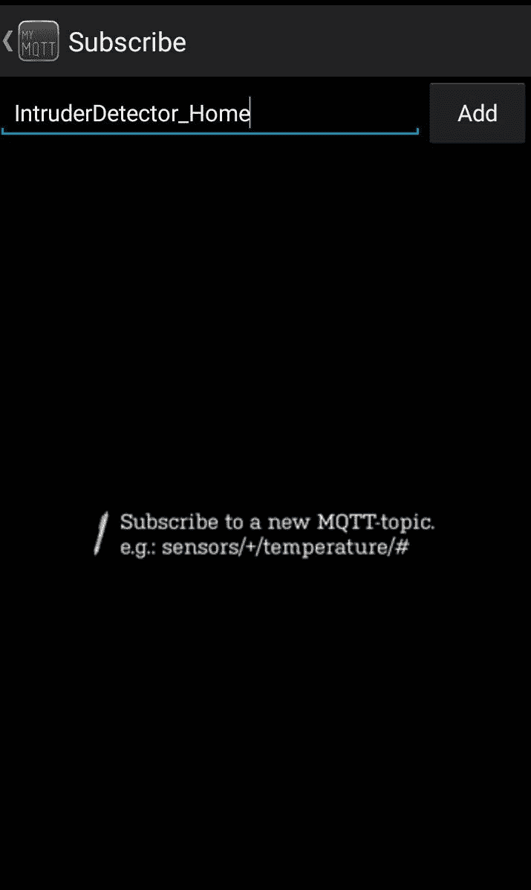
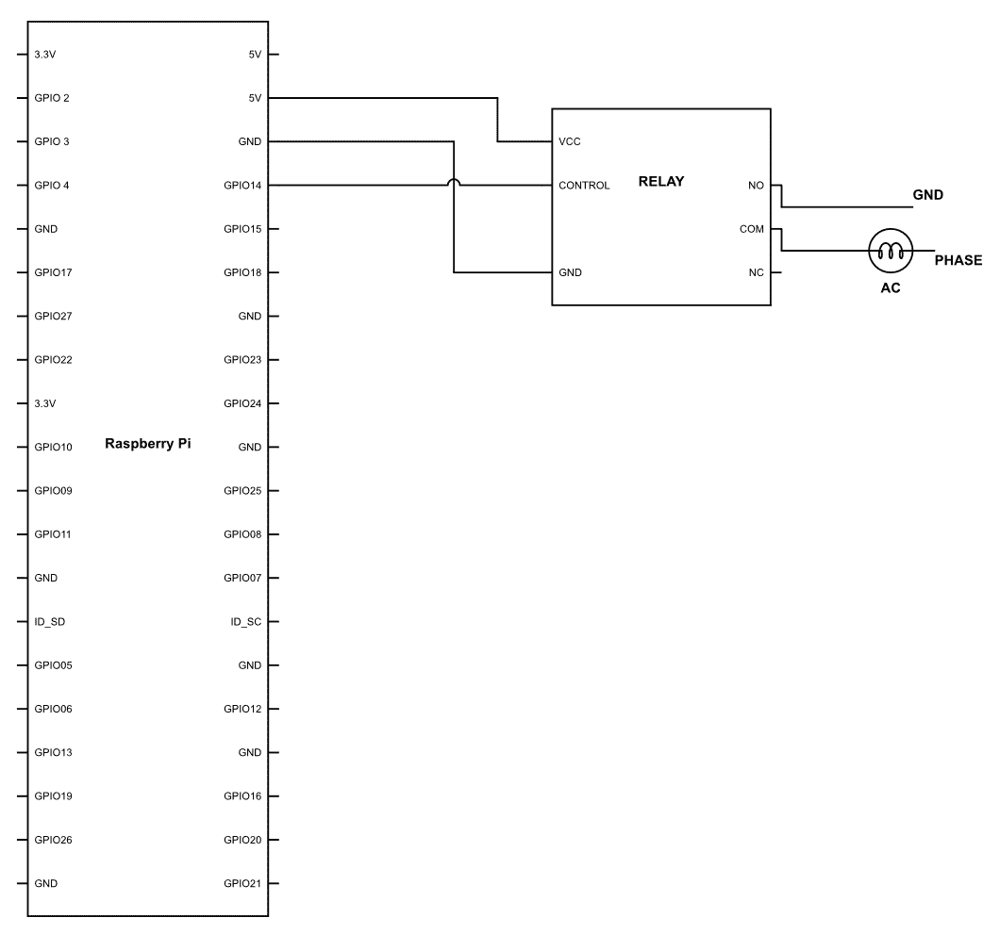
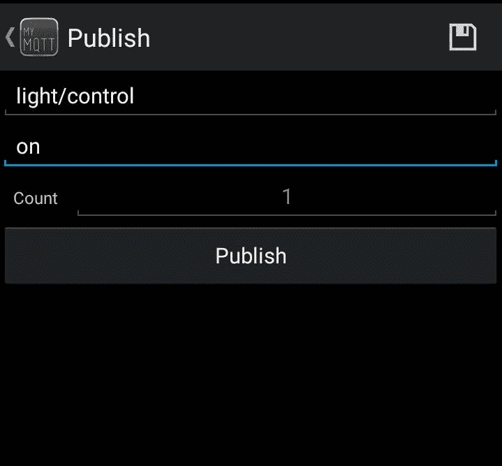

# 二十六、启用 Jarvis 物联网

曾经有一段时间，我们常常想象用指尖控制世界。现在，这种想象已经成为现实。随着智能手机的出现，我们一直在做十年前人们只能想象的事情。随着手机变得越来越智能，行业和企业也尽最大努力跟上这一颠覆性变化。然而，有一部分仍然落后。那是哪一部分？你的家！

想想你在家里用智能手机可以控制什么？没有多少东西！有一些设备可以打开或关闭一组设备，例如您的空调。但是，列表中的内容非常详尽。因此，有了前面章节中获得的所有知识和我们手中强大的硬件，我们为什么不成为引领潮流的人和颠覆者，制造一些仍然只是我们想象的一部分的东西呢。

本章将介绍以下主题：

*   **物联网**（**物联网**基础知识
*   **消息队列遥测传输**（**MQTT**协议
*   设置 MQTT 代理
*   基于物联网的入侵检测系统的研制
*   控制家庭

# 物联网基础

在本章中，我们将使用智能手机控制家中的设备，但在此之前，我们应该了解这项技术的基本知识。本章的第一个主题是现代世界中过度使用的术语。这是每个人都想知道但没有人知道的事情。物联网可以与一项技术相关，在这项技术中，你的冰箱会告诉你哪些物品供应不足，并会自动为你订购。可怜的家伙！这项技术有时间侵入我们的房子。但物联网并不仅仅意味着这一点。物联网是一个非常宽泛的术语，可以应用于几乎所有的地方进行优化。那么什么是物联网呢？

让我们打破这个缩写，**物联网**有时也称为网络物理系统。现在，什么是**事物**？任何能够在没有人为干预的情况下收集或接收数据的电子物体在这里都可以称为物。所以这个东西可以是你的手机，心脏起搏器，健康监测设备，等等。唯一的*如果*是它应该连接到互联网，并且能够收集和/或接收数据。第二个术语是**互联网**；互联网指的是互联网，呸！现在，所有这些物联网设备都从云或中央计算机发送和接收数据。之所以这样做，是因为任何物联网设备，无论大小，都被视为资源受限的环境。也就是说，计算能力等资源要少得多。这是因为物联网设备必须简单廉价。想象一下，你必须在所有的路灯上安装物联网传感器来监控交通。如果这个设备的价格是 500 美元，那么安装这种设备是不切实际的。然而，如果它能以 5-10 美元的价格制作，那么没有人会眨眼。这就是物联网设备的特点；它们非常便宜。现在，这个故事的另一面是，他们没有太多的计算能力。因此，为了平衡这个等式，他们不需要在自己的处理器上计算原始数据，而只需将这些数据发送到云计算设备或服务器，在那里计算这些数据并获得有意义的结果。所以，这就解决了我们所有的问题。哦，不！这些设备的第二个问题是，它们可以由电池供电，也可以使用和投掷设备。例如，在森林中安装温度传感器；在这种情况下，没有人，也绝对没有人会每周去更换电池。因此，这些设备的制造方式使得它们几乎不消耗电能，从而使编程变得非常棘手。

现在我们已经了解了物联网的概念，在本章中，我们将启用我们的家庭物联网。这意味着，我们将能够从家中接收和收集传感器的数据，在移动设备上查看数据，如果需要，我们还可以使用智能手机控制设备。但有一件事，我们不需要在云上计算，我们只需要将所有数据上传到云上，然后访问这些数据，或者将数据发送到云上，从那里可以访问数据。我们将在另一本书中讨论云计算方面，因为这可能是一个全新的维度，超出了本书的范围。

# MQTT 协议

MQTT 是一种 ISO 认证的协议，使用非常广泛。这个协议有趣的地方在于，它是由安迪·斯坦福和阿伦·尼珀于 1999 年开发的，用于监测穿越沙漠的输油管道。你可以想象，在沙漠中，他们开发的协议必须既节能又节省带宽。

这个协议的工作原理非常有趣。它有一个发布-订阅体系结构。这意味着，它有一个中央服务器，我们也称之为代理。任何设备都可以向该代理注册，并将任何有意义的数据发布到该代理上。现在，正在发布的数据应该有一个主题，例如，空气温度。

这些议题特别重要。你可能会问，为什么？对于代理，可以连接一个或多个设备。有了连接，他们还需要订阅一个主题。假设他们订阅了主题*空气-*温度。现在，只要有新数据出现，就会发布到订阅的设备上。

需要知道的一件重要事情是，不需要像我们在 HTTP 中所做的那样，有任何请求从代理获取数据。相反，无论何时接收到数据，都会将其推送到订阅该主题的设备。很明显，TCP 协议也将在整个时间内启动并工作，并且与代理相关的端口将始终连接以实现无缝数据传输。但是，如果数据有任何中断，代理将缓冲所有数据，并在恢复连接时将其发送给订户。


如您所见，运动传感器和温度传感器通过一个特定的主题，即**温度**和**运动**将数据提供给 MQTT 服务器。订阅这些主题的用户将从该设备获得读数。因此，实际传感器和移动设备之间不需要直接通信

整个体系结构的优点在于，可以有无限的设备与该协议连接，并且不需要任何可伸缩性问题。此外，该协议相对简单，易于处理大量数据。因此，这成为物联网的首选协议，因为它在数据生产者和数据接收器之间提供了简单、可扩展和无缝的链接。

# 设置 MQTT 代理

在本主题中，让我们看看如何设置此服务器。打开命令行并键入以下行：

```py
sudo apt-get update
sudo apt-get upgrade
```

更新和升级过程完成后，请继续安装以下软件包：

```py
sudo apt-get install mosquitto -y
```

这将在您的 Raspberry Pi 上安装 Mosquitto 代理。此代理将负责所有数据传输：

```py
sudo apt-get install mosquitto-clients -y
```

现在，这一行将安装客户端软件包。可以想象，Raspberry Pi 本身就是经纪人的客户。因此，它将照顾有需要的人。

我们现在已经安装了软件包；是的，就是这么小。现在，我们需要做的就是配置 Mosquitto 代理。为此，需要键入以下命令：

```py
sudo nano etc/mosquitto/mosquitto.conf
```

现在，此命令将打开保存 MOSQUITO 文件配置的文件。要配置它，您需要到达该文件的末尾，在那里您将看到以下内容：

```py
include_dir/etc/mosquitto/conf.d
```

现在，您只需在前一行代码之前添加`#`即可注释掉前一行代码。完成后，继续并添加以下行：

```py
allow_anonymous false

password_file /etc/mosquitto/pwfile

listener 1883
```

让我们看看我们在这里做了什么。`allow_anonymous false`行告诉代理不是每个人都可以访问数据。下一行，`password_file /etc/mosquitto/pwfile`告诉代理密码文件的位置，该文件位于`/etc/mosquitto/pwfile`。最后，我们将使用`listener 1883`命令定义此代理的端口，即`1883`。

最后，我们在 Raspberry Pi 中完成了 MQTT 客户机的设置。现在，我们已经准备好将其用于支持物联网的家庭。

# 基于物联网的入侵检测系统的研制

现在 Raspberry Pi 已经设置好，我们已经准备好启用物联网，让我们看看如何将系统连接到互联网并使其正常工作。首先，我们需要将 Raspberry Pi 连接到我们希望使用物联网技术控制的设备。因此，请继续使用下图进行连接：



设置完所有组件后，让我们继续上传以下代码：

```py
import time
import paho.mqtt.client as mqtt
import RPi.gpio as gpio
pir = 23
gpio.setmode(gpio.BCM)
gpio.setup(pir, gpio.IN)
client = mqtt.Client()
broker="broker.hivemq.com"
port = 1883
pub_topic = "IntruderDetector_Home"
def SendData():
  client.publish(pub_topic,"WARNING : SOMEONE DETECTED AT YOUR PLACE")

def on_connect(client, userdata, flag,rc):
  print("connection returned" + str(rc))
  SendData()
while True:
  client.connect(broker,port)
  client.on_connect = on_connect
  if gpio.output(pir) == gpio.HIGH :
    SendData()
  client.loop_forever()

```

这段代码不同于我们到目前为止看到的其他代码块，对您来说是非常新的。所以我将解释它的每一部分，除了几个明显的部分。那么，让我们看看这里有什么：

```py
import paho.mqtt.client as mqtt
```

在这一部分中，我们将`pho.mqtt.client`库作为`mqtt`导入。因此，每当需要访问这个库时，我们只需要使用行`mqtt`而不是库的全名。

```py
client = mqtt.Client()
```

我们正在使用`mqtt`库的客户机方法定义客户机。这可以使用`client`变量调用。

```py
broker="broker.hivemq.com"
```

因此，我们在程序中定义了代理。对于这个程序，我们使用代理作为`broker.hivemq.com`，它为我们提供代理服务。

```py
port = 1883
```

现在，正如我们前面所做的，我们将再次定义协议将工作的端口，在我们的例子中是`1883`。

```py
pub_topic = "IntuderDetector_Home"
```

在这里，我们定义了名为`pub_topic`的变量的值，即`IntruderDetector_Home`。这将是代码运行后可以订阅的最后一个主题。

```py
def SendData():
    client.publish(pub.topic, "WARNING : SOMEONE DETECTED AT YOUR PLACE")
```

在这里，我们定义了一个名为`SendData()`的函数，它将把数据`Warning : SOMEONE DETECTED AT YOUR PLACE`与我们之前声明的主题一起发布给代理。

```py
def on_message(client, userdata, message):

  print('message is : ')
  print(str(message.payload))

```

在这一行中，我们定义了一个名为`on_message()`的函数，该函数将打印一个值`message is :`，后跟任何数据。这将使用行`print(str(message.payload))`完成。它所做的是打印函数参数中传递的任何内容。

```py
 def on_connect(client, userdata, flag,rc):

     print("connection returned" + str(rc))  
     SendData()
```

在这一行中，我们定义了`on_connect()`函数，它将打印第`connection returned`行，后跟`rc`的值。`rc`表示返回码。因此，每当传递消息时，都会生成一个代码，即使没有，也会返回特定的代码，通知错误。所以，把这当作一个确认。完成后，我们前面定义的`SendData()`函数将用于向代理发送数据。

```py
client.connect(broker,port)
```

`connect()`是 MQTT 库的一个函数，它将客户端连接到代理。这样做很简单。我们所需要做的就是传递我们想要连接的代理的参数和将要使用的端口。在我们的例子中，`broker = broker.hivemq.com`和`port = 1883`。因此，当我们调用该函数时，Raspberry Pi 会连接到我们的代理。

```py
client.on_connect = on_connect 
```

这是该计划的核心。`client.on_connect`函数所做的是，每次 Raspberry Pi 连接到代理时，它都会开始执行我们定义的`on_connect`函数。这反过来会在每 5 秒后将数据连续发送到代理，这正是我们在函数中定义的方式。这个过程也称为回调，它是事件驱动的。也就是说，如果未连接，它将不会尝试将数据发送到代理。

```py
    if gpio.output(pir) == HIGH :
        sendData()
```

当 PIR 传感器变高或检测到运动时，会调用 sendData（）函数，并在代理上发送消息，警告在您的位置检测到有人

```py
client.loop_forever()
```

这是我最喜欢的函数，特别是因为它有一个可爱的名字。正如您所期望的，`client.loop_forver()`函数将继续查找任何事件，并且无论何时检测到它，它都将触发数据发送到代理。现在是我们将看到这些数据的部分。为此，如果您运行的是 iOS，我们必须从 app Store 下载*MyMQTT*应用程序；如果您运行的是 android，我们必须从 Playstore 下载*MyMQTT*应用程序



启动应用程序后，您将看到前面的屏幕。您需要填写代理 URL 的名称，在本例中为`broker.hivemq.com`。然后，填写端口，在本例中为`1883`。

完成此操作后，您将看到类似于以下内容的屏幕：



只需添加所需订阅的名称，即`IntruderDetector_Home`。一旦完成，你就会看到魔法！

在下一节中，我们将基于物联网进行控制；到时候见。

# 控制家庭

最后，使用下图建立连接并上载以下代码：



```py
import time
import paho.mqtt.client as paho
import RPi.GPIO as GPIO
GPIO.setmode(GPIO.BCM)
GPIO.setup(14,GPIO.OUT)
broker="broker.hivemq.com"
sub_topic = light/control
client = paho.Client()
def on_message(client, userdata, message):
    print('message is : ')
    print(str(message.payload))
    data = str(message.payload)
    if data == "on":
        GPIO.output(3,GPIO.HIGH)
    elif data == "off":
        GPIO.output(3,GPIO.LOW)

def on_connect(client,userdata, flag, rc):
    print("connection returned" + str(rc))
    client.subscribe(sub_topic)
client.connect(broker,port)
client.on_connect = on_connect
client.on_message=on_message
client.loop_forever()
```

现在，在这段代码中我不需要告诉你太多；这很简单。我们正在发送数据，就像上次一样。但是，这次我们使用了一个新函数。那么，让我们看看这段代码是关于什么的：

```py
def on_message(client, userdata, message):

       print('message is : ')
       print(str(message.payload))
       data = str(message.payload)

       if data == "on":
           GPIO.output(3,GPIO.HIGH)

       elif data == "off":
           GPIO.output(3,GPIO.LOW)
```

这里我们定义了`on_message()`函数的作用。消息将使用的函数有三个参数。这包括我们之前已经声明的`client`；`userdata`，我们现在不使用；最后，`message`，我们将通过智能手机通过互联网发送。

查看程序内部后，此函数将使用行`print('message is : ')`和`print(str(message.payload))`打印消息。完成后，`data`的值将被设置为用户发送的消息。

这些数据将根据我们的条件进行评估。如果数据保留为`on`，则 GPIO 端口号`3`将设置为`HIGH`，如果字符串为`off`，则 GPIO 端口号`3`将设置为`LOW`——简单地说，就是打开或关闭设备。

```py
def on_connect(client,userdata, flag, rc):
    print("connection returned" + str(rc))
    client.subscribe(sub_topic)
```

我们之前也定义了`on_connect()`函数。不过，这次略有不同。除了打印返回值为`rc`的连接外，我们还使用了另一个名为`client.subscribe(sub_topic)`的函数，该函数将允许我们在本程序前面定义的特定主题上连接到代理。

```py
client.on_message=on_message
```

正如我们所知，整个算法基于事件驱动系统，此`client.on_message`功能将持续等待消息接收。一旦收到，它将执行`on_message`功能。这将决定是打开还是关闭设备。

要使用它，只需根据主题发送数据，您的 Raspberry Pi 就会收到这些数据。



一旦收到，决策功能`on_message()`将决定 MyMQTT 应用程序正在接收哪些数据。如果接收到的数据为`on`，则灯亮。如果接收到的数据为`off`，则灯将关闭。就这么简单。

# 总结

在本章中，我们了解了物联网的基本知识以及 MQTT 服务器的工作原理。我们还制造了一个入侵者检测系统，无论你身处世界何处，只要有人在你家里，都会向你发出警报。最后，我们还创建了一个系统，使用一个简单的移动命令打开家中的设备。在下一章中，我们将让 Jarvis 使您能够根据自己的声音与系统进行交互。