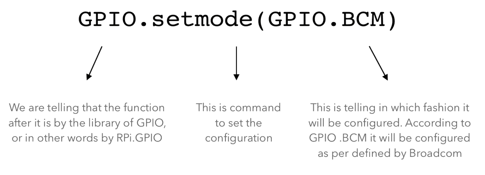
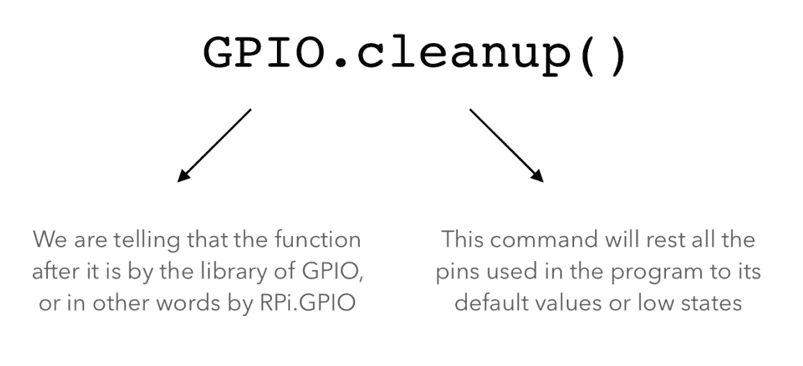
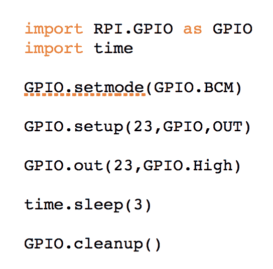

# 第十七章：机器人学 101

一提到机器人，我们就会被科幻小说所包围。我们可能会想起动画片《杰森一家》或者电影《终结者》。但事实上，机器人已经不再属于科幻小说。它们是真实存在的。环顾四周，指出任何物体；它可能没有机器人就不会被制造出来。现代时代已经被机器人塑造了。

但是，你也可以退一步思考，等一下，他所说的东西不是叫做机器而不是机器人吗？嗯，是的，你说得很对，但同时也错得很离谱。正是卡通和科幻小说赋予了一个被称为**机器人**的人形机器人的形象。但机器人远不止于此。

不幸的是，我们没有一个具体的、普遍认可的机器人定义，但是，正如我喜欢说的那样，*任何能够执行物理和智力任务的机器都可以被称为机器人*。

现在，你可能会说，根据我的定义，甚至自动洗衣机都可以被称为机器人。嗯，从技术上讲，是的，为什么我们不称它为机器人呢？想想它为你做了什么，以及多年来进行了什么样的自动化。在你输入布料类型后，它会自动洗涤和烘干，就像你在 19 世纪自己做的那样。我想说的是，我们可以想象有各种各样的机器人，它们可以从根本上改变我们的生活方式。我们需要以更广阔的视角思考——不仅仅将机器人限制为人形机器人的形式。

我们生活在机器人和自动化的黄金时代，新产品的开发就像它可以变得那么简单。十年前可能需要一个工程师团队才能完成的工作，现在可以由一个人在卧室里在几分钟内完成，这要感谢开源世界。与此同时，有硬件计算能力可供你使用，你可以用几百美元在家里建立一个超级计算机。我们周围有各种问题，有些简单，有些复杂，等待着解决。整个过程中唯一缺失的环节就是你：一个有能力利用这些技术解决世界问题的创新思维。

为了让你的思维能够做到这一点，我们将从理解机器人学的根源和基础开始。这本书的目标不仅是制作书中提到的项目，而且是让你了解如何利用资源来建立你的梦想项目。

最后，我要祝贺你在正确的时间进入了这个令人惊叹和未来感的领域。我总是告诉我的学生一个规则，我也想和你分享：

+   首先是科学家

+   第二是研究员

+   第三是工程师

+   第四是技术员

+   最后是技工

这意味着你越早进入任何领域的生命周期，你就越有可能在层次结构中升级。你越晚进入，就越难爬到顶部。

说了这么多，现在让我们直奔主题！在本章中，我们将涵盖以下主题：

+   硬件装备

+   设置树莓派

+   编程

+   玩电压

# 硬件装备

谈到机器人，它们由一些基本的有形组件组成，包括：

+   计算单元

+   传感器

+   执行器

+   底盘

+   电源

首先，我们将讨论微控制器，并在书的过程中根据需要详细讨论其他有形组件。

每当你去购买笔记本电脑或电脑时，你一定听过微处理器这个词。这是必须做出所有决定的主要单位。我称它为“国王”，但没有帝国的国王算什么？国王需要一些可以为他做事的下属，就像微处理器需要一些下属，比如 RAM、存储、I/O 设备等。问题是，当我们放入所有这些东西时，整体单元变得昂贵和笨重。但是，正如我们所知，重量和大小在机器人方面非常重要，所以我们不能承受一个庞大笨重的系统来运行机器人。

因此，我们制造了一个叫做 SoC 的东西。现在，这是一个独角戏，因为这个小芯片本身就具有所有必要的系统来使其工作。所以，现在你不需要添加 RAM 或存储或任何其他东西来使其工作。这些小型微控制器可以变得非常强大，但缺点是，一旦制造商制造了一个 SoC，以后就不能对其进行任何更改。存储器的大小、RAM 或 I/O 都不能更改。但是我们通常可以接受这些限制，因为在编程机器人时，你可能不会使用微控制器的全部功能，直到你运行一些严肃的人工智能或机器学习代码。

这样一个伟大的硬件是树莓派。是的，听起来非常美味，但它还有更多的功能。这是一个超小但非常强大的微控制器。它通常被称为原型板，因为它被世界各地的机器人学家用来实现他们的想法并在短时间内使它们成为现实。它在全球范围内都可以获得，并且非常便宜。你可以在一个仅售 10 美元的设备上随时观看高清电影，上网等等。我想不出还有什么比这更荒谬的了。它非常容易使用，你可以使用 Python 来编程。

因此，基本上它符合我们所有的要求。这将是我们在整本书中将要使用的主要武器。

所以让我向你介绍树莓派！它看起来是这样的：


市场上有各种型号的树莓派。但我们将使用树莓派 Zero W；这将花费你大约 10 美元，比起大麦克汉堡更容易购买。确保你购买带有 W 的树莓派 Zero，这个 W 代表无线功能，比如 Wi-Fi 和蓝牙。还有一些其他东西，你需要订购或安排才能使其工作。以下是一些物品清单：

+   Micro USB 到标准 USB 适配器

+   键盘

+   鼠标

+   Micro SD 存储卡，16 或 32 GB

+   Micro SD 卡读卡器

+   Micro USB 电源适配器（2 安培或更高）

+   Micro HDMI 到 HDMI 端口

+   面包板

+   一堆跳线（公对公，公对母，母对母）

+   3V LED


你可以立即从图像中看出，板载了一个微型 HDMI 端口，你可以通过它连接高清显示器或电视屏幕。其次是一个 Micro SD 卡槽。这将是这台电脑的主要存储设备。除此之外，你还会发现两个 USB 插座和一个摄像头总线。你可能会认为这就是全部，但最好的还在后面。树莓派有一个叫做 GPIO 的东西，它代表通用输入/输出。这些被伪装成树莓派的一个角落上的 40 个插孔，这就是它变得非常特别的原因。

现在，传统上您会将与计算机兼容的设备连接到计算机。因此，连接鼠标、键盘或游戏手柄就像插入 USB 端口一样简单，但是如果您需要将计算机连接到灯泡或空调呢？确切地说，您不能。这就是 GPIO 发挥作用的地方。这些引脚在机器人技术方面非常有用，因为它们可以用于连接各种组件，如传感器/电机。这些引脚的美妙之处在于，根据我们为其编程的需求，它们可以用作输入或输出。因此，正如我们将在后面看到的那样，这些引脚中的每一个都可以在程序中定义为输入或输出。

现在，这 40 个引脚中有 26 个是 GPIO。其余的引脚是通用电源或地线端口。还有两个称为**ID EEPROM**的端口，目前我们不需要它们。


正如您所看到的，树莓派能够为我们提供两种类型的电源供应：3.3V 和 5V。这基本上可以满足我们大部分的需求。

# 设置树莓派

我们将在一会儿讨论有关树莓派的 GPIO 和其他事项。首先，我们将了解如何首次设置此板。

您需要做的第一件事是确保树莓派的操作系统已经准备就绪。我假设您正在使用 Windows PC，但如果您也在其他操作系统上进行操作，那么差别不会太大。

要安装操作系统，请启动您的 PC 并按照以下步骤操作：

1.  转到[www.raspberrypi.org](http://www.raspberrypi.org)并单击 DOWNLOADS

1.  现在点击 RASPBIAN，您将看到以下两个选项：

+   RASPBIAN STRETCH WITH DESKTOP

+   RASPBIAN STRETCH LITE

1.  我们将下载 RASPBIAN STRETCH WITH DESKTOP；这将为我们提供树莓派的 GUI 界面

1.  下载完成后，将包解压缩到一个文件夹中

现在我们需要将它复制到树莓派的存储卡上。您需要复制的存储卡必须经过低级格式化。基本上有两种格式化方式。一种只是擦除索引，另一种是我们所知道的低级格式化，即从索引和物理内存位置中删除所有数据。会有一个按钮来切换低级格式。确保在为此功能格式化存储卡之前点击它。我建议使用[www.sdcard.org](http://www.sdcard.org)的 SD 卡格式化器。现在打开格式化器，您只需使用 32 KB 选项进行格式化。

在这里找到更多详细信息和更多最新信息：[`www.raspberrypi.org/documentation/installation/installing-images/README.md`](https://www.raspberrypi.org/documentation/installation/installing-images/README.md)。

完成后，您必须将映像复制到 SD 卡上。最简单的方法是使用 WinDisk Imager。您可以在线下载它而不会遇到任何问题。然后只需选择映像和 SD 卡上的位置，然后开始复制映像。

这可能需要几分钟。完成后，您的 SD 卡将准备就绪。将其插入树莓派，我们将准备好启动它。但在启动之前，使用 Micro HDMI 到 HDMI 线将显示器连接到树莓派，使用 Micro USB 将键盘和鼠标连接到树莓派，然后使用 Micro USB 适配器连接到标准 USB 适配器来为其供电。现在，使用树莓派上的另一个 USB 端口，使用 Micro USB 电源适配器为其供电。

一旦启动，您将看到一个启动屏幕，几秒钟后您将能够看到桌面。因此，我们的树莓派终于启动并运行了。

继续探索一些选项，上网冲浪，观看 YouTube 上的一些猫视频，并熟悉这个强大的设备。

到目前为止，您可能已经开始欣赏树莓派的强大。它可能比您平常使用的计算机稍慢。但是，拜托，这个东西只要 10 美元！

# 让我们编程

在本章中，我们将让您熟悉 Python 以及如何在此设备上使用 GPIO。要做到这一点，请点击左上角的树莓图标。您将看到 Python 控制台 3.0。也可能有旧版本的 Python。我们将在本书中使用更新的版本。

一旦窗口打开，您将看到您将在其中进行编码的游乐场。所以现在我们准备为 Python 机器人编写第一行代码。现在让我们看看它是如何完成的。

我们将首先写的是：


几乎所有的时候，当我们开始编写程序时，我们会首先写上述行。现在，在我们了解它的作用之前，我们需要了解库。通常在编写代码时，我们将不得不在多个地方一遍又一遍地编写代码。这需要很多时间，而且肯定不酷！

因此，为了解决这个问题，我们创建了函数。函数是一个微型程序，我们可能认为它会一遍又一遍地使用。在这个微型程序中，我们还提到它将被称为什么。

假设有一个代码，我们需要一遍又一遍地将两个数字相乘。所以，我们写一次代码并将其制作成一个函数。我们还将这个函数命名为`Multiply`。

现在，每当我们需要相乘两个数字时，我们不必再次编写它的代码；相反，我们只需调用函数来代替我们编写相乘的代码。问题是，我们如何告诉程序要相乘哪个数字呢？

这也有一个解决方案。正如您以后可能看到的，每当调用一个函数时，我们在其后放上开放和关闭的括号，比如`multiply()`。

如果括号是空的，那意味着没有给出用户输入。例如，如果我们要相乘`2`和`3`，我们只需写`Multiply(2,3)`。

我们正在输入`2`和`3`。括号中的输入位置也很重要，因为括号中的位置将定义程序中的位置。

现在，假设您创建了这样的函数：

+   加法

+   减法

+   相乘

+   除法

假设您将它们堆叠在一起。然后，一堆函数组合在一起将被称为库。这些库可以有数百个函数。有一些函数已经在 Python 语言中，以便程序员更轻松地完成工作。其他可以定义为开源或根据您的方便开发。

现在，回到重点。我们正在调用`RPi.GPIO`库；这是由树莓派定义的库。这将使您在编程树莓派时更加轻松。因此，在程序中，一旦我们调用库，所有函数都可以随时使用。

在下一行，我们写`Import.time`。正如您可能已经猜到的那样，这是用来导入时间库的。我们很快就会了解它的作用。

下一行代码将如下所示：



在我们了解它的作用之前，让我们更多地了解一下 GPIO。这些引脚根据它们在树莓派中的物理位置进行了硬编号。但是，我们可以在软件中更改引脚的编号以便我们理解和方便使用。但在这个代码中，我们不会对此进行操作，而是将其设置为由 Broadcom 制造的默认设置，这是树莓派微控制器的制造商。

这一行使用了`RPi.GPIO`库的一个名为`setmode`的函数。这个函数的作用是将`setmode`的引脚配置设置为（`GPIO.BCM`）—`BCM`是`GPIO`的一个进一步的函数。

现在我们可以使用基本引脚配置。GPIO 引脚的特点是可以同时用作输入和输出。但唯一的条件是我们必须在程序中指定它是要用作输入还是输出。它不能同时执行两个功能。下面是如何做到的：


下一行代码将如下所示：


同样，我们使用了 GPIO 库的一个函数`output`。它的作用是设置板子上特定引脚的状态。所以，这里我们指定了引脚号`23`必须设置为高电平。只是为了清楚起见，高电平表示开，低电平表示关。

下一行代码将如下所示：


在这一行中，我们使用了来自 time 库的一个函数。sleep 函数基本上会冻结所有 GPIO 引脚的状态。所以，例如，如果引脚`23`是高电平，那么它将保持高电平，直到执行`time`函数`sleep`。在`sleep`函数中，我们定义了值为`3`秒。

因此，3 秒内，树莓派的引脚状态将保持在这行代码之前的状态。

最后，代码的最后一行将是：



这将是每个程序之后的常见情景。GPIO 库的这个函数将重置程序中使用的每个引脚的状态，所有引脚的状态将变为低电平。记住，它只会影响程序中使用的引脚，而不会影响树莓派上的其他引脚。所以，例如，我们在程序中使用了引脚`23`，所以它只会影响引脚`23`，而不会影响树莓派上的其他引脚。

最后，你的程序会看起来像这样：



现在，你必须记住的一件事是，我们写的任何代码都将按顺序执行。所以，假设我们把`import RPI.GPIO as GPIO`放在底部，那么整个程序将无法工作。为什么？因为一旦它到达`GPIO.setmode(GPIO.BCM)`，它将不理解`GPIO`是什么，也不会理解`setmode`是什么。因此，我们总是在开始编写代码时导入库。

现在，基于相同的概念，它将以以下方式执行程序：

+   `GPIO.out(23,GPIO.High)`: 它会将引脚`23`设置为高电平

+   `time.sleep(3)`: 它会等待 3 秒，而引脚仍然是高电平

+   `GPIO.cleanup()`: 最后，它会将引脚`23`的状态设置为低电平

现在，为了查看程序是否工作，让我们连接一些硬件来检查我们所写的是否真的发生了。

我假设读者已经知道如何使用面包板。如果你不熟悉，就去搜索一下。理解起来只需要 5 分钟。它非常简单，会派上用场。

现在继续连接 LED 到面包板上，然后将 LED 的地连接到树莓派上的地引脚，并将正极/VCC 连接到引脚号`23`（参考引脚图）。

你也可以参考以下图表：


完成后，运行代码看看会发生什么！

LED 将会发光 3 秒，然后再次关闭，正如我们预期的那样。现在让我们玩弄一下代码，做一点修改。这次，我们将添加一些用粗体标记的额外行：

```py
import RPi.GPIO as GPIO
from time
import sleep
GPIO.setmode(GPIO.BOARD)
GPIO.setup(23, GPIO.OUT)
while True:
 for i in range(3):
  GPIO.output(23, GPIO.HIGH)
sleep(.5)
GPIO.output(23, GPIO.LOW)
sleep(.5)
sleep(1)
GPIO.cleanup()
```

在理解代码内部之前，你会注意到并不是每一行都对齐，它们已经被缩进了。这是什么意思？

一个与其他代码行一起缩进的行称为块。所以例如，如果你有一个语句如下

```py
while True:
 for i in range(3):
  GPIO.output(23, GPIO.HIGH)
sleep(.5)
GPIO.output(23, GPIO.LOW)
sleep(.5)
sleep(1)
GPIO.cleanup()
```

现在在这行让我们看看代码将如何运行。

+   一个 while true 循环将运行，这将运行其中的代码，即

```py
for i in range(3):
  GPIO.output(23, GPIO.HIGH)
sleep(.5)
GPIO.output(23, GPIO.LOW)
sleep(.5)
sleep(1)
```

+   之后，代码`for I in range (3):`将运行。它将运行 for 循环内的代码，直到`I`的值在范围内，因此下面的代码将运行。

```py
GPIO.output(23, GPIO.HIGH)
sleep(.5)
GPIO.output(23, GPIO.LOW)
sleep(.5)
```

上面的代码可以称为一个代码块，它在`for`循环内。代码块可以通过缩进代码来制作。

现在，让我们看看它的作用。`While True`是一个循环，它将一遍又一遍地运行`for`循环，直到条件不再为假。我们在这里使用的条件是：

```py
for i in range(3):
```

最大范围是`3`，每次语句运行时，`i`的值增加`+1`。因此，它基本上充当计数器。让我们看看程序实际会做什么。

它将检查`i`的值，并在此之后递增`1`。随着代码的进展，它将使 LED 在 0.5 秒内高亮，然后在 0.5 秒内关闭。然后它将等待 1 秒。这将重复，直到 while 循环为假，也就是`i`的值大于`3`，它将退出程序并终止。运行程序，看看它是否真的发生了。

到目前为止，你已经了解了在树莓派中编程是多么容易。为了更进一步，我们将编写另一个程序并对硬件进行一些更改。

我们将从引脚号 7 到 12 连接五个 LED。我们将使它们以一定模式开关。

连接后，我们将编写以下代码：

```py
import RPi.GPIO as GPIO
from time
import sleep
GPIO.setmode(GPIO.BOARD)
GPIO.setup(7, GPIO.OUT)
GPIO.setup(8, GPIO.OUTPUT)
GPIO.setup(9, GPIO.OUTPUT)
GPIO.setup(10, GPIO.OUTPUT)
GPIO.setup(11, GPIO.OUTPUT)
while True:
  for i in range(7, 12):
  GPIO.output(i, GPIO.HIGH)
sleep(1)
GPIO.cleanup()
```

现在代码非常简单。让我们看看它的意思：


在我告诉你更多关于代码的事情之前，让我们继续运行它。

当你运行它时，你会明白，根据语句，它会逐个地址引脚，并在每隔 1 秒后将它们切换到高电平。

# 玩耍电压

到目前为止一切顺利！但你注意到了一件事吗？我们一直在使用树莓派作为开关，简单地打开和关闭各种组件。但是如果我们需要改变刚刚编程的 LED 的强度怎么办？这可能吗？答案是否定的。但我们仍然可以以某种方式完成！

让我们看看如何。计算机以二进制工作，这意味着它们可以表示`0`或`1`。这是因为任何系统中的主要计算单元都是基于可以表示`0`或`1`的晶体管。因此，从技术上讲，计算机只能进行二进制架构的切换。然而，有一个技巧。这个技巧叫做**脉宽调制**（**PWM**）。

现在，在我详细解释任何内容之前，让我们继续将 LED 插入到引脚号为`18`，然后将此代码复制到树莓派并运行：

```py
import RPi.GPIO as GPIO
import time                             
GPIO.setmode(GPIO.BCM)       
GPIO.setup(18,GPIO.OUT)         

pwm= GPIO.PWM(18,1)
duty_cycle = 50
pwm.start(duty_cycle)

time.sleep(10)

GPIO.cleanup()
```

你注意到了吗？LED 将以每秒一次的频率闪烁。现在让我们稍微调整一下，将`PWM(18,1)`改为`PWM(18,5)`。运行并看看会发生什么。

您可能已经注意到它现在每秒闪烁五次。因此数字`5`基本上表示频率，因为 LED 现在每秒闪烁五次。现在，再次重写代码并将`5`增加到`50`。一旦增加到`50`，它会在一秒内开关 LED 50 次，或者以 50 赫兹的频率。因此，对您来说，它看起来好像一直开着。

现在是有趣的部分。转到您的代码，并将`duty_cycle = 50`更改为`duty_cycle = 10`。

你注意到了什么？你一定已经注意到 LED 的亮度现在低得多。实际上，它将是原来的一半。

让我们看看实际发生了什么：


从图表中可以看出，该函数基本上创建一个脉冲，我们正在更改其特性。第一个特性是频率，即每秒生成的脉冲。在代码行`pwm= GPIO.PWM(18,1)`中，我们基本上告诉微控制器在引脚号`1`上每秒生成一个脉冲。在第二行中，占空比是一个百分比值。它确定脉冲高电平的时间占总脉冲时间的百分比。对于以下代码，以下项目将是其特性：

```py
pwm= GPIO.PWM(18,1)
duty_cycle = 50
```

+   每个脉冲的时间/宽度为 1 秒

+   它将打开的时间占 50%

+   它将关闭的时间占 50%

+   它将打开的时间为 0.5 秒

+   它将关闭 0.5 秒

当我们增加频率超过 50 赫兹时，人眼很难分辨它是在开还是在关。理论上，引脚将保持高电平的时间占 50%，其余时间将是低电平。因此，如果我们取平均值，我们可以很容易地说整体电压将是原始电压的一半。使用这种方法，我们可以根据我们的需求调制任何引脚的电压输出。

# 总结

现在你一定已经明白了 GPIO 如何被用作输出，以及通过应用条件，我们如何改变它们的行为。

在下一章中，我们将了解这些引脚如何被用作输入。所以回来吧，我们在那里见！
