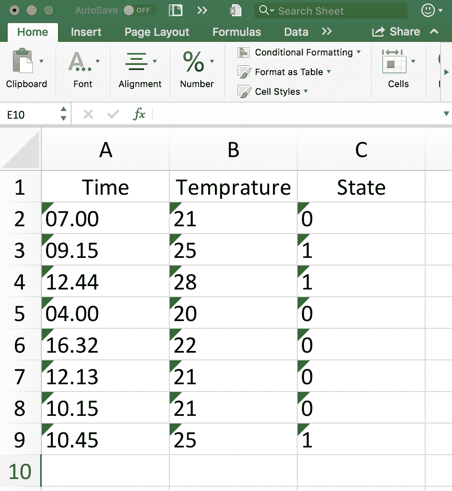

# 第二十九章：机器学习

从原始时代到现在，机器人和计算机都被编程来执行一系列活动。这些活动可能非常庞大。因此，为了开发复杂的程序，需要大量的软件工程师，他们日夜工作以实现某种功能。当问题定义明确时，这是可行的。但是当问题也变得非常复杂时呢？

学习是使我们成为人类的东西。我们的经验使我们能够以更好和更有效的方式适应各种情况。每次我们做某事，我们都会学到更多。这使我们在一段时间内更擅长做这项任务。俗话说熟能生巧，通过一遍又一遍地做事情来学习，使我们变得更好。

然而，让我们退一步来定义学习是什么？我想引用 Google 的说法，根据它的说法，*学习是通过学习、经验或教导获得的知识*。因此，学习基本上是一种从我们周围获取信息以理解过程及其性质的方式。

现在，你可能会想，等一下，在之前的章节中，当我们制作守卫机器人时，我们已经让我们的系统学习了很多视觉数据。你的想法是完全正确的。然而，学习可以通过不同的方式进行。对一个问题有效的方法对另一种问题可能是无效的。因此，有各种类型的学习算法和原则。在本章中，我们将专注于一种名为**k 最近邻**的算法。它被称为**懒惰算法**。我个人喜欢这个算法用于分类。为什么？因为从技术上讲，它没有训练阶段。怎么做？

k 最近邻实际上是一个聪明的算法。它不是计算所提供数据的回归并进行大量的数学计算，而是简单地从提供的数据集中获取结构化数据。每当有新的数据输入进行预测时，它只是根据用户提供的数据在数据库中搜索最接近的*k*匹配数据，基于其给定的分类。因此，在本章中，我们将学习这个算法将如何工作，以及我们如何使用它来使我们的家变得智能。

在本章中，我们将涵盖以下主题：

+   制作数据集

+   使用数据集进行预测

+   让你的家学习

+   家庭学习和自动化

# 制作数据集

现在，我们需要制作一个虚拟数据集，以便机器学习算法可以根据该数据预测应该做什么。

要制作数据集，我们需要了解正在考虑的数据是什么。在本章中，我们将基于时间和温度制作一个机器学习算法，以预测风扇应该开启还是关闭。因此，我们至少需要向系统提供两样东西，一样是“温度”，另一样是“时间”，以便进行预测。但要记住的一件事是，我们正在谈论一个监督学习算法，因此为了训练模型，我们还需要将“温度”和“时间”的结果提供给风扇的状态。在这里，风扇的状态可以是开启或关闭。因此，我们可以用`0`或`1`来表示。现在让我们继续自己制作一个数据集。

现在，要制作数据集，你只需打开 Microsoft Excel 并开始编写数据集如下：



最好拥有超过 20 组数据的数据集。此外，数据具有明显的特征并且不是随机数据是很重要的。例如，在前面的案例中，你可以看到在温度为`28`时，时间为`12.44`时，风扇将开启；然而，在同一时间，当时间为`12.13`且温度为`21`时，风扇是关闭的。

创建数据集后，您必须以 CSV 格式将其保存为名为`dataset`的文件。可能有一些用户不使用 Microsoft Excel，在这种情况下，您可以在文本编辑器中以相同格式编写数据，最后以 CSV 格式保存。

一旦您有了`dataset.csv`文件，那么您必须继续将它们复制到您将保存即将到来的代码的地方。完成后，我们可以继续下一步。

请记住，数据的质量越好，学习过程就越好。因此，您可能需要花一些时间来精心制作数据集，以便它确实有意义。

# 使用数据集进行预测

不多说了，让我们看看以下代码：

```py
import numpy as np
import pandas as pd
from sklearn.neighbors import KNeighborsClassifier

knn = KNeighborsClassifier(n_neighbors=5)
data = pd.read_csv('dataset.csv')

x = np.array(data[['Time', 'Temp']])
y = np.array(data[['State']]).ravel()

knn.fit(x,y)

time = raw_input("Enter time")
temp = raw_input("Enter temp")

data =. []

data.append(float(time))
data.append(float(temp))

a = knn.predict([data])

print(a[0])}
```

所以，让我们看看我们在这里做了什么：

```py
import numpy as np
```

我们将`numpy`导入到我们的程序中；这有助于我们处理列表和矩阵：

```py
import pandas as pd
```

在这里，我们正在导入一个名为`pandas`的库；这有助于我们读取逗号分隔值或者叫 CSV 文件。我们将使用 CSV 文件来存储我们的数据并访问它进行学习过程：

```py
from sklearn.neighbors import KNeighborsClassifier
```

在这里，我们从`sklearn`库中导入`KneighborsClassifier`。`sklearn`本身是一个庞大的库；因此，我们只导入其中的一部分，因为在这个程序中我们不会使用全部内容：

```py
knn = KNeighborsClassifier(n_neighbors=5)
```

在这里，我们正在给变量`knn`赋值，其中值将是`KNeighborsClassifer(n_neighbors =5)`；这意味着它正在使用`KneighborsClassifer()`函数，并将参数设置为`n_neighbors=5`。这个参数告诉`KneighborsClassifer`函数算法中将有五个邻居。进一步使用这个声明，整个函数可以使用`knn`来调用：

```py
data = pd.read_csv('dataset.csv')
```

在这里，我们为名为`data`的变量提供值，传递的值是`pd.read_csv('dataset.csv')`；这意味着每当调用`data`时，将调用`pandas`库中的`pd.read_csv()`函数。这个函数的目的是从 CSV 文件中读取数据。在这里，传递的参数是`dataset.csv`；因此，它指示函数将从一个名为`dataset.csv`的文件中读取数据：

```py
x = np.array(data[['Time', 'Temp']])
```

在下一行中，我们为变量`x`传递值，传递的值是`np.array(data[['Time, 'Temp']])`。现在，`np.array`函数通过`numpy`库创建一个数组。这个数组将存储名为`Time`和`Temp`的数据：

```py
y = np.array(data[['State']]).ravel()
```

就像上一次一样，我们将`State`存储在通过`numpy`库的`.ravel()`函数创建的数组中，最后会转置数组。这样做是为了使两个数组`x`和`y`之间可以进行数学运算：

```py
knn.fit(x,y)
```

在这一小行中，我们使用了`knn`库中的`fit()`函数，它的作用是使用`x`作为主要数据，`y`作为输出结果数据来拟合模型：

```py
time = raw_input("Enter time")
temp = raw_input("Enter temp")
```

在这一行中，我们正在向用户请求数据。在第一行，我们将打印`输入时间`，然后等待用户输入时间。用户输入时间后，它将被存储在名为`time`的变量中。一旦完成，它将继续下一行；代码将打印`输入温度`，一旦提示用户输入温度，它将等待数据被收集。一旦用户收集到数据，它将把数据存储在名为`temp`的变量中：

```py
data =. []
```

在这里，我们正在创建一个名为`data`的空列表；这个列表将用于计算输出的结果状态。由于所有的机器学习算法都是以列表数据类型工作的。因此，决策的输入必须以列表的形式给出：

```py
data.append(float(time))
data.append(float(temp))
```

在这里，我们正在向我们刚刚创建的名为`data`的列表中添加数据。首先添加`time`，然后是`temp`：

```py
a = knn.predict([data])
```

完成后，将使用`knn`算法中的名为`predict`的函数来根据提供的名为`data`的列表来预测输出。预测算法的输出将被提取到一个名为`a`的变量中：

```py
print(a[0])
```

最后，一旦预测完成，我们将读取`a`的值，并记住所有的数据 I/O 都是以列表的形式进行的。因此，预测算法给出的数据输出也将以列表格式呈现。因此，我们打印列表的第一个元素。

此输出将根据用户提供的数据集预测风扇的状态。因此，继续输入温度和时间，让系统为您预测结果。看看它是否正常工作。如果不正常，那么尝试向 CSV 文件添加更多数据集，或者查看数据集中的值是否真的有意义。我相信您最终会得到一个出色的预测系统。

# 让您的家学习

一旦这个构想完成了，继续将其连接起来，如下所示：


设置好之后，是时候将以下代码写入我们的树莓派了：

```py
import Adafruit_DHT
import datetime
import RPi.GPIO as GPIO
import time
import numpy as np
import pandas as pd
import Adafruit_DHT
from sklearn.neighbors import KNeighborsClassifier

GPIO.setmode(GPIO.BCM)
GPIO.setwarnings(False)

fan = 22
light = 23
sw1 = 13
sw2 = 14

GPIO.setup(led1,GPIO.OUT)
GPIO.setup(led2,GPIO.OUT)
GPIO.setup(sw1,GPIO.IN)
GPIO.setup(sw2,GPIO.IN)

sensor = 11
pin = 2

f = open("dataset.csv","a+")
count = 0
while count < 50:

 data = ""

 H = datetime.datetime.now().strftime('%H')
 M = datetime.datetime.now().strftime('%M')

 data = str(H)+"."+str(M)
 humidity,temperature = Adafruit_DHT.read_retry(sensor,pin)
 data = data + "," + str(temperature)

prev_state = state

 if (GPIO.input(sw1) == 0) and (GPIO.input(sw2) == 0):
     state = 0
     GPIO.output(light,GPIO.LOW)
     GPIO.output(fan,GPIO.LOW)

 elif (GPIO.input(sw1) == 0) and (GPIO.input(sw2) == 1):
     state = 1
     GPIO.output(light,GPIO.HIGH)
     GPIO.output(fan,GPIO.LOW)

 elif (GPIO.input(sw1) == 1) and (GPIO.input(sw2) == 0):
    state = 2
     GPIO.output(light,GPIO.LOW)
     GPIO.output(fan,GPIO.HIGH)

 elif (GPIO.input(sw1) == 1) and (GPIO.input(sw2) == 1):
    state = 3
     GPIO.output(light,GPIO.HIGH)
     GPIO.output(fan,GPIO.HIGH)

 data = ","+str(state)

if prev_state =! state:

     f.write(data)
     count = count+1

f.close()
```

现在，让我们看看我们在这里做了什么：

```py
f = open("dataset.csv","a+")
```

在这行代码中，我们将值`open("dataset.csv", "a+")`赋给变量`f`。然后，`open()`函数将打开传递给它的文件，我们的情况下是`dataset.csv`；参数`a+`表示将值附加到 CSV 文件的末尾。因此，这行代码将打开文件`dataset.csv`并添加我们稍后将传递的值：

```py
 data = ""
```

我们通过名称`data`声明了一个空字符串：

```py
 data = str(H)+"."+str(M)
```

我们正在将小时和分钟的值添加到字符串中，用点号分隔以进行区分。因此，数据看起来像`HH.MM`：

```py
 humidity,temperature = Adafruit_DHT.read_retry(sensor,pin)
```

我们使用这行代码从 DHT 11 传感器读取湿度和温度读数，并将这些值传递给变量`humidity`和`temperature`：

```py
data = data + "," + str(temperature)
```

一旦数据被读取，我们也将温度添加到变量`data`中。因此，现在数据看起来像这样`HH.MM`和`TT.TT`：

```py
 if (GPIO.input(sw1) == 0) and (GPIO.input(sw2) == 0):
 state = 0
 elif (GPIO.input(sw1) == 0) and (GPIO.input(sw2) == 1):
 state = 1
 elif (GPIO.input(sw1) == 1) and (GPIO.input(sw2) == 0):
 state = 2
 elif (GPIO.input(sw1) == 1) and (GPIO.input(sw2) == 1):
 state = 3
```

在这里，我们定义了不同类型的状态，这些状态对应于开关组合。其表格如下：

| **开关 1** | **开关 2** | **状态** |
| --- | --- | --- |
| `0` | `0` | `0` |
| `0` | `1` | `1` |
| `1` | `0` | `2` |
| `1` | `1` | `3` |

因此，通过状态的值，我们可以了解哪个开关将被打开，哪个将被关闭：

```py
 data = ","+str(state)
```

最后，状态的值也被添加到名为`data`的变量中。现在，最终，数据看起来像`HH.MM`，`TT.TT`和`S`：

```py
f.write(data)
```

现在，使用`write()`函数，我们正在将数据的值写入到我们之前定义的文件中，该文件的值为`f`。

因此，每次开关打开或关闭时，数据都将被收集，并且该值将以时间戳记录在文件中。这些数据随后可以用于在任何给定时间预测家庭的状态，而无需任何干预：

```py
if prev_state =! state:

     f.write(data)
     count = count+1
```

在这里，我们正在将状态与`prev_state`进行比较，您可以在我们的程序中看到。先前的状态是在程序开始时计算的。因此，如果系统的状态发生任何变化，那么`prev_state`和`state`的值将不同。这将导致`if`语句为真。当发生这种情况时，数据将使用`write()`函数写入到我们的文件中。传递的参数是需要写入的值。最后，计数的值增加了`1`。

一旦这个程序运行了几个小时或者可能是几天，它将收集关于灯光和风扇开关模式的一些非常有用的数据。此后，这些数据可以被获取到之前的程序中，程序将能够根据时间和温度做出自己的决定。

# 家庭学习和自动化

现在，在前面的部分中，我们已经了解了学习的工作原理，现在是时候利用这个概念制作一个能够自动理解我们的功能并做出决策的机器人了。基于我们的决定，系统将判断应该做什么。但这一次，而不是由用户提供一组数据，让这个程序自己创建数据。一旦数据对自己的功能似乎足够，那么，不用太多的解释，让我们直接开始吧：

```py
import Adafruit_DHT
import datetime
import RPi.GPIO as GPIO
import time
import numpy as np
import pandas as pd
from sklearn.neighbors import KNeighborsClassifier

GPIO.setmode(GPIO.BCM)
GPIO.setwarnings(False)

light = 22
fan = 23
sw1 = 13
sw2 = 14

GPIO.setup(light,GPIO.OUT)
GPIO.setup(fan,GPIO.OUT)
GPIO.setup(sw1,GPIO.IN)
GPIO.setup(sw2,GPIO.IN)

sensor = 11
pin = 2

f = open("dataset.csv","a+")
count = 0

while count < 200:

        data = ""

        H = datetime.datetime.now().strftime('%H')
        M = datetime.datetime.now().strftime('%M')

        data = str(H)+"."+str(M)
        humidity,temperature = Adafruit_DHT.read_retry(sensor,pin)
        data = data + "," + str(temperature)

prev_state = state

 if (GPIO.input(sw1) == 0) and (GPIO.input(sw2) == 0):
     state = 0
     GPIO.output(light,GPIO.LOW)
     GPIO.output(fan,GPIO.LOW)

 elif (GPIO.input(sw1) == 0) and (GPIO.input(sw2) == 1):
     state = 1
     GPIO.output(light,GPIO.HIGH)
     GPIO.output(fan,GPIO.LOW)

 elif (GPIO.input(sw1) == 1) and (GPIO.input(sw2) == 0):
    state = 2
     GPIO.output(light,GPIO.LOW)
     GPIO.output(fan,GPIO.HIGH)

 elif (GPIO.input(sw1) == 1) and (GPIO.input(sw2) == 1):
    state = 3
     GPIO.output(light,GPIO.HIGH)
     GPIO.output(fan,GPIO.HIGH)

 data = ","+str(state)

 if prev_state =! state:

     f.write(data)
     count = count+1

Test_set = []
knn = KNeighborsClassifier(n_neighbors=5)
data = pd.read_csv('dataset.csv')

X = np.array(data[['Time', 'Temp']])
y = np.array(data[['State']]).ravel()

knn.fit(X,y)

While Count > 200:

    time = ""

    H = datetime.datetime.now().strftime('%H')
    M = datetime.datetime.now().strftime('%M')

    time = float(str(H)+"."+str(M))

    humidity, temperature = Adafruit_DHT.read_retry(sensor, pin)

 temp = int(temperature)
 test_set.append(time)
 test_set.append(temp)

 a = knn.predict([test_set]])
 Out = a[0]

 If out == 0:
 GPIO.output(light,GPIO.LOW)
 GPIO.output(fan,GPIO.LOW)

 If out == 1:
 GPIO.output(light,GPIO.LOW)
 GPIO.output(fan,GPIO.HIGH)

 If out == 2:
 GPIO.output(light,GPIO.HIGH)
 GPIO.output(fan,GPIO.LOW)

 If out == 3:
 GPIO.output(light,GPIO.HIGH)
 GPIO.output(fan,GPIO.HIGH)

```

现在让我们看看我们在这里做了什么。在这个程序中，条件`while count < 200:`内的程序的第一部分与我们在上一个代码中所做的完全相同。所以，它只是根据用户的要求做事情，同时，它正在从用户那里获取值以了解他们的工作行为：

```py
while count > 200:
```

此后，当计数超过`200`时，代码的第二部分将开始执行，这是在前面的循环内部：

```py
    time = ""
```

在这一行中，我们正在形成一个名为 time 的空字符串，我们将在其中存储时间的值：

```py
    H = datetime.datetime.now().strftime('%H')
    M = datetime.datetime.now().strftime('%M')
```

我们将时间的值存储到名为`H`和`M`的变量中：

```py
    time = float(str(H)+"."+str(M))
```

我们现在将时间的值存储在字符串`time`中。这将包括小时和分钟：

```py
 temp = int(temperature)
```

为了简化计算并减少系统的计算负载，我们正在减小温度变量的大小。我们通过去掉小数位来做到这一点。为了做到这一点`TT.TT`，我们只是消除小数点并将其转换为整数。这是通过名为`int()`的函数完成的。温度的整数值将存储在名为`temp`的变量中：

```py
 test_set.append(time)
 test_set.append(temp)
```

在这里，我们将时间和温度的值添加到名为`test_set`的列表中，如果您查看程序，那么您将看到程序中间声明了一个空集。所以，现在这个`test_set`有了`time`和`temp`的值，这可以进一步被预测算法用来预测状态：

```py
 a = knn.predict([test_set]])
```

使用名为`predict()`的简单函数从`knn`函数中，我们可以预测状态的值。我们只需要将数据或`test_set`列表传递给预测函数。这个函数的输出将是一个存储在变量`a`中的列表：

```py
 Out = a[0]
```

`Out`的值将设置为列表`a`的第一个元素：

```py
 If out == 0:
 GPIO.output(light,GPIO.LOW)
 GPIO.output(fan,GPIO.LOW)

 If out == 1:
 GPIO.output(light,GPIO.LOW)
 GPIO.output(fan,GPIO.HIGH)

 If out == 2:
 GPIO.output(light,GPIO.HIGH)
 GPIO.output(fan,GPIO.LOW)

 If out == 3:
 GPIO.output(light,GPIO.HIGH)
 GPIO.output(fan,GPIO.HIGH)
```

使用前面的代码块，我们能够根据算法预测的状态有选择地打开灯和风扇。因此，使用这个，程序将能够自动预测并打开或关闭灯和风扇，无需您的干预。

# 总结

在本章中，我们了解了即使没有学习，机器学习是如何工作的。我们了解了如何提供数据集，并且可以使用现有系统创建新的数据集。最后，我们了解了系统如何无缝地收集数据，从数据中学习，最终提供输入。
