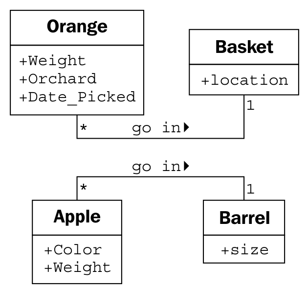
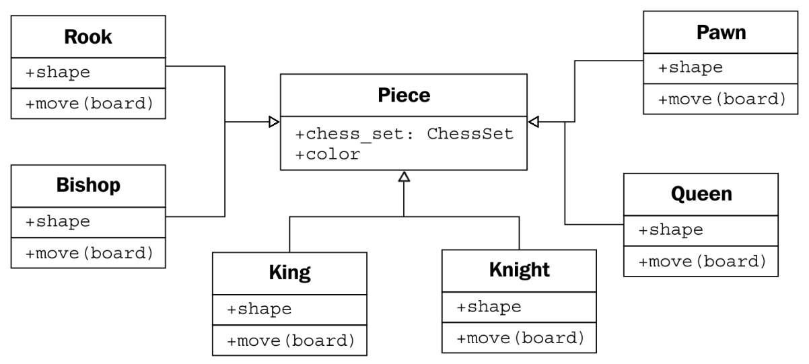
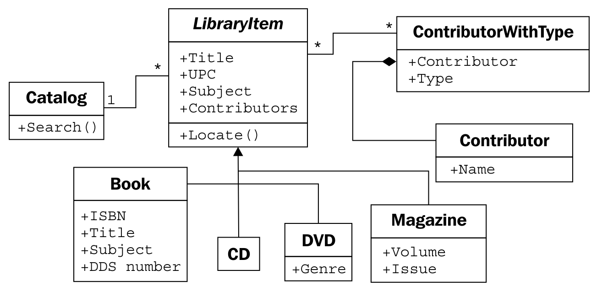

# 十五、面向对象设计

在软件开发中，设计通常被认为是在编程之前*完成的步骤。这不是真的；在现实中，分析、编程和设计往往会重叠、组合和交织在一起。在本章中，我们将介绍以下主题：*

*   面向对象意味着什么
*   面向对象设计与面向对象编程的区别
*   面向对象设计的基本原则
*   基本的**统一建模语言**（**UML**）以及当它不是邪恶的时候

# 引入面向对象

每个人都知道物体是什么：我们可以感知、感觉和操纵的有形物体。我们最早接触的对象通常是婴儿玩具。木块、塑料形状和尺寸过大的拼图块是常见的第一批物品。婴儿很快就能学会某些物体做某些事情：铃声响起，按钮按下，杠杆被拉动。

软件开发中对象的定义并没有太大的不同。软件对象可能不是您可以拾取、感知或感觉到的有形的东西，但它们是可以做某些事情并对它们做某些事情的东西的模型。形式上，对象是**数据**和相关**行为**的集合。

那么，知道对象是什么，面向对象意味着什么？在字典中，*定向*表示*定向*。因此，面向对象意味着功能上指向对象建模。这是用于复杂系统建模的许多技术之一。它是通过描述一组交互对象的数据和行为来定义的。

如果你读过任何宣传，你可能会遇到术语*面向对象分析*、*面向对象设计*、*面向对象分析与设计*和*面向对象编程*。这些都是在通用的*面向对象*保护伞下高度相关的概念。

事实上，分析、设计和编程都是软件开发的各个阶段。将它们称为面向对象只是指定了所追求的软件开发级别。

**面向对象分析**（**OOA**）是一个观察问题、系统或任务（某人希望将其转化为应用程序）并识别对象以及这些对象之间的交互的过程。分析阶段是关于*需要做什么的。*

分析阶段的输出是一组需求。如果我们在一个步骤中完成分析阶段，我们会将一个任务，例如*我需要一个网站*，转化为一组需求。例如，这里或一些关于网站访问者可能需要做什么的需求（*斜体*表示动作，**粗体**表示对象）：

*   *回顾*我们的**历史**
*   *申请*申请**工作**
*   *浏览*、*比较*、*订购***产品**

在某些方面，*分析*用词不当。我们前面讨论的婴儿不会分析积木和拼图。相反，她探索她的环境，操纵形状，并看到它们可能适合的地方。更好的说法可能是*面向对象的探索*。在软件开发中，分析的初始阶段包括采访客户、研究他们的过程和消除可能性。

**面向对象设计**（**OOD**是将这些需求转化为实现规范的过程。设计者必须命名对象，定义行为，并正式指定哪些对象可以激活其他对象上的特定行为。设计阶段是关于*如何做*事情。

设计阶段的输出是一个实现规范。如果我们在一个步骤中完成设计阶段，我们将把在面向对象分析期间定义的需求转化为一组可以（理想情况下）用任何面向对象编程语言实现的类和接口。

**面向对象编程**（**OOP**）是将这个完美定义的设计转化为一个工作程序的过程，该程序完全按照 CEO 最初的要求执行。

是的，对！如果世界符合这个理想，我们可以像所有旧教科书告诉我们的那样，按照完美的顺序一个接一个地遵循这些阶段，那将是多么美好的事情。和往常一样，现实世界要黑暗得多。无论我们如何努力地将这些阶段分开，我们总会在设计时找到需要进一步分析的东西。当我们在编程时，我们会在设计中发现需要澄清的特性。

大多数二十一世纪的开发都是在迭代开发模型中进行的。在迭代开发中，对任务的一小部分进行建模、设计和编程，然后对程序进行审查和扩展，以改进每个特性，并在一系列短的开发周期中包括新特性。

本书的其余部分是关于面向对象编程的，但在本章中，我们将介绍设计环境中的基本面向对象原则。这使我们能够理解这些（相当简单的）概念，而不必与软件语法或 Python 回溯争论。

# 对象和类

因此，对象是具有相关行为的数据集合。我们如何区分不同类型的对象？苹果和桔子都是实物，但有一句谚语说它们无法比较。苹果和桔子在计算机编程中并不经常建模，但让我们假设我们正在为一个果园做一个库存应用程序。为了简化这个例子，我们可以假设苹果装在桶里，桔子装在篮子里。

现在，我们有四种物体：苹果、桔子、篮子和桶。在面向对象建模中，用于*类对象*的术语是**类**。所以，从技术上讲，我们现在有四类对象。

理解对象和类之间的区别很重要。类描述对象。它们就像创建对象的蓝图。你面前的桌子上可能有三个桔子。每个橙色都是一个不同的对象，但这三个对象都具有与一个类相关联的属性和行为：橙色的通用类。

我们的库存系统中四类对象之间的关系可以使用**统一建模语言**（由于三个字母的首字母缩写永远不会过时，所以总是称为**UML**）类图来描述。这是我们的第一个类图：

此图显示**橙色**与**篮子**有某种关联，而**苹果**也与**桶**有某种关联。*联想*是两个阶级相互关联的最基本方式。

UML 在管理者中非常流行，偶尔也会被程序员贬低。UML 图的语法通常非常明显；当你看到一本教程时，你不必阅读它（大部分）就能理解它所发生的事情。UML 也很容易绘制，而且非常直观。毕竟，许多人在描述类及其关系时，会自然而然地在它们之间画线框。基于这些直观的图表建立一个标准，使得程序员可以轻松地与设计师、经理以及其他人进行交流。

然而，一些程序员认为 UML 是浪费时间。引用迭代开发，他们会争辩说，在华丽的 UML 图中完成的形式化规范在实现之前是多余的，维护这些形式化图只会浪费时间，对任何人都没有好处。

根据所涉及的公司结构，这可能是真的，也可能不是真的。然而，每一个由不止一个人组成的编程团队偶尔都必须坐下来讨论它目前正在处理的子系统的细节。UML 在这些头脑风暴会议中非常有用，可以快速方便地进行交流。甚至那些嘲笑正式类图的组织也倾向于在设计会议或团队讨论中使用一些非正式版本的 UML。

此外，你必须与之交流的最重要的人是你自己。我们都认为我们可以记住我们所做的设计决定，但总会有*我为什么要这样做？*隐藏在我们未来的时刻。如果我们在开始设计时保留我们最初绘制图表的纸片，我们最终会发现它们是有用的参考资料。

然而，本章并不是关于 UML 的教程。互联网上有很多这样的网站，也有很多关于这个主题的书籍。UML 所涵盖的远不止类和对象图；它还具有用于用例、部署、状态更改和活动的语法。在这个面向对象设计的讨论中，我们将讨论一些常见的类图语法。您可以通过示例来选择结构，并且您将在自己的团队或个人设计会话中下意识地选择受 UML 启发的语法。

我们最初的图表虽然正确，但并没有提醒我们苹果是装在桶里的，或者一个苹果可以装多少桶。它只告诉我们苹果和桶有某种联系。类之间的关联通常很明显，不需要进一步解释，但我们可以根据需要添加进一步的说明。

UML 的美妙之处在于大多数事情都是可选的。我们只需要在图表中指定对当前情况有意义的信息。在快速白板会话中，我们可能只是快速地在框之间画线。在正式文件中，我们可能会更详细地讨论。在苹果和桶的情况下，我们可以相当自信的认为关联是**多个苹果放在一桶**，但为了确保没有人将其与**一个苹果毁掉一桶**混淆，我们可以对图进行增强，如图所示：

这张图告诉我们桔子**放在**篮子里，用一个小箭头表示放在哪个篮子里的东西。它还告诉我们可以在关系双方的关联中使用的对象的数量。一个**篮子**可以容纳多个*******橙色**物体。任何一个**橙色**都可以放入一个**篮子**。这个数字被称为对象的*多重性*。你也可以听到它被描述为*基数*。实际上，这些术语略有不同。基数是指集合中项目的实际数量，而多重性指定集合的大小。

我有时会忘记关系线的哪一端应该有哪一个多重数。最接近类的多重性是该类中可与关联另一端的任何一个对象关联的对象数。对于苹果进入桶关联，从左到右阅读，**苹果**类的许多实例（即许多**苹果**对象）可以进入任何一个**桶**。从右到左读取，任何一个**苹果**都可以关联一个**桶**。

# 指定属性和行为

我们现在掌握了一些基本的面向对象术语。对象是可以相互关联的类的实例。对象实例是具有自己的一组数据和行为的特定对象；摆在我们面前桌子上的一种特殊的橙子据说是普通橙子的一个例子。这很简单，但让我们深入了解这两个词的含义，*数据*和*行为*。

# 数据描述对象

让我们从数据开始。数据表示特定对象的单个特征。类可以定义由该类中的所有对象共享的特定特征集。对于给定的特征，任何特定对象都可以具有不同的数据值。例如，我们桌上的三个桔子（如果我们没有吃的话）可能每个都有不同的重量。orange 类可以有一个权重属性来表示该数据。orange 类的所有实例都有一个权重属性，但每个 orange 都有一个不同的该属性值。不过，属性不必是唯一的；任何两个橙子的重量都可能相同。作为一个更现实的示例，代表不同客户的两个对象的名字属性值可能相同。

属性通常被称为**成员**或**属性**。一些作者认为这些术语有不同的含义，通常属性是可设置的，而属性是只读的。在 Python 中，*只读*的概念是毫无意义的，因此在本书中，我们将看到这两个术语可以互换使用。此外，正如我们将在[第 19 章](19.html)中讨论的，*何时使用面向对象编程*，对于特定类型的属性，`property`关键字在 Python 中具有特殊意义。

在我们的水果清单应用程序中，果农可能想知道橘子来自哪个果园，何时采摘，以及它的重量。他们可能还想记录每个**篮子**的存放位置。苹果可能有颜色属性，桶可能有不同的大小。其中一些属性也可能属于多个类（我们可能也想知道何时摘苹果），但对于第一个示例，我们只需在类图中添加几个不同的属性：

根据设计需要的详细程度，我们还可以为每个属性指定类型。属性类型通常是大多数编程语言的标准原语，如整数、浮点数、字符串、字节或布尔值。但是，它们也可以表示数据结构，例如列表、树或图，或者最显著的是表示其他类。这是设计阶段可以与编程阶段重叠的一个领域。一种编程语言中可用的各种原语或对象可能不同于另一种编程语言中可用的原语或对象：

通常，我们不需要在设计阶段过度关注数据类型，因为具体实现的细节是在编程阶段选择的。通用名称通常足以用于设计。如果我们的设计需要一个列表容器类型，Java 程序员在实现它时可以选择使用`LinkedList`或`ArrayList`，而 Python 程序员（这就是我们！）可以在`list`内置和`tuple`之间进行选择。

到目前为止，在我们的水果种植示例中，我们的属性都是基本的原语。但是，有一些隐式属性可以使关联显式化。对于给定的橙色，我们可能会有一个属性，该属性指向容纳该橙色的篮子。

# 行为就是行动

现在我们知道了数据是什么，最后一个未定义的术语是*行为*。行为是可以在对象上发生的动作。可以在特定对象类上执行的行为称为**方法**。在编程级别上，方法就像结构化编程中的函数，但它们神奇地可以访问与此对象相关的所有数据。与函数类似，方法也可以接受**参数**并返回**值**。

方法的参数作为需要**传递**到该方法的对象列表提供给它。在特定调用期间传递到方法中的实际对象实例通常称为**参数**。方法使用这些对象来执行它打算执行的任何行为或任务。返回的值是该任务的结果。

我们已经将我们的*比较苹果和橙子*示例扩展为一个基本的（如果牵强的话）库存应用程序。让我们把它再伸一点，看看它是否断裂。一个与橙子相关的动作是**拾取**动作。如果您考虑实施，**选择**需要做两件事：

*   通过更新橙色的**basket**属性，将橙色放入篮子中
*   将橙色添加到给定的**篮子**上的**橙色**列表中。

所以，**选择**需要知道它在处理什么篮子。我们通过给**拾取**方法一个**篮子**参数来实现这一点。由于我们的果农也卖果汁，我们可以在**橙汁**类中添加**挤压**方法。调用时，**挤压**方法可能会返回检索到的果汁量，同时也会从其所在的**篮子**中移除**橙色**。

类**篮**可以有**卖出**动作。当一篮子商品售出时，我们的库存系统可能会更新一些尚未指定的会计和利润计算对象的数据。或者，我们的一篮子橙子可能在出售前变质，因此我们添加了一种**丢弃**方法。让我们将这些方法添加到图表中：

向单个对象添加属性和方法可以让我们创建一个交互对象的**系统**。系统中的每个对象都是某个类的成员。这些类指定对象可以保存的数据类型以及可以对其调用的方法。每个对象中的数据可以与同一类的其他实例处于不同的状态；由于状态的不同，每个对象对方法调用的反应可能不同。

面向对象的分析和设计就是要弄清楚这些对象是什么以及它们应该如何交互。下一节将介绍可用于使这些交互尽可能简单直观的原则。

# 隐藏详细信息并创建公共接口

面向对象设计中对象建模的关键目的是确定该对象的公共**接口**是什么。接口是其他对象可以访问以与该对象交互的属性和方法的集合。他们不需要也不允许访问对象的内部工作。

现实世界中一个常见的例子是电视。我们与电视的接口是遥控器。遥控器上的每个按钮都表示可以在电视对象上调用的方法。当我们作为调用对象访问这些方法时，我们不知道或不关心电视是否从电缆连接、卫星天线或支持互联网的设备获取信号。我们不在乎发送什么电子信号来调节音量，也不在乎声音是要发送给扬声器还是耳机。如果我们打开电视以访问内部工作，例如，将输出信号分离到外部扬声器和一组耳机，我们将取消保修。

这种隐藏对象实现的过程适当地称为**信息隐藏**。有时也称为**封装**，但封装实际上是一个更全面的术语。封装的数据不一定是隐藏的。从字面上讲，封装就是创建一个胶囊（想想创建一个时间胶囊）。如果你把一堆信息放入一个时间胶囊中，并将其锁定和掩埋，那么它既被封装，又被隐藏。另一方面，如果时间胶囊没有被掩埋，没有上锁，或者是由透明塑料制成的，那么它里面的物品仍然是被封装的，但是没有信息隐藏。

封装和信息隐藏之间的区别在很大程度上是不相关的，特别是在设计层面。许多实用参考文献交替使用这些术语。作为 Python 程序员，我们实际上没有或不需要真正的信息隐藏（我们将在[第 16 章](16.html)、*Python 中的对象*中讨论其原因），因此更全面的封装定义是合适的。

然而，公共界面非常重要。它需要仔细设计，因为将来很难改变它。更改接口将中断正在访问它的任何客户端对象。我们可以随心所欲地更改内部结构，例如，使其更高效，或者通过网络以及本地访问数据，客户端对象仍然可以使用公共接口与它进行通信，而不需要修改。另一方面，如果我们通过更改公开访问的属性名称或方法可以接受的参数的顺序或类型来更改接口，那么所有客户机类也必须修改。设计公共接口时，请保持简单。始终根据对象的易用性而不是编码的难易程度来设计对象的界面（此建议也适用于用户界面）。

请记住，程序对象可能代表真实对象，但这并不能使它们成为真实对象。他们是模特。建模的最大天赋之一是能够忽略不相关的细节。我小时候做的模型车外表看起来像一只 1956 年的雷鸟，但它显然跑不了。当我还太小不能开车的时候，这些细节过于复杂和无关紧要。该模型是一个真实概念的**抽象**。

**抽象**是另一个与封装和信息隐藏相关的面向对象术语。抽象意味着处理最适合给定任务的细节级别。它是从内部细节中提取公共接口的过程。汽车驾驶员需要与方向盘、加速器和制动器相互作用。电机、传动系和制动子系统的工作对驾驶员来说并不重要。另一方面，机械师在不同的抽象层次上工作，调整发动机并给制动器放气。下面是一个汽车两个抽象级别的示例：

现在，我们有几个新的术语，涉及类似的概念。让我们用两句话总结一下所有这些术语：抽象是用单独的公共和私有接口封装信息的过程。私有接口可以进行信息隐藏。

从所有这些定义中吸取的重要教训是使我们的模型能够被其他必须与它们交互的对象理解。这意味着要注意小细节。确保方法和属性具有合理的名称。分析系统时，对象通常表示原始问题中的名词，而方法通常是动词。属性可以显示为形容词或更多的名词。相应地命名类、属性和方法。

在设计界面时，假设您是对象，并且您非常喜欢隐私。不要让其他对象访问关于您的数据，除非您觉得拥有这些数据符合您的最佳利益。不要给他们一个接口来强迫你执行一项特定的任务，除非你确定你希望他们能够对你这样做。

# 作文

到目前为止，我们已经学会了将系统设计为一组交互对象，其中每个交互都涉及在适当的抽象级别上查看对象。但我们还不知道如何创建这些抽象层次。有多种方法可以做到这一点；我们将在[第 21 章](21.html)*迭代器模式*中讨论一些先进的设计模式。但即使是大多数设计模式也依赖于两个基本的面向对象原则，即**组合**和**继承**。构图比较简单，所以让我们从它开始。

合成是将多个对象收集在一起以创建一个新对象的行为。当一个对象是另一个对象的一部分时，合成通常是一个不错的选择。我们已经在机械学示例中看到了构图的第一个提示。化石燃料汽车由发动机、变速器、起动机、前照灯和挡风玻璃等众多部件组成。发动机依次由活塞、曲轴和气门组成。在本例中，组合是提供抽象级别的好方法。**Car**对象可以提供驾驶员所需的接口，同时还可以访问其组件，这为机械师提供了更深层的抽象。当然，如果机修工需要更多信息来诊断问题或调整发动机，这些部件可能会进一步分解。

汽车是一个常见的合成入门示例，但在设计计算机系统时，它并不太有用。物理对象很容易分解为组件对象。至少从古希腊人最初假设原子是物质的最小单位（当然，他们没有粒子加速器）开始，人们就一直在这样做。计算机系统通常没有物理对象复杂，但是识别这些系统中的组件对象并不是很自然。

面向对象系统中的对象偶尔表示物理对象，如人、书或电话。然而，更多的时候，它们代表抽象的思想。人有名字，书有书名，电话用来打电话。电话、头衔、账户、姓名、约会和付款通常不被视为物理世界中的对象，但它们都是计算机系统中经常建模的组件。

让我们尝试对一个更面向计算机的示例进行建模，以查看组合的实际效果。我们将研究一款电脑象棋游戏的设计。在 80 年代和 90 年代，这是一种非常流行的消遣方式。人们预测有一天计算机将能够击败人类象棋大师。当这种情况在 1997 年发生时（IBM 的深蓝击败了世界象棋冠军加里·卡斯帕罗夫），人们对这个问题的兴趣减弱了。现在，计算机总是赢。

作为一个基本的高级分析，国际象棋的*游戏*是两名*玩家*之间**进行的**，使用一个具有*棋盘*的国际象棋集，其中包含 8x8 网格中的六十四个*位置*。棋盘上可以有两组 16 个*棋子*，两名玩家可以**移动**，以不同的方式交替*圈*。每件可以**拿**其他的。每转一圈后，将要求板在计算机*屏幕*上**绘制**自身。

我已经使用*斜体*识别了描述中的一些可能对象，并使用**粗体**识别了一些关键方法。这是将面向对象分析转化为设计的常见第一步。在这一点上，为了强调构图，我们将重点放在棋盘上，而不用太担心球员或不同类型的棋子。

让我们从可能的最高抽象级别开始。我们有两名玩家通过轮流移动与**国际象棋组**交互：

这看起来不像我们以前的类图，这是一件好事，因为它不是一个！这是一个**对象图**，也称为**实例图**。它在时间上描述特定状态下的系统，并描述对象的特定实例，而不是类之间的交互。记住，两个玩家都是同一个类的成员，因此类图看起来有点不同：

这张图显示了两个棋手可以与一个棋盘互动。这也表明任何一位玩家一次只能使用一套**国际象棋**。

然而，我们讨论的是组合，而不是 UML，所以让我们思考一下**国际象棋集**是由什么组成的。我们现在不在乎球员是由什么组成的。我们可以假设玩家有心脏和大脑等器官，但这些与我们的模型无关。事实上，并没有什么能阻止这位球员成为既并没有心脏也并没有大脑的深蓝色球员。

因此，国际象棋由一块棋盘和 32 个棋子组成。董事会还包括 64 个职位。你可以说棋子不是国际象棋组的一部分，因为你可以用一组不同的棋子替换国际象棋组中的棋子。虽然这在计算机版国际象棋中不太可能或不可能，但它向我们介绍了**聚合**。

聚合几乎与合成完全相同。不同之处在于聚合对象可以独立存在。一个位置不可能与另一个棋盘关联，因此我们说棋盘是由位置组成的。但是这些棋子可能独立于国际象棋组而存在，据说它们与国际象棋组存在聚合关系。

区分聚合和组合的另一种方法是考虑对象的寿命。如果复合（外部）对象控制相关（内部）对象的创建和销毁时间，则合成是最合适的。如果相关对象是独立于复合对象创建的，或者可以持续该对象，则聚合关系更有意义。此外，请记住，组合是聚合；聚合只是一种更一般的组合形式。任何组合关系也是聚合关系，但不是相反。

让我们描述一下我们当前的**国际象棋集**组合，并向对象添加一些属性以保持组合关系：

组合关系在 UML 中表示为实心菱形。空心菱形表示聚合关系。您会注意到，棋盘和棋子作为**国际象棋集**的一部分存储，其存储方式与对它们的引用作为国际象棋集上的属性存储的方式完全相同。这再一次表明，在实践中，一旦您通过了设计阶段，聚合和组合之间的区别通常是无关紧要的。实现时，它们的行为方式基本相同。但是，当您的团队讨论不同对象如何交互时，这有助于区分两者。通常，您可以将它们视为同一事物，但是当您需要区分它们时（通常是在谈论相关对象存在的时间时），了解它们之间的区别是非常好的。

# 遗产

我们讨论了对象之间的三种类型的关系：关联、组合和聚合。然而，我们还没有完全指定我们的国际象棋集，而且这些工具似乎没有给我们所需要的所有力量。我们讨论了一个玩家可能是人类，也可能是一个人工智能软件的可能性。说玩家*与人类*相关，或者说人工智能实现是玩家对象*的一部分，似乎是不对的。我们真正需要的是能够说*深蓝是一名球员*或者*加里·卡斯帕罗夫是一名球员*。*

*是**遗传**形成的*关系。继承是面向对象编程中最著名、最广为人知、使用最频繁的关系。继承有点像家谱。我祖父的姓是菲利普斯，我父亲继承了这个名字。我从他那里继承的。在面向对象编程中，一个类可以从另一个类继承属性和方法，而不是从一个人继承特性和行为。

例如，我们的国际象棋集中有 32 个棋子，但只有六种不同类型的棋子（兵、车、主教、骑士、国王和王后），每种棋子在移动时的行为都不同。所有这些类别的棋子都有属性，例如颜色和它们所属的国际象棋集，但它们在棋盘上绘制时也有独特的形状，并做出不同的动作。让我们看看这六种类型的片段如何从**片段**类继承：

空心箭头表示各个片段类继承自**片段**类。所有子类都会自动从基类继承一个**chess_set**和**color**属性。每个工件都提供了不同的形状属性（在渲染电路板时在屏幕上绘制），以及不同的**移动**方法，用于在每次旋转时将工件移动到电路板上的新位置。

实际上我们知道**片段**类的所有子类都需要一个**move**方法；否则，当棋盘试图移动棋子时，它会感到困惑。我们可能希望创建一个新版本的国际象棋游戏，其中有一个额外的棋子（向导）。我们目前的设计将允许我们设计这件作品，而无需使用**移动**方法。然后，当棋盘要求棋子自行移动时，棋盘就会窒息。

我们可以通过在**工件**类上创建一个虚拟移动方法来解决这个问题。然后子类可以**用更具体的实现重写**这个方法。例如，默认实现可能会弹出一条错误消息，上面写着**该工件无法移动**。

重写子类中的方法可以开发非常强大的面向对象系统。例如，如果我们想用人工智能实现一个**播放器**类，我们可以提供一个`calculate_move`方法，该方法接受**板**对象并决定将哪个块移动到哪里。一个非常基本的类可以随机选择一个片段和方向，并相应地移动它。然后，我们可以用深蓝实现在子类中重写此方法。第一节课适合与新手比赛；后者将挑战大师。重要的是，课堂上的其他方法，比如告知董事会选择了哪一步的方法，不需要改变；这个实现可以在两个类之间共享。

在棋子的情况下，提供 move 方法的默认实现是没有意义的。我们需要做的就是指定 move 方法在任何子类中都是必需的。这可以通过使用声明为**abstract**的移动方法制作**片段**一个**抽象类**来实现。抽象方法基本上是这样说的：

We demand this method exist in any non-abstract subclass, but we are declining to specify an implementation in this class.

实际上，可以创建一个根本不实现任何方法的类。这样一个类只会告诉我们这个类应该做什么，但绝对不会提供如何做的建议。用面向对象的说法，这样的类称为**接口**。

# 继承提供了抽象

让我们探讨一下面向对象的暗语中最长的单词。**多态性**是根据实现的子类对类进行不同处理的能力。我们已经看到它与我们描述的 pieces 系统一起运行。如果我们将设计进一步，我们可能会看到**板**对象可以接受玩家的移动，并在棋子上调用**移动**函数。董事会永远不需要知道它处理的是什么类型的工件。它所要做的就是调用**移动**方法，合适的子类将负责将其作为**骑士**或**棋子**移动。

多态性很酷，但在 Python 编程中很少使用。Python 在允许将对象的子类视为父类方面又多了一步。用 Python 实现的板可以接受任何具有**移动**方法的对象，无论是 bishop 块、汽车还是鸭子。当调用**移动**时，**主教**将在板上沿对角线移动，汽车将行驶到某个地方，鸭子将游泳或飞翔，这取决于它的情绪。

Python 中的这种多态性通常被称为**duck typing**：*如果它像鸭子一样走路或者像鸭子一样游泳，那么它就是鸭子*。我们不在乎它是否真的是一只鸭子（*是*是继承的基石），只在乎它会游泳或走路。鹅和天鹅可能很容易就能提供我们正在寻找的鸭子一样的行为。这使得未来的设计师可以创建新类型的鸟类，而无需为水生鸟类指定继承层次结构。它还允许他们创建完全不同的插入行为，这是原始设计师从未计划过的。例如，未来的设计师可能会制作一只会走路、会游泳的企鹅，它使用相同的界面，而不会暗示企鹅是鸭子。

# 多重继承

当我们想到在我们自己的家谱中的继承时，我们可以看到我们从不止一个父项继承特征。当陌生人告诉一位骄傲的母亲，她的儿子有他父亲的眼睛时，她通常会这样回答：*是的，但他长了我的鼻子*。

面向对象的设计也可以具有这样的**多重继承**，它允许子类从多个父类继承功能。实际上，多重继承可能是一项棘手的工作，一些编程语言（最著名的是 Java）严格禁止多重继承。但是，多重继承也有它的用途。通常，它可以用于创建具有两组不同行为的对象。例如，设计用于连接扫描仪并发送扫描文档传真的对象可以通过继承两个独立的`scanner`和`faxer`对象来创建。

只要两个类都有不同的接口，子类从这两个类继承通常是无害的。然而，如果我们从提供重叠接口的两个类继承，就会变得混乱。例如，如果我们有一个摩托车类有一个`move`方法，还有一个船类也有一个`move`方法，我们想将它们合并到最终的两栖车辆中，那么当我们调用`move`时，生成的类如何知道该做什么？在设计层，这需要解释，在实现层，每种编程语言都有不同的方法来决定调用哪个父类的方法，或者以什么顺序调用。

通常，处理它的最好方法是避免它。如果你有这样的设计，你可能是做错了。退一步，再次分析系统，看看是否可以删除多重继承关系，以支持其他关联或复合设计。

继承是扩展行为的非常强大的工具。与早期的范例相比，它也是面向对象设计最具市场价值的进步之一。因此，它通常是面向对象程序员获得的第一个工具。然而，重要的是要认识到，拥有锤子不会把螺丝钉变成钉子。继承是显然的*是*关系的完美解决方案，但它可能被滥用。程序员经常使用继承在两种只有远亲关系的对象之间共享代码，没有看到*是*关系。虽然这不一定是一个糟糕的设计，但这是一个极好的机会，可以询问他们为什么决定这样设计，以及不同的关系或设计模式是否更合适。

# 个案研究

让我们通过在一个真实的示例上进行一些面向对象设计的迭代，将所有新的面向对象知识结合在一起。我们将要建模的系统是一个库目录。几个世纪以来，图书馆一直在跟踪他们的库存，最初使用卡片目录，最近使用电子库存。现代图书馆有基于网络的目录，我们可以在家里查询。

让我们从分析开始。当地图书馆员要求我们编写一个新的卡片目录程序，因为他们古老的基于 Windows XP 的程序既丑陋又过时。这并没有给我们很多细节，但是在我们开始要求更多信息之前，让我们考虑一下我们已经知道的关于图书馆目录的内容。

目录包含书籍列表。人们搜索它们是为了找到关于特定主题、特定标题或特定作者的书籍。图书可通过**国际标准书号**（**ISBN**进行唯一标识。每本书都有一个**杜威十进制系统**（**DDS**）编号，用于帮助在特定书架上查找。

这个简单的分析告诉我们系统中一些明显的对象。我们很快就将**图书**确定为最重要的对象，并且已经提到了一些属性，例如作者、标题、主题、ISBN 和 DDS 编号，以及作为图书管理器的目录。

我们还注意到一些可能需要或不需要在系统中建模的其他对象。出于编目目的，我们只需要按作者搜索一本书，就可以在书上找到一个`author_name`属性。但是，作者也是对象，我们可能希望存储关于作者的其他一些数据。当我们思考这个问题时，我们可能会记得有些书有多个作者。突然之间，在对象上使用一个`author_name`属性的想法似乎有点愚蠢。一份与每本书相关的作者名单显然是一个更好的主意。

作者和书之间的关系显然是关联的，因为你永远不会说*一本书就是一个作者*（这不是继承），而说*一本书有一个作者*，虽然语法正确，但并不意味着作者是书的一部分（这不是聚合）。事实上，任何一位作者都可能与多本书有关联。

我们还应该注意名词（名词总是很好的对象候选者）*shelf*。书架是需要在编目系统中建模的对象吗？我们如何识别单个货架？如果一本书存储在一个书架的末尾，然后由于一本新书插入到上一个书架而移动到下一个书架的开头，会发生什么情况？

DDS 旨在帮助定位图书馆中的实体图书。因此，无论将 DDS 属性存储在哪个书架上，将其与书本一起存储应该足以定位它。所以我们可以，至少在目前，从我们的竞争对象列表中删除这个架子。

系统中另一个有问题的对象是用户。我们是否需要了解特定用户的任何信息，例如他们的姓名、地址或过期书籍列表？到目前为止，图书管理员只告诉我们他们想要一本目录；他们没有提到跟踪订阅或过期通知。在我们的脑海中，我们还注意到作者和用户都是特定类型的人；将来这里可能会有一个有用的继承关系。

出于编目目的，我们决定现在不需要识别用户。我们可以假设用户将搜索目录，但除了提供允许用户搜索的界面之外，我们不必在系统中对其进行主动建模。

我们已经在书中确定了一些属性，但是目录有哪些属性呢？任何一个图书馆都有不止一个目录吗？我们需要唯一地识别它们吗？显然，目录必须有它所包含的书籍的集合，但这个列表可能不是公共界面的一部分。

行为呢？目录显然需要一种搜索方法，可能是针对作者、标题和主题的单独搜索方法。书上有什么行为吗？它需要预览方法吗？或者预览可以通过首页属性而不是方法来标识吗？

前面讨论的问题都是面向对象分析阶段的一部分。但是，我们已经确定了一些关键对象，这些对象是设计的一部分。事实上，您刚才看到的是分析和设计之间的几个微迭代。

很可能，这些迭代都会在与图书管理员的初始会议中发生。然而，在本次会议之前，我们已经可以为我们具体确定的对象勾勒出一个最基本的设计，如下所示：

有了这张基本的图表和一支铅笔，我们与图书管理员见面了。他们告诉我们，这是一个良好的开端，但图书馆不仅仅为书籍服务；他们也有 DVD、杂志和 CD，它们都没有 ISBN 或 DDS 号码。不过，所有这些类型的项目都可以通过 UPC 编号进行唯一标识。我们提醒图书管理员，他们必须找到书架上的物品，这些物品可能不是 UPC 组织的。

图书管理员解释说，每种类型都有不同的组织方式。这些 CD 大多是有声读物，而且只有 24 张库存，所以它们是按作者的姓氏组织的。DVD 分为类型，并进一步按标题组织。杂志是按标题组织的，然后按卷数和发行号加以改进。正如我们所猜测的，书籍是按 DDS 编号组织的。

由于没有以前的面向对象设计经验，我们可以考虑将单独的 DVD、CD、杂志和书籍列表添加到目录中，并依次搜索每个目录。问题是，除了某些扩展属性和标识项目的物理位置外，这些项目的行为几乎相同。这是一份继承的工作！我们快速更新 UML 图，如下所示：

图书管理员理解我们略图的要点，但对**定位**功能有点困惑。我们使用一个特定的用例来解释用户搜索单词*bunnies*。用户首先向目录发送搜索请求。目录查询其内部项目列表，找到一本书和一张标题为*bunnies*的 DVD。在这一点上，目录并不关心它是否持有 DVD、书籍、CD 或杂志；就目录而言，所有项目都是相同的。但是，用户希望知道如何查找物理项，因此如果目录只是返回一个标题列表，那么它就是疏忽。因此，它对已经发现的两个项目调用了**定位**方法。书籍的**定位**方法返回一个 DDS 编号，可用于查找存放书籍的书架。通过返回 DVD 的类型和标题可以找到 DVD。然后，用户可以访问 DVD 部分，找到包含该类型的部分，并找到按标题排序的特定 DVD。

正如我们所解释的，我们绘制了一个 UML**序列图**，解释了各种对象是如何通信的：

类图描述类之间的关系，而序列图描述对象之间传递的特定消息序列。悬挂在每个物体上的虚线是一条描述物体寿命的**生命线**。每个生命线上较宽的方框表示该对象中的活动处理（如果没有方框，则该对象基本上处于空闲状态，等待发生某些事情）。生命线之间的水平箭头表示特定的消息。实心箭头表示调用的方法，而带有实心头的虚线箭头表示方法返回值。

半箭头表示向对象发送或从对象发送的异步消息。异步消息通常意味着第一个对象调用第二个对象上的方法，该方法立即返回。经过一些处理后，第二个对象调用第一个对象上的方法来给它一个值。这与普通方法调用不同，普通方法调用在方法中进行处理，并立即返回值。

序列图，像所有的 UML 图一样，最好只在需要时使用。为了绘制图表而绘制 UML 图表是没有意义的。然而，当您需要在两个对象之间进行一系列交互时，序列图是一个非常有用的工具。

不幸的是，到目前为止，我们的类图仍然是一个混乱的设计。我们注意到，DVD 上的演员和 CD 上的艺术家都是不同类型的人，但对待他们的方式与书籍作者不同。图书管理员还提醒我们，他们的 CD 大多是有声读物，里面有作者而不是艺术家。

我们如何处理为一个头衔做出贡献的不同类型的人？一个明显的实现是创建一个`Person`类，其中包含人的姓名和其他相关细节，然后为艺术家、作者和演员创建该类的子类。然而，这里真的需要继承吗？出于搜索和编目的目的，我们并不真正关心表演和写作是两种截然不同的活动。如果我们在做一个经济模拟，那么给参与者和作者提供不同的类，以及不同的`calculate_income`和`perform_job`方法是有意义的，但是为了编目的目的，知道这个人是如何为这个项目贡献的就足够了。仔细考虑后，我们认识到所有项目都有一个或多个`Contributor`对象，因此我们将作者关系从书移动到其父类：

**贡献者**/**库项**关系的多重性为**多对多**，如一个关系两端的*****字符所示。任何一个库项都可能有多个参与者（例如，DVD 上有多个参与者和一个导演）。许多作者写了很多书，所以他们被附在多个图书馆项目上。

这个小小的改变，虽然看起来更干净、更简单，却丢失了一些重要的信息。我们仍然可以知道是谁贡献了一个特定的库项目，但我们不知道他们是如何贡献的。他们是导演还是演员？他们写的是有声读物，还是讲述这本书的声音？

如果我们可以在**贡献者**类中添加一个`contributor_type`属性，那就太好了，但是当我们与既有作者书籍又有导演电影的多才多艺的人打交道时，这个属性就会崩溃。

一种选择是向我们的**LibraryItem**子类添加属性，以保存我们所需的信息，例如**书籍**上的**作者**或**CD**上的**艺术家**，然后使与这些属性的关系都指向【T10 贡献者班问题是我们失去了很多多态的优雅。如果我们想列出某个项目的贡献者，我们必须查找该项目的特定属性，例如**作者**或**参与者**。我们可以通过在子类可以覆盖的**LibraryItem**类上添加**GetContributors**方法来解决这个问题。这样目录就不必知道对象查询的是什么属性；我们已经抽象了公共接口：

只要看看这个类图，就觉得我们做错了什么。它体积庞大，易碎。它可以做我们需要的一切，但感觉很难维持或扩展。关系太多，对任何一个类的修改都会影响太多的类。看起来像意大利面条和肉丸。

既然我们已经将继承作为一种选择进行了探索，并发现它存在缺陷，那么我们可以回顾一下之前的基于组合的图表，其中**贡献者**直接连接到**库项**。经过一些思考，我们可以看到，我们实际上只需要向一个全新的类添加一个关系，以确定贡献者的类型。这是面向对象设计中的一个重要步骤。我们现在正在向设计中添加一个类，该类旨在*支持*其他对象，而不是建模初始需求的任何部分。我们正在**重构**设计，以方便系统中的对象，而不是现实生活中的对象。重构是程序或设计维护中的一个基本过程。重构的目标是通过移动代码、删除重复代码或复杂关系来改进设计，以利于更简单、更优雅的设计。

这个新类由一个**贡献者**和一个额外属性组成，该属性标识该人对给定**库项目**所做贡献的类型。一个特定的**库项目**可以有许多这样的贡献，一个贡献者可以以相同的方式贡献不同的项目。下图很好地说明了这种设计：

首先，这种组合关系看起来不像基于继承的关系那么自然。但是，它的优点是允许我们添加新类型的贡献，而无需向设计中添加新类。当子类具有某种**专门化**时，继承最有用。专门化是在子类上创建或更改属性或行为，使其与父类有所不同。仅仅为了识别不同类型的对象而创建一堆空类似乎很愚蠢（这种态度在 Java 和其他*everything is a object*程序员中并不普遍，但在更实用的 Python 设计师中却很常见）。如果我们查看图表的继承版本，我们可以看到一堆实际上什么都不做的子类：

有时，认识到什么时候不使用面向对象原则很重要。这个不使用继承的例子很好地提醒我们，对象只是工具，而不是规则。

# 练习

这是一本实用书，不是教科书。因此，我不会指派一堆虚假的面向对象分析问题来创建供您分析和设计的设计。相反，我想给你一些想法，你可以应用到你自己的项目。如果您以前有面向对象的经验，那么您不需要在本章中投入太多精力。然而，如果您已经使用 Python 一段时间了，但从未真正关心过所有这些类的内容，那么它们是有用的心理练习。

首先，想想你最近完成的一个编程项目。确定设计中最突出的对象。尝试为该对象考虑尽可能多的属性。它有以下几种颜色吗？重量大小利润费用名称身份证号码价格风格

考虑属性类型。它们是原语还是类？这些属性中的一些实际上是伪装的行为吗？有时，看起来像数据的东西实际上是从对象上的其他数据计算出来的，您可以使用一种方法来进行这些计算。对象还有哪些其他方法或行为？哪些对象称为这些方法？他们和这个物体有什么关系？

现在，考虑一个即将到来的项目。项目是什么并不重要；这可能是一个有趣的业余项目，也可能是一份价值数百万美元的合同。它不必是一个完整的应用程序；它可能只是一个子系统。执行基本的面向对象分析。确定需求和交互对象。绘制一个类图，以该系统的最高抽象级别为特征。确定主要的交互对象。识别次要支撑物。详细介绍一些最有趣的属性和方法。将不同的对象带到不同的抽象级别。寻找可以使用继承或组合的地方。寻找你应该避免继承的地方。

我们的目标不是设计一个系统（当然，如果你的兴趣既满足了你的雄心壮志，又满足了你的可用时间，那么我们当然欢迎你这么做）。目标是考虑面向对象的设计。专注于你已经做过的项目，或者你希望在将来做的项目，只会让它成为现实。

最后，访问您最喜欢的搜索引擎并查找一些关于 UML 的教程。有几十种，所以找一种适合你喜欢的学习方法。为前面标识的对象绘制一些类图或序列图。不要过于死记硬背语法（毕竟，如果它很重要，你可以再查一遍）；只需要感受一下语言。有些东西会留在你的大脑中，如果你能为下一次的 OOP 讨论快速绘制一张图表，它会让交流变得更容易。

# 总结

在本章中，我们对面向对象范式的术语进行了一次旋风式的介绍，重点介绍了面向对象设计。我们可以将不同的对象划分为不同类的分类法，并通过类接口描述这些对象的属性和行为。抽象、封装和信息隐藏是高度相关的概念。对象之间有许多不同类型的关系，包括关联、组合和继承。UML 语法对于娱乐和交流非常有用。

在下一章中，我们将探讨如何在 Python 中实现类和方法。