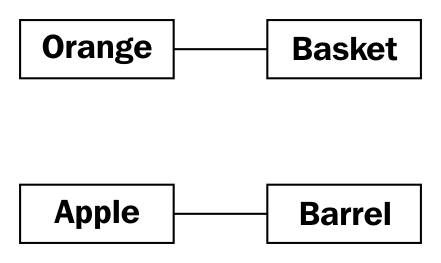
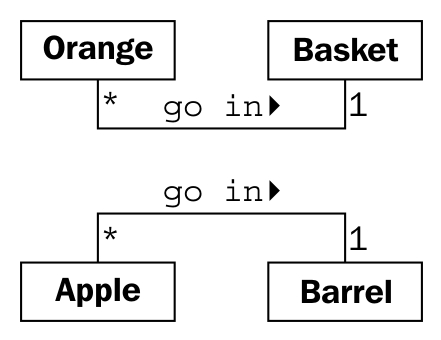
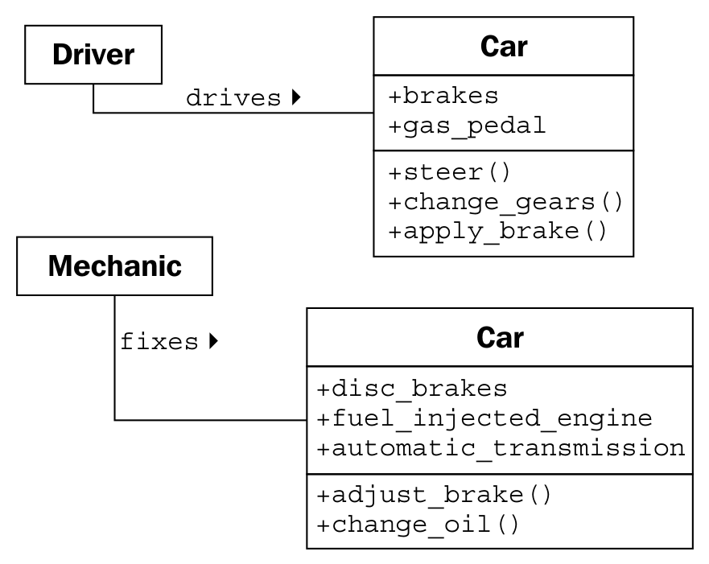
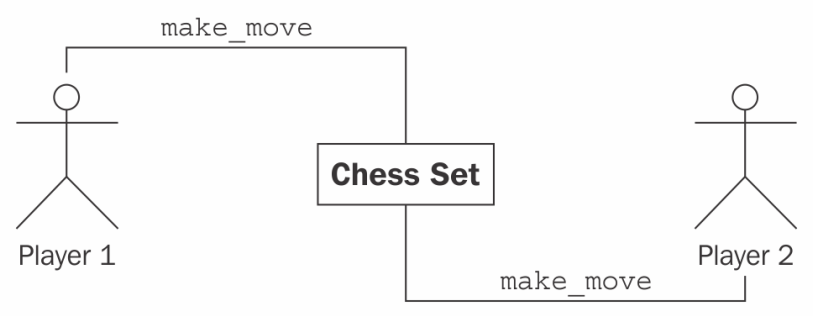
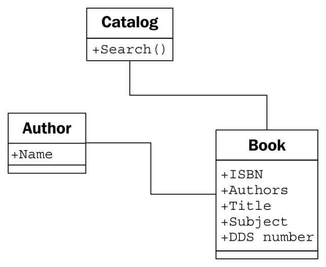
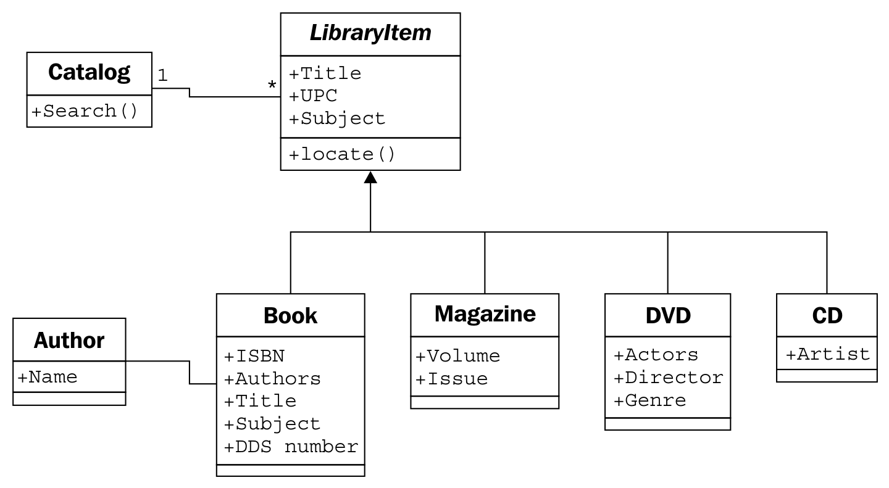
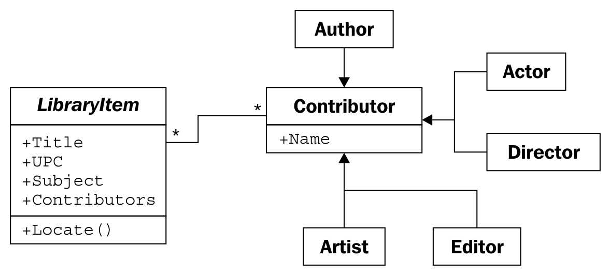

# 第十五章：面向对象设计

在软件开发中，设计通常被认为是编程之前的步骤。这并不正确；实际上，分析、编程和设计往往重叠、结合和交织。在本章中，我们将涵盖以下主题：

+   面向对象的含义

+   面向对象设计和面向对象编程之间的区别

+   面向对象设计的基本原则

+   基本的**统一建模语言**（**UML**）及其不邪恶的时候

# 介绍面向对象

每个人都知道什么是对象：我们可以感知、感觉和操作的有形物体。我们最早接触的对象通常是婴儿玩具。木块、塑料形状和超大拼图块是常见的第一个对象。婴儿很快学会了某些对象会做某些事情：铃响、按钮被按下，杠杆被拉动。

在软件开发中，对象的定义并没有太大的不同。软件对象可能不是可以拿起、感知或感觉的有形物体，但它们是能够做某些事情并且可以对它们做某些事情的模型。形式上，一个对象是一组**数据**和相关**行为**。

那么，知道了什么是对象，什么是面向对象呢？在词典中，*oriented*的意思是*朝向*。因此，面向对象意味着在功能上朝向建模对象。这是用于建模复杂系统的众多技术之一。它通过描述一组通过它们的数据和行为相互作用的对象来定义。

如果你读过一些炒作，你可能会遇到*面向对象分析*、*面向对象设计*、*面向对象分析与设计*和*面向对象编程*等术语。这些都是与*面向对象*相关的概念。

事实上，分析、设计和编程都是软件开发的各个阶段。将它们称为面向对象只是指定了正在追求的软件开发水平。

**面向对象分析**（**OOA**）是查看一个问题、系统或任务（某人想要将其转化为应用程序）并识别对象和对象之间交互的过程。分析阶段关乎于*需要*做什么。

分析阶段的输出是一组需求。如果我们能够在一个步骤中完成分析阶段，我们将把一个任务，比如*我需要一个网站*，转化为一组需求。例如，这里有一些关于网站访问者可能需要做的需求（*斜体*表示动作，**粗体**表示对象）：

+   *回顾*我们的**历史**

+   *申请* **工作**

+   *浏览*、*比较*和*订购* **产品**

在某种程度上，*分析*是一个误称。我们之前讨论的婴儿并不分析木块和拼图块。相反，她探索她的环境，操纵形状，并看看它们可能适合在哪里。一个更好的说法可能是*面向对象的探索*。在软件开发中，分析的初始阶段包括采访客户，研究他们的流程，并排除可能性。

**面向对象设计**（**OOD**）是将这些要求转化为实现规范的过程。设计师必须命名对象，定义行为，并正式指定哪些对象可以激活其他对象上的特定行为。设计阶段关乎于*如何*完成事情。

设计阶段的输出是一个实现规范。如果我们能够在一个步骤中完成设计阶段，我们将把面向对象分析期间定义的需求转化为一组类和接口，这些类和接口可以在（理想情况下）任何面向对象编程语言中实现。

**面向对象编程**（**OOP**）是将这个完全定义的设计转化为一个完全满足 CEO 最初要求的工作程序的过程。

是的，没错！如果世界符合这个理想，我们可以按照这些阶段一步一步地按照完美的顺序进行，就像所有旧教科书告诉我们的那样。通常情况下，现实世界要复杂得多。无论我们多么努力地分隔这些阶段，我们总会发现在设计时需要进一步分析的事情。当我们编程时，我们会发现设计中需要澄清的特性。

21 世纪的大部分开发都是以迭代开发模型进行的。在迭代开发中，任务的一小部分被建模、设计和编程，然后程序被审查和扩展，以改进每个功能并在一系列短期开发周期中包括新功能。

本书的其余部分是关于面向对象编程的，但在本章中，我们将在设计的背景下介绍基本的面向对象原则。这使我们能够理解这些（相当简单的）概念，而不必与软件语法或 Python 的错误信息争论。

# 对象和类

因此，对象是具有相关行为的数据集合。我们如何区分对象的类型？苹果和橙子都是对象，但有一个常见的谚语说它们不能相提并论。苹果和橙子在计算机编程中并不经常被建模，但让我们假设我们正在为一个水果农场做库存应用。为了便于理解，我们可以假设苹果放在桶里，橙子放在篮子里。

现在，我们有四种对象：苹果、橙子、篮子和桶。在面向对象建模中，用于表示*对象类型*的术语是**类**。因此，在技术术语中，我们现在有四个对象类。

理解对象和类之间的区别很重要。类描述对象。它们就像创建对象的蓝图。你可能在桌子上看到三个橙子。每个橙子都是一个独特的对象，但所有三个都具有与一个类相关的属性和行为：橙子的一般类。

我们库存系统中的四个对象类之间的关系可以使用**统一建模语言**（通常简称为**UML**，因为三个字母的缩写永远不会过时）类图来描述。这是我们的第一个类图：

这张图表显示**橙子**与**篮子**以某种方式相关联，而**苹果**也以某种方式与**桶**相关联。*关联*是两个类相关的最基本方式。

UML 在经理中非常受欢迎，有时会受到程序员的贬低。UML 图表的语法通常相当明显；当你看到一个 UML 图表时，你不必阅读教程就能（大部分）理解发生了什么。UML 也相当容易绘制，而且相当直观。毕竟，许多人在描述类及其关系时，自然会画出盒子和它们之间的线。基于这些直观图表的标准使程序员能够与设计师、经理和彼此进行轻松的沟通。

然而，一些程序员认为 UML 是浪费时间。他们引用迭代开发，他们会认为用花哨的 UML 图表制定的正式规范在实施之前就会变得多余，并且维护这些正式图表只会浪费时间，对任何人都没有好处。

这取决于所涉及的公司结构，这可能是真的，也可能不是真的。然而，每个由多个人组成的编程团队都会偶尔坐下来详细讨论他们当前正在处理的子系统的细节。在这些头脑风暴会议中，UML 非常有用，可以进行快速而轻松的沟通。即使那些嘲笑正式类图的组织也倾向于在设计会议或团队讨论中使用某种非正式版本的 UML。

此外，你将要与之交流的最重要的人是你自己。我们都认为自己能记住我们所做的设计决策，但在未来总会有*我为什么那样做？*的时刻。如果我们保存我们在开始设计时做初始图表的纸屑，最终我们会发现它们是有用的参考资料。

然而，本章并不意味着是 UML 的教程。互联网上有许多这方面的教程，以及大量关于这个主题的书籍。UML 涵盖的远不止类和对象图表；它还有用例、部署、状态变化和活动的语法。在这个面向对象设计的讨论中，我们将处理一些常见的类图表语法。你可以通过示例了解结构，并在你自己的团队或个人设计会议中下意识地选择受 UML 启发的语法。

我们的初始图表虽然是正确的，但没有提醒我们苹果是放在桶里的，或者一个苹果可以放在多少个桶里。它只告诉我们苹果与桶子有某种关联。类之间的关联通常是显而易见的，不需要进一步解释，但我们可以根据需要添加进一步的说明。

UML 的美妙之处在于大多数东西都是可选的。我们只需要在图表中指定与当前情况相符的信息。在一个快速的白板会议中，我们可能只是快速地在方框之间画线。在正式文件中，我们可能会更详细地说明。在苹果和桶子的情况下，我们可以相当有信心地说这个关联是**许多苹果放在一个桶里**，但为了确保没有人将其与**一个苹果糟蹋一个桶**混淆，我们可以增强图表如下所示：

这个图表告诉我们橙子**放在**篮子里，有一个小箭头显示了什么放在什么里。它还告诉我们在关联的两端可以使用的对象的数量。一个**Basket**可以容纳许多（用*****表示）**Orange**对象。任何一个**Orange**可以放在一个**Basket**里。这个数字被称为对象的*多重性*。你可能也听说过它被描述为*基数*。这些实际上是稍微不同的术语。基数是指集合中实际的项目数量，而多重性指定了集合可以有多小或多大。

我有时会忘记关系线的哪一端应该有哪个多重性数字。靠近类的多重性是该类的对象可以与关联的另一端的任何一个对象相关联的数量。对于苹果放在桶子的关联，从左到右阅读，**Apple**类的许多实例（即许多**Apple**对象）可以放在任何一个**Barrel**中。从右到左阅读，一个**Barrel**可以与任何一个**Apple**相关联。

# 指定属性和行为

我们现在对一些基本的面向对象术语有了了解。对象是可以相互关联的类的实例。对象实例是具有自己一组数据和行为的特定对象；我们面前桌子上的一个特定的橙子被称为是橙子类的一个实例。这已经足够简单了，但让我们深入探讨一下这两个词的含义，*数据*和*行为*。

# 数据描述对象

让我们从数据开始。数据代表特定对象的个体特征。一个类可以定义所有该类对象共享的特定特征集。任何特定对象可以对给定特征具有不同的数据值。例如，我们桌子上的三个橙子（如果我们没有吃掉）可能每个重量都不同。橙子类可以有一个重量属性来表示这个数据。橙子类的所有实例都有一个重量属性，但是每个橙子对于这个属性有不同的值。属性不必是唯一的，任何两个橙子可能重量相同。作为一个更现实的例子，代表不同客户的两个对象可能对于名字属性有相同的值。

属性经常被称为**成员**或**属性**。一些作者认为这些术语有不同的含义，通常是属性是可设置的，而属性是只读的。在 Python 中，*只读*的概念相当无意义，所以在本书中，我们会看到这两个术语可以互换使用。此外，正如我们将在第十九章中讨论的那样，`property`关键字在 Python 中对于特定类型的属性有特殊的含义。

在我们的水果库存应用程序中，果农可能想要知道橙子来自哪个果园，何时采摘，以及重量是多少。他们可能还想跟踪每个**篮子**存放在哪里。苹果可能有颜色属性，桶可能有不同的大小。这些属性中的一些也可能属于多个类（我们可能也想知道何时采摘苹果），但是对于这个第一个例子，让我们只向我们的类图添加一些不同的属性：

根据我们的设计需要多么详细，我们还可以为每个属性指定类型。属性类型通常是大多数编程语言中标准的原始数据类型，例如整数、浮点数、字符串、字节或布尔值。然而，它们也可以表示数据结构，如列表、树或图，或者更重要的是其他类。这是设计阶段可以与编程阶段重叠的一个领域。一个编程语言中可用的各种原始数据类型或对象可能与另一个编程语言中可用的不同：

通常，在设计阶段我们不需要过于关注数据类型，因为在编程阶段会选择实现特定的细节。对于设计来说，通用名称通常足够了。如果我们的设计需要列表容器类型，Java 程序员可以选择在实现时使用`LinkedList`或`ArrayList`，而 Python 程序员（就是我们！）可能会在`list`内置和`tuple`之间进行选择。

到目前为止，在我们的水果种植示例中，我们的属性都是基本的原始数据类型。然而，有一些隐含的属性我们可以明确表示——关联。对于给定的橙子，我们可能有一个属性指向包含该橙子的篮子。

# 行为是动作

现在我们知道了数据是什么，最后一个未定义的术语是*行为*。行为是可以在对象上发生的动作。可以在特定对象类上执行的行为称为**方法**。在编程级别上，方法就像结构化编程中的函数，但是它们*神奇地*可以访问与该对象关联的所有数据。与函数一样，方法也可以接受**参数**并返回**值**。

方法的参数以对象列表的形式提供给它。在特定调用期间传递给方法的实际对象实例通常被称为**参数**。这些对象被方法用于执行其所需的行为或任务。返回的值是该任务的结果。

我们已经将我们*比较苹果和橙子*的例子扩展成了一个基本的（虽然牵强）库存应用程序。让我们再扩展一下，看看是否会出现问题。可以与橙子相关联的一个动作是**采摘**。如果考虑实现，**采摘**需要做两件事：

+   通过更新橙子的**篮子**属性将橙子放入篮子中

+   将橙子添加到给定**篮子**上的**橙子**列表中。

因此，**采摘**需要知道它正在处理的篮子是哪一个。我们通过给**采摘**方法一个**篮子**参数来实现这一点。由于我们的果农还销售果汁，我们可以在**橙子**类中添加一个**挤**方法。当调用时，**挤**方法可能会返回所取得的果汁量，同时将**橙子**从其所在的**篮子**中移除。

**篮子**类可以有一个**卖**的动作。当篮子被卖出时，我们的库存系统可能会更新一些尚未指定的对象的数据，用于会计和利润计算。或者，我们的橙子篮在我们卖出之前可能会变坏，所以我们添加了一个**丢弃**的方法。让我们把这些方法添加到我们的图表中：

向个别对象添加属性和方法使我们能够创建一个相互作用的对象系统。系统中的每个对象都是某个类的成员。这些类指定了对象可以保存的数据类型以及可以在其上调用的方法。每个对象中的数据可能与同一类的其他实例处于不同的状态；由于状态的不同，每个对象对方法调用的反应可能会有所不同。

面向对象的分析和设计主要是弄清楚这些对象是什么，以及它们应该如何相互作用。接下来的部分描述了可以用来使这些交互尽可能简单和直观的原则。

# 隐藏细节并创建公共接口

在面向对象设计中对对象进行建模的关键目的是确定该对象的公共**接口**。接口是其他对象可以访问以与该对象交互的属性和方法的集合。它们不需要，通常也不允许访问对象的内部工作。

一个常见的现实世界的例子是电视。我们与电视的接口是遥控器。遥控器上的每个按钮代表着可以在电视对象上调用的方法。当我们作为调用对象访问这些方法时，我们不知道也不关心电视是通过有线连接、卫星接收器还是互联网设备接收信号。我们不关心调整音量时发送的电子信号，或者声音是发往扬声器还是耳机。如果我们打开电视以访问内部工作，例如将输出信号分成外部扬声器和一副耳机，我们将会失去保修。

这种隐藏对象实现的过程称为**信息隐藏**。有时也被称为**封装**，但封装实际上是一个更全面的术语。封装的数据不一定是隐藏的。封装，字面上来说，是创建一个胶囊（想象一下制作一个时间胶囊）。如果你把一堆信息放进一个时间胶囊里，然后锁上并埋起来，它既被封装又被隐藏。另一方面，如果时间胶囊没有被埋起来，是解锁的或者是由透明塑料制成的，里面的物品仍然被封装，但没有信息隐藏。

封装和信息隐藏之间的区别在设计层面上基本上是无关紧要的。许多实际参考资料都将这些术语互换使用。作为 Python 程序员，我们实际上并不需要真正的信息隐藏（我们将在《Python 对象》一章中讨论这一点的原因），因此更全面的封装定义是合适的。

然而，公共接口非常重要。它需要仔细设计，因为将来很难更改它。更改接口将破坏任何正在访问它的客户对象。我们可以随意更改内部，例如使其更有效，或者在本地和网络上访问数据，客户对象仍然可以使用公共接口与之通信，而无需修改。另一方面，如果我们通过更改公开访问的属性名称或方法可以接受的参数的顺序或类型来更改接口，所有客户类也必须进行修改。在设计公共接口时，保持简单。始终根据使用的便捷性而不是编码的难度来设计对象的接口（这个建议也适用于用户界面）。

记住，程序对象可能代表真实对象，但这并不意味着它们是真实对象。它们是模型。建模的最大好处之一是能够忽略不相关的细节。我小时候制作的模型汽车外观看起来像一辆真正的 1956 年的雷鸟，但显然它不能跑。当我还太小不能开车时，这些细节过于复杂和无关紧要。这个模型是对真实概念的**抽象**。

**抽象**是与封装和信息隐藏相关的另一个面向对象的术语。抽象意味着处理最适合特定任务的细节级别。这是从内部细节中提取公共接口的过程。汽车的驾驶员需要与转向、油门和刹车进行交互。发动机、传动系统和刹车子系统的工作对驾驶员并不重要。另一方面，技工在不同的抽象级别上工作，调整发动机和排气刹车。这是汽车的两个抽象级别的例子：

现在，我们有几个指涉相似概念的新术语。让我们用几句话总结所有这些行话：抽象是使用单独的公共和私有接口封装信息的过程。私有接口可能会受到信息隐藏的影响。

从所有这些定义中得出的重要教训是使我们的模型能够被必须与其交互的其他对象理解。这意味着要特别注意细节。确保方法和属性具有合理的名称。在分析系统时，对象通常代表原始问题中的名词，而方法通常是动词。属性可能显示为形容词或更多名词。相应地为您的类、属性和方法命名。

在设计接口时，想象自己是对象，并且你非常注重隐私。除非你认为让其他对象访问关于你的数据对你最有利，否则不要让它们访问。除非你确定你希望它们能够这样做，否则不要给它们一个接口来强迫你执行特定的任务。

# 组合

到目前为止，我们已经学会了将系统设计为一组相互作用的对象，其中每个交互都涉及以适当的抽象级别查看对象。但我们还不知道如何创建这些抽象级别。有多种方法可以做到这一点；我们将在第二十一章中讨论一些高级设计模式，*迭代器模式*。但是，大多数设计模式都依赖于两个基本的面向对象原则，即**组合**和**继承**。组合更简单，所以我们从它开始。

组合是将几个对象收集在一起创建一个新对象的行为。当一个对象是另一个对象的一部分时，组合通常是一个不错的选择。我们已经在机械示例中看到了组合的第一个迹象。燃油汽车由发动机、变速器、起动机、前灯和挡风玻璃等众多部件组成。发动机又由活塞、曲轴和气门组成。在这个例子中，组合是提供抽象级别的一种好方法。**汽车**对象可以提供驾驶员所需的接口，同时也可以访问其组件部件，这为技师提供了更深层次的抽象，适合于诊断问题或调整发动机时进一步分解这些组件部件。

汽车是一个常见的组合示例，但在设计计算机系统时并不是特别有用。物理对象很容易分解成组件对象。人们至少自古希腊时代以来一直在做这件事，最初假设原子是物质的最小单位（当然，他们当时无法接触到粒子加速器）。计算机系统通常比物理对象更简单，但是在这种系统中识别组件对象并不会自然发生。

面向对象系统中的对象有时代表诸如人、书籍或电话等物理对象。然而更多时候，它们代表抽象的概念。人有名字，书有标题，电话用于打电话。电话、标题、账户、名字、约会和付款通常不被认为是物理世界中的对象，但它们在计算机系统中经常被建模为组件。

让我们尝试建模一个更加面向计算机的例子来看看组合是如何发挥作用的。我们将研究一个计算机化的国际象棋游戏的设计。这在 80 年代和 90 年代是学者们非常受欢迎的消遣。人们曾经预测计算机有一天会能够击败人类国际象棋大师。当这在 1997 年发生时（IBM 的深蓝击败了世界国际象棋冠军加里·卡斯帕罗夫），人们对这个问题的兴趣减弱了。如今，计算机总是赢。

作为基本的高层分析，*国际象棋*是由两个*玩家*之间**进行**的，使用一个包含八个 8x8 网格中的六十四个*位置*的*棋盘*的国际象棋套装。棋盘上可以有两组十六个*棋子*，可以以不同的方式由两个玩家交替*轮流* **移动**。每个棋子可以**吃掉**其他棋子。棋盘将需要在每个回合之后在计算机*屏幕*上**绘制**自己。

我用*斜体*标识了描述中一些可能的对象，并使用**粗体**标识了一些关键方法。这是将面向对象分析转化为设计的常见第一步。在这一点上，为了强调组合，我们将专注于棋盘，而不会过多担心玩家或不同类型的棋子。

让我们从可能的最高抽象级别开始。我们有两个玩家通过轮流走棋与**国际象棋棋盘**交互：

这看起来不太像我们早期的类图，这是一件好事，因为它不是一个！这是一个**对象图**，也称为**实例图**。它描述了系统在特定时间点的状态，并描述了对象的特定实例，而不是类之间的交互。请记住，两个玩家都是同一个类的成员，所以类图看起来有点不同：

该图表明只有两个玩家可以与一个国际象棋棋盘交互。这也表明任何一个玩家一次只能玩一个**国际象棋棋盘**。

然而，我们正在讨论组合，而不是 UML，所以让我们考虑一下**国际象棋棋盘**由什么组成。我们暂时不关心玩家由什么组成。我们可以假设玩家有心脏和大脑等器官，但这些对我们的模型无关紧要。事实上，没有什么能阻止说的玩家本身就是深蓝，它既没有心脏也没有大脑。

然后，国际象棋棋盘由棋盘和 32 个棋子组成。棋盘又包括 64 个位置。你可以争辩说棋子不是国际象棋棋盘的一部分，因为你可以用不同的棋子替换国际象棋棋盘中的棋子。虽然在计算机版本的国际象棋中这是不太可能或不可能的，但这向我们介绍了**聚合**。

聚合几乎与组合完全相同。不同之处在于聚合对象可以独立存在。一个位置不可能与不同的国际象棋棋盘相关联，所以我们说棋盘由位置组成。但是，棋子可能独立于国际象棋棋盘存在，因此被称为与该棋盘处于聚合关系。

区分聚合和组合的另一种方法是考虑对象的生命周期。如果组合（外部）对象控制相关（内部）对象的创建和销毁，那么组合是最合适的。如果相关对象独立于组合对象创建，或者可以比组合对象存在更久，那么聚合关系更合理。另外，请记住，组合是聚合；聚合只是组合的一种更一般的形式。任何组合关系也是聚合关系，但反之则不然。

让我们描述我们当前的**国际象棋棋盘**组合，并为对象添加一些属性来保存组合关系：

组合关系在 UML 中表示为实心菱形。空心菱形代表聚合关系。你会注意到棋盘和棋子以与将它们的引用存储为**国际象棋棋盘**的一部分，方式完全相同。这表明，一旦再次实践中，聚合和组合之间的区别通常在设计阶段过后就不再重要。在实现时，它们的行为方式大致相同。然而，当你的团队讨论不同对象如何交互时，区分它们可能有所帮助。通常情况下，你可以将它们视为相同的东西，但当你需要区分它们时（通常是在谈论相关对象存在多长时间时），了解区别是很重要的。

# 继承

我们讨论了对象之间的三种关系：关联、组合和聚合。然而，我们还没有完全指定我们的国际象棋棋盘，而这些工具似乎并不能给我们提供所有我们需要的功能。我们讨论了玩家可能是人类，也可能是具有人工智能的软件。说玩家与人类*关联*，或者说人工智能实现是玩家对象的一部分，似乎都不太合适。我们真正需要的是能够说*Deep Blue 是一个玩家*，或者*加里·卡斯帕罗夫是一个玩家*的能力。

*is a*关系是由**继承**形成的。继承是面向对象编程中最著名、最知名和最常用的关系。继承有点像家谱。我的祖父姓菲利普斯，我父亲继承了这个姓氏。我从他那里继承了它。在面向对象编程中，一个类可以从另一个类继承属性和方法，而不是从一个人那里继承特征和行为。

例如，我们的国际象棋棋盘上有 32 个棋子，但只有六种不同类型的棋子（兵、车、象、马、国王和皇后），每种棋子在移动时的行为都不同。所有这些棋子类都有属性，比如颜色和它们所属的国际象棋棋盘，但它们在国际象棋棋盘上绘制时也有独特的形状，并且移动方式不同。让我们看看这六种类型的棋子如何从**Piece**类继承：

空心箭头表示各个棋子类从**Piece**类继承。所有子类都自动从基类继承**chess_set**和**color**属性。每个棋子提供一个不同的形状属性（在渲染棋盘时绘制在屏幕上），以及一个不同的**move**方法，以在每一轮中将棋子移动到棋盘上的新位置。

我们实际上知道**Piece**类的所有子类都需要有一个**move**方法；否则，当棋盘试图移动棋子时，它会感到困惑。我们可能希望创建国际象棋的一个新版本，其中有一个额外的棋子（巫师）。我们当前的设计将允许我们设计这个棋子，而不给它一个**move**方法。然后当棋盘要求棋子移动时，它会出错。

我们可以通过在**Piece**类上创建一个虚拟的移动方法来解决这个问题。然后子类可以用更具体的实现**覆盖**这个方法。默认实现可能会弹出一个错误消息，说**该棋子无法移动**。

在子类中重写方法可以开发非常强大的面向对象系统。例如，如果我们想要实现一个具有人工智能的**Player**类，我们可以提供一个`calculate_move`方法，该方法接受一个**Board**对象，并决定将哪个棋子移动到哪里。一个非常基本的类可能会随机选择一个棋子和方向，然后相应地移动它。然后我们可以在子类中重写这个方法，使用 Deep Blue 的实现。第一个类适合与一个新手玩；后者将挑战一个国际象棋大师。重要的是，类中的其他方法，比如通知棋盘选择了哪个移动的方法，不需要改变；这个实现可以在两个类之间共享。

在国际象棋棋子的情况下，提供移动方法的默认实现并没有太多意义。我们只需要指定移动方法在任何子类中都是必需的。这可以通过使**Piece**成为一个**抽象类**，并声明**abstract**的移动方法来实现。抽象方法基本上是这样说的：

我们要求这种方法存在于任何非抽象子类中，但我们拒绝在这个类中指定实现。

事实上，可能会创建一个根本不实现任何方法的类。这样的类只会告诉我们类应该做什么，但绝对不会提供如何做的建议。在面向对象的术语中，这样的类被称为**接口**。

# 继承提供了抽象

让我们来探讨面向对象术语中最长的单词。**多态性**是指根据实现了哪个子类来对待一个类的能力。我们已经在我们描述的棋子系统中看到了它的作用。如果我们进一步设计，我们可能会发现**Board**对象可以接受玩家的移动并调用棋子的**move**函数。棋盘不需要知道它正在处理什么类型的棋子。它只需要调用**move**方法，适当的子类将负责将其移动为**Knight**或**Pawn**。

多态性很酷，但在 Python 编程中很少使用这个词。Python 在允许将对象的子类视为父类的基础上又迈出了一步。在 Python 中实现的棋盘可以接受任何具有**move**方法的对象，无论是主教棋子、汽车还是鸭子。当调用**move**时，**Bishop**将在棋盘上对角线移动，汽车将驾驶到某个地方，而鸭子将根据心情游泳或飞行。

在 Python 中，这种多态性通常被称为**鸭子类型**：*如果它走起来像鸭子或游泳像鸭子，那它就是鸭子*。我们不在乎它是否真的是一只鸭子（*是一个*是继承的基石），只在乎它是游泳还是走路。雁和天鹅可能很容易提供我们所寻找的鸭子般的行为。这使得未来的设计者可以创建新类型的鸟类，而无需实际指定水鸟的继承层次结构。它还允许他们创建完全不同的插入行为，原始设计者从未计划过。例如，未来的设计者可能能够创建一个行走、游泳的企鹅，它可以使用相同的接口，而从未暗示企鹅是鸭子。

# 多重继承

当我们想到我们自己家族谱中的继承时，我们会发现我们不仅从一个父类那里继承特征。当陌生人告诉一个骄傲的母亲她的儿子有*他父亲的眼睛*时，她通常会回答类似于，*是的，但他有我的鼻子*。

面向对象设计也可以包括这种**多重继承**，它允许子类从多个父类中继承功能。在实践中，多重继承可能会很棘手，一些编程语言（最著名的是 Java）严格禁止它。然而，多重继承也有其用途。最常见的用途是创建具有两组不同行为的对象。例如，一个设计用于连接扫描仪并发送扫描文档的传真的对象可能是通过从两个独立的`scanner`和`faxer`对象继承而创建的。

只要两个类具有不同的接口，子类从它们两者继承通常不会有害。但是，如果我们从提供重叠接口的两个类继承，情况就会变得混乱。例如，如果我们有一个具有`move`方法的摩托车类，还有一个同样具有`move`方法的船类，我们想将它们合并成终极两栖车时，当我们调用`move`时，结果类如何知道该做什么？在设计层面上，这需要解释，在实现层面上，每种编程语言都有不同的方式来决定调用哪个父类的方法，或以什么顺序调用。

通常，处理它的最佳方式是避免它。如果你的设计出现这样的情况，你很可能做错了。退一步，重新分析系统，看看是否可以取消多重继承关系，转而使用其他关联或组合设计。

继承是扩展行为的一个非常强大的工具。它也是面向对象设计相对于早期范例的最具市场潜力的进步之一。因此，它通常是面向对象程序员首先使用的工具。然而，重要的是要认识到拥有一把锤子并不会把螺丝钉变成钉子。继承是明显的“是一个”关系的完美解决方案，但它可能会被滥用。程序员经常使用继承来在两种只有遥远关联的对象之间共享代码，而看不到“是一个”关系。虽然这不一定是一个坏设计，但这是一个很好的机会去问他们为什么决定以这种方式设计，以及是否不同的关系或设计模式更合适。

# 案例研究

让我们通过对一个现实世界的例子进行几次迭代的面向对象设计，将我们所有新的面向对象的知识联系在一起。我们将要建模的系统是一个图书馆目录。图书馆几个世纪以来一直在跟踪他们的库存，最初使用卡片目录，最近使用电子库存。现代图书馆有基于网络的目录，我们可以在家里查询。

让我们从分析开始。当地的图书管理员要求我们编写一个新的卡片目录程序，因为他们古老的基于 Windows XP 的程序既难看又过时。这并没有给我们太多细节，但在我们开始寻求更多信息之前，让我们考虑一下我们已经对图书馆目录了解的情况。

目录包含书籍列表。人们搜索它们以找到特定主题的书籍，特定标题的书籍，或者特定作者的书籍。书籍可以通过国际标准书号（ISBN）来唯一标识。每本书都有一个杜威十进制分类法（DDS）号码，用于帮助在特定书架上找到它。

这个简单的分析告诉我们系统中一些明显的对象。我们很快确定**Book**是最重要的对象，其中已经提到了几个属性，比如作者、标题、主题、ISBN 和 DDS 号码，以及作为书籍管理者的编目。

我们还注意到一些其他可能需要或不需要在系统中建模的对象。为了编目的目的，我们只需要在书上搜索作者的`author_name`属性。然而，作者也是对象，我们可能想要存储一些关于作者的其他数据。当我们思考这一点时，我们可能会记起一些书籍有多个作者的情况。突然间，在对象上有一个单一的`author_name`属性的想法似乎有点愚蠢。与每本书相关联的作者列表显然是一个更好的想法。

作者和书籍之间的关系显然是关联，因为你永远不会说“一本书是一个作者”（这不是继承），而说“一本书有一个作者”，虽然在语法上是正确的，但并不意味着作者是书籍的一部分（这不是聚合）。事实上，任何一个作者可能与多本书相关联。

我们还应该注意名词（名词总是对象的好候选者）*shelf*。书架是需要在编目系统中建模的对象吗？我们如何识别单独的书架？如果一本书存放在一个书架的末尾，后来因为前一个书架插入了一本新书而移到了下一个书架的开头，会发生什么？

DDS 旨在帮助在图书馆中找到实体书籍。因此，将 DDS 属性与书籍一起存储应该足以找到它，无论它存放在哪个书架上。因此，我们可以暂时将书架从我们竞争对象的列表中移除。

系统中的另一个有问题的对象是用户。我们需要了解特定用户的任何信息吗，比如他们的姓名、地址或逾期书目清单？到目前为止，图书管理员只告诉我们他们想要一个目录；他们没有提到跟踪订阅或逾期通知。在我们的脑海中，我们还注意到作者和用户都是特定类型的人；在未来可能会有一个有用的继承关系。

为了编目的目的，我们决定暂时不需要识别用户。我们可以假设用户将搜索目录，但我们不必在系统中积极对他们进行建模，只需提供一个允许他们搜索的界面即可。

我们已经确定了书上的一些属性，但目录有什么属性？任何一个图书馆有多个目录吗？我们需要对它们进行唯一标识吗？显然，目录必须有它包含的书的集合，但这个列表可能不是公共接口的一部分。

行为呢？目录显然需要一个搜索方法，可能是作者、标题和主题的分开搜索。书上有什么行为？它需要一个预览方法吗？或者预览可以通过第一页属性而不是方法来识别吗？

前面讨论中的问题都是面向对象分析阶段的一部分。但在这些问题中，我们已经确定了一些设计中的关键对象。事实上，你刚刚看到的是分析和设计之间的几个微迭代。

很可能，这些迭代都会在与图书管理员的初次会议中发生。然而，在这次会议之前，我们已经可以为我们已经明确定义的对象勾勒出一个最基本的设计，如下所示：

拿着这个基本的图表和一支铅笔，我们与图书管理员会面。他们告诉我们这是一个很好的开始，但图书馆不仅仅提供书籍；他们还有 DVD、杂志和 CD，这些都没有 ISBN 或 DDS 号码。所有这些类型的物品都可以通过 UPC 号码唯一识别。我们提醒图书管理员，他们必须在书架上找到物品，而且这些物品可能不是按 UPC 号码组织的。

图书管理员解释说每种类型都是以不同的方式组织的。CD 主要是有声书，他们只有两打库存，所以它们是按作者的姓氏组织的。DVD 根据类型划分，然后按标题进一步组织。杂志按标题组织，然后按卷和期号进一步细分。书籍，正如我们猜测的那样，是按 DDS 号码组织的。

没有以前的面向对象设计经验，我们可能会考虑将 DVD、CD、杂志和书籍分别添加到我们的目录中，并依次搜索每一个。问题是，除了某些扩展属性和识别物品的物理位置之外，这些物品的行为都大致相同。这就是继承的工作！我们迅速更新我们的 UML 图表如下：

图书管理员理解了我们勾画的图表的要点，但对**locate**功能有点困惑。我们使用了一个特定的用例来解释，用户正在搜索单词*bunnies*。用户首先向目录发送搜索请求。目录查询其内部项目列表，找到了一个标题中带有*bunnies*的书和一个 DVD。此时，目录并不关心它是否持有 DVD、书、CD 还是杂志；在目录看来，所有项目都是一样的。然而，用户想知道如何找到这些实体项目，因此如果目录只返回一个标题列表，那就不够完善了。因此，它调用了两个发现的项目的**locate**方法。书的**locate**方法返回一个 DDS 号码，可以用来找到放置书的书架。DVD 通过返回 DVD 的流派和标题来定位。然后用户可以访问 DVD 部分，找到包含该流派的部分，并按标题排序找到特定的 DVD。

当我们解释时，我们勾画了一个 UML**序列图**，解释了各种对象是如何进行通信的：

虽然类图描述了类之间的关系，序列图描述了对象之间传递的特定消息序列。从每个对象悬挂的虚线是描述对象的生命周期的**生命线**。每个生命线上的较宽的框表示对象中的活动处理（没有框的地方，对象基本上是空闲的，等待发生某些事情）。生命线之间的水平箭头表示特定的消息。实线箭头表示被调用的方法，而带有实心头的虚线箭头表示方法返回值。

半箭头表示发送到对象或从对象发送的异步消息。异步消息通常意味着第一个对象调用第二个对象的方法，该方法立即返回。经过一些处理后，第二个对象调用第一个对象的方法来给它一个值。这与正常的方法调用相反，正常的方法调用在方法中进行处理，并立即返回一个值。

与所有 UML 图表一样，序列图只有在需要时才能最好使用。为了画图而画图是没有意义的。但是，当您需要传达两个对象之间的一系列交互时，序列图是一个非常有用的工具。

很遗憾，到目前为止，我们的类图仍然是一种混乱的设计。我们注意到 DVD 上的演员和 CD 上的艺术家都是人的类型，但与书籍作者的处理方式不同。图书管理员还提醒我们，他们的大部分 CD 都是有声书，有作者而不是艺术家。

我们如何处理为标题做出贡献的不同类型的人？一个明显的实现是创建一个`Person`类，包括人的姓名和其他相关细节，然后为艺术家、作者和演员创建这个类的子类。然而，在这里真的需要继承吗？对于搜索和编目的目的，我们并不真的关心表演和写作是两种非常不同的活动。如果我们正在进行经济模拟，给予单独的演员和作者类，并不同的`calculate_income`和`perform_job`方法是有意义的，但对于编目的目的，知道这个人如何为项目做出贡献就足够了。经过深思熟虑，我们意识到所有项目都有一个或多个`Contributor`对象，因此我们将作者关系从书籍移动到其父类中：

**Contributor**/**LibraryItem**关系的多重性是**多对多**，如一个关系两端的*****字符所示。任何一个图书馆项目可能有多个贡献者（例如，DVD 上的几位演员和一位导演）。许多作者写了很多书，所以他们可以附属于多个图书馆项目。

这个小改变，虽然看起来更清洁、更简单，但丢失了一些重要的信息。我们仍然可以知道谁为特定的图书馆项目做出了贡献，但我们不知道他们是如何贡献的。他们是导演还是演员？他们是写了有声书，还是为书朗读的声音？

如果我们可以在**Contributor**类上添加一个`contributor_type`属性就好了，但是当处理多才多艺的人既写书又导演电影时，这种方法就会失效。

一个选择是向我们的**LibraryItem**子类中添加属性来保存我们需要的信息，比如**Book**上的**Author**，或者**CD**上的**Artist**，然后将这些属性的关系都指向**Contributor**类。问题在于，我们失去了很多多态的优雅。如果我们想列出项目的贡献者，我们必须寻找该项目上的特定属性，比如**Authors**或**Actors**。我们可以通过在**LibraryItem**类上添加一个**GetContributors**方法来解决这个问题，子类可以重写这个方法。然后目录永远不必知道对象正在查询的属性；我们已经抽象了公共接口：

仅仅看这个类图，就感觉我们在做错事。它又臃肿又脆弱。它可能做了我们需要的一切，但感觉很难维护或扩展。关系太多，任何一个类的修改都会影响太多的类。看起来就像意大利面和肉丸。

现在我们已经探讨了继承作为一个选项，并发现它不够理想，我们可能会回顾我们之前基于组合的图表，其中**Contributor**直接附属于**LibraryItem**。经过一些思考，我们可以看到，实际上我们只需要再添加一个关系到一个全新的类，来标识贡献者的类型。这是面向对象设计中的一个重要步骤。我们现在正在向设计中添加一个旨在*支持*其他对象的类，而不是对初始需求的任何部分进行建模。我们正在**重构**设计，以便系统中的对象，而不是现实生活中的对象。重构是程序或设计维护中的一个重要过程。重构的目标是通过移动代码、删除重复代码或复杂关系，来改进设计，以获得更简单、更优雅的设计。

这个新类由一个**贡献者**和一个额外的属性组成，用于标识该人对给定**LibraryItem**所做贡献的类型。对于特定的**LibraryItem**可以有许多这样的贡献，一个贡献者可以以相同的方式为不同的项目做出贡献。以下的图表很好地传达了这个设计：

首先，这种组合关系看起来不如基于继承的关系自然。然而，它的优势在于允许我们添加新类型的贡献，而不必在设计中添加一个新类。当子类有某种**专业化**时，继承是最有用的。专业化是在子类上创建或更改属性或行为，使其在某种程度上与父类不同。创建一堆空类仅用于识别不同类型的对象似乎有些愚蠢（这种态度在 Java 和其他*一切都是对象*的程序员中不太普遍，但在更务实的 Python 设计师中很常见）。如果我们看继承版本的图表，我们会看到一堆实际上什么都不做的子类：

有时候，重要的是要认识到何时不使用面向对象的原则。这个不使用继承的例子很好地提醒我们，对象只是工具，而不是规则。

# 练习

这是一本实用书，不是教科书。因此，我不会为你创建一堆虚假的面向对象分析问题，让你分析和设计。相反，我想给你一些可以应用到自己项目中的想法。如果你有以前的面向对象经验，你就不需要在这一章节上花太多精力。然而，如果你已经使用 Python 一段时间，但从来没有真正关心过所有的类的东西，这些都是有用的心理锻炼。

首先，想想你最近完成的一个编程项目。确定设计中最突出的对象。尽量想出这个对象的尽可能多的属性。它有以下属性吗：颜色？重量？大小？利润？成本？名称？ID 号码？价格？风格？

思考属性类型。它们是基本类型还是类？其中一些属性实际上是伪装成行为？有时，看起来像数据的东西实际上是从对象的其他数据计算出来的，你可以使用一个方法来进行这些计算。这个对象还有哪些其他方法或行为？哪些对象调用了这些方法？它们与这个对象有什么样的关系？

现在，想想即将开始的项目。项目是什么并不重要；它可能是一个有趣的业余项目，也可能是一个价值数百万美元的合同。它不必是一个完整的应用程序；它可能只是一个子系统。进行基本的面向对象分析。确定需求和相互作用的对象。勾画出一个包含该系统最高抽象级别的类图。确定主要相互作用的对象。确定次要支持对象。详细了解一些最有趣的对象的属性和方法。将不同的对象带入不同的抽象级别。寻找可以使用继承或组合的地方。寻找应该避免使用继承的地方。

目标不是设计一个系统（尽管如果你的兴趣和时间允许，你当然可以这样做）。目标是思考面向对象的设计。专注于你曾经参与过的项目，或者未来打算参与的项目，这样做就更真实了。

最后，访问你最喜欢的搜索引擎，查找一些关于 UML 的教程。有数十种教程，找一个适合你的学习方法的。为你之前确定的对象勾画一些类图或序列图。不要太过于纠结于记忆语法（毕竟，如果重要的话，你总是可以再次查阅）；只需对这种语言有所了解。你的大脑中会留下一些东西，如果你能快速勾画出下一个面向对象讨论的图表，那么交流会变得更容易一些。

# 总结

在本章中，我们快速浏览了面向对象范式的术语，重点放在面向对象设计上。我们可以将不同的对象分为不同的类别，并通过类接口描述这些对象的属性和行为。抽象、封装和信息隐藏是高度相关的概念。对象之间有许多不同类型的关系，包括关联、组合和继承。UML 语法对于乐趣和沟通可能会有用。

在下一章中，我们将探讨如何在 Python 中实现类和方法。
