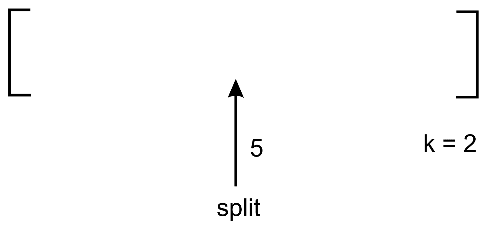
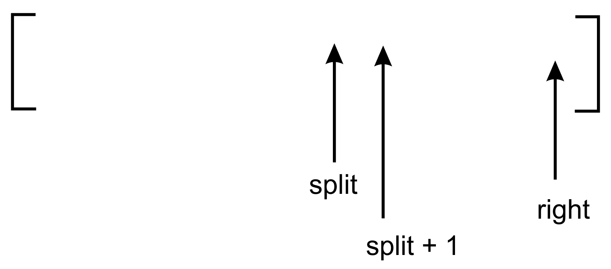
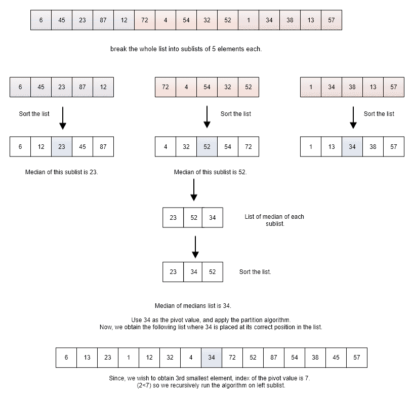

# 十一、选择算法

在无序的项目列表中查找元素的一组有趣的算法是选择算法。给定一个元素列表，使用选择算法从列表中找到`ith`最小的元素。在这样做的过程中，我们将回答与选择一组数字的中值以及选择列表中`i<sup>th</sup>`最小或最大元素有关的问题。

在本章中，我们将介绍以下主题：

*   排序选择
*   随机选择
*   确定性选择

# 技术要求

本章中使用的所有源代码都在给定的 GitHub 链接中提供：[https://github.com/PacktPublishing/Hands-On-Data-Structures-and-Algorithms-with-Python-Second-Edition/tree/master/Chapter11](https://github.com/PacktPublishing/Hands-On-Data-Structures-and-Algorithms-with-Python-Second-Edition/tree/master/Chapter11) 。

# 排序选择

列表中的项目可能会进行统计查询，例如查找平均值、中值和模式值。查找平均值和模式值不需要对列表进行排序。然而，要在数字列表中找到中位数，必须首先对列表进行排序。找到中值需要在有序列表的中间位置找到元素。此外，当我们想要查找列表中最后一个最小的项或列表中第一个最小的项时，可以使用此选项。在这种情况下，选择算法可能很有用

要在无序的项目列表中找到`i<sup>th</sup>`最小的数字，获取该项目出现的位置的索引非常重要。由于列表中的元素没有排序，因此很难知道列表中索引 0 处的元素是否真的是第一个最小的数字。

在处理无序列表时，一个实用且明显的方法是首先对列表进行排序。对列表进行排序后，您可以放心，索引为 0 的元素将包含列表中第一个最小的元素。同样，列表中的最后一个元素将保存列表中最后一个最小的元素。然而，在一个长的元素列表上应用排序算法以从列表中获取最小值或最大值并不是一个好的解决方案，因为排序是一个相当昂贵的操作

让我们讨论一下，是否有可能找到`i<sup>th</sup>`最小的元素，而不必首先对列表进行排序。

# 随机选择

在上一章中，我们讨论了快速排序算法。快速排序算法允许我们对无序的项目列表进行排序，但有一种方法可以在排序算法运行时保留元素索引。一般来说，快速排序算法执行以下操作：

1.  选择轴
2.  围绕轴对未排序的列表进行分区
3.  使用*步骤 1*和*2*对分区列表的两半进行递归排序

一个有趣且重要的事实是，在每一个分区步骤之后，pivot 的索引都不会改变，即使在列表已经排序之后也是如此。这意味着在每次迭代后，选定的轴值将被放置在列表中的正确位置。正是这个属性使我们能够处理未完全排序的列表，以获得`i<sup>th</sup>`最小的数字。由于随机选择基于快速排序算法，因此通常称为快速选择。

# 快速选择

快速选择算法用于获取无序项目列表中的`k<sup>th</sup>`最小元素，并基于快速排序算法。在快速排序中，我们从轴心点对两个子列表的元素进行递归排序。在 quicksort 中，在每次迭代中，我们都知道 pivot 值在列表中的正确位置有两个子列表（左和右子列表），它们的所有元素都设置为无序。

但是，在 quickselect 算法的情况下，我们递归地专门为具有`k<sup>th</sup>`最小元素的子列表调用该函数。在 quickselect 算法中，我们将轴心点的索引与`k`值进行比较，从给定的无序列表中获得`k<sup>th</sup>`最小元素。quickselect 算法中有三种情况，如下所示：

1.  如果轴心点的索引小于`k`，那么我们可以确定`k<sup>th</sup>`最小值将出现在轴心点的右侧子列表中。因此，我们只递归地调用右边子列表的 quickselect 函数
2.  如果枢轴点的指数大于`k`，则很明显，`k<sup>th</sup>`最小元素将出现在枢轴点的左侧。因此，我们只递归地查找左子列表中的`i<sup>th</sup>`元素。
3.  如果枢轴点的索引等于`k`，则表示我们已找到`k<sup>th</sup>`最小值，并返回该值。

让我们通过一个例子来了解 quickselect 算法是如何工作的。让我们考虑一个元素列表，即 To.T0.，从这个列表中，我们想通过使用 QuestS 排序算法来找出 3 个 T1。

我们首先选择一个枢轴值，即 45，来启动算法。在算法的第一次迭代之后，我们将枢轴值放在列表中正确的位置，即索引 4（索引从 0 开始）。现在，我们比较枢轴值（即 4）的索引与`k`的值（即 3<sup>rd</sup>位置，或在索引 2 处）。因为这是在 Tyl T1 点（即 2 个 T4 T4 4），所以我们只考虑左子列表，并递归调用函数。

现在，我们选择左边的子列表并选择轴心点（即，**4**。运行后，**4**被放置在正确的位置（即第 0<sup>个</sup>索引）。由于枢轴的索引小于 PoT T0 的值，所以我们考虑右子列表。同样，我们以**23**为轴心点，也将其放置在正确的位置。现在，当我们比较轴心点的索引和`k`的值时，它们是相等的，这意味着我们已经找到了 3<sup>rd</sup>最小的元素，它将被返回

下图还显示了该过程：


要实现 quickselect 算法，我们首先需要了解 main 函数，其中有三个可能的条件。我们声明算法的主要方法如下：

```py
    def quick_select(array_list, left, right, k): 

        split = partition(array_list, left, right) 

        if split == k: 
            return array_list[split] 
        elif split < k: 
            return quick_select(array_list, split + 1, right, k) 
        else: 
            return quick_select(array_list, left, split-1, k) 
```

`quick_select`函数将列表中第一个元素的索引以及最后一个元素的索引作为参数。`i<sup>th</sup>`元素由第三个参数`k`指定。`k`的值应始终为正值；大于或等于零（`0`的值仅允许在`k`为`0`时搜索列表中的第一个最小项。其他人喜欢处理`k`参数，以便它直接映射到用户正在搜索的索引，从而使前一个最小的数字映射到排序列表的`0`索引。

对分区函数`split = partition(array_list, left, right)`的方法调用返回`split`索引。`split`数组的这个索引是无序列表中的位置，`right`到`split-1`之间的所有元素都小于`split`数组中包含的元素，而`split+1`到`left`之间的所有元素都大于该位置。

当`partition`函数返回`split`值时，我们将其与`k`进行比较，以确定`split`是否对应于`k<sup>th</sup>`项。

如果`split`小于`k`，则表示`k<sup>th</sup>`最小项应存在或位于`split+1`和`right`之间：



在前面的示例中，当我们搜索第二个最小的数字时，在索引**5**处出现了一个假想无序列表中的拆分。由于 5<2 产生`false`，因此会进行递归调用返回`quick_select(array_list, left, split-1, k)`，以便搜索列表的另一半。

如果`split`指数小于`k`，我们会打电话给`quick_select`，如下：



# 理解分区步骤

分区步骤与我们在快速排序算法中的步骤类似。有几件事值得注意：

```py
    def partition(unsorted_array, first_index, last_index): 
        if first_index == last_index: 
            return first_index 

        pivot = unsorted_array[first_index] 
        pivot_index = first_index 
        index_of_last_element = last_index 

        less_than_pivot_index = index_of_last_element 
        greater_than_pivot_index = first_index + 1 

        while True: 

            while unsorted_array[greater_than_pivot_index] < pivot and  
                  greater_than_pivot_index < last_index: 
                  greater_than_pivot_index += 1 
            while unsorted_array[less_than_pivot_index] > pivot and 
                  less_than_pivot_index >= first_index: 
                  less_than_pivot_index -= 1 

            if greater_than_pivot_index < less_than_pivot_index: 
                temp = unsorted_array[greater_than_pivot_index] 
                unsorted_array[greater_than_pivot_index] = 
                    unsorted_array[less_than_pivot_index] 
                unsorted_array[less_than_pivot_index] = temp 
            else: 
                break 

        unsorted_array[pivot_index] =  
            unsorted_array[less_than_pivot_index] 
        unsorted_array[less_than_pivot_index] = pivot 

        return less_than_pivot_index 
```

在函数定义的开头插入了一个`if`语句，以适应`first_index`等于`last_index`的情况。在这种情况下，这意味着我们的子列表中只有一个元素。因此，我们只需返回任何函数参数，在本例中为`first_index`。

始终选择第一个元素作为轴。将第一个元素作为轴心的选择是随机的。它通常不会产生一个好的分割，并随后产生一个好的分区。然而，`i<sup>th</sup>`元素最终会被找到，即使枢轴是随机选择的。

`partition`函数返回`less_than_pivot_index`指向的枢轴索引，如前一章所示。

# 确定性选择

随机选择算法的最坏情况性能为`O(n<sup>2</sup>)`。可以改进随机选择算法的元素部分，以获得最坏情况下的性能`O(n)`。我们可以使用一种算法来获得`O(n)`的性能，即**确定性选择**。

中值中值是一种算法，它为我们提供近似中值，即接近给定未排序元素列表的实际中值。该近似中值通常用作 quickselect 算法中的轴心点，用于从列表中选择`i<sup>th</sup>`最小元素。这是因为中值算法的中值在一个线性时间内找到了估计的中值，并且当该估计的中值用作 quickselect 算法中的轴心点时，最坏情况下运行时间的复杂性从`O(n<sup>2</sup>)`大幅提高到了`O(n)`线性。因此，中值算法的中值有助于 quickselect 算法的性能显著提高，因为它选择了一个好的轴心值。

确定性算法选择`i<sup>th</sup>`最小元素的一般方法如下所示：

1.  选择一个轴：
    1.  将无序项列表拆分为每组五个元素的组。
    2.  排序并找到所有组的中值。
    3.  递归重复*步骤 1*和*2*以获得列表的真实中值。
2.  使用真实中间值对无序项列表进行分区。
3.  递归到分区列表中可能包含`i<sup>th</sup>`最小元素的部分。

让我们考虑一个 15 个元素的示例列表，以理解确定性方法的工作，以确定列表中的第三个最小元素。首先，您需要划分每个列表有 5 个元素，然后我们对子列表进行排序。一旦我们对列表进行了排序，我们就会找到子列表的中位数，即项目**23**、**52**、**34**是这三个子列表的中位数。我们准备所有子列表的中间值列表，然后对中间值列表进行排序。接下来，我们确定该列表的中位数，即中位数的中位数，即**34**。这个值是整个列表的估计中值，用于选择整个列表的分区/枢轴点。（7）由于枢轴值的索引为大于等于 t0 t0 值的索引，我们递归地考虑左子列表。

该算法的功能如下图所示：



# 轴心选择

为了实现确定性算法以有效地从列表中确定`i<sup>th</sup>`最小值，我们首先实现枢轴选择方法。之前，在随机选择算法中，我们选择第一个元素作为轴心。我们将用一系列步骤替换该步骤，使我们能够获得近似中值。这将改进有关枢轴的列表分区：

```py
    def partition(unsorted_array, first_index, last_index): 

        if first_index == last_index: 
            return first_index 
        else: 
            nearest_median =     
            median_of_medians(unsorted_array[first_index:last_index]) 

        index_of_nearest_median = 
            get_index_of_nearest_median(unsorted_array, first_index, 
                                        last_index, nearest_median) 

        swap(unsorted_array, first_index, index_of_nearest_median) 

        pivot = unsorted_array[first_index] 
        pivot_index = first_index 
        index_of_last_element = last_index 

        less_than_pivot_index = index_of_last_element 
        greater_than_pivot_index = first_index + 1 
```

现在让我们了解一下`partition`函数的代码。`nearest_median`变量存储给定列表的真实或近似中值：

```py
    def partition(unsorted_array, first_index, last_index): 

        if first_index == last_index: 
            return first_index 
        else: 
            nearest_median =   
            median_of_medians(unsorted_array[first_index:last_index]) 
        .... 
```

如果`unsorted_array`参数只有一个元素，`first_index`和`last_index`将相等。所以，`first_index`还是返回了。

但是，如果列表大小大于 1，则调用带有数组部分的`median_of_medians`函数，该部分由`first_index`和`last_index`划分。返回值再次存储在`nearest_median`中。

# 中间带

`median_of_medians`函数负责查找任何给定项目列表的近似中值。函数使用递归返回真正的中值：

```py
def median_of_medians(elems): 

    sublists = [elems[j:j+5] for j in range(0, len(elems), 5)] 

    medians = [] 
    for sublist in sublists: 
        medians.append(sorted(sublist)[len(sublist)//2]) 

    if len(medians) <= 5: 
        return sorted(medians)[len(medians)//2] 
    else: 
        return median_of_medians(medians) 
```

该函数首先将列表`elems`拆分为五个元素的组。这意味着，如果`elems`包含 100 个项目，那么`sublists = [elems[j:j+5] for j in range(0, len(elems), 5)]`语句将创建 20 个组，每个组只包含 5 个或更少的元素：

```py
    medians = [] 
        for sublist in sublists: 
            medians.append(sorted(sublist)[len(sublist)/2]) 
```

创建一个空数组并将其分配给`medians`，该数组将在分配给`sublists`的五个元素数组中的每个元素数组中存储中位数。

for 循环遍历`sublists`中的列表列表。对每个子列表进行排序，找到中间值，并存储在`medians`列表中。

`medians.append(sorted(sublist)[len(sublist)//2])`语句将对列表进行排序，并获取存储在中间索引中的元素。这将成为五元素列表的中间值。由于列表较小，使用现有排序函数不会影响算法的性能。

We understood from the outset that we would not sort the list in order to find the `i<sup>th</sup>` smallest element, so why employ Python's sorted method? Well, since we are sorting a very small list of five elements or fewer, the impact of that operation on the overall performance of the algorithm is considered negligible.

此后，如果列表现在包含五个或更少的元素，我们将对`medians`列表进行排序，并返回位于其中间索引中的元素：

```py
    if len(medians) <= 5: 
            return sorted(medians)[len(medians)/2] 
```

另一方面，如果列表的大小大于 5，我们将再次递归调用`median_of_medians`函数，为其提供存储在`medians`中的媒体列表。

例如，再举一个例子来更好地理解中值算法的中值的概念，下面列出了一些数字：

*[2,3,5,4,1,12,11,13,16,7,8,6,10,9,17,15,19,20,18,23,21,22,25,24,14]*

我们可以使用`sublists = [elems[j:j+5] for j in range(0, len(elems), 5)]`代码语句将该列表分成五个元素的组，每个元素都可以得到以下列表：

*[[2,3,5,4,1]、[12,11,13,16,7]、[8,6,10,9,17]、[15,19,20,18,23]、[21,22,25,24,14]*

对五个元素列表中的每一个进行排序并获取它们的中间值将生成以下列表：

*[3,12,9,19,22]*

由于列表的大小为五个元素，因此我们只返回排序列表的中间值；否则，我们将再次调用`median_of_median`函数。

中值算法也可用于在快速排序算法中选择轴心点，以便对元素列表进行排序。这将快速排序算法的最坏情况性能从`O(n<sup>2</sup>)`显著提高到`O(n log n)`的复杂度。

# 分区步骤

现在我们已经获得了近似的中值，`get_index_of_nearest_median`函数采用`first`和`last`参数指示的列表边界：

```py
    def get_index_of_nearest_median(array_list, first, second, median): 
        if first == second: 
            return first 
        else: 
            return first + array_list[first:second].index(median) 
```

同样，如果列表中只有一个元素，我们只返回第一个索引。但是，`arraylist[first:second]`返回一个索引为`0`的数组，其大小不超过`list -1`。当我们找到中位数的索引时，由于`[first:second]`代码返回的新范围索引，我们丢失了列表中出现中位数的部分。因此，我们必须将`arraylist[first:second]`返回的任何指数添加到`first`中，以获得找到中位数的真实指数：

```py
    swap(unsorted_array, first_index, index_of_nearest_median) 
```

然后我们使用`swap`函数将`unsorted_array`中的第一个元素与`index_of_nearest_median`交换。

交换两个数组元素的`utility`函数如下所示：

```py
def swap(array_list, first, second): 
    temp = array_list[first] 
    array_list[first] = array_list[second] 
    array_list[second] = temp 
```

我们的近似中值现在存储在未排序列表的`first_index`处。

分区函数将继续，就像在 quickselect 算法的代码中一样。分区步骤之后，阵列如下所示：


```py

 def deterministic_select(array_list, left, right, k): 

        split = partition(array_list, left, right) 
        if split == k: 
            return array_list[split] 
        elif split < k : 
           return deterministic_select(array_list, split + 1, right, k) 
        else: 
            return deterministic_select(array_list, left, split-1, k)
```

正如您已经观察到的，确定性选择算法的主要功能看起来与随机选择算法完全相同。将初始`array_list`划分为近似中值后，与`k<sup>th</sup>`元素进行比较。

如果`split`小于`k`，则递归调用`deterministic_select(array_list, split + 1, right, k)`。这将在数组的这一半中查找`k<sup>th</sup>`元素。否则，对`deterministic_select(array_list, left, split-1, k)`进行函数调用。

# 总结

在本章中，我们讨论了如何在列表中找到`i<sup>th</sup>`最小元素的各种方法。探索了一种简单的解决方案，即对列表进行排序，以执行查找`i<sup>th</sup>`最小元素的操作。

在我们确定`i<sup>th</sup>`最小元素之前，也可能不一定要对列表进行排序。随机选择算法允许我们修改快速排序算法，以确定`i<sup>th</sup>`最小元素。

为了进一步改进随机选择算法，使我们能够获得时间复杂度为`O(n)`，我们开始寻找中间点的中值，以使我们能够在分割过程中找到一个良好的分割。

在下一章中，我们将探索弦的世界。我们将学习如何有效地存储和处理大量文本。还将介绍数据结构和常见字符串操作。