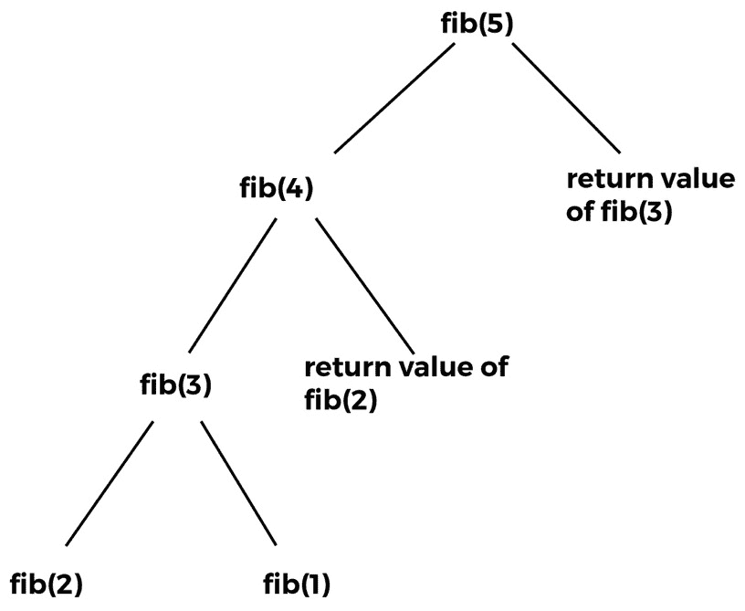
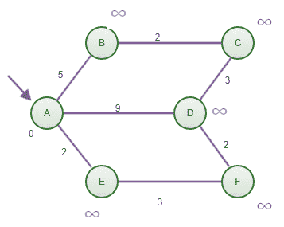
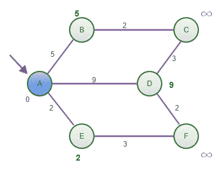
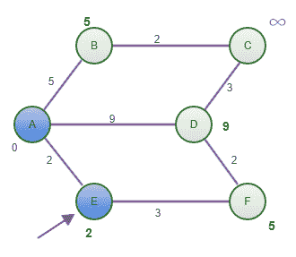
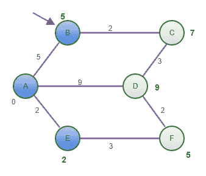
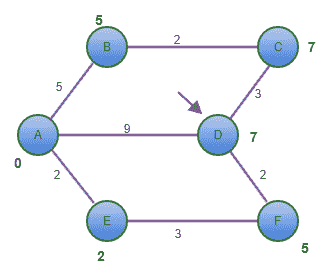
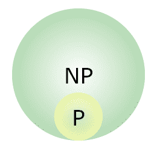

# 十三、设计技巧与策略

在本章中，我们后退一步，看看计算机算法设计中更广泛的主题。随着编程经验的增长，某些模式开始变得明显。算法世界包含了大量的技术和设计原则。要解决现场较难的问题，需要掌握这些技术。

在本章中，我们将讨论不同类型算法的分类方法。将描述和说明设计技术。我们还将进一步讨论算法分析。最后，我们将提供一些非常重要的算法的详细实现。

本章将涵盖以下主题：

*   算法的分类
*   各种算法设计方法
*   各种重要算法的实现和解释

# 技术要求

本章中使用的源代码可从以下 GitHub 链接获得：

[https://github.com/PacktPublishing/Hands-On-Data-Structures-and-Algorithms-with-Python-3.7-Second-Edition/tree/master/Chapter13](https://github.com/PacktPublishing/Hands-On-Data-Structures-and-Algorithms-with-Python-3.7-Second-Edition/tree/master/Chapter13) 。

# 算法分类

根据算法的设计目的，有许多分类方案。在前几章中，我们实现了各种算法。要问的问题是：这些算法是否具有相同的形式或任何相似性？如果答案是肯定的，那么要问：作为比较基础的相似性和特征是什么？如果答案是否定的，那么这些算法可以分组吗？

这些是我们将在后续小节中讨论的问题。这里我们介绍了分类算法的主要方法。

# 按执行情况分类

将一系列步骤或过程转换为工作算法时，可能会采取多种形式。算法的核心可以使用以下一个或多个资产。

# 递归

递归算法是那些调用自己来重复执行代码直到满足特定条件的算法。有些问题更容易通过递归实现其解决方案来表达。一个典型的例子是河内的塔楼。

简单来说，迭代函数是一个循环以重复代码的某一部分的函数，递归函数是一个调用自身以重复代码的函数。另一方面，迭代算法使用一系列步骤或重复构造来制定解决方案；它迭代执行代码的一部分。

这种重复的构造可以是一个简单的`while`循环，也可以是任何其他类型的循环。迭代解决方案也比它们的递归实现更容易让人想到。

# 思维方式

算法的一个实现是将其表示为受控逻辑推导。该逻辑组件由将在计算中使用的公理组成。控制组件确定演绎应用于公理的方式。这以 a*算法=逻辑+控制*的形式表示。这构成了逻辑编程范式的基础。

逻辑组件决定了算法的含义。控制组件只影响其效率。在不修改逻辑的情况下，可以通过改进控制组件来提高效率。

# 串行或并行算法

大多数计算机的 RAM 模型允许一次执行一条指令的假设。

串行算法，也称为**顺序算法**，是按顺序执行的算法。执行从开始到结束，无需任何其他执行过程。

为了能够同时处理多条指令，需要不同的模型或计算技术。并行算法一次执行多个操作。在婴儿车模型中，有共享全局内存的串行处理器。处理器还可以并行执行各种算术和逻辑运算。这允许一次执行多条指令。

并行/分布式算法将一个问题在其处理器之间划分为子问题以收集结果。一些排序算法可以有效地并行化，而迭代算法通常是可并行化的。

# 确定性与非确定性算法

每次使用相同的输入运行算法时，确定性算法都会产生相同的输出。有些问题在解决方案的设计中非常复杂，以确定性的方式表达它们的解决方案可能是一个挑战。

非确定性算法可以更改执行顺序或某些内部子流程，导致每次运行算法时最终结果发生变化。

因此，对于非确定性算法的每次运行，算法的输出都会不同。例如，根据生成的随机数的值，使用概率值的算法将在连续执行时产生不同的输出。

# 按复杂性分类

确定算法的复杂度就是估计在计算或程序执行期间需要多少空间（内存）和时间。通常，这两种算法的性能与它们的复杂度进行比较。较低复杂度的算法（即执行给定任务所需的空间和时间较少的算法）是首选的。

[Chapter 3](13.html), *Principles of Algorithm Design*, presents more comprehensive coverage of complexity. We will summarize what we have learned here.

# 复杂度曲线

让我们考虑一个数量级的问题。为了确定算法的时间复杂度，我们用**T**（n）表示它。该值可能属于**O**（*1*）、**O**（*对数 n*）、**O**（*n*）、**O**n 对数（n）、【T20 O】（【T22 n】<sup>2</sup>、**O*****对数（n）】3*或**O**（*2<sup>n</sup>*）。根据算法执行的步骤，时间复杂度可能会受到影响，也可能不会受到影响。符号**O**（*n*表示算法的增长率。**

现在让我们检查一个实际场景，以确定哪种算法更适合解决给定问题。我们如何得出气泡排序算法比快速排序算法慢的结论？或者，一般来说，我们如何衡量一种算法相对于另一种算法的效率？

嗯，我们可以比较任意数量的算法的大**O**来确定它们的效率。这种方法为我们提供了一个时间度量或增长率，当*n*变大时，该方法会绘制算法的行为图。

下面是算法性能可能会下降的不同运行时的图表：


按升序排列，从最佳到最差的运行时列表是**O（1）**、**O（logn）**、**O（*n***、**O（*n logn***、**O（*n<sup>2】</sup>***、**O（*n***】】）和**O（*2<sup>n</sup>***。因此，如果一个算法的时间复杂度为**O****（1）**，而同一任务的另一个算法的时间复杂度为**O（logn），则应首选**第一个算法

# 按设计分类

在本节中，我们将根据算法的设计对其进行分类

一个给定的问题可能有多种解决方案。当分析这些解决方案时，可以观察到每个解决方案都遵循特定的模式或技术。我们可以根据算法解决问题的方式对算法进行分类，如下小节所示。

# 分而治之

这种解决问题的方法正如其名称所示。为了解决（征服）某个问题，该算法将其划分为易于解决的子问题。此外，这些子问题的解决方案以这样一种方式组合，即最终解决方案是原始问题的解决方案。

将问题分解为更小的子问题的方式主要是通过递归完成的。我们将在后面的小节中详细研究这种技术。使用这种技术的一些算法包括合并排序、快速排序和二进制搜索。

# 动态规划

这种技术类似于分而治之，将问题分解为更小的问题。然而，在分治中，每个子问题都必须先解决，然后才能将其结果用于解决更大的问题。

相比之下，动态规划不计算已经遇到的子问题的解。相反，它使用记忆技术来避免重新计算。

动态规划问题有两个特点：**最优子结构**和**重叠子问题**。我们将在下一节中进一步讨论这一点。

# 贪婪算法

确定某个问题的最佳解决方案可能相当困难。为了克服这一问题，我们采取了一种方法，从多个可用选项中选择最有希望的选项。

对于贪婪算法，指导原则是总是选择产生最有利结果的选项，并继续这样做，希望得到一个完美的解决方案。该技术旨在通过一系列局部最优选择来找到全局最优的最终解决方案。局部最优选择似乎导致了问题的解决。

# 技术实施

让我们深入了解我们讨论过的一些理论编程技术的实现。我们从动态规划开始。

# 用动态规划实现

正如我们已经描述的，在这种方法中，我们将给定的问题划分为更小的子问题。在寻找解决方案时，注意不要重新计算以前遇到的任何子问题。

这听起来有点像递归，但这里的情况有点不同。问题可以通过使用动态规划来解决，但不一定采用递归调用的形式。

使问题成为用动态规划解决的理想候选问题的一个特性是，它有一组**重叠的子问题**。

一旦我们意识到子问题的形式在计算过程中已经重复，我们就不需要再计算它了。相反，我们为之前遇到的子问题返回一个预先计算的结果。

为了确保不必重新评估子问题，我们需要一种有效的方法来存储每个子问题的结果。以下两种技术是现成的。

# 回忆录

该技术从初始问题集开始，并将其划分为小个子问题。确定子程序的解决方案后，我们将结果存储到该特定子问题。将来，当遇到这个子问题时，我们只返回它预先计算的结果。

# 制表

在表格中，我们用子问题的解决方案填充表格，然后将它们组合起来解决更大的问题。

# 斐波那契级数

让我们考虑一个例子来理解动态编程是如何工作的。我们使用斐波那契数列来说明记忆和制表技术。

斐波那契级数可以用递推关系来证明。递归关系是用于定义数学函数或序列的递归函数。例如，以下递归关系定义了斐波那契序列[1，1，2，3，5，8…]：

```py
func(1) = 1
func(0) = 1 
func(n) = func(n-1) + func(n-2)
```

注意，斐波那契序列可以通过将*n*的值放入序列[1，2，3，4，…]中来生成。

# 记忆技术

让我们生成第五项的斐波那契级数：

```py
    1 1 2 3 5
```

生成序列的递归式程序如下所示：

```py
 def fib(n): 
    if n <= 2: 
       return 1 
    else: 
       return fib(n-1) + fib(n-2) 
```

代码非常简单，但阅读起来有点棘手，因为递归调用最终解决了问题。

当满足基本情况时，`fib()`函数返回 1。如果*n*等于或小于 2，则满足基本情况。

如果不满足基本情况，我们将再次调用`fib()`函数，这次第一次调用提供`n-1`，第二次调用提供`n-2`：

```py
    return fib(n-1) + fib(n-2) 
```

求解斐波那契序列中`i<sup>th</sup>`项的策略布局如下：


仔细观察树形图可以发现一些有趣的模式。对**fib（1）**的调用发生两次。对**fib（2）**的调用发生三次。此外，对**fib（3）**的调用会发生两次。

同一函数调用的返回值永不改变；例如，**fib（2）**的返回值在我们调用它时总是相同的。**fib（1）**和**fib（3）**也将相同。因此，如果我们在遇到同一个函数时再次计算，则会浪费计算时间，因为返回的结果是相同的。

对具有相同参数和输出的函数的重复调用表明存在重叠。某些计算会在较小的子问题中重复出现。

更好的方法是存储第一次遇到的**fib（1）**的计算结果。类似地，我们应该存储**fib（2）**和**fib（3）**的返回值。稍后，每当我们遇到对**fib（1）**、**fib（2）**或**fib（3）**的调用时，我们只需返回它们各自的结果。

我们的`fib`调用图现在如下所示：



如果多次遇到**fib（3）**、fib（2）和**fib（1）**，我们已经消除了计算它们的需要。这是记忆技术的典型代表，在将问题分解为子问题时，不会重新计算对函数的重叠调用。

在我们的 Fibonacci 示例中，重叠的函数调用是**fib（1）**、**fib（2）**和**fib（3）**：

```py
    def dyna_fib(n, lookup): 
        if n <= 2: 
            lookup[n] = 1 

        if lookup[n] is None: 
            lookup[n] = dyna_fib(n-1, lookup) + dyna_fib(n-2, lookup) 

        return lookup[n]
```

要创建包含 1000 个元素的列表，我们执行以下操作并将其传递给`dyna_fib`函数的查找参数：

```py
    map_set = [None]*(1000)
```

此列表将存储对`dyna_fib()`函数的各种调用的计算值：

```py
    if n <= 2: 
        lookup[n] = 1 
```

任何对*n*小于或等于 2 的`dyna_fib()`函数的调用都将返回 1。当评估`dyna_fib(1)`时，我们将该值存储在`map_set`的索引 1 处。

将`lookup[n]`的条件写入如下：

```py
if lookup[n] is None:
    lookup[n] = dyna_fib(n-1, lookup) + dyna_fib(n-2, lookup)
```

我们通过查找，以便在评估子问题时可以引用它。对`dyna_fib(n-1, lookup)`和`dyna_fib(n-2, lookup)`的调用存储在`lookup[n]`中。

当我们运行更新后的函数实现来查找斐波那契级数的`*i*<sup>th</sup>`项时，我们可以看到相当大的改进。这个实现比我们最初的实现运行得快得多。为两个实现提供值 20，并观察执行速度的差异。

然而，由于在存储函数调用结果时使用了额外的内存，更新后的算法为此牺牲了空间复杂度。

# 制表技术

动态规划中的第二种技术涉及使用结果表，或在某些情况下使用矩阵来存储计算结果以供以后使用。

这种方法首先解决了一个更大的问题，找到了一条通向最终解决方案的路线。在`fib()`函数的情况下，我们开发了一个表，其中包含预先确定的`fib(1)`和`fib(2)`值。基于这两个值，我们将努力达到`fib(n)`：

```py
    def fib(n): 

        results = [1, 1] 

        for i in range(2, n): 
            results.append(results[i-1] + results[i-2]) 

        return results[-1]
```

`results`变量存储索引 0 和 1 处的值 1 和 1。表示`fib(1)`和`fib(2)`的返回值。对于大于 2 的值，为了计算`fib()`函数的值，我们只需调用`for`循环，它将`results[i-1] + results[i-2]`的和添加到结果列表中。

# 使用分治实现

这种解决问题的编程方法强调需要将问题分解为与原始问题类型或形式相同的较小子问题。对这些子问题进行求解和组合，以获得原始问题的解。

以下三个步骤与此类编程相关。

# 分

分裂意味着分解一个实体或问题。在这里，我们设计了将原始问题分解为子问题的方法。我们可以通过迭代或递归调用来实现这一点。

# 占领

不可能无限期地将问题分解成子问题。在某个时刻，最小的不可分割问题将返回一个解决方案。一旦发生这种情况，我们可以逆转我们的思维过程，说如果我们知道最小子问题的解，我们就可以得到原始问题的最终解。

# 合并

为了得到最终的解决方案，我们需要结合较小问题的解决方案来解决较大的问题。

分治算法还有其他变体，例如合并和合并，以及征服和求解。许多算法利用分治原理，如合并排序、快速排序和 Strassen 矩阵乘法。

我们现在将描述合并排序算法的实现，正如我们在前面的[第 3 章](13.html)、*算法设计原则*中所看到的。

# 合并排序

合并排序算法基于分治规则。给定一个未排序元素的列表，我们将该列表大致分为两部分。我们继续递归地将列表分成两半。

一段时间后，作为递归调用的结果创建的子列表将只包含一个元素。此时，我们开始在征服或合并步骤中合并解决方案：

```py
    def merge_sort(unsorted_list): 
        if len(unsorted_list) == 1: 
            return unsorted_list 

        mid_point = int((len(unsorted_list))//2) 

        first_half = unsorted_list[:mid_point] 
        second_half = unsorted_list[mid_point:] 

        half_a = merge_sort(first_half) 
        half_b = merge_sort(second_half) 

        return merge(half_a, half_b) 
```

我们的实现从接受未排序元素的列表到`merge_sort`函数开始。`if`语句用于建立基本情况，如果`unsorted_list`中只有一个元素，我们只需再次返回该列表。如果列表中有多个元素，我们可以使用`mid_point = int((len(unsorted_list)) // 2)`找到近似中间值。

使用此`mid_point`，我们将列表分为两个子列表，即`first_half`和`second_half`：

```py
    first_half = unsorted_list[:mid_point] 
    second_half = unsorted_list[mid_point:] 
```

通过将两个子列表再次传递给`merge_sort`函数，可以进行递归调用：

```py
    half_a = merge_sort(first_half)  
    half_b = merge_sort(second_half)
```

现在进入合并步骤。当`half_a`和`half_b`已经传递了它们的值时，我们调用`merge`函数，该函数将`half_a`和`half_b`中存储的两个解决方案合并或组合，这两个解决方案是列表：

```py
 def merge(first_sublist, second_sublist): 
     i = j = 0 
     merged_list = [] 

     while i < len(first_sublist) and j < len(second_sublist): 
         if first_sublist[i] < second_sublist[j]: 
             merged_list.append(first_sublist[i]) 
             i += 1 
         else: 
             merged_list.append(second_sublist[j]) 
             j += 1 

     while i < len(first_sublist): 
         merged_list.append(first_sublist[i]) 
         i += 1 

     while j < len(second_sublist): 
         merged_list.append(second_sublist[j]) 
         j += 1 

     return merged_list 
```

`merge`函数获取我们想要合并的两个列表`first_sublist`和`second_sublist`。`i`和`j`变量被初始化为 0，并用作指针，告诉我们在合并过程的两个列表中的位置。

最终的`merged_list`将包含合并列表：

```py
    while i < len(first_sublist) and j < len(second_sublist): 
        if first_sublist[i] < second_sublist[j]: 
            merged_list.append(first_sublist[i]) 
            i += 1 
        else: 
            merged_list.append(second_sublist[j]) 
            j += 1 
```

`while`循环开始比较`first_sublist`和`second_sublist`中的元素。`if`语句选择两者中较小的一个`first_sublist[i]`或`second_sublist[j]`，并将其附加到`merged_list`。增加`i`或`j`索引，以反映我们在合并步骤中的位置。当任一子列表为空时，`while`循环停止。

在`first_sublist`或`second_sublist`中可能会留下一些元素。最后两个`while`循环确保在返回`merged_list`之前将这些元素添加到`merged_list`。

最后一次调用`merge(half_a, half_b)`将返回已排序的列表。

让我们通过合并两个子列表`[4, 6, 8]`和`[5, 7, 11, 40]`来对算法进行试运行：

| **步骤** | `first_sublist` | `second_sublist` | `merged_list` |
| 步骤 0 | `[4 6 8]` | `[5 7 11 40]` | `[]` |
| 第一步 | `[ 6 8]` | `[5 7 11 40]` | `[4]` |
| 步骤 2 | `[ 6 8]` | `[ 7 11 40]` | `[4 5]` |
| 步骤 3 | `[ 8]` | `[ 7 11 40]` | `[4 5 6]` |
| 步骤 4 | `[ 8]` | `[ 11 40]` | `[4 5 6 7]` |
| 步骤 5 | `[ ]` | `[ 11 40]` | `[4 5 6 7 8]` |
| 步骤 6 | `[]` | `[ ]` | `[4 5 6 7 8 11 40]` |

请注意，粗体文本表示循环`first_sublist`（使用`i`*索引*）和`second_sublist`（使用`j`索引）中引用的当前项。

在执行的这一点上，merge 函数中的第三个`while`循环开始，将 11 和 40 移动到`merged_list`中。返回的`merged_list`将包含完全排序的列表。

请注意，虽然合并算法需要`O(n)`时间，但合并排序算法的运行时间复杂性为`O(log n) T(n) = O(n)*O(log n) = O(n log n)`。

# 贪婪算法的实现

正如我们前面所讨论的，贪婪算法做出决策以产生最佳可能的局部解，从而提供最优解。这项技术的希望是，通过在每一步做出最佳可能的选择，整个路径将导致整体最优解或最终最优解。

贪婪算法的例子包括寻找最小生成树的**普里姆算法**、**背包问题**和**旅行商问题**，仅举几例。

# 硬币计数问题

为了演示贪婪技术是如何工作的，让我们看一个例子。考虑一个问题，在这个问题中，我们希望计算给定数量 A 所需硬币的最小数量，在这里我们有给定硬币价值的无限供应。

例如，在一些任意国家，我们有以下硬币面额：1、5 和 8 GHC。给定一个数量（例如，12 GHC），我们希望找到提供该数量所需的最小硬币数量。

使用面额`{a<sub>1</sub>,a<sub>2</sub>,a<sub>3</sub>...a<sub>n</sub>}`获得提供给定金额*a*的最小硬币数量的算法如下：

1.  我们对面额清单`{a<sub>1</sub>, a<sub>2</sub>, a<sub>3</sub> ...a<sub>n</sub>}`进行排序。
2.  我们在`{a<sub>1</sub>, a<sub>2</sub>, a<sub>3</sub>...a<sub>n</sub>}`中得到了比 A 小的最大面额。
3.  我们通过将 A 除以最大面额得到除法。
4.  我们通过使用（最大分母的百分比）得到余数，从而得到剩余量 A。
5.  如果 A 的值变为 0，则返回结果。
6.  否则，如果 A 的值大于 0，则在结果变量中附加最大分母和除法变量。然后重复步骤 2-5。

使用贪婪方法，我们首先从可用面额中选择最大值，即 8-12。余数 4 不能除以 8 或下一个最低面额 5。因此，我们尝试使用 1 GHC 面额的硬币，其中我们需要 4 枚。最后，使用这个贪婪算法，我们返回一个 8 GHC 硬币和四个 1 GHC 硬币的答案。

到目前为止，我们的贪婪算法似乎做得很好。返回相应面额的函数如下所示：

```py
    def basic_small_change(denom, total_amount): 
        sorted_denominations = sorted(denom, reverse=True) 

        number_of_denoms = [] 

        for i in sorted_denominations: 
            div = total_amount // i 
            total_amount = total_amount % i 
            if div > 0: 
                number_of_denoms.append((i, div)) 

        return number_of_denoms
```

这种贪婪算法总是从使用尽可能大的面额开始。请注意，`denom`是面额列表，`sorted(denom, reverse=True)`将对列表进行反向排序，以便我们可以在索引*`0`*处获得最大面额。现在，从已排序面额列表的索引`*0*``sorted_denominations`开始，我们迭代并应用贪婪技术：

```py
    for i in sorted_denominations: 
        div = total_amount // i 
        total_amount = total_amount % i 
        if div > 0: 
            number_of_denoms.append((i, div)) 
```

循环将贯穿面额列表。每次循环运行时，它通过将`total_amount`除以当前面额*i*得到商`div`。更新`total_amount`变量以存储剩余部分，以便进一步处理。如果商大于 0，则存储在`number_of_denoms`中。

然而，在某些情况下，该算法可能会失败。例如，当超过 12 GHC 时，我们的算法返回一个 8 GHC 和四个 1 GHC 硬币。然而，该输出不是最佳解决方案。最好的解决方案是使用两枚 5 GHC 和两枚 1 GHC 硬币。

本文提出了一种更好的贪婪算法。这一次，函数返回一个元组列表，允许我们调查最佳结果：

```py
    def optimal_small_change(denom, total_amount): 

        sorted_denominations = sorted(denom, reverse=True) 

        series = [] 
        for j in range(len(sorted_denominations)): 
            term = sorted_denominations[j:] 

            number_of_denoms = [] 
            local_total = total_amount 
            for i in term: 
                div = local_total // i 
                local_total = local_total % i 
                if div > 0: 
                    number_of_denoms.append((i, div)) 

            series.append(number_of_denoms) 

        return series
```

外部`for`循环使我们能够限制我们找到解决方案的面额：

```py
    for j in range(len(sorted_denominations)): 
        term = sorted_denominations[j:] 
        ...     
```

假设我们在`sorted_denominations`中有列表[5,4,3]，用`[j:]`对其进行切片有助于我们获得子列表[5,4,3]、[4,3]和[3]，我们试图从中找到正确的组合。

# 最短路径算法

最短路径问题要求我们找出图中节点之间可能的最短路径。在绘制从**A**点到**B**点的最有效方式时，它在地图绘制和路线规划方面有着重要的应用。

Dijkstra 算法是解决这个问题的一种非常流行的方法。该算法用于寻找从源到图中所有其他节点或顶点的最短距离。这里我们将解释如何使用贪婪方法来解决这个问题。

Dijkstra 算法适用于加权有向图和无向图。该算法在加权图中生成给定源节点 a 的最短路径列表的输出。该算法的工作原理如下：

1.  最初，将所有节点标记为未访问，并将它们与给定源节点的距离设置为无穷大（源节点设置为零）。
2.  将源节点设置为当前节点。
3.  对于当前节点，查找所有未访问的相邻节点；计算从源节点到当前节点到该节点的距离。将新计算的距离与当前指定的距离进行比较，如果较小，则将其设置为新值。
4.  一旦我们考虑了当前节点的所有未访问的相邻节点，我们将其标记为已访问。
5.  接下来，我们考虑下一个未访问的节点，它与源节点具有最短的距离。重复步骤 2 至 4。
6.  当未访问的节点列表为空时，我们停止，这意味着我们已经考虑了所有未访问的节点。

考虑以下六个节点的加权图（a，b，c，d，e，f]，以理解 Dijkstra 的算法是如何工作的：


通过人工检查，节点**A**与节点**D**之间的最短路径乍一看似乎是距离为 9 的直线。然而，最短的路线意味着最低的总距离，即使这包括几个部分。相比之下，从节点**A**到节点**E**再到节点**F**最后到节点**D**的旅行总距离为 7，因此路线更短。

我们将使用单个源实现最短路径算法。它将确定从原点（本例中为**A**到图中任何其他节点的最短路径

在[第 8 章](08.html)、*图和其他算法*中，我们讨论了如何用邻接列表表示图。我们使用邻接列表以及每条边上的权重/成本/距离来表示图形，如下面的 Python 代码所示。表格用于跟踪从图形中的源到任何其他节点的最短距离。Python 字典将用于实现此表。

以下是起始表：

| **节点** | **距震源最短距离** | **上一节点** |
| **A** | 0 | 没有一个 |
| **B** | ∞ | 没有一个 |
| **C** | ∞ | 没有一个 |
| **D** | ∞ | 没有一个 |
| **E** | ∞ | 没有一个 |
| **F** | ∞ | 没有一个 |

图表和表格的邻接列表如下所示：

```py
    graph = dict() 
    graph['A'] = {'B': 5, 'D': 9, 'E': 2} 
    graph['B'] = {'A': 5, 'C': 2} 
    graph['C'] = {'B': 2, 'D': 3} 
    graph['D'] = {'A': 9, 'F': 2, 'C': 3} 
    graph['E'] = {'A': 2, 'F': 3} 
    graph['F'] = {'E': 3, 'D': 2} 
```

嵌套字典保存距离和相邻节点。

当算法开始时，从给定源节点（**A**到任意节点的最短距离未知。因此，我们最初将到所有其他节点的距离设置为无穷大，节点**A**除外，因为从节点**A**到节点**A**的距离为 0。

算法开始时未访问任何先前节点。因此，我们将节点**A**的上一个节点列标记为无。

在算法的步骤 1 中，我们首先检查节点**A**的相邻节点。要找到从节点**A**到节点**B**的最短距离，我们需要找到从开始节点到节点 B 的前一个节点的距离，恰好是节点**A**，并将其添加到从节点**A**到节点**B**的距离中。我们对**A**的其他相邻节点进行此操作，它们是**B**、**E**和**D**。如下图所示：



我们以相邻节点**B**为其与节点**A**的距离最小；起始节点**A**到前一节点（无）的距离为 0，前一节点到当前节点**B**的距离为**5**。将该总和与节点**B**的最短距离列中的数据进行比较。因为**5**小于无穷大（**∞** ，我们替换**∞** 两个中较小的一个，即**5**。

任何时候，当一个节点的最短距离被一个较小的值替换时，我们也需要为当前节点的所有相邻节点更新上一个节点列。在此之后，我们将节点**A**标记为已访问：



在第一步的末尾，我们的表如下所示：

| **节点** | **距震源最短距离** | **上一节点** |
| **A*** | 0 | 没有一个 |
| B | 5. | A. |
| C | ∞ | 没有一个 |
| D | 9 | A. |
| E | 2. | A. |
| F | ∞ | 没有一个 |

此时，节点**A**被视为已访问。因此，我们将节点**A**添加到访问节点列表中。在表中，我们显示节点**A**已通过加粗文本并在其上附加星号进行访问。

在第二步中，我们使用我们的表作为指导，找到距离最短的节点。节点**E**的值为 2，距离最短。这是我们可以从节点**E**的表格中推断出来的。要到达节点**E**，我们必须访问节点**A**并覆盖**2 的距离。**从节点 A 出发，经过 0 的距离到达起始节点，即节点**A**本身。

节点**E**的相邻节点为**A**和**F**。但是，节点 T6 T6 已经访问了一个 TA7 T7，所以我们只考虑节点 ORT T8。要找到到节点**F**的最短路径或距离，我们必须找到起始节点到节点**E**的距离，并将其添加到节点**E**和**F**之间的距离中。通过查看节点**E**的最短距离列，可以找到起始节点到节点**E**的距离，该列的值为**2**。节点**E**到**F**的距离可以从本节前面用 Python 开发的邻接列表中获得。

该距离为**3**。这两个加起来等于 5，小于无穷大。请记住，我们正在检查相邻节点**F**。由于节点**E**没有更多的相邻节点，我们将节点**E**标记为已访问。我们更新的表和图将具有以下值：

| **节点** | **距震源最短距离** | **上一节点** |
| **A*** | 0 | 没有一个 |
| B | 5. | A. |
| C | ∞ | 没有一个 |
| D | 9 | A. |
| **E*** | 2. | A. |
| F | 5. | E |

在访问节点**E**后，我们在表的最短距离列中找到了最小值，对于节点**B**和**F**，该值为 5。让我们纯粹按照字母顺序选择**B**而不是**F**（我们同样可以选择**F**。

与**B**相邻的节点为**A**和**C**，但节点**A**已经被访问。使用我们之前建立的规则，从**A**到**C**的最短距离为 7。我们得出这个数字是因为从起始节点到节点**B**的距离是 5，而从节点**B**到**C**的距离是 2。

由于 7 小于无穷大，我们将最短距离更新为 7，并使用节点**B**更新之前的节点列：



现在，**B**也被标记为已访问。表和图的新状态如下所示：

| **节点** | **距震源最短距离** | **上一节点** |
| **A*** | 0 | 没有一个 |
| **B*** | 5. | A. |
| C | 7. | B |
| D | 9 | A. |
| **E*** | 2. | A. |
| F | 5. | E |

距离最短但未访问的节点为节点**F**。与**F**相邻的节点为节点**D**和**E**。但节点**E**已经被访问。因此，我们专注于寻找从起始节点到节点**D**的最短距离。

我们通过将从节点**A**到**F**的距离与从节点**F**到**D**的距离相加来计算该距离。总计为 7，小于**9**。因此，我们将**9**更新为**7**，并将节点**D**上一个节点列中的**A**替换为**F**：



节点**F**现在标记为已访问。以下是截至目前更新的表格和图表：

| **节点** | **距震源最短距离** | **上一节点** |
| **A*** | 0 | 没有一个 |
| **B*** | 5. | A. |
| C | 7. | B |
| D | 7. | F |
| **E*** | 2. | A. |
| **F*** | 5. | E |

现在只剩下两个未访问的节点，**C**和**D**，两个节点的距离开销都为**7**。按照字母顺序，我们选择检查**C**，因为两个节点与起始节点**A**的最短距离相同：


但是，**C**的所有相邻节点都已被访问。因此，我们除了将节点**C**标记为已访问外，无事可做。该表在这一点上保持不变：


最后，我们以节点**D**为例，发现它的所有相邻节点都被访问过。我们只将其标记为已访问。该表保持不变：

| **节点** | **距震源最短距离** | **上一节点** |
| **A*** | 0 | 没有一个 |
| **B*** | 5. | A. |
| **C*** | 7. | B |
| **D*** | 7. | F |
| **E*** | 2. | A. |
| **F*** | 5. | E |

让我们用初始图来验证这个表。从图中我们知道从**A**到**F**的最短距离为**5**。我们需要通过**E**到达节点**F**：



由表可知，节点**F**距离源列的最短距离为 5。这是真的。它还告诉我们，要到达节点**F**，我们需要访问节点**E**，从**E**到节点**A**，这是我们的起始节点。这实际上是最短的路径。

为了实现 Dijkstra 算法来寻找最短路径，我们首先通过表示表来开始寻找最短距离的程序，该表使我们能够跟踪图形中的变化。对于我们使用的图表，以下是该表的字典表示：

```py
    table = dict() 
    table = { 
        'A': [0, None], 
        'B': [float("inf"), None], 
        'C': [float("inf"), None], 
        'D': [float("inf"), None], 
        'E': [float("inf"), None], 
        'F': [float("inf"), None], 
    } 
```

表的初始状态使用`float("inf")`表示无穷大。字典中的每个键都映射到一个列表。在列表的第一个索引处，存储到源 A 的最短距离。在第二个索引处，存储前一个节点：

```py
    DISTANCE = 0 
    PREVIOUS_NODE = 1 
    INFINITY = float('inf') 
```

为了避免使用幻数，我们使用前面的常量。最短路径列的索引由`DISTANCE`引用。前面节点列的索引被`PREVIOUS_NODE`引用。

现在，该算法的主要功能已全部设置完毕。它将以邻接列表、表和起始节点表示的图形作为参数：

```py
    def find_shortest_path(graph, table, origin): 
        visited_nodes = [] 
        current_node = origin 
        starting_node = origin 
```

我们将访问的节点列表保存在`visited_nodes`列表中。`current_node`和`starting_node`变量都将指向我们选择作为起始节点的图中的节点。`origin`值是所有其他节点寻找最短路径的参考点。

整个过程的重型提升通过使用`while`回路完成：

```py
    while True: 
        adjacent_nodes = graph[current_node] 
        if set(adjacent_nodes).issubset(set(visited_nodes)): 
            # Nothing here to do. All adjacent nodes have been visited. 
            pass 
        else: 
            unvisited_nodes = 
                set(adjacent_nodes).difference(set(visited_nodes)) 
            for vertex in unvisited_nodes: 
                distance_from_starting_node = 
                    get_shortest_distance(table, vertex) 
                if distance_from_starting_node == INFINITY and 
                   current_node == starting_node: 
                    total_distance = get_distance(graph, vertex, 
                                                  current_node) 
                else: 
                    total_distance = get_shortest_distance (table, 
                    current_node) + get_distance(graph, current_node, 
                                                 vertex) 

                if total_distance < distance_from_starting_node: 
                    set_shortest_distance(table, vertex, 
                                          total_distance) 
                    set_previous_node(table, vertex, current_node) 

        visited_nodes.append(current_node) 

        if len(visited_nodes) == len(table.keys()): 
            break 

        current_node = get_next_node(table,visited_nodes) 
```

让我们来分析一下`while`循环在做什么。在`while`循环的主体中，我们获得了要使用`adjacent_nodes = graph[current_node]`进行研究的图中的当前节点。现在，`current_node`应该提前设置。`if`语句用于确定`current_node`的所有相邻节点是否已被访问。

当 fir*s*t 时间执行`while`循环时，`current_node`将包含 A，`adjacent_nodes`将包含节点 B、D 和 E。此外，`visited_nodes`也将为空。如果所有节点都被访问过，我们只会继续往下看程序中的语句。否则，我们将开始一个全新的步骤。

`set(adjacent_nodes).difference(set(visited_nodes))`语句返回尚未访问的节点。循环在未访问的节点列表上迭代：

```py
    distance_from_starting_node = get_shortest_distance(table, vertex) 
```

`get_shortest_distance(table, vertex)`helper 方法将使用`vertex`引用的其中一个未访问的节点返回存储在表的最短距离列中的值：

```py
    if distance_from_starting_node == INFINITY and current_node == starting_node: 
         total_distance = get_distance(graph, vertex, current_node) 
```

当我们检查起始节点的相邻节点时，`distance_from_starting_node == INFINITY and current_node == starting_node`将计算为`True`，在这种情况下，我们只需通过参考图找到起始节点和顶点之间的距离：

```py
    total_distance = get_distance(graph, vertex, current_node)
```

`get_distance`方法是我们用来获取`vertex`和`current_node`之间的边值（距离）的另一种辅助方法。

如果条件失败，则将起始节点到`current_node`的距离和`current_node`到`vertex`的距离之和分配给`total_distance`。

一旦我们有了我们的总距离，我们需要检查`total_distance`是否小于表中最短距离列中的现有数据。如果较小，则我们使用两个 helper 方法更新该行：

```py
    if total_distance < distance_from_starting_node: 
        set_shortest_distance(table, vertex, total_distance) 
    set_previous_node(table, vertex, current_node) 
```

此时，我们将`current_node`添加到访问节点列表中：

```py
    visited_nodes.append(current_node) 
```

如果访问了所有节点，那么我们必须退出`while`循环。为了检查是否访问了所有节点，我们将`visited_nodes`列表的长度与表中的键数进行比较。如果它们相等，我们只需退出`while`循环。

`get_next_node`helper 方法用于获取下一个要访问的节点。正是这种方法帮助我们使用表在距起始节点的最短距离列中找到最小值。

整个方法以返回更新的表结束。要打印表格，我们使用以下语句：

```py
 shortest_distance_table = find_shortest_path(graph, table, 'A') 
 for k in sorted(shortest_distance_table): 
     print("{} - {}".format(k,shortest_distance_table[k])) 
```

这是前面语句的输出：

```py
>>> A - [0, None] B - [5, 'A'] C - [7, 'B'] D - [7, 'F'] E - [2, 'A'] F - [5, 'E']
```

为了完整起见，让我们了解一下 helper 方法在做什么：

```py
    def get_shortest_distance(table, vertex): 
        shortest_distance = table[vertex][DISTANCE] 
        return shortest_distance 
```

`get_shortest_distance`函数返回存储在表的索引 0 中的值。在该索引中，我们始终存储从起始节点到`vertex`的最短距离。`set_shortest_distance`功能仅设置该值如下：

```py
    def set_shortest_distance(table, vertex, new_distance): 
        table[vertex][DISTANCE] = new_distance 
```

当我们更新节点的最短距离时，我们使用以下方法更新其上一个节点：

```py
    def set_previous_node(table, vertex, previous_node): 
        table[vertex][PREVIOUS_NODE] = previous_node 
```

记住，`PREVIOUS_NODE`常数等于 1。在表中，我们将`previous_node`的值存储在`table[vertex][PREVIOUS_NODE]`处。

为了找到任意两个节点之间的距离，我们使用`get_distance`函数：

```py
    def get_distance(graph, first_vertex, second_vertex): 
        return graph[first_vertex][second_vertex] 
```

最后一个辅助方法是`get_next_node`函数：

```py
    def get_next_node(table, visited_nodes): 
        unvisited_nodes = 
            list(set(table.keys()).difference(set(visited_nodes))) 
        assumed_min = table[unvisited_nodes[0]][DISTANCE] 
        min_vertex = unvisited_nodes[0] 
        for node in unvisited_nodes: 
            if table[node][DISTANCE] < assumed_min: 
                assumed_min = table[node][DISTANCE] 
                min_vertex = node 

        return min_vertex 
```

`get_next_node`函数类似于查找列表中最小项的函数。

函数首先通过使用`visited_nodes`查找表中未访问的节点，以获得两组列表之间的差异。假设`unvisited_nodes`列表中的第一项是`table`最短距离列中的最小项。

如果在`for`循环运行时发现较小的值，`min_vertex`将被更新。然后，函数返回`min_vertex`作为未访问的顶点或与源之间距离最小的节点。

Dijkstra 算法最坏情况下的运行时间为**O**（*| E |+V | log | V |*），其中*| V |*为顶点数，*| E |*为边数。

# 复杂性类

复杂性类别根据问题的难度以及解决问题所需的时间和空间资源对问题进行分组。在本节中，我们将讨论 N、NP、NP 完全和 NP 难复杂性类。

# P/NP 问题

计算机的出现加快了某些任务的执行速度。总的来说，计算机擅长完善计算艺术，解决可以简化为一组数学计算的问题。

然而，这一断言并不完全正确。有些问题需要花费大量的时间让计算机做出合理的猜测，更不用说找到正确的解决方案了。

在计算机科学中，计算机可以在多项式时间内使用逻辑步骤的逐步过程来解决的一类问题称为 P 型，其中 P 代表多项式。这些问题相对容易解决。

还有一类问题被认为很难解决。*难题*一词是指当试图找到解决方案时，问题难度增加的方式。然而，尽管这些问题的难度增长率很高，但仍有可能确定提出的解决方案是否能在多项式时间内解决问题。这些问题称为 NP 型问题。这里的 NP 代表不确定多项式时间。

现在百万美元的问题是，*P=NP*吗？

The proof for P* = NP* is one of the Millennium Prize Problems from the Clay Mathematics Institute, offering a million dollar prize for a correct solution. 

旅行商问题是 NP 型问题的一个例子。问题陈述说：给定一个国家的*n*个城市的数量，找出所有城市之间的最短路线，从而使旅行具有成本效益。

当城市数量较少时，这个问题可以在合理的时间内得到解决。然而，当城市的数量超过任何两位数时，计算机所花费的时间非常长。

许多计算机和网络安全系统都基于 RSA 加密算法。该算法的优势在于它使用了整数分解问题，这是一个 NP 类型的问题。

寻找由许多数字组成的素数的素数因子是非常困难的。当两个大素数相乘时，得到一个大的非素数。这个数字的因式分解是许多密码算法利用其优势的地方

所有 P 型问题都是**NP**问题的子集。这意味着任何可以在多项式时间内解决的问题也可以在多项式时间内得到验证：



但是**P**=**NP**考察了在多项式时间内可以验证的问题是否也可以在多项式时间内解决。特别是，如果它们相等，这意味着通过尝试许多可能的解决方案来解决的问题可以解决，而不需要实际尝试所有可能的解决方案，这必然会产生某种捷径证明。

这一证明一旦最终被发现，必将对密码学、博弈论、数学和许多其他领域产生严重后果。

# 计算复杂性

一个问题是 NP 难的，如果 NP 中的所有其他问题都是多项式时间可约的，或者映射到它。它至少和 NP 中最难的问题一样难

# 全类

**NP 完全**问题是最难的问题。如果一个问题是**NP**类中的**NP 难**问题，则该问题被视为**NP 完全**问题。

这里，我们展示了各种复杂性组的维恩图：


# 数据中的知识发现

为了从给定的数据中提取有用的信息，我们首先收集用于学习模式的原始数据。接下来，我们应用数据预处理技术去除数据中的噪声。此外，我们还从数据中提取代表数据的重要特征，以开发模型。特征提取是机器学习算法有效工作的关键步骤。对于机器学习算法来说，一个好的特征必须具有信息性和识别性。特征选择技术用于去除不相关、冗余和噪声的特征。此外，突出的特征被反馈给机器学习算法来学习数据中的模式。最后，我们应用评估度量来判断所开发模型的性能，并使用可视化技术来可视化结果和数据。以下是步骤：

1.  数据收集
2.  数据预处理
3.  特征提取
4.  特征选择
5.  机器学习
6.  评估和可视化

# 总结

在本章中，我们详细讨论了算法设计技术，这些技术在计算机科学领域中非常重要。在没有太多数学严谨的情况下，我们还讨论了一些主要的分类算法。

本文还介绍了该领域的其他设计技术，如分治、动态规划和贪婪算法，以及重要示例算法的实现。最后，我们简要讨论了复杂性类。我们看到了 P=NP 的证明是如何在许多领域成为游戏规则的改变者的，如果这样的证明被发现的话。

在下一章中，我们将讨论一些实际应用、工具和机器学习应用的基础知识。