# 三、建立网络实验室环境

我们现在对如何编写和开发 Python 脚本有了相当的了解，Python 脚本是创建程序的基础。现在，我们将继续了解为什么自动化是当今网络中的一个重要主题，然后我们将使用一种流行的软件 EVE-NG 构建我们的网络自动化实验室，该软件帮助我们虚拟化网络设备。

本章将介绍以下主题：

*   何时以及为什么要自动化网络
*   屏幕抓取与 API 自动化
*   为什么要使用 Python 实现网络自动化
*   网络自动化的未来
*   实验室设置
*   准备：安装 EVE-NG
*   构建企业网络拓扑

# 技术要求

在本章中，我们将介绍 EVE-NG 安装步骤以及如何创建实验室环境。安装将在 VMware Workstation、VMware ESXi 和 Red Hat KVM 上完成，因此您应该熟悉虚拟化概念，并在实验室安装之前安装并运行一个虚拟机监控程序。

# 何时以及为什么要自动化网络

网络自动化在整个网络世界都在增加。但是，了解何时以及为什么要自动化您的网络非常重要。例如，如果您是几个网络设备（三个或四个交换机）的管理员，并且没有定期在这些设备上执行这么多任务，那么您可能不需要对它们进行完全自动化。实际上，编写和开发脚本以及测试和排除故障所需的时间可能比手动执行简单任务所需的时间要长。另一方面，如果您负责一个包含多供应商平台的大型企业网络，并且您总是执行重复性任务，那么强烈建议使用脚本来实现自动化。

# 为什么我们需要自动化？

自动化对当今网络的重要性有以下几个原因：

*   **降低成本**：使用自动化解决方案（内部开发或从供应商处购买）将降低网络操作的复杂性以及提供、配置和操作网络设备所需的时间
*   **业务连续性**：自动化将减少在当前基础设施上创建服务时的人为错误，从而允许业务减少服务**上市时间**（**TTM**）
*   **业务敏捷性**：大多数网络任务都是重复的，通过自动化它们，您将提高生产力并推动业务创新
*   **相关性**：构建可靠的自动化工作流可以让网络和系统管理员更快地执行根本原因分析，并通过将多个事件关联在一起增加解决问题的可能性

# 屏幕抓取与 API 自动化

长期以来，CLI 是管理和操作网络设备的唯一访问方法。操作员和管理员过去常常使用 SSH 和 Telnet 访问网络终端进行配置和故障排除。Python 或任何编程语言都有两种与设备通信的方法。第一种方法是像以前一样使用 SSH 或 telnet 获取信息，然后进行处理。这种方法称为**屏幕抓取**，需要能够与设备建立连接并直接在终端上执行命令的库，以及其他库来处理返回的信息以从中提取有用数据。此方法通常需要了解其他解析语言（如正则表达式），以便从输出中匹配数据模式并从中提取有用数据。

第二种方法称为**应用程序可编程接口**（**API**），该方法完全依赖于使用 REST 或 SOAP 协议向设备发送结构化请求，并以结构化格式返回 JSON 或 XML 编码的输出。与第一种方法相比，该方法处理返回数据所需的时间非常少；但是，API 需要在网络设备上进行额外配置以支持它。

# 为什么要使用 Python 实现网络自动化？

Python 是目前可用的一种结构良好且易于编程的语言，面向技术、web 和 internet 开发、数据挖掘和可视化、桌面 GUI、分析、游戏构建和自动化测试等许多领域；这就是为什么它被称为*通用语言。*

因此，选择 Python 有三个原因：

*   **可读性和易用性**：当您使用 Python 进行开发时，您实际上发现自己在用英语写作。Python 中的许多关键字和程序流都被构造成具有可读性的语句。此外，Python 不需要`;`或大括号来开始和结束块，这使 Python 的学习曲线很浅。最后，Python 有一些可选的规则，称为 PEP8，告诉 Python 开发人员如何格式化程序，使其具有可读的代码。

您可以将 PyCharm 配置为遵守这些规则，并通过转到设置|检查| PEP 8 编码样式冲突来检查代码是否违反这些规则：

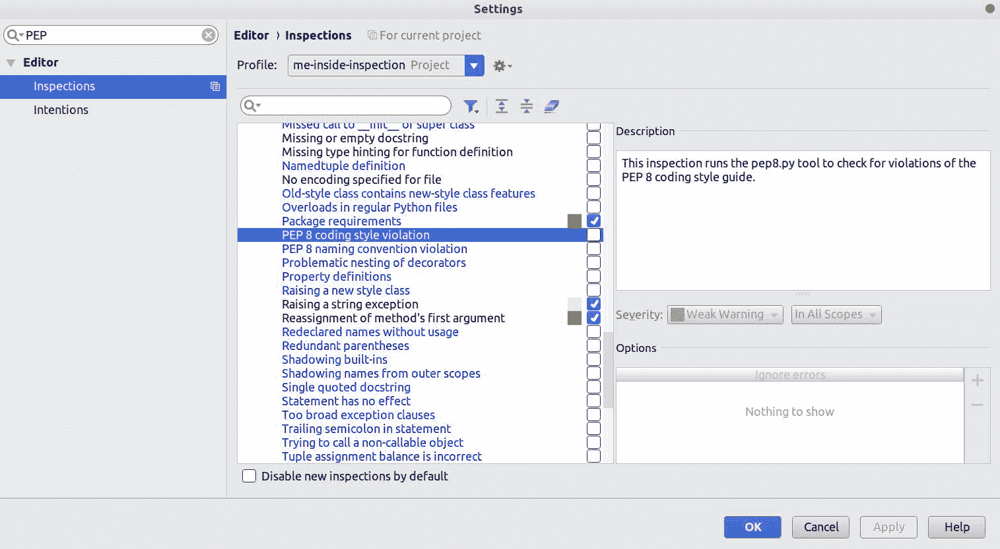

*   **库**：这就是 Python 的真正威力：库和包。Python 在许多领域都有广泛的库。任何 Python 开发人员都可以轻松地开发 Python 库，并将其在线上传，以便其他开发人员可以使用。图书馆被上传到一个名为 PyPI（[的网站 https://pypi.Python.org/pypi](https://pypi.python.org/pypi) ），并链接到 GitHub 存储库。当您想将库下载到您的 PC 上时，您可以使用一个名为`pip`的工具连接到 PyPI 并在本地下载。Cisco、Juniper 和 Arista 等网络供应商开发了库，以方便访问其平台。大多数供应商都在努力使他们的库易于使用，并且需要最少的安装和配置步骤来从设备中检索有用的信息。

*   **强大的**：Python 试图最小化达到最终结果所需的步骤数。例如，要使用 Java 打印 hello world，您需要以下代码块：


但是，在 Python 中，整个块都写在一行中进行打印，如以下屏幕截图所示：


将所有这些原因结合在一起，使得 Python 成为事实上的自动化标准，成为供应商自动化网络设备的首选。

# 网络自动化的未来

在很长一段时间里，网络自动化只意味着使用编程语言（如 Perl、TcL 或 Python）开发一个脚本，以便在不同的网络平台上执行任务。这种方法被称为**脚本驱动的网络自动化**。但随着网络变得更加复杂和更加面向服务，需要并开始出现新类型的自动化，例如：

*   **软件定义的网络自动化**：网络设备将只有一个转发平面，而控制平面是使用称为**SDN 控制器**的外部软件实现和创建的。这种方法的好处是，任何网络更改都将有一个单一的联系点，SDN 控制器可以通过实施良好的北向接口接受来自其他软件（如外部门户）的更改请求。

*   **高级编排**：这种方法需要一种称为 orchestrator 的软件，该软件与 SDN 控制器集成，并支持使用语言（如 YANG）创建网络服务模型，该语言从将在其上运行的底层设备中提取服务。此外，编排器还可以与 OpenStack 和 vCenter 等**虚拟基础设施管理器**（**VIM**）集成，以便将虚拟机作为网络服务建模的一部分进行管理。
*   **基于策略的网络**：在这种类型的自动化中，您描述了您希望在网络中拥有的内容，系统拥有所有细节，以确定如何在底层设备中实现它。这允许软件工程师和开发人员在网络中实现更改，并在声明性策略中描述其应用程序的需求。

# 网络实验室设置

现在，我们将开始在一个叫做 EVE-NG 的流行平台上建立我们的网络实验室。当然，您可以使用物理节点来实现拓扑，但是虚拟化环境为我们提供了一个隔离的沙盒环境来测试许多不同的配置，还提供了通过单击几下即可在拓扑中添加/删除节点的灵活性。此外，我们可以将多个快照添加到配置中，以便随时恢复到任何场景。

EVE-NG（以前称为 UNetLab）是网络仿真中最流行的选择之一。它支持来自不同供应商的各种虚拟化节点。还有另一个选项，即 GNS3，但是，正如我们将在本章和下一章中看到的，EVE-NG 提供了许多特性，使其成为网络建模的可靠选择。

EVE-NG 有三个版本：社区版、专业版和学习中心版。我们将使用社区版，因为它包含了我们在本书中需要的所有功能。

# 准备就绪–安装 EVE-NG

EVE-NG 社区版有两个选项，OVA 和 ISO。第一种选择是使用 OVA，它为您提供了所需的最低安装步骤，因为您已经拥有 VMware Player/Workstation/Fusion、VMware ESXi 或 Red Hat KVM。第二种选择是直接在裸机服务器上安装，而不使用虚拟机监控程序，这次使用的是 Ubuntu 16.06 LTS OS:


然而，ISO 选项需要 Linux 中的一些高级技能来准备机器本身并将安装存储库导入操作系统。

Oracle VirtualBox doesn't support the hardware acceleration needed by EVE-NG, so it's better to install it either in VMware or KVM.

首先，前往[http://www.eve-ng.net/index.php/downloads/eve-ng](http://www.eve-ng.net/index.php/downloads/eve-ng) 下载 EVE-NG 的最新版本，然后将其导入您的虚拟机监控程序。我将 8GB 内存和四个 VCPU 专用于创建的机器，但您可以为其添加额外的资源。在下一节中，我们将看到如何将下载的映像导入虚拟机监控程序并配置每个映像。

# 在 VMware 工作站上安装

在以下步骤中，我们将下载的 EVE-NG OVA 映像导入 VMware Workstation。基于 OVA 的映像包含用硬盘、CPU 和 RAM 值描述虚拟机的文件。导入这些数字后，您可以稍后修改这些数字：

1.  打开 VMware workstation，然后从文件中选择“打开”以导入 OVA。
2.  完成导入过程后，右键单击新创建的计算机并选择编辑设置。

3.  将处理器数量增加到 4 个，并将内存分配到 8GB（同样，如果您有足够的资源，您可以添加更多，但此设置对于我们的实验室来说已经足够了）。
4.  确保已启用“虚拟化英特尔 VT-x/EPT”或“AMD-V/RVI”复选框。此选项指示 VMware workstation 将虚拟化标志传递给来宾操作系统（嵌套虚拟化）：

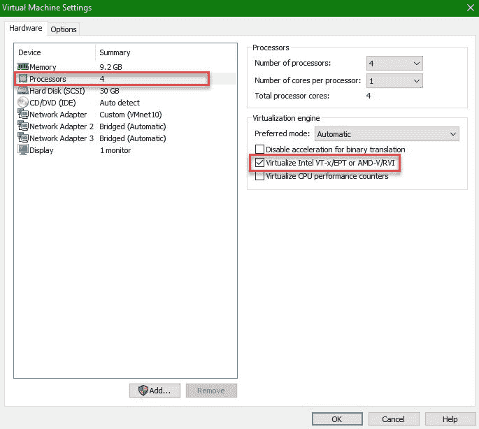

此外，建议通过向现有硬盘添加额外空间来扩展硬盘，以便有足够的空间承载来自供应商的多个映像：

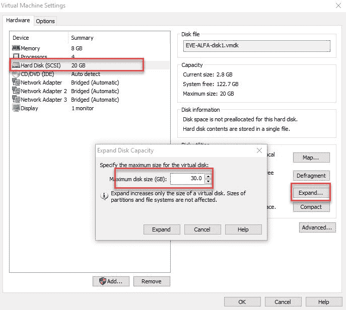

展开磁盘后将显示一条消息，指示操作已成功完成，您需要按照来宾操作系统中的某些步骤将新空间与旧空间合并。幸运的是，我们不需要这样做，因为 EVE-NG 将在系统引导期间将硬盘中发现的任何新空间与旧空间合并：


# 通过 VMware ESXi 进行安装

VMware ESXi 是直接在系统上运行的 1 型虚拟机监控程序的一个很好的示例。有时它们被称为裸机虚拟机监控程序，与第 2 类虚拟机监控程序相比，它们提供了许多功能，如 VMware workstation/Fusion 或 VirtualBox：

1.  打开 vSphere 客户端并连接到 ESXi 服务器
2.  从文件菜单中，选择部署 OVF 模板
3.  输入下载的 OVA 图像的路径，然后单击下一步：

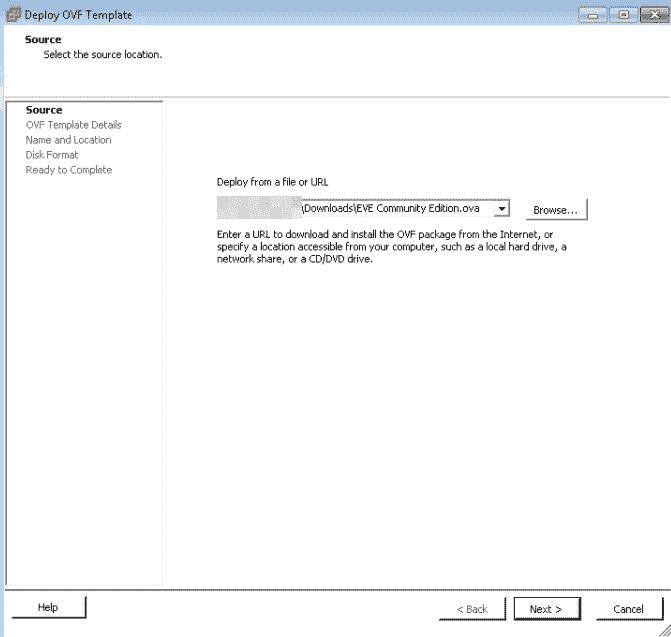

4.  接受虚拟机监控程序建议的所有默认设置，直到到达最后一页，准备完成，然后单击 Finish：

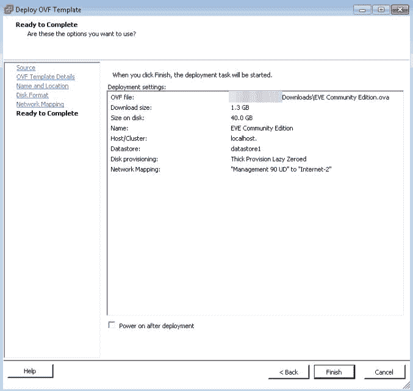

ESXi 将开始在虚拟机监控程序上部署映像，稍后您可以更改其设置并向其添加更多资源，就像我们以前在 VMware workstation 中所做的那样。

# 红帽 KVM 上的安装

您需要将下载的 OVA 图像转换为 KVM 支持的 QCOW2 格式。按照以下步骤将一种格式转换为另一种格式。我们需要一个名为`qemu-img`的特殊实用程序，可在`qemu-utils`包中使用：

1.  卸载下载的 OVA 以提取 VMDK 文件（图像的 HDD）：

```py
tar -xvf EVE\ Community\ Edition.ova
EVE Community Edition.ovf
EVE Community Edition.vmdk
```

2.  安装`qemu-utils`工具：

```py
sudo apt-get install qemu-utils
```

3.  现在，将 VMDK 转换为 QCOW2。完成转换可能需要几分钟：

```py
qemu-img convert -O qcow2 EVE\ Community\ Edition.vmdk eve-ng.qcow
```

最后，我们有了自己的`qcow2`文件，可以托管在 Red Hat KVM 中。打开 KVM 控制台并从菜单中选择导入现有磁盘映像选项：


然后，选择转换图像的路径并单击“前进”：

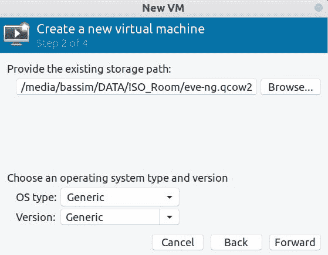

# 访问 EVE-NG

将映像导入虚拟机监控程序并启动后，系统将要求您提供一些信息以完成安装。首先，您将看到 EVE 徽标，表示机器已通过虚拟机监控程序成功导入，并准备启动阶段：

1.  提供将用于发送到 EVE 计算机的根密码。默认为`eve`：


2.  提供将在 Linux 中用作名称的主机名：

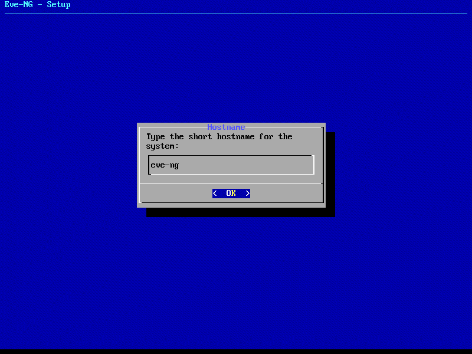

3.  提供计算机的域名：

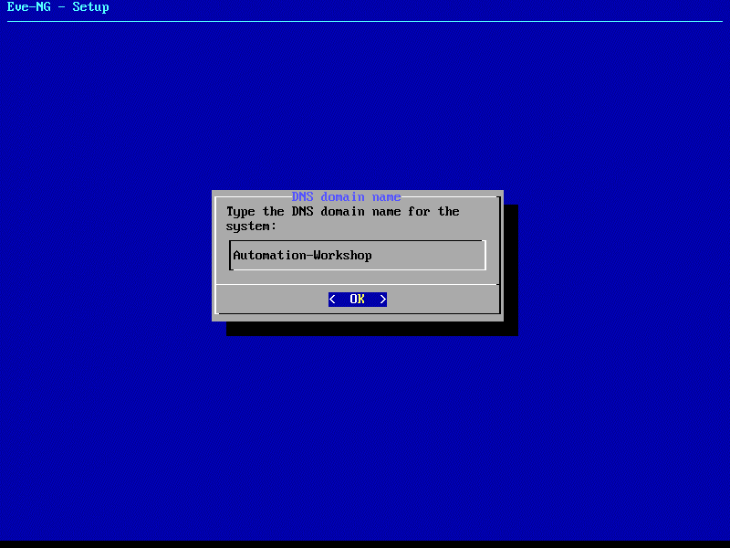

4.  选择使用静态方法配置网络。这将确保即使在机器重新启动后，给定的 IP 地址也将保持不变：

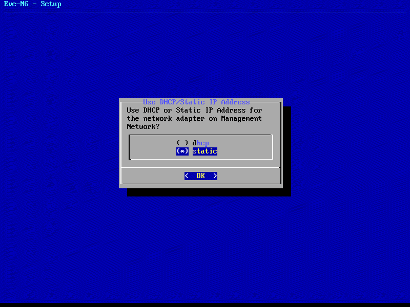

5.  最后，从您的网络可以访问的范围中提供静态 IP 地址。此 IP 将用于 SSH 到 EVE 并将供应商映像上载到存储库：

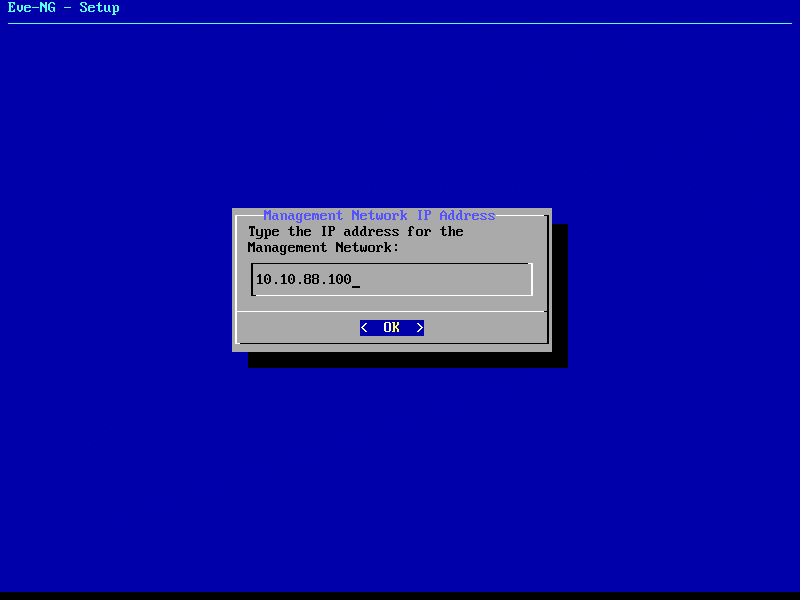

要访问 EVE-NG GUI，您需要打开浏览器并转到`http://<server_ip>`。请注意`server_IP`是我们在安装步骤中使用的：


The default username for the GUI is `admin` and the password is `eve`, while the default username for SSH is `root` and the password is what was provided during the installation steps.

# 安装 EVE-NG 客户端包

EVE-NG 随附的客户端包允许我们选择将 telnet 或 SSH 连接到设备（PuTTY 或 SecureCRT）时使用哪个应用程序，并设置 Wireshark 以在链接之间进行远程数据包捕获。此外，它还有助于处理基于 RDP 和 VNC 的图像。首先，您需要从[下载客户端包到您的电脑 http://eve-ng.net/index.php/downloads/windows-client-side-pack](http://eve-ng.net/index.php/downloads/windows-client-side-pack) ，然后将文件解压缩到`C:\Program Files\EVE-NG`：

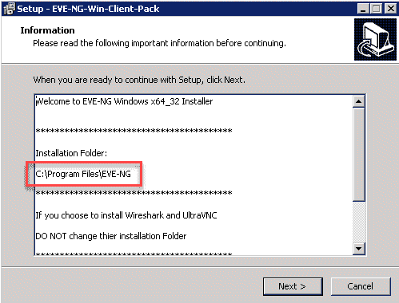

提取的文件包含许多用 Windows 批处理脚本（`.bat`编写的脚本，用于配置将用于访问 EVE-NG 的机器。您将找到配置默认 Telnet/SSH 客户端的脚本，以及用于 Wireshark 和 VNC 的另一个脚本。文件夹中还提供了软件源：

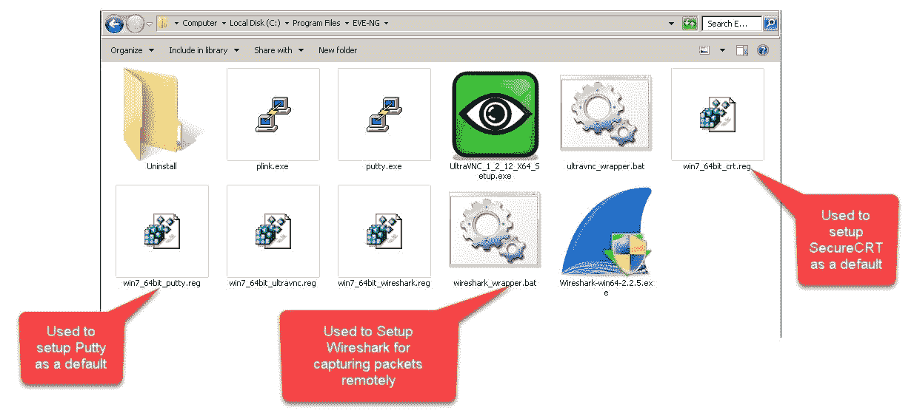

If you are using a Linux desktop such as Ubuntu or Fedora, then you could use this excellent project from GitHub to get the client pack: [https://github.com/SmartFinn/eve-ng-integration](https://github.com/SmartFinn/eve-ng-integration).

# 将网络映像加载到 EVE-NG

从供应商处获取的所有网络图像应上传至`/opt/unetlab/addons/qemu`。EVE-NG 支持基于 QEMU 的映像和动态映像，还支持 iOL（Linux 上的 iOS）。

当您从供应商处获得图像时，应在`/opt/unetlab/addons/qemu`内创建一个目录，并将图像上传到该目录；然后，您应该执行此脚本以修复上载图像的权限：

```py
/opt/unetlab/wrappers/unl_wrapper -a fixpermission
```

# 构建企业网络拓扑

在我们的基础实验室设置中，我们将模拟一个企业网络，该网络有四个交换机和一个路由器，充当外部网络的网关。以下是将用于每个节点的 IP 架构：

| **节点名称** | **IP** |
| 吉瓦 | `10.10.88.110` |
| 开关 1 | `10.10.88.111` |
| 开关 2 | `10.10.88.112` |
| 开关 3 | `10.10.88.113` |
| 开关 4 | `10.10.88.114` |

我们的 Python 脚本（或 Ansible playbook）将托管在连接到每个设备管理的外部 Windows PC 上。

# 添加新节点

我们将首先选择已上载到 EVE 的 IOSv 映像，并向拓扑添加四个交换机。在拓扑中的任何空白处单击鼠标右键，然后从名为“添加新对象”的下拉菜单中选择添加节点：


您应该看到两个蓝色的 Cisco 图像，表示它们已成功添加到 EVE-NG 库中的可用图像中，并映射到相应的模板。选择 Cisco vIOS L2 以添加 Cisco 交换机：


将要添加的节点数增加到 4，然后单击“确定”：

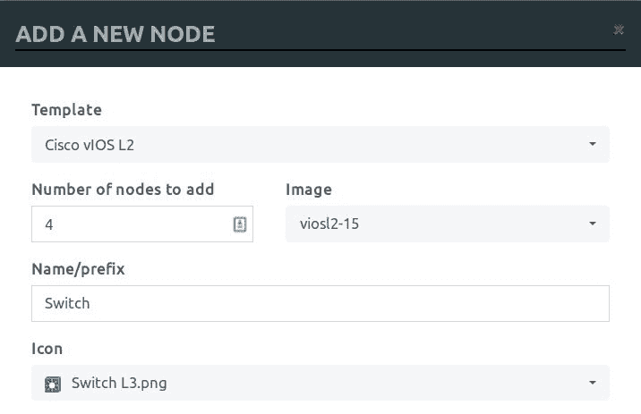

现在，您将看到拓扑中添加了四个交换机；再次重复此操作并添加路由器，但这次选择 Cisco vIOS：


# 将节点连接在一起

现在，在节点脱机时开始相互连接节点，并对每个节点重复此操作，直到完成拓扑内所有节点的连接；然后，启动实验室：

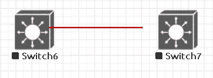

将 IP 地址和一些自定义形状添加到拓扑后的最终视图如下所示：

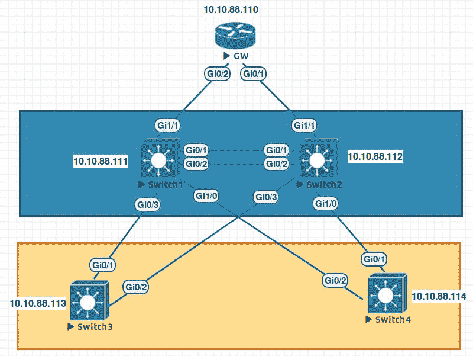

现在，我们的拓扑已经准备好，应该加载基本配置。我使用以下代码段作为任何 Cisco IOS 设备的配置基础，这些设备启用了 SSH 和 telnet 并配置了用于访问的用户名。请注意，有一些参数被`{{ }}`包围。当我们使用 Jinja2 模板生成黄金配置时，我们将在下一章中讨论它们，但现在，将它们分别替换为`hostname`和每个设备的管理 IP 地址：

```py
hostname {{hostname}}
int gig0/0
  no shutdown
  ip address {{mgmt_ip}} 255.255.255.0

aaa new-model
aaa session-id unique
aaa authentication login default local
aaa authorization exec default local none 

enable password access123
username admin password access123
no ip domain-lookup

lldp run

ip domain-name EnterpriseAutomation.net
ip ssh version 2
ip scp server enable
crypto key generate rsa general-keys modulus 1024

```

# 总结

在本章中，我们了解了当今可用的不同类型的网络自动化，以及为什么选择 Python 作为网络自动化的主要工具。此外，我们还学习了如何在不同的虚拟机监控程序和平台上安装 EVE-NG，如何提供初始配置，以及如何将网络映像添加到映像目录中。然后，我们添加了不同的节点并将它们连接在一起，以创建我们的网络企业实验室。

在下一章中，我们将开始构建 Python 脚本，使用不同的 Python 库（如 telnetlib、Netmiko、Paramiko 和 Pexpect）自动化拓扑中的不同任务。