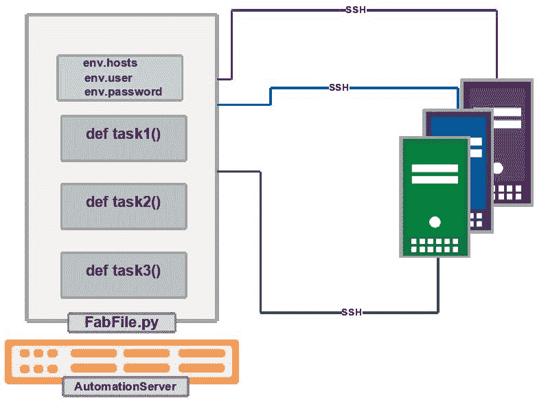
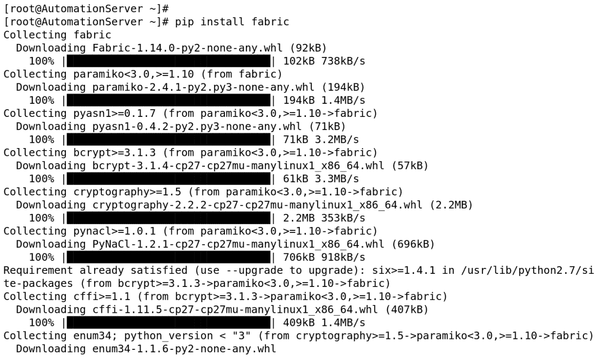
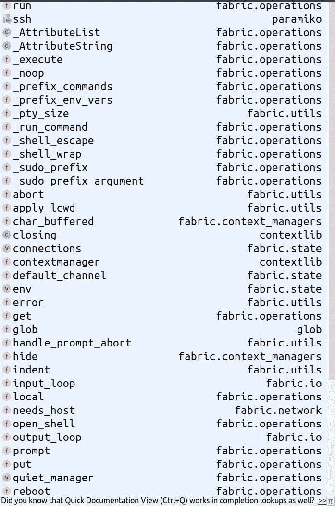

# 十、使用`Fabric`运行系统管理任务

在上一章中，我们使用`subprocess`模块在托管 Python 脚本的机器内运行并生成一个系统进程，并将输出返回给终端。然而，许多自动化任务需要访问远程服务器以执行命令，这不容易使用子进程来完成。使用另一个 Python 模块`Fabric`后，这就变得小菜一碟了。该库连接到远程主机并执行不同的任务，例如上载和下载文件、使用特定用户 ID 运行命令以及提示用户输入。`Fabric`Python 模块是一个健壮的工具，用于从一个中心点管理数十台 Linux 机器。

本章将介绍以下主题：

*   什么是`Fabric`？
*   执行第一个结构文件
*   其他有用的`Fabric`特征

# 技术要求

应在您的环境中安装并提供以下工具：

*   Python 2.7.1x。

*   PyCharm 社区或专业版。
*   EVE-NG 拓扑。关于如何安装和配置系统服务器，请参见第 8 章*准备实验室环境*。

您可以在以下 GitHub URL 上找到本章中开发的完整脚本：[https://github.com/TheNetworker/EnterpriseAutomation.git](https://github.com/TheNetworker/EnterpriseAutomation.git) 。

# 什么是`Fabric`？

`Fabric`（[http://www.fabfile.org/](http://www.fabfile.org/) 是一个高级 Python 库，用于连接远程服务器（通过 paramiko 库）并在其上执行预定义任务。它在承载结构模块的机器上运行一个名为**fab**的工具。该工具将查找一个`fabfile.py`文件，该文件位于运行该工具的同一目录中。`fabfile.py`文件包含您的任务，定义为从命令行调用的 Python 函数，用于在服务器上开始执行。Fabric 任务本身只是普通的 Python 函数，但它们包含用于在远程服务器上执行命令的特殊方法。另外，在`fabfile.py`的开头，您需要定义一些环境变量，如远程主机、用户名、密码以及执行过程中需要的任何其他变量：



# 安装

结构需要 Python2.5 到 2.7。您可以使用`pip`安装 Fabric 及其所有依赖项，也可以使用系统包管理器，如`yum`或`apt`。在这两种情况下，`fab`实用程序都已准备就绪，并可从操作系统执行。

要使用`pip`安装`fabric`，请在自动化服务器上运行以下命令：

```py
pip install fabric
```



请注意，Fabric 需要`paramiko`，这是一个流行的 Python 库，用于建立 SSH 连接。

您可以通过两个步骤验证结构安装。首先，确保系统中有可用的`fab`命令：

```py
[root@AutomationServer ~]# which fab
/usr/bin/fab
```

验证的第二步是打开 Python 并尝试导入`fabric`库。如果没有引发错误，则结构已成功安装：

```py
[root@AutomationServer ~]# python
Python 2.7.5 (default, Aug  4 2017, 00:39:18) 
[GCC 4.8.5 20150623 (Red Hat 4.8.5-16)] on linux2
Type "help", "copyright", "credits" or "license" for more information.
>>> from fabric.api import *
>>>

```

# `Fabric`操作

`fabric`工具中有许多操作可用。这些操作在 fabfile 中的任务中充当一个函数（稍后将有更多关于任务的内容），但以下是`fabric`库中最重要操作的摘要。

# 使用运行操作

Fabric 中`run`操作的语法如下：

```py
run(command, shell=True, pty=True, combine_stderr=True, quiet=False, warn_only=False, stdout=None, stderr=None)
```

这将在远程主机上执行该命令，`shell`参数控制是否在执行前创建 shell（如`/bin/sh`）（子进程中也存在相同的参数）。

执行命令后，Fabric 将根据命令输出填充`.succeeded`或`.failed`。您可以通过调用以下命令来检查命令是否成功：

```py
def run_ops():
    output = run("hostname")

```

# 使用 get 操作

Fabric`get`操作的语法如下：

```py
get(remote_path, local_path)
```

这将使用`rsync`或`scp`将文件从远程主机下载到运行`fabfile`的机器。这通常在需要将日志文件收集到服务器时使用，例如：

```py
def get_ops():
    try:
        get("/var/log/messages","/root/")
    except:
        pass
```

# 使用 put 操作

Fabric`put`操作的语法如下：

```py
put(local_path, remote_path, use_sudo=False, mirror_local_mode=False, mode=None)
```

此操作将文件从运行`fabfile`（本地）的机器上载到远程主机。使用`use_sudo`将解决上传到根目录时的权限问题。此外，您可以保留本地和远程服务器上的当前文件权限，也可以设置新权限：

```py
def put_ops():
    try:
        put("/root/VeryImportantFile.txt","/root/")
    except:
        pass
```

# 使用 sudo 操作

Fabric`sudo`操作的语法如下：

```py
sudo(command, shell=True, pty=True, combine_stderr=True, user=None, quiet=False, warn_only=False, stdout=None, stderr=None, group=None)
```

这个操作可以被看作是`run()`命令的另一个包装。但是，`sudo`操作将默认使用 root 用户名运行该命令，而不考虑用于执行`fabfile`的用户名。它还包含一个用户参数，可用于使用其他用户名运行命令。此外，`user`参数使用特定 UID 执行命令，`group`参数定义 GID：

```py
def sudo_ops():
    sudo("whoami") #it should print the root even if you use another account
```

# 使用提示操作

Fabric`prompt`操作的语法如下：

```py
prompt(text, key=None, default='', validate=None)
```

用户可以通过`prompt`操作为任务提供特定的值，输入将存储在变量中，供任务使用。请注意，`fabfile`内的每台主机都会提示您：

```py
def prompt_ops():
    prompt("please supply release name", default="7.4.1708")
```

# 使用重新启动操作

Fabric`reboot`操作的语法如下：

```py
reboot(wait=120)
```

这是一个默认情况下重新启动主机的简单操作。结构将等待 120 秒，然后再尝试重新连接，但您可以使用`wait`参数将此值更改为另一个值：

```py
def reboot_ops():
    reboot(wait=60, use_sudo=True)

```

有关其他受支持操作的完整列表，请查看[http://docs.fabfile.org/en/1.14/api/core/operations.html](http://docs.fabfile.org/en/1.14/api/core/operations.html) 。您也可以直接从 PyCharm 中检查它们，方法是查看键入*Ctrl+spacebar*时弹出的所有自动完成功能。从`fabric.operations`导入<*ctrl*+*空格*>在`fabric.operations`下：



# 执行第一个结构文件

我们现在知道了操作是如何工作的，所以我们将把它放在`fabfile`中，并创建一个可以与远程机器一起工作的全自动脚本。`fabfile`的第一步是导入所需的类。其中大部分位于`fabric.api`，因此我们将在全球范围内将它们全部导入到我们的 Python 脚本中：

```py
from fabric.api import *
```

下一部分是定义远程机器 IP 地址、用户名和密码。在我们的环境中，我们有两台机器（除了自动化服务器之外），分别运行 Ubuntu 16.04 和 CentOS 7.4，详细信息如下：

| **机型** | **IP 地址** | **用户名** | **密码** |
| Ubuntu 16.04 | `10.10.10.140` | `root` | `access123` |
| CentOS 7.4 | `10.10.10.193` | `root` | `access123` |

我们将在 Python 脚本中包含它们，如以下代码段所示：

```py
env.hosts = [
    '10.10.10.140',  # ubuntu machine
    '10.10.10.193',  # CentOS machine
]

env.user = "root"
env.password = "access123"

```

请注意，我们使用名为`env`的变量，该变量从`_AttributeDict`类继承而来。在这个变量中，我们可以通过 SSH 连接设置用户名和密码。您也可以通过设置`env.use_ssh_config=True`来使用`.ssh`目录中存储的 SSH 密钥；Fabric 将使用密钥对连接进行身份验证。

最后一步是将任务定义为 Python 函数。任务可以使用前面的操作来执行命令。

以下是完整的脚本：

```py
from fabric.api import *

env.hosts = [
    '10.10.10.140',  # ubuntu machine
    '10.10.10.193',  # CentOS machine
]

env.user = "root"
env.password = "access123"

def detect_host_type():
    output = run("uname -s")
    if output.failed:
        print("something wrong happen, please check the logs")
    elif output.succeeded:
        print("command executed successfully")

def list_all_files_in_directory():
    directory = prompt("please enter full path to the directory to list", default="/root")
    sudo("cd {0} ; ls -htlr".format(directory))

def main_tasks():
    detect_host_type()
    list_all_files_in_directory()
```

在前面的示例中，以下内容适用：

*   我们定义了两个任务。第一个将执行`uname -s`命令并返回输出，然后验证该命令是否成功执行。任务使用`run()`操作来完成它。
*   第二个任务将使用两个操作：`prompt()`和`sudo()`。第一个操作将要求用户输入目录的完整路径，而第二个操作将列出目录中的所有内容。
*   最后一个任务`main_tasks()`实际上将把前面两个方法组合成一个任务，这样我们就可以从命令行调用它。

为了运行脚本，我们将文件上传到自动化服务器，并使用`fab`实用程序运行它：

```py
fab -f </full/path/to/fabfile>.py <task_name>
```

The `-f` switch in the previous command is not mandatory if your filename is `fabfile.py`. If it is not, you will need to provide the name to the `fab` utility. Also, `fabfile` should be in the current directory; otherwise, you will need to provide the full path. Now we will run the `fabfile` by executing the following command:

```py
fab -f fabfile_first.py main_tasks
```

将执行第一个任务，并将输出返回到终端：

```py
[10.10.10.140] Executing task 'main_tasks'
[10.10.10.140] run: uname -s
[10.10.10.140] out: Linux
[10.10.10.140] out: 

command executed successfully 
```

现在我们进入`/var/log/`列表内容：

```py

please enter full path to the directory to list [/root] /var/log/
[10.10.10.140] sudo: cd /var/log/ ; ls -htlr
[10.10.10.140] out: total 1.7M
[10.10.10.140] out: drwxr-xr-x 2 root   root 4.0K Dec  7 23:54 lxd
[10.10.10.140] out: drwxr-xr-x 2 root   root 4.0K Dec 11 15:47 sysstat
[10.10.10.140] out: drwxr-xr-x 2 root   root 4.0K Feb 22 18:24 dist-upgrade
[10.10.10.140] out: -rw------- 1 root   utmp    0 Feb 28 20:23 btmp
[10.10.10.140] out: -rw-r----- 1 root   adm    31 Feb 28 20:24 dmesg
[10.10.10.140] out: -rw-r--r-- 1 root   root  57K Feb 28 20:24 bootstrap.log
[10.10.10.140] out: drwxr-xr-x 2 root   root 4.0K Apr  4 08:00 fsck
[10.10.10.140] out: drwxr-xr-x 2 root   root 4.0K Apr  4 08:01 apt
[10.10.10.140] out: -rw-r--r-- 1 root   root  32K Apr  4 08:09 faillog
[10.10.10.140] out: drwxr-xr-x 3 root   root 4.0K Apr  4 08:09 installer

command executed successfully
```

如果您需要列出 CentOS 机器中`network-scripts`目录下的配置文件，同样适用：

```py
 please enter full path to the directory to list [/root] /etc/sysconfig/network-scripts/ 
[10.10.10.193] sudo: cd /etc/sysconfig/network-scripts/ ; ls -htlr
[10.10.10.193] out: total 232K
[10.10.10.193] out: -rwxr-xr-x. 1 root root 1.9K Apr 15  2016 ifup-TeamPort
[10.10.10.193] out: -rwxr-xr-x. 1 root root 1.8K Apr 15  2016 ifup-Team
[10.10.10.193] out: -rwxr-xr-x. 1 root root 1.6K Apr 15  2016 ifdown-TeamPort
[10.10.10.193] out: -rw-r--r--. 1 root root  31K May  3  2017 network-functions-ipv6
[10.10.10.193] out: -rw-r--r--. 1 root root  19K May  3  2017 network-functions
[10.10.10.193] out: -rwxr-xr-x. 1 root root 5.3K May  3  2017 init.ipv6-global
[10.10.10.193] out: -rwxr-xr-x. 1 root root 1.8K May  3  2017 ifup-wireless
[10.10.10.193] out: -rwxr-xr-x. 1 root root 2.7K May  3  2017 ifup-tunnel
[10.10.10.193] out: -rwxr-xr-x. 1 root root 3.3K May  3  2017 ifup-sit
[10.10.10.193] out: -rwxr-xr-x. 1 root root 2.0K May  3  2017 ifup-routes
[10.10.10.193] out: -rwxr-xr-x. 1 root root 4.1K May  3  2017 ifup-ppp
[10.10.10.193] out: -rwxr-xr-x. 1 root root 3.4K May  3  2017 ifup-post
[10.10.10.193] out: -rwxr-xr-x. 1 root root 1.1K May  3  2017 ifup-plusb

<***output omitted for brevity>***
```

最后，Fabric 将断开与两台机器的连接：

```py
[10.10.10.193] out: 

Done.
Disconnecting from 10.10.10.140... done.
Disconnecting from 10.10.10.193... done.
```

# 更多关于 fab 工具的信息

`fab`工具本身支持多种操作。可用于列出`fabfile`中的不同任务。也可以在执行过程中设置`fab`环境。例如，您可以使用`-H`或`--hosts`开关定义将在其上运行命令的主机，而无需在`fabfile`中指定。这实际上是在执行期间在`fabfile`内设置`env.hosts`变量：

```py
fab -H srv1,srv2
```

另一方面，您可以使用`fab`工具定义要运行的命令。这类似于 Ansible 即席模式（我们将在[第 13 章](13.html#506UG0-9cfcdc5beecd470bbeda046372f0337f)、*Ansible for System Administration*中详细讨论）：

```py
fab -H srv1,srv2 -- ifconfig -a
```

如果您不想在`fabfile`脚本中以明文形式存储密码，那么您有两个选择。第一种方法是使用 SSH 标识文件（`private-key`和`-i`选项，在连接过程中加载该文件。

另一个选项是通过使用`-I`选项，强制 Fabric 在连接到远程机器之前提示您输入会话密码。

Note that this option will overwrite the `env.password` parameter, if specified inside `fabfile`.

`-D`开关将禁用已知主机，并强制结构不从`.ssh`目录加载`known_hosts`文件。您可以使用`-r`或`--reject-unknown-hosts`选项使结构拒绝连接到`known_hosts`文件中未定义的主机。

此外，您还可以使用`-l`或`--list`列出 fabfile 中所有支持的任务，并将 fabfile 名称提供给`fab`工具。例如，将其应用于上一个脚本将生成以下输出：

```py
# fab -f fabfile_first.py -l
Available commands:

    detect_host_type
    list_all_files_in_directory
    main_tasks
```

You can see all of the available options and arguments for the `fab` command line with the `-h` switch, or at [http://docs.fabfile.org/en/1.14/usage/fab.html](http://docs.fabfile.org/en/1.14/usage/fab.html).

# 使用结构发现系统运行状况

在这个用例中，我们将利用 Fabric 开发一个脚本，在远程机器上执行多个命令。脚本的目标是收集两种类型的输出：`discovery`命令和`health`命令。`discovery`命令收集正常运行时间、主机名、内核版本以及私有和公共 IP 地址，而`health`命令收集使用的内存、CPU 利用率、衍生进程数和磁盘使用率。我们将设计`fabfile`，以便我们可以扩展脚本并向其添加更多命令：

```py
#!/usr/bin/python
__author__ = "Bassim Aly"
__EMAIL__ = "basim.alyy@gmail.com"

from fabric.api import *
from fabric.context_managers import *
from pprint import pprint

env.hosts = [
    '10.10.10.140',  # Ubuntu Machine
    '10.10.10.193',  # CentOS Machine
]

env.user = "root"
env.password = "access123"

def get_system_health():

    discovery_commands = {
        "uptime": "uptime | awk '{print $3,$4}'",
        "hostname": "hostname",
        "kernel_release": "uname -r",
        "architecture": "uname -m",
        "internal_ip": "hostname -I",
        "external_ip": "curl -s ipecho.net/plain;echo",

    }
    health_commands = {
        "used_memory": "free  | awk '{print $3}' | grep -v free | head -n1",
        "free_memory": "free  | awk '{print $4}' | grep -v shared | head -n1",
        "cpu_usr_percentage": "mpstat | grep -A 1 '%usr' | tail -n1 | awk '{print $4}'",
        "number_of_process": "ps -A --no-headers | wc -l",
        "logged_users": "who",
        "top_load_average": "top -n 1 -b | grep 'load average:' | awk '{print $10 $11 $12}'",
        "disk_usage": "df -h| egrep 'Filesystem|/dev/sda*|nvme*'"

    }

    tasks = [discovery_commands,health_commands]

    for task in tasks:
        for operation,command in task.iteritems():
            print("============================={0}=============================".format(operation))
            output = run(command)
```

注意，我们创建了两个字典：`discover_commands`和`health_commands`。它们中的每一个都以键值对的形式包含 Linux 命令。键表示操作，而值表示实际的 Linux 命令。然后，我们创建了一个`tasks`列表来对这两个词典进行分组。

最后，我们创建了一个嵌套的`for`循环。外部循环用于迭代列表项。内部的`for`循环是迭代键值对。使用 Fabric`run()`操作向远程主机发送命令：

```py
# fab -f fabfile_discoveryAndHealth.py get_system_health
[10.10.10.140] Executing task 'get_system_health'
=============================uptime=============================
[10.10.10.140] run: uptime | awk '{print $3,$4}'
[10.10.10.140] out: 3:26, 2
[10.10.10.140] out: 

=============================kernel_release=============================
[10.10.10.140] run: uname -r
[10.10.10.140] out: 4.4.0-116-generic
[10.10.10.140] out: 

=============================external_ip=============================
[10.10.10.140] run: curl -s ipecho.net/plain;echo
[10.10.10.140] out: <Author_Masked_The_Output_For_Privacy>
[10.10.10.140] out: 

=============================hostname=============================
[10.10.10.140] run: hostname
[10.10.10.140] out: ubuntu-machine
[10.10.10.140] out: 

=============================internal_ip=============================
[10.10.10.140] run: hostname -I
[10.10.10.140] out: 10.10.10.140 
[10.10.10.140] out: 

=============================architecture=============================
[10.10.10.140] run: uname -m
[10.10.10.140] out: x86_64
[10.10.10.140] out: 

=============================disk_usage=============================
[10.10.10.140] run: df -h| egrep 'Filesystem|/dev/sda*|nvme*'
[10.10.10.140] out: Filesystem                            Size  Used Avail Use% Mounted on
[10.10.10.140] out: /dev/sda1                             472M   58M  390M  13% /boot
[10.10.10.140] out: 

=============================used_memory=============================
[10.10.10.140] run: free  | awk '{print $3}' | grep -v free | head -n1
[10.10.10.140] out: 75416
[10.10.10.140] out: 

=============================logged_users=============================
[10.10.10.140] run: who
[10.10.10.140] out: root     pts/0        2018-04-08 23:36 (10.10.10.130)
[10.10.10.140] out: root     pts/1        2018-04-08 21:23 (10.10.10.1)
[10.10.10.140] out: 

=============================top_load_average=============================
[10.10.10.140] run: top -n 1 -b | grep 'load average:' | awk '{print $10 $11 $12}'
[10.10.10.140] out: 0.16,0.03,0.01
[10.10.10.140] out: 

=============================cpu_usr_percentage=============================
[10.10.10.140] run: mpstat | grep -A 1 '%usr' | tail -n1 | awk '{print $4}'
[10.10.10.140] out: 0.02
[10.10.10.140] out: 

=============================number_of_process=============================
[10.10.10.140] run: ps -A --no-headers | wc -l
[10.10.10.140] out: 131
[10.10.10.140] out: 

=============================free_memory=============================
[10.10.10.140] run: free  | awk '{print $4}' | grep -v shared | head -n1
[10.10.10.140] out: 5869268
[10.10.10.140] out: 

```

同样的任务（`get_system_health`也将在第二台服务器上执行，并将输出返回给终端：

```py
[10.10.10.193] Executing task 'get_system_health'
=============================uptime=============================
[10.10.10.193] run: uptime | awk '{print $3,$4}'
[10.10.10.193] out: 3:26, 2
[10.10.10.193] out: 

=============================kernel_release=============================
[10.10.10.193] run: uname -r
[10.10.10.193] out: 3.10.0-693.el7.x86_64
[10.10.10.193] out: 

=============================external_ip=============================
[10.10.10.193] run: curl -s ipecho.net/plain;echo
[10.10.10.193] out: <Author_Masked_The_Output_For_Privacy>
[10.10.10.193] out: 

=============================hostname=============================
[10.10.10.193] run: hostname
[10.10.10.193] out: controller329
[10.10.10.193] out: 

=============================internal_ip=============================
[10.10.10.193] run: hostname -I
[10.10.10.193] out: 10.10.10.193 
[10.10.10.193] out: 

=============================architecture=============================
[10.10.10.193] run: uname -m
[10.10.10.193] out: x86_64
[10.10.10.193] out: 

=============================disk_usage=============================
[10.10.10.193] run: df -h| egrep 'Filesystem|/dev/sda*|nvme*'
[10.10.10.193] out: Filesystem               Size  Used Avail Use% Mounted on
[10.10.10.193] out: /dev/sda1                488M   93M  360M  21% /boot
[10.10.10.193] out: 

=============================used_memory=============================
[10.10.10.193] run: free  | awk '{print $3}' | grep -v free | head -n1
[10.10.10.193] out: 287048
[10.10.10.193] out: 

=============================logged_users=============================
[10.10.10.193] run: who
[10.10.10.193] out: root     pts/0        2018-04-08 23:36 (10.10.10.130)
[10.10.10.193] out: root     pts/1        2018-04-08 21:23 (10.10.10.1)
[10.10.10.193] out: 

=============================top_load_average=============================
[10.10.10.193] run: top -n 1 -b | grep 'load average:' | awk '{print $10 $11 $12}'
[10.10.10.193] out: 0.00,0.01,0.02
[10.10.10.193] out: 

=============================cpu_usr_percentage=============================
[10.10.10.193] run: mpstat | grep -A 1 '%usr' | tail -n1 | awk '{print $4}'
[10.10.10.193] out: 0.00
[10.10.10.193] out: 

=============================number_of_process=============================
[10.10.10.193] run: ps -A --no-headers | wc -l
[10.10.10.193] out: 190
[10.10.10.193] out: 

=============================free_memory=============================
[10.10.10.193] run: free  | awk '{print $4}' | grep -v shared | head -n1
[10.10.10.193] out: 32524912
[10.10.10.193] out: 
```

最后，`fabric`模块将在执行所有任务后终止已建立的 SSH 会话并断开与两台机器的连接：

```py
Disconnecting from 10.10.10.140... done.
Disconnecting from 10.10.10.193... done.
```

请注意，我们可以重新设计前面的脚本，将`discovery_commands`和`health_commands`设置为 Fabric 任务，然后将它们包含在`get_system_health()`中。当我们执行`fab`命令时，我们会调用`get_system_health()`，它将执行另外两个函数；我们将得到与以前相同的输出。以下是经过修改的示例脚本：

```py
#!/usr/bin/python
__author__ = "Bassim Aly"
__EMAIL__ = "basim.alyy@gmail.com"

from fabric.api import *
from fabric.context_managers import *
from pprint import pprint

env.hosts = [
    '10.10.10.140',  # Ubuntu Machine
    '10.10.10.193',  # CentOS Machine
]

env.user = "root"
env.password = "access123"

def discovery_commands():
    discovery_commands = {
        "uptime": "uptime | awk '{print $3,$4}'",
        "hostname": "hostname",
        "kernel_release": "uname -r",
        "architecture": "uname -m",
        "internal_ip": "hostname -I",
        "external_ip": "curl -s ipecho.net/plain;echo",

    }
    for operation, command in discovery_commands.iteritems():
        print("============================={0}=============================".format(operation))
        output = run(command)

def health_commands():
    health_commands = {
        "used_memory": "free  | awk '{print $3}' | grep -v free | head -n1",
        "free_memory": "free  | awk '{print $4}' | grep -v shared | head -n1",
        "cpu_usr_percentage": "mpstat | grep -A 1 '%usr' | tail -n1 | awk '{print $4}'",
        "number_of_process": "ps -A --no-headers | wc -l",
        "logged_users": "who",
        "top_load_average": "top -n 1 -b | grep 'load average:' | awk '{print $10 $11 $12}'",
        "disk_usage": "df -h| egrep 'Filesystem|/dev/sda*|nvme*'"

    }
    for operation, command in health_commands.iteritems():
        print("============================={0}=============================".format(operation))
        output = run(command)

def get_system_health():
    discovery_commands()
    health_commands()
```

# `Fabric`中的其他有用功能

Fabric 还具有其他有用的功能，例如角色和上下文管理器。

# 结构角色

Fabric 可以为主机定义角色，并且只运行角色成员的任务。例如，我们可能有一些数据库服务器，需要在这些服务器上验证 MySql 服务是否启动，以及其他 web 服务器，需要在这些服务器上验证 Apache 服务是否启动。我们可以将这些主机分组为角色，并根据这些角色执行功能：

```py
#!/usr/bin/python
__author__ = "Bassim Aly"
__EMAIL__ = "basim.alyy@gmail.com"

from fabric.api import *

env.hosts = [
    '10.10.10.140',  # ubuntu machine
    '10.10.10.193',  # CentOS machine
    '10.10.10.130',  
]

env.roledefs = {
    'webapps': ['10.10.10.140','10.10.10.193'],
    'databases': ['10.10.10.130'],
}

env.user = "root"
env.password = "access123"

@roles('databases')
def validate_mysql():
    output = run("systemctl status mariadb")

@roles('webapps')
def validate_apache():
    output = run("systemctl status httpd")

```

在上例中，我们在设置`env.roledef`时使用了`Fabric`装饰器`roles`（从`fabric.api`导入）。然后，我们将为每个服务器分配 webapp 或 databases 角色（将角色分配视为标记服务器）。这将使我们能够灵活地在仅具有数据库角色的服务器上执行`validate_mysql`功能：

```py
# fab -f fabfile_roles.py validate_mysql:roles=databases
[10.10.10.130] Executing task 'validate_mysql'
[10.10.10.130] run: systemctl status mariadb
[10.10.10.130] out: ● mariadb.service - MariaDB database server
[10.10.10.130] out:    Loaded: loaded (/usr/lib/systemd/system/mariadb.service; enabled; vendor preset: disabled)
[10.10.10.130] out:    Active: active (running) since Sat 2018-04-07 19:47:35 EET; 1 day 2h ago
<output omitted>
```

# 结构上下文管理器

在我们的第一个 Fabric 脚本`fabfile_first.py`中，我们有一个任务提示用户输入目录，然后切换到目录并打印其内容。这是通过使用`;`完成的，它将两个 Linux 命令附加在一起。但是，在其他操作系统上运行相同的操作并不总是有效的。这就是结构上下文管理器的作用所在。

上下文管理器在执行命令时维护目录状态。它通常通过使用`with-statement`与 Python 一起运行，并且在块内部，您可以编写前面的任何构造操作。让我们看一个例子来解释这个想法：

```py
from fabric.api import *
from fabric.context_managers import *

env.hosts = [
    '10.10.10.140',  # ubuntu machine
    '10.10.10.193',  # CentOS machine
]

env.user = "root"
env.password = "access123"

def list_directory():
    with cd("/var/log"):
        run("ls")
```

在前面的示例中，首先，我们全局导入了`fabric.context_managers`中的所有内容；然后，我们使用`cd`上下文管理器切换到特定目录。我们使用 Fabric`run()`操作在该目录上执行`ls`。这与在 SSH 会话上编写`cd /var/log ; ls`相同，但它提供了一种更具 Python 风格的方法来开发代码。

`with`语句可以嵌套。例如，我们可以用以下代码重写前面的代码：

```py
def list_directory_nested():
    with cd("/var/"):
        with cd("log"):
            run("ls")
```

另一个有用的上下文管理器是**本地更改目录**（**LCD**）。这与上例中的`cd`上下文管理器相同，但它在运行`fabfile`的本地机器上工作。我们可以使用它将上下文更改为特定目录（例如，向远程计算机上载或下载文件，然后自动更改回执行目录）：

```py
def uploading_file():
    with lcd("/root/"):
        put("VeryImportantFile.txt")
```

`prefix`上下文管理器将接受一个命令作为输入，并在`with`块内的任何其他命令之前执行该命令。例如，在运行每个命令以设置虚拟环境之前，您可以获取一个文件或 Python 虚拟`env`包装器脚本的源代码：

```py
def prefixing_commands():
    with prefix("source ~/env/bin/activate"):
        sudo('pip install wheel')
        sudo("pip install -r requirements.txt")
        sudo("python manage.py migrate")
```

这实际上相当于在 Linux shell 中编写以下命令：

```py
source ~/env/bin/activate && pip install wheel
source ~/env/bin/activate && pip install -r requirements.txt
source ~/env/bin/activate && python manage.py migrate
```

最后一个上下文管理器是`shell_env(new_path, behavior='append')`，它可以改变包装命令的 shell 环境变量；因此，该块内的任何调用都将考虑修改后的路径：

```py
def change_shell_env():
    with shell_env(test1='val1', test2='val2', test3='val3'):
        run("echo $test1") #This command run on remote host
        run("echo $test2")
        run("echo $test3")
        local("echo $test1") #This command run on local host
```

Note that after the operation is done, Fabric will restore the old environments back to the original one.

# 总结

Fabric 是一个神奇而强大的工具，通常在远程机器中自动执行任务。它与 Python 脚本很好地集成，提供了对 SSH 套件的轻松访问。您可以为不同的任务开发许多 fab 文件，并将它们集成在一起，以创建一个自动化工作流，其中包括部署、重新启动和停止服务器或进程。

在下一章中，我们将学习收集数据和生成用于系统监控的定期报告。