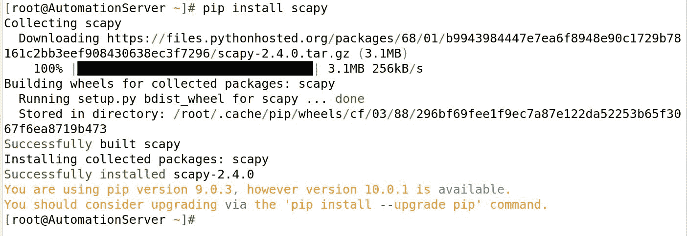
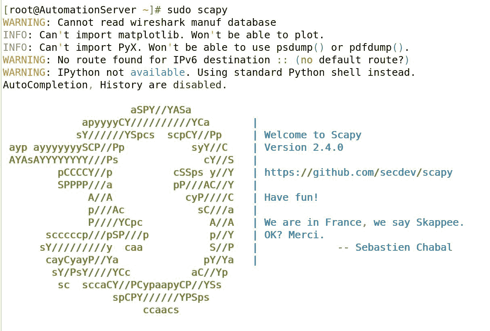
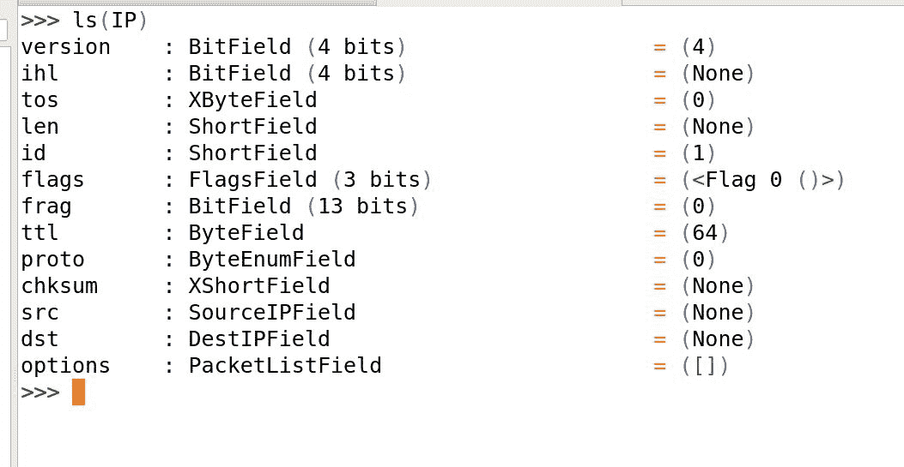
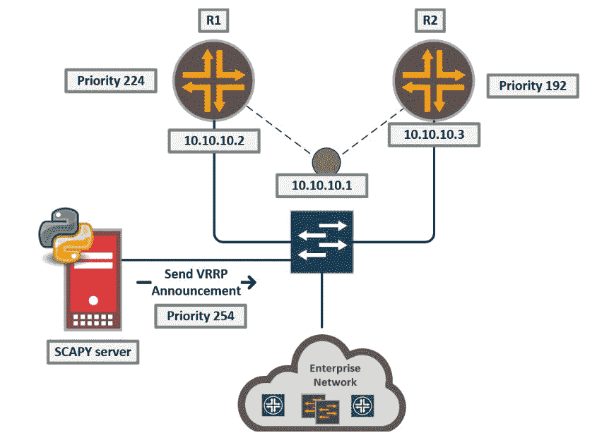
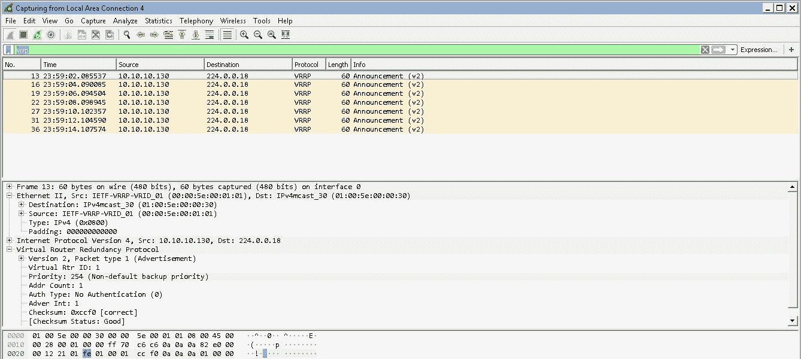
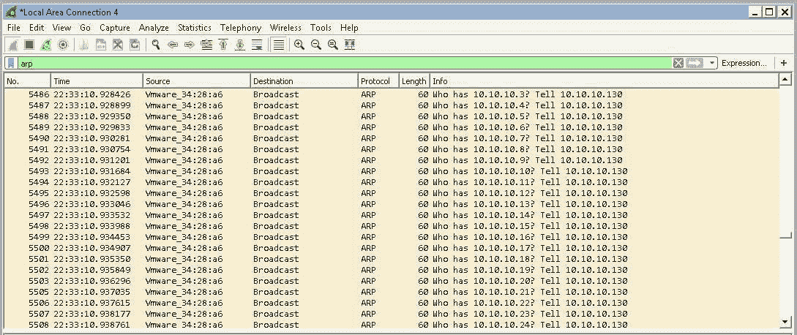
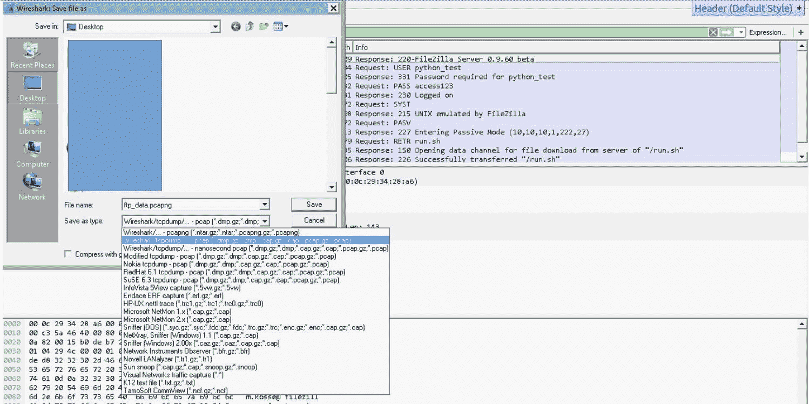
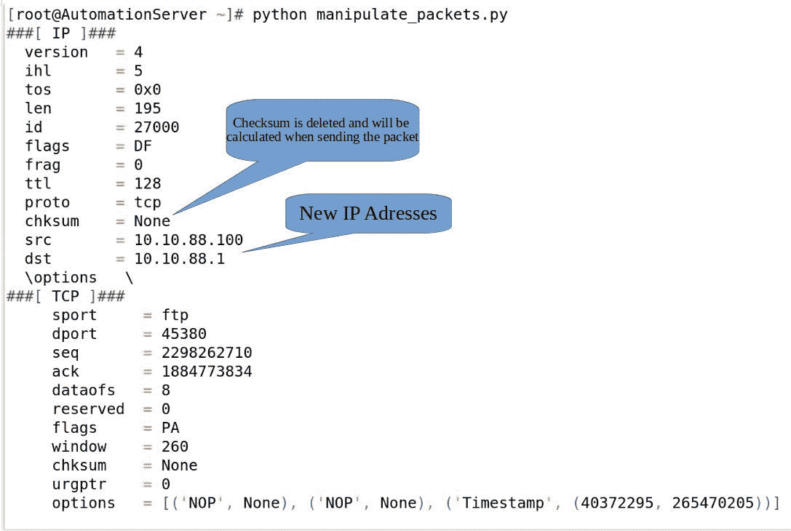
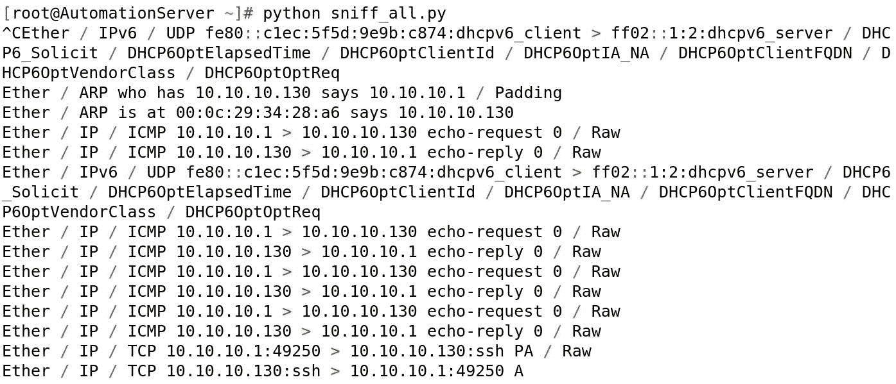

# 十七、使用 Scapy 框架

Scapy 是一个强大的 Python 工具，用于构建和制作数据包，然后通过网络发送数据包。您可以构建任何类型的网络流，并通过网络发送。它可以帮助您使用不同的数据包流测试网络，并处理从源返回的响应。

本章将介绍以下主题：

*   理解 Scapy 框架
*   安装 Scapy
*   使用 Scapy 生成数据包和网络流
*   捕获和重放数据包

# 理解 Scapy

Scapy（[https://scapy.net](https://scapy.net) 是用于捕获、嗅探、分析和操作网络数据包的强大 Python 工具之一。它还可以构建分层协议的数据包结构，并将 wiuthib 流注入网络。您可以使用它在彼此之上构建大量协议，并设置协议中每个字段的详细信息，或者，更好的是，让 Scapy 发挥其魔力，选择适当的值，以便每个协议都可以有一个有效的帧。如果用户未覆盖，Scapy 将尝试使用数据包的默认值。将为每个流自动设置以下值：

*   根据目的地和路由表选择 IP 源
*   校验和是自动计算的
*   根据输出接口选择源 Mac
*   以太网类型和 IP 协议由上层决定

Scapy 可以编程为向流中注入帧并重新发送。例如，您可以将 802.1q VLAN ID 注入流并重新发送，以在网络上执行攻击或分析。此外，您还可以可视化两个端点之间的对话，并使用`Graphviz`和`ImageMagick`模块将其绘制成图形。

Scapy 有自己的**领域特定语言**（**DSL**），使用户能够描述他想要构建或操作的数据包，并以相同的结构接收答案。这可以很好地与 Python 内置的数据类型（如列表和字典）进行集成。我们将在示例中看到，从网络接收到的数据包实际上是一个 Python 列表，我们可以在它们上面迭代普通的列表函数。

# 安装 Scapy

从 Scapy 版本 2.x 开始，Scapy 支持 python2.7.x 和 3.4+。但是，对于低于 2.3.3 的版本，Scapy 需要 python2.5 和 2.7，对于低于 2.3.3 的版本，Scapy 需要 3.4+。因为我们已经安装了最新的 Python 版本，所以可以毫无问题地运行最新版本的 Scapy。

另外，Scapy 有一个较旧的版本（1.x），该版本已被弃用，不支持 Python3，只适用于 Python2.4。

# 基于 Unix 的系统

要获得最新和最好的版本，您需要使用 python pip：

```py
pip install scapy 
```

The output should look something like the following screenshot:



要验证 Scapy 是否已成功安装，请访问 Python 控制台并尝试将`scapy`模块导入其中。如果没有向控制台报告导入错误，则安装已成功完成：


需要一些额外的包来可视化对话和捕获数据包。根据您的平台，使用以下命令安装附加软件包：

# 在 Debian 和 Ubuntu 中安装

运行以下命令以安装其他软件包：

```py
sudo apt-get install tcpdump graphviz imagemagick python-gnuplot python-cryptography python-pyx
```

# 安装在 Red Hat/CentOS 中

运行以下命令以安装其他软件包：

```py
yum install tcpdump graphviz imagemagick python-gnuplot python-crypto python-pyx -y
```

You may need to install `epel` repository on a CentOS-based system and update the system if you don't find any of the preceding packages available in the main repository.

# Windows 和 macOS X 支持

Scapy 是为在基于 linux 的系统上运行而构建和设计的。但是，它也可以在其他操作系统上运行。您可以在 windows 和 macOS 上移植的两个 windows 上安装和移植它，但每个平台都有一些限制。对于基于 Windows 的系统，基本上需要删除 WinPcap 驱动程序，而使用 Npcap 驱动程序（不要同时安装两个版本以避免任何冲突问题）。有关 Windows 安装的更多信息，请访问[http://scapy.readthedocs.io/en/latest/installation.html#windows](http://scapy.readthedocs.io/en/latest/installation.html#windows) 。

对于 macOS X，您需要安装一些 python 绑定并使用 libdnet 和 libpcap 库。完整的安装步骤可在[上找到 http://scapy.readthedocs.io/en/latest/installation.html#mac-os-x](http://scapy.readthedocs.io/en/latest/installation.html#mac-os-x)。

# 使用 Scapy 生成数据包和网络流

正如我们前面提到的，Scapy 有自己的 DSL 语言，它与 python 集成。此外，您还可以直接访问 Scapy 控制台，并开始直接从 Linux shell 发送和接收数据包：

```py
sudo scapy 
```

The output of the preceding command is as follows:



请注意，有一些关于丢失的*可选*包的警告消息，如`matplotlib`和`PyX`，但这应该是可以的，不会影响 Scapy 核心功能。

我们可以首先检查 scapy 中支持的协议。运行`ls()`功能列出所有支持的协议：

```py
>>> ls()
```

输出相当长，如果在这里发布，将跨越多个页面，因此您可以快速查看终端，而不是检查它。

现在，让我们开发 hello world 应用程序并使用 SCAPY 运行它。该程序将向服务器的网关发送一个简单的 ICMP 数据包。我安装了一个 Wireshark，并将其配置为监听一个网络接口，该接口将接收来自自动化服务器（该服务器承载 Scapy）的流。

现在，在 Scapy 终端上，执行以下代码：

```py
>>> send(IP(dst="10.10.10.1")/ICMP()/"Welcome to Enterprise Automation Course") 
```

返回 Wireshark，您将看到通信：


让我们分析一下 Scapy 执行的命令：

*   **发送**：这是 Scapy**领域特定语言**（**DSL**）中的内置函数，指示 Scapy 发送单个数据包（并且不监听任何回复；它只发送一个数据包并退出）。
*   **IP:**现在，在这个类中，我们将开始构建数据包层。从 IP 层开始，我们需要指定接收数据包的目标主机（在这种情况下，我们使用`dst`参数指定目标主机）。还要注意，我们可以在`src`参数中指定源 IP；但是，Scapy 将查阅主机路由表，找到合适的源 IP 并将其放入数据包中。您可以提供其他参数，如**生存时间**（**TTL**），Scapy 将覆盖默认参数。

*   **/**：虽然它看起来像 Python 中使用的普通除法运算符，但它在 Scapy DSL 中用于区分数据包层并将它们相互堆叠。
*   **ICMP（）：**用于创建具有默认值的 ICMP 数据包的内置类。可以提供给函数的值之一是 ICMP 类型，它确定消息类型：`echo`、`echo reply`、`unreachable`等等。
*   **欢迎参加企业自动化课程：**如果向 ICMP 有效负载中注入字符串。Scapy 将自动将其转换为合适的格式。

请注意，我们没有在堆栈中指定以太网层，也没有提供任何 mac 地址（源地址或目标地址）。默认情况下，这将再次在 scapy 中填充以创建有效帧。它将自动检查主机 ARP 表，并找到源接口（以及目标接口，如果存在）的 mac 地址，然后将其格式化为以太网帧。

在继续下一个示例之前，需要注意的最后一点是，您可以使用我们之前使用的相同`ls()`函数列出所有受支持的协议，以获取每个协议的默认值，然后在调用协议时将其设置为任何其他值：



现在让我们做一些更复杂的事情（和邪恶的事情！）。假设我们有两个路由器在彼此之间形成 VRRP 关系，我们需要打破这种关系以成为新的主路由器，或者至少在网络中创建一个摆动问题，如以下拓扑：



回想一下，配置为运行 VRRP 的路由器连接到多播地址（`255.0.0.18`，以便从其他路由器接收广告。VRRP 数据包的目标 MAC 地址应包含最后两个数字中的 VRRP 组编号。它还包含路由器之间的选择过程中使用的路由器优先级。我们将构建一个 Scapy 脚本，该脚本以高于网络中配置的优先级发送 VRRP 公告。这将导致我们的 Scapy 服务器被选为新主机：

```py
from scapy.layers.inet import *
from scapy.layers.vrrp import VRRP

vrrp_packet = Ether(src="00:00:5e:00:01:01",dst="01:00:5e:00:00:30")/IP(src="10.10.10.130", dst="224.0.0.18")/VRRP(priority=254, addrlist=["10.10.10.1"])
sendp(vrrp_packet, inter=2, loop=1)

```

在本例中：

*   首先，我们从`scapy.layers`模块导入了一些需要的层，这些层彼此堆叠在一起。例如，`inet`模块包含`IP()`、`Ether()`、`ARP()`、`ICMP()`等层。
*   此外，我们还需要 VRRP 层，可以从`scapy.layers.vrrp`导入。

*   其次，我们将构建一个 VRRP 数据包并将其存储在`vrrp_packet`变量中。此数据包包含以太网帧内 mac 地址中的 VRRP 组编号。多播地址将位于 IP 层内。此外，我们将在 VRRP 层内配置一个更高优先级的编号。这样，我们将有一个有效的 VRRP 公告，路由器将接受它。我们为每一层提供了目标 mac 地址（VRRP mac+组号）和多播 IP（`225.0.0.18`等信息。
*   最后，我们使用了`sendp()`函数，并为其提供了一个特制的`vrrp_packet`。`sendp()`函数将在第 2 层发送数据包，与`send()`函数不同，我们在前面的示例中使用`send()`函数发送数据包，但在第 3 层。`sendp()`函数不会像`send()`函数那样尝试解析主机名，只会在第 2 层运行。此外，由于我们需要连续发送此通知，因此我们将`loop`和`inter`参数配置为每 2 秒发送一次通知。

脚本输出为：



You can combine this attack with ARP poisoning and VLAN hopping attacks so you can change the mac address in the layer 2, switch to the Scapy server MAC address, and perform a **m****an in the middle** (**MITM**) attack.

Scapy 还包含一些执行扫描的类。例如，您可以使用`arping()`在网络范围内执行 ARP 扫描，并在其中以 regex 格式指定 IP 地址。Scapy 将向这些子网上的所有主机发送 ARP 请求，并检查回复：

```py
from scapy.layers.inet import *
arping("10.10.10.*")
```



脚本输出为：


根据收到的数据包，只有一台主机响应 SCAPY，这意味着它是扫描子网上的唯一主机。回复中还列出了主机 mac 和 IP 地址

# 捕获和重放数据包

Scapy 能够监听网络接口并捕获其上的所有传入数据包。它可以像`tcpdump`一样将其写入`pcap`文件，但 Scapy 提供了额外的功能，可以再次在网络中读取和重放`pcap`文件。

从简单的数据包重放开始，我们将指示 Scapy 读取从网络捕获的正常`pcap`文件（使用`tcpdump`或 Scapy 本身），然后再次将其发送到网络。如果我们需要测试特定流量模式通过网络时的网络行为，这是非常有用的。例如，我们可能配置了一个网络防火墙来阻止 FTP 通信。我们可以通过使用从 Scapy 重播的 FTP 数据来测试防火墙的功能。

在本例中，我们捕获了 FTP`pcap`文件，需要将其重播到网络：

```py
from scapy.layers.inet import *
from pprint import pprint
pkts = PcapReader("/root/ftp_data.pcap") #should be in wireshark-tcpdump format

for pkt in pkts:
    pprint(pkt.show())

```

`PcapReader()`将`pcap`文件作为输入，并对其进行分析，以单独获取每个数据包，并将其作为一项添加到`pkts`列表中。现在我们可以迭代列表并显示每个数据包的内容。

脚本输出为：


此外，您还可以通过访问数据包层的`get_layer()`函数获取特定的层信息。例如，如果我们有兴趣获取不带标头的原始数据，以便构建传输的文件，我们可以使用以下脚本获取所需的十六进制数据，然后稍后将其转换为 ASCII：

```py
from scapy.layers.inet import *
from pprint import pprint
pkts = PcapReader("/root/ftp_data.pcap") #should be in wireshark-tcpdump format

ftp_data = b""
for pkt in pkts:
    try:
        ftp_data += pkt.get_layer(Raw).load
    except:
        pass
```

请注意，我们必须用 try-except 子句包围`get_layer()`方法，因为某些层不包含原始数据（例如 FTP 控制消息）。Scapy 将抛出错误，脚本将退出。此外，我们可以将脚本重写为一个`if`子句，仅当包中有原始层时，它才会向`ftp_data`添加内容。

To avoid any errors while reading the `pcap` file, make sure you save (or export) your `pcap` file as Wireshark/tcpdump format, as shown here, and not the default format:



# 在包内注入数据

我们可以在将数据包重放回网络之前操作数据包并更改其内容。因为我们的数据包实际上是作为列表中的项目存储的，所以我们可以迭代这些项目并替换特定的信息。例如，我们可以更改 mac 地址、IP 地址，或者为每个数据包或符合条件的特定数据包添加额外的层。但是，我们应该注意，在特定层（如 IP 和 TCP）中操作数据包并更改内容将导致整个层的校验和无效，并且接收方可能因此而丢弃数据包。

Scapy 有一个惊人的特性（是的，我知道，我一直在说很多次，但 Scapy 确实是一个很棒的工具）。如果我们删除`pcap`文件中的原始内容，它将根据新内容自动为我们计算校验和。

因此，我们将修改前面的脚本并更改一些数据包参数，然后在将数据包发送到网络之前重建校验和：

```py

from scapy.layers.inet import *
from pprint import pprint
pkts = PcapReader("/root/ftp_data.pcap") #should be in wireshark-tcpdump format

p_out = []

for pkt in pkts:
    new_pkt = pkt.payload

    try:
        new_pkt[IP].src = "10.10.88.100"
        new_pkt[IP].dst = "10.10.88.1"
        del (new_pkt[IP].chksum)
        del (new_pkt[TCP].chksum)
    except:
        pass

    pprint(new_pkt.show())
    p_out.append(new_pkt)
send(PacketList(p_out), iface="eth0")
```

在前面的脚本中：

*   我们使用`PcapReader()`类读取 FTP`pcap`文件的内容，并将数据包存储在`pkts`变量中。
*   然后我们对数据包进行迭代，并将有效负载分配给`new_pkt`，以便我们可以操作内容。
*   记住，数据包本身被认为是类中的一个对象。我们可以访问`src`和`dst`成员，并将它们设置为任何所需的值。这里，我们将目的地设置为网关，将源设置为与原始数据包不同的值。
*   设置新的 IP 值将使校验和无效，因此我们使用`del`关键字删除了 IP 和 TCP 校验和。Scapy 将根据新的数据包内容重新计算它们。
*   最后，我们将`new_pkt`附加到空的`p_out`列表中，并使用`send()`函数发送它。请注意，我们可以在 send 函数中指定 exit 接口，也可以离开它，Scapy 将查阅主机路由表；它将获得每个数据包的正确出口接口。

脚本输出为：



另外，如果我们仍然在网关中运行 Wireshark，我们会注意到 Wireshark 在重新计算后使用设置的校验和值捕获`ftp`数据包流：


# 数据包嗅听

Scapy 有一个名为`sniff()`的内置数据包捕获功能。默认情况下，如果您未指定任何筛选器或特定接口，它将监视所有接口并捕获所有数据包：

```py
from scapy.all import *
from pprint import pprint

print("Begin capturing all packets from all interfaces. send ctrl+c to terminate and print summary")
pkts = sniff()

pprint(pkts.summary())
```

脚本输出为：



当然，您可以提供过滤器和特定接口来监视条件是否匹配。例如，在前面的输出中，我们可以看到 ICMP、TCP、SSH 和 DHCP 流量混合在所有接口上。如果我们只对获取 eth0 上的 ICMP 流量感兴趣，那么我们可以提供过滤器和`iface`参数来嗅探函数，它将只过滤所有流量并只记录 ICMP：

```py
from scapy.all import *
from pprint import pprint

print("Begin capturing all packets from all interfaces. send ctrl+c to terminate and print summary")
pkts = sniff(iface="eth0", filter="icmp")

pprint(pkts.summary())
```

脚本输出为：


请注意，我们如何仅捕获 eth0 接口上的 ICMP 通信，并且由于应用于它们的筛选器，所有其他数据包都被丢弃。*iface*值接受我们在脚本中使用的单个接口或用于监视它们的接口列表。

sniff 的高级特性之一是`stop_filter`，它是一个应用于每个数据包的 Python 函数，用于确定是否必须在该数据包之后停止捕获。例如，如果我们设置了`stop_filter = lambda x: x.haslayer(TCP)`，那么一旦我们命中一个带有 TCP 层的数据包，我们就会停止捕获。此外，`store`选项允许我们将数据包存储在内存中（默认情况下已启用），或在对每个数据包应用特定功能后丢弃它们。这是一个很好的功能，如果您正在获取从 wire 到 SCAPY 的实时通信，并且不想将它们写入内存，如果您在 sniff 函数中将 store 参数设置为 false，则 SCAPY 将应用您以前开发的任何自定义函数（例如从数据包中获取一些信息或将它们重新发送到不同的目的地..等等）则不会将原始数据包存储在内存中，并将其丢弃。这将在嗅探期间节省一些内存资源。

# 将数据包写入 pcap

最后，我们可以将嗅探到的数据包写入标准的`pcap`文件，并像往常一样使用 Wireshark 打开它。这是通过一个简单的`wrpcap()`函数实现的，该函数将数据包列表写入`pcap`文件。`wrpcap()`函数接受两个参数，第一个是文件位置的完整路径，第二个是在使用`sniff()`函数之前捕获的数据包列表：

```py
from scapy.all import *

print("Begin capturing all packets from all interfaces. send ctrl+c to terminate and print summary")
pkts = sniff(iface="eth0", filter="icmp")

wrpcap("/root/icmp_packets_eth0.pcap",pkts)
```

# 总结

在本章中，我们学习了如何利用 Scapy 框架构建包含任何网络层的任何类型的数据包，并用我们的值填充它。此外，我们还了解了如何在接口上捕获数据包并重播它们。