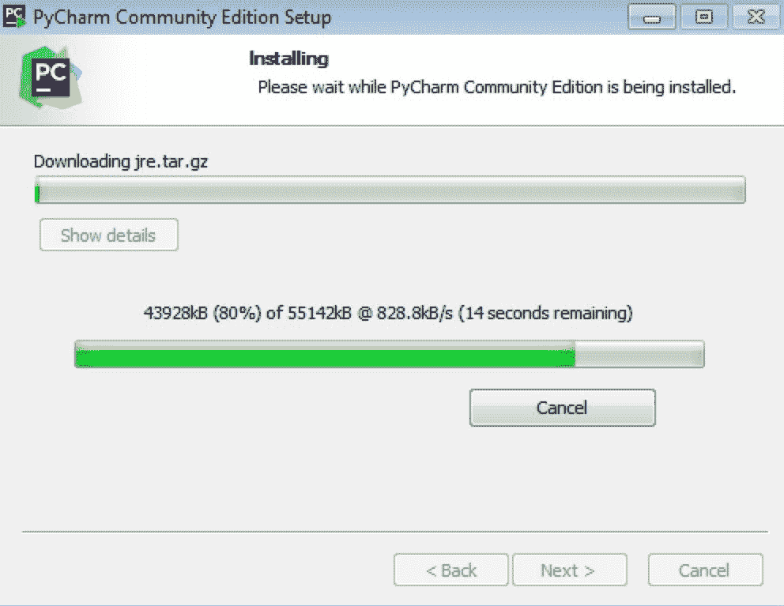
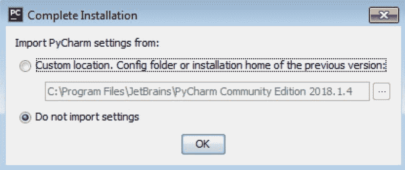
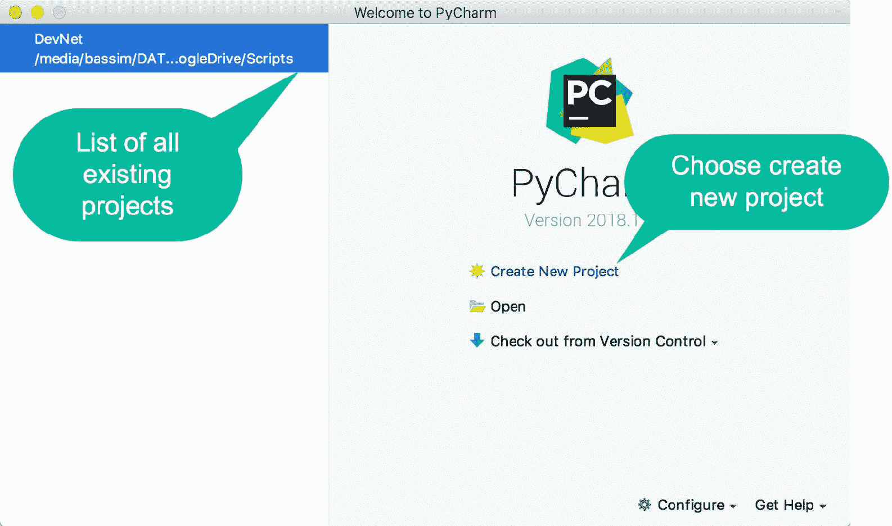
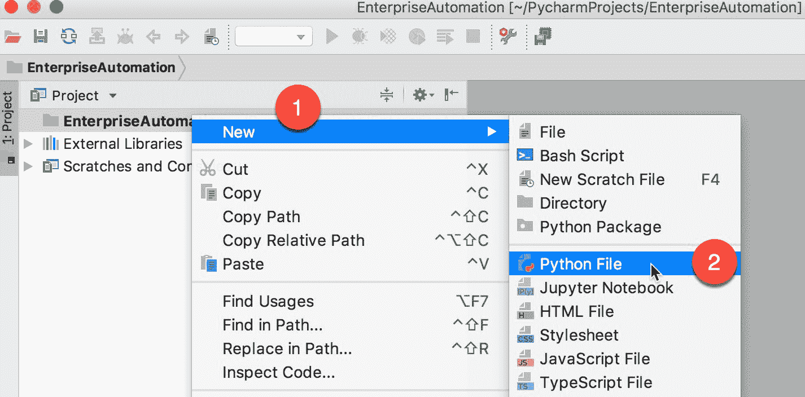
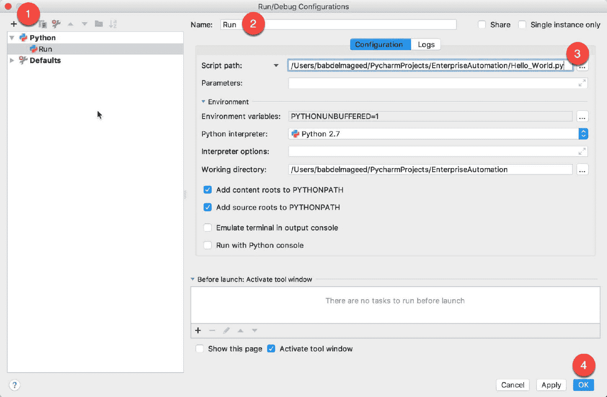
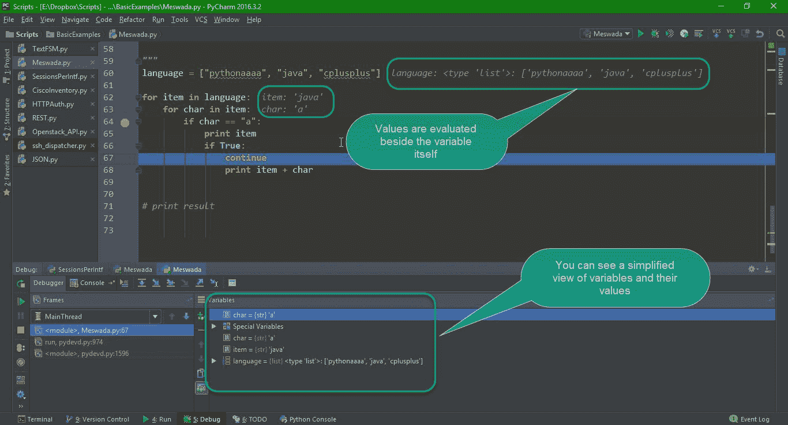
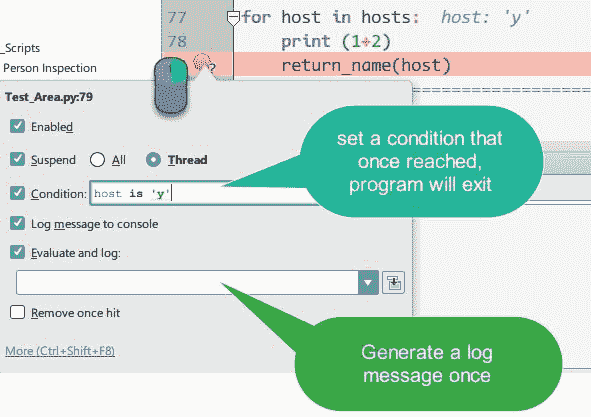
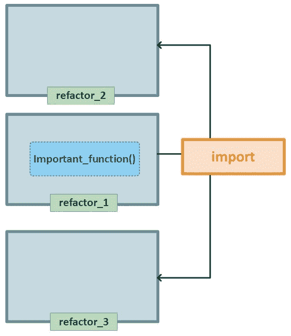
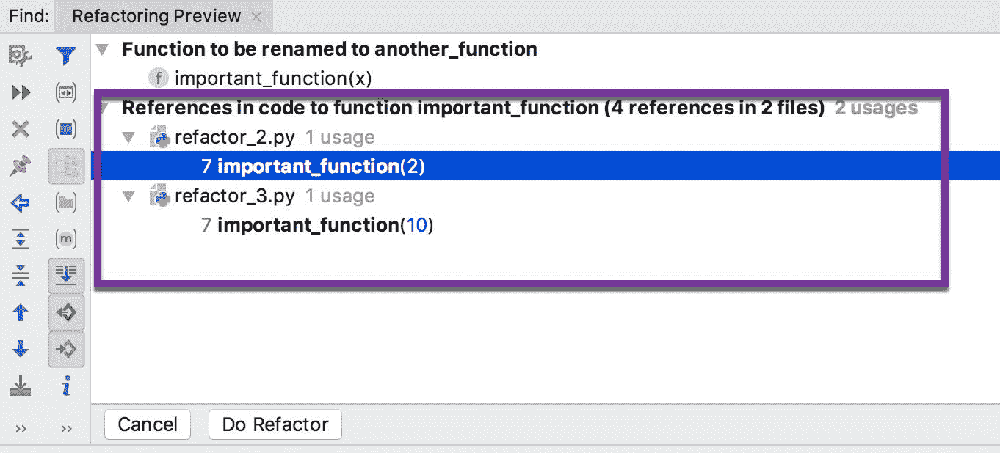
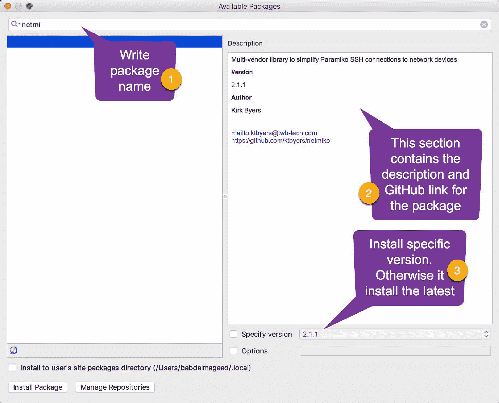

# 第一章：设置我们的 Python 环境

在这一章中，我们将简要介绍 Python 编程语言以及当前版本之间的区别。Python 有两个活跃版本，并且在开发过程中选择使用哪一个是很重要的。在这一章中，我们将下载并安装 Python 二进制文件到操作系统中。

在本章结束时，我们将安装全球专业开发人员使用的最先进的**集成开发环境**（**IDE**）之一：PyCharm。PyCharm 提供智能代码完成、代码检查、实时错误突出显示和快速修复、自动代码重构以及丰富的导航功能，我们将在本书中编写和开发 Python 代码时进行介绍。

本章将涵盖以下主题：

+   Python 简介

+   安装 PyCharm IDE

+   探索一些巧妙的 PyCharm 功能

# Python 简介

Python 是一种提供友好语法的高级编程语言；它易于学习和使用，无论是初学者还是专家程序员。

Python 最初是由 Guido van Rossum 于 1991 年开发的；它依赖于 C、C++和其他 Unix shell 工具的混合。Python 被称为通用编程语言，并且今天它被用于许多领域，如软件开发、Web 开发、网络自动化、系统管理和科学领域。由于其大量可供下载的模块，涵盖了许多领域，Python 可以将开发时间缩短到最低。

Python 语法设计得易读；它与英语有些相似，而代码本身的构造也很美。Python 核心开发人员提供了 20 条信息规则，称为 Python 之禅，这些规则影响了 Python 语言的设计；其中大部分涉及构建清洁、有组织和易读的代码。以下是其中一些规则：

美好优于丑陋。

显式优于隐式。

简单优于复杂。

复杂优于复杂。

您可以在[`www.python.org/dev/peps/pep-0020/`](https://www.python.org/dev/peps/pep-0020/)上阅读更多关于 Python 之禅的内容。

# Python 版本

Python 有两个主要版本：Python 2.x 和 Python 3.x。这两个版本之间有细微的差异；最明显的是它们的`print`函数对多个字符串的处理方式。此外，所有新功能只会添加到 3.x，而 2.x 将在完全退役之前接收安全更新。这不会是一个简单的迁移，因为许多应用程序都是基于 Python 2.x 构建的。

# 为什么有两个活跃版本？

我将引用官方 Python 网站上的原因：

<q class="calibre21">"Guido van Rossum（Python 语言的原始创造者）决定彻底清理 Python 2.x，不像对 2.x 范围内的新版本那样考虑向后兼容性。最重大的改进是更好的 Unicode 支持（默认情况下所有文本字符串都是 Unicode），以及更合理的字节/Unicode 分离。</q> <q class="calibre21">"此外，核心语言的几个方面（如 print 和 exec 作为语句，整数使用地板除法）已经调整为更容易让新手学习，并且更一致于语言的其他部分，并且已经删除了旧的不必要的东西（例如，所有类现在都是新式的，“range()”返回一个内存高效的可迭代对象，而不是像 2.x 中的列表那样）。</q>

您可以在[`wiki.python.org/moin/Python2orPython3`](https://wiki.python.org/moin/Python2orPython3)上阅读更多关于这个主题的内容。

# 您是否应该只学习 Python 3？

这取决于*.*学习 Python 3 将使您的代码具有未来性，并且您将使用开发人员提供的最新功能。但是，请注意，一些第三方模块和框架不支持 Python 3，并且在不久的将来将继续如此，直到他们完全将他们的库移植到 Python 3。

另外，请注意，一些网络供应商（如思科）对 Python 3.x 提供有限支持，因为大多数所需功能已经在 Python 2.x 版本中涵盖。例如，以下是思科设备支持的 Python 版本；您将看到所有设备都支持 2.x，而不支持 3.x：

！[](../images/00005.jpeg)来源：[`developer.cisco.com/site/python/`](https://developer.cisco.com/site/python/)

# 这是否意味着我不能编写在 Python 2 和 Python 3 上运行的代码？

不，当然可以在 Python 2.x 中编写代码并使其与两个版本兼容，但您需要首先导入一些库，例如`__future__`模块，使其向后兼容。此模块包含一些函数，可以调整 Python 2.x 的行为，并使其与 Python 3.x 完全相同。看一下以下示例，以了解两个版本之间的区别：

```py
#python 2 only print "Welcome to Enterprise Automation" 
```

以下代码适用于 Python 2 和 3：

```py
# python 2 and 3  print("Welcome to Enterprise Automation")
```

现在，如果您需要打印多个字符串，Python 2 的语法将如下所示：

```py
# python 2, multiple strings print "welcome", "to", "Enterprise", "Automation"   # python 3, multiple strings print ("welcome", "to", "Enterprise", "Automation")
```

如果您尝试在 Python 2 中使用括号打印多个字符串，它将将其解释为元组，这是错误的。因此，我们将在代码开头导入`__future__`模块，以防止该行为并指示 Python 打印多个字符串。

输出将如下所示：

！[](../images/00006.jpeg)

# Python 安装

无论您选择使用流行的 Python 版本（2.x）还是使用 Python 3.x 构建未来的代码，您都需要从官方网站下载 Python 二进制文件并在操作系统中安装它们。 Python 支持不同的平台（Windows，Mac，Linux，Raspberry PI 等）：

1.  转到[`www.python.org/downloads/`](https://www.python.org/downloads/)并选择最新的 2.x 或 3.x 版本：

！[](../images/00007.jpeg)

1.  从下载页面选择您的平台，以及 x86 或 x64 版本：

！[](../images/00008.jpeg)

1.  像往常一样安装软件包。在安装过程中选择将 python 添加到路径选项很重要，以便从命令行访问 Python（在 Windows 的情况下）。否则，Windows 将无法识别 Python 命令并将抛出错误：

！[](../images/00009.jpeg)

1.  通过在操作系统中打开命令行或终端并键入`python`来验证安装是否完成。这应该访问 Python 控制台并提供 Python 已成功安装在您的系统上的验证：

！[](../images/00010.jpeg)

# 安装 PyCharm IDE

PyCharm 是一个完整的 IDE，被世界各地的许多开发人员用来编写和开发 Python 代码。这个 IDE 是由 Jetbrains 公司开发的，提供丰富的代码分析和完成，语法高亮，单元测试，代码覆盖率，错误发现和其他 Python 代码操作。

此外，PyCharm 专业版支持 Python Web 框架，如 Django，web2py 和 Flask，以及与 Docker 和 vagrant 的集成。它与多个版本控制系统（如 Git（和 GitHub），CVS 和 subversion）提供了惊人的集成。

在接下来的几个步骤中，我们将安装 PyCharm 社区版：

1.  转到 PyCharm 下载页面（[`www.jetbrains.com/pycharm/download/`](https://www.jetbrains.com/pycharm/download/)）并选择您的平台。此外，选择下载 Community Edition（永久免费）或 Professional Edition（Community 版本完全适用于运行本书中的代码）：

！[](../images/00011.jpeg)

1.  像往常一样安装软件，但确保选择以下选项：

+   32 位或 64 位的启动器（取决于您的操作系统）。

+   创建关联（这将使 PyCharm 成为 Python 文件的默认应用程序）。

+   下载并安装 JetBrains 的 JRE x86：

！[](../images/00012.jpeg)

1.  等待 PyCharm 从互联网下载附加包并安装它，然后选择运行 PyCharm 社区版：



1.  由于这是一个新的安装，我们不会从中导入任何设置



1.  选择所需的 UI 主题（默认或*darcula*，用于暗模式）。您可以安装一些附加插件，例如 Markdown 和 BashSupport，这将使 PyCharm 识别和支持这些语言。完成后，单击开始使用 PyCharm：


# 在 PyCharm 中设置 Python 项目

在 PyCharm 中，一个 Python 项目是你开发的 Python 文件的集合，以及内置的或从第三方安装的 Python 模块。在开始开发代码之前，您需要创建一个新项目并将其保存到计算机内的特定位置。此外，您需要为该项目选择默认解释器。默认情况下，PyCharm 将扫描系统上的默认位置并搜索 Python 解释器。另一个选项是使用 Python `virtualenv` 创建一个完全隔离的环境。`virtualenv`的基本问题是其包依赖性。假设您正在处理多个不同的 Python 项目，其中一个项目需要特定版本的*x*包。另一方面，另一个项目需要完全不同版本的相同包。请注意，所有安装的 Python 包都放在`/usr/lib/python2.7/site-packages`中，您无法存储相同包的不同版本。`virtualenv`将通过创建一个具有自己的安装目录和自己的包的环境来解决此问题；每次您在这两个项目中的任何一个上工作时，PyCharm（借助`virtualenv`的帮助）将激活相应的环境，以避免包之间的任何冲突。

按照以下步骤设置项目：

1.  选择创建新项目：



1.  选择项目设置：


1.  1.  选择项目类型；在我们的情况下，它将是纯 Python*.*

1.  在本地硬盘上选择项目的位置。

1.  选择项目解释器。要么使用默认目录中现有的 Python 安装，要么创建一个专门与该项目绑定的新虚拟环境。

1.  单击 Create*.*

1.  在项目内创建一个新的 Python 文件：



+   1.  右键单击项目名称，然后选择 New。

1.  从菜单中选择 Python 文件，然后选择文件名。

打开一个新的空白文件，您可以直接在其中编写 Python 代码。例如，尝试导入`__future__`模块，PyCharm 将自动打开一个弹出窗口，显示所有可能的补全，如下面的屏幕截图所示：


1.  运行您的代码：


+   1.  输入您希望运行的代码。

1.  选择编辑配置以配置 Python 文件的运行时设置。

1.  配置运行文件的新 Python 设置：



1.  1.  单击+号添加新配置，然后选择 Python。

1.  选择配置名称。

1.  选择项目内的脚本路径。

1.  单击确定。

1.  运行代码：


1.  1.  单击配置名称旁边的播放按钮。

1.  PyCharm 将执行配置中指定的文件中的代码，并将输出返回到终端。

# 探索一些巧妙的 PyCharm 功能

在本节中，我们将探讨 PyCharm 的一些特性。PyCharm 拥有大量的内置工具，包括集成调试器和测试运行器、Python 分析器、内置终端、与主要版本控制系统的集成和内置数据库工具、远程开发能力与远程解释器、集成 SSH 终端，以及与 Docker 和 Vagrant 的集成。有关其他功能的列表，请查看官方网站（[`www.jetbrains.com/pycharm/features/`](https://www.jetbrains.com/pycharm/features/)）。

# 代码调试

代码调试是一个过程，可以帮助您了解错误的原因，通过为代码提供输入并逐行查看代码的执行情况，以及最终的评估结果。Python 语言包含一些调试工具，从简单的`print`函数、assert 命令到代码的完整单元测试。PyCharm 提供了一种简单的调试代码和查看评估值的方法。

要在 PyCharm 中调试代码（比如，一个带有`if`子句的嵌套`for`循环），您需要在希望 PyCharm 停止程序执行的行上设置断点。当 PyCharm 到达这一行时，它将暂停程序并转储内存以查看每个变量的内容：


请注意，在第一次迭代时，每个变量的值都会被打印在其旁边：



此外，您还可以右键单击断点，并为任何变量添加特定条件。如果变量评估为特定值，那么将打印日志消息：



# 代码重构

重构代码是更改代码中特定变量名称结构的过程。例如，您可能为变量选择一个名称，并在由多个源文件组成的项目中使用它，然后决定将变量重命名为更具描述性的名称。PyCharm 提供了许多重构技术，以确保代码可以更新而不会破坏操作。

PyCharm 执行以下操作：

+   重构本身

+   扫描项目中的每个文件，并确保变量的引用已更新

+   如果某些内容无法自动更新，它将给出警告并打开一个菜单，让您决定如何处理

+   在重构代码之前保存代码，以便以后可以恢复

让我们来看一个例子。假设我们的项目中有三个 Python 文件，分别为`refactor_1.py`、`refactor_2.py`和`refactor_3.py`。第一个文件包含`important_funtion(x)`，它也在`refactor_2.py`和`refactor_3.py`中使用。



将以下代码复制到`refactor_1.py`文件中：

```py
def important_function(x):
  print(x)
```

将以下代码复制到`refactor_2.py`文件中：

```py
from refactor_1 import important_function
important_function(2)
```

将以下代码复制到`refactor_3.py`文件中：

```py
from refactor_1 import important_function
important_function(10)
```

要进行重构，您需要右键单击方法本身，选择重构 | 重命名，并输入方法的新名称：


请注意，IDE 底部会打开一个窗口，列出此函数的所有引用，每个引用的当前值，以及重构后将受影响的文件：



如果选择执行重构，所有引用将使用新名称进行更新，您的代码将不会被破坏。

# 从 GUI 安装包

PyCharm 可以用来使用 GUI 为现有的解释器（或`virtualenv`）安装包。此外，您可以查看所有已安装包的列表，以及它们是否有可用的升级版本。

首先，您需要转到文件 | 设置 | 项目 | 项目解释器：


如前面的截图所示，PyCharm 提供了已安装包及其当前版本的列表。您可以点击+号将新包添加到项目解释器中，然后在搜索框中输入包的缩写：



您应该看到一个可用软件包的列表，其中包含每个软件包的名称和描述。此外，您可以指定要安装在您的解释器上的特定版本。一旦您点击安装软件包，PyCharm 将在您的系统上执行一个`pip`命令（可能会要求您权限）；然后，它将下载软件包到安装目录并执行`setup.py`文件。

# 总结

在本章中，您学习了 Python 2 和 Python 3 之间的区别，以及如何根据您的需求决定使用哪种版本。此外，您还学习了如何安装 Python 解释器，以及如何使用 PyCharm 作为高级编辑器来编写和管理代码的生命周期。

在下一章中，我们将讨论 Python 软件包结构和自动化中常用的 Python 软件包。
