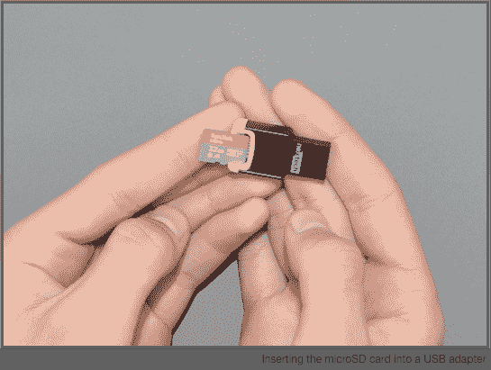
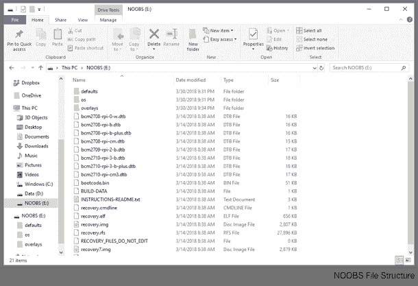
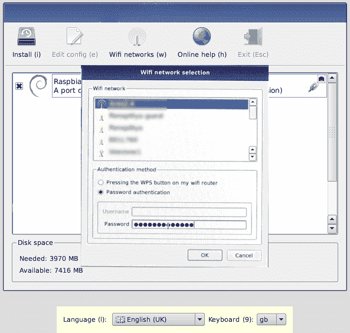
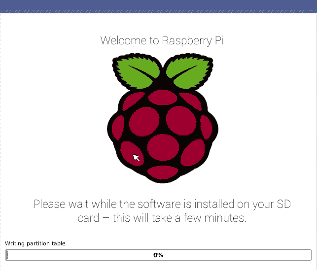
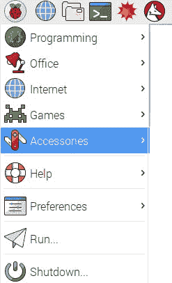
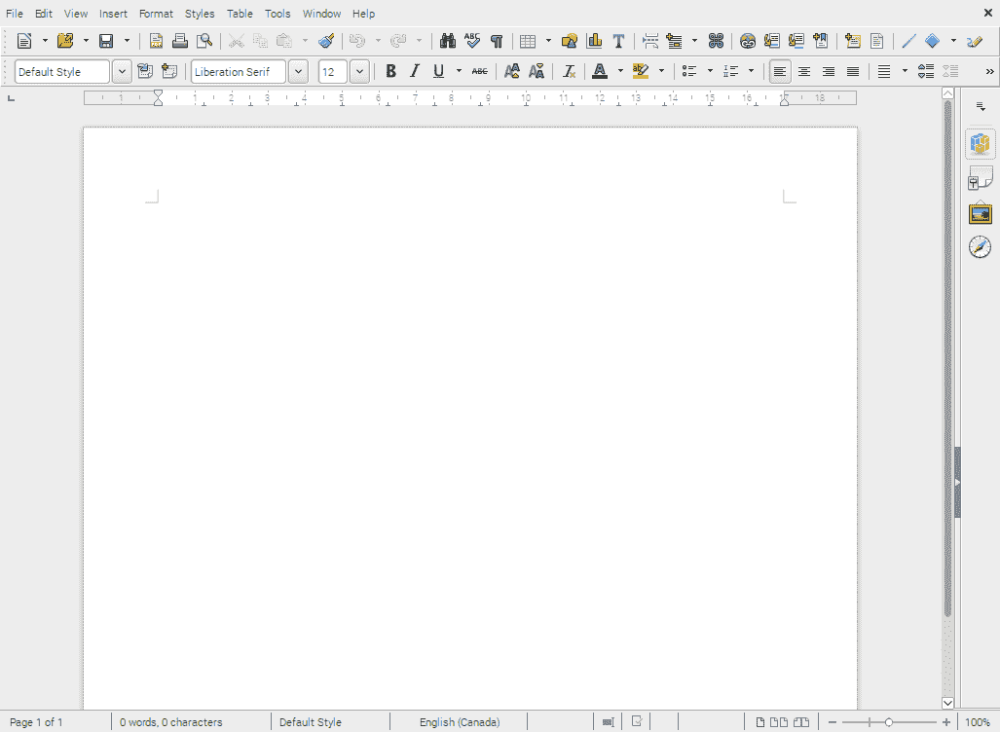

# 一、在 Raspberry Pi 上安装 Raspbian

覆盆子圆周率是作为一个小型和负担得起的计算机，你可以用来学习编程销售。至少这是它最初的目标。正如我们将在本书中看到的，它远不止这些。

本章将介绍以下主题：

*   树莓派的简史
*   关于树莓 Pi 的操作系统
*   安装 Raspbian 操作系统
*   Raspbian 操作系统的快速概述

# 树莓派的简史

第一款 Raspberry Pi 于 2012 年首次发布，采用 700 MHz 单核处理器和 256 MB RAM。Raspberry Pi 2 于 2015 年 2 月发布，配备 900 MHz 四核处理器和 1 GB RAM。Raspberry Pi 3 于 2016 年 2 月发布，将处理器速度提高到 1.2 GHz。该型号也是第一款包含无线局域网和蓝牙的机型。

以下是树莓派 3 B（2015）的图像：

此版本的 Raspberry Pi 具有以下特点：

*   四个 USB 2 端口
*   局域网端口
*   3.5 毫米复合视频和音频插孔
*   用于视频和音频的 HDMI 端口
*   OTG USB 端口（我们将使用该端口连接电源）
*   microSD 插槽（用于存放我们的操作系统）

*   Raspberry Pi 触摸屏的 DSI 显示端口
*   A**通用输入输出**（**GPIO**引脚
*   用于特殊 Raspberry Pi 摄像机的摄像机端口

覆盆子 Pi Zero 于 2015 年 11 月发布。以下是它的图片：

虽然没有以前的 Raspberry Pis 强大，但 Zero 的尺寸更小（65 mm X 30 mm），非常适合物理空间有限的项目（即可穿戴项目）。此外，Raspberry Pi Zero 的售价为 5 美元，因此价格非常实惠。Raspberry Pi Zero W 于 2017 年 2 月 28 日发布，价格是（10 美元）的两倍内置 Wi-Fi 和蓝牙功能。

截至本文撰写之时，最新型号为 Raspberry Pi 3 B+，于 2018 年 3 月 14 日发布。处理器速度已升级至 1.4 GHz，无线 LAN 目前支持 2.4 GHz 和 5 GHz 频段。另一个升级是添加了蓝牙低能耗，这项技术专为不需要大量数据交换但需要较长电池寿命的应用而开发。

Raspberry Pi 的创作者最初认为他们最多能卖出 1000 台。他们几乎不知道他们的发明会大受欢迎。截至 2018 年 3 月，Raspberry Pi 电脑的销量已突破 1900 万台大关。

# 关于树莓 Pi 的操作系统

Raspberry Pi 上可能安装了各种操作系统（或系统映像）。从特定于应用程序的操作系统（如音频播放器）到各种通用操作系统，Raspberry Pi 背后的强大之处在于它可以用于各种应用程序和项目

下面列出了 Raspberry Pi 可用的几个操作系统（系统映像）：

*   **Volumio**：**您是否希望建立一个网络音频系统，使用计算机或手机访问您的音乐列表？Volumio 可能就是您想要的。将其安装在覆盆子 Pi 上可以创建一个无头音频播放器（一个不需要键盘和鼠标的系统）通过 USB 或网络连接到您的音频文件。在顶部添加了一个特殊的音频**硬件**（**帽**）可以添加到您的 Pi 以提供与放大器和扬声器的原始音频连接。甚至还有一个插件可添加 Spotify，以便您可以设置 Raspberry Pi 以访问此服务并通过您的音响系统播放音乐。**
***   **PiFM 无线电发射机**：PiFM 无线电发射机将您的 Raspberry Pi 转换为 FM 发射机，您可以使用该发射机通过无线向标准 FM 无线电接收机发送音频文件。使用一根连接到 GPIO 引脚之一的简单导线（我们将在后面了解更多关于 GPIO 的信息），您可以为传输的 FM 信号创建一个天线，其强度惊人*   **Stratux**：ADS-B 是航空领域的新标准，地面控制员和飞行员可以共享地理位置和天气信息。Stratux 图像和附加硬件将 Raspberry Pi 变成 ADS-B 信息接收器。*   **RetroPie**：RetroPie 通过模拟过去的游戏机和电脑，将你的 Raspberry Pi 变成了一款复古游戏机。其中一些模拟产品包括 Amiga、Apple II、Atari 2600 和 20 世纪 80 年代早期的任天堂娱乐系统。**

 ***   **OctoPi**：OctoPi 将您的 Raspberry Pi 变成 3D 打印机的服务器。通过 OctoPi，您可以通过网络控制 3D 打印机，包括使用网络摄像头查看 3D 打印机的状态。
*   **NOOBS**：这可以说是在 Raspberry Pi 上安装操作系统最简单的方法。NOOBS 代表新的开箱即用软件，我们将使用 NOOBS 安装 Raspbian。

# 项目概述

在这个项目中，我们将把 Raspbian 操作系统安装到 Raspberry Pi 上。安装后，我们将快速浏览操作系统以熟悉它。我们将首先格式化 microSD 卡以存储安装文件。然后，我们将从 microSD 卡运行安装。安装 Raspbian 后，我们将快速查看它，以便熟悉它。

这个项目应该需要大约两个小时才能完成，因为我们安装了 Raspbian 操作系统并快速查看了一下。

# 开始

完成本项目需要以下内容：

*   Raspberry Pi 3 型（2015 型或更新型）
*   USB 电源
*   计算机显示器
*   USB 键盘
*   USB 鼠标
*   microSD 内存卡
*   树莓派 NOOBS 图像（[https://www.raspberrypi.org/downloads/noobs/](https://www.raspberrypi.org/downloads/noobs/) ）

# 安装 Raspbian 操作系统

Raspbian 操作系统被认为是 Raspberry Pi 的默认或转到操作系统。在本节中，我们将使用 NOOBS 映像安装 Raspbian。

# 为 Raspbian 格式化 microSD 卡

Raspberry Pi 使用 microSD 卡存储操作系统。这使您可以轻松地在 Raspberry Pi 的不同操作系统（系统映像）之间切换。我们将使用 NOOBS 映像为我们的项目安装默认 Raspbian 操作系统。

首先将 microSD 卡插入 USB 适配器，然后将其插入计算机：

您可能需要格式化 microSD 卡。如果需要，请使用适合您计算机操作系统的实用程序将卡格式化为 FAT32。建议您使用容量为 8 GB 或更大的卡。对于 Windows 操作系统和容量为 64 GB 或更大的卡，应使用第三方工具（如 FAT32 格式）进行格式化。

# 将 NOOBS 文件复制到 microSD RAM

解压下载的 NOOBS 图像。打开解压后的目录，将文件拖到 microSD 卡上。

这些文件的外观应与以下屏幕截图中的相同：

# 运行安装程序

现在我们将在 Raspberry Pi 上安装 Raspbian。以前有安装 Windows 或 macOS 等操作系统经验的人应该熟悉此步骤。将安装 Raspbian 操作系统，并使用我们的 microSD 卡运行

要将 Raspbian 安装到 microSD 卡上，请执行以下操作：

1.  首先将 microSD 卡插入 Raspberry Pi 上的适当插槽。确保安装时标签面（暴露触点的对面）朝上。将其插入，使金属触点面向电路板。microSD 卡的标签面顶部应有一个轻微的凸起，这是很好的易于删除使用指甲。
2.  将键盘和鼠标插入侧面的 USB 插槽，将显示器插入 HDMI 端口，最后将 USB 电源线插入电源端口。Raspberry Pi 没有开/关开关，电源线连接后会立即通电：

3.  初始黑屏显示滚动白色文本后，应看到以下对话框：

4.  在上一个屏幕截图中，我们单击了语言选项。出于我们的目的，我们将保留英语（UK）的默认值。我们还将保持键盘的标准 gb
5.  由于 Raspberry Pi 3 具有无线 LAN，我们可以设置 Wi-Fi（对于较旧的电路板，请将 Wi-Fi 加密狗插入 USB 端口或使用有线 LAN 端口并跳过下一步）：

6.  单击 Wifi 网络（w）按钮。使用单选按钮选择身份验证方法。某些路由器配备 WPS 按钮，允许您直接连接到路由器。要使用`password`方法，请选择密码身份验证单选按钮并输入网络密码。连接到网络后，您会注意到现在有更多操作系统选项可供选择：

7.  我们会选择最重要的选项，拉斯宾。选中 Raspbian[推荐]旁边的框，然后单击对话框左上角的安装（i）按钮。Raspbian 将开始在您的 Raspberry Pi 上安装。您将看到一个带有先前图形的进度条，描述 Raspbian 操作系统的各种功能：

8.  进度条达到 100%后，计算机将重新启动，在默认桌面加载之前，您将看到一个包含文本的屏幕：

# Raspbian 操作系统的快速概述

Raspbian 桌面与其他操作系统（如 Windows 和 macOS）的桌面类似。单击左上角按钮可下拉应用程序菜单，您可以在其中访问各种预装程序。我们还可以从此菜单关闭覆盆子皮：

# Chromium web 浏览器

左侧的第二个按钮加载用于 Raspberry Pi 的 Google Chromium web 浏览器：

Chromium 浏览器是一款轻量级浏览器，在 Raspberry Pi 上运行得非常好：

# 主文件夹

“两个文件夹”按钮打开一个窗口，显示`home`文件夹：

在 Raspberry Pi 上查找文件时，`home`文件夹是一个很好的起点。事实上，当您使用`scrot`命令或“打印屏幕”按钮拍摄屏幕截图时，文件会自动存储在此文件夹中：

# 终点站

左边的第三个按钮打开终端。终端允许命令行访问 Raspberry Pi 的文件和程序：

它来自命令行，您可以在其中使用`sudo apt-get update`和`sudo apt-get dist-upgrade`命令更新 Raspberry Pi。

`apt-get`更新套餐列表，`apt-get dist-upgrade`更新套餐：

在使用`sudo`命令安装 Raspbian 之后立即运行这两个命令是个好主意。Raspberry Pi 上 Raspbian 的默认用户是`pi`，它是 Raspbian 中超级用户组的一部分，因此必须使用`sudo`命令`pi`用户的默认密码是`raspberry`：

Mastering the command line is a virtue that many a programmer aspires to acquire. Being able to rapidly type command after command looks so cool that even movie makers have picked up on it (when was the last time you saw the computer wiz in a movie clicking around the screen with a mouse?). To assist you in becoming this uber cool computer wiz, here are some basic Raspbian commands for you to master using the Terminal:

`ls`: Command to see the contents of the current directory
`cd`: Command to change directories. For example, use `cd` to move up a directory from where you currently are
`pwd`: Command to display the directory you are currently in
`sudo`: Allows the user to perform a task as the super user
`shutdown`: Command that allows the user to shut down the computer from the Terminal command line

# 数学软件

第三和第四个按钮分别用于 Mathematica 和访问 Wolfram 语言的终端：

Mathematica 跨越了技术计算的所有领域，并使用 Wolfram 语言作为编程语言。Mathematica 使用的领域包括机器学习、图像处理、神经网络和数据科学：

Mathematica 是一款于 1988 年首次发布的专有软件，通过 2013 年底宣布的合作关系，Raspberry Pi 上的个人可以免费使用

现在让我们看看从主下拉菜单访问的一些程序。

# 音速圆周率

Sonic Pi 是一种用于创建电子音乐的实时编码环境。可从编程菜单选项访问。Sonic Pi 是一种创造性的方式，可在用户程序循环、琶音、音乐、音乐、音乐时创建音乐，通过将代码从应用程序的一个部分剪切和粘贴到另一个部分，实时显示声音场景。Sonic Pi 中的合成器可以在深层次上进行配置，为音乐编码器提供定制体验：

面向 EDM 风格的音乐，Sonic Pi 也可用于创作古典和爵士乐风格的音乐

# Scratch 和 Scratch 2.0

Scratch 和 Scratch 2.0 是为教孩子们编程而设计的可视化编程环境。使用 Scratch，程序员用循环和条件语句创建自己的动画。

可以在程序中创建游戏。Scratch 的第一个版本于 2003 年由麻省理工学院媒体实验室的终身幼儿园小组发布。Scratch 2.0 于 2013 年发布，目前正在开发 Scratch 3.0：

可在编程菜单选项下访问 Scratch 和 Scratch 2.0。

# 办公套件

LibreOffice 是一个免费的开源办公套件，2010 年从 OpenOffice 派生而来。LibreOffice 套件包括一个文字处理器、一个电子表格程序、一个演示程序、一个矢量图形编辑器、一个用于创建和编辑数学公式的程序，和数据库管理程序。可通过 LibreOffice 菜单选项访问 LibreOffice 程序套件：

# 总结

我们从树莓派的历史开始这一章。一开始是一项向新一代推广编程的倡议，现在已经发展成为一种全球现象。然后我们下载了 NOOBS 映像并安装了 Raspbian 操作系统，Raspberry Pi 的默认操作系统。这涉及格式化和为 NOOBS 文件准备 microSD 卡。

最容易想到的是，像覆盆子圆周率（Raspberry Pi）这样既便宜又小的计算机并没有那么强大。我们展示了 Raspberry Pi 确实是一台功能非常强大的计算机，我们查看了一些预装 Raspbian 操作系统的应用程序。

在[第 2 章](02.html)中*使用 Raspberry Pi*编写 Python 程序，我们将开始使用 Raspberry Pi 和 Raspbian 中可用的一些开发工具编写 Python 代码。

# 问题

1.  第一个树莓派是哪一年问世的？
2.  Raspberry Pi 3 B+型与上一版本相比有哪些升级？
3.  NOOBS 代表什么？
4.  允许使用 Python 代码创建音乐的预装应用程序的名称是什么？
5.  Raspberry Pi 的操作系统存储在哪里？
6.  Raspbian 预装的儿童视觉编程环境的名称是什么？
7.  Mathematica 中使用的语言的名称是什么？
8.  Raspbian 的默认用户名和密码是什么？
9.  GPIO 代表什么？
10.  什么是馅饼？
11.  对还是错？点击主栏上的两个文件夹图标加载`home`文件夹。
12.  对还是错？microSD 卡插槽位于 Raspberry Pi 的底部。
13.  对还是错？要关闭覆盆子 Pi，请从应用程序菜单中选择关机。
14.  对还是错？您只能使用 NOOBS 安装 Raspbian 操作系统。
15.  对还是错？蓝牙低能量是指人们吃太多蓝莓，早上很难醒来。

# 进一步阅读

有关树莓派的更多信息，请访问树莓派的主要网站[www.raspberrypi.org](http://www.raspberrypi.org)。**