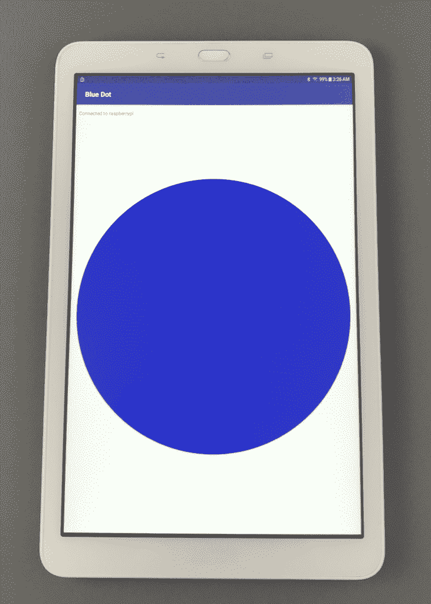
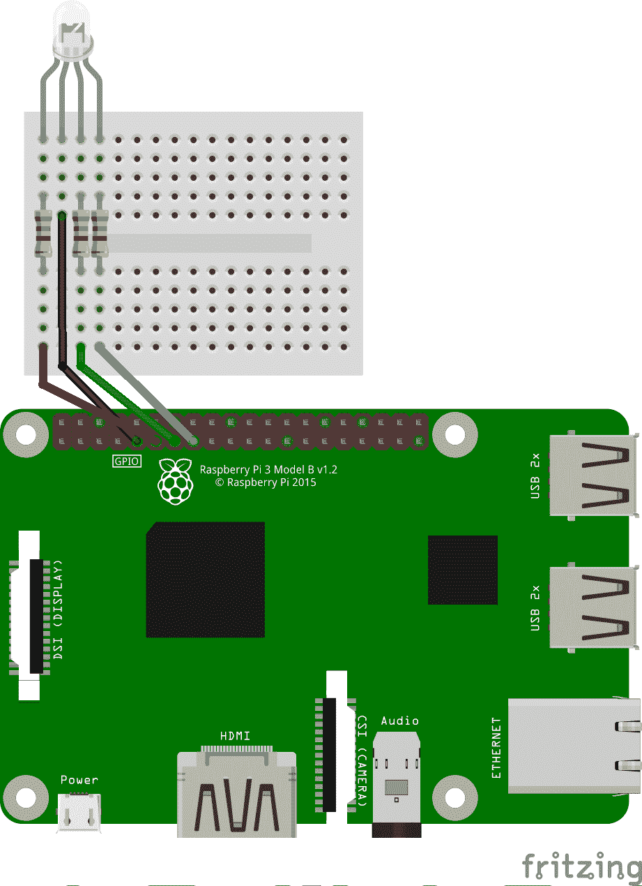

# 十一、使用蓝牙创建门铃按钮

在本章中，我们将把重点转向蓝牙。蓝牙是一种用于短距离数据交换的无线技术。它在 2.4 至 2.485 GHz 的频带内工作，一般范围可达 10 米。

在本章的项目中，我们将利用 Android 上的 Blue Dot 应用程序，在构建一个更高级的可接受秘密刷卡手势的门铃之前，我们将构建一个简单的蓝牙门铃。

本章将介绍以下主题：

*   介绍蓝点
*   什么是 RGB LED？
*   使用蓝牙和 Python 读取按钮状态

# 项目概述

在本章中，我们将使用 Raspberry Pi 和 Android 手机或平板电脑构建一个支持蓝牙功能的门铃。我们将在 Android 手机或平板电脑上使用一款名为 Blue Dot 的应用程序，该应用程序设计用于 Raspberry Pi 项目。

我们将从研究 RGB LED 开始，其中我们将编写一个小程序来循环使用这三种颜色。然后，我们将使用 RGB LED 和有源蜂鸣器创建警报。我们将用 Python 代码测试警报。

我们将编写 Python 代码来从 Blue Dot 读取按钮信息。然后，我们将合并来自警报器和蓝点的代码来创建蓝牙门铃系统。

本章中的项目应在上午或下午完成

# 开始

完成本项目需要以下内容：

*   Raspberry Pi 3 型（2015 型或更新型）
*   USB 电源
*   计算机显示器
*   USB 键盘
*   USB 鼠标
*   试验板
*   跨接导线
*   330 欧姆电阻器（其中 3 个）
*   RGB 发光二极管
*   主动蜂鸣器
*   安卓手机还是平板电脑

# 介绍蓝点

Blue Dot 是谷歌 Play 商店提供的一款 Android 应用程序。它作为蓝莓 Pi 的蓝牙遥控器工作。当加载到你的 Android 手机或平板电脑时，它基本上是一个大的蓝点，你按下它向 Raspberry Pi 发送信号。以下是加载到平板电脑上的 Blue Dot 应用程序的图片：



它可以用作各种各样的蓝牙操纵杆，位置、滑块和旋转数据可以从应用程序发送到 Raspberry Pi，具体取决于您与屏幕上点的交互方式。我们将根据蓝色圆点的按压方式创建自定义铃声，从而在门铃应用程序中添加一些此功能。要在 Android 手机或平板电脑上安装 Blue Dot，请访问 Google Play 商店并搜索 Blue Dot。

# 在 Raspberry Pi 上安装 bluedot 库

要在 Raspberry Pi 上安装`bluedot`库，请执行以下操作：

1.  打开终端应用程序
2.  在终端中键入以下内容：

```py
sudo pip3 install bluedot
```

3.  按*进入*安装库

# 将蓝点与覆盆子皮搭配

为了使用 Blue Dot 应用程序，您必须将其与您的 Raspberry Pi 配对。为此，请执行以下步骤：

1.  从 Raspbian 桌面客户端的右上角，单击蓝牙符号：


2.  如果蓝牙未打开，请单击蓝牙图标并选择打开蓝牙
3.  从蓝牙下拉菜单中选择“使可发现”选项
4.  在 Android 手机或平板电脑上，转到蓝牙设置（根据手机或平板电脑上的特定操作系统，蓝牙设置可能位于不同的位置）
5.  您应该能够在可用设备列表中看到 Raspberry Pi
6.  点击它将您的设备与 Raspberry Pi 配对
7.  你应该在树莓派上看到一条信息，读到类似`Device 'Galaxy Tab E' has requested a pairing. Do you accept the request?`的内容
8.  单击“确定”接受

9.  你可能会收到一条`connection failed`信息。我可以忽略这条消息，但我的 Raspberry Pi 仍然可以使用 Blue Dot 应用程序，所以不要太担心
10.  将 Blue Dot 应用程序加载到 Android 手机或平板电脑上
11.  您应该会看到一个带有树莓圆周率的列表
12.  单击 Raspberry Pi 项以将 Blue Dot 应用程序连接到 Raspberry Pi

要测试我们的连接，请执行以下操作：

1.  按照应用程序菜单|编程| Thonny Python IDE 打开 Thonny
2.  单击新建图标创建一个新文件
3.  在文件中键入以下内容：

```py
from bluedot import BlueDot
bd = BlueDot()
bd.wait_for_press()
print("Thank you for pressing the Blue Dot!")
```

4.  将文件另存为`bluest-test.py`并运行它
5.  您应该在 Thonny shell 中得到一条消息，读取服务器已启动，后跟 Raspberry Pi 的蓝牙地址
6.  然后你会收到一条信息，上面写着`Waiting for connection`
7.  如果您的 Blue Dot 应用程序已断开与 Raspberry Pi 的连接，请在列表中选择 Raspberry Pi 项以再次连接
8.  一旦 Blue Dot 应用程序连接到 Raspberry Pi，您将收到消息`Client connected`，然后是您手机或平板电脑的蓝牙地址
9.  按下蓝色的大圆点
10.  Thonny shell 现在应该打印以下消息：`Thank you for pressing the Blue Dot!`

# 给电路布线

我们将使用有源蜂鸣器和 RGB LED 创建门铃电路。因为我们以前没有讨论过 RGB LED，所以我们将快速了解一下这个神奇的小电子元件。然后，我们使用 Raspberry Pi 编写了一个简单的测试程序，该程序将点亮 RGB LED 并鸣响主动蜂鸣器。

# 什么是 RGB LED？

一个 RGB LED 实际上只是一个单元中的三个 LED：一个红色的、一个绿色的和一个蓝色的。几乎任何颜色都可以通过在选择的输入引脚上施加不同功率水平的电流来实现。以下是此类 LED 的示意图：


正如您所看到的，有红色、绿色和蓝色引脚，加上负引脚（-）。当 RGB LED 具有负引脚（-）时，称其具有公共阴极。一些 RGB LED 具有公共正极引脚（+），因此被称为具有公共阳极。对于我们的电路，我们将使用带有公共阴极的 RGB LED。公共阴极和公共阳极都具有 RGB LED 的最长管脚，并通过该特性进行识别。

# 测试我们的 RGB LED

我们现在将建立一个电路，我们可以测试我们的 RGB LED。以下是我们电路的接线图：



要按照图中所示构建电路，请执行以下操作：

1.  使用试验板，将 RGB LED 插入试验板，以便将公共阴极从左侧插入第二个插槽
2.  将一个 330 欧姆的电阻器连接到试验板中央间隙的红色、绿色和蓝色针脚上

3.  将 GPIO 针脚 17 的阴螺纹到阳螺纹跨接导线连接到试验板左侧的第一个插槽
4.  从 GPIO GND 到 RGB LED（左侧第二个）的阴极引脚连接一条阴-阳跨接线
5.  将 GPIO 针脚 27 的阴螺纹到阳螺纹跨接导线连接到试验板左侧的第三个插槽
6.  将 GPIO 针脚 22 的阴螺纹到阳螺纹跨接导线连接到试验板左侧的第四个插槽
7.  从应用程序菜单|编程| Thonny Python IDE 打开 Thonny
8.  单击新建图标创建一个新文件
9.  在文件中键入以下内容：

```py
from gpiozero import RGBLED
from time import sleep

led = RGBLED(red=17, green=27, blue=22)

while True:
   led.color=(1,0,0)
    sleep(2)
    led.color=(0,1,0)
    sleep(2)
    led.color=(0,0,1)
    sleep(2)
    led.off()
    sleep(2)    
```

10.  将文件另存为`RGB-LED-test.py`并运行它

您应该会看到 RGB LED 以红色亮起 2 秒钟。然后，RGB LED 应亮起绿色 2 秒钟，然后变为蓝色 2 秒钟。然后，它将关闭 2 秒钟，然后再次启动序列。

在代码中，我们首先从 GPIO Zero 库导入`RGBLED`。然后，我们通过为 RGB LED 的红色、绿色和蓝色分配管脚号来设置一个名为`led`的变量。从这里开始，我们只需使用`led.color`属性打开每种颜色。很容易看出，为`led.color`属性指定`1, 0, 0`值会打开红色 LED，关闭绿色和蓝色 LED。`led.off`方法关闭 RGB LED

尝试对`led.color`使用不同的值进行试验。您甚至可以输入一个小于`1`的值来改变颜色的强度（范围是`0`和`1`之间的任何值）。如果仔细观察，您可能会看到 RGB LED 内部的不同 LED 亮起。

# 完成我们的门铃电路

现在，让我们在电路中添加一个有源蜂鸣器，以完成门铃系统的构建。以下是我们的门铃电路图：


要构建回路，请执行以下步骤：

1.  使用我们现有的电路，在试验板的另一端插入一个有源蜂鸣器
2.  将一根阴螺纹到阳螺纹跨接导线从 GPIO 针脚 26 连接到激活蜂鸣器的正极针脚
3.  在 GPIO GND 和有源蜂鸣器的负极引脚之间连接一根阴螺纹到阳螺纹跨接导线
4.  从应用程序菜单|编程| Thonny Python IDE 打开 Thonny
5.  单击新建图标创建一个新文件
6.  在文件中键入以下内容：

```py
from gpiozero import RGBLED
from gpiozero import Buzzer
from time import sleep

class DoorbellAlarm:

    led = RGBLED(red=17, green=22, blue=27)
    buzzer = Buzzer(26)
    num_of_times = 0

    def __init__(self, num_of_times):
        self.num_of_times = num_of_times

    def play_sequence(self):
        num = 0
        while num < self.num_of_times:
            self.buzzer.on()
            self.light_show()
            sleep(0.5)
            self.buzzer.off()
            sleep(0.5)
            num += 1

    def light_show(self):
        self.led.color=(1,0,0)
        sleep(0.1)
        self.led.color=(0,1,0)
        sleep(0.1)
        self.led.color=(0,0,1)
        sleep(0.1)
        self.led.off()

if __name__=="__main__":

    doorbell_alarm = DoorbellAlarm(5)
    doorbell_alarm.play_sequence()   
```

7.  将文件另存为`DoorbellAlarm.py`并运行它
8.  您应该听到蜂鸣器熄灭五次，以及看到 RGB LED 通过其灯光序列的次数相同

让我们看一下代码：

1.  我们首先导入所需的库，如下所示：

```py
from gpiozero import RGBLED
from gpiozero import Buzzer
from time import sleep
```

2.  之后，在设置初始值之前，我们使用`DoorbellAlarm`类名创建类：

```py
led = RGBLED(red=17, green=22, blue=27)
buzzer = Buzzer(26)
num_of_times = 0
```

3.  类初始化使用`num_of_times`类变量设置报警序列将播放的次数：

```py
def __init__(self, num_of_times):
    self.num_of_times = num_of_times
```

4.  `light_show`方法只是将 RGB LED 中的每种颜色按顺序闪烁`0.1`秒：

```py
def light_show(self):
    self.led.color=(1,0,0)
    sleep(0.1)
    self.led.color=(0,1,0)
    sleep(0.1)
    self.led.color=(0,0,1)
    sleep(0.1)
    self.led.off()
```

5.  `play_sequence`方法根据`DoorbellAlarm`类初始化时设置的次数打开和关闭蜂鸣器。每次蜂鸣器响起时，它也会通过 RGB LED`light_show`功能运行：

```py
def play_sequence(self):
    num = 0
    while num < self.num_of_times:
        self.buzzer.on()
        self.light_show()
        sleep(0.5)
        self.buzzer.off()
        sleep(0.5)
        num += 1
```

6.  我们通过实例化值为`5`的`DoorbellAlarm`类并将其分配给`doorbell_alarm`变量来测试我们的代码。然后通过调用`play_sequence`方法来播放序列：

```py
if __name__=="__main__":

    doorbell_alarm = DoorbellAlarm(5)
    doorbell_alarm.play_sequence()   
```

# 使用蓝牙和 Python 读取按钮状态

如前所述，我们可以通过多种方式与 Blue Dot 应用程序进行交互，而不仅仅是简单地按下按钮。Blue Dot 应用程序可以解释用户在按钮上按下的位置，以及检测双重按下和滑动。在下面的代码中，我们将使用 Python 阅读 Blue Dot 应用程序。

# 使用 Python 读取按钮信息

请执行以下操作：

1.  从应用程序菜单|编程| Thonny Python IDE 打开 Thonny
2.  单击新建图标创建一个新文件
3.  在文件中键入以下内容：

```py
from bluedot import BlueDot
from signal import pause

class BlueDotButton:

    def swiped(swipe):

        if swipe.up:
            print("Blue Dot Swiped Up")
        elif swipe.down:
            print("Blue Dot Swiped Down")
        elif swipe.left:
            print("Blue Dot Swiped Left")
        elif swipe.right:
            print("Blue Dot Swiped Right")

    def pressed(pos):
        if pos.top:
            print("Blue Dot Pressed from Top")
        elif pos.bottom:
            print("Blue Dot Pressed from Bottom")
        elif pos.left:
            print("Blue Dot Pressed from Left")
        elif pos.right:
            print("Blue Dot Pressed from Right")
        elif pos.middle:
            print("Blue Dot Pressed from Middle")

    def double_pressed():
        print("Blue Dot Double Pressed")

    blue_dot = BlueDot()
    blue_dot.when_swiped = swiped
    blue_dot.when_pressed = pressed
    blue_dot.when_double_pressed = double_pressed

 if __name__=="__main__":

    blue_dot_button = BlueDotButton()
    pause()       
```

4.  将文件另存为`BlueDotButton.py`并运行它

每次运行此程序时，您可能必须将 Blue Dot 应用程序连接到 Raspberry Pi（只需从 Blue Dot 应用程序的列表中选择）。试着把蓝色的点压在中间，在顶部，在左边，等等。您应该会在 shell 中看到消息，告诉您按下的位置。现在尝试刷卡和双击。shell 中的消息也应该指示这些手势。

那么，我们在这里做了什么？让我们看一下代码：

1.  我们首先导入所需的库：

```py
from bluedot import BlueDot
from signal import pause
```

我们显然需要`BlueDot`，我们也需要`pause`。我们使用`pause`暂停程序，等待蓝点应用程序发出信号。由于我们使用的是`when_pressed`、`when_swiped`和`when_double_swiped`事件，因此我们需要暂停并等待（与其他方法，如`wait_for_press`相反）。我相信使用`when`-而不是`wait`类型的事件可以使代码更简洁。

2.  我们程序的核心是`BlueDot`对象及其相关回调定义的实例化：

```py
blue_dot = BlueDot()
blue_dot.when_swiped = swiped
blue_dot.when_pressed = pressed
blue_dot.when_double_pressed = double_pressed
```

请注意，这些回调定义必须放在它们所引用的方法之后，否则将出现错误。

3.  这些方法本身非常简单。以下是`swiped`方法：

```py
def swiped(swipe):

    if swipe.up:
        print("Blue Dot Swiped Up")
    elif swipe.down:
        print("Blue Dot Swiped Down")
    elif swipe.left:
        print("Blue Dot Swiped Left")
    elif swipe.right:
        print("Blue Dot Swiped Right")
```

4.  我们在方法签名中定义了一个名为`swipe`的变量。注意，我们不必在方法签名中使用`self`，因为我们在方法中不使用类变量。

# 创建蓝牙门铃

现在我们知道如何从 Blue Dot 读取按钮信息，我们可以构建一个蓝牙门铃按钮。我们将重写我们的`DoorbellAlarm`类，并使用一个简单的按钮从蓝点按下来激活警报，如下所示：

1.  从应用程序菜单|编程| Thonny Python IDE 打开 Thonny
2.  单击新建图标创建一个新文件
3.  在文件中键入以下内容：

```py
from gpiozero import RGBLED
from gpiozero import Buzzer
from time import sleep

class DoorbellAlarmAdvanced:

    led = RGBLED(red=17, green=22, blue=27)
    buzzer = Buzzer(26)
    num_of_times = 0
    delay = 0

    def __init__(self, num_of_times, delay):
        self.num_of_times = num_of_times
        self.delay = delay

    def play_sequence(self):
        num = 0
        while num < self.num_of_times:
            self.buzzer.on()
            self.light_show()
            sleep(self.delay)
            self.buzzer.off()
            sleep(self.delay)
            num += 1

    def light_show(self):
        self.led.color=(1,0,0)
        sleep(0.1)
        self.led.color=(0,1,0)
        sleep(0.1)
        self.led.color=(0,0,1)
        sleep(0.1)
        self.led.off()

if __name__=="__main__":

    doorbell_alarm = DoorbellAlarmAdvanced(5,1)
    doorbell_alarm.play_sequence()
```

4.  将文件另存为`DoorbellAlarmAdvanced.py`

我们的新类`DoorbellAlarmAdvanced`是`DoorbellAlarm`类的修改版本。我们所做的基本上是添加一个新的类属性，我们称之为`delay`。此类属性将用于更改蜂鸣器鸣响之间的延迟时间。正如您在代码中看到的，为更改而修改的两种方法是`__init__`和`play_sequence`**。**

现在我们已经对闹钟进行了更改，让我们创建一个简单的门铃程序，如下所示：

1.  从应用程序菜单|编程| Thonny Python IDE 打开 Thonny
2.  单击新建图标创建一个新文件
3.  在文件中键入以下内容：

```py
from bluedot import BlueDot
from signal import pause
from DoorbellAlarmAdvanced import DoorbellAlarmAdvanced

class SimpleDoorbell:

 def pressed():
 doorbell_alarm = DoorbellAlarmAdvanced(5, 1)
 doorbell_alarm.play_sequence()

 blue_dot = BlueDot()
 blue_dot.when_pressed = pressed

if __name__=="__main__":

 doorbell_alarm = SimpleDoorbell()
 pause()
```

4.  将文件另存为`SimpleDoorbell.py`并运行它
5.  将 Blue Dot 应用程序连接到 Raspberry Pi（如果尚未连接）
6.  推蓝色的大圆点

你应该每隔 1 秒听到蜂鸣器发出五声响声，每声持续 1 秒。您还将看到 RGB LED 经过一个短暂的灯光显示。正如您所看到的，代码非常简单。我们导入新的`DoorbellAlarmAdvanced`类，然后在`pressed`方法中使用`doorbell_alarm`变量初始化该类后调用`play_sequence`方法。

我们在创建`DoorbellAlarmAdvanced`类时所做的更改被用于我们的代码中，以允许我们设置环之间的延迟时间。

# 创建秘密蓝牙门铃

在我们开门之前知道谁在门口不是很好吗？我们可以利用 Blue Dot 应用程序的刷卡功能。要创建秘密蓝牙门铃（秘密是我们与门铃交互的方式，而不是门铃的秘密位置），请执行以下操作：

1.  从应用程序菜单|编程| Thonny Python IDE 打开 Thonny
2.  单击新建图标创建一个新文件
3.  在文件中键入以下内容：

```py
from bluedot import BlueDot
from signal import pause
from DoorbellAlarmAdvanced import DoorbellAlarmAdvanced

class SecretDoorbell:

    def swiped(swipe):

        if swipe.up:
            doorbell_alarm = DoorbellAlarmAdvanced(5, 0.5)
            doorbell_alarm.play_sequence()
        elif swipe.down:
            doorbell_alarm = DoorbellAlarmAdvanced(3, 2)
            doorbell_alarm.play_sequence()
        elif swipe.left:
            doorbell_alarm = DoorbellAlarmAdvanced(1, 5)
            doorbell_alarm.play_sequence()
        elif swipe.right:
            doorbell_alarm = DoorbellAlarmAdvanced(1, 0.5)
            doorbell_alarm.play_sequence()

    blue_dot = BlueDot()
    blue_dot.when_swiped = swiped    

if __name__=="__main__":

    doorbell = SecretDoorbell()
    pause()
```

4.  将文件另存为`SecretDoorbell.py`并运行它
5.  将 Blue Dot 应用程序连接到 Raspberry Pi（如果尚未连接）
6.  向上滑动蓝色圆点

您应该会听到五个短铃声，以及看到 RGB LED 灯显示。尝试向下、向左和向右滑动。每次都应该得到不同的环序列。

那么，我们在这里做了什么？基本上，我们向`when_swiped`事件附加了一个回调，并通过`if`语句创建了具有不同初始值的新`DoorbellAlarmAdvanced`对象。

通过这个项目，我们现在可以知道谁在门口，因为我们可以为不同的朋友指定不同的刷卡手势。

# 总结

在本章中，我们使用 Raspberry Pi 和 Blue Dot Android 应用程序创建了一个蓝牙门铃应用程序。我们首先学习了一些关于 RGB LED 的知识，然后将其集成到带有有源蜂鸣器的报警电路中。

通过 Blue Dot 应用程序，我们学会了如何将蓝牙按钮连接到我们的 Raspberry Pi。我们还学习了如何使用一些蓝点手势，并创建了一个具有各种铃声持续时间的门铃应用程序。

在[第 12 章](12.html)*提升我们的物联网门铃*中，我们将扩展我们的门铃功能，并在有人按下按钮时发送短信。

# 问题

1.  RGB LED 与常规 LED 有何不同？
2.  对还是错？Blue Dot 应用程序可以在 Google Play 商店中找到。
3.  什么是公共阳极？
4.  对还是错？RGB LED 内部的三种颜色是红色、绿色和黄色。
5.  如何将 Blue Dot 应用程序与 Raspberry Pi 配对？
6.  对还是错？蓝牙是一种为超长距离构建的通信技术。
7.  `DoorbellAlarm`和`DoorbellAlarmAdvanced`之间有什么区别？
8.  对还是错？GPIO Zero 库包含一个名为`RGBLED`的类。
9.  对还是错？Blue Dot 应用程序可用于记录刷卡手势。
10.  `SimpleDoorbell`类和`SecretDoorbell`类之间有什么区别？

# 进一步阅读

要了解更多关于蓝点 Android 应用程序的信息，请访问文档页面[https://bluedot.readthedocs.io](https://bluedot.readthedocs.io) 。