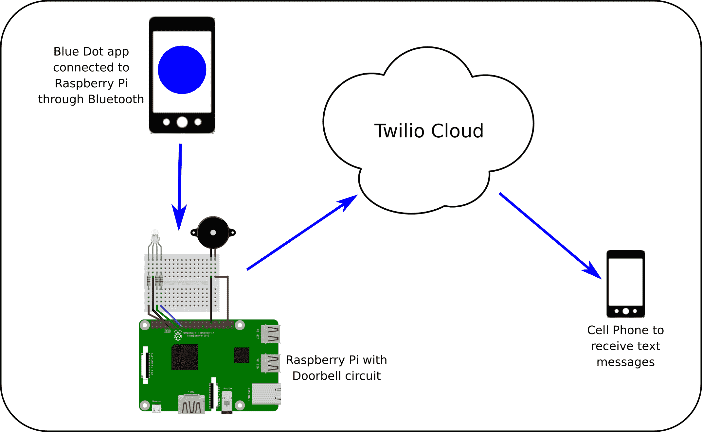
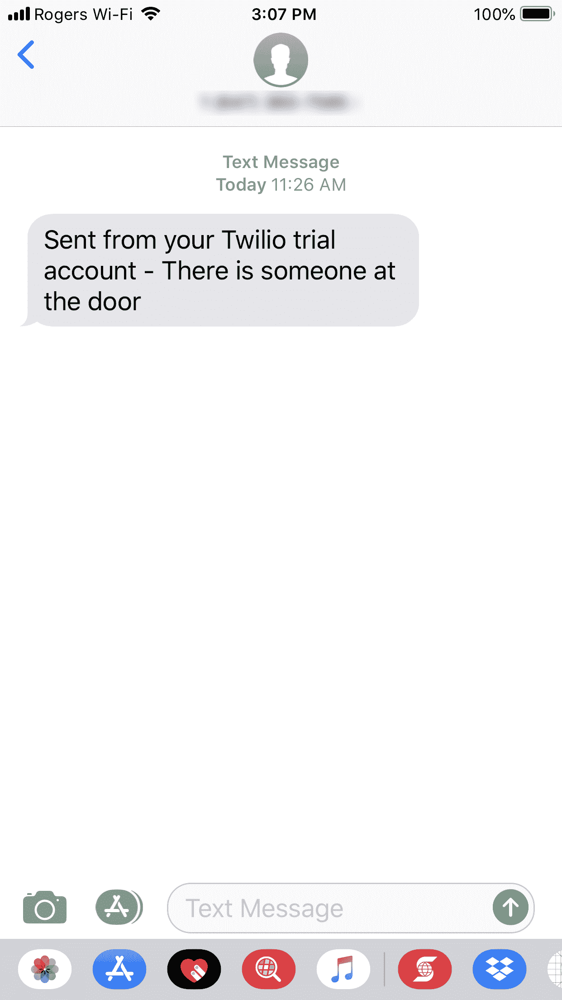
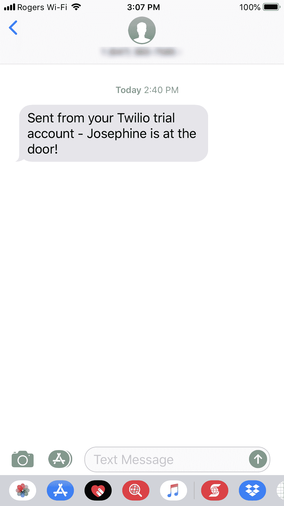

# 十二、增强我们的物联网门铃

在[第 10 章](10.html)*发布到 Web 服务*中，我们探讨了 Web 服务。然后，我们在[第 11 章](11.html)中介绍了蓝牙技术，*使用蓝牙*创建了一个门铃按钮，并使用 Android 应用程序 Blue Dot 和我们的 Raspberry Pi 构建了一个蓝牙门铃。

在本章中，我们将通过增加当有人在门口时发送消息的功能来增强蓝牙门铃。我们将利用所学知识，使用[第 10 章](10.html)、*发布到 Web 服务*中设置的 Twilio 账号，将其应用于添加短信功能。

本章将介绍以下主题：

*   当有人在门口时发送短信
*   使用短信
    创建秘密门铃应用程序

# 项目概述

对于本章中的两个项目，我们将使用[第 11 章](11.html)中的电路*使用蓝牙*创建门铃按钮。我们还将使用安卓设备的蓝点应用程序，如[第 11 章](11.html)*所述，使用蓝牙*创建门铃按钮。下面是我们将在本章中创建的应用程序的示意图：



我们将创建此应用程序的两个版本。我们的应用程序的第一个版本将是一个简单的蓝牙门铃，按下蓝色圆点将触发蜂鸣器和 RGB LED 灯显示。警报触发后，将使用 Twilio 云服务发送文本消息。

该应用程序的修改版本将使用蓝点应用程序上的滑动手势来表示特定的访问者。四位潜在访客中的每一位都会有自己独特的蓝点滑动手势。在自定义蜂鸣器响且 RGB LED 灯亮起后，将发送一条文本消息，通知收件人谁在门口。Twilio 云也将用于此。

两个项目都需要一个上午或下午才能完成。

# 开始

完成本项目需要以下内容：

*   Raspberry Pi 3 型（2015 型或更新型）
*   USB 电源
*   计算机显示器
*   USB 键盘
*   USB 鼠标
*   试验板
*   跨接导线
*   330 欧姆电阻器（其中 3 个）
*   RGB 发光二极管
*   主动蜂鸣器
*   Android 设备（手机/平板电脑）

# 当有人在门口时发送短信

在[第 10 章](10.html)*发布到 Web 服务*中，我们使用一种称为 Twilio 的技术创建了文本消息。在那个例子中，当检测到入侵者时，我们使用 Twilio 发送文本消息。在[第 11 章](11.html)*使用蓝牙*创建门铃按钮中，我们使用 Android 手机或平板电脑上的蓝点应用程序创建了蓝牙门铃。门铃响了一个蜂鸣器，并在 RGB LED 上显示了一点灯光。

对于本项目，我们将 Twilio 与蓝牙门铃相结合，当有人按下蓝点门铃时发送短信（参见[第 10 章](10.html)、*发布到 Web 服务*、[第 11 章](11.html)、*使用蓝牙*创建门铃按钮，以熟悉这些技术）。

# 使用短信创建简单的门铃应用程序

要创建我们的简单门铃应用程序，请执行以下操作：

1.  从应用程序菜单|编程| Thonny Python IDE 打开 Thonny
2.  单击新建图标创建一个新文件
3.  键入以下内容：

```py
from twilio.rest import Client
from gpiozero import RGBLED
from gpiozero import Buzzer
from bluedot import BlueDot
from signal import pause
from time import sleep

class Doorbell:
    account_sid = ''
    auth_token = ''
    from_phonenumber=''
    test_env = True
    led = RGBLED(red=17, green=22, blue=27)
    buzzer = Buzzer(26)
    num_of_rings = 0
    ring_delay = 0
    msg = ''

    def __init__(self, 
                 num_of_rings = 1, 
                 ring_delay = 1, 
                 message = 'ring', 
                 test_env = True):
        self.num_of_rings = num_of_rings
        self.ring_delay = ring_delay
        self.message = message
        self.test_env = self.setEnvironment(test_env)

    def setEnvironment(self, test_env):
        if test_env:
            self.account_sid = '<<test account_sid>>'
            self.auth_token = '<<test auth_token>>'
            return True
        else:
            self.account_sid = '<<live account_sid>>'
            self.auth_token = '<<live auth_token>>'
            return False

    def doorbell_sequence(self):
        num = 0
        while num < self.num_of_rings:
            self.buzzer.on()
            self.light_show()
            sleep(self.ring_delay)
            self.buzzer.off()
            sleep(self.ring_delay)
            num += 1
        return self.sendTextMessage()

    def sendTextMessage(self):
        twilio_client = Client(self.account_sid, self.auth_token)
        if self.test_env:
            message = twilio_client.messages.create(
                        body=self.message,
                        from_= '+15005550006',
                        to='<<your phone number>>'
            )
        else:
            message = twilio_client.messages.create(
                        body=self.message,
                        from_= '<<your twilio number>>',
                        to='<<your phone number>>'
            ) 
        return 'Doorbell text message sent - ' + message.sid

    def light_show(self):
        self.led.color=(1,0,0)
        sleep(0.5)
        self.led.color=(0,1,0)
        sleep(0.5)
        self.led.color=(0,0,1)
        sleep(0.5)
        self.led.off()

def pressed():
    doorbell = Doorbell(2, 0.5, 'There is someone at the door')
    print(doorbell.doorbell_sequence())

blue_dot = BlueDot()
blue_dot.when_pressed = pressed

if __name__=="__main__":
    pause()

```

4.  将文件另存为`Doorbell.py`并运行它
5.  打开 Android 设备上的 Blue Dot 应用程序
6.  连接到树莓派
7.  推蓝色的大圆点

您应该听到铃声并看到灯光序列循环两次，铃声之间有一个短暂的延迟。您应该在 shell 中打印类似于以下内容的内容：

```py
Server started B8:27:EB:12:77:4F
Waiting for connection
Client connected F4:0E:22:EB:31:CA
Doorbell text message sent - SM5cf1125acad44016840a6b76f99b3624
```

前三行表示 Blue Dot 应用程序已通过 Python 程序连接到 Raspberry Pi。最后一行表示发送了一条文本消息。在我们使用测试环境时，没有发送实际的文本消息，但是调用了 Twilio 服务。

让我们看一下代码。我们首先定义我们的类，并将其命名为`Doorbell`。这是我们类的一个好名字，因为我们已经编写了代码，所有与门铃有关的内容都包含在`Doorbell.py`文件中。此文件包含用于提醒用户的`Doorbell`类和用于触发门铃的蓝点代码。蓝点代码实际上位于`Doorbell`类定义之外，因为我们将其视为蓝点应用程序的一部分，而不是门铃本身。我们当然可以设计代码，使`Doorbell`类包含触发警报的代码；但是，警报与警报触发器的这种分离使得将来更容易将`Doorbell`类作为警报机制重用。

Choosing class names can be tricky. However, it is very important to choose the correct class name, as it will make it easier to build your application with class names that fit the purpose they are intended for. Class names are usually nouns, and the methods inside the classes are verbs. Generally, it is better to have a class represent one thing or idea. For example, we named our class `Doorbell`, as we have designed it to encapsulate what a doorbell does: alert the user that someone is at the door. Taking that idea into account, it makes sense that the `Doorbell` class would contain code to light up an LED, sound a buzzer, and send a text message, as those three actions fall under the idea of alerting a user.

定义类后，我们创建类中使用的类变量，如下所示：

```py
class Doorbell:
    account_sid = ''
    auth_token = ''
    from_phonenumber=''
    test_env = True
    led = RGBLED(red=17, green=22, blue=27)
    buzzer = Buzzer(26)
    num_of_rings = 0
    ring_delay = 0
    msg = ''
```

`init`和`setEnvironment`方法设置了我们在类中使用的变量。`test_env`变量决定了我们在代码中是使用 Twilio 测试还是使用实时环境。默认情况下使用测试环境：

```py
def __init__(self, 
             num_of_rings = 1, 
             ring_delay = 1, 
             message = 'ring', 
             test_env = True):
     self.num_of_rings = num_of_rings
     self.ring_delay = ring_delay
     self.message = message
     self.test_env = self.setEnvironment(test_env)

 def setEnvironment(self, test_env):
     if test_env:
         self.account_sid = '<<test account sid>>'
         self.auth_token = '<<test auth token>>'
         return True
     else:
         self.account_sid = '<<live account sid>>'
         self.auth_token = '<<auth_token>>'
         return False
```

`doorbell_sequence`、`sendTextMessage`和`light_show`方法与本书前面介绍的方法类似。正是通过这三种方法，我们提醒用户有人在门口。这里需要注意的是从`sendTextMessage`方法发送的返回值：`return 'Doorbell text message sent - ' + message.sid`。通过在代码中包含这一点，我们可以使用`sendTextMessage`方法在 shell 中提供文本消息已发送的打印确认。

如前所述，我们代码的蓝点部分位于类定义之外：

```py
def pressed():
    doorbell = Doorbell(2, 0.5, 'There is someone at the door')
    print(doorbell.doorbell_sequence())

blue_dot = BlueDot()
blue_dot.when_pressed = pressed
```

前面的代码是我们以前见过的。我们定义了`pressed`方法，在这里我们实例化了一个新的`doorbell`对象，然后调用`doorbell`的`doorbell_sequence`方法。`blue_dot`变量是`BlueDot`对象，我们只关心`when_pressed`事件。

这里需要注意的是包含`doorbell = Doorbell(2, 0.5, 'There is someone at the door')`语句的行。在这一行中，我们实例化了一个`Doorbell`对象，我们称之为`doorbell`，其中`num_of_rings`等于`2`；`ring_delay`（或持续时间）等于`0.5`；和一条等同于`There is someone at the door`的消息。我们不传递`test_env`环境值。因此，`True`的默认设置用于将我们的`doorbell`对象设置为使用 Twilio 测试环境，在该环境中不发送文本消息。要更改该语句以便发送文本消息，请将该语句更改为：

```py
doorbell = Doorbell(2, 0.5, 'There is someone at the door', False)
```

确保您相应地设置了 Twilio 帐户参数。你应该在手机上收到一条短信，告诉你有人在门口。以下是我在 iPhone 上收到的信息：



# 使用短信创建秘密门铃应用程序

现在我们有能力在有人按下 Android 设备上的蓝色大按钮时发送短信，让我们把它弄得更复杂一些。我们将修改我们在[第 11 章](11.html)中创建的`SecretDoorbell`类，*使用蓝牙*创建门铃按钮，并使其能够发送文本消息告诉我们谁在门口。与之前一样，我们将把所有代码放在一个文件中以保持紧凑：

1.  从应用程序菜单|编程| Thonny Python IDE 打开 Thonny
2.  单击新建图标创建一个新文件
3.  键入以下内容：

```py
from twilio.rest import Client
from gpiozero import RGBLED
from gpiozero import Buzzer
from bluedot import BlueDot
from signal import pause
from time import sleep

class Doorbell:
    account_sid = ''
    auth_token = ''
    from_phonenumber=''
    test_env = True
    led = RGBLED(red=17, green=22, blue=27)
    buzzer = Buzzer(26)
    num_of_rings = 0
    ring_delay = 0
    msg = ''

    def __init__(self, 
                 num_of_rings = 1, 
                 ring_delay = 1, 
                 message = 'ring', 
                 test_env = True):
        self.num_of_rings = num_of_rings
        self.ring_delay = ring_delay
        self.message = message
        self.test_env = self.setEnvironment(test_env)

    def setEnvironment(self, test_env):
        if test_env:
            self.account_sid = '<<test account_sid>>'
            self.auth_token = '<<test auth_token>>'
            return True
        else:
            self.account_sid = '<<live account_sid>>'
            self.auth_token = '<<live auth_token>>'
            return False

    def doorbell_sequence(self):
        num = 0
        while num < self.num_of_rings:
            self.buzzer.on()
            self.light_show()
            sleep(self.ring_delay)
            self.buzzer.off()
            sleep(self.ring_delay)
            num += 1
        return self.sendTextMessage()

    def sendTextMessage(self):
        twilio_client = Client(self.account_sid, self.auth_token)
        if self.test_env:
            message = twilio_client.messages.create(
                        body=self.message,
                        from_= '+15005550006',
                        to='<<your phone number>>'
            )
        else:
            message = twilio_client.messages.create(
                        body=self.message,
                        from_= '<<your twilio number>>',
                        to='<<your phone number>>'
            ) 
        return 'Doorbell text message sent - ' + message.sid

    def light_show(self):
        self.led.color=(1,0,0)
        sleep(0.5)
        self.led.color=(0,1,0)
        sleep(0.5)
        self.led.color=(0,0,1)
        sleep(0.5)
        self.led.off()

class SecretDoorbell(Doorbell):
    names=[['Bob', 4, 0.5], 
           ['Josephine', 1, 3], 
           ['Ares', 6, 0.2], 
           ['Constance', 2, 1]]
    message = ' is at the door!'

    def __init__(self, person_num, test_env = True):
        Doorbell.__init__(self,
                          self.names[person_num][1],
                          self.names[person_num][2],
                          self.names[person_num][0] + self.message,
                          test_env)

def swiped(swipe):
    if swipe.up:
        doorbell = SecretDoorbell(0)
        print(doorbell.doorbell_sequence())
    elif swipe.down:
        doorbell = SecretDoorbell(1)
        print(doorbell.doorbell_sequence())
    elif swipe.left:
        doorbell = SecretDoorbell(2)
        print(doorbell.doorbell_sequence())
    elif swipe.right:
        doorbell = SecretDoorbell(3)
        print(doorbell.doorbell_sequence())

blue_dot = BlueDot()
blue_dot.when_swiped = swiped

if __name__=="__main__":
    pause()
```

4.  将文件另存为`SecretDoorbell.py`并运行它
5.  打开 Android 设备上的 Blue Dot 应用程序
6.  连接到树莓派
7.  从顶部位置向下滑动蓝点
8.  您应该听到一次蜂鸣器声约三秒，然后看到 RGB LED 执行一次灯光显示。外壳底部将显示类似于以下内容的内容：

```py
Server started B8:27:EB:12:77:4F
Waiting for connection
Client connected F4:0E:22:EB:31:CA
Doorbell text message sent - SM62680586b32a42bdacaff4200e0fed78
```

9.  在上一个项目中，我们将收到一条消息，表明发送了一条文本消息，但由于处于 Twilio 测试环境中，我们实际上不会收到一条文本消息

在我们得到我们的应用程序给我们发送一个文本信息，这将告诉我们谁是在门的基础上，他们如何擦拭，让我们看看代码。

我们的`SecretDoorbell.py`文件与我们的`Doorbell.py`文件完全相同，但以下代码除外：

```py
class SecretDoorbell(Doorbell):
    names=[['Bob', 4, 0.5], 
           ['Josephine', 1, 3], 
           ['Ares', 6, 0.2], 
           ['Constance', 2, 1]]
    message = ' is at the door!'

    def __init__(self, person_num, test_env = True):
        Doorbell.__init__(self,
                          self.names[person_num][1],
                          self.names[person_num][2],
                          self.names[person_num][0] + self.message,
                          test_env)

def swiped(swipe):
    if swipe.up:
        doorbell = SecretDoorbell(0)
        print(doorbell.doorbell_sequence())
    elif swipe.down:
        doorbell = SecretDoorbell(1)
        print(doorbell.doorbell_sequence())
    elif swipe.left:
        doorbell = SecretDoorbell(2)
        print(doorbell.doorbell_sequence())
    elif swipe.right:
        doorbell = SecretDoorbell(3)
        print(doorbell.doorbell_sequence())

blue_dot = BlueDot()
blue_dot.when_swiped = swiped
```

类`SecretDoorbell`被创建为`Doorbell`的子类，从而继承了`Doorbell`的方法。我们创建的`names`数组存储与数组中的名称关联的名称和环属性。因此，例如，第一个元素的名称为`Bob`、`num_of_rings`值为`4`、`ring_delay`（持续时间）值为`0.5`。在实时 Twilio 环境中使用此记录时，您应该听到蜂鸣器并看到 RGB LED 灯显示循环四次，两次响铃之间有一个短暂的延迟。`SecretDoorbell`的`init`方法收集`person_num`（或者，基本上是名称数组中的位置信息）并使用它实例化`Doorbell`父类。`test_env`值默认为`True`，这意味着我们只能通过专门重写该值来打开 live Twilio 环境。这可以防止我们在准备实际部署应用程序之前意外用完我们的 Twilio 帐户余额。

我们文件中的蓝点代码位于`SecretDoorbell`类定义之外。我们在上一个项目中也做了同样的工作，因为它允许我们将门铃功能与门铃触发器（Android 设备上的蓝点应用）分开。

在我们的蓝点代码中，在将`when_swiped`事件分配给`swiped`之前，我们实例化了一个称为`blue_dot`的`BlueDot`对象。在`swiped`中，我们实例化了一个`SecretDoorbell`对象，其值为`0`表示`swipe.up`手势、`1`表示`swipe.down`、`2`表示`swipe.left`和`3`表示`swipe.right`。这些值对应于`SecretDoorbell`类的名称数组中的数组位置。当我们为任何手势实例化一个`SecretDoorbell`对象时，我们不会传递`test_env`的值，因此不会发送文本消息。与上一个项目一样，我们将运行`doorbell_sequence`方法的成功结果打印到 shell 中。

要发送文本消息，我们只需用`False`值覆盖默认的`test_env`值。当我们在`swiped`方法中为我们的滑动手势实例化`SecretDoorbell`对象时，我们会这样做。我们的代码是这样设计的，我们可以通过一个或多个手势发送文本消息。修改`swiped`中的以下`elif`语句：

```py
elif swipe.down:
    doorbell = SecretDoorbell(1, False)
    print(doorbell.doorbell_sequence())
```

我们在这里所做的是通过覆盖`test_env`变量为`swipe.down`手势打开实时 Twilio 环境。我们实例化`SecretDoorbell`对象时使用的`1`值对应于`SecretDoorbell`中`names`数组中的第二个元素。

因此，当你运行应用程序并在蓝点上从上到下滑动时，你应该会收到 Twilio 的短信，说 Josephine 在门口，如下所示：



# 总结

在本章中，我们学习了如何将短信添加到门铃应用程序中。这创造了一个适合物联网时代的门铃。很容易看出物联网蓝牙门铃的概念是如何扩展的——想象一下当有人按门铃时打开门廊的灯。

我们还可以看到 Blue Dot 应用程序如何在其他方面得到利用。我们可以用我们的蓝点应用程序设定一个特定的刷卡顺序，也许是为了开门。想象一下，不必随身携带钥匙！

这是我们介绍机器人车之前的最后一章。在接下来的章节中，我们将把迄今为止所学的概念应用到我们通过互联网控制的机器人上。

# 问题

1.  Blue Dot 应用程序如何连接到我们的 Raspberry Pi？
2.  对还是错？通过 Twilio 测试环境运行消息将创建发送到手机的文本消息。
3.  我们用来发送短信的服务的名称是什么？
4.  对还是错？我们将`SecretDoorbell`类创建为`Doorbell`类的子类。
5.  我们在第二个应用程序中使用的四种蓝点手势是什么？
6.  对还是错？以描述类功能的方式命名类会使编码更容易。
7.  `Doorbell`和`SecretDoorbell`之间有什么区别？
8.  对还是错？约瑟芬的戒指图案包括一个长长的蜂鸣器声。
9.  对还是错？您需要使用 Android 手机才能从我们的应用程序接收文本消息。
10.  康斯坦斯应该怎么刷蓝点，这样我们就知道是她在门口了？

# 进一步阅读

我们稍微谈到了 Twilio 服务。然而，访问[还有更多需要学习的地方 https://www.twilio.com/docs/tutorials](https://www.twilio.com/docs/tutorials) 了解更多信息。