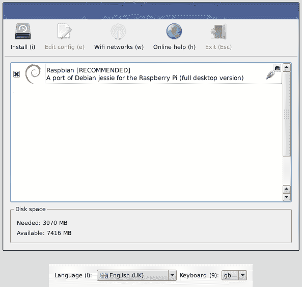
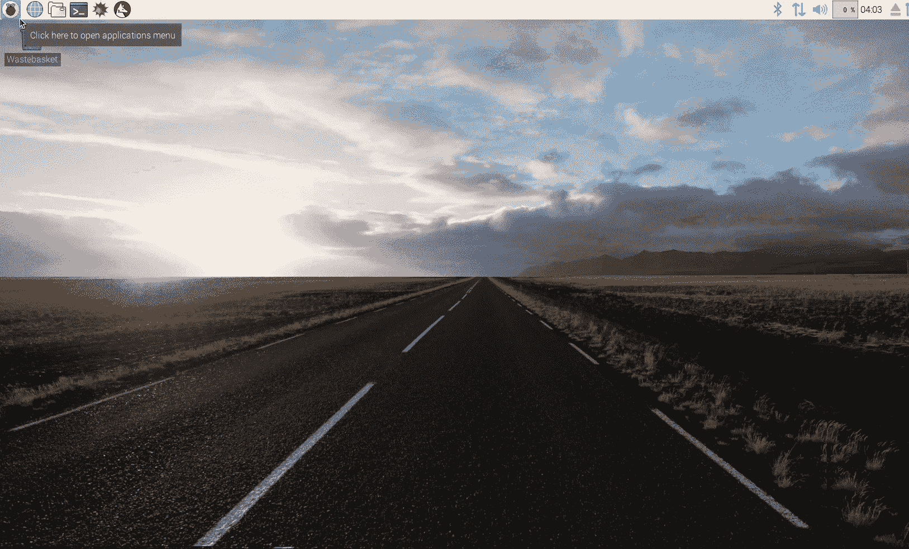
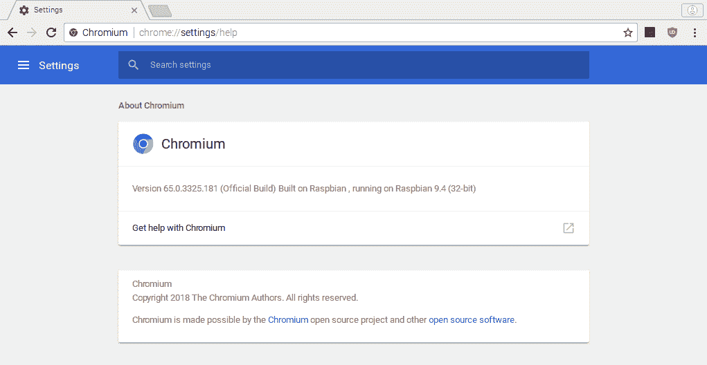
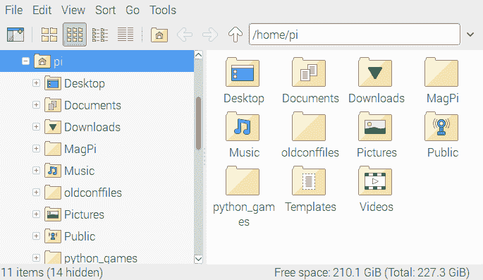
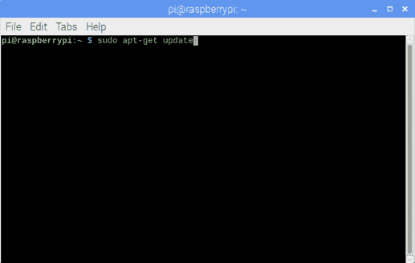
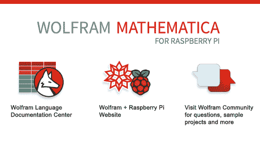
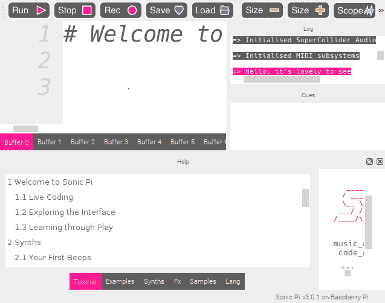

# 第一章：在树莓派上安装 Raspbian

树莓派被宣传为一台小巧实惠的计算机，您可以用来学习编程。至少这是它最初的目标。正如我们将在本书中看到的，它远不止于此。

本章将涵盖以下主题：

+   树莓派的简要历史

+   树莓派的操作系统

+   安装 Raspbian 操作系统

+   Raspbian 操作系统的快速概述

# 树莓派的简要历史

首次发布于 2012 年，第一代树莓派配备了 700 MHz 单核处理器和 256 MB 内存。树莓派 2 于 2015 年 2 月发布，配备了 900 MHz 四核处理器和 1 GB 内存。树莓派 3 于 2016 年 2 月发布，将处理器速度提高到 1.2 GHz。这款型号还是第一款包含无线局域网和蓝牙的型号。

以下是 2015 年树莓派 3 B 的图片：

这个版本的树莓派包括以下部分：

+   四个 USB 2 端口

+   一个 LAN 端口

+   一个 3.5 毫米复合视频和音频插孔

+   用于视频和音频的 HDMI 端口

+   一个 OTG USB 端口（我们将用它连接电源）

+   一个 microSD 插槽（用于放置我们的操作系统）

+   用于树莓派触摸屏的 DSI 显示端口

+   通用输入输出（GPIO）引脚

+   一个用于特殊树莓派摄像头的摄像头端口

树莓派 Zero 于 2015 年 11 月发布。以下是它的图片：

尽管不如之前的树莓派强大，Zero 的尺寸更小（65 毫米 X 30 毫米），非常适合空间有限的项目（即可穿戴项目）。此外，树莓派 Zero 的价格为 5 美元，非常实惠。树莓派 Zero W 于 2017 年 2 月 28 日发布，价格翻倍（10 美元），内置 Wi-Fi 和蓝牙功能。

截至撰写本文时，最新型号是于 2018 年 3 月 14 日发布的树莓派 3 B+。处理器速度已升级至 1.4 GHz，无线局域网现在支持 2.4 GHz 和 5 GHz 频段。另一个升级是增加了低功耗蓝牙，这是一种为不需要大量数据交换但需要长电池寿命的应用程序而设计的技术。

树莓派的创造者最初认为他们最多只能卖出 1000 台。他们不知道他们的发明会爆炸式地受欢迎。截至 2018 年 3 月，树莓派计算机的销量已经超过了 1900 万台。

# 树莓派的操作系统

可以安装在树莓派上的各种操作系统（或系统镜像）从特定应用程序的操作系统，如音频播放器，到各种通用操作系统。树莓派的强大之处在于它可以用于各种应用和项目。

以下是一些适用于树莓派的操作系统（系统镜像）的列表：

+   Volumio：您是否想要建立一个网络音频系统，通过计算机或手机访问您的音乐列表？Volumio 可能是您正在寻找的东西。在树莓派上安装它可以创建一个无头音频播放器（不需要键盘和鼠标的系统），通过 USB 或网络连接到您的音频文件。可以添加一个特殊的音频 HAT（硬件附加在顶部）到您的 Pi 上，以提供纯净的音频连接到放大器和扬声器。甚至有一个插件可以添加 Spotify，这样您就可以设置您的树莓派访问这项服务，并在您的音响系统上播放音乐。

+   **PiFM 无线电发射器**：PiFM 无线电发射器将您的树莓派变成 FM 发射器，您可以使用它将音频文件通过空气发送到标准 FM 收音机。通过连接到 GPIO 引脚之一的简单导线（我们稍后将了解更多关于 GPIO 的知识），您可以为传输的 FM 信号创建天线，这个信号出奇地强。

+   **Stratux**：ADS-B 是航空领域的新标准，其中地理位置和天气信息与地面控制器和飞行员共享。 Stratux 镜像与附加硬件将树莓派变成这些信息的 ADS-B 接收器。

+   **RetroPie**：RetroPie 将您的树莓派变成一个复古游戏主机，通过模拟过去的游戏主机和计算机。一些模拟包括 Amiga，Apple II，Atari 2600 和 20 世纪 80 年代初的任天堂娱乐系统。

+   **OctoPi**：OctoPi 将您的树莓派变成 3D 打印机的服务器。通过 OctoPi，您可以通过网络控制您的 3D 打印机，包括使用网络摄像头查看您的 3D 打印机的状态。

+   **NOOBS**：这可能是在树莓派上安装操作系统的最简单方法。NOOBS 代表 New Out-Of-the Box Software，我们将使用 NOOBS 来安装 Raspbian。

# 项目概述

在这个项目中，我们将在我们的树莓派上安装 Raspbian 操作系统。安装完成后，我们将快速浏览操作系统以熟悉它。我们将首先格式化一个 microSD 卡来存储我们的安装文件。然后我们将从 microSD 卡运行安装。Raspbian 安装完成后，我们将快速浏览一下以熟悉它。

这个项目应该需要大约两个小时来完成，因为我们安装 Raspbian 操作系统并快速浏览一下。

# 入门

完成此项目需要以下内容：

+   一个树莓派 3 型（2015 年或更新型号）

+   USB 电源适配器

+   计算机显示器

+   USB 键盘

+   USB 鼠标

+   一个 microSD RAM 卡

+   树莓派 NOOBS 镜像（[`www.raspberrypi.org/downloads/noobs/`](https://www.raspberrypi.org/downloads/noobs/)）

# 安装 Raspbian 操作系统

Raspbian 操作系统被认为是树莓派的默认操作系统。在本节中，我们将使用 NOOBS 镜像安装 Raspbian。

# 为 Raspbian 格式化 microSD 卡

树莓派使用 microSD 卡存储操作系统。这使您可以轻松地在不同的操作系统（系统镜像）之间切换，用于您的树莓派。我们将使用 NOOBS 镜像为我们的项目安装默认的 Raspbian 操作系统。

首先将 microSD 卡插入 USB 适配器，然后插入计算机：

您可能需要格式化 microSD 卡。如果需要，使用适合您计算机操作系统的工具将卡格式化为 FAT32。建议使用容量为 8GB 或更大的卡。对于 Windows 操作系统和容量为 64GB 或更大的卡，应使用第三方工具（如 FAT32 格式）进行格式化。

# 将 NOOBS 文件复制到 microSD RAM

解压您下载的 NOOBS 镜像。打开解压后的目录，将文件拖到 microSD 卡上。

文件应该与以下截图中的一样：

# 运行安装程序

现在我们将在树莓派上安装 Raspbian。这一步骤对于之前有安装 Windows 或 macOS 等操作系统经验的人来说应该很熟悉。Raspbian 操作系统将被安装并在我们的 microSD 卡上运行。

要在我们的 microSD 卡上安装 Raspbian，请执行以下操作：

1.  首先将 microSD 卡插入 Raspberry Pi 上的适当插槽。 请确保安装时标签面（暴露的接触面的对面）朝上。 将其与金属接触面朝向板子插入。 microSD 卡的标签面顶部应该有一个微小的凸起，方便用指甲轻松取出。

1.  将键盘和鼠标插入侧面的 USB 插槽，将显示器插入 HDMI 端口，最后将 USB 电源线插入电源端口。 Raspberry Pi 没有开关，只要连接电源线，它就会启动：

1.  在初始的黑屏上滚动白色文本后，您应该会看到以下对话框：

1.  在上一个屏幕截图中，我们点击了语言选项。 对于我们的目的，我们将保持默认的英语（英国）。 我们还将保持标准的 gb 键盘。

1.  由于 Raspberry Pi 3 具有无线局域网，我们可以设置我们的 Wi-Fi（对于较旧的板，请将 Wi-Fi dongle 插入 USB 端口或使用有线 LAN 端口并跳过下一步）：

1.  单击 Wifi 网络（w）按钮。 使用单选按钮选择认证方法。 一些路由器配备了 WPS 按钮，可让您直接连接到路由器。 要使用“密码”方法，请选择密码认证单选按钮，并输入网络的密码。 连接到网络后，您将注意到现在有更多的操作系统选项可供选择：

1.  我们将选择顶部选项 Raspbian。 在 Raspbian [RECOMMENDED]旁边勾选框，然后单击对话框左上角的安装（i）按钮。 Raspbian 将开始安装在您的 Raspberry Pi 上。 您将看到一个带有先前图形的进度条，描述 Raspbian 操作系统的各种功能：

1.  进度条达到 100％后，计算机将重新启动，然后您将看到一个屏幕上的文本，然后默认桌面加载：

# Raspbian OS 的快速概述

Raspbian 桌面与其他操作系统（如 Windows 和 macOS）的桌面类似。 点击左上角的按钮会弹出应用程序菜单，您可以在其中访问各种预安装的程序。 我们还可以从此菜单关闭 Raspberry Pi：

# Chromium 网络浏览器

从左边数第二个按钮加载 Raspberry Pi 的 Google Chromium 网络浏览器：

Chromium 浏览器是一款轻量级浏览器，在 Raspberry Pi 上运行非常出色：

# home 文件夹

双文件夹按钮打开一个窗口，显示`home`文件夹：

`home`文件夹是在 Raspberry Pi 上查找文件的好地方。 实际上，当您使用`scrot`命令或 Print Screen 按钮进行截图时，文件会自动存储在此文件夹中：

# 终端

从左边数第三个按钮打开终端。 终端允许命令行访问 Raspberry Pi 的文件和程序：

就是从命令行中，您可以使用`sudo apt-get update`和`sudo apt-get dist-upgrade`命令来更新 Raspberry Pi。

`apt-get`更新软件包列表，`apt-get dist-upgrade`更新软件包：

在安装 Raspbian 后，建议立即运行这两个命令，使用`sudo`命令。Raspberry Pi 上 Raspbian 的默认用户是`pi`，属于 Raspbian 中的超级用户组，因此必须使用`sudo`命令（`pi`用户的默认密码是`raspberry`）：

掌握命令行是许多程序员渴望掌握的一种技能。能够快速输入命令看起来很酷，甚至连电影制作人也注意到了（你上次看到电影中的电脑高手用鼠标在屏幕上点击是什么时候？）。为了帮助你成为这样一个超酷的电脑高手，这里有一些基本的 Raspbian 命令供你在终端中掌握：

`ls`：查看当前目录内容的命令

`cd`：切换目录的命令。例如，使用`cd`从当前目录上移一个目录

`pwd`：显示当前目录的命令

`sudo`：允许用户以超级用户的身份执行任务

`shutdown`：允许用户从终端命令行关闭计算机的命令

# Mathematica

第三和第四个按钮分别用于 Mathematica 和访问 Wolfram 语言的终端：

Mathematica 涵盖技术计算的各个领域，并使用 Wolfram 语言作为编程语言。Mathematica 的应用领域包括机器学习、图像处理、神经网络和数据科学：

Mathematica 是一款专有软件，于 1988 年首次发布，通过 2013 年底宣布的合作伙伴关系，可以在 Raspberry Pi 上免费使用个人版。

现在让我们来看一些从主下拉菜单中访问的程序。

# Sonic Pi

Sonic Pi 是一个用于创建电子音乐的实时编码环境。可以从编程菜单选项中访问。Sonic Pi 是一种创造音乐的创新方式，用户可以通过实时剪切和粘贴代码来编写循环、琶音和音景。Sonic Pi 中的合成器可以进行深层配置，为音乐编码者提供定制体验：

Sonic Pi 主要面向电子舞曲风格的音乐，也可以用来创作古典和爵士音乐风格。

# Scratch 和 Scratch 2.0

Scratch 和 Scratch 2.0 是为教授儿童编程而设计的可视化编程环境。使用 Scratch，程序员可以创建自己的动画，并使用循环和条件语句。

程序中可以创建游戏。Scratch 的第一个版本于 2003 年由麻省理工学院媒体实验室的终身幼儿园小组发布。Scratch 2.0 于 2013 年发布，目前正在开发 Scratch 3.0：

Scratch 和 Scratch 2.0 可以在编程菜单选项下访问。

# LibreOffice

LibreOffice 是一个免费开源的办公套件，于 2010 年从 OpenOffice 分支出来。LibreOffice 套件包括文字处理程序、电子表格程序、演示程序、矢量图形编辑器、用于创建和编辑数学公式的程序以及数据库管理程序。可以通过 LibreOffice 菜单选项访问 LibreOffice 程序套件：

# 总结

我们从 Raspberry Pi 的历史开始了本章。最初是为了推广编程教育给新一代人，现在已经发展成为一个全球现象。然后我们下载了 NOOBS 镜像并安装了 Raspbian 操作系统，这是 Raspberry Pi 的默认操作系统。这涉及格式化和准备 microSD 卡以安装 NOOBS 文件。

最容易认为像树莓派这样便宜小巧的计算机并不那么强大。我们证明了树莓派确实是一台非常有能力的计算机，因为我们看了一些预装在 Raspbian OS 上的应用程序。

在第二章中，*使用树莓派编写 Python 程序*，我们将开始使用树莓派和 Raspbian 中提供的一些开发工具进行 Python 编码。

# 问题

1.  第一款树莓派是在哪一年推出的？

1.  树莓派 3 Model B+相比上一个版本有哪些升级？

1.  NOOBS 代表什么？

1.  预装应用程序的名称是什么，它允许使用 Python 代码创建音乐？

1.  树莓派的操作系统存储在哪里？

1.  为儿童设计的可视化编程环境的名称是什么，它预装在 Raspbian 中？

1.  Mathematica 中使用的语言名称是什么？

1.  Raspbian 的默认用户名和密码是什么？

1.  GPIO 代表什么？

1.  RetroPie 是什么？

1.  真或假？单击主栏上的两个文件夹图标会加载“主目录”文件夹。

1.  真或假？microSD 卡槽位于树莓派的底部。

1.  真或假？要关闭树莓派，从应用程序菜单中选择关闭。

1.  真或假？只能使用 NOOBS 安装 Raspbian OS。

1.  真或假？蓝牙低功耗是指吃了太多蓝莓并且早上很难醒来的人。

# 进一步阅读

有关树莓派的更多信息，请参阅[www.raspberrypi.org](http://www.raspberrypi.org)上的主要树莓派网站。
