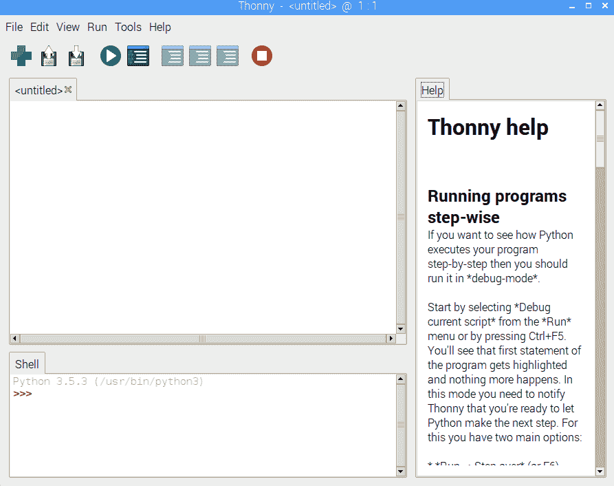
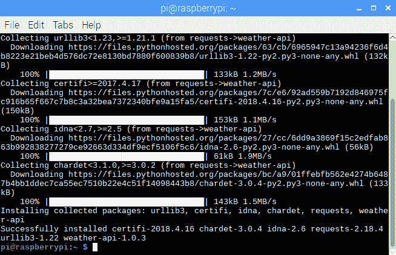
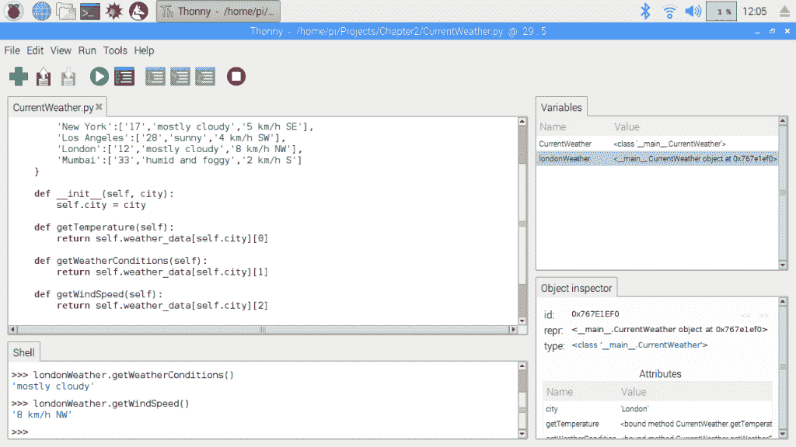

# 第二章：使用树莓派编写 Python 程序

在本章中，我们将开始使用树莓派编写 Python 程序。Python 是树莓派的官方编程语言，并由 Pi 代表在名称中。

本章将涵盖以下主题：

+   树莓派的 Python 工具

+   使用 Python 命令行

+   编写一个简单的 Python 程序

Python 在 Raspbian 上预装了两个版本，分别是版本 2.7.14 和 3.6.5（截至目前为止），分别代表 Python 2 和 Python 3。这两个版本之间的区别超出了本书的范围。在本书中，我们将使用 Python 3，除非另有说明。

# 项目概述

在这个项目中，我们将熟悉树莓派上的 Python 开发。您可能已经习惯了在其他系统（如 Windows、macOS 和 Linux）上使用的开发工具或集成开发环境（IDE）。在本章中，我们将开始使用树莓派作为开发机器。随着我们开始使用 Python，我们将慢慢熟悉开发。

# 技术要求

完成此项目需要以下内容：

+   树莓派 3 型号（2015 年或更新型号）

+   USB 电源供应

+   计算机显示器

+   USB 键盘

+   USB 鼠标

# 树莓派的 Python 工具

以下是预装的工具，我们可以在树莓派上使用 Raspbian 进行 Python 开发。这个列表绝不是我们可以用于开发的唯一工具。

# 终端

由于 Python 预装在 Raspbian 上，启动它的简单方法是使用终端。如下面的屏幕截图所示，可以通过在终端窗口中输入`python`作为命令提示符来访问 Python 解释器：


我们可以通过运行最简单的程序来测试它：

```py
print 'hello'
```

注意命令后的 Python 版本，2.7.13。在 Raspbian 中，`python`命令与 Python 2 绑定。为了访问 Python 3，我们必须在终端窗口中输入`python3`命令：


# 集成开发和学习环境

自从版本 1.5.2 起，**集成开发和学习环境**（**IDLE**）一直是 Python 的默认 IDE。它本身是用 Python 编写的，使用 Tkinter GUI 工具包，并且旨在成为初学者的简单 IDE：


IDLE 具有多窗口文本编辑器，具有自动完成、语法高亮和智能缩进。对于使用过 Python 的任何人来说，IDLE 应该是很熟悉的。在 Raspbian 中有两个版本的 IDLE，一个用于 Python 2，另一个用于 Python 3。这两个程序都可以从应用程序菜单 | 编程中访问。

# Thonny

Thonny 是随 Raspbian 捆绑的 IDE。使用 Thonny，我们可以使用`debug`函数评估表达式。Thonny 也适用于 macOS 和 Windows。

要加载 Thonny，转到应用程序菜单 | 编程 | Thonny：



上面是 Thonny 的默认屏幕。可以从“视图”菜单中打开和关闭查看程序中的变量的面板，以及查看文件系统的面板。Thonny 的紧凑结构使其非常适合我们的项目。

随着我们继续阅读本书的其余部分，我们将更多地了解 Thonny。

# 使用 Python 命令行

让我们开始编写一些代码。每当我开始使用新的操作系统进行开发时，我都喜欢回顾一些基础知识，以便重新熟悉（我特别是在凌晨熬夜编码的时候）。

从终端最简单地访问 Python。我们将运行一个简单的程序来开始。从主工具栏加载终端，然后在提示符处输入`python3`。输入以下行并按*Enter*：

```py
from datetime import datetime
```

这行代码将`datetime`模块中的`datetime`对象加载到我们的 Python 实例中。接下来输入以下内容并按*Enter*：

```py
print(datetime.now())
```

你应该看到当前日期和时间被打印到屏幕上：


让我们再试一个例子。在 shell 中输入以下内容：

```py
import pyjokes
```


这是一个用来讲编程笑话的库。要打印一个笑话，输入以下内容并按*Enter*：

```py
pyjokes.get_joke()
```

你应该看到以下输出：


好的，也许这不是你的菜（对于 Java 程序员来说，也许是咖啡）。然而，这个例子展示了导入 Python 模块并利用它是多么容易。

如果你收到`ImportError`，那是因为`pyjokes`没有预先安装在你的操作系统版本中。类似以下例子，输入`sudo pip3 install pyjokes`将会在你的树莓派上安装`pyjokes`。

这些 Python 模块的共同之处在于它们可以供我们使用。我们只需要直接将它们导入到 shell 中以便使用，因为它们已经预先安装在我们的 Raspbian 操作系统中。但是，那些未安装的库呢？

让我们试一个例子。在 Python shell 中，输入以下内容并按*Enter*：

```py
import weather
```

你应该看到以下内容：


由于`weather`包没有安装在我们的树莓派上，我们在尝试导入时会收到错误。为了安装这个包，我们使用 Python 命令行实用程序`pip`，或者在我们的情况下，使用`pip3`来进行 Python 3：

1.  打开一个新的终端（确保你在终端会话中，而不是 Python shell 中）。输入以下内容：

```py
pip3 install weather-api
```

1.  按*Enter*。你会看到以下内容：



1.  进程完成后，我们将在树莓派上安装`weather-api`包。这个包将允许我们从 Yahoo! Weather 获取天气信息。

现在让我们试一些例子：

1.  输入`python3`并按*Enter*。现在你应该回到 Python shell 中了。

1.  输入以下内容并按*Enter*：

```py
from weather import Weather 
from weather import Unit
```

1.  我们已经从`weather`中导入了`Weather`和`Unit`。输入以下内容并按*Enter*：

```py
 weather = Weather(unit=Unit.CELSIUS)
```

1.  这实例化了一个名为`weather`的`weather`对象。现在，让我们使用这个对象。输入以下内容并按*Enter*：

```py
lookup = weather.lookup(4118)
```

1.  我们现在有一个名为`lookup`的变量，它是用代码`4118`创建的，对应于加拿大多伦多市。输入以下内容并按*Enter*：

```py
condition = lookup.condition
```

1.  我们现在有一个名为`condition`的变量，它包含了通过`lookup`变量获取的多伦多市的当前天气信息。要查看这些信息，输入以下内容并按*Enter*：

```py
print(condition.text)
```

1.  你应该得到多伦多市的天气状况描述。当我运行时，返回了以下内容：

```py
Partly Cloudy
```

现在我们已经看到，在树莓派上编写 Python 代码与在其他操作系统上编写一样简单，让我们再进一步编写一个简单的程序。我们将使用 Thonny 来完成这个任务。

Python 模块是一个包含可供导入使用的代码的单个 Python 文件。Python 包是一组 Python 模块。

# 编写一个简单的 Python 程序

我们将编写一个简单的 Python 程序，其中包含一个类。为此，我们将使用 Thonny，这是一个预先安装在 Raspbian 上并具有出色的调试和变量内省功能的 Python IDE。你会发现它的易用性使其成为我们项目开发的理想选择。

# 创建类

我们将从创建一个类开始我们的程序。类可以被看作是创建对象的模板。一个类包含方法和变量。要在 Thonny 中创建一个 Python 类，做如下操作：

1.  通过应用菜单 | 编程 | Thonny 加载 Thonny。从左上角选择新建并输入以下代码：

```py
class CurrentWeather:
    weather_data={'Toronto':['13','partly sunny','8 km/h NW'], 'Montreal':['16','mostly sunny','22 km/h W'],
                'Vancouver':['18','thunder showers','10 km/h NE'],
                'New York':['17','mostly cloudy','5 km/h SE'],
                'Los Angeles':['28','sunny','4 km/h SW'],
                'London':['12','mostly cloudy','8 km/h NW'],
                'Mumbai':['33','humid and foggy','2 km/h S']
                 }

     def __init__(self, city):
         self.city = city 

     def getTemperature(self):
         return self.weather_data[self.city][0]

     def getWeatherConditions(self):
         return self.weather_data[self.city][1]

     def getWindSpeed(self):
         return self.weather_data[self.city][2]
```

正如您所看到的，我们创建了一个名为`CurrentWeather`的类，它将保存我们为其实例化类的任何城市的天气条件。我们使用类是因为它将允许我们保持我们的代码清晰，并为以后使用外部类做好准备。

# 创建对象

我们现在将从我们的`CurrentWeather`类创建一个对象。我们将使用`London`作为我们的城市：

1.  单击顶部菜单中的“运行当前脚本”按钮（一个带有白色箭头的绿色圆圈）将我们的代码加载到 Python 解释器中。

1.  在 Thonny shell 的命令行上，输入以下内容并按*Enter*键：

```py
londonWeather = CurrentWeather('London')
```

我们刚刚在我们的代码中创建了一个名为`londonWeather`的对象，来自我们的`CurrentWeather`类。通过将`'London'`传递给构造函数（`init`），我们将我们的新对象设置为仅发送`London`城市的天气信息。这是通过类属性`city`（`self.city`）完成的。

1.  在 shell 命令行上输入以下内容：

```py
weatherLondon.getTemperature()
```

您应该在下一行得到答案`'12'`。

1.  要查看`London`的天气条件，请输入以下内容：

```py
weatherLondon.getWeatherConditions()
```

您应该在下一行看到“'大部分多云'”。

1.  要获取风速，请输入以下内容并按*Enter*键：

```py
weatherLondon.getWindSpeed()
```

您应该在下一行得到`8 km/h NW`。

我们的`CurrentWeather`类模拟了来自天气数据的网络服务的数据。我们类中的实际数据存储在`weather_data`变量中。

在以后的代码中，尽可能地将对网络服务的调用封装在类中，以便保持组织和使代码更易读。

# 使用对象检查器

让我们对我们的代码进行一些分析：

1.  从“视图”菜单中，选择“对象检查器”和“变量”。您应该看到以下内容：



1.  在“变量”选项卡下突出显示`londonWeather`变量。我们可以看到`londonWeather`是`CurrentWeather`类型的对象。在对象检查器中，我们还可以看到属性`city`设置为`'London'`。这种类型的变量检查在故障排除代码中非常宝贵。

# 测试您的类

在编写代码时测试代码非常重要，这样您就可以尽早地捕获错误：

1.  将以下函数添加到`CurrentWeather`类中：

```py
 def getCity(self):
     return self.city
```

1.  将以下内容添加到`CurrentWeather.py`的底部。第一行应该与类定义具有相同的缩进，因为此函数不是类的一部分：

```py
if __name__ == "__main__":
    currentWeather = CurrentWeather('Toronto')
    wind_dir_str_len = 2

    if currentWeather.getWindSpeed()[-2:-1] == ' ':
        wind_dir_str_len = 1

     print("The current temperature in",
            currentWeather.getCity(),"is",
            currentWeather.getTemperature(),
            "degrees Celsius,",
            "the weather conditions are",
            currentWeather.getWeatherConditions(),
            "and the wind is coming out of the",
            currentWeather.getWindSpeed()[-(wind_dir_str_len):],
            "direction with a speed of",
            currentWeather.getWindSpeed()
            [0:len(currentWeather.getWindSpeed())
            -(wind_dir_str_len)]
            )
```

1.  通过单击“运行当前脚本”按钮来运行代码。您应该看到以下内容：

```py
The current temperature in Toronto is 13 degrees Celsius, the weather conditions are partly sunny and the wind is coming out of the NW direction with a speed of 8 km/h 
```

`if __name__ == "__main__":`函数允许我们直接在文件中测试类，因为`if`语句只有在直接运行文件时才为真。换句话说，对`CurrentWeather.py`的导入不会执行`if`语句后面的代码。随着我们逐步阅读本书，我们将更多地探索这种方法。

# 使代码灵活

更通用的代码更灵活。以下是我们可以使代码更少具体的两个例子。

# 例一

`wind_dir_str_len`变量用于确定风向字符串的长度。例如，`S`方向只使用一个字符，而 NW 则使用两个。这样做是为了在方向仅由一个字符表示时，不包括额外的空格在我们的输出中：

```py
wind_dir_str_len = 2
if currentWeather.getWindSpeed()[-2:-1] == ' ':
    wind_dir_str_len = 1
```

通过使用`[-2:-1]`来寻找空格，我们可以确定这个字符串的长度，并在有空格时将其更改为`1`（因为我们从字符串的末尾返回两个字符）。

# 例二

通过向我们的类添加`getCity`方法，我们能够创建更通用名称的类，如`currentWeather`，而不是`torontoWeather`。这使得我们可以轻松地重用我们的代码。我们可以通过更改以下行来演示这一点：

```py
currentWeather = CurrentWeather('Toronto') 
```

我们将其更改为：

```py
currentWeather = CurrentWeather('Mumbai')
```

如果我们再次单击“运行”按钮运行代码，我们将得到句子中所有条件的不同值：

```py
The current temperature in Mumbai is 33 degrees Celsius, the weather conditions are humid and foggy and the wind is coming out of the S direction with a speed of 2 km/h 
```

# 总结

我们开始本章时讨论了 Raspbian 中可用的各种 Python 开发工具。在终端窗口中运行 Python 的最快最简单的方法。由于 Python 预先安装在 Raspbian 中，因此在终端提示符中使用`python`命令加载 Python（在本例中为 Python 2）。无需设置环境变量即可使命令找到程序。通过输入`python3`在终端中运行 Python 3。

我们还简要介绍了 IDLE，这是 Python 开发的默认 IDE。IDLE 代表集成开发和学习环境，是初学者学习 Python 时使用的绝佳工具。

Thonny 是另一个预先安装在 Raspbian 上的 Python IDE。Thonny 具有出色的调试和变量内省功能。它也是为初学者设计的 Python 开发工具，但是其易用性和对象检查器使其成为我们项目开发的理想选择。随着我们在书中的进展，我们将更多地使用 Thonny。

然后，我们立即开始编程，以激发我们的开发热情。我们从使用终端进行简单表达式开始，并以天气数据示例结束，该示例旨在模拟用于调用 Web 服务的对象。

在第三章中，*使用 GPIO 连接到外部世界*，我们将立即进入树莓派上编程最强大的功能，即 GPIO。 GPIO 允许我们通过连接到树莓派上的此端口的设备与现实世界进行交互。 GPIO 编程将使我们的 Python 技能提升到一个全新的水平。

# 问题

1.  Thonny 适用于哪些操作系统？

1.  我们如何从终端命令行进入 Python 2？

1.  Thonny 中的哪个工具用于查看对象内部的内容？

1.  给出两个原因，说明为什么我们在天气示例代码中使用对象。

1.  向`CurrentWeather`类添加一个名为`getCity`的方法的优点是什么？

1.  IDLE 是用哪种语言编写的？

1.  为了打印当前日期和时间，需要采取哪两个步骤？

1.  在我们的代码中，我们是如何补偿只用一个字母表示的风速方向的？

1.  `if __name__ =="__main__"`语句的作用是什么？

1.  IDLE 代表什么？

# 进一步阅读

*Dusty Phillips*的*Python 3 - 面向对象编程*，Packt Publishing。
