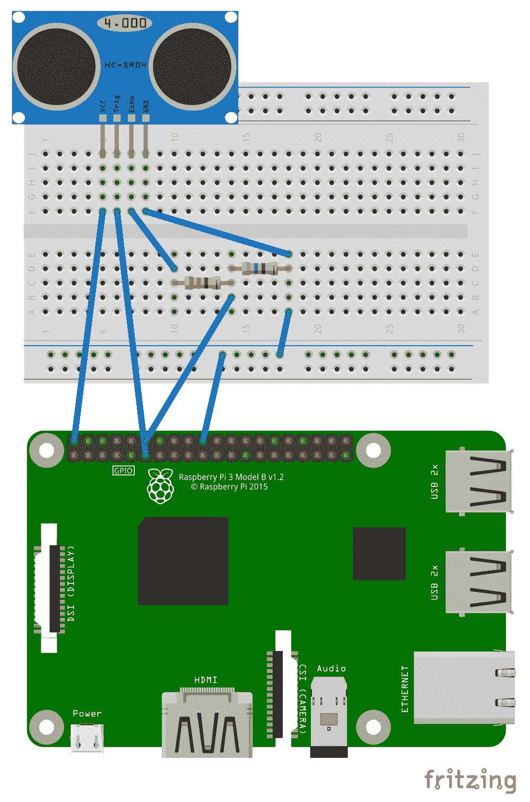
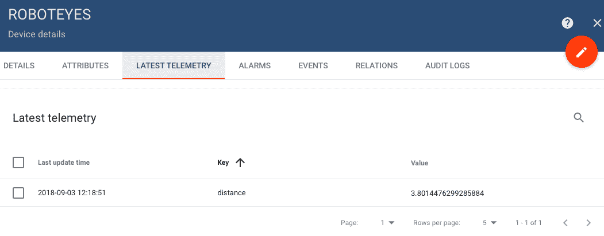
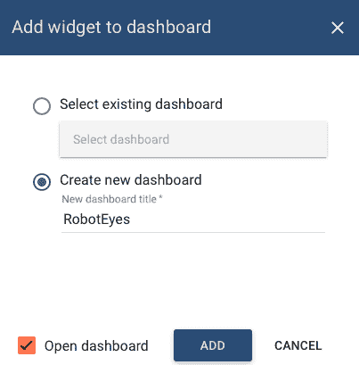

# 第十五章：将机器人汽车的感应输入连接到网络

为了使我们的机器人汽车 T.A.R.A.S 成为真正的物联网**设备**，我们必须将 T.A.R.A.S 连接到互联网。在本章中，我们将通过将 T.A.R.A.S 的距离传感器连接到网络，开始将桌面机器人转变为互联网机器人。

本章将涵盖以下主题：

+   识别机器人汽车上的传感器

+   使用 Python 读取机器人汽车的感应数据

+   将机器人汽车的感应数据发布到云端

# 完成本章所需的知识

要完成本章，您应该已经按照第十三章中详细描述的方式构建了 T.A.R.A.S 机器人汽车。与本书中的其他章节一样，需要具备 Python 的工作知识，以及对面向对象编程的基本理解。

# 项目概述

本章的项目将涉及将 T.A.R.A.S 的感应距离数据发送到互联网。我们将使用 ThingsBoard 创建一个在线仪表板，该仪表板将在模拟表盘上显示这些距离信息。

这个项目应该需要几个小时来完成。

# 入门

要完成这个项目，需要以下设备：

+   一个树莓派 3 型号（2015 年或更新型号）

+   一个 USB 电源供应

+   一台电脑显示器

+   一个 USB 键盘

+   一个 USB 鼠标

+   一个完成的 T.A.R.A.S 机器人汽车套件（参见第十三章，*介绍树莓派机器人汽车*）

# 识别机器人汽车上的传感器

在整本书的过程中，我们使用了一些输入传感器。我们还将这些传感器的数据发布到了互联网上。T.A.R.A.S 使用距离传感器来检测附近的物体，如下图所示：


第一次看到 T.A.R.A.S 时，您可能不知道距离传感器的位置在哪里。在 T.A.R.A.S 和许多其他机器人上，这个传感器位于眼睛位置。

以下是 HC-SR04 距离传感器的照片，即 T.A.R.A.S 上使用的传感器：


如果您在机器人上搜索 HC-SR04 的 Google 图片，您会看到很多使用这个传感器的机器人。由于其低成本和广泛可用性，以及其方便的眼睛外观，它是一个非常受欢迎的选择。

# 仔细观察 HC-SR04

如前所述，HC-SR04 是一个非常受欢迎的传感器。它易于编程，并且可以从[www.aliexpress.com](http://www.aliexpress.com)的多个供应商处获得。HC-SR04 提供从 2 厘米到 400 厘米的测量，并且精度在 3 毫米以内。

GPIO Zero 库使得从 HC-SR04 读取数据变得容易。以下图表是使用这个传感器与树莓派连接的接线图：



正如你所看到的，HC-SR04 有四个引脚，其中两个用于信号输入和输出。接线图是我们在第十三章中用来连接 T.A.R.A.S 的子图，*介绍树莓派机器人汽车*。连接如下：

+   从 HC-SR04（距离传感器）的 Trig 到树莓派的 17 号引脚

+   从 HC-SR04 的 Echo（距离传感器）到面包板上 330 欧姆电阻的左侧

+   从 HC-SR04 的 VCC（距离传感器）到树莓派的 5V

+   从电压分压器输出到树莓派的 18 号引脚

+   从 HC-SR04 的 GND 到面包板上 470 欧姆电阻的右侧

触发器是 HC-SR04 的输入，可使用 5V 或 3.3V。回波引脚是输出，设计用于 5V。由于这对我们的树莓派来说有点太多了，我们使用电压分压电路将电压降低到 3.3V。

我们本可以向 T.A.R.A.S 添加更多传感器，使其更加先进，包括线路跟踪传感器、温度传感器、光传感器和 PID 传感器。线路跟踪传感器尤其有趣，因为一个简单的线路可以为 T.A.R.A.S 提供在其安全巡逻任务期间跟随的路线，这是一个非常有用的补充。由于设计已经足够复杂，如果您选择的话，我将留给您添加这个功能。

以下图表概述了线路跟踪传感器的工作原理：


在图表中，您将看到机器人车前面有两个传感器。当机器人车偏离一侧时，其中一个传感器会检测到。在上一个示例中，位置为**B**的汽车已经向右偏离。左侧传感器会检测到这一点，并且程序通过将机器人车向左转动来进行校正，直到它返回到位置**A**。

# 使用 Python 读取机器人车的感知数据

虽然我们之前已经介绍过这个，但熟悉（或重新熟悉）HC-SR04 的编程是一个好主意：

1.  从应用程序菜单 | 编程 | Thonny Python IDE 中打开 Thonny。

1.  点击“新建”创建一个新文件。

1.  输入以下内容：

```py
from gpiozero import DistanceSensor
from time import sleep

distance_sensor = DistanceSensor(echo=18, trigger=17)

while True:
    print('Distance: ', distance_sensor.distance*100)
    sleep(1) 
```

1.  将文件保存为`distance-sensor-test.py`。

1.  运行代码。

1.  将手放在距离传感器前面。您应该在 shell 中看到以下内容（取决于您的手离距离传感器有多远）：

```py
Distance: 5.05452024001
```

1.  当您将手靠近或远离距离传感器时，数值会发生变化。这段代码相当容易理解。`distance_sensor = DistanceSensor(echo=18, trigger=17)`这一行设置了一个`DistanceSensor`类类型的`distance_sensor`对象，并设置了适当的引脚定义。每次调用`distance_sensor`的`distance`方法时，我们都会获取 HC-SR04 距离物体的距离。为了将值转换为厘米，我们将其乘以 100。

现在我们能够从距离传感器中检索值，让我们修改代码，使其更加面向对象友好：

1.  从应用程序菜单 | 编程 | Thonny Python IDE 中打开 Thonny

1.  点击“新建”创建一个新文件

1.  输入以下内容：

```py
from gpiozero import DistanceSensor
from time import sleep

class RobotEyes:

    distance_sensor = DistanceSensor(echo=18, trigger=17)

    def get_distance(self):
        return self.distance_sensor.distance*100

if __name__=="__main__":

    robot_eyes = RobotEyes()

    while True:
        print('Distance: ', robot_eyes.get_distance())
        sleep(1)
```

1.  将文件保存为`RobotEyes.py`

1.  运行代码

代码应该以完全相同的方式运行。我们所做的唯一的事情就是将它封装在一个类中，以便进行抽象。随着我们编写更多的代码，这将使事情变得更容易。我们不必记住 HC-SR04 连接到哪些引脚，实际上我们也不需要知道我们正在从中获取数据的是一个距离传感器。这段代码在视觉上比以前的代码更有意义。

# 将机器人车的感知数据发布到云端

在第十章中，*发布到 Web 服务*，我们设置了一个 ThingsBoard 账户来发布感知数据。如果您还没有这样做，请在[www.ThingsBoard.io](https://thingsboard.io/)上设置一个账户（参考第十章中的说明）。

# 创建一个 ThingsBoard 设备

要将我们的距离传感器数据发布到 ThingsBoard，我们首先需要创建一个 ThingsBoard 设备：

1.  登录到您的账户[`demo.thingsboard.io/login`](https://demo.thingsboard.io/login)

1.  点击“设备”，然后点击屏幕右下角的大橙色+号：


1.  在“名称”中输入`RobotEyes`，将设备类型保留为“默认”，并在“描述”下输入有意义的描述

1.  点击“添加”

1.  点击`RobotEyes`以从右侧滑出菜单

1.  点击“复制访问令牌”将令牌复制到剪贴板上

1.  将令牌粘贴到一个文本文件中

对于我们的代码，我们将使用 MQTT 协议。如果 Paho MQTT 库尚未安装在您的树莓派上，请执行以下操作：

1.  从树莓派主工具栏中打开一个终端应用程序

1.  输入`sudo pip3 install pho-mqtt`

您应该看到库已安装。

现在是时候编写代码，将 T.A.R.A.S 的感知数据发布到网络上了。我们将修改我们的`RobotEyes`类：

1.  从应用程序菜单|编程|Thonny Python IDE 中打开 Thonny

1.  点击新建创建一个新文件

1.  输入以下内容：

```py
from gpiozero import DistanceSensor
from time import sleep
import paho.mqtt.client as mqtt
import json

class RobotEyes:

    distance_sensor = DistanceSensor(echo=18, trigger=17)
    host = 'demo.thingsboard.io'
    access_token='<<access token>>'

    def get_distance(self):
        return self.distance_sensor.distance*100

    def publish_distance(self):
        distance = self.get_distance()
        sensor_data = {'distance': 0}
        sensor_data['distance'] = distance
        client = mqtt.Client()
        client.username_pw_set(self.access_token)
        client.connect(self.host, 1883, 20)
        client.publish('v1/devices/me/telemetry',
             json.dumps(sensor_data), 1)
        client.disconnect()

if __name__=="__main__":

    robot_eyes = RobotEyes()   
    while True:
        print('Distance: ', robot_eyes.get_distance())
        robot_eyes.publish_distance()
        sleep(5) 
```

1.  确保将访问令牌从文本文件粘贴到`access_token`变量中

1.  将文件保存为`RobotEyesIOT.py`

1.  运行代码

您应该在 shell 中看到`distance`值，就像以前一样。但是，当您转到 ThingsBoard 并单击最新遥测时，您应该看到相同的值，如下所示：



我们在这里所取得的成就，就像第十章中一样，*发布到 Web 服务*，成功地将我们的距离传感器信息传输到了互联网。现在，我们可以从世界上任何地方看到物体离我们的机器人车有多近。在上一张屏幕截图中，我们可以看到有*某物*离我们 3.801 厘米远。

再次，我们尽可能地使代码自解释。但是，我们应该指出类的`publish_distance`方法：

```py
def publish_distance(self):
 distance = self.get_distance()
 sensor_data = {'distance': 0}
 sensor_data['distance'] = distance
 client = mqtt.Client()
 client.username_pw_set(self.access_token)
 client.connect(self.host, 1883, 20)
 client.publish('v1/devices/me/telemetry',
 json.dumps((sensor_data), 1)
 client.disconnect()
```

在这种方法中，我们首先创建了一个名为`distance`的变量，我们用我们的类`get_distance`方法中的实际距离信息填充它。创建了一个名为`sensor_data`的 Python 字典对象，并用它来存储`distance`值。然后，我们创建了一个名为`client`的 MQTT 客户端对象。我们将密码设置为我们从 ThingsBoard 复制的`access_token`，然后使用标准的 ThingsBoard 样板代码进行连接。

`client.publish`方法通过`json.dumps`方法将我们的`sensor_data`发送到 ThingsBoard。然后，我们断开`client`以关闭连接。

现在，让我们使用我们的距离传感数据创建一个仪表板小部件：

1.  在 ThingsBoard 中，单击最新遥测，并在列表中的`distance`值旁边选中复选框：


1.  点击在小部件上显示

1.  在当前包中，从下拉菜单中选择`模拟表`，如下所示：


1.  选择最后一个小部件：


1.  点击顶部的添加到仪表板

1.  创建名为`RobotEyes`的新仪表板，并选中打开仪表板框：



1.  点击添加

1.  恭喜！我们现在已经为 T.A.R.A.S 的感知距离信息创建了一个物联网仪表板小部件。有了这个，我们可以全屏查看信息：


# 摘要

在本章中，我们通过将距离数据发布到互联网，将 T.A.R.A.S 变成了一个真正的物联网物体。通过将我们的代码封装到一个名为`RobotEyes`的类中，我们可以忘记我们正在处理距离传感器，只需专注于 T.A.R.A.S 的眼睛表现得像声纳一样。

通过 ThingsBoard 中的演示平台，我们能够编写代码，将 T.A.R.A.S 的距离信息发送到仪表板小部件以供显示。如果我们真的想要创造性地做，我们可以通过舵机连接一个实际的模拟设备，并以这种方式显示距离信息（就像我们在第六章中所做的那样，*使用舵机控制代码来控制模拟设备*）。在第十六章中，*使用 Web 服务调用控制机器人车*，我们将更进一步，开始从互联网上控制 T.A.R.A.S。

# 问题

1.  连接 HC-SR04 到树莓派时，为什么要使用电压分压电路？

1.  正确还是错误？T.A.R.A.S 通过声纳来看。

1.  ThingsBoard 中的设备是什么？

1.  正确还是错误？我们的类`RobotEyes`封装了 T.A.R.A.S 上使用的树莓派摄像头模块。

1.  `RobotEyes.publish_distance`方法是做什么的？

1.  真的还是假的？我们需要使用 MQTT 的库在 Raspbian 上预先安装。

1.  为什么我们将类命名为`RobotEyes`而不是`RobotDistanceSensor`？

1.  真的还是假的？将样板代码封装在一个类中会使代码更难处理。

1.  真的还是假的？GPIO Zero 库不支持距离传感器。

1.  `RobotEyes.py`和`RobotEyesIOT.py`之间有什么区别？

# 进一步阅读

ThingsBoard 平台的一个很好的指导来源是它自己的网站。访问[www.thingsboard.io/docs/guides](https://thingsboard.io/docs/guides/)获取更多信息。
