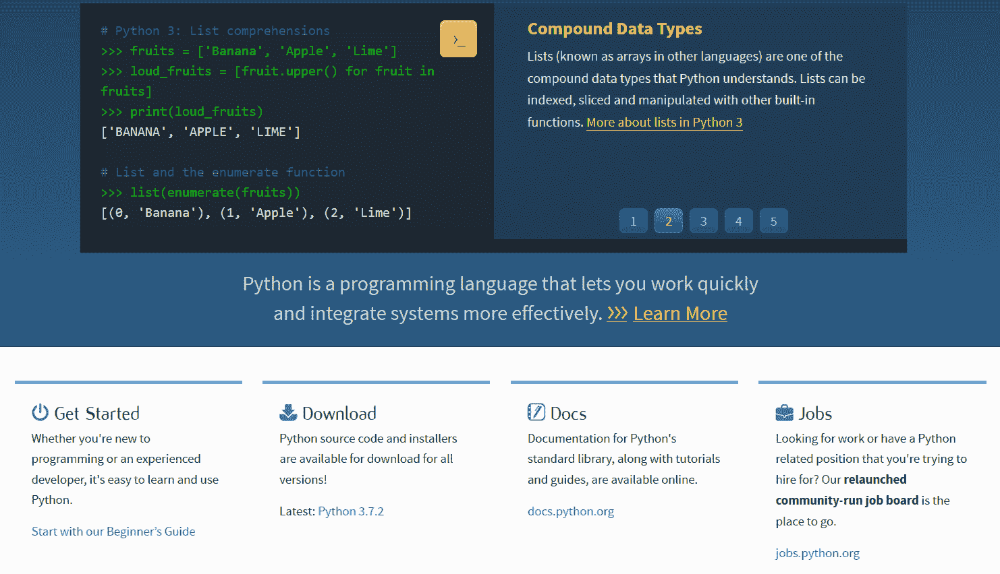
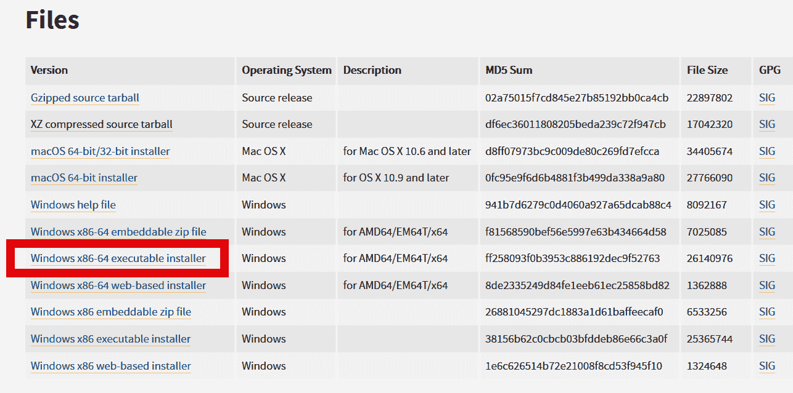
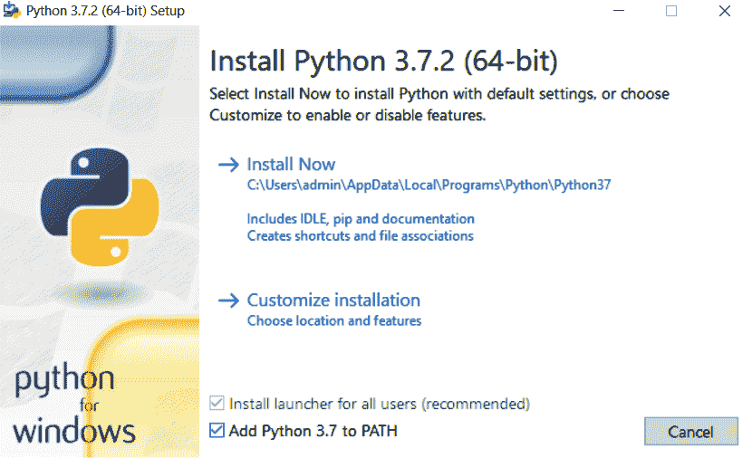
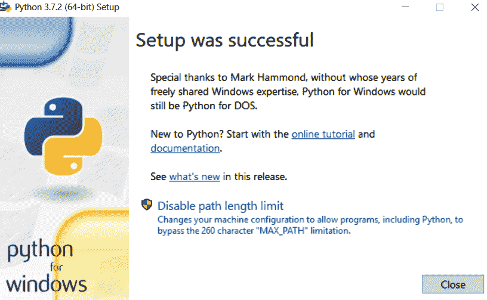
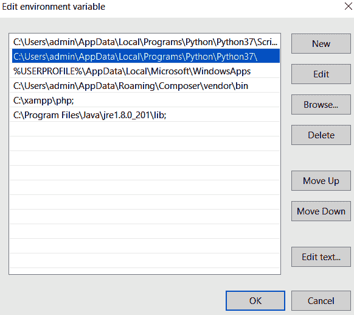
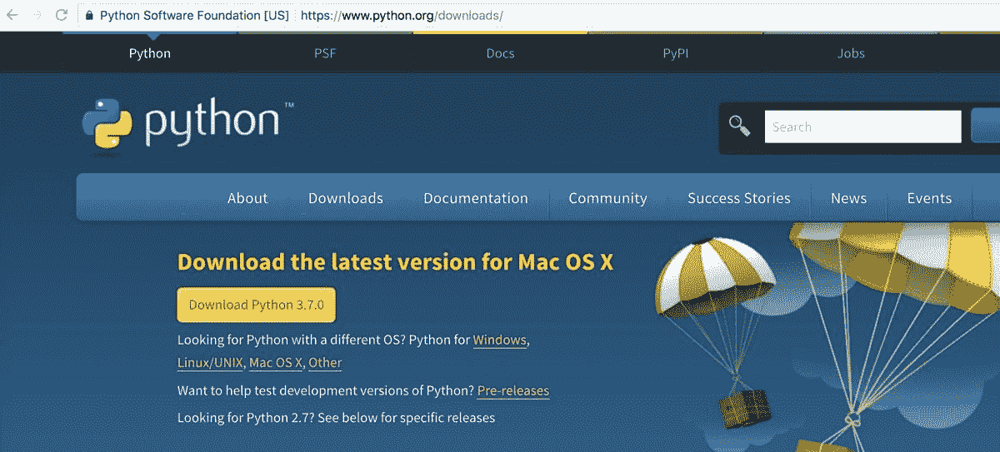
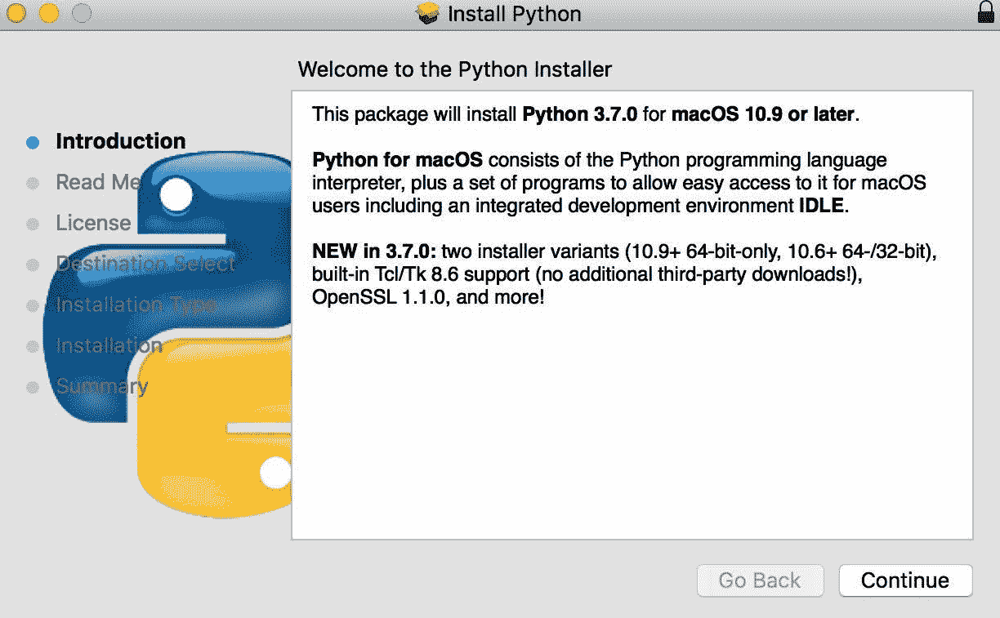
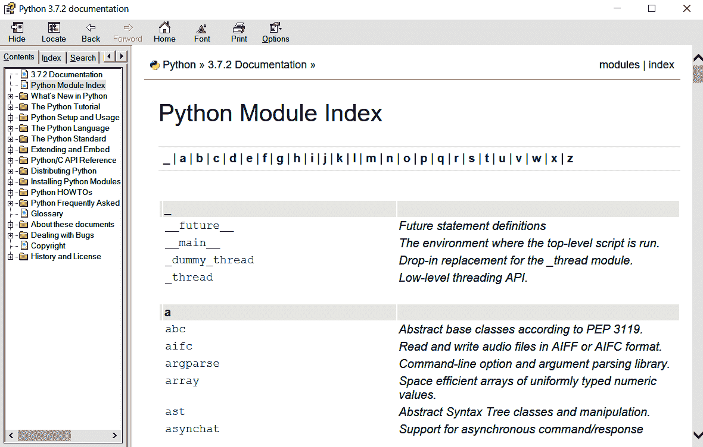
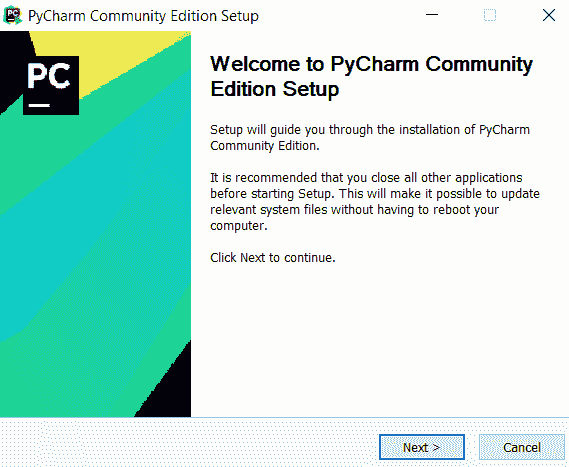
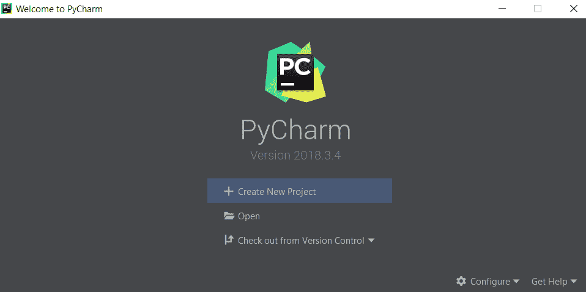

# 一、了解 Python——设置 Python 和编辑器

Python 在数据和分析行业臭名昭著，但在游戏行业它仍然是一个隐藏的工件。在使用 Unity 和 Godot 等其他游戏引擎制作游戏时，我们倾向于将设计逻辑与核心编程原则相结合。但是在 Python 的例子中，主要是对问题的分析和结合在一起的编程范例。程序流或结构是与其编程范例相吻合的序列。顾名思义，编程范例有助于程序员以最经济有效的方式编写问题的解决方案。例如，用两行代码而不是十行代码编写程序是使用编程范例的结果。程序流分析或结构分析的目的是揭示关于各种设计模式需要调用的过程的信息。

在本章中，我们将学习以下主题：

*   介绍 Python 编程
*   安装 Python
*   Python 的构建块
*   安装 pyide
*   没有*Hello World*的编程代码

# 技术要求

以下是本书所需的最低硬件要求列表：

*   具有最小 4GB RAM 的工作 PC
*   外部鼠标适配器（如果您使用笔记本电脑）
*   至少 5GB 的硬盘空间，用于下载外部 IDE 和 Python 软件包

您需要以下软件才能充分利用本书（我们将在本章中下载所有软件）：

*   各种开源 Python 包，如 pygame、pymunk 和 pyopenGL

*   Pycharm IDE（社区版），可在[找到 https://www.jetbrains.com/pycharm/](https://www.jetbrains.com/pycharm/)
*   各种开源软件包，如`pygame`和`pycharm`
*   本章的代码可以在本书的 GitHub 存储库中找到：[https://github.com/PacktPublishing/Learning-Python-by-building-games/tree/master/Chapter01](https://github.com/PacktPublishing/Learning-Python-by-building-games/tree/master/Chapter01)

请查看以下视频以查看代码的运行情况：

[http://bit.ly/2o2pVgA](http://bit.ly/2o2pVgA)

# 介绍 Python 编程

编程的古老格言如下：

"Coding is basically the computer language that's used to develop apps, websites, and software. Without it, we'd have none of the major technology we've come to rely on such as Facebook, our smartphones, the browser we choose to view our favorite blogs on, or even the blogs themselves. It all runs on code."

我们完全同意这一点。计算机编程可以是一项既有益又乏味的活动。有时，我们可能会遇到这样的情况：我们无法找到在程序中捕获的异常（程序的意外行为）的调整，后来，我们发现错误是由于错误的模块或错误的实践造成的。编写程序类似于*撰写论文*；首先，我们必须了解文章的模式；然后，我们分析主题并编写它们；最后，我们检查语法。

与写文章的过程类似，在编写代码时，我们必须分析编程语言的模式或语法，然后分析问题，然后编写程序。最后，我们检查它的语法，这通常是通过 alpha 和 beta 测试进行的。

这本书将试图把你变成一个能够分析问题，建立高尚逻辑，并提出解决问题的想法的人。我们不会让这次旅行单调乏味；相反，我们将通过在每章中构建游戏来学习 Python 语法。在本书的结尾，你会像一个程序员一样思考，也许不是一个专业的程序员，但至少你已经掌握了使用 Python 编写自己的程序的技能。

在本书中，您将学到两件至关重要的事情：

*   首先，您将学习 Python 的词汇和语法。我不是说学习 Python 理论或历史。首先，我们必须学习 Python 语法；然后，我们将看到如何使用该语法创建语句和表达式。此步骤包括收集数据和信息并将其存储在适当的数据结构中。
*   然后，您将了解调用适当方法的过程。这个过程包括使用在第一步中收集的数据来获得预期的输出。这第二步不是特定于任何编程语言的。这将教会我们各种编程原型，而不仅仅是 Python。

学习 Python 之后再学习任何其他编程语言都要容易得多。您将在其他编程语言中观察到的唯一区别是语法复杂性和程序调试工具。在本书中，我们将尝试学习尽可能多的编程范例，以便开始编程生涯。

你还不确定 Python 吗？

让我们来看看 Python 制作的一些产品：

*   没有一个列表一开始就提到谷歌。他们在网络搜索系统和页面排名算法中使用它。
*   迪士尼使用 Python 进行其创作过程。
*   BitTorrent 和 DropBox 是用 Python 编写的。

*   Mozilla Firefox 使用它来浏览内容，并且是 Python 软件包的主要贡献者。
*   NASA 将其用于科学目的。

名单上还有很多！

让我们来看看代码过程如何简单地工作。

# 解释代码过程

为了简单地解释代码过程是如何工作的，让我们以制作煎蛋饼为例。你从一本食谱开始学习基础知识。首先，你收集一些餐具，确保它们干净干燥。然后，把鸡蛋、盐和胡椒打匀。然后，在不粘锅中加入黄油，加入鸡蛋混合物，然后烹饪，甚至倾斜锅来检查煎蛋卷的每一部分是否都煮熟了。

在编程方面，首先，我们讨论收集工具，如餐具和鸡蛋，这与收集数据有关，这些数据将由我们在程序中编写的指令操纵。在那之后，我们讨论煮蛋，这是你的方法。我们通常在方法中操作数据，以获得对用户有意义的形式的输出。在这里，输出是一个煎蛋卷。

向程序发出指令是程序员的工作。但是让我们区分客户机和程序员。如果您使用的产品指示计算机为您执行任务，那么您就是客户，但如果您设计的指令将为您为每个人创建的产品完成任务，则表明您是程序员。对于一个或*对于每个*来说，确定用户是客户机还是程序员只是*的问题。*

我们将在 Windows 命令提示符或 Linux 终端中使用的一些指令将用于打开我们机器的目录。执行此操作有两种方法。您可以使用 GUI，也可以使用终端或命令提示符。如果您在相应的字段中键入`dir`命令，您现在告诉计算机在该位置显示目录。同样的事情也可以在任何编程语言中完成。在 Python 中，我们有一些模块可以为我们完成这项工作。我们必须先导入该模块，然后才能使用它。Python 提供了许多模块和库来执行此类操作。在过程编程语言（如 C）中，允许与内存进行低级交互，这使得编写代码更加困难，但在 Python 中，使用标准库更容易，这使得代码更短，可读性更强。《如何像学习 Python 的计算机科学家一样思考》一书的作者大卫·比兹利（David Beazley）曾被问到：*为什么要学习 Python？*他简单地回答说，*Python 非常有趣，而且效率更高*

 **# 与 Python 对话

Python 已经存在了很多年（将近 29 年），尽管它经历了所有的升级，它仍然是初学者最容易学习的语言。这主要是因为它可以与英语词汇相关联。与我们使用英语单词和词汇表生成语句的方式类似，我们可以使用 Python 语法编写语句和操作，命令可以解释、执行并向我们提供结果。我们可以用一个句子，比如*go there*作为一个命令，用条件和流控制来反映某物的位置。学习 Python 的语法非常容易；实际任务是使用 Python 提供的所有资源构建全新的逻辑来解决复杂的问题。仅仅学习基本语法和编写几个程序是远远不够的；你必须进行足够的练习，这样你才能想出革命性的想法来解决现实世界中的问题。

英语词典里有很多词汇。与英语词典不同，Python 的容器中只包含几个词，我们通常称之为保留词。总共有 33 个。它们是指示 Python 解释器执行特定操作的指令。不可能修改它们，它们只能用于执行特定任务。此外，当我们调用一个 print 语句并在其中写入一些文本时，我们希望它打印出该消息。如果你想制作一个从用户那里获取输入的程序，调用 print 语句是没有用的；必须调用 input 语句才能实现这一点。下表显示了我们的 33 个保留字：

| `False` | `class` | `finally` | `is` | `return` |
| `None` | `continue` | `for` | `lambda` | `try` |
| `True` | `def` | `from` | `nonlocal` | `while` |
| `and` | `del` | `global` | `not` | `with` |
| `as` | `elif` | `if` | `or` | `yield` |
| `assert` | `else` | `import` | `pass` |  |
| `break` | `except` | `in` | `raise` |  |

前面的每个词都可以在我们的英语词典中找到。此外，如果我们在字典里搜索`return`这个词，它只会给我们一个动词的意思：回到或回到原来的地方。Python 中使用了相同的语义；当您将 return 语句用于函数时，您就是在从函数中提取某些内容。在接下来的章节中，我们将看到所有这些关键字的作用。

现在我们已经开始学习如何通过检查 Python 的关键字来使用 Python 进行对话，我们将安装 Python。准备好你的装备，打开你的机器找点乐子。

# 安装 Python

在本节中，我们将介绍如何在 Windows 和 macOS 上安装 Python。

# 对于 Windows 平台

Python 不是预装在 Windows 上的。我们必须从它的官方网站手动下载，然后安装它。让我们看看如何做到这一点：

1.  首先，打开您最喜欢的浏览器，打开以下 URL:[https://www.Python.org/](https://www.python.org/) 。
2.  您将被引导到如下屏幕截图所示的页面。一旦您被重定向到 Python 的官方网站，您将看到三个部分：下载、文档和作业。单击页面底部的下载部分：



3.  您将看到一个文件列表，如下面的屏幕截图所示。选择适合您平台的文件。我们将在本节中介绍 Windows 的安装，因此我们将单击 Windows 可执行文件链接。这在以下屏幕截图中突出显示：



4.  点击后，你会得到一个需要下载的文件。打开下载的文件后，您将获得安装程序，如下所示：



5.  在安装程序中，确保选中“将 Python 添加到路径”框。这将把 Python 库文件放入我们的环境变量中，以便我们可以执行 Python 程序。之后，您将收到一条关于其成功安装的消息：



6.  按 Windows 键+*R*打开 Run，在 Run 选项卡中键入`cmd`打开 Windows 命令提示符。然后，在命令 shell 中键入`Python`：


如果您获得了前面屏幕截图中显示的 Python 版本，那么您的计算机上已经成功安装了 Python。祝贺现在，您可以用 Python 编写第一个程序了。

如果出现错误，说明**Python 未被识别为内部或外部命令**，则必须将 Python 显式添加到 path 环境变量中。请按照以下步骤执行此操作：

1.  打开控制面板，导航到系统和安全性，然后转到系统以查看有关系统的基本信息。
2.  打开高级系统设置，然后打开环境变量。。。。
3.  在变量部分，搜索路径。选择路径变量，然后按编辑。。。标签。
4.  在“编辑环境变量”选项卡中单击“新建”。
5.  添加此路径，使其指向 Python 安装目录，即 C:\Users\admin\AppData\Local\Programs\Python\Python37\。
6.  单击“确定”按钮保存这些更改：



现在，我们已经成功地安装了 Python for Windows。如果您使用的是 Mac，下一节也将帮助您访问 Python。

# 对于 Mac 平台

Python 与 Mac OS X 一起预装。要检查已安装的 Python 版本，应打开命令行并键入`Python --version`。如果您的版本号为 3.5 或更高版本，则无需执行安装过程，但如果您的版本为 2.7，则应按照以下说明下载可用的最新版本：

1.  Open your browser and type in [https://www.Python.org/downloads/](https://www.python.org/downloads/). You will be sent to the following page:

    

2.  Click on the macOS 64-bit/32-bit installer. You will be provided with a `.pkg` file. Download it. Then, navigate to that installed directory and click on that installer. You will see the following tab. Press Continue to initiate the installer:

    

无论何时下载 Python，都会在您的计算机上安装一个包包包。我们不能直接使用这些包，所以我们应该为每个独立的任务单独调用它们。为了编写程序，我们需要一个可以调用 Python 的环境，以便它能够为我们完成任务。在下一节中，我们将探索 Python 提供的用户友好环境，在这里我们可以编写自己的程序并运行它们以查看它们的输出。

现在您已经在 Mac OS X 上安装了 Python 版本 3.7，您可以打开终端并使用`python --version`命令检查 Python 版本。您将看到 Python 2.7.10。原因是 Mac OS X 预装了 2.7+版 Python。要使用较新版本的 Python，必须使用`python3`命令。在终端中键入以下命令并观察结果：

```py
python3 --version
```

现在，为了确保 Python 将解释器与您刚刚安装的较新版本一起使用，您可以使用别名技术将当前工作的 Python 版本替换为 Python3。要执行别名，必须遵循以下步骤：

1.  打开终端并键入`nano ~/.bash_profile`命令，使用 nano 编辑器打开 bash 文件。
2.  接下来，转到文件的末尾（在导入路径之后）并键入`alias python=python3`命令。要保存 nano 文件，请按*Ctrl*+*X*，然后按*Y*保存。

现在，再次打开您的终端并输入与我们之前检查 Python 版本时使用的相同的命令。它将被更新为 Python 的较新版本。从现在起，为了从 Mac 上运行任何 Python 文件，您可以使用这个 Python 命令，然后是文件或文件名的签名。

# 介绍 pythonshell 和 IDLE

pythonshell 类似于 Windows 的命令提示符以及 Linux 和 macosx 的终端，在这里您可以编写将在文件系统中执行的命令。这些命令的结果会立即在 shell 中打印出来。您还可以在任何终端中使用 Python 命令（>Python）直接访问这个 shell。结果将包含由于代码执行不当而导致的异常和错误，如下所示：

```py
>>> imput("Enter something")
Traceback (most recent call last):
  File "<pyshell#5>", line 1, in <module>
    imput()
NameError: name 'imput' is not defined

>>> I love Python
SyntaxError: invalid syntax
```

如您所见，我们遇到了一个错误，Python IDE 显式地告诉我们遇到的错误的名称，在本例中是`NameError`（一种语法错误）。`SyntaxError`由于错误的代码模式而发生。在前面的代码示例中，当您编写`I love Python`语法时，这对 Python 解释器没有任何意义。如果你想纠正这个问题，你应该写正确的命令或者正确地定义一些东西。用`imput`代替输入也是一种语法错误。

即使程序语法正确，也会发生逻辑错误或语义错误。但是，这并不能解决您的问题域。它们很危险，因为很难追踪。该程序是完全正确的，但并不能解决它想要解决的任何问题。

当您在机器上下载 Python 包时，一个名为 IDLE（Python 内置 IDE）的**Python****集成开发环境**（**IDE**）会自动下载到您的机器上。您可以在搜索栏中键入`IDLE`以导航到此环境。IDLE 是一个免费的开源程序，它提供了两个接口，您可以在其中编写代码。我们可以在空闲状态下编写脚本和终端命令。

现在我们已经熟悉了在 pythonshell 中不应该做什么，让我们来讨论一下 pythonshell 的细节——一个可以编写 Python 代码的环境。

# Python 外壳的详细信息

如前所述，在本节中，我们将介绍 Python 的细节。这包括 Python 的内置 shell、Python 的文本编辑器（通常称为 Python 脚本）和 Python 文档页面。

按照以下步骤了解 Python Shell 的详细信息：

1.  打开 Pythonshell 时，您将看到以下窗口。您将在 shell 中看到的第一件事是 Python 的当前版本号：


2.  在 pythonshell 中，有三个角括号彼此相邻，如下所示：`>>>`。您可以从那里开始编写代码：


3.  按*F1*打开 Python 文档，或转到“帮助”选项卡并单击 Python 文档 F1（在 Windows 计算机上）。要在线访问文档，请访问[https://docs.python.org/3/](https://docs.python.org/3/) ：


我希望您现在熟悉 pythonshell。我们将在 shell 中编写大量代码，因此请确保您通过定制或长时间使用此环境来熟悉它。完成后，您可以进入下一节，在这里您将了解在编写第一个 Python 程序之前需要了解的内容。

# Python 的构建块

在用 Python 编写程序时，我们可以使用一些常规模式。Python 是一种高级语言，它不关心低级例程，但具有与它们交互的能力。Python 由六个构建块组成。用 Python 编写的每个程序都围绕着它们运行。这些构建块包括输入、输出、顺序执行、条件、递归和重用。现在让我们看一下：

*   **输入**：输入无处不在。如果使用 Python 制作应用程序，它主要处理格式化用户输入的方式，从而获得有意义的结果。Python 中有一个内置的`input()`方法，我们可以从用户那里获得数据输入。
*   **输出**：在我们对用户输入的数据进行操作后，是我们展示它的时候了。在这一层中，我们使用设计工具和表示工具来格式化有意义的输出并将其发送给用户。

*   **顺序执行**：保留语句的执行顺序。在 Python 中，我们通常使用缩进，即表示作用域的空格。任何处于零级缩进的命令都将首先执行。
*   **条件**：这些条件为程序提供流控制。在比较的基础上，我们创建了一个逻辑，该逻辑将生成一个代码流，并将执行或跳过它。
*   **递归**：这是在满足某些条件之前需要做的任何事情。我们通常称之为**循环**。
*   **重用**：写一次代码，使用一百万次。重用是一种范例，我们编写一组代码，给它一个引用，并在需要时使用它。函数和对象提供了可重用性。

对于大多数程序员来说，用 pythonshell 编写程序可能很容易调试，但从长远来看，它可能会产生开销。如果您希望保存代码以供将来参考，或者希望编写多行语句，那么您可能会被 Python 解释器的缺陷特性所淹没。为了解决这个问题，我们必须创建一个脚本文件。它们被称为脚本，因为它们允许您在单个文件中编写多行语句，您可以立即运行这些语句。当我们有多个数据存储和文件要处理时，这就很方便了。您可以通过扩展名`.py`来区分 Python 文件与其他文件。您还应该使用`.py`扩展名保存 Python 脚本文件。

要从终端或 Windows 命令提示符运行脚本文件，必须告诉 Python 解释器按文件名运行该文件，如下所示：

```py
$ Python Python_file_name.py
```

在前面的命令中，`$`是一个操作系统提示符。首先，您必须使用`Python`命令调用 Python 解释器，并告诉它执行它旁边的文件名。

如果您想在终端内查看`Python`文件的内容，请使用以下命令：

```py
$ cat Python_file_name.py
$ nano Python_file_name.py
```

要退出 Python 终端，请在终端中写入`exit()`命令。

现在我们已经了解了如何打开和退出 Python 环境的接口，我们必须了解它的构建块。许多初学者错误地认为一个程序只有两个组成部分：输入和输出。在下一节中，我们将看到如何通过使用编程的六个构建块来揭穿这一假设。

编程最困难的部分是学习编程范式的艺术，如面向对象编程、DRY 原则或线性时间复杂性模型。如果您很好地掌握了这些原型，学习任何新的编程语言都将是小菜一碟。话虽如此，使用 Python 学习所有这些范例要比 Java 或 C 容易得多，因为在 Python 中，代码会更短，语法也更适合英语：



在我们编写第一个程序之前，我们将在接下来的章节中再安装一个空闲程序，我们将在那里编写程序复杂的游戏。在这些类型的游戏中，IDLE 提供的功能是不够的，因此我们将在下一节中看到如何安装 advanceidle。

# 安装 pyide

在本章前面，我们发现了 IDLE。我们已经看到了一个可以直接编写代码并获得输出的环境。然而，您可能可以想象，如果我们一次要执行大量代码，可能是 1000 行代码，一行接一行，会发生什么。我们必须通过编写一个脚本来解决这个问题，这个脚本是 Python 代码的集合。这将立即执行，而不是在 IDLE 的 shell 中逐行执行。

如果要编写脚本，请执行以下步骤：

1.  从电脑中打开搜索选项卡并键入`IDLE`。
2.  单击文件选项卡。

3.  按新文件。
4.  将生成一个新文件。可以在单个文件中编写多个表达式、语句和命令。下面屏幕截图的左侧显示了 Python 脚本，您可以在其中编写多行语句，而下面屏幕截图的右侧显示了 Python Shell，您可以在其中执行脚本并获得即时结果：


After you've finished writing your scripts, you have to save it before running it. To save your file, go to File and click on Save. Provide the appropriate filename for your script by placing the `.py` extension at the end of it, for example, `test.py`. Press *F5* to execute your script file.

在本书中，我们将构建许多游戏，其中我们必须处理图像、物理、渲染和 Python 软件包的安装。此 IDE（即空闲 IDE）不能提供智能 IDE 功能，例如代码完成、集成和插件以及包的分支。因此，我们必须升级到最好的 Python 文本丰富 IDE，即 PyCharm IDE。让我们开始：

1.  访问[https://www.jetbrains.com/pycharm/](https://www.jetbrains.com/pycharm/) 下载 PyCharm 环境。PyCharm 的安装与任何其他程序的安装一样简单。从网站下载安装程序后，单击该安装程序。您应该看到以下窗口：



2.  Click on the Next> button and install it on the appropriate drive. After you've installed it, search for `PyCharm` in the search bar and open it. You should see the following window:

    

3.  Now, click +Create New Project and give your project a name. To create a new Python file, left-click on your project name, click on New, and then click the Python File tab:

    

现在，我们掌握了掌握这本书所需要的一切——我指的是工具，但显然，我们必须学习 Python 的每一种可能的范例，才能掌握 Python 的概念。现在您已经完全掌握了这些工具，让我们编写第一个有效的 Python 程序，*No Hello World。*

# 没有 Hello World 的编程代码

在编程界有一个传统，即打印*Hello world*作为我们的第一个程序。让我们打破这个模式，让我们的第一个程序从用户那里获取输入并打印到控制台。按照以下步骤执行第一个程序：

1.  打开 IDLE 并键入以下命令：

```py
 >>> print(input("Enter your Name: "))
```

2.  按*回车*执行命令。您将收到一条消息，提示输入您的姓名：。输入您的姓名并点击*输入*。您将看到输出打印您刚才传递的名称。

我们在这里使用了两个命令，也称为函数，我们将在接下来的章节中了解它们。现在让我们看一下这两个函数：

*   `input()`是 Python 的内置函数，将从用户处获取输入。空格也包含为字符。
*   `print()`是 Python 的内置函数，它将打印括号内传递的任何内容。

现在，我们已经开始使用 Python 内置的 IDLE 用 Python 编写我们的第一个程序，现在轮到您测试 IDLE 的工作情况了。由于我们将使用 IDLE 构建很多游戏，请确保您熟悉它的界面。我们在本章中学习的核心编程模块，例如 Python 关键字和 input print 函数，非常重要，因为它们帮助我们构建可以从用户获取输入并显示输入的程序。

# 总结

在本章中，我们了解了 Python 的基础知识，并了解了它的词汇与英语的相似性。我们在机器上安装了 Python 包，并查看了预先安装的 Python IDE，即 IDLE。我们了解了如何在 Python IDE 上编写脚本，以及如何执行脚本。然后，我们在机器上安装了功能丰富的 Python 文本编辑器 PyCharm IDE。我们编写了第一个 Python 程序，它能够从用户那里获取输入并在屏幕上显示。

您在本章学到的技能是构建程序流程的基础。例如，我们的程序能够获取输入/输出数据。用 Python 制作的任何游戏都必须对用户或玩家进行交互，这是通过输入和输出界面完成的。在本章中，我们了解了如何从用户获取输入并显示它。随着本书的继续，我们将探索各种方法来构建一个处理用户事件的程序，例如从鼠标、键盘和屏幕点击获取输入。

下一章非常重要，因为我们将介绍 Python 的基本要素，如值、类型、变量、运算符和模块。我们还将开始建立一个井字游戏。**