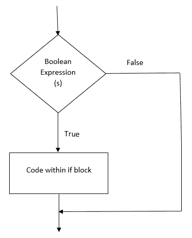
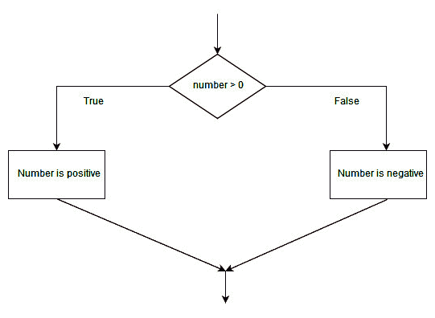
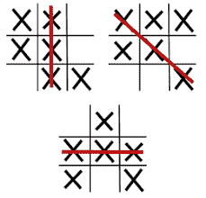
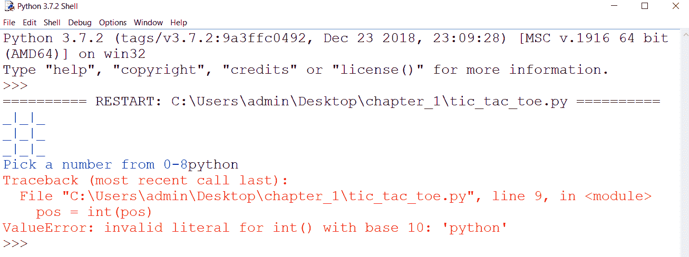
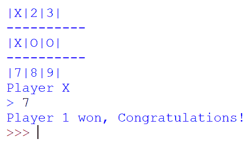
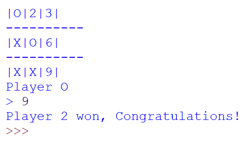

# 三、流程控制——为游戏建立决策者

Python 最大的优点之一是自动化。当我们谈论自动化时，没有惊人的逻辑；这都是关于条件和分支的能力。它们控制程序执行的顺序。任何处于初级阶段的程序都是通过模拟制作的。每当我们在现实环境中部署此类程序时，我们都会被各种噪音和意外行为所淹没。为了避免这种行为，条件句起着重要作用。流控件根据存在的布尔逻辑决定如何执行程序的特定部分。我们在前一章中讨论了语句和运算符等主题，这两个主题在创建布尔逻辑时都很有用。这些语句用于执行算术计算。在本章中，我们将看到如何操纵这些语句，从而产生正确或错误的布尔逻辑。

在本章的中途，我们将学习循环，这是一项重要的技术，它将使我们有足够的能力使代码更短、更强大。本章将是一个包含核心编程、条件和递归编程的完整包。我们将通过结合布尔逻辑和流控制来改进我们在上一章中制作的 tic-tac-toe 游戏。

本章将介绍以下主题：

*   布尔逻辑与逻辑运算符
*   条件句
*   迭代
*   `for`和`while`回路
*   为我们的 tic-tac-toe 游戏制作游戏控制器

# 技术要求

您需要满足以下要求才能完成本章：

*   Python 脚本和空闲
*   本章的代码资产，可在[找到 https://github.com/PacktPublishing/Learning-Python-by-building-games/tree/master/Chapter03](https://github.com/PacktPublishing/Learning-Python-by-building-games/tree/master/Chapter03)

请查看以下视频以查看代码的运行情况：

[http://bit.ly/2pvpBas](http://bit.ly/2pvpBas)

# 理解布尔逻辑和逻辑运算符

没有一天我们会说布尔类型是`True`或`False`。我们使用这些关键字来生成逻辑，以确定是否要执行代码的某一部分。让我们从现实场景的角度来讨论布尔类型。如果我们饿了，我们就吃点东西。如果我们累了，我们就休息。让我们将这些场景转换为适当的布尔语句：

*   `is_hungry = True`：`eat something || is_hungry = False: don't eat`
*   `is_tired = True`：`take rest || is_tired = False: do your work`

您可以根据手头的布尔逻辑执行这些日常任务。现在，让我们将其与编程联系起来；可以使用两组基于布尔数据类型的代码：

*   （`True`：`Do something || (False): Do something`

我们使用布尔表达式来生成这种类型的逻辑。我们将在上一章中介绍如何创建表达式。组合变量和运算符将为我们提供一种简单的表达式形式，如本例所示：

```py
>>> y
>>> x = y + 6 * 7 
```

然而，布尔表达式有点不同。它们提供的结果不是整数，而是`True`或`False`的结果。布尔表达式的最简单形式可以使用双等于运算符（`==`生成。不要把它和一个等号（`=`混淆。这用于赋值，而双等号（`==`用于检查它们是否相等，如示例所示：

```py
>>> 5 == 5
True
>>> "Python" == "Java"
False
```

如果比较两种不同类型的数据，结果总是`False`：

```py
>>> "5" == 5 # String(5) not equal to int(5)
```

您始终可以键入 caste it 以形成您的逻辑`True`：

```py
>>> int("5") == 5
True
>>> "5" == str(5)
True
```

要检查任何布尔变量的类型，您可以使用`type()`方法获得`<class 'bool'>`的输出，这意味着`True`或`False`是布尔类型的值：

```py
>>> logic = False
>>> type(logic)
'<class 'bool'>'
```

布尔逻辑也可以与比较运算符一起使用。在下一节中，我们将学习如何使用**比较运算符**创建语句。

# 比较运算符

任何导致`True`或`False`的表达式都是布尔表达式。如果没有比较运算符和逻辑运算符，就无法生成这些布尔表达式。我们已经研究了基本比较运算符（`==`）；然而，我们还需要了解六个方面（`<`、`>`、`<=`、`>=`、`!=`和`is`）。让我们来看看他们的行动：

*   **5<10**：5 小于 10，导致`True`。
*   **5>10**：5 大于 10，导致`False`。
*   **10<=5**：10 小于等于 5，导致`False`。10 既不小于也不等于 5。

*   **10>=5**：10 大于等于 5，导致`True`。10 大于 5。
*   **10！=10**：10 不等于 10，导致`False`。10 等于 10。
*   **5 为 5**：5 与 5 相同，因此产生`True`。然而，`5`是 5，因此这导致`False`。

您可以将前面的数字存储在不同的变量中，然后在空闲时尝试使用相同的布尔表达式，以获得以下结果：

```py
>>> v1 = 5
>>> v2 = 10
>>> v1 < v2
True
>>> v1 > v2
False
>>> v2 <= v1
False
>>> v2 >= v1
True
>>> v2 != v2
False
>>> v1 is v2 
False
>>> v1 is v1
True
```

为了使逻辑适用于现实世界，我们需要能够同时组合不同比较操作并立即提供结果的运算符。这些类型的运算符称为逻辑运算符。在下一节中，我们将学习不同类型的逻辑运算符以及使用它们的方法。

# 逻辑运算符

运算符被广泛地分类为算术运算符、比较运算符和逻辑运算符。我们已经介绍了算术和比较运算符；现在，是讨论逻辑运算符的时候了。

您可以将逻辑运算符与逻辑门（`and`、`or`和`not`相关联，逻辑门是任何数字电路的基本构造块。它们有两个输入，但通过某些电路计算，我们只能得到一个输出。电路处理由`and`、`or`和`not`门完成。与逻辑门的数字电路类似，逻辑运算符可以传递许多条件，但最终输出将是`True`或`False`。这里，`conditions`指的是我们使用比较运算符生成的布尔表达式。这三个基本逻辑运算符的工作原理如下：

*   `and`：一个`and`操作符附带两个条件，即`condition_one`和`condition_two`。当这些条件中的每一个都是`True`时，整个条件将是`True`。如果`and`运算符附加的任一条件为`False`，则结果为`False`。让我们来看一个例子：

```py
      >>> condition_one = 5 > 2 #True
      >>> condition_two = 6 < 10 #True
      >>> condition_one and condition_two
      True
      >>> condition_two = 6 > 10
      >>> condition_one and condition_two
      False
```

`and`运算符的真值表根据布尔或逻辑表达式的组合将函数值设置为`True`或`False`，如下所示：


*   `or`：与`and`操作符相同，两个条件附加一个`or`操作符。如果您想添加更多的条件，可以添加更多的`or`操作符。对于`or`运算符，如果附加到它的两个条件都是`False`，则结果将是`False`；否则将为`True`。让我们看一个例子：

```py
      >>> 4 < 10 or 5 == 5
      True
      >>> 4 <= 10 or 100 < 50
      True
      >>> 10 <= 4 or 100 < 50
      False
```

`or`运算符的真值表根据布尔或逻辑表达式的组合将函数值设置为`True`或`False`，如下所示：


*   `not`：此运算符反转逻辑类型。它将`False`更改为`True`，反之亦然。因此，它被称为逻辑反相器。它只需要一个条件，如下所示：

```py
      >>> not (5 < 4) # condition 5 < 4 is False
      True
      >>> not True
      False
```

`not`运算符的真值表根据布尔或逻辑表达式的组合将函数值设置为`True`或`False`，如下所示：


您还可以在 Python 中用 1 和 0 表示`True`和`False`。因此，我们可以得出结论，任何非零整数都可以单独用于生成具有逻辑运算符的条件，如示例所示：

```py
>>> 1 and 1
1
>>> 1 and 0
0
>>> 1 or 0
1
>>> 49 or True
49
```

学习不同类型的运算符非常有趣，但现在我们将跳到这一部分，在那里您将学习如何使用这些条件（通过比较和逻辑运算符）来做出多个决策。**条件句**在任何现实场景中都非常实用。我很高兴了解他们，你呢？

# 条件句

到目前为止，我们已经学习了使用比较运算符和逻辑运算符生成条件。现在，我们将讨论如何评估这些条件。当我们想要计算这些条件的结果并相应地控制程序流时，条件是很方便的工具。我们已经知道，这些条件的结果将是`True`或`False`。因此，根据我们使用的 bool 类型，条件将执行部分代码。我们在 Python 中使用`if`语句来执行条件语句。在编写了`if`关键字之后，我们在它旁边放置了条件。该条件可以是单数，也可以是多个逻辑运算符的组合。我们用冒号结束`if`语句；后续语句是缩进属性。请看以下示例：

```py
#filename: conditionals.py

if (True):
  #Do something
```

下图表示用于实现条件语句的布尔逻辑：



使用 Python 时请注意以下几点：

*   **冒号（`:`**：如果想在 Python 中声明作用域，在其中可以编写多条语句，需要使用冒号（*`:`*来指定。大多数编程语言都使用大括号（`{ }`）来实现这一点，但 Python 在定义函数、`if`语句、类和循环等功能的块语句的范围和范围时很奇怪。然而，一旦您熟悉了如何使用它，您将发现它很有趣，并且能够在一秒钟内将用 Python 编写的代码与任何其他语言区分开来。
*   **缩进**（**空格**）：用冒号定义范围后，即可进入其范围。在其范围内编写的任何后续语句都应该以统一的空格开始，我们称之为缩进。您可以按*Tab*键为每条语句提供统一的缩进。初学者犯的大多数错误都是由于缩进不当造成的。如果没有提供正确的缩进，Python 解释器将发出以下警告：


If 语句对逻辑语句求值。只要该语句为 true，就会执行其缩进语句；否则，它将被跳过。您还可以添加`pass`关键字，告知解释器不要在缩进块内执行任何操作，如本例所示：

```py
>>> if ( 4 == 4):
          pass
>>> #does not print anything
```

正如我们已经知道的，布尔语句将导致`True`或`False`。如果条件为`True`，则执行`if`语句中的缩进代码；如果条件为`False`，则执行`else`部分中的缩进代码。让我们来看一个例子：

```py
>>> number = 1
>>> if number > 0:
        print("Number is positive")
    else:
        print("Number is negative")
Number is positive
>>>
```

下图显示了使用条件语句执行程序以检查数字是正还是负的流程图：



您可以看到，我们为`True`或`False`逻辑创建了两个条件分支。基于布尔逻辑的结果，流控制被转移到程序的任一侧。因此，条件句也称为*分支*。

虽然我们的代码能够执行带有两个分支的代码，但是我们的代码中有一点差距。如果数字变量包含零，则它既不是正变量也不是负变量。因此，我们必须在这个条件中再添加一个条件。每当我们需要两个以上的分支来计算逻辑时，我们就可以生成链式条件句。我们可以通过链式序列添加任意多的条件。要使用任何其他编程语言执行链式条件语句，我们使用`else if`命令。Python 通过使用`elif`发出不同的命令来即兴创作。让我们来看一个例子：

```py
>>> number = input("Enter any number: ")
>>> number = int(number) #converting string to integer
>>> if number > 0:
        print("Number is Positive")
    elif number == 0:
        print("Number is Zero")
    else:
        print("Number is Negative")
Enter any number: 0
Number is Zero
>>>
```

我们可以在一个条件语句中放置任意数量的条件语句。我们称之为嵌套条件句。让我们来看一个例子：

```py
>>> number = 10
>>> if number > 0:
        if number % 2 == 0:
                print("Number is positive and even")
        else:
                print("Number is positive and odd")      
Number is positive and even 
```

在前面的示例中，外部条件包含两个子分支条件，其中，在第一个分支中，我们检查偶数。下一个默认条件是检查奇数。在本例中，我们使用一条简单的语句来生成条件，但嵌套条件中的条件可能会因逻辑运算符而变得复杂，如本例所示：

```py
>>> number = 4
>>> if number > 0:
        if number % 2 == 0 and number < 10:
                print("Number {} is small even & positive number".format(number))
Number 4 is small even & positive number
```

既然您已经知道了如何使用多个条件语句进行决策，我们将看一看称为**迭代**的非常实用的主题。这允许我们执行一系列指令。重复此操作，直到达到特定条件。

# 迭代

假设你想写一个程序，你必须打印你的名字 100 次。到目前为止，我们所了解的情况表明，最简单的方法是使用 print 语句 100 次。但是如果你想打印 10000 次你的名字呢？连续编写 2/3 页的打印语句不是好的编程。在这种情况下，我们必须使用循环。循环将帮助我们迭代数据集，直到满足条件为止。在每次迭代中，执行一部分代码，我们每次都必须更新迭代变量。以下是迭代变量的示例：

```py
>>> i = 0
>>> i = i + 1
```

我们使用递增和递减单位更新迭代变量。在这里，我们通过添加`1`来更新`i`的值。这称为递增。您还可以从中减去 1，这称为递减。每次在缩进循环中执行代码时，我们都使用递增或递减语句更新迭代。

类似地，有一种相对更简单、更快的方法来实现递增和递减语句。可以使用以下语句执行多个操作：

*   `+=`向变量添加一个数字，并在其过程中更改变量。
*   `-=`用一个值减去变量，并将新值设置为其结果变量。
*   `*=`将变量乘以一个值，并改变变量的结果。
*   `/=`将变量与值相除，并将结果放在结果变量上。

让我们看一个例子，看看它的效果：

```py
>>> value = 4
>>> value += 5
>>> print(value)
9
```

递增和递减运算符的有效性可以通过循环看到，在循环中我们多次重复一组操作。让我们来看看在 while 循环和 while 循环中的循环操作。我们将从学习`for`循环开始。

# Th for 循环

当你想在一个数据集内循环时，比如说，在一个数字范围内，在一个特定的文件内，或者在一些确定的词集内，我们使用`for`循环。它也被称为确定循环。除非您的项目桶中还剩下某个项目，否则它将迭代。`for`循环在铲斗末端终止。在这里，bucket 是一个项目列表的隐喻，例如数字、单词或序列的列表，如本例所示：

```py
>>> for i in range(10):
         print(i, " John Doe") #range(10) gives [0,1,2,3,4,5,6,7,8,9]
0  John Doe
1  John Doe
2  John Doe
3  John Doe
4  John Doe
5  John Doe
6  John Doe
7  John Doe
8  John Doe
9  John Doe
```

在前面的代码中，`range()`方法用于创建数字列表。`range(10)`提供从`0`到`9`的编号列表。存储为`[0,1,2,3,4,5,6,7,8,9]`。

在第一次迭代中，`i`值变为`0`，它执行`for`循环块内的代码，并自动将`i`的值更改为该列表的下一个元素，如下所示：

```py
>>> for i in [6,7,8]:
         print(i)
6
7
8
```

还可以在包含单词或文本的数据内循环。每次在该列表中循环时，迭代变量将包含一个值作为单词，如本例所示：

```py
>>> for name in ['Tom','Harry','Ricky','Matt']:
             print(name)
Tom
Harry
Ricky
Matt
```

在前面的示例中，迭代变量是一个`name`变量，每次迭代该列表时，它都会获取其值并将其存储在`name`中。因此，我们只能在`for`循环体中使用`name`变量。除了`for`循环中的迭代变量外，不能使用其他变量。这在以下代码中显示：

```py
>>> person_names = ['Tom','Harry','Ricky','Matt']
>>> for name in person_names:
         print(person_names)
Traceback (most recent call last):
   File "<pyshell#26>", line 1, in <module>
     for name in person_name:
NameError: name 'person_name' is not defined
```

在前面的示例中，`person_names`是一种变量类型，我们可以在其中存储项目数组。此变量称为列表。我们将在下一章中介绍列表。这里，迭代变量是`name`，它是用`for`循环声明的。然而，在 for 循环的主体中，我们没有使用`name`变量。相反，我们使用了`person_names`，这给了我们`NameError`。因此，迭代变量只能在`for`循环体内部使用。

我们将介绍的下一种类型的循环是`while`循环，它将执行类似于`for`循环的操作，但有一些调整。已知`while`循环用于我们不关心循环终止点的场景。

# While 循环

Python 中的另一种迭代形式可以使用`while`循环执行。让我们回顾一下`for`循环的特性：它用于迭代有限的元素序列，或者作为数字、单词或文件的列表。如果要使用`for`循环，必须有一个终止点。在使用`for`循环时，我们也不关心终止条件。当它到达项目或序列的末尾时终止。现在，如果我们想根据自定义条件终止循环，该怎么办？在这种情况下，`while`循环是最合适的循环。我们可以创建一个自定义条件，在这个条件下，我们可以借助`while`循环终止递归。

`while`和`for`循环都将执行连续循环。在每次迭代中，它们将执行循环体。`for`和`while`循环之间的主要区别在于`while`循环必须用其声明声明 update 语句和终止条件。首先，我们必须生成一个迭代变量，然后我们必须生成一个终止条件，以便为循环指定一个停止点。在每次迭代中，我们必须更新迭代变量，如下所示：

```py
>>> i = 0
>>> while (i < 10):
        print("John Doe")
        i = i + 1
John Doe
John Doe
John Doe
John Doe
John Doe
John Doe
John Doe
John Doe
John Doe
John Doe
```

在前面的示例中，我们创建了一个迭代变量`i`，并为其赋值 0。之后，我们使用了一个`while`循环。为了使用这个循环，我们使用了`while`关键字，然后是它的终止条件。我们告诉解释器我们要运行这个循环直到`i`小于 10。如果`i`等于或大于 10，我们希望终止此循环。

之后，我们放置一个冒号来指定循环的作用域。然后，我们向它添加了一个简单的 print 语句，它将在每次循环运行时执行。最后，我们添加了一个*i=i+1*语句来指定更新条件。这将把`i`的值更改为新值，增量为 1。这很重要，这样我们就不会使用无限循环。如果删除更新条件，循环将运行无限次，Python 终端将无法与用户的响应交互。创建无限循环的一种方法是使用没有端点的条件，如本例所示：

```py
>>> while True:
         print("Infinite loop")
```

前面的循环是无限循环，因为`while`关键字没有端点或终止点。如果我们能够将`True`关键字更改为`False`，则只有此循环将终止：

```py
>>> condition = True
>>> while condition:
        print("This will run only one time")
        condition = False
This will run only one time
```

在下一节中，我们将学习循环模式，以便了解循环在引擎盖下的工作方式。

# 循环模式

在`for`和`while`循环之间可能存在折衷，但是当我们想要循环已知的元素列表或文件内容时，这两种循环都能很好地工作。我们可以使用这些循环从列表或文件中排列或排序元素。一个`for`循环不能循环无限次，但`while`循环可以使用一个永远不会发生的条件来实现。循环的主要目的是从特定的文件或列表中获取项目，以便我们可以进一步处理它们。在扫描数据集时，我们可以根据最小值和最大值或重要值和多余值对这些项进行排序。

循环模式的构造包含以下三个精确点：

*   生成一个迭代变量。可以有一个或多个。它们用于生成表示循环终止点的条件。

*   一些计算是在循环体内部完成的，这样我们就可以逐个操作使用循环获取的数据项。我们还可以在循环体中更改迭代变量的值，这通常是在`while`循环中执行的。
*   寻找可能的基本条件，以便可以终止循环。否则，它将导致无限循环。我们必须在循环结束后观察结果变量。

如果您想演示循环模式的构造和工作范例，最好将循环与项目列表一起使用。在下面的示例中，我们将制作一个程序，其中我们将获取一个数字列表，并检查列表中的最小数字。

我们可以通过两种方式来做到这一点。Python 使编程对于两种类型的人都很容易：天真的人或专业的人。它们有多种实现相同逻辑的方法，但最常见的是使用 Python 的内置方法，如`min()`和`max()`。它们分别从 Python 中的数字列表中获取最小和最大的数字：

```py
>>> numbers = [113,115,55,66,65,90]
>>> min(numbers)
55
>>>max(numbers)
115
```

编写程序的第二种方法是制作我们自己的逻辑。我们应该立即决定使用循环，因为列表中有很多项，这意味着我们必须重复进行一些比较。因此，如果要重复执行任务，最好使用循环。现在，我们需要决定使用什么：一个`for`或`while`循环。这里最好使用`for`循环，因为 for 循环在有限列表上工作。每次我们迭代一个迭代变量时，它将包含列表中的一个元素，这样我们就可以重复地将它们与前一个元素进行比较。首先，我们没有任何东西可以成为最小的数字。因此，我们必须创建一个包含`None`值的变量。这意味着我们没有任何价值。在第一次迭代之后，我们将把它的值分配给列表的第一个元素。让我们看看它是如何工作的：

```py
>>> smallest_number = None
>>> for item in [113,115,55,66,65,90]:
            if smallest_number is None or item < smallest_number:
                     smallest_number = item
>>> print("Smallest:", smallest_number)
Smallest: 55
```

让我们将前面的代码分解为以下部分：

*   在第一条语句中，`smallest_number = None`将`None`赋值给该比较变量。我们指定了`None`而不是任何其他数字，这样我们在比较时不会遗漏任何数字。
*   在第二条语句中，我们创建了一个迭代变量`item`，它将读取一个数字列表。在每次迭代中，它将存储该列表中的元素。在第一次迭代中，该项的值为 113。在第二次迭代中，项目的值为 115；在第三次迭代时，值为 55；等等
*   我们现在在`for`循环的主体中，我们必须构建一个比较语句。首先，我们需要检查最小的数字是否为`None`，以确保我们从底部开始。之后，我们将检查列表中的当前项是否小于`smallest_number`。第一次迭代的第二个条件是 False，但是第一个条件，即`smallest_number`，是`None`，也就是说，True，这意味着我们进入了条件体内部。我们将`smallest_value`分配给列表的第一项，即 113。
*   在第二次迭代中，项目是 115。我们进入`for`循环，检查 115 是否小于`smallest_numbe`的值，即 113。这是`False`，所以它不会进入条件句的体内；相反，它跳到第三次迭代。
*   在第三次迭代中，项目为 55。我们要检查条件，检查项目的值，即 55，是否小于`smallest_number`，即 113。条件（55<113）是`True`，因此它将`smallest_number`变量的值更改为 55。`for`循环将迭代到该列表的最后一个数字。它将在每次迭代中使用相同的比较运算，以得到最小值，即 55。

只需更改比较运算符，我们就可以制作一个程序来打印列表中的最大数字。不使用`item < smallest_number`语句，我们可以使用`item > largest_number`语句获得最大的数字，如下所示：

```py
>>> largest_number = None
>>> for item in [113,115,55,66,65,90]:
            if largest_number is None or item > largest_number:
                    largest_number = item
>>> print("Largest: ",largest_number)
Largest: 115
```

在下一节中，我们将了解如何使用两个不同的语句**break 和 continue**，以更改或浏览迭代序列。

# break 和 continue 语句

在编写程序时，有时需要跳过语句的执行或强制停止迭代。这些操作由 continue 和 break 语句处理。在您希望让程序对列表中的元素进行排序或在满足`if`条件时中断循环的多个用例中，它们可能非常强大。`continue`语句用于跳过程序的执行。我们在循环体中使用这些语句。我们可以使用这些语句对列表中的元素进行排序。我们不能在一个循环中同时使用这两条语句，即使我们同时使用这两条语句，因为 break 将停止循环，这将使 continue 语句无用。我们可以将这些语句与条件语句一起使用。只要满足一个条件，我们就会中断或跳过迭代。让我们制作一个程序，可以对列表中的元素进行排序：

```py
>>> items = [1,5,7,8,"Free","spam",False,89,90,11,"Python"]
>>> refined_items = []
>>> for item in items:
        if type(item) != int:
                continue
        else:
                 refined_items.append(item)
>>> print(refined_items)
[1,5,7,8,89,90,11]
```

在前面的代码中，我们通过在输出列表中保留整数来细化列表的元素。其他数据值（如字符串和布尔值）将被删除。首先，我们循环一个完整的列表，在每次迭代中，元素存储在 item 变量中。我们使用`type()`方法检查 item 变量中存储的数据类型。如果存储在项中的值的类型不是整数，我们将使用 continue 语句推断，如果它不是整数，我们将不会执行任何操作。如果项的类型是布尔值或字符串，我们将使用 continue 语句跳过该迭代。但是，如果存储在 item 变量中的值的类型是整数，我们将执行代码 else 部分中的语句。我们将获取该整数项并将其添加到新的输出列表中，该列表称为`refined_items`。在检查每个元素之后，我们打印细化列表，这是数字的最终集合。

如果您使用`break`语句，则在元素 8 之前情况都是一样的。但我们的输出将限于`[1,5,7,8]`，而不是打印`[89,90,11]`中的其他元素。这是因为在将元素 8 添加到列表后，`break`语句将停止迭代。因此，我们可以得出结论，每当 Python 解释器触发 break 语句时，循环都将终止：

```py
>>> items = [1,5,7,8,"Free","spam",False,89,90,11,"Python"]
>>> refined_items = []
>>> for item in items:
        if type(item) != int:
                 break
        else:
                 refined_items.append(item)
>>> print(refined_items)
[1,5,7,8]
```

我们知道，在现实环境中部署程序时，这些程序将习惯于我们的代码无法处理的不同场景。在这种情况下，我们的程序将终止，这将对游戏的用户或玩家产生负面影响。因此，我们必须以这样一种方式编码，即我们的代码可以应用于任何场景，即使它遇到意外的错误或异常。这种强大的编程技术称为**异常处理**，我们将在下一节中介绍。

# 使用 try 和 except 处理异常

在上一章中，我们创建了一个简单的井字游戏。我们在那一章的结尾谈到了做一些修改。由于代码的缺陷，建议进行一次修改，该代码无法处理除整数以外的用户输入。如果我们的用户输入一个字符串作为我们游戏的位置变量的输入呢？将引发以下异常：


在前面的屏幕截图中，我们可以看到我们的代码无法处理用户输入的字符串。当且仅当我们输入一个整数时，我们的代码才会表现良好。如果用户错误地输入任何其他数据值，程序将崩溃。本主题的目的是处理此类错误。我们有两种类型的错误：语法错误和异常错误。以下代码显示了这两者的示例：

```py
>>> print("Hey! it's me")))
SyntaxError: invalid syntax
```

每当您键入错误的语句时，它都会抛出一条错误消息，即语法错误。在这里，我们使用了两个比正常多的括号来括起 print 语句，这是不正确的。因此，Python 解析器抛出一个语法错误。删除额外的两个括号以消除语法错误：

```py
>>> a = 34
>>> a / 0
Traceback (most recent call last):
  File "<pyshell#2>", line 1, in <module>
    a / 0
ZeroDivisionError: division by zero
```

现在，Python 解析器抛出了一个异常错误。即使 Python 语法正确，也会发生这种类型的错误。这可能是数学错误或逻辑错误。在数学中，任何数字都不能除零。这将导致一个无穷大，这是 Python 没有定义的。因此，我们遇到了一个例外。有不同类型的例外情况。如果您想知道遇到的异常的名称，请检查收到异常后代码的最后一条语句。在我们的错误消息中，最后一条语句是`ZeroDivisionError`。因此，我们遇到了一个`ZeroDivisionError`异常。如果您遇到这些异常中的任何一个，那么您的代码很可能已经崩溃。因此，我们的游戏 tic tac toe 也崩溃了，因为它无法处理整数以外的输入数据。

现在，我们的主要目标是使我们的代码可靠，这样即使我们的代码遇到异常，而不是崩溃，它也会给用户一个友好的消息。在前面的示例中，我们可以向用户发送一条消息，说明`You cannot divide any number by zero`，而不是终止程序。这个过程称为异常处理。这些都是在 Python 的`try`和`except`块中完成的。

如果您不确定代码是否给了您错误，您应该始终使用`try`和`except`块。您的主代码可能会遇到异常，应该保存在`try`块中。然后，如果遇到异常，Python 解析器应该执行`except`块中的代码。以下示例应该让您更清楚地了解这一点：

```py
>>> a = 34
 #INSIDE TRY BLOCK: put code that can give you error or exception
>>> try:
       print(a/0) #this will give you exception
    except:
       print("You cannot divide any number by Zero. It is Illegal!") #message to user

You cannot divide any number by Zero. It is Illegal!
```

前面的代码显示了处理这类错误是多么容易。您将主代码放入一个`try`块中，如果它遇到异常，则不会执行主代码。相反，将执行 except 块内的代码，在本例中，这是一条用户友好的消息。您也可以使用`pass`终止程序，而不向用户提供消息。

使用 except 关键字，还可以显式传递异常的名称。但是，请确保您知道将遇到的正确异常名称。在这种情况下，我们知道我们将遇到`ZeroDivisionError`，因此我们可以使用 except 块写入异常名称，如下所示：

```py
>>> a = 34
 #INSIDE TRY BLOCK: put code that can give you error or exception
>>> try:
        print(a/0) #this will give you exception
    except ZeroDivisionError:
        pass
```

现在，让我们看看如何用我们迄今为止所学的一切改进我们的井字游戏。我们将使用条件、循环和异常处理来修改我们在前一章中编写的代码。

# 为我们的 tic-tac-toe 游戏制作游戏控制器

在前一章中，我们构建了一个简单的井字游戏。由于我们已经在本章中学习了条件和循环，我们现在能够在游戏中取得一些进步。我们将对游戏进行以下更改：

*   我们必须使游戏成为多人游戏，这意味着我们必须对程序进行修改，以便两名玩家可以玩我们的游戏。我们可以创造条件来切换谁在何时比赛。
*   当我们谈到异常处理时，我们看到我们的游戏无法处理用户输入的字符串数据。我们可以使用`try`和`except`块来处理该异常。
*   我们无法用上一章编写的代码确定游戏的赢家。现在我们已经了解了`if`条件，我们可以想出一些逻辑来检查玩家是否是赢家。

我们将通过头脑风暴开始游戏开发过程，以收集有关游戏的一些关键信息。

# 集思广益和信息收集

我们的代码缺少的一个重要特性是可读性。在上一章的游戏代码中，我们没有一个正确的方法来跟踪游戏板的位置。我们可以使用代码做的第一件事是创建一个选项列表，其中包含玩家可以做出的所有选择。这里，选择 tic tac 趾板位置。在 tic tac toe 游戏中，玩家可以选择 0 到 8 个数字，如果这些数字没有被其他玩家占用，则它们是占位符。

我们必须在代码中添加的第二件事是，我们可以切换轮到谁了。由于我们只有两名球员，我们可以让球员 1 先上场，然后开始比赛的第一步。因此，使逻辑更容易。我们将创建一个布尔变量，并将其值从 True 更改为 False，以便我们可以创建一个条件来更改玩家的回合，如下所示：

*   `playerOne = True`将确保轮到玩家 1。
*   `playerOne = False`将允许玩家 2 在我们的游戏板上移动。

我们必须遵守井字游戏规则，根据玩家在游戏板上的位置，让他们成为赢家。如果某位玩家，无论是 X 还是 O，占据了 tic tac 趾板的整行、整列或整条对角线，则该玩家将被视为赢家。以下屏幕截图描述了这一点：



# 修改模型

我们在上一章中编写的程序只能让一名玩家玩这个游戏。由于 tic tac toe 是一款多人游戏，因此应进行修改，以便多人可以玩此游戏。为此，我们必须做两件事：

*   跟踪黑板上的空白位置。
*   设置一个条件来切换玩家的回合。

对于这两种修改，我们必须创建一个变量来跟踪游戏板上的每个空位置和占用位置：

```py
#code is written in same previous file

choices = []
for pos in range(0,9):
      choices.append(str(pos+1))
```

如果您使用`>>> print(choices)`变量，这将产生一个值列表：`['1', '2', '3', '4', '5', '6', '7', '8', '9']`。它们是我们棋盘游戏的位置。

现在，如果要打印电路板的布局，则不能使用上一章中的代码。我们将使用`choices`变量，而不是`game_board`变量。这与上一个示例中的工作方式相同。我们将在每行之间添加一行破折号：

```py
#board layout
print('\n')
print('|' + choices[0] + '|' + choices[1] + '|' + choices[2] + '|')
print('----------')
print('|' + choices[3] + '|' + choices[4] + '|' + choices[5] + '|')
print('----------')
print('|' + choices[6] + '|' + choices[7] + '|' + choices[8] + '|')

#output
''' 
|1|2|3|
----------
|4|5|6|
----------
|7|8|9|

'''
```

当用户输入数字以外的内容时，游戏中的主要问题可能会出现。例如，如果玩家输入一个字符串，游戏将被终止，例外情况是我们不希望这种情况发生。您可能还记得，我们使用**异常处理**来避免这种情况。在下一节中，我们将把它添加到我们的游戏中。

# 处理游戏的异常

让我们运行到目前为止所做的游戏，在输入字段中输入一个字符串，而不是一个整数值。您将获得以下异常：



我们不希望我们的程序在用户与我们的游戏交互时出错时崩溃。相反，我们可以向他们发送一条用户友好的消息，上面写着`This is not valid, press integer only`。让我们使用`try`和`catch`块来处理这种类型的异常，如下所示：

```py
while True:
    print('\n')
    print('|' + choices[0] + '|' + choices[1] + '|' + choices[2] + '|')
    print('----------')
    print('|' + choices[3] + '|' + choices[4] + '|' + choices[5] + '|')
    print('----------')
    print('|' + choices[6] + '|' + choices[7] + '|' + choices[8] + '|')
    #above code is to print board layouts

    try:
        choice = int(input("> ").strip())
    except:
        print("Please enter only valid fields from board (0-8)")
        continue
```

当我们这次运行程序时，我们将得到以下输出：


在这里，我们在输入字段中输入了一个 Python 字符串值。我们收到一条信息说`Please enter only valid fields from board`，而不是让程序崩溃。这是使用`try`和`except`块处理异常的一种方便方法。我们使用了上一章中相同的主循环，它将循环无限次。在`try`块的主体中，我们保留了可能引发异常的代码。`strip()`是一个字符串方法，它将从用户输入中删除空格。我们必须使用`int`方法键入 cast 用户输入，以便将字符串形式的输入数据转换为整数。如果我们得到一个异常，我们将执行`except`块体内部的代码。如果我们遇到异常，`continue`关键字将使主循环从头开始再次运行。

我们的井字游戏必须增加的主要功能是多人游戏，这样两个玩家可以轮流玩同一个游戏。此切换功能将在下一节中添加。

# 切换玩家的回合

用 Python 编写程序让两个玩家玩这个游戏很容易，您只需创建一个布尔变量来表示当前玩家是谁。然后，根据布尔值的两个值，`True`或`False`，我们可以更改游戏玩家。然而，如果你想增加两个以上的玩家，这个想法是行不通的。我们将使用以下布尔值：

*   `Is_Current_One = True`：当前玩家为玩家 1 或 X。
*   `Is_Current_One = False`：当前玩家为玩家 2 或玩家 O。

这在以下代码中显示：

```py
#creating Boolean variable
Is_Current_One = True #default player is player X

#first move is done by player X
while True:
    #put code of board layouts here
    if Is_Current_One:
        print("Player X")
    else:
        print("Player O")

    #put try and except block here
    #---------------------------------------------
    #code to put either X or O on position selected by user
    if Is_Current_One:
        choices[choice-1] = 'X'
    else:
        choices[choice-1] = 'O'
    #code to toggle between True and False
    Is_Current_One = not Is_Current_One
```

让我们将前面的代码分成几个部分，以便更好地理解它：

*   我们有一个主循环，它将运行无限次，直到它触发一个`break`语句。我们已经知道，`break`关键字将终止我们的循环。在主循环的主体中，我们打印是轮到玩家 X 还是 O，以使玩家知道他们的轮到。
*   我们创建了一个名为`Is_Current_One`的布尔变量，该变量的值为`True`。这意味着第一个移动的玩家将是玩家`X`。如果我们将此变量设为 False，那么第一步的默认玩家将是玩家`O`。
*   在主循环内部，我们创建了一个条件来检查播放器`X`或播放器`O`是否相应地在板布局上放置了`X`或`O`。`choices[]`变量反映董事会的立场。`choice`是用户的输入，我们将其减去 1，因为我们的选择变量是列表类型。我们知道列表索引从索引 0 开始，但我们已经输入了从 1 到 9 的用户输入。因此，我们用 1 减去`choice`输入变量以适应此列表变量。
*   `>>> Is_Current_One = not Is_Current_One`语句将在玩家之间切换。如前所述，如果`Is_Current_One`是`True`，那么玩家就是`X`，现在我们也做了一个条件，这样我们可以在下一次迭代中将 True 改为 False，让玩家`O`可以进行下一步。

让我们通过运行脚本文件来了解目前的情况。您将看到以下结果打印在 shell 中：


现在，我们已经创建了我们的游戏，它可以从用户那里获取一些输入并将其放置在 tic-tac 趾板上。我们创造了一些逻辑来改变轮到谁了。我们还能够使用`try`和`catch`块处理游戏中可能出现的异常。

我们一直在快速进步，但我们的比赛仍然不完整。如果一个玩家占据一行、一列或三个对角单元格，我们没有任何逻辑让他成为赢家。我们将在下一节中进行此操作。

# 让一名球员成为赢家

**Tic tac toe**是一款易于制作的游戏，但构建此游戏的主要目的是涵盖 Python 的几乎所有核心编程范式，如变量、数字、模型、内置方法、循环、分支和异常处理。现在，我们的游戏足够好，可以由两名玩家玩，但多人游戏的最后只能有一名赢家。因此，我们必须制定全新的逻辑，如果玩家赢了，我们将奖励他们。我们需要涵盖三个用例，如下所示：

*   如果一名玩家占据了 tic tac 趾板的整排，则该玩家将成为赢家。
*   如果棋盘的一整列被一名玩家占据，该玩家将成为赢家。
*   如果一名玩家占据了棋盘的整个对角线，则该玩家将成为赢家。

让我们打印游戏板布局以及它们的位置，这样我们就可以在满足上述条件的同时跟踪游戏板的所有位置：

```py
| 1 | 2 | 3 |
 ----------
| 4 | 5 | 6 |
 ----------
| 7 | 8 | 9 |
```

因为我们必须从 1 到 9 在所有这些位置循环，所以我们需要使用`for`循环。因为我们有一个有限的数字列表，`for`循环很容易使用。我们必须设置两个条件来检查玩家是否占据整行或整列。在处理行和列之后，我们将检查带有隔离的对角条件：

*   **对于第**行：如果任何用户占用[1,2,3]、[4,5,6]、[7,8,9]，则该特定玩家将被视为赢家。
*   **对于**栏：如果任何用户占据[1,4,7]、[2,5,8]、[3,6,9]，则该特定玩家将被视为赢家。

然而，`choice`变量内的位置范围为 0 到 8，即，['0'、'1'、'2'、'3'、'4'、'5'、'6'、'7'、'8']，因此索引 0 引用电路板的第一个位置，索引 1 表示电路板的第二个位置，依此类推。

我们已经在主循环中使用了一段时间的`True`语句。让我们修改它，这样我们的代码将一直运行，直到有一个玩家获胜。我们将运行主循环直到`won= False`。如果我们在游戏中获胜，我们会将`won`变量的值更改为`True`，这样主循环将结束：

```py
won = False #at first we don't have any winner
while not won:
    #code from previous topics
    #logic to make any player winner:
    for pos_x in range(0,3):
        pos_y = pos_x * 3 

        #for row condition:
        if (choices[pos_y] == choices[(pos_y + 1)]) and (choices[pos_y] 
           == choices[(pos_y + 2)]):
            #code to change won to True
            won = True #main loop will break

        #column condition:
        if (choices[pos_x] == choices[(pos_x + 3)]) and (choices[pos_x] 
          == choices[(pos_x + 6)]):
            won = True #main loop will break

```

在前面的代码中，我们设置了两个条件来检查玩家是否是赢家。我们制作了`won`变量来跟踪是否有玩家赢了。如果任何玩家占据整行或整列，我们将使`won`变量的值为真，我们的循环将中断，这意味着我们将结束游戏。然而，我们还没有给用户一个关于成为赢家的信息。让我们编写一些代码，在检查行和列条件后告诉用户他们是赢家：

```py
while not won:
    #code from previous topic
    for pos_x in range(0,3):
        pos_y = pos_x * 3

    #add condition for row and column here

#print who is winner
print("Player " + str(int(Is_Current_One + 1)) + " won, Congratulations!")    
```

我们使用`print`方法编写的语句可能会因为`str(int(Is_Current_One + 1))`命令而产生混乱。这里，`Is_Current_One`是`True`或`False`。然而，它也对应于 1 或 0，其中 1 表示`True`，0 表示`False`。如果玩家`X`是赢家，那么是玩家 1 赢了，但回合将切换到玩家`O`，即玩家 2。

因此，我们必须将其添加到 1 中，以便确定当前玩家是赢家，而不是下一个玩家。由于这是一个两人游戏，这是有意义的。让我们运行代码来检查结果：



我们还没有完成，我们还必须再增加一个条件来检查对角线是否也被玩家占据。现在让我们添加该条件：

```py
| 1 | 2 | 3 |
 ----------
| 4 | 5 | 6 |
 ----------
| 7 | 8 | 9 |
```

如果任何球员占据[1,5,9]或[3,5,7]的位置，他们将被视为胜利者。然而，我们的`choices`变量是一个包含所有位置的列表。它的索引从 0 开始，这意味着如果您想定位玩家 1 的位置，您应该将其作为`choices[0]`传递，如下所示：

```py
while not won:
    #code from previous topic
    for pos_x in range(0,3):
        pos_y = pos_x * 3
    #add condition for row and column here

    #diagonal condition here:
    if ((choices[0] == choices[4] and choices[0] == choices[8]) or
        (choices[2] == choices[4] and choices[4] == choices[6])):
         won = True

#print who is winner
print("Player " + str(int(Is_Current_One + 1)) + " won, Congratulations!")  
```

现在，让我们再次运行游戏，检查此条件是否正常工作：



终于，我们完成了游戏！我们能够在游戏中包含许多功能，例如异常处理、多人模式和使玩家成为赢家的逻辑。然而，我们仍然需要通过添加用户定义的函数来完善这个游戏，以便我们可以打印我们的棋盘布局。这将遵循干燥原则，并将在下一章中介绍。

# 总结

本章向我们介绍了 Python 编程范例的所有核心主题。我们已经介绍了流控制以及如何使用分支和循环实现它们。我们学会了如何创造条件，并将它们输入条件。然后，基于这些条件，我们能够在语句的执行之间进行切换。我们看到了如何使用 Python 循环和分支实现自动化。我们用`if`关键字输入多个可能的条件，并根据布尔表达式的结果控制程序的流程。我们还了解了不同类型的循环，并了解了如何使用它们来迭代项目或对象列表。然后，我们了解了如何使用 try 和 except 块处理异常。

最后，我们结合了本章所学的不同范例，使我们的井字游戏比以往任何时候都更具可玩性。我们添加了`try`和`except`块，以便捕获并正确处理任何异常。我们还增加了多人模式和逻辑等功能，使玩家成为赢家。这使得游戏具有高度的交互性。最后，我们使用条件和循环制作了一个游戏控制器。然而，我们不会就此止步；在接下来的章节中将进行更多的修改。

下一章将改变我们的生活。到目前为止，我们只使用 Python 的内置函数，如`min()`、`max()`、`input()`。在下一章中，我们将看到如何创建自己的函数并使用它们，从而使游戏更具可读性和可重用性。我们将介绍数据结构，如列表、集合和字典，以便了解如何管理和存储更复杂的数据集。不过，不要被这些说法所淹没。您已经走了这么远，现在正处于成为一名熟练 Python 程序员的边缘。在继续下一章之前，请确保您对我们目前所学的所有主题都感到满意。