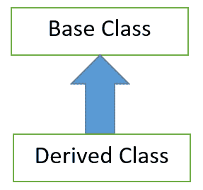
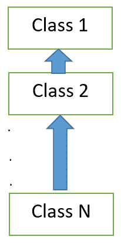
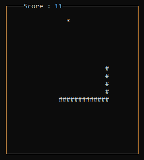

# 六、面向对象编程

编程不仅仅是编写程序，理解程序同样重要，这样我们就可以修复程序中的错误和错误（如果有）。因此，我们说程序员天生就是阅读和理解代码的。然而，随着程序变得越来越复杂，编写保持可读性的程序变得越来越困难。我们在这本书中既写了美观的代码，也写了凌乱的代码。我们用顺序编程制作了一个 tic tac toe 游戏，可读性较差。我们可以认为这些程序不雅，因为我们将很难阅读和理解他们的代码和顺序流。在编写这些程序之后，我们使用函数对它们进行了修改，从而升级了凌乱的代码，使其更加优雅。但是，如果您正在处理包含数千行代码的程序，则很难在同一文件中编写程序，也很难理解所使用函数的每个行为。因此，发现和修复以过程方式编写的程序的 bug 也很困难。因此，我们需要一种方法，可以轻松地将多行程序分解为更小的模块或部分，以便更容易地发现和修复这些错误。实现这一点的方法有很多，但最有效和流行的方法是使用**面向对象编程**（**OOP**方法

事实证明，从本书开始，我们就一直在使用对象，但还不知道它们是如何精确地制造和使用的。本章将通过一些简单的示例帮助您了解面向对象编程的术语和概念。我们还将根据本章末尾的 OOP 方法修改我们在前面章节中使用函数编写的贪食蛇游戏代码。

本章将介绍以下主题：

*   面向对象编程概述
*   Python 类
*   封装
*   遗产
*   多态性
*   基于面向对象的 Snake 游戏实现
*   可能的错误和修改

# 技术要求

为了充分利用本章，您需要以下几点：

*   Python 版本 3.5 或更高版本
*   Python 空闲（Python 的内置 IDE）
*   文本编辑器
*   网络浏览器

本章的文件可在本书的 GitHub 存储库中找到，网址为[https://github.com/PacktPublishing/Learning-Python-by-building-games/tree/master/Chapter06](https://github.com/PacktPublishing/Learning-Python-by-building-games/tree/master/Chapter06)

请查看以下视频以查看代码的运行情况：

[http://bit.ly/2oKD6D2](http://bit.ly/2oKD6D2)

# 面向对象编程概述

*Python 中的一切都是一个对象*。我们从本书一开始就雄辩地陈述了这句话，并且在每一章中都证明了这句话。一切都是对象。对象可以是元素、属性或函数的集合。数据结构、变量、数字和函数都是对象。OOP 是一种编程范式，它提供了一种借助对象构建程序的优雅方式。对象的行为和属性被绑定到模板中，我们称之为类。可以从该类的不同对象调用该行为及其属性。不要被术语行为和属性弄糊涂。它们只是方法和变量的不同名称。在某些类中定义的函数称为方法。

我们将在本章后面深入了解类和方法的概念，但现在，在为对象创建模板之前，让我们先了解更多关于对象的信息。

从本书开始，我们就一直在不知不觉中使用对象。我们以前使用过不同类的方法，比如`randint()`方法。此方法用于导入名为`random`的模块。此方法也是一个内置 Python 类。类是一个模板，我们可以在其中编写对象的函数。例如，人可以表示为对象。一个人有不同的特征，例如`name`、`age`和`hair_color`，这些特征都是独特的属性。然而，男人的行为，如吃饭、走路和睡觉，都是行为或方法。我们可以根据这些模板制作任意数量的对象。但现在，让我们设想两个对象：

```py
Object 1: Stephen : name = "Stephen Hawking", age= 56, hair_color= brown, eating, walking, sleeping

Object 2: Albert: name = "Albert Einstein", age = 77, hair_color= black, eating, walking, sleeping
```

在前面两个对象中，`name`、`age`和`hair_color`是唯一的。所有对象都具有独特的属性，但它们执行的行为或方法与进食、行走和睡眠相同。因此，我们可以得出结论，与输入和输出交互的数据模型是一个属性，因为它将被输入到方法中。基于每个对象的独特属性，类的方法将产生不同的结果。

因此，我们可以说 OOP 是一种将真实世界实体建模为对象的方法，这些对象具有与之相关联的唯一数据，并且可以执行某些功能。在类中定义的函数称为方法，因此我们只需从函数切换到方法。但是，请注意，方法的工作方式与函数的工作方式类似。就像用函数的名称或符号来调用函数一样，方法也需要用它们的名称来调用。但是，应使用对象启动此调用。让我们看一个简单的例子来阐明这一点：

```py
>>> [1,2,3].pop()
3
```

我们在前面的章节中介绍了这些方法。但是如果仔细看一下这段代码，就会发现我们正在从对象进行方法调用。我们使用了`pop`方法，并在列表对象上调用它。这是一个简单的面向对象编程原型。OOP 的优点之一是它隐藏了方法调用的内部复杂性。您可能还记得，我们使用随机模块调用了`randint`方法。我们甚至没有看随机图书馆的内容。因此，我们避免了图书馆工作的复杂性。OOP 的这个特性将允许我们只关注程序的重要部分，而不是方法的内部工作。

面向对象编程的两个主要实体是对象和类。我们可以通过使用映射方法和属性的模板来模拟类来记住它。方法是函数的同义词，而属性是区分每个对象与另一个对象的属性。让我们通过创建一个简单的类和对象来很好地掌握这个术语。

# Python 类

正如我们在上一节中讨论的，对象继承类中编写的所有代码。因此，我们可以使用映射到类主体内部的方法和属性。类是可以从中创建实例的模板。请看以下内容：


在前面，可以将`Bike`类视为一个模板，从中可以实例化对象。在`Bike`类中，有一些属性唯一地表示从该类创建的对象。创建的每个对象将具有不同的属性，例如名称、颜色和价格，但它们将调用相同的方法。此方法应与类的实例一起调用。让我们看看如何在 Python 中创建类：

```py
>>> class Bike:
        pass
```

我们用 Python 创建一个类，该类带有 class 关键字，后跟类名。通常，类名的第一个字母是大写的；在这里我们写了`Bike`，大写为 B。现在在全球范围内，我们创建了`Bike`类。我们在类的主体内部编写了一个过程，而不是方法和属性。现在，让我们创建这个类的对象：

```py
>>> suzuki = Bike()
>>> type(suzuki)
<class '__main__.Bike'>
```

在前面的代码中，我们从`Bike`类中创建了一个名为`Suzuki`的实例。实例化表达式与函数调用类似。现在，如果您检查`Suzuki`对象的类型，它是`Bike`类的类型。因此，任何对象的类型都将是类类型，因为对象是类的实例。

现在是向这个`Bike`类添加几个方法的时候了。这类似于函数的声明。`def`关键字后跟方法的名称，是声明类的方法的最佳方式。让我们看看下面的代码：

```py
#class_ex_1.py
class Bike:
    def ride_Left(self):
        print("Bike is turning to left")

    def ride_Right(self):
        print("Bike is turning to right")

    def Brake(self):
        print("Breaking......")

suzuki = Bike()
suzuki.ride_Left()
suzuki.Brake()

>>> 
Bike is turning to left
Breaking......
```

我们在`Bike`类中添加了三个方法。我们在声明这些方法时使用的参数是`self`变量。此`self`变量或关键字也是该类的一个实例。您可以将此`self`变量与指向当前对象的指针进行比较。在每次实例化时，`self`变量表示指向当前类的指针对象。我们将很快澄清`self`关键字的用法和重要性，但在此之前，请看一下前面的代码，我们在其中创建了一个`Suzuki`对象，并用它调用了类的方法。

前面的代码类似于我们从随机模块调用`randint`方法的代码。这是因为我们使用的是随机库的方法。

当定义任何类时，只使用它定义对象的表示，这最终会减少内存损失。在前面的示例中，我们制作了一个名为`Bike`的原型。可以从中创建不同的实例，如下所示：

```py
>>> honda = Bike() #first instance
>>> honda.ride_Right()
 Bike is turning to right

 >>> bmw = Bike() #second instance
 >>> bmw.Brake()
 Breaking......
```

现在我们已经了解了如何创建对象和使用类中定义的方法，我们将向类添加属性。属性或特性定义每个对象的唯一特征。让我们为我们的类添加一些属性，例如`name`、`color`和`price`：

```py
class Bike:
     name = ''
     color= ' '
     price = 0

     def info(self, name, color, price):
         self.name = name
         self.color = color
         self.price = price
         print("{}: {} and {}".format(self.name,self.color,self.price))

 >>> suzuki = Bike()
 >>> suzuki.info("Suzuki", "Black", 100000)
 Suzuki: Black and 100000
```

前面的代码中有很多行话。在后台，这个程序是关于类和对象的创建。我们添加了三个属性：`name`、`color`和`price`。要使用类的这些属性，我们必须使用`self`关键字引用它们。`name`、`color`和`price`参数被传递到`info`函数中，并被分配给`Bike`类的相应`name`、`color`和`price`属性。`self.name, self.color, self.price = name,color,price`语句将初始化类变量。这个过程称为初始化。我们也可以使用构造函数进行初始化，如下所示：

```py
class Bike:
    def __init__(self,name,color,price):
        self.name = name
        self.color = color
        self.price = price

    def info(self):
        print("{}: {} and {}".format(self.name,self.color,self.price))

>>> honda = Bike("Honda", "Blue", 30000)
>>> honda.info()
Honda: Blue and 30000
```

在 Python 中，特殊的`init`方法将模拟构造函数。构造函数是用于初始化类属性的方法或函数。构造函数的定义在我们创建类的实例时执行。根据`init`定义，我们可以在创建类的对象时提供任意数量的参数。类的第一个方法应该是构造函数，它必须初始化类的成员。类的基本格式应该在开头有一个属性声明，后面有方法。

既然我们已经创建了自己的类并声明了它的一些方法，那么让我们来探索面向对象范例的一些基本特性。我们将从**封装**开始，它用于嵌入类中声明的方法和变量的访问权限。

# 封装

封装是一种将数据和代码绑定到称为胶囊的单个单元中的方法。通过这种方式，它提供了安全性，因此不会对代码进行不必要的修改。使用面向对象范例编写的代码将以属性的形式包含关键数据。因此，我们必须防止数据被破坏或变得脆弱。这被称为数据隐藏，是封装的主要特性。为了防止数据被意外修改，封装起着至关重要的作用。我们可以将类的成员设为私有成员，以接受封装。私有成员（方法或属性）可以在签名的开头使用双下划线。在下面的示例中，`__updateTech`是一个私有方法：

```py
class Bike:
    def __init__(self):
        self.__updateTech()
    def Ride(self):
        print("Riding...")
    def __updateTech(self):
        print("Updating your Bike..")

>>> honda = Bike()
Updating your Bike..
>>> honda.Ride()
Riding...
>>> honda.__updateTech()
AttributeError: 'Bike' object has no attribute '__updateTech'
```

在前面的示例中，我们无法从类的对象调用`updateTech`方法。这是由于封装。我们在开始时使用双下划线将此方法设置为私有。但有时我们可能需要修改这些属性或行为的值。我们可以使用 getter 和 setter 来修改它。这些方法将获取值并为类的属性设置值。因此，我们可以得出这样的结论：封装是 OOP 的一个特性，它可以防止我们意外地修改和访问数据，而不是有意地修改和访问数据。类的私有成员实际上并不隐藏；相反，它们与其他成员不同，因此 Python 解析器将唯一地解释它们。`updateTech`方法在名称开头使用双下划线（`__`使其成为唯一和私有的。也可以使用相同的技术将类的属性设置为私有。现在让我们来看看这个：

```py
class Bike:
    __name = " "
    __color = " "
    def __init__(self,name,color):
        self.__name = name
        self.__color = color
    def info(self):
        print("{} is of {} color".format(self.__name,self.__color))

>>> honda = Bike("Honda", "Black")
>>> honda.info()
Honda is of Black color
```

我们可以清楚地看到，`name`和`color`属性是私有的，因为它们以双下划线开头。现在，让我们尝试使用对象修改这些值：

```py
>>> honda.__color = "Blue"
>>> honda.info()
Honda is of Black color
```

我们试图修改`Bike`类的 color 属性，但什么也没发生。这向我们展示了封装将防止意外更改。但如果我们需要故意改变它呢？这可以通过 getter 和 setter 实现。查看以下示例以了解有关 getter 和 setter 的更多信息：

```py
class Bike:
    __name = " "
    __color = " "
    def __init__(self,name,color):
        self.__name = name
        self.__color = color
    def setNewColor(self, color):
        self.__color = color
    def info(self):
        print("{} is of {} color".format(self.__name,self.__color))

>>> honda = Bike("Honda", "Blue")
>>> honda.info()
Honda is of Blue color
>>> honda.setNewColor("Orange")
>>> honda.info()
Honda is of Orange color
```

在前面的程序中，我们定义了一个包含一些私有成员的`Bike`类，例如`name`和`color`。在创建类的实例时，我们使用`init`构造函数初始化属性的值。我们试图修改它的值。但是，我们无法更改其值，因为 Python 解析器将这些属性视为私有属性。因此，我们使用`setNewColor`setter 为该私有成员设置一个新值。通过提供这些 getter 和 setter 方法，我们可以使类成为只读或只写的，从而防止意外的数据修改和故意盗窃。

现在，我们来看一下被称为继承的面向对象范例的另一个重要特性。继承帮助我们编写将从父类继承每个成员的类，并允许我们修改它们。

# 遗产

继承是面向对象编程范式最重要和最著名的特性。你还记得函数的可重用性吗？继承还提供了可重用性，但需要大量代码。要使用继承，我们必须有一个包含一些代码的现有类。这必须由新类继承。这样一个现有类称为**父**或**基**类。我们可以创建一个新类作为`Child`类，它将获取并访问父类的所有属性和方法，这样我们就不必从头开始编写代码。我们还可以修改子类继承的方法的定义和规范。

在下图中，我们可以看到**子**类或**派生的**类指向**基**或**父**类，这意味着存在单一继承：



在 Python 中，很容易使用继承。`Child`类可以通过在`Child`类后面的括号中提及`Parent`类的名称来继承`Parent`类。以下代码显示了如何实现单一继承：

```py
class Child_class(Parent_class):
    <child-class-members>
```

单个类也可以继承多个类。我们可以通过将所有这些类的名称写在括号内来实现这一点：

```py
class Child_class(Base_class1, Base_class2, Base_class3 .....):
    <child-class-members>
```

让我们写一个简单的例子，这样我们就可以更好地理解继承了。在下面的示例中，`Bike`将是`Parent`类，`Suzuki`将是`Child`类：

```py
class Bike:
    def __init__(self):
        print("Bike is starting..")
    def Ride(self):
        print("Riding...")

class Suzuki(Bike):
    def __init__(self,name,color):
        self.name = name
        self.color = color
    def info(self):
        print("You are riding {0} and it's color is 
          {1}".format(self.name,self.color))

#Save above code in python file and Run it

>>> suzuki = Suzuki("Suzuki", "Blue")
>>> suzuki.Ride()
Riding...
>>> suzuki.info()
You are riding Suzuki and it's color is Blue
```

让我们看看前面的代码，并对继承感到惊讶。首先，我们创建了一个`Base`类，其中包含两个方法。之后，我们创建了另一个类，即子类或派生类，称为`Suzuki`。它是一个子类，因为它继承了父类`Bike`的成员，并使用`class Suzuki(Bike)`语法。我们还向子类添加了几个方法。在创建这两个类之后，我们创建了子类的一个对象。我们知道，当一个对象被创建时，将被自动调用的方法是一个构造函数，或`init`。因此，我们在创建该类的对象时传递了构造函数所需的值。之后，我们从`Suzuki`类的对象调用`Ride`方法。您可以在`Suzuki`类的主体中检查`Ride`方法。它不在那里，而是在`Bike`类的套房里。由于继承，我们能够调用`Base`类的方法，就好像它们在`Child`类中一样。我们还可以使用`Child`类中`Base`类中定义的每个属性。

但是，并非所有功能都在子类内继承。当我们创建子类的实例时，调用了子类的`init`方法，但没有调用`Parent`的方法。但是，有一种方法可以调用该构造函数：使用`super`方法。这在以下代码中显示：

```py
class Bike:
    def __init__(self):
        print("Bike is starting..")
    def Ride(self):
        print("Riding...")

class Suzuki(Bike):
    def __init__(self,name,color):
        self.name = name
        self.color = color
        super().__init__()

>>> suzuki = Suzuki("Suzuki", "Blue")
Bike is starting..
```

`super()`方法是指超类或`Parent`类。因此，在超类实例化之后，我们调用了该超类的`init`方法。

类似于`Bike().__init__()`，但在本例中，Bike is start..将被打印两次，因为`Bike()`语句将创建`Bike`类的对象。这意味着将自动调用`init`方法。第二个调用是使用`Bike`类的对象进行的。

在 Python 中，可以使用多级继承。这是当任何子类从另一个子类继承时创建的链式序列。关于如何创建多级继承链没有限制。下图描述了从父类继承功能的多个类：



下面的代码显示了多级继承的特性。我们创建了三个类，每个类都继承了前一个类的功能：

```py
class Mobile:
    def __init__(self):
        print("Mobile features: Camera, Phone, Applications")
class Samsung(Mobile):
    def __init__(self):
        print("Samsung Company")
        super().__init__()
class Samsung_Prime(Samsung):
    def __init__(self):
        print("Samsung latest Mobile")
        super().__init__()

>>> mobile = Samsung_Prime()
Samsung latest Mobile
Samsung Company
Mobile features: Camera, Phone, Applications
```

现在我们已经了解了继承，现在是时候了解另一个特性，即多态性。在字面意义上，**多态性**是适应不同形式的能力。因此，此功能将帮助我们以不同的形式使用相同的代码，以便可以使用它执行多个任务。让我们看一看。

# 多态性

在面向对象的范例中，多态性允许我们使用在`Parent`类中定义的相同签名在`Child`类中定义方法。正如我们所知，继承允许我们在子类对象的帮助下使用`Parent`类的每个方法，就像它在`Child`类中一样。但是，我们可能会遇到这样一种情况：我们必须修改父类中定义的方法的规范，以便它独立于`Parent`类执行。这种技术称为方法重写。顾名思义，我们正在用`Child`类中的新规范覆盖`Base`类的现有方法。使用方法重写，我们可以独立地调用这两个方法。如果已重写子类中父类的方法，则将根据该方法用于调用的对象类型调用该方法的任何版本（子类的新版本或父类的旧版本）。例如，如果要调用该方法的新版本，则应使用`Child`类对象调用它。说到父类方法，我们必须使用`Parent`类对象来调用它。因此，我们可以想象这两组方法已经开发出来，但名称和签名相同，这意味着基本的多态性。在编程中，多态性是指相同的函数或方法以不同的形式或类型使用。

我们可以从目前所学的知识开始思考多态性的例子。你还记得`len()`功能吗？这是一个内置的 Python 函数，并将对象作为参数。在这里，对象可以是任何东西；它可以是字符串、列表、元组等。即使它具有相同的名称，也不限于执行单个任务，它可以以不同的形式使用，如以下代码所示：

```py
>>> len(1,2,3) #works with tuples
3
>>> len([1,2,3]) #works with lists
3
>>> len("abc") #works with strings
3
```

让我们看一个例子来演示多态性与继承。我们将编写一个程序，创建三个类；一个是`Base`类，另外两个是`Child`类。这两个`Child`类将继承`Parent`类的每个成员，但每个类都有一个独立实现的方法。这将是方法重写的应用程序。让我们看一个使用多态性与继承概念的多态性示例：

```py
class Bird:
    def about(self):
        print("Species: Bird")
    def Dance(self):
        print("Not all but some birds can dance")

class Peacock(Bird):
    def Dance(self):
        print("Peacock can dance")
class Sparrow(Bird):
    def Dance(self):
        print("Sparrow can't dance")

>>> peacock = Peacock()
>>> peacock.Dance()
Peacock can dance
>>> sparrow = Sparrow()
>>> sparrow.Dance()
Sparrow can't dance
>>> sparrow.about() #inheritance
Species: Bird
```

您看到的第一件事是`Dance`方法在所有三个类中都是通用的。但是在这些类中，我们对`Dance`方法有不同的规范。此功能特别有用，因为在某些情况下，我们可能希望自定义从`Parent`类继承的方法，这在`Child`类中可能没有任何意义。在这种情况下，我们使用`Child`类中的相同签名重新定义此方法。这种重新实现方法的技术称为方法重写，它使用此过程创建的不同方法支持多态性。

现在我们已经了解了面向对象编程的重要概念及其主要特性，如封装、继承和多态性，现在是时候利用这些知识修改我们在前一章中使用Curses制作的贪食蛇游戏了。由于我们不能使用这些面向对象的原则来减少前一章中的代码的混乱和深奥，我们将使我们的代码更具可重用性和可读性。在下一节中，我们将开始使用 OOP 修改游戏。

# Snake 游戏的实现

在本章中，我们探讨了面向对象编程的各种特性，包括继承、多态性、数据隐藏和封装。我们没有涉及的一个特性，称为方法重载，将在[第 9 章](09.html)、*数据模型实现*中介绍。我们已经对 OOP 有了足够的了解，使我们的代码更具可读性和可重用性。让我们按照常规模式开始本节，即头脑风暴和信息收集。

# 集思广益和信息收集

正如我们已经讨论过的，面向对象编程与游戏界面编程无关；相反，它是一种使代码更坚固、更清晰的范例。因此，我们的界面将类似于 curses 模块基于文本的终端制作的程序。然而，我们将使用面向对象的范例来完善我们的代码，我们将关注对象，而不是动作和逻辑。我们知道 OOP 是一种数据驱动的方法。因此，我们的程序必须适应游戏屏幕和用户事件数据。

在我们的游戏中使用面向对象原则的主要目的如下：

*   将程序分成更小的部分，称为对象。这将使程序更具可读性，并使我们能够轻松地跟踪 bug 和错误。
*   能够通过函数在对象之间进行通信。
*   数据是安全的，因为它不能被外部函数使用。这就是所谓的封装。
*   我们将更加注重数据，而不是方法或程序。
*   对程序进行修改，例如添加属性和方法，可以很容易地完成。

现在，让我们开始头脑风暴，收集一些关于游戏模型的信息。显然，我们必须使用上一章中相同的代码来处理游戏布局及其角色，即`Snake`和`Food`。因此，我们必须为他们每个人上两门课。`Snake`和`Food`类中定义了控制游戏布局和用户事件的方法。

我们必须使用Curses事件，例如`KEY_DOWN`、`KEY_UP`、`KEY_LEFT`和`KEY_RIGHT`来处理蛇角色的移动。让我们将基本类和方法可视化：

1.  首先，我们必须导入Curses来初始化游戏屏幕并处理用户键的移动。
2.  然后，我们必须导入随机模块，因为一旦蛇吃掉了食物，我们必须在随机位置生成食物。
3.  之后，我们初始化常量，例如屏幕高度、宽度、默认蛇长度和超时。
4.  然后，我们用构造函数声明 eh`Snake`类，它将初始化蛇的默认位置、窗口、头部位置和蛇的身体。
5.  在`Snake`类中，我们将添加两个方法，如下所示：

*   `eat_food`将检查蛇是否吃了食物。如果有，蛇的长度会增加。
*   `collision`将检查蛇是否与自身发生碰撞。
*   每次用户移动并更改`Snake`字符的位置时，都会调用`update`。

6.  最后，我们声明了`Food`类，并定义了 render 和 reset 方法来从随机位置生成和删除食物。

现在，让我们通过声明常量和导入基本模块来开始编写程序。这与前一章没有什么不同，我们将使用Curses来初始化游戏屏幕和处理用户事件。我们将使用随机模块在游戏控制台上生成一个随机位置，以便我们可以在该位置生成新的食物。

# 声明常量并初始化屏幕

与前一章类似，我们将导入 curses 模块，以便初始化游戏屏幕并通过指定高度和宽度对其进行自定义。我们必须将默认的 snake 长度及其位置声明为常量。除了`name == "__main__"`模式外，以下代码您将很熟悉：

```py
import curses
from curses import KEY_RIGHT, KEY_LEFT, KEY_DOWN, KEY_UP
from random import randint

WIDTH = 35
HEIGHT = 20
MAX_X = WIDTH - 2
MAX_Y = HEIGHT - 2
SNAKE_LENGTH = 5
SNAKE_X = SNAKE_LENGTH + 1
SNAKE_Y = 3
TIMEOUT = 100

if __name__ == '__main__':
    curses.initscr()
    curses.beep()
    curses.beep()
    window = curses.newwin(HEIGHT, WIDTH, 0, 0)
    window.timeout(TIMEOUT)
    window.keypad(1)
    curses.noecho()
    curses.curs_set(0)
    window.border(0)
```

在前面的代码中，我们声明了一组常量来指定高度、宽度、默认蛇长度和超时。除了`__name__ == "__main__"`模式之外，我们对所有这些术语都很熟悉。让我们详细讨论一下：

通过查看此模式，我们可以得出结论，`"main"`字符串的赋值是在 name 变量中完成的。就像`__init__()`是一个特殊的方法，`__name__`是一个特殊的变量。每当我们执行脚本文件时，Python 解释器将执行以零缩进级别编写的代码。但是在 Python 中，没有像 C/C++中那样的自动调用的`main()`函数。因此，Python 解释器将使用`__main__`字符串设置特殊的`__name__`变量。每当 Python 脚本作为主程序执行时，解释器都会使用字符串设置特殊变量。但是，当从另一个模块导入文件时，name 变量的值将设置为该模块名称。因此，我们可以得出这样的结论：name 变量将决定当前的工作模块。我们可以按如下方式评估此模式的工作方式：

*   **当当前源代码文件是主程序**：**当我们运行当前源文件作为主程序时，即`C:/> python example.py`，解释器将`"__main__"`字符串分配给称为`name == "__main__"`的特殊名称变量。**

 ***   **当其他程序正在导入您的模块时**：假设任何其他程序是主程序，它正在导入我们的模块。`>>> import example`语句将示例模块导入主程序。现在，Python 解释器将删除`.py`扩展名并将该模块名设置为 name 变量，即`name == "example"`，从而优化脚本文件的名称。因此，示例模块中编写的代码将可用于主程序。设置了特殊变量后，Python 解释器将逐行执行语句。

因此，如果源文件是直接执行的，而不是导入的，`__name__ == "__main__"`模式可以用来执行写入其中的代码。我们可以得出结论，在这个模式中编写的代码就是将要执行的代码。函数、类和其中未定义的代码在从零缩进级别调用之前不会运行。这是因为 Python 中缺少一个`main()`函数，它在低级编程语言中自动调用。

在这种情况下，顶层代码以一个`if`块开始，该块后跟模式的**名称**，该名称评估当前工作模块。如果当前程序为`main`，我们将执行写入`if`块中的代码，该代码将初始化游戏屏幕，并使用Curses为游戏创建一个新窗口。

现在我们已经开始编写一个初始化游戏屏幕并声明一些常量的程序，是时候创建一些类了。我们在游戏中有两个角色：`Snake`和`Food`。我们将首先创建两个类，并根据需要修改它们。让我们从创建`Snake`类开始。

# 创建 snake 类

在为我们的游戏创建屏幕之后，我们的下一个重点将是在屏幕上渲染游戏角色。我们将从创建`Snake`类开始。我们知道类将有不同的成员，即属性和方法。如前一章所述，在创建`Snake`角色时，我们必须在游戏窗口中跟踪蛇的*x*和*y*位置。为了追踪蛇的身体位置，我们必须提取蛇的*x*和*y*坐标。我们应该使用字母字符来组成蛇的身体，因为Curses只支持基于文本的终端。让我们开始创建`Body`类，它将为我们提供蛇的位置，并为蛇的身体提供角色：

```py
class Body(object):
    def __init__(self, x, y, char='#'):
        self.x = x
        self.y = y
        self.char = char

    def coor(self):
        return self.x, self.y
```

在前面的程序中，`#`用于构成蛇的身体结构。我们在`Body`类中定义了两个成员：构造函数和`coor`方法。`coor`方法用于提取蛇身的当前坐标。

现在，让我们为游戏角色创建一个类。我们将从`Snake`课开始。我们应该维护一个列出的数据结构，以便存储蛇的身体位置。应该使用构造函数初始化这些属性。让我们开始为`Snake`类编写构造函数：

```py
class Snake:
    REV_DIR_MAP = {
        KEY_UP: KEY_DOWN, KEY_DOWN: KEY_UP,
        KEY_LEFT: KEY_RIGHT, KEY_RIGHT: KEY_LEFT,
    }

    def __init__(self, x, y, window):
        self.body_list= [] 
        self.timeout = TIMEOUT
        for i in range(SNAKE_LENGTH, 0, -1):
            self.body_list.append(Body(x - i, y))

        self.body_list.append(Body(x, y, '0'))
        self.window = window
        self.direction = KEY_RIGHT
        self.last_head_coor = (x, y)
        self.direction_map = {
            KEY_UP: self.move_up,
            KEY_DOWN: self.move_down,
            KEY_LEFT: self.move_left,
            KEY_RIGHT: self.move_right
        }

```

在`Snake`课上，我们制作了一本字典。每个键和值都表示一个反向。如果您对屏幕上的方向表示方式感到困惑，请返回上一章。字符的位置用坐标表示。我们声明了构造函数，它允许我们初始化类的属性。我们制作了`body_list`来托住蛇身；窗口对象，表示贪食蛇游戏的游戏屏幕；蛇的默认方向，即正确的方向；以及一个方向图，该方向图可容纳角色的移动，并带有Curses常量，例如`KEY_UP`、`KEY_DOWN`、`KEY_LEFT`和`KEY_RIGHT`。

对于每个方向图，我们都会调用`move_up`、`move_down`、`move_left`和`move_right`函数。我们将很快创建这些方法。

以下代码行在`Snake`类中声明，并将蛇身坐标添加到`body_list`。`Body(x-i,y)`语句是`Body`类的实例，它将指定蛇身体的坐标。在`Body`类的构造函数中，`#`用于指定蛇身的布局：

```py
for i in range(SNAKE_LENGTH, 0, -1):
            self.body_list.append(Body(x - i, y))
```

让我们看看前面的代码并探索它。此代码将扩展`Snake`类的特性：

1.  首先，我们必须在`Snake`类中添加一些新成员。我们首先添加一个简单的方法来扩展蛇的身体：

```py
      def add_body(self, body_list):
              self.body_list.extend(body_list)
```

2.  现在，我们必须创建另一种将游戏对象渲染到屏幕上的方法。该程序的一个重要步骤是将蛇的身体渲染到游戏屏幕上。因为我们必须用`#`来表示蛇，所以我们可以使用Curses，并使用`addstr`方法。在下面的渲染方法中，我们循环了蛇的整个`body_list`并将`'#'`添加到每个实例中：

```py
        def render(self):
                    for body in self.body_list:
                        self.window.addstr(body.y, body.x, body.char)
```

3.  现在，让我们创建`Snake`类的对象。我们可以在`name == '__main__'`模式中创建它：

```py
      if __name__ == '__main__':
       #code from preceding topic
       snake = Snake(SNAKE_X, SNAKE_Y, window)

       while True:
       window.clear()
       window.border(0)
       snake.render()
```

在前面的程序中，我们创建了一个 snake 对象。由于`Snake`类的构造函数在创建其对象时会被自动调用，因此我们传入了`SNAKE_X`和`SNAKE_Y`参数，它们提供了 snake 和 window 的默认位置，window object screen 是通过`newwin`方法从 curses 创建的。在 while 循环中，我们使用 snake 对象调用 render 方法，该方法将在游戏屏幕中添加一条蛇。

虽然我们已经成功地将蛇呈现到游戏控制台中，但我们的游戏还没有准备好进行测试，因为程序无法处理某些操作，例如，每当用户按下键盘上的左、右、上、下键来移动`Snake`角色时。我们知道 curses 模块为我们提供了一种方法，以便我们可以从用户那里获得输入，并相应地处理它。

# 处理用户事件

正如我们在前一章中所看到的，从用户那里获取输入并使用 curses 模块处理它非常容易。在本节中，我们将在`Snake`类中添加这些方法，因为与用户操作相关的方法与`Snake`角色的移动相关。让我们在`Snake`类中添加两个方法：

```py
def change_direction(self, direction):
        if direction != Snake.REV_DIR_MAP[self.direction]:
            self.direction = direction
```

前面的方法将改变蛇的方向。在这里，我们初始化了`REV_DIR_MAP`目录，其中包含表示相反方向的键和值。因此，我们将当前方向传递给此方法，以根据用户按下的事件对其进行更改。方向参数由用户输入。

现在，是提取蛇头和蛇头坐标的时候了。我们知道蛇在移动时头部的位置会发生变化。即使越过蛇的边界，我们也必须让蛇从另一边出现。因此，蛇的头部位置将根据用户的移动而改变。我们需要创建一个能够适应这些变化的方法。为此，我们可以使用属性装饰器，它将改变`Snake`类的 head 属性作为一种方法。这就像一个吸气剂。不要被这些术语所淹没，因为我们将在后面的章节（列表推导式和属性）中介绍这些术语。这是说，让我们看看下面的例子。此示例将帮助您理解`@property`装饰器：

```py
class Person:
    def __init__(self,first,last):
        self.first = first
        self.last = last
        self.email = '{0}.{1}@gmail.com'.format(self.first, self.last)

per1 = Person('Ross', 'Geller')
print(per1.first)
print(per1.last)
print(per1.email)

#output
Ross
Geller
Ross.Geller@gmail.com
```

现在，让我们更改`first`属性的值并打印所有这些值：

```py
per1.first = "Rachel"
print(per1.first)
print(per1.email)

#output
Rachel
Ross.Geller@gmail.com
```

您可以清楚地看到，更改没有反映在电子邮件中。电子邮件的名称已从先前的值`Ross`中保留。因此，为了使程序能够自发地适应更改，我们需要创建属性装饰器。让我们将电子邮件设为属性并观察结果：

```py
class Person:
    def __init__(self,first,last):
        self.first = first
        self.last = last

    @property
    def email(self):
        return '{0}.{1}@gmail.com'.format(self.first,self.last)
```

以下代码在 Python shell 中执行：

```py
>>> per1 = Person('Ross', 'Geller')
>>> per1.first = "Racheal"
>>> per1.email()
Racheal.Geller@gmail.com
```

我们对属性所做的更改在 decorator 属性的帮助下自发地反映在类的属性中。我们将在下一章详细了解这一点。这只是一个简单的介绍。

我们之所以讨论它，是因为它是使蛇的头部属性成为属性装饰器的一个重要部分：

```py
   @property
    def head(self):
        return self.body_list[-1]

    @property
    def coor(self):
        return self.head.x, self.head.y
```

`head`方法将提取列表的最后一个元素，表示蛇头。`coor`方法将返回一个包含（*x*、*y*坐标的元组，表示蛇头。

让我们再添加一个函数来更新蛇的方向：

```py
 def update(self):
        last_body = self.body_list.pop(0)
        last_body.x = self.body_list[-1].x
        last_body.y = self.body_list[-1].y
        self.body_list.insert(-1, last_body)
        self.last_head_coor = (self.head.x, self.head.y)
        self.direction_map[self.direction]()
```

前面的`update`方法是在更新新的头部位置之前，弹出身体的最后一部分并将其与头部位置一起插入。

现在，让我们使用 curses 模块处理用户事件：

```py
if __name__ == '__main__':
    #code from preceding topic
    #snake is object of Snake class
    while True:
        event = window.getch()
         if event == 27:
            break

        if event in [KEY_UP, KEY_DOWN, KEY_LEFT, KEY_RIGHT]:
            snake.change_direction(event)

          if event == 32:
            key = -1
            while key != 32:
                key = window.getch()

        snake.update()
```

在上一章中，我们在前面的代码中了解了工作机制，因此您在掌握它时应该不会有任何问题。现在，让我们让蛇朝某个方向移动。之前，在`Snake`类中，我们添加了`direction_map`属性，该属性保存了到不同函数的字典映射，例如`move_up`、`move_down`、`move_left`和`move_right`。这些功能将根据用户的操作改变蛇的位置：

```py
#These functions are added inside the Snake class
 def move_up(self):
        self.head.y -= 1
        if self.head.y < 1:
            self.head.y = MAX_Y

    def move_down(self):
        self.head.y += 1
        if self.head.y > MAX_Y:
            self.head.y = 1

    def move_left(self):
        self.head.x -= 1
        if self.head.x < 1:
            self.head.x = MAX_X

    def move_right(self):
        self.head.x += 1
        if self.head.x > MAX_X:
            self.head.x = 1
```

我们在上一章中提出了这个逻辑，并将使蛇向上、向下、向左或向右移动。我们可以把屏幕想象成一个包含行和列的矩阵。随着向上动作，蛇将在 Y 轴上移动，因此 Y 位置应减小；类似地，使用“向下”操作时，蛇将沿 Y 轴向下移动，因此我们需要增加 Y 坐标。对于蛇的左右移动，我们将分别减少和增加 X 轴。

现在，我们已经处理了用户事件，`Snake`类到此结束。如果有冲突的话，现在是处理冲突的时候了。我们还必须在游戏中添加另一个角色，即`Food`，这将通过创建一个新类来实现。

# 处理 decorator 属性的 elp 冲突。

本节中不会创建任何高尚的逻辑。我们必须检查蛇头是否与蛇身相撞。这应该通过检查头部的坐标（*y*、*x*）与蛇身体的任何坐标来完成。因此，让我们创建一个新方法，`@property`，它将检查碰撞：

```py
    @property
    def collided(self):
        return any([body.coor == self.head.coor
                    for body in self.body_list[:-1]])
```

在上例中，如果 iterable 中的任何项为`True`，则任何函数都将返回`True`；否则返回`False`。`any`函数中的语句是一个列表推导式语句，用于检查蛇头的坐标是否与蛇身任何部位的坐标相同。

现在，让我们用主循环中的`snake`对象调用此方法：

```py
if __name__ == "__main__": while True:
        #code from preceding topics
        #snake is Snake class object
        if snake.collided:
            break
```

# 添加食物类

我们需要添加到游戏中的下一个角色是`Food`。正如我们已经说过的，我们必须为每个角色创建不同的类，因为它们应该具有不同的行为和属性。让我们为`Food`角色创建另一个类。我们称之为`Food`类：

```py
class Food:
    def __init__(self, window, char='&'):
        self.x = randint(1, MAX_X)
        self.y = randint(1, MAX_Y)
        self.char = char
        self.window = window

    def render(self):
        self.window.addstr(self.y, self.x, self.char)

    def reset(self):
        self.x = randint(1, MAX_X)
        self.y = randint(1, MAX_Y)
```

如果您仔细阅读本章中的*Python 类*一节，本节不会给您带来任何混淆。为了在 Python 中创建一个类，我们使用`class`关键字，后跟类名。但是，我们必须使用括号来表示继承。如果将括号留空，它们将抛出错误。因此，我们在括号内添加了一个对象，这是可选的。您只需删除括号，它们就可以完美地工作。我们使用随机模块中的`randint`方法在随机位置创建食物。渲染方法将把`X`字符添加到指定的（*y*、*x*位置。

现在，让我们创建`Food`类的对象，并通过调用`render`方法在屏幕上呈现食物：

```py
if __name__ == '__main__':
    food = Food(window, '*')
    while True:
        food.render()
```

你可能还记得，我们创建的让蛇吃食物的逻辑与我们用于蛇头坐标与食物坐标碰撞的逻辑相同。在我们真正做出这个逻辑之前，我们将为`Snake`类创建另一个方法，该方法将添加食用食物后的逻辑：

```py
def eat_food(self, food):
    food.reset()
    body = Body(self.last_head_coor[0], self.last_head_coor[1])
    self.body_list.insert(-1, body)
```

前面的逻辑将在蛇吃掉食物后调用。吃过食物后，我们将重置它，这意味着食物将在下一个随机位置生成。然后，我们将通过向蛇的身体添加食物的最后一个坐标来增加身体位置。

现在，让我们添加一些逻辑来确保调用此方法。正如我们已经讨论过的，逻辑将很简单：每当蛇头与食物位置发生碰撞时，我们将调用`eat_food`方法：

```py
if __name__ == '__main__':
#snake is object of Snake class
#food is object of Food class
    while True:
        if snake.head.x == food.x and snake.head.y == food.y:
            snake.eat_food(food)

curses.endwin()
```

让我们运行游戏并观察输出：


最后，我们用面向对象的范例修改了游戏。您可能会觉得使用类和对象更复杂、更冗长，但通过更多的练习，您会对它更熟悉。也就是说，OOP 在我们的程序中提供了更多的可读性和可重用性。举个例子，如果你在`Snake`字符中发现了一个 bug，你可以忽略食物中不必要的代码来追踪它。现在，让我们跳到下一节，在那里我们将测试游戏并对其进行必要的修改。

# 游戏测试和可能的修改

不能通过按*F5*直接从 Python 脚本运行 curses 应用程序。因此，我们必须使用`filename.py`命令从命令提示符外部运行它。

现在，让我们将分数添加到游戏中：

1.  首先，我们必须在`Snake`类中将分数值初始化为 0。我们还将在`Snake`类中添加一个`score`方法：

```py
      class Snake:
          self.score = 0
          @property
          def score(self):
              return 'Score : {0}'.format(self.score)
```

2.  现在，每次蛇吃食物时，我们都要增加这个分数。蛇吃食物后将调用的方法是`eat_food`方法。因此，我们将在该方法中增加分数：

```py
      def eat_food(self, food):
          food.reset()
          body = Body(self.last_head_coor[0], self.last_head_coor[1])
          self.body_list.insert(-1, body)
          self.score += 1
```

3.  现在，让我们使用 curses 窗口对象的`addstr`方法呈现分数：

```py
      while True:
          window.addstr(0, 5, snake.score)
```

4.  前面的语句将从 snake 对象调用`score`方法，并在（0,5）位置添加分数。记住，在Curses中，第一个位置是 y，第二个位置是 x。

让我们再运行一次游戏：



# 总结

在本章中，我们学习了面向对象编程中最重要的范例之一。我们涵盖了类和对象的所有概念，以使您更容易阅读和编写自己的代码。我们还探讨了如何定义类的成员并访问它们。通过实现实践示例，我们熟悉了面向对象方法的特性。我们还学习了继承、封装、多态性和方法重写。这些特性也将在接下来的章节中使用，因此请确保您对这些主题都有很好的理解。

在下一章中，我们将学习列表推导式和属性。下一章的目的是找到一种优化代码的方法，使程序在执行方面更短更快。我们将研究如何处理条件和逻辑，以实现可读性更强、更易于调试的单行代码。我们也将使用这个概念来修改我们的贪食蛇游戏。**