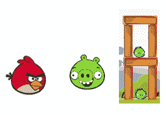
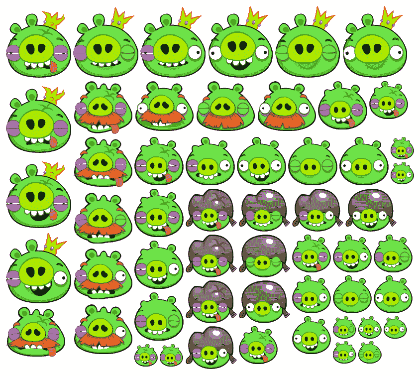
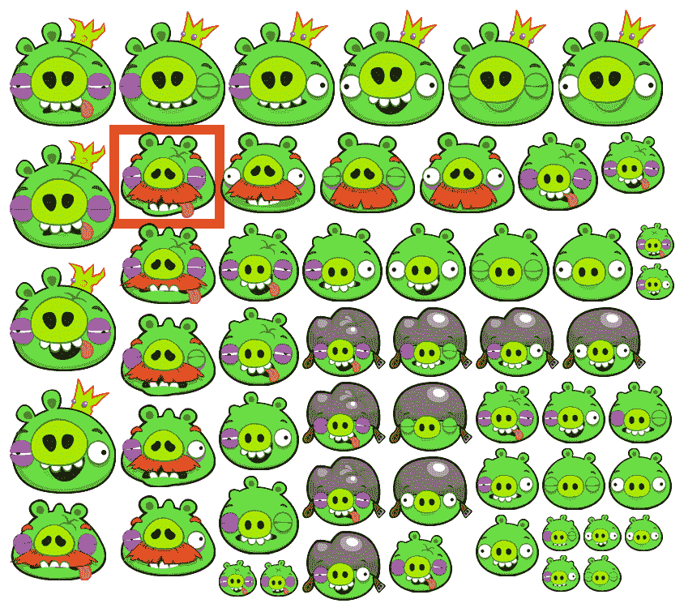
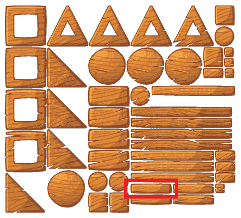
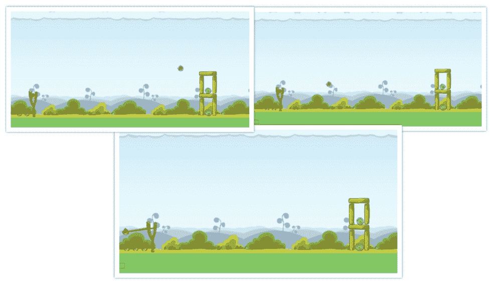
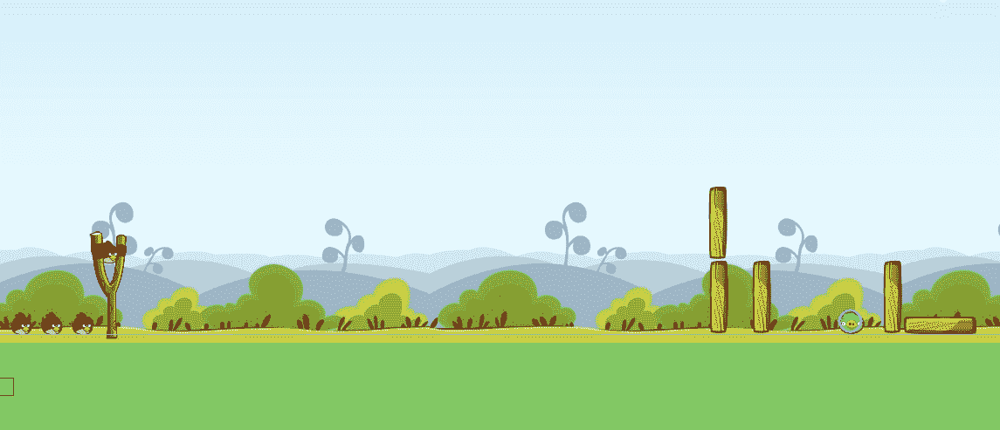

# 十五、通过制作愤怒的小鸟游戏了解 Pymunk

Python 作为一种独立语言在数据科学和机器学习领域已经有五年的历史，在 pymunk 等开源软件包出现之前，它在游戏开发行业还不够流行。这些开源软件包为游戏开发人员提供了一个通过模拟来模拟真实世界环境的简单界面，允许他们创建单个或多个身体对象，将玩家的输入与物理脉冲联系起来。这种演变将连续物理模型的使用引入 Python 游戏开发中，在 Python 游戏开发中，为了提高效率，一些对象被允许休息，并且只有在碰撞的原则下才会被曝光。有了这个模型，我们可以正确有效地处理多个对象的碰撞。

在本章结束时，您将了解 Pythonic 2D physics library 的基础知识，从而了解如何使用类和子模块构建复杂的游戏，如愤怒的小鸟，该游戏通过考虑物理特性（如质量、运动、惯性、弹性和力矩）来模拟真实世界的环境。您还将学习如何创建二维刚体，并将它们链接到玩家的输入，以模拟物理脉冲。这将导致刚体在模拟环境（空间）中移动。您还将学习如何通过更新物理属性来使用时间间隔步长（dt），以促进刚体在该空间内的移动。

到目前为止，您一直在检查两个游戏实体之间的碰撞（在[第 11 章](11.html)、*Outdo Turtle–Snake 游戏 UI 和 Pygame*中，您检查了蛇与边界墙之间的碰撞，而在[第](12.html)章[1](12.html)[2](12.html)*中，学习角色动画、碰撞和移动*，您检查了鸟和垂直管道之间的碰撞），但本章将更具启发性，因为您将逐个检查三个游戏对象之间的碰撞，并通过创建碰撞处理程序执行动作。

本章将介绍以下主题：

*   理解 pymunk
*   创建角色控制器
*   创建多边形类
*   探索蟒蛇物理模拟
*   实施吊索行动
*   寻址冲突
*   创建级别
*   处理用户事件
*   可能的修改

# 技术要求

您必须具备以下要求才能完成本章：

*   Pygame 编辑器（IDLE）版本 3.5 或更高版本。
*   PyCharm IDE（有关安装过程，请参阅[第 1 章](01.html)、*了解 Python–设置 Python 和编辑器*。
*   `pymunk`模块（可在[上获得的开源库）http://www.pymunk.org/en/latest/](http://www.pymunk.org/en/latest/) 。
*   本章的代码可以在本书的 GitHub 存储库中找到：[https://github.com/PacktPublishing/Learning-Python-by-building-games/tree/master/Chapter15](https://github.com/PacktPublishing/Learning-Python-by-building-games/tree/master/Chapter15)
*   指向《愤怒的小鸟》精灵床单的外部链接：[https://www.spriters-resource.com/mobile/angrybirds/sheet/59982/](https://www.spriters-resource.com/mobile/angrybirds/sheet/59982/) 。

请查看以下视频以查看代码的运行情况：

[http://bit.ly/2oG246k](http://bit.ly/2oG246k)

# 理解 pymunk

在现实环境中，对象在无处不在的方向上任意移动。因此，为了模仿这些动作，游戏必须处理对象的不同物理行为。例如，当我们将一个物体抛向空中时，由于重力的存在，该物体会在某个点撞击地面。同样，我们还必须解决每次物体从表面反弹时物体速度的降低问题。例如，如果我们将一个球抛向空中，一段时间后，它必须以原始速度 V<sub>o</sub>撞击地面，一次撞击地面后，它将从地面反弹，然后以速度 V<sub>f</sub>上升。因此，很明显 V<sub>o</sub>V>V<sub>f</sub>。在游戏环境中为对象实现这种行为将给玩家留下良好的游戏印象。

物理学作为自然科学的一个分支，试图通过模拟和数学推导来模拟现实世界中的行为。物理学中定义了不同的术语，如质量、惯性、冲量、弹性、摩擦力等等。这些术语定义了对象暴露在不同环境中时的特征。不要陷入错综复杂的物理中，让我们开始做正事吧。真正的问题是，为什么我们在游戏中需要物理？这个问题的答案很简单：与现实世界中的对象类似，游戏也有对象/角色。这些角色由游戏玩家控制。大多数玩家喜欢玩模拟现实世界现象的游戏。

在使用`pymunk`模块之前，您必须了解以下一些物理术语：

*   **质量**：字面上，质量是指任何物体的重量。考虑到物体的物理定义，物体的质量是物体中物质数量的量度。
*   **力**：力是物体与另一物体*相互作用*产生的对物体的推或拉。
*   **重力**：例如，导致苹果落地的力。重力是两个物体相互吸引的力。
*   **弹性**：变形物体的一种特性，变形后的物体会被重塑并恢复到原来的形状。例如，弹簧和橡皮筋将恢复其原始形状，即使施加力使其变形。
*   **力矩**：力矩是使物体绕特定点或轴旋转的特性。

If you have not played Angry Birds before, make sure to check out this link: [http://freeangrybirdsgame.org/play/angry_birds_online.html](http://freeangrybirdsgame.org/play/angry_birds_online.html.). While playing the game, observe the number of characters, structures, and catapult actions.

如果我们《愤怒的小鸟》游戏中的两个角色（小鸟和猪）都有水平动作，那就太无聊了。例如，当玩家从弹弓或材料弹弓中射出一只愤怒的小鸟时，如果它不跟随投射物的运动（45 度运动），而只是沿着水平方向（90 度运动），该怎么办？这违反了一条物理定律，即*地球向你们*拉。也许我们可以说这就是为什么这是一件大事。违反这些法律会使游戏变得愚蠢和荒谬，这可能会损害游戏的声誉。为了在游戏中模拟真实世界的物理，Python 社区开发了一个 2D 物理库。我们可以使用这个库为游戏对象使用不同的特性，例如质量、惯性、冲量和摩擦力。

首先，我建议您在[查阅 pymunk 的官方文件 http://www.pymunk.org/en/latest/pymunk.html.](http://www.pymunk.org/en/latest/pymunk.html) 由于`pymunk`的包和模块经常更新，您将在其官方文档页面上看到大量资源。只是不要被它的数量弄得不知所措，我们只需要其中的一小部分就可以制作一个使用 pymunk 2D 物理库的游戏。

现在您已经阅读了文档，我假设您可能已经看到了几个子模块和类。我们需要其中一些，我们将讨论所有这些。我们将从 pymunk 开始，它是最流行和最广泛使用的子模块。它的名字叫`vec2d`。为了观察`vec2d`的工作情况，您必须复习您的基础知识，这是我们在[第 9 章](09.html)、*数据模型实现*中了解到的。综上所述，我们使用不同的数据模型来实现向量操作（我们使用`__add__()`来添加向量，`__str__()`来格式化向量，等等）。我们已经学习了向量操作，但是是以一种类似于蟒蛇的方式；现在，让我们以模块化的方式了解它。Python 开发者社区已经为`vec2d`创建了一个子模块；也就是说，`Vec2d`类，用于执行任何与向量相关的操作。

在看`Vec2d`类的示例之前，让我们先设置 PyCharm 项目。打开 PyCharm 编辑器并创建一个新项目。我会叫它*愤怒的小鸟*。为项目提供名称后，按“创建”按钮创建项目。当 PyCharm 准备好项目时，创建一个名为`test.py`的新 Python 文件。在编写任何代码之前，我们必须在当前项目中安装`pymunk`模块。

按照以下步骤进行操作（要获得如何在 PyCharm 中安装任何第三方库的详细说明，请参阅[第 1 章](01.html)、*了解 Python–设置 Python 和编辑器*：

1.  单击文件|设置。设置窗口将打开。
2.  在左侧选项卡上，单击项目：愤怒的小鸟选项卡。它将列出 Python 解释器中安装的所有模块。
3.  要添加新模块，请单击“软件包”选项卡旁边的（+）按钮。
4.  搜索`pymunk`并安装模块（确保您的 internet 连接已启动并正在运行）。

既然`pymunk`模块已经成功安装，让我们回到`Vec2d`类。正如我们前面提到的，这个类可以用来执行向量操作。它是使用数据模型进行矢量操作的替代方法。让我们看一个使用`Vec2d`类创建向量的简单示例：

```py
from pymunk.vec2d import Vec2d
print(Vec2d(2, 7))

#add two vectors
print(Vec2d(2, 7) + Vec2d((3, 4)))

#results
Vec2d(2, 7)
Vec2d(5, 11)
```

除了执行数学计算外，`Vec2d`还可以执行不同的高级函数计算。例如，如果要求两个向量之间的距离，可以调用`get_distance()`函数，如下所示：

```py
print(Vec2d(3,4).get_distance(Vec2d(9,0)))
7.211102550927978
```

前面的函数使用以下公式计算两个矢量点之间的距离√（x2− x1）^2+（y2− y1）^2，其中（x1，y1）和（x2，y2）是两个矢量坐标。欲了解更多有关距离公式的信息，请访问[https://www.purplemath.com/modules/distform.htm](https://www.purplemath.com/modules/distform.htm) 。

既然我们已经探索了`Vec2d`，我们将学习`pymunk`课程。有超过 10 个，但我们将只了解重要的。您可以通过访问他们的官方文档页面来了解他们。让我们逐一了解他们。

# 探索 pymunk 的内置类

首先，我们将从`Space`类开始。此类指的是所有游戏角色将驻留的占位符。游戏角色的移动也将在此空间中定义。当我们开始在游戏中前进时，刚性对象的属性（具有质量、摩擦力、弹性和惯性等物理属性）将在该空间中发生变化。例如，不同空间中的对象将具有不同的速度和加速度。在《愤怒的小鸟》游戏中，愤怒的小鸟的速度将不同于玩家最初将其从弹射器上吊起，然后与游戏中的结构（梁和柱，我们将在一分钟内介绍）发生碰撞时的速度。

`pymunk`模块中定义了很多方法，因此我们将从最重要的一个开始：`add_collision_handler(collision_type_a, collision_type_b)`。回想[第 11 章](11.html)、*奥多乌龟-蛇类游戏界面与 Pygame*一起，您制作了一个蛇类游戏，并自行添加了碰撞处理程序，添加了一些逻辑，暗示*当两个物体的位置相同时，据说它们发生了碰撞*。这个方法是一种以更简单的方式做同样事情的方法，只需调用`pymunk`内置函数。这个由`pymunk`生成的冲突处理程序将接受两个参数：`type_a`和`type_b`。您必须记住，这两种类型都是整数。我们将使用它们显式地定义两个对象。例如，在《愤怒的小鸟》游戏中，将有三个主要角色：小鸟、木头和猪（要下载所需资产，请查看*技术要求*部分中提到的 GitHub 链接）。由于我们有三个字符，因此必须为每个字符添加冲突处理程序，如下所示：

*   **鸟猪碰撞**：我们称之为`add_collision_handler(0, 1)`，其中`0`表示鸟角色的整数类型，1 表示猪游戏角色的整数类型。
*   **鸟木碰撞**：我们称之为`add_collision_handler(0, 2)`，其中`2`表示木游戏角色的整数类型。（请记住，在整个游戏中，0 必须代表鸟角色，不得用于任何其他角色）。
*   **当清管器与木材碰撞**时，我们将调用`add_collision_handler(1, 2)`。

通过这样做，我们将感受到`Space`类中定义的冲突处理程序的强大功能。此函数用于检查两个对象是否发生碰撞，对于由`type_a`和`type_b`表示的对象之间的碰撞，返回`CollisionHander`。

现在我们已经学习了 pymunk 中的碰撞处理，我们将学习两个最重要和最常用的`pymunk`模块类：`Body`和`Shape`。首先，我们将从学习 pymunk`Body`类及其属性开始。然后，我们将探索 pymunk`Shape`课程，学习如何在几何图形中添加不同的物理特性，如弹性、质量和力矩。

# 探索 pymunk 身体类

在制作复杂的游戏（如愤怒的小鸟）时，我们必须定义多个游戏角色，如鸟、猪和木结构。下图提供了这些游戏角色的视觉效果：



所有这些都是图像（在 Pygame 的意义上，它们是精灵）。除非我们将它们转化为刚体，否则它们不能直接使用。Pygame 定义物理测量（质量、运动、摩擦力和冲量）的方式意味着它将把这些精灵转化为刚体。`Body`类的力量来了：`Body`类采用任何形状（圆形、多边形、精灵等），并注入质量、力矩、力等属性，如：

```py
import pymunk
space = pymunk.Space() #creating Space instance
body = pymunk.Body() #creating Body instance
object = pymunk.Circle(body, 4)
object.density = 2
#print body measurements
print("Mass : {:.0f} and Moment: {:.0f}".format(body.mass, body.moment))

space.add(body, object)
print("Mass: {:.0f} and Moment: {:.0f}",format(body.mass, body.moment))
```

上述代码的结果如下：

```py
Mass : 0 and Moment: 0
Mass: 101 and Moment: 804
```

在前面的代码中，我们首先定义了`space`。如前所述，`Space`是一个表示对象占位符的类。仔细看看`space.add(body, object)`语句：我们已经使用`add()`方法将对象添加到`space`中。同样，我们也做了一个`Body`类的实例。`Body`类不一定指对象或游戏角色；相反，这是一个虚拟的地方，我们可以添加游戏角色。`object = pymunk.Circle(body, 4)`语句将创建一个半径为`4`单位的圆形对象，并将其添加到`Body`的范围中。创建圆形对象后，我们添加了密度（对象的密集属性：对象占用的每单位体积的质量；有关密度的详细信息，请参阅以下链接：[https://www.nuclear-power.net/nuclear-engineering/thermodynamics/thermodynamic-properties/what-is-density-physics/](https://www.nuclear-power.net/nuclear-engineering/thermodynamics/thermodynamic-properties/what-is-density-physics/) 。

将`density`属性添加到对象后，我们打印了两个实体：第一个实体未添加到空间中，另一个圆形实体（连同`density`一起）添加到空间中。我们印了两个尸体。正如预期的那样，第一批物体并没有进入太空，我们也没有为那个物体定义任何属性，所以它的质量和力矩显示为零。同样地，在主体被添加到`space`之后，它们的质量和力矩分别变为 101 和 804 个标准单位。

现在，让我们了解一下`pymunk`模块的另一个重要类，它的名称为`Shape`。

# 探索 pymunk 形状类

`Shape`类别下有三个不同的类别：`Circle`、`Poly`和`Segment`。然而，学习`Shape`课程本身就足以让我们理解这些类别。让我们了解一些重要的物理属性（全部小写），我们可以从以下几点调用这些形状：

*   `copy()`：对当前形状进行深度复制。
*   `density`：形状的密度。计算附着形状的物体的质量和惯性矩的一个极其重要的特性。我们在*探索*的*pymunk 身体类*部分中看到了一个例子。
*   `elasticity`：定义形状的弹性。此属性用于定义形状的反弹性质。如果“弹性”值为 0，则该形状无法反弹。对于完美反弹，弹性值应为 1。
*   `friction`：定义形状的`friction`系数。`friction`值`0`定义了无摩擦表面，而`1`定义了完美的精细（无粗糙）表面。
*   `mass`：定义形状的权重。当`mass`较高时，物体无法弹跳和自由移动。
*   `moment`：计算形状的力矩。

为了观察前面属性的应用，我们不创建`Shape`类的实例。相反，我们使用`Circle`、`Poly`和`Segment`类。

`Circle`类（我们在上一节中使用过）可以这样实例化：

```py
pymunk.Circle(body, radius_of_circular_shape)
```

对于圆形对象，还可以定义密度、弹性、摩擦力、质量和力矩等特性。我们将在制作愤怒的小鸟游戏时看到一个例子。

类似地，我们可以使用`Poly`类创建多边形形状。以下语法表示使用`Poly`类创建实例：

```py
pymunk.Poly(body, vertices, transform = None, radius = 0)
```

在前一行代码中，`body`是`Body`类的实例，它表示形状的虚拟空间。`vertices`参数定义多边形凸包的顶点。`Poly`类使用顶点自动计算凸包。其余两个参数*transform*和*radius*是可选的。`transform`是`Transform`类的对象（参见[http://www.pymunk.org/en/latest/pymunk.html#pymunk.Poly](http://www.pymunk.org/en/latest/pymunk.html#pymunk.Poly) 了解有关`transform`的更多信息，`transform`将变换应用于多边形的每个顶点，而`radius`参数设置所创建多边形形状的半径。

你可能想知道制作《愤怒的小鸟》游戏时`Poly`类的应用程序是什么。在这个游戏中，我们有两个主要角色，以及由梁和柱组成的木结构，它们是使用`Poly`类制作的。当我们开始制作《愤怒的小鸟》游戏时，我们将对此进行更多的讨论。

最后，我们还有另一个有用的类，称为`Segment`类。让我们探讨如何创建其实例：

```py
pymunk.Segment(body, point1, point2, radius)
```

顾名思义，`Segment`类负责定义两点之间的线段形状：`point1`和`point2`。它是一个重要的类，因为它定义了游戏的表面。`radius`参数定义从`point1`到`point2`绘制的线段的厚度。还可以向该形状添加若干前述属性，例如`mass`、`density`、`elasticity`和`friction`。通常，在创建游戏表面时，摩擦力用于定义表面粗糙度。即使在《愤怒的小鸟》游戏中，我们也可以使用`Segment`类创建游戏表面，并将身体与一定程度的摩擦（0-1）相关联，这定义了表面的精细度和粗糙度。值 0 表示 100%的精细，而 1 表示完全粗糙。

现在我们已经完全配备了与`pymunk`模块相关的所有类和属性，我们可以开始编写愤怒的小鸟游戏了。

# 创建角色控制器

如果你还没有玩过《愤怒的小鸟》，我强烈鼓励你这么做。在网上搜索愤怒的小鸟并播放几分钟。在玩游戏时，观察主要角色（鸟和猪）、他们的动作以及他们与木质结构的互动。木结构由不同的梁和柱结构组成，不同数量的木结构一个接一个地燕尾。

看了原版游戏后，就可以开始编写自己的愤怒的小鸟游戏了。我们之前在 PyCharm 中，在安装`pymunk`模块时制作了愤怒的小鸟项目。我们将使用相同的项目文件夹创建此游戏。创建一个新的 Python 文件并将其命名为`characters.py`。

In this Angry Bird project, we are not going to write whole pieces of code within a single file. While coding complex games such as Angry Birds, it is important for us to create different modules for different tasks. Doing so, we can easily find bugs while testing our game. In this Angry Birds game, we will create four Python files: `characters.py`, `polygon.py`, `main.py`, and `level.py`.

我们刚刚创建的第一个文件将包含游戏中的主要角色：鸟和猪。木梁和柱结构将在下一个文件中创建；也就是说，`polygon.py`。但现在，让我们专注于`characters.py`文件。

`characters.py`文件将包含两个类：一个用于`Bird`，另一个用于`Pig`。然后，我们将为每个类定义几个控制移动的属性，即物理属性。以下代码表示`characters.py`文件的内容：

```py
import pymunk as p #aliasing pymunk as p
from pymunk import Vec2d #for vector manipulation
```

导入必要的模块后，让我们为`Bird`角色定义类（愤怒的小鸟移动由玩游戏的玩家处理）：

```py

class RoundBird():
    def __init__(self, distance, angle, x_pos, y_pos, space):
        weight = 5
        r = 12 #radius
        value_of_inertia = p.moment_for_circle(weight, 0, r, (0, 0))
        obj_body = p.Body(weight, value_of_inertia)
        obj_body.position = x_pos, y_pos
        power_value = distance * 53
        impulse = power_value * Vec2d(1, 0)
        angle = -angle
        obj_body.apply_impulse_at_local_point(impulse.rotated(angle))
        obj_shape = p.Circle(obj_body, r, (0, 0))
        obj_shape.elasticity = 0.95 #bouncing angry bird
        obj_shape.friction = 1 #for roughness
        obj_shape.collision_type = 0 #for checking collisions later
        space.add(obj_body, obj_shape)
        #class RoundBird attribute ----
        self.body = obj_body
        self.shape = obj_shape
```

在前一行代码中，我们定义了愤怒的小鸟角色的所有物理和位置属性。我们首先定义构造函数。构造函数的参数如下所示：

*   `distance`两个体位之间，通常通过距离公式（[计算 https://www.purplemath.com/modules/distform.htm](https://www.purplemath.com/modules/distform.htm) 并传递给`Bird`类。
*   `angle`以度为单位执行`Bird`字符的移动。
*   **`x_pos`**、**`y_pos`**代表`Bird`的位置。
*   `space`表示呈现`Bird`的`space`对象。

在构造函数中，我们为`Bird`字符添加了多个物理属性。例如，`elasticity= 0.95`表示反弹能力（标准），`friction = 1`（表面粗糙度等级），功率=完成的功（距离）*时间（53）。鸟的质量（重量）为 20，`birdLife`类属性表示鸟角色与地面或其他角色（猪或木结构）碰撞时减少的数量。

The values of friction, elasticity, and work done are not random (I didn't use them arbitrarily). They are defined on the official documentation page. Refer to the following URL to explore the chart: [http://www.pymunk.org/en/latest/pymunk.html#pymunk.Shape](http://www.pymunk.org/en/latest/pymunk.html#pymunk.Shape).

`Bird`类的两个重要方法（在前面的代码中突出显示）是`pymunk`模块定义的内置函数。第一种方法`moment_for_circle()`计算空心圆的惯性矩（任何物理物体对其速度变化的阻力）。传递给函数的参数是对象的*质量*；即*内半径*和*外半径*。观察内半径，它被传递为`0`，意思是愤怒的小鸟（游戏的主要角色是一个圆形实心圆）。如果内径为`0`，则表示这是一个实心圆形物体。外半径定义了愤怒的小鸟的圆形尺寸。同样，观察`collision_type = 0`属性。此语句将向小鸟游戏角色添加整数类型。当使用`add_collision_handler(type_a, type_b)`检查两个对象之间的碰撞时，我们使用此碰撞类型值来指示角色的`0`值为`Bird`。对于`Bird`字符，我们有一个等于`0`的碰撞类型。`Pig`类将其冲突类型定义为`1`。

类似地，下一种方法`apply_impulse_at_local_point(impulse, point = (0, 0))`将对身体施加局部脉冲。反过来，这将表示当提供力量时，愤怒的小鸟的动量会发生多大的变化。参见[https://study.com/academy/lesson/impulse-definition-equation-calculation-examples.html](https://study.com/academy/lesson/impulse-definition-equation-calculation-examples.html) 了解更多关于冲动和动量的知识。

接下来，我们需要为`Pig`字符定义类。下面的代码应该在`Bird`类之后编写：

```py

class RoundPig():
    def __init__(self, x_pos, y_pos, space):
        self.life = 20 #life will be decreased after 
          collision of pig with bird
        weight = 5
        r = 14 #radius
        value_of_inertia = p.moment_for_circle(weight, 0, r, (0, 0))
        obj_body = p.Body(weight, value_of_inertia)   
      #creates virtual space to render shape
        obj_body.position = x_pos, y_pos
        #add circle to obj body
        obj_shape = p.Circle(obj_body, r, (0, 0))
        obj_shape.elasticity = 0.95
        obj_shape.friction = 1
        obj_shape.collision_type = 1
        space.add(obj_body, obj_shape)
        self.body = obj_body
        self.shape = obj_shape
```

前面的代码类似于`Bird`类。与之前一样，我们定义了与`Pig`字符相同的弹性和摩擦级别。我们向对象添加了惯性和质量效果。对于`Pig`字符，增加了`collision_type`作为`1`，这意味着在检查猪和鸟的碰撞时，我们可以简单地调用`add_collision_handler(0, 1)`，其中`0`代表鸟，`1`代表猪。

现在我们已经为愤怒的小鸟游戏创建了两个主要类，`RoundBird`和`RoundPig`，在`characters.py`文件中，我们将创建另一个游戏角色，即木制结构（梁和柱）。

# 创建多边形类

对于每个游戏实体，我们都创建了单独的类，即 Bird 和 Pig。由于我们的最终游戏实体是一个木制结构（玩家用弹弓射击），我们将创建一个不同的 Python 文件，并为这个实体创建一个类。但在此之前，让我们先来看看关于精灵床单的一个重要概念。

Python 游戏开发中使用的图像通常称为 Sprite，它们是静态图像，根据用户的动作（如单击键盘上的箭头键时移动蛇）对其进行一些操作（矢量运动）。在前面的章节（[第 12 章](12.html)、*学习角色动画、碰撞和运动*、以及[第 13 章](13.html)、*使用 Pygame*对俄罗斯方块游戏进行编码）中，我们使用了精灵（单个图像），但没有使用精灵表单（包含多个静态图像的表单）。下面是一个精灵床单的示例，它是我们的愤怒的小鸟游戏所特有的：



这些图像文件通常不包含游戏角色的单个图像。如您所见，它们通常包含大量不同的游戏角色。但大多数情况下，我们只需要从整个 sprite 表中获取一张图像。因此，问题是，我们如何从这样的精灵片中提取出一幅图像？我们使用`Pygame`模块的`Rect`类来实现。你还记得 Pygame 模块中的`Rect`类（[第 11 章](11.html)、*奥多乌龟-带 Pygame*的贪食蛇游戏界面）吗？此类基于左侧、顶部、宽度和高度标注创建矩形对象。要从上述精灵表中提取图像，我们将围绕其中一个精灵绘制一个矩形，如下所示：



这个映射是在`Rect`类的帮助下完成的。`Rect`类将创建一个矩形，其尺寸为屏幕上的四个点（左、上、宽和高）。这样，通过改变`Rect`对象的任意四个维度，我们可以提取精灵片的部分或子表面。

现在，让我们通过创建一个木质结构来了解这一点。首先，从以下 GitHub 链接下载 sprite 资产：[https://github.com/PacktPublishing/Learning-Python-by-building-games/tree/master/Chapter15/res](https://github.com/PacktPublishing/Learning-Python-by-building-games/tree/master/Chapter15/res) 。您将看到各种图像以及代码资源。`res`文件夹中有两个文件夹：一个用于照片，另一个用于声音。您必须复制整个文件夹并将其粘贴到 PyCharm 编辑器中的愤怒的小鸟项目文件夹中。

导入资源后，我建议您打开`wood.png`文件。此文件包含不同的木质结构。当用这些木制结构创建多边形时，我们必须使用`Rect`类裁剪其中一个图像。

在同一个愤怒的小鸟项目中，创建另一个名为`polygon.py`的 Python 文件。我们将首先导入必要的模块：

```py
import pymunk as pym
from pymunk import Vec2d
import Pygame as pg
import math
```

现在，让我们创建`Polygon`类：

```py
class Polygon():
    def __init__(self, position, length, height, space, mass=5.0):
        value_moment = 1000
        body_obj = pym.Body(mass, value_moment)
        body_obj.position = Vec2d(position)
        shape_obj = pym.Poly.create_box(body_obj, (length, height))
        shape_obj.color = (0, 0, 255)
        shape_obj.friction = 0.5
        shape_obj.collision_type = 2 #adding to check collision later
        space.add(body_obj, shape_obj)
        self.body = body_obj
        self.shape = shape_obj
       wood_photo = 
          pg.image.load("../res/photos/wood.png").convert_alpha()
 wood2_photo = 
          pg.image.load("../res/photos/wood2.png").convert_alpha()
 rect_wood = pg.Rect(251, 357, 86, 22)
 self.beam_image = wood_photo.subsurface(rect_wood).copy()
 rect_wood2 = pg.Rect(16, 252, 22, 84)
 self.column_image = wood2_photo.subsurface(rect_wood2).copy()
```

我们为`Polygon`类定义的属性与我们为`Bird`和`Pig`类定义的属性非常相似：我们初始化了摩擦力并添加了`collision_type`以便引用具有整数`2`的多边形形状。构造器使用一个参数，即`po*s*ition`，告诉我们要渲染的多边形的位置，多边形的`length`和`height`，要渲染多边形的`space`对象，以及多边形形状的`mass`。

前面代码中唯一新颖的地方是代码中突出显示的部分。我们已经使用 Pygame 的`load`方法将`wood.png`和`wood2.png`图像加载到 Python 项目中。`convert_alpha()`方法作为一个优化器，将创建一个新的图像表面，适合快速光点。`Rect`类需要四个维度来创建一个矩形曲面（请参考[第 11 章](11.html)、*奥多乌龟-蛇类游戏 UI 和 Pygame*）。所提供的尺寸值不是随机给定的，而是表示我们需要提取的覆盖精灵片亚表面的值。例如，`self.beam_image = wood.subsurface(rect).copy()`命令将从`wood.png`文件中提取水平光束图像（红色矩形包围的木块），如下所示；



现在我们已经提取了水平和垂直木质图像（分别是梁和柱），我们可以开始绘制包含它们的多边形。然而，有一个问题。因为，尽管我们一直在一起使用 Pygame 和`pymunk`，但它们的坐标系并不相同：`pymunk`使用的坐标系原点在左下角，而 Pygame，正如您可能已经知道的，使用的坐标系原点在左上角。因此，我们将创建一个函数，将`pymunk`坐标系转换为兼容的 Pygame 坐标系：

```py
def convert_to_pygame(self, pos):
    """Function that will transform pymunk coordinates to 
         Pygame coordinates"""
    return int(pos.x), int(-pos.y+610)
```

前面的功能很重要，因为游戏界面将由`Pygame`模块构成。因此，我们必须跟踪必须渲染梁和柱的位置。现在，让我们开始将`polygon`绘制到曲面中：

```py
def draw_poly(self, element, screen):
    """Draw beams and columns"""
    polygon = self.shape

    if element == 'beams':
        pos = polygon.body.position
        pos = Vec2d(self.convert_to_pygame(pos))
        angle_degrees = math.degrees(polygon.body.angle)
        rotated_beam = pg.transform.rotate(self.beam_image,
                                                   angle_degrees)
 offset = Vec2d(rotated_beam.get_size()) / 2.
        pos = pos - offset
 final_pos = pos
 screen.blit(rotated_beam, (final_pos.x, final_pos.y))
```

前面的函数将用于在屏幕上放置一个梁，其中一个对象作为参数传递给它。函数的第一个参数是*元素*，它告诉函数要绘制哪个多边形：是梁还是柱？在下面的代码中，我们将向 draw 列添加一些逻辑，但是现在，让我们观察一下我们到目前为止编写的内容。代码从获取*形状*对象开始。然后，我们检查元素是否为`beam`。如果是`beam`，那么我们得到图像的位置，并将其转换为`Vec2d`坐标位置。代码的高亮部分（获取旋转光束图像的角度）将确保光束图像位于红色矩形（虚拟）区域内，如下所示：


只需删除前面代码中突出显示的那一行，然后观察结果。您将看到，由于`Vec2d`坐标系的偏移，光束不会完全对齐。类似地，让我们添加一些代码，以便可以在屏幕上绘制列：

```py
if element == 'columns':
    pos = polygon.body.position
    pos = Vec2d(self.convert_to_pygame(pos))
    angle_degrees = math.degrees(polygon.body.angle) + 180
    rotated_column = pg.transform.rotate(self.column_image,
                                               angle_degrees)
 offset = Vec2d(rotated_column.get_size()) / 2.
    pos = pos - offset
 final_pos = pos
    screen.blit(rotated_column, (final_pos.x, final_pos.y))
```

在前面的代码中，前几行将把`pymunk`坐标转换成 Pygame。因为列应该在 Pygame 图面中呈现，所以此转换是必要的。类似地，在获得位置坐标后，我们取一个坐标角，并确保向其添加 180 或 0，以使其保持原始图像而不旋转。在获得该图像后，我们对其进行变换并创建一个新图像作为`rotated_column`图像。请记住，如果旋转角度不是 90 的倍数，图像将失真。在前一行代码中，如果旋转后的图像中没有删除`offset`，图像将向下移动，如下图所示：


在前面的屏幕截图中，红线表示曲面。因此，如果不删除柱体位置的偏移，柱将显示在曲面下方。

现在我们已经完成了`Polygon`类，它将在从主类调用`draw_poly()`函数时呈现梁或柱，现在是时候创建我们的主类了，它是所有类的主管。该类将负责创建所有类的实例，并调用在不同类中定义的方法，以将游戏对象渲染到 Pygame 游戏表面。

# 探索蟒蛇物理模拟

首先，让我们从修改到目前为止所做的工作开始。我们首先定义了两个主要的游戏实体：`Bird`和`Pig`。所有主要的物理特性，如质量、惯性和摩擦力，都是为这些特性中的每一个定义的，以便模拟真实世界的物理。在创建了两个主要的游戏角色之后，我们制作了另一个 Python 文件，以便创建`Polygon`类。创建这个类是为了在游戏中借助梁和柱渲染木制结构。现在，我们将创建另一个名为`main.py`的 Python 文件。这将是游戏的主要控制器。

使用以下代码在`main.py`文件中声明基础物理。我们将首先导入一些基本模块：

```py
import os
import sys
import math
import time
import Pygame
import pymunk
from characters import RoundBird #our characters.py file have Bird class
```

导入必要的模块后，我们需要从之前添加的精灵中裁剪一些子曲面。显然，我们不需要从精灵表中提取所有内容，因此我们将只提取其中的一部分来创建游戏角色。然而，由于我们的主角，我们的愤怒的小鸟，只有一个单一的形象，并没有出现在精灵表，我们不需要裁剪图像的愤怒的小鸟和弹弓。然而，对于`Pig`角色，我们必须创建一个`Rect`对象，因为`Pig`图像捆绑在一张精灵表中。因此，我们必须使用以下代码加载图像：

```py
Pygame.init()
screen = Pygame.display.set_mode((1200, 650))
redbird = Pygame.image.load(
 "../res/photos/red-bird3.png").convert_alpha()
background_image = Pygame.image.load(
 "../res/photos/background3.png").convert_alpha()
sling_image = Pygame.image.load(
 "../res/photos/sling-3.png").convert_alpha()
full_sprite = Pygame.image.load(
 "../res/photos/full-sprite.png").convert_alpha()
rect_screen = Pygame.Rect(181, 1050, 50, 50)
cropped_image = full_sprite.subsurface(rect_screen).copy()
pig_image = Pygame.transform.scale(cropped_image, (30, 30)) 
#(30, 30) resulting height and width of pig

```

在前面的代码中，我们首先使用 Pygame 模块定义了一个游戏屏幕。之后，我们加载了所有作为单个图像存在的图像，但没有加载 sprite 表，例如`red-bird3.png`、`background3.png`和`sling-3.png`。如前所述，猪的图像是`full-sprite.png`中一组图像的一部分。由于我们只需要一张清管器图像，我们将执行与提取梁和柱时执行的类似过程。我们将创建一个具有猪形状精确尺寸的`Rect`对象，然后使用它从精灵表中提取猪图像。然后，我们将裁剪该图像并将其存储为裁剪对象，最终将对其进行变换，使其高度和宽度分别为`30`、`30`。

现在，我们已经为游戏对象提取了必要的图像，让我们开始为每个对象声明物理变量和位置变量：

```py
running = True
#base physics code
space_obj = pymunk.Space()
space_obj.gravity = (0.0, -700.0)
```

正如我们所知，愤怒的小鸟游戏是通过使用鼠标来拉伸弹射器在一个吊起的动作。因此，我们必须声明一些变量来处理这些吊索动作：

```py
mouse_distance = 0 #distance after stretch
rope_length = 90 

angle = 0
mouse_x_pos = 0
mouse_y_pos = 0

mouse_pressed = False
time_of_release = 0

initial_x_sling, initial_y_sling = 135, 450 #sling position at rest (not stretched)
next_x_sling, next_y_sling = 160, 450
```

在前面的代码中，我们定义了不同的变量，这样我们就可以跟踪鼠标在吊索动作前后的位置。`sling_action()`函数（我们将在后面声明）将处理这些值。现在，让我们创建一个列表来跟踪空间中显示的猪、鸟、梁和柱的数量：

```py
total_pig = []
total_birds = []
beams = []
columns = []
#color code
WHITE = (255, 255, 255)
RED = (255, 0, 0)
BLACK = (0, 0, 0)
BLUE = (0, 0, 255)
```

现在，我们已经为愤怒的小鸟游戏定义了所有必要的变量（如果需要，我们将在以后添加更多变量），现在是时候为屏幕创建一个曲面了。该曲面不是背景曲面；取而代之的是，它是所有结构都将居住的地方。愤怒的小鸟也会从这个表面反弹，因此我们必须为这个地面添加一些物理特性，如下所示：

```py
# Static floor
static_floor_body = pymunk.Body(body_type=pymunk.Body.STATIC)
static_lines_first = [pymunk.Segment(static_floor_body, (0.0, 060.0), (1200.0, 060.0), 0.0)]
static_lines_second = [pymunk.Segment(static_floor_body, (1200.0, 060.0), (1200.0, 800.0), 0.0)]

#lets add elasticity and friction to surface
for eachLine in static_lines_first:
    eachLine.elasticity = 0.95
    eachLine.friction = 1
    eachLine.collision_type = 3

for eachLine in static_lines_second:
    eachLine.elasticity = 0.95
    eachLine.friction = 1
    eachLine.collision_type = 3
space_obj.add(static_lines_first)
```

前一行代码将创建一些静态背景。在实例化静态主体时，我们可以通过添加`pymunk.Body.STATIC`常量显式地将`body-type`设置为`STATIC`。定义静态实体后，我们必须使用`Segment`类在一个点和另一个点之间创建一个线段（回忆*探索 pymunk 空间类*部分中的`Segment`类）。对于每个线段，我们在*检查碰撞*部分增加了`elasticity`来支持弹跳属性，`friction`来表示粗糙度，`collision_type`来检查其他游戏物体是否与地面发生碰撞，稍后会检查。创建这些静态曲面后，我们将它们添加到`Space`对象中，该对象将把它们渲染到屏幕上。

在定义静态曲面之后，我们需要定义吊索动作，即当玩家拉伸弹射器的绳索时会发生什么。我们将在下一节中实现这一点。

# 执行吊索动作

在本节中，我们将实施吊索动作。玩家将通过弹弓动作与游戏角色互动。但在执行吊索动作之前，我们必须注意几件事：玩家可以将弹射器的绳子伸展多远？冲量的角度是多少（运动员松开绳子后的运动轨迹）？鼠标动作点和绳索当前拉伸点之间的距离是多少？所有这些都必须通过声明函数来解决。首先，我们需要将 pymunk 坐标转换为 Pygame 坐标，以便我们可以将游戏对象与屏幕正确对齐（此转换的原因在*创建多边形类*部分中讨论）。

以下功能将`pymunk`坐标转换为 Pygame 坐标：

```py
def convert_to_pygame(pos):
    """ function that performs conversion of pymunk coordinates to
        Pygame coordinates"""
    return int(pos.x), int(-pos.y+600)
```

虽然 pymunk 的*x*坐标与 Pygame 的*x*坐标相同，但由于 pymunk 的原点位于左下角，我们必须将其更改为左上角。类似地，让我们定义另一个函数，即`vector`，它将传递的点转换为向量。以下代码表示`vector`功能的实现：

```py
def vector(a, b):
    #return vector from points
    p = b[0] - a[0]
    q = b[1] - a[1]
    return (p, q)
```

请参阅[第 9 章](09.html)、*数据模型实现*，了解更多关于如何使用位置向量创建向量的信息。这里，参数*a*和*b*表示从参考点转换为向量的点。现在我们已经创建了一个向量，让我们定义一个函数来返回两点之间的距离：

```py
def distance(x0, y0, x1, y1):
    """function to calculate the distance between two points"""
    dx = x1 - x0
    dy = y1 - y0
    dist = ((dx ** 2) + (dy ** 2)) ** 0.5
    return dist
```

前面的代码将使用`sqrt((x1 - x0) + (y0 - yo))`距离公式计算两点之间的距离公式，即`(x0, y0)`和`(x1, y1)`，其中`sqrt`表示`square root (math.sqrt(4) = 2)`。**运算符表示电源。例如，`dx ** 2`相当于`(dx)<sup>2</sup>`。

现在我们已经计算了距离，我们需要学习如何计算单位向量。单位向量是大小为 1 的向量。我们并不关心大小，但单位向量的意义在于它告诉我们向量的方向。一旦我们有了一个单位向量，我们就可以用任何因子来放大它，从而得到这个方向上的新向量。在创建吊索动作时，了解单位向量非常重要，因为这将为我们提供有关弹射器拉伸方向的信息。为了找到与向量方向相同的单位向量，我们必须将其除以其大小。使用数学推导，让我们构建一个函数并创建一个单位向量：

```py
def unit_vector(v):
    """ returns the unit vector of a point v = (a, b) """
    mag = ((v[0]**2)+(v[1]**2))**0.5
    if mag == 0:
        mag = 0.000000000000001
    unit_p = v[0] / mag #formula to calculate unit vector: vector[i]/magnitude
    unit_q = v[1] / mag
    return (unit_p, unit_q)
```

在上述代码中，h 的值由`sqrt(a^2 + b^2)`震级公式确定。为了找到单位向量，向量的每个分量（`v[0]`、`v[1]`）除以幅值（`mag`）。

现在我们已经声明了不同的函数来定义吊索动作的位置、大小和方向，我们可以开始定义执行吊索动作的方法。下图所示为弹射器，弹射器有两端，但没有连接绳索：


在这里，我们的主要任务将是添加鸟（主角）到这个弹射器，并确定它的位置。让我们首先在`sling_action`中定义一些全局变量：

```py

def sling_action():
    """will Set up sling action according to player input events"""
    global mouse_distance
    global rope_length
    global angle
    global mouse_x_pos
    global mouse_y_pos
```

在前一行代码中，我们声明了一些全局变量。然而，这些属性在*探索蟒蛇物理模拟*部分开始时用一些初始值初始化。这意味着我们必须进行一些操作来更新这些变量的值。`mouse_distance`变量将包含从弹射器静止点到玩家拉伸弹射器绳索点的距离值。类似地，`rope_length`表示玩家拉伸绳子时绳子的长度。角度表示冲量角，冲量角计算为坡度角。弹射器绳子的坡度表示当玩家拉伸绳子时绳子有多陡。`mouse-x-pos`和`mouse-y-pos`表示弹射器绳索拉伸时鼠标的当前位置。

现在，我们必须在这个`sling_action`函数中解决三件事：

1.  将愤怒的小鸟添加到吊索的绳索上（如下面的屏幕截图所示）。
2.  即使吊带的绳子被拉长，也要让鸟留在绳子上。
3.  解决吊索的绳索完全拉伸的情况。

要了解这些事件是什么，请看下图：


现在，让我们在`sling_action`函数中处理前面的所有操作：

```py
#add code inside sling_action function
""" Fixing bird to the sling rope (Addressing picture 1)"""
vec = vector((initial_x_sling, initial_y_sling), (mouse_x_pos, mouse_y_pos))
unit_vec = unit_vector(vec)
uv_1 = unit_vec[0]
uv_2 = unit_vec[1]

mouse_distance = distance(initial_x_sling, initial_y_sling, mouse_x_pos, mouse_y_pos) 
#mouse_distance is a distance between sling initials point to the point at which currrent bird is

fix_pos = (uv_1*rope_length+initial_x_sling, uv_2*rope_length+initial_y_sling)
highest_length = 102 #when stretched
```

前面的代码将为 sling 动作中的愤怒的小鸟角色创建一个视图。首先，`v`向量由两个坐标点（`sling_original`、`mouse_current`创建，例如（（2,3）、（4,5）），其中（2,3）表示处于静止位置的吊索或吊索的中心点，而（4,5）表示玩家激活鼠标动作时的位置。我们将从该向量创建一个单位向量，以了解玩家拉伸的方向。然后计算`mouse_distance`，通过调用前面定义的`distance()`函数来计算。此距离表示从静态吊索的中心到当前鼠标位置的距离。（`mouse_x_pos`、`mouse_y_pos`值表示绳索拉伸后鸟的最终位置。`uv_1`和`uv_2`单位向量将确保鸟留在绳子上，这由鼠标位置指示。例如，如果鼠标指针指向上方，绳子和鸟将向上伸展。

同样，让我们讨论第二种情况，即让愤怒的小鸟留在绳子上，即使绳子已经完全拉伸。我们将在以下代码中实现它：

```py
#to make bird stay within rope
x_redbird = mouse_x_pos - 20
y_redbird = mouse_y_pos - 20
if mouse_distance > rope_length:
    pux, puy = fix_pos
    pux -= 20
    puy -= 20
    first_pos = pux, puy
    screen.blit(redbird, first_pos)
    second_pos = (uv_1*highest_length+initial_x_sling, uv_2*highest_length+initial_y_sling) #current position ==> second_pos

 Pygame.draw.line(screen, (255, 0, 0), (next_x_sling, next_y_sling),
        second_pos, 5) 
    #front side catapult rope
    screen.blit(redbird, first_pos)
    Pygame.draw.line(screen, (255, 0, 0), (initial_x_sling,
       initial_y_sling), second_pos, 5)  
    #ANOTHER SIDE of catapult
```

在前面的代码中进行了很多操作，但是这些操作更简单，也更数学化。您必须尝试理解逻辑，而不是试图理解语法。让我们深入研究代码，找出每行代码背后的原因。首先，我们将鼠标位置减少 20 个单位，以确保在拉伸时，鸟仍停留在绳子的边缘。尝试将此值更改为 40 并观察效果。接下来，我们检查`mouse_distance`是否大于`rope_length`，以确保拉伸距离在限制范围内。我们不希望鼠标距离大于最大绳索长度。在这种情况下，我们将获取鼠标距离并减小它，直到和除非它低于绳子的最大长度

之后，我们将`blit`绳子末端的红鸟（愤怒的小鸟图片）。同样地，我们也必须`blit`绳子。在上图中，观察绳索变红处的绳索拉力。如果我们`blit`将绳索从静态吊索的中心移动到最大可能的绳索长度，就会产生红色。遵守代码的粗体部分；我们画了一条线，用颜色代码（255，0，0）表示绳子，也就是红色。这有两种说法：每边一种。因此，我们实现了这样一个条件：用户将把绳子拉伸到其定义的最大长度。

现在，我们必须解决第三个也是最后一个场景，即当玩家将绳子拉伸到最大长度时会发生什么？在前一行代码中，我们检查了`if mouse_distance > rope_length`，因此，如果播放器的长度小于`rope_length`，则应在代码的`else`部分进行处理，如下所示：

```py
else:
    #when rope is not fully stretched
    mouse_distance += 10
    third_pos = (uv_1*mouse_distance+initial_x_sling, 
      uv_2*mouse_distance+initial_y_sling)
    Pygame.draw.line(screen, (0, 0, 0), (next_x_sling, next_y_sling), 
      third_pos, 5)
    screen.blit(redbird, (x_redbird, y_redbird))
    Pygame.draw.line(screen, (0, 0, 0), (initial_x_sling, 
       initial_y_sling), third_pos, 5)
```

与前面的代码类似，我们将距离设置为不小于 10，这意味着当用户稍微拉伸绳子时，其`mouse_distance`将等于或大于 10。然后，我们创建`third_pos`来定义渲染绳子和愤怒的小鸟的位置。`uv_1`和`uv_2`是表示拉伸方向的单位向量。在得到位置后，我们`blit`找到愤怒的小鸟，然后画一条线来表示绳子。这将是黑色的，将在前面和后面完成。

现在我们已经为所有情况定义了场景，让我们添加一行代码来计算脉冲角度。只要绳子有拉伸，就会形成这个角度。tan（冲量角）等于拉伸绳索的斜率。坡度定义为梯段上升或（`dy`/`dx`），其中`dy`为`y`的变化，`dx`为 x 的变化。因此，冲量角可计算为`tan<sup>-1</sup>(dy / dx)`。要了解更多有关该配方的来源和应用，请查看[https://www.intmath.com/plane-analytic-geometry/1b-gradient-slope-line.php](https://www.intmath.com/plane-analytic-geometry/1b-gradient-slope-line.php) 。

让我们用这个公式来计算冲量角，如下所示：

```py
#this is angle of impulse (angle at which bird is projected)
change_in_y = mouse_y_pos - initial_y_sling
change_in_x = mouse_x_pos - initial_x_sling
if change_in_x == 0: 
    #if no change in x, we make fall within the area of sling
    dx = 0.00000000000001
angle = math.atan((float(change_in_y))/change_in_x) #tan-1(dy / dx)
```

在执行吊带动作后，确定愤怒的小鸟的路径需要前面的冲量角。

最后，我们完成了吊索动作。现在，让我们跳到下一节，我们将讨论两个游戏对象之间的碰撞。

# 寻址冲突

总而言之，回答以下问题：我们什么时候知道两个游戏对象发生碰撞？你有答案吗？当两个对象在坐标系中处于同一位置时，称它们发生碰撞。然而，在 pymunk 的例子中，我们不必检查是否发生了碰撞。相反，一个方法调用将为我们检查这一点。例如，对`space.add_collision_handler(0, 1)`的调用将添加冲突处理程序，以检查 Bird 和 Pig 字符之间是否存在冲突。这里，`0`整数表示`Bird`类中定义的`collision_type`。为`Pig`类定义的`collision_type`为`1`。因此，这些`collision_type`必须是唯一的，以便每个游戏实体能够唯一地识别它们。

虽然我们有一个更简单的方法来添加一个处理程序来检查冲突，但程序仍然要求提供详细信息；也就是说，当两个游戏对象碰撞时会发生什么？必须执行哪些操作？这通过使用`post_solve`解决。我们会明确告诉冲突处理程序，如果*X*和*Y*之间发生冲突，则需要调用特定的方法；例如，`space.add_collision_handler(0, 1).post_solve = perform_some_action`。

当游戏对象之间发生碰撞时，让我们定义这些动作中的每一个。我们将从定义一个动作开始，该动作必须在鸟和猪发生碰撞时执行。让我们编写一个函数来实现这一点：

```py
def post_solve_bird_pig(arbiter, space_obj, _):
    """Action to perform after collision between bird and pig"""

    object1, object2 = arbiter.shapes #Arbiter class obj
    bird_body = object1.body
    pig_body = object2.body
    bird_position = convert_to_pygame(bird_body.position)
    pig_position = convert_to_pygame(pig_body.position)
    radius = 30
    Pygame.draw.circle(screen, (255, 0, 0), bird_position, radius, 4)  
      #screen => Pygame surface
    Pygame.draw.circle(screen, RED, pig_position, radius, 4)
    #removal of pig
    pigs_to_remove = []
    for pig in total_pig:
        if pig_body == pig.body:
            pig.life -= 20 #decrease life
            pigs_to_remove.append(pig)

    for eachPig in pigs_to_remove:
        space_obj.remove(eachPig.shape, eachPig.shape.body)
        total_pig.remove(eachPig)
```

在前面的代码中，该方法接受仲裁器类的对象：`arbiter`。`arbiter`对象将封装所有碰撞对象/形状，甚至存储所有碰撞对象的位置。由于游戏对象被绘制到 Pygame 屏幕中，我们需要知道它们在 Pygame 坐标系中的确切位置。因此，将 pymunk 坐标转换为 Pygame 坐标。类似地，我们为`post_solve`函数定义的过程是处理清管器和鸟类碰撞后必须立即执行的动作。这一行动将降低猪的健康，并最终将其从空间中移除。`space.remove()`语句将从屏幕上删除游戏对象

类似地，让我们定义另一个在鸟和木结构碰撞后必须执行的动作。与前面的代码类似，碰撞后，木梁和木柱必须从空间或屏幕上移除。以下功能将处理此类操作：

```py
def post_solve_bird_wood(arbiter, space_obj, _):
    """Action to perform after collision between bird and wood structure"""
    #removing polygon
    removed_poly = []
    if arbiter.total_impulse.length > 1100:
        object1, object2 = arbiter.shapes
        for Each_column in columns:
            if object2 == Each_column.shape:
                removed_poly.append(Each_column)
        for Each_beam in beams:
            if object2 == Each_beam.shape:
                removed_poly.append(Each_beam)
        for Each_poly in removed_poly:
            if Each_poly in columns:
                columns.remove(Each_poly)
            if Each_poly in beams:
                beams.remove(Each_poly)
        space_obj.remove(object2, object2.body)
        #you can also remove bird if you want
```

与之前类似，`arbiter`对象将保存有关碰撞形状和位置的信息。这里，`total_impulse`属性将返回用于解决冲突的脉冲。欲了解更多关于`Arbiter`课程的信息，请访问[http://www.pymunk.org/en/latest/pymunk.html](http://www.pymunk.org/en/latest/pymunk.html) 。现在，在获得碰撞的影响后，我们将检查`arbiter`是否具有`beam`或`column`的形状，因为仲裁器对象将包含碰撞对象的列表。在循环通过`arbiter`对象中存储的`beam`和`column`之后，我们将其从空间中移除。

最后，我们将讨论最后一次碰撞，这是当`Pig`与木质结构碰撞时必须执行的操作。让我们添加一个方法来实现它：

```py
def post_solve_pig_wood(arbiter, space_obj, _):
    """Action to perform after collision between pig and wood"""
    removed_pigs = []
    if arbiter.total_impulse.length > 700:
        pig_shape, wood_shape = arbiter.shapes
        for pig in total_pig:
            if pig_shape == pig.shape:
                pig.life -= 20

                if pig.life <= 0: #when life is 0
                    removed_pigs.append(pig)
    for Each_pig in removed_pigs:
        space_obj.remove(Each_pig.shape, Each_pig.shape.body)
        total_pig.remove(Each_pig)

```

与前两种方法类似，此函数还将检查`arbiter`对象的内容，该对象负责封装有关碰撞对象形状和碰撞发生位置的所有信息。使用`Arbiter`类对象的内容，我们检查了碰撞后的长度，然后删除或减少`Pig`角色的生命单位。

下一步是添加冲突处理程序。既然我们已经声明了两个对象发生冲突后必须执行的所有`post_solve`操作，那么让我们使用`post_solve`将其添加到冲突处理程序中，如下所示：

```py
# bird and pigs
space.add_collision_handler(0, 1).post_solve=post_solve_bird_pig
# bird and wood
space.add_collision_handler(0, 2).post_solve=post_solve_bird_wood
# pig and wood
space.add_collision_handler(1, 2).post_solve=post_solve_pig_wood
```

在添加碰撞处理程序之后，我们需要做的就是添加一个事件处理程序来处理正在玩游戏的玩家的事件。但在此之前，更容易在级别上工作。我所说的“标高”是指使用梁和柱创建结构。虽然我们从精灵图纸中提取了梁和柱，但我们从未使用它们创建结构。让我们使用梁和柱创建一些木结构。

# 创建级别

我们不仅创建了三个主要的游戏实体，而且还制作了一个对撞机处理程序和`sling_action`函数。但我们还没有完成。我们必须借助于`beam`和`column`游戏对象在空间中添加木制结构。`beam`为水平木矩形结构，`column`为垂直木矩形结构。在本节中，我们将创建另一个类，并通过定义不同的木制结构来定义游戏的级别。您必须创建一个新的 Python 文件并将其命名为`level.py`。在该文件中，开始编写以下代码来定义木质结构：

```py
from characters import RoundPig #HAVE TO ADD PIG IN STRUCTURE
from polygon import Polygon #POLYGON 
```

导入基本模块后，我们可以开始创建一个`Level`类：

```py
class Level():
    #each level will be construct by beam, column, pig
    #will create wooden structure
    def __init__(self, pigs_no, columns_no, beams_no, obj_space):
        self.pigs = pigs_no #pig number
        self.columns = columns_no 
        self.beams = beams_no
        self.space = obj_space
        self.number = 0 #to create build number
        self.total_number_of_birds = 4 #total number of initial bird
```

在前面提到的代码中，我们创建了一个`Level`类，其构造函数以`pigs`、`columns`、`beams`和`space`作为参数。这些论点对你来说不能是陌生的。所有这些都表示不同类的对象。类似地，我们使用构造函数初始化了类变量。`number`属性的使用将在一分钟内讨论。除非我们使用它，否则描述它的用法是没有意义的。还有另一个带有`total_number_of_birds`签名的属性，表示玩家必须使用弹射器投射的愤怒的小鸟的数量。现在，让我们为游戏构建第一个关卡：

```py
def build_0(self):

    pig_no_1 = RoundPig(980, 100, self.space)
    pig_no_2 = RoundPig(985, 182, self.space)
    self.pigs.append(pig_no_1)
    self.pigs.append(pig_no_2)
    pos = (950, 80)
    self.columns.append(Polygon(pos, 20, 85, self.space))
    pos = (1010, 80)
    self.columns.append(Polygon(pos, 20, 85, self.space))
    pos = (980, 150)
    self.beams.append(Polygon(pos, 85, 20, self.space))
    pos = (950, 200)
    self.columns.append(Polygon(pos, 20, 85, self.space))
    pos = (1010, 200)
    self.columns.append(Polygon(pos, 20, 85, self.space))
    pos = (980, 240)
    self.beams.append(Polygon(pos, 85, 20, self.space))
    self.total_number_of_birds = 4
```

在前面的代码中，我们将`beam`和`column`以窗口方式排列（一层在另一层之上）。我们还在结构内部添加了两个清管器。要创建这样的梁和柱，我们必须创建`Polygon`类的实例（我们在*创建多边形类*部分中创建了该类实例）。虽然函数内部编写的代码看起来很长，但这里没有创建新的逻辑。我们刚刚实例化了不同的梁和柱，并提供了渲染位置。`pos`的值是一个元组，表示多边形在空间中应该放置的位置。

现在，让我们在同一个`level.py`文件中创建另一个方法，并调用这个级别`0`。记住这是`Level`类的方法：

```py
def load_level(self):
    try:
        level_name = "build_"+str(self.number)
 getattr(self, level_name)()
    except AttributeError:
        self.number = 0
        level_name = "build_"+str(self.number)
        getattr(self, level_name)()
```

最后，这里是在创建类的构造函数时初始化的 number 属性的应用程序。此`load_level()`方法将执行字符串连接以构建表示`level_levelNumber`的函数名。例如，前面代码的突出显示部分将产生`build_name = "build_0"  [initially number = 0] and getattr(self, "build_0)()`，相当于`build_0()`。

`get_attr(object, p)` is equivalent to `object.p`. This method is important if you feel that there might be an Attribute Error exception. For example, `get_attr(object, p, 10)` will return 10 if there is an exception. Thus, this method can be used to provide a default value. Attribute Error occurs when an attribute with the given name doesn't exist in the object.

因为这个`load_level()`方法应该从文件显式调用，所以我们将在`main.py`文件中执行此操作。打开您的`main.py`文件，然后继续执行我们刚才停止的代码。编写以下代码调用最近制作的`load_level()`方法：

```py
#write it in main.py file
from level import Level
level = Level(total_pig, columns, beams, space)
level.number = 0
level.load_level()
```

在前一行代码中，我们从`level`模块导入`Level`类。我们通过传递`pig`、`columns`、`beams`和`space`的列表来创建`Level`类的实例。类似地，我们将初始值`number`指定为`0`，这意味着`build_0`方法的开头应该由`load_level()`方法调用。您可以通过添加更多难度等级来增加`number`的值。

现在我们已经将该级别加载到我们的`main.py`文件中，现在是处理用户操作事件的时候了。在下一节中，我们将使用 Pygame 处理鼠标事件。

# 处理用户事件

在本节中，我们将处理用户事件。这对你来说并不新鲜。自从[第 5 章](05.html)*通过构建蛇类游戏*了解Curses以来，我们一直在处理各种情况下的用户动作事件。在构建 snake 游戏时，我们处理键盘事件，对于 Flappy Bird，我们处理鼠标点击事件。在处理这些事件时，我们发现最简单、最普遍的方法是使用`pygame`模块；这只是一行代码，我们必须监听传入的操作并相应地处理它们。

但是对于愤怒的小鸟来说，处理鼠标的动作有点棘手。当我们在空间范围之外执行鼠标操作并尝试执行吊索操作时，会出现问题。这是不允许的，因此我们必须检查鼠标动作是否应该与吊索动作相关联（之前创建的拉动弹射器绳索的功能）。因此，让我们学习如何通过编写以下代码来处理用户的输入事件：

```py
while running:
    # handle Input events
    for eachEvent in Pygame.event.get():
        if eachEvent.type == Pygame.QUIT:
            running = False
        elif eachEvent.type == Pygame.KEYDOWN and event.key == 
          Pygame.K_ESCAPE:
            running = False

```

现在我们已经检查了`QUIT`动作事件，我们可以进行鼠标事件处理（当用户使用鼠标从弹射器中投射愤怒的小鸟时）：

```py
if (Pygame.mouse.get_pressed()[0] and mouse_x_pos > 100 and
        mouse_x_pos < 250 and mouse_y_pos > 370 and mouse_y_pos < 550):
    mouse_pressed = True
if (event.type == Pygame.MOUSEBUTTONUP and
        event.button == 1 and mouse_pressed):
    # Release new bird
    mouse_pressed = False
    if level.number_of_birds > 0:
        level.number_of_birds -= 1
        time_of_release = time.time()*1000
        x_initial = 154
        y_initial = 156
```

在前面的代码中，我们首先检查鼠标操作是否在范围内。我们检查鼠标点击是否在`(mouse_x_pos > 100 and mouse_x_pos < 250 and mouse_y_pos > 370 and mouse_y_pos < 550)`的空间范围内。如果是，我们将为`mouse_pressed`变量指定一个布尔值`True`。

接下来，我们将执行从弹射器或吊索上释放鸟的动作。在释放每只鸟后，我们检查是否还有其他鸟留下。如果有，我们将鸟的数量减少 1，并分别指定值*x-initial、y-initial*=154、156。这些值是吊索静止时吊索的中心坐标。现在，当吊索拉伸时，将出现一个新值，我们将其称为`mouse-x-pos`、`mouse-y-pos`。请记住，我们不必计算从（`mouse_x_pos`、`mouse_y_pos`）到（`x-initial`、`y-initial`）的距离，因为我们在创建`sling_action`函数时就这样做了。因此，我们将使用我们在那里计算的`mouse_distance`来执行鸟类释放动作：

```py
#add code after x-initial and y-initial declaration
if mouse_distance > rope_length:
    mouse_distance = rope_length
if mouse_x_pos < initial_x_sling+5:
    bird = RoundBird(mouse_distance, angle, x_initial, y_initial, 
           space_obj)
    total_birds.append(bird)
else:
    bird = RoundBird(-mouse_distance, angle, x_initial, y_initial, 
           space_obj)
    total_birds.append(bird)
if level.number_of_birds == 0:
    game_finish_time = time.time()
```

在前面的代码中，我们正在将连接到绳子的当前`Bird`对象添加到鸟类列表中。该列表将为我们提供有关当前鸟距弹射器中心的距离、脉冲角度和`space`物体的信息。现在我们已经处理了玩家的输入动作，让我们用下面的代码`blit`将每个对象放入空间：

```py
mouse_x_pos, mouse_y_pos = Pygame.mouse.get_pos()
# Blit the background image
screen.fill((130, 200, 100))
screen.blit(background_image, (0, -50))

# Blitting the first part of sling image
rect = Pygame.Rect(50, 0, 70, 220)
screen.blit(sling_image, (138, 420), rect)

# Blit the remaining number of angry bird
if level.total_number_of_birds > 0:
    for i in range(level.total_number_of_birds-1):
        x = 100 - (i*35)
        screen.blit(redbird, (x, 508))
```

在前面的代码中，我们得到了当前鼠标位置（鼠标动作在空间中的位置）。然后，我们用之前加载的背景图像绘制背景。同样地，我们`blit`将图像投射到屏幕上。现在，我们必须`blit`排队等待放置在吊带中的愤怒的小鸟，如以下截图所示：


由于`total_number_of_birds`是在`Level`类中定义的属性，我们必须通过创建它的实例来使用它。除非鸟类数量大于 0，否则我们将创建一个表示鸟类数量的列表。在`for`循环代码中，我们必须将鸟的数量减少 1，因为吊索中将有一只鸟。在获得剩余鸟类的实际数量后，我们必须获得将这些鸟类渲染到空间中的位置。虽然*y*位置（高度）是恒定的，即 508 个单位，但*x*位置是通过`i*35`单位在它们之间提供一个空间来计算的，其中`i`表示由`for`循环创建的可伸缩性。例如，对于鸟号 2，空间中的位置将是（2*35508）。

现在，我们将调用吊索动作。当鼠标在范围内按下，小鸟在空间中有一定的冲角时，我们必须使用以下代码调用`sling_action`方法：

```py
# Draw sling action checking user input
if mouse_pressed and level.total_number_of_birds > 0:
    sling_action()
else: #blit bird when there is no stretch of sling
    if time.time()*1000 - time_of_release > 300 and 
      level.number_of_birds > 0:
        screen.blit(redbird, (130, 426))
```

如果我们有`mouse_pressed`且鸟的数量大于 0，则执行吊索动作；否则我们就把鸟放在位置上（`130`、`426`）。在代码的`else`部分，我们不执行吊索动作。确定是否必须执行吊索动作的方法是观察鼠标是否被按下（释放）以及释放后的`time_of_release`。如果当前时间有显著差异，我们不执行吊索动作。如果差异很大，这意味着这只鸟还没有被释放。为了释放鸟，当前时间必须等于`time_of_release`。这就是我们`blit`红鸟在释放前被吊在吊索中的情况

执行`sling_action`后，我们可以使用以下代码跟踪必须从范围中移除的鸟类和猪的数量：

```py
removed_bird_after_sling = []
removed_pigs_after_sling = []
# Draw total_birds
for bird in total_birds:
    if bird.shape.body.position.y < 0:
        removed_bird_after_sling.append(bird)
    pos = convert_to_pygame(bird.shape.body.position)
    x_pos, y_pos = pos
    x_pos -= 22 #Pygame compatible
    y_pos -= 20
    screen.blit(redbird, (x_pos, y_pos)) #blit bird
    Pygame.draw.circle(screen, BLUE,
                      pos, int(bird.shape.radius), 2) #creates blue circle 
                                                       at the edge of bird
```

在代码突出显示的部分，我们检查鸟是否落地。如果有，那就意味着我们必须把这只鸟添加到`removed_bird_after_sling`列表中。类似地，我们得到了鸟角色的 Pygame 坐标，`blit`它位于（`x_pos`、`y_pos`位置。撞击后，在鸟的周围画了一个蓝色的圆圈。

同样，我们必须在撞击后清除鸟类和猪。编写以下代码以实现此功能：

```py
# Remove total_birds and total_pig
for bird in removed_bird_after_sling:
    space_obj.remove(bird.shape, bird.shape.body)
    total_birds.remove(bird)
for pig in removed_pigs_after_sling:
    space_obj.remove(pig.shape, pig.shape.body)
    total_pig.remove(pig)
```

类似地，让我们将清管器绘制到空间中：

```py
# Draw total_pig
for Each_pig in total_pig:

    pig = Each_pig.shape
    if pig.body.position.y < 0: #when pig hits ground or fall to the ground
        removed_pigs_after_sling.append(pig)

    pos = convert_to_pygame(pig.body.position) #pos is a tuple
    x_pos, y_pos = pos

    angle_degrees = math.degrees(pig.body.angle)
    pig_rotated_img = Pygame.transform.rotate(pig_image, angle_degrees) 
    #small random rotation within wooden frame

    width,height = pig_rotated_img.get_size()
    x_pos -= width*0.5
    y_pos -= height*0.5
    screen.blit(pig_rotated_img, (x_pos, y_pos))
    Pygame.draw.circle(screen, BLUE, pos, int(pig.radius), 2)
```

猪落地后，我们必须将其添加到`removed_pigs_after_sling`列表中。我们使用 Pygame 坐标得到身体的位置。类似地，我们对`pig`对象执行转换。旋转变换在 0.5 个单位以内。这种自动转换将使清管器在空间中平稳移动，而不会保持静止。如果将旋转值更改为超过 2 个单位，清管器的位置将急剧恶化。

两个主要游戏实体已经渲染到空间中；就是猪和鸟。现在，是时候向游戏屏幕添加一些其他游戏实体了；即梁和柱。我们之前制作了一个`beam`和`column`列表来跟踪梁和柱的数量。让我们使用它来渲染游戏中的结构：

```py
# Draw columns and Beams
#beam and column are object of Poly class
for column in columns:
    column.draw_poly('columns', screen)
for beam in beams:
    beam.draw_poly('beams', screen)
```

现在，是时候更新物理了：在弹弓动作后，鸟应该以多快的速度飞行，以及为了游戏的稳定性，每帧需要更新多少次。首先，让我们定义时间步长的长度：

```py
time_step_change = 1.0/50.0/2.
```

在之前定义的时间间隔（`dt`或时间步长间隔）中，观察到我们已经将空间模拟向前移动了 50 次，其中`dt`为 2 个单位。如果将`dt`的值从 2 增加到 4 或更多，模拟速度将变慢。根据 pymunk 的官方文件：*通过使用较小的`dt`执行更多的步骤可以创建稳定的模拟*。在这里，值 50 表示定义的步骤，2 的`dt`产生总共 100 个单位的移动，向前移动到空间中。空间中的正向模拟表示愤怒的小鸟向木质结构投射的速度。

现在，使用此时间间隔，让我们将以下步骤添加到模拟中：

```py

#time_step_change = 1.0/50.0/2.
for x in range(2):
    space_obj.step(time_step_change) # This causes two updates for frame

# Blitting second part of the sling
rect_for_sling = Pygame.Rect(0, 0, 60, 200)
screen.blit(sling_image, (120, 420), rect_for_sling)

Pygame.display.flip() #updating the game objects
clock.tick(50)
```

使用`space`对象调用的`step`方法将更新给定时间步长间隔（`dt`或时间步长间隔）的空间。参见[http://www.pymunk.org/en/latest/_modules/pymunk/space.html](http://www.pymunk.org/en/latest/_modules/pymunk/space.html) 了解更多关于`step`方法的信息。

最后，让我们运行我们的游戏。点击 Run 标签，然后点击`main.py`文件。以下是运行愤怒的小鸟游戏的结果：



最后，我们的游戏结束了。您可以通过更改游戏实体的值并观察其结果来测试我们为游戏实体定义的不同物理属性。如果我是你，我可能会更改`dt`的步长值，并检查它对对象模拟的影响。显然，将`dt`的值从低变高会使`sling_action`触发后物体的速度变慢。例如，更改步长（`dt = 4`的值时，您将体验到愤怒的小鸟比以前走得慢。这是由于模拟向前移动增加了额外的单位。

虽然我们的游戏玩起来和测试起来都很好，但是有一些调整可以让我们的游戏更具吸引力。例如，我们可以在游戏中添加音效并添加更多关卡。我们将在下一节讨论这个问题。

# 可能的修改

在测试我们的游戏时，可能没有太多空间进行进一步修改。然而，我想出了一个重要的办法：在游戏中加入`soundFx`。为了在用户与虚拟世界交流时为用户提供积极的体验，音效扮演着重要的角色。考虑到这一点，Python 的`Pygame`模块提供了一个接口，以便我们可以为游戏添加配乐。

首先，为了给游戏添加音效，我们需要将音乐加载到游戏中。在 GitHub 上查看本书的资源文件夹：[https://github.com/PacktPublishing/Learning-Python-by-building-games/tree/master/Chapter15/res](https://github.com/PacktPublishing/Learning-Python-by-building-games/tree/master/Chapter15/res) 。然后，查看`sounds`文件夹，其中包含可添加到游戏项目中的音乐文件。我会使用`angry-birds.ogg`文件（你可以使用任何你喜欢的文件，甚至可以从网上下载一个）。

下面的代码将把音乐文件加载到 Python 项目中。确保代码写在`main.py`文件中：

```py
def load_music():
    """Function that will load the music"""
    song_name = '../res/sounds/angry-birds.ogg'
    Pygame.mixer.music.load(song_name)
    Pygame.mixer.music.play(-1)
```

在前面的函数定义中，我们首先定义了音乐文件的路径，并将其作为字符串存储在`song_name`变量中。现在，要加载回放文件，我们可以使用`mixer.music`类，它有一个预定义的`load()`方法，将歌曲加载到 Python 项目中。要播放我们刚刚加载的音乐，我们将调用`play()`方法。play 方法有两个参数：loop 和 start。这两个参数都是可选的。循环值将为`-1`，这意味着加载的音乐必须连续播放。如果您想连续播放音乐，例如，六次，您可以调用带有*循环=5*参数的`play`方法。例如，`play(5)`将使音乐连续播放 6 次。

现在，让我们在同一个`main.py`文件中调用上述函数。你可以这样称呼它：

```py
load_music()
```

如果我们想将音乐加载到 Python 游戏中，就是这样。现在，您可以玩游戏并欣赏配乐。

我们可以做的下一个修改是添加不同的级别。返回 Python 项目并打开`level.py`文件。它将包含`Level `类，以及一个名为`build_0`的函数。您可以添加任意数量的级别。在本节中，我们将为游戏添加另一个关卡，并将其命名为`build_1`。以下函数应写入`level.py`文件的`Level`类中：

```py
def build_1(self):
    """Function that will render level 1"""
    obj_pig = RoundPig(1000, 100, self.space)
    self.pigs.append(obj_pig)
    pos = (900, 80)
    self.columns.append(Polygon(pos, 20, 85, self.space))
    pos = (850, 80)
    self.columns.append(Polygon(pos, 20, 85, self.space))
    pos = (850, 150)
    self.columns.append(Polygon(pos, 20, 85, self.space))
    pos = (1050, 150)
    self.columns.append(Polygon(pos, 20, 85, self.space))
    pos = (1105, 210)
    self.beams.append(Polygon(pos, 85, 20, self.space))
    self.total_number_of_birds = 4 #reduce the number to 
       make game more competitive

```

在前面的代码中，我们定义了一个函数来创建木质结构。仔细观察代码–我们已经创建了`Pig`和`Polygon`类的实例。清管器角色是在空间中的位置（1000,10）创建的。类似地，这三列被一列接一列地创建并垂直对齐。`pos`局部变量表示必须呈现这些游戏实体的空间位置。要在这些游戏实体的帮助下创建任意随机结构，您可以测试`pos`变量的不同值。但是，请确保您定义的位置位于空间内以及空间的左侧角。例如，给出（50150）的位置将使任何游戏实体更接近弹射器，并且不会使游戏具有竞争力。因此，在建造此类结构时，确保实体远离弹射器

现在，在第二级运行程序时，您将看到以下输出：



您可以添加任意数量的级别。所有你需要的是一点创造力，使游戏水平形成梁和柱结构，将难以打破的球员。如果你想添加进一步的修改，你可以在游戏中添加分数。您可以为游戏实体（猪、梁和柱）指定一些值，每当鸟与这些游戏实体碰撞时，您可以将该值添加到玩家的分数中。我们在[第 12 章](12.html)中实现了类似的逻辑，*学习角色动画、碰撞和运动*。

最后，我们的游戏是可玩的，您可以测试每个游戏实体的音效和物理属性。您可以测试“弹性”属性如何为游戏表面提供真实世界模拟。还可以测试空间的模拟速度。要了解更多关于模拟步骤和步骤时间间隔的信息，请查看[上提供的在线资源 http://www.pymunk.org/en/latest/_modules/pymunk/space.html](http://www.pymunk.org/en/latest/_modules/pymunk/space.html) 。

在编写这一章的同时，我也从构建这个游戏中得到了很多乐趣。我希望你也一样。在下一章中，我们将学习每个 Python 游戏开发人员在游戏中添加人工角色时必须具备的其他重要技能。该角色将在同一游戏中与人类玩家进行游戏和竞争。准确地说，我们将在游戏中创造一个类似人类的玩家，并为其添加智能，类似于我们人类所拥有的。下一章将是一个有趣和有启发性的章节。让我们开始吧！

# 总结

在本章中，我们探讨了如何通过向游戏角色和环境添加真实世界的物理属性来创建 Pythonic 2D 物理模拟空间。我们首先学习了各种`pymunk`模块的基础知识，如 vec2d、子模块、不同的类以及将构建 2D 刚体的属性。这些实体能够模拟真实世界的对象特性，如质量、惯性、运动和弹性。利用这些特性，我们能够为每个游戏实体提供独特的特性；即鸟、猪、梁和柱。

本章的主要目的是让您了解如何有效地使用`pymunk`模块创建复杂的游戏，如《愤怒的小鸟》。像《愤怒的小鸟》这样的游戏被认为是复杂的，不是因为它包含各种实体，而是因为它们必须模拟真实世界的物理属性。由于`pymunk`包含不同的类来处理这样的环境，我们使用它来创建游戏环境、曲面和游戏实体，如愤怒的小鸟、猪和多边形。在本章中，您还学习了如何处理两个以上游戏角色之间的碰撞和移动。到目前为止，我们已经学习了如何创建一个处理程序来处理两个游戏对象之间的冲突（在蛇和边界之间，以及在 flappy bird 和垂直管道之间），但是本章帮助您了解创建一个冲突处理程序来处理多个游戏实体之间的冲突是多么容易。

下一章将是充满乐趣和挑战的一章。我们将学习如何创造**非玩家角色**（**NPC**）——一个足够聪明的人工玩家，可以与人类玩家竞争。我们将通过定义人类玩家在相同情况下执行的动作和动作来创建这些 NPC。例如，当人类玩家看到前面的墙时，他们会移动以忽略碰撞。一个类似的策略也将被输入到人工玩家中，以便他们能够做出聪明的动作，并能够有效地与人类玩家竞争。