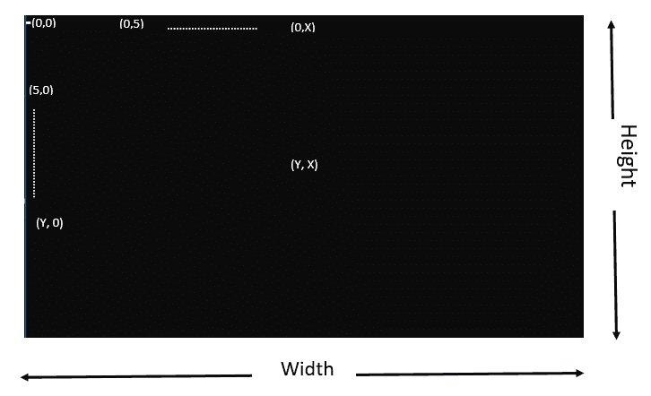
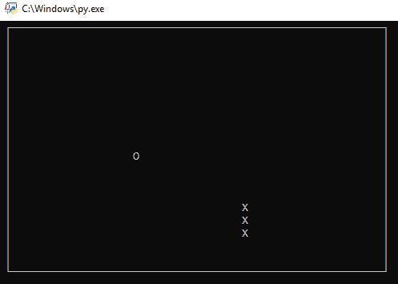

# 第五章：通过构建贪吃蛇游戏来了解 curses

每当开发人员编写游戏或应用程序时，他们可能需要重复使用代码的某些部分。例如，当我们希望玩家在游戏控制台内移动时，他们多次使用左右箭头键。因此，我们需要能够处理此类事件并对其进行处理的代码。多次编写相同的代码来处理相同的操作不支持**不要重复自己**（**DRY**）原则，因此我们需要使用可以多次调用以多次执行相同操作的函数。

为了方便起见，这些函数被捆绑到称为模块的容器中。正如您可能还记得上一章所述，我们在大多数程序中使用了模块。例如，通过使用`random`模块函数，我们能够在特定范围内获得随机数；另一方面，数学模块使我们能够执行不同的数学计算。在本章中，我们将介绍另一个模块，称为 curses。它将为我们提供一个接口，我们可以在其中处理 curses 库，该库包含直接与 Python 终端交互的函数。这意味着我们可以制作一个简单的基于终端的游戏。

本章将涵盖以下主题：

+   了解 curses

+   启动 curses 应用程序

+   使用 curses 进行用户输入

+   使用 curses 制作贪吃蛇游戏

+   游戏测试

# 技术要求

您将需要以下内容才能充分利用本章：

+   **Python** **IDLE**（集成开发工具包）

+   本书的代码资产，可以在本书的 GitHub 存储库中找到：[`github.com/PacktPublishing/Learning-Python-by-building-games/tree/master/Chapter05`](https://github.com/PacktPublishing/Learning-Python-by-building-games/tree/master/Chapter05)

查看以下视频以查看代码的实际操作：

[`bit.ly/2oG1CVO`](http://bit.ly/2oG1CVO)

# 了解 curses

Curses 是一个终端控制器库，允许我们编写基于文本的应用程序。术语“终端”与任何平台无关，因此 curses 可以在任何操作系统上使用。使用 curses，开发人员将能够直接编写应用程序，而无需与终端交互。curses 库是以控制字符的形式发送命令的媒介，同时确定应该在哪个操作系统或终端上执行。

在 Python 中，我们有两个名为 windows-curses 和 unicurses 的库。这两个库都提供了可以为输出终端屏幕设置所需外观的函数。它们使用控制序列进行更新。简而言之，开发人员将设计输出窗口屏幕的外观，并调用函数使 curses 发挥作用。因此，在基于 curses 的应用程序中，我们不会得到像我们期望的那样用户友好的输出，因为我们只能使用 curses 库编写基于文本的应用程序。因此，您使用 curses 编写的任何游戏都将在终端中运行，即 Windows 的命令提示符或 Linux 的终端。

Python 的*curses*库将允许我们编写基于文本的用户界面，并通过用户输入控制屏幕。在本章中使用的库将帮助我们控制屏幕移动并处理用户事件或输入。从 curses 构建的程序将不具有类似于现代 GUI 应用程序或 Android 应用程序的功能，这些应用程序具有诸如文本视图、标签、滑块、图表和模板等小部件。相反，它将提供简单的小部件和工具，如**命令行界面**（**CLI**），其中大部分在仅文本应用程序中找到。

Python 的 curses 模块是 C 编程语言的 curses 的一个适应。唯一的区别是使用 Python；一切都可以在不需要我们深入了解低级例程的情况下完成。我们可以调用接口来调用函数，这些函数将依次调用 curses 来处理用户操作。

在处理 curses 时，窗口屏幕被视为字符矩阵。每个窗口界面由程序员设置，并包括高度、宽度和边框。设置这样的坐标后，程序员将调用 Python curses 来更新该屏幕。使用诸如文本视图、按钮和标签之类的小部件也是以相同的方式进行的；也就是说，我们将初始化应在窗口中放置的坐标，并调用 curses 相应地更新它。要处理来自 curses 的用户输入，我们必须导入它。我们可以轻松地导入诸如 RIGHT、LEFT、UP 和 DOWN 等操作，并根据程序的需要处理它们的行为。在大多数游戏中，这些事件将为游戏角色提供移动。我们将在本章末尾介绍的游戏是贪吃蛇游戏，而蛇本身将是我们的主要角色。这意味着 LEFT、RIGHT、UP 和 DOWN 等操作将使蛇移动到新位置。Python 的 Windows 版本没有内置的 curses 模块，也不以相同的名称提供。但是，有两个兼容的模块可用，它们执行相同的功能。这些称为 unicurses 和 windows-curses。我们将在本章中使用后者。

让我们通过制作一个简单的应用程序来开始学习 curses。我们将制作一个简单的`hello`程序，该程序将在 curses 终端中打印。

# 启动 curses 应用程序

我们将使用 Python 中未预打包的模块构建应用程序。因此，我们必须在我们的机器上手动安装该软件包。安装 Python 时，应该已经自动在您的机器上安装了一个称为 pip 的软件包管理系统。此管理工具用于安装和组织用 Python 编写的库。因此，如果您想在程序中使用任何第三方库或依赖项，您必须使用 pip 工具进行安装。安装任何软件包的方法很简单。您只需编写`pip install`命令，后跟您希望安装的库的名称。库的名称区分大小写，因此在编写库的名称时不应出现错误。如果您想检查库中编写的代码，只需搜索该库的文档。您将获得有关该库的信息，以及可在程序中使用的函数。

我们将使用 windows-curses 库来编写基于文本的程序，因此我们必须使用`pip`命令安装该软件包。如果您的机器是 Windows，则应在命令提示符中执行 pip 命令；如果您使用的是 Mac OS X 或 Linux，则应在您的机器的终端中执行 pip 命令。以下屏幕截图显示了我们需要执行`pip`命令的方式：


类似地，在 Linux 机器上安装 curses，您可以打开终端并运行以下命令：

```py
$ sudo apt-get install libncurses5-dev libncursesw5-dev
```

现在，我们将能够使用 curses 模块编写程序。此时，我们安装的 curses 模块将以与其他内置模块（如 math 或 random）相同的方式可用。与内置模块类似，我们可以简单地导入 curses 模块并开始调用其中定义的函数。以下步骤解释了创建任何 curses 应用程序的路线图：

1.  让我们首先导入 curses 并查看它是否已正确安装。我们用于导入任何模块的命令是`import`后跟模块的名称。我们的模块名称是 curses。因此，命令将如下所示：

```py
 >>> import curses
 >>> #no any error
```

1.  我们可以得出结论，它已成功导入，因为 Python 解析器没有抛出错误。现在，我们可以使用这个模块来编写程序。让我们编写一个简单的程序来观察 curses 模块的工作过程：

```py
      #program is written as Scripts
      # curser_starter.py

      import curses
      import time
      window_screen = curses.initscr()
      window_screen.clear()

      time.sleep(10)
```

我们不能直接从 Python IDLE 运行任何 curses 应用程序。要运行它，你必须导航到存储 Python 文件的文件夹，并双击该文件以打开它。你会得到一个空白屏幕，顶部有一个光标，它将在那里停留 10 秒。10 秒后，同样的空白窗口屏幕将从屏幕上弹出。该屏幕将产生可以用 curses 编写的基于文本的应用程序。

让我们看看我们之前的代码，并揭示 curses 的有趣函数：

+   首先，像往常一样，我们导入了我们想要在程序中使用的模块。我们在这里导入了两个模块：curses 和 time。curses 模块为我们提供了不同的可用函数，可以用来编写基于文本的应用程序，而 time 模块为我们提供了不同的可用函数，可以用来更新我们的输出屏幕行为。在这个程序中，我们调用了`time`模块的`sleep`方法，它将保持屏幕的输出，持续的时间是括号内传递的时间（在我们的例子中是 10 秒）。10 秒后，我们的输出屏幕将消失。

+   在使用 curses 编写任何代码之前，它应该被初始化。调用`initscr()`函数将初始化 curses。因此，对于任何 curses 应用程序，我们应该在代码的第一行初始化 curses。这个初始化代码将返回一个窗口对象，代表我们程序的输出屏幕。在这里，这个初始化被窗口对象`window_screen`捕获，它代表了我们输出终端的屏幕。因此，对 curses API 的任何函数调用都应该使用`window_screen`。第一个调用是使用`clear()`函数。

我们成功创建了一个游戏屏幕，并用一个方法调用来保持它。然而，当前屏幕的可修改性还不够。作为程序员，我们可能希望通过明确指定高度和宽度来定制屏幕。幸运的是，Python 的 curses 模块提供了另一种方法来实现这一点，即`newwin`方法。我们将在下一节中学习它。

# 新屏幕和窗口对象

从`initscr()`函数的调用返回的窗口对象代表了输出窗口的整个屏幕。这个窗口对象还支持不同的方法，可以向窗口显示文本，修改它，接受用户的事件和更新位置等。这个`initscr()`函数的唯一缺点是我们不能将屏幕的自定义高度或宽度传递给它。它只代表了输出终端的默认整个屏幕。

有时，我们可能希望游戏屏幕被定制，使其高度为 20，宽度为 60，例如。在这里，高度和宽度可以被视为列和行，其中每个单位代表矩阵中的一行。由于我们传递了宽度为 60，将会有 60 条水平线。高度为 20 也是一样的；将会有 20 条垂直线。你也可以将它们表示为像素。要创建一个新的屏幕，这可能是我们在制作 curses 应用程序时要做的事情，因为`initscr()`函数不会为我们做这个，我们必须调用新函数。这个函数将根据指定的坐标将更大的窗口屏幕分成一个新的窗口。这个函数的名称是`newwin()`，字面意思是新窗口，它接受四个参数，即**高度**，**宽度**，**Y**和**X**。它们的传递顺序是**Y**，**X**，这与其他库相比是不寻常的。**Y**值是列的位置，而**X**值是行的位置。看一下下面的图表，它解释了**Y**和**X**的值：



因此，通过增加**Y**的值，我们向下移动，这与矩阵中的列相同。同样，通过增加**X**的值，我们向屏幕的右侧移动，这与矩阵中的行相同。正如我们所看到的，curses 以字符矩阵的形式存储窗口屏幕。我们可以使用这些坐标来表示游戏显示的位置，以及游戏角色。例如，如果您想让您的玩家在(5,0)的位置移动，就像前面的图表中所示的那样，您将调用`move(5,0)`函数来实现。记住参数传递的顺序。**Y**的值后面是**X**，如果您在其他库中有游戏编程的背景，这可能会让您感到困惑。

例如，我们将创建一个程序，在其中使用`newwin()`函数在大屏幕内创建一个新屏幕。此函数内的四个参数分别是`height`、`width`、`y`和`x`。记住这个顺序，因为我们必须以类似的方式传递它：

```py
height = 20
width = 60
y = 0
x= 0

screen = curses.newwin(height, width, y, x)
```

现在，是时候编写一个简单的程序，可以向我们的 curses 应用程序添加一些文本了：

```py
# text_app.py
import curses
import time

screen = curses.initscr()
curses.noecho()
curses.cbreak()
screen.keypad(True)
screen.addstr(0,0, "Hello")
screen.refresh()
time.sleep(10)
curses.endwin()
```

让我们逐行观察前面的代码，并了解我们使用的每个方法，如下所示：

+   首先，我们导入了两个重要的模块：curses 和 time。之后，我们使用`initscr()`函数初始化了窗口对象。`noecho()`函数将关闭应用程序中的自动回显过程。这是必要的，因为当用户玩游戏时，我们不希望他们向我们展示他们按下了什么键；相反，我们希望他们根据该事件执行操作。下一个函数调用是`cbreak()`。这种模式将帮助我们的程序立即对用户的输入做出反应。例如，在 Python 的`input()`方法中，除非我们在键盘上按下*Enter*，否则此方法不会执行任何操作。然而，在`cbreak()`函数的情况下，它将帮助应用程序立即对任何输入键做出反应，而无需按*Enter*。这很重要，因为我们必须制作一个用户可以立即得到响应的游戏。例如，如果用户按下 DOWN 键，游戏角色必须立即向下移动。这与缓冲输入函数不同，后者将接收所有输入并将其存储在一个缓冲区中，只有在用户按下*Enter*时才会做出反应。

+   下一个函数调用是`keypad()`函数。我们通过传递 True 作为参数启用了键盘模式。每当我们在终端中按下任何键时，它都以多字节转义序列的形式返回数据。例如，`Esc`发送`\x1b`。这是 1 个字节。`Page Up`发送`\x1bH`。这是 3 个字节。为了处理终端返回的这种数据，curses 使用了一个可以手动导入的特殊值。例如，要处理键盘上按下的 DOWN 键，我们可以将其导入为`curses.KEY_DOWN`。这是通过启用键盘模式来实现的。

+   之后，我们调用了`addstr()`函数。这个函数将在其调用期间指定的位置将一个字符串添加到输出屏幕上。我们向它传递了三个参数。记住，前两个参数的顺序是 y，x。传递的最后一个参数是需要添加到(y,x)位置的字符串。我们传递了一个值为(0,0)，这意味着字符串将被添加到输出窗口的左上角。我们调用的下一个方法是`refresh()`，它将更新窗口对象*screen*的字符矩阵。如果你仔细看代码，你会发现每当我们添加或刷新屏幕的内容时，我们都是使用一个窗口 curses 对象来做的，这个对象是使用`initscr()`函数初始化的。然而，终端的行为已经被 curses 模块改变了。例如，为了改变终端的默认回显行为，我们直接从 curses 模块而不是从窗口光标对象中直接调用了`noecho()`函数。

现在，让我们运行我们的代码来观察结果。确保你从终端或命令提示符中运行你的应用程序，使用`filename.py`：

![你可以将位置从(0,0)改变为任何其他值，比如(5,5)，来观察窗口和填充格式。最后，我们用 curses 制作了我们的第一个程序。现在，是时候探索 curses 的另一个特性了，这个特性是基于处理用户输入的能力。# 使用 curses 处理用户输入在任何游戏中，用户输入是需要正确处理的最关键的信息之一。在处理这些类型的操作时，我们不能有任何延迟。在 curses 的情况下，我们有两种方法可以从用户那里获取输入。这两种方法如下：+   `getch()`: 如果你有 C 或 C++等语言的编程背景，这对你来说应该不是什么新鲜事。`getch()`函数就像在 C 中一样，用于创建一个持续监听用户按键的监听器。它返回一个从 0 到 255 的整数，代表被按下的键的 ASCII 码。例如，`a`的 ASCII 码是`097`。大于 255 的值是特殊键，例如*Page Up*和导航键，即 UP、DOWN、LEFT 和 RIGHT。我们可以将这些键的值与 curses 中存储的常量进行比较；例如，`curses.UP`、`curses.DOWN`、`curses.LEFT`和`curses.RIGHT`。+   `getkey()`: `getch`和`getkey`做的是同样的事情，但是`getkey`函数会将返回的整数转换为字符串。诸如 a-z 或 A-Z 之类的普通键将作为一个包含一个字符的字符串返回，可以与`ord()`函数进行比较。然而，特殊键或功能键将作为一个更长的字符串返回，其中包含一个键并表示动作的类型，比如`KEY_UP`。让我们写一个可以处理键盘事件的程序：```py#program3.pyimport curses as cscreen = c.initscr()win = c.newwin(20, 60, 0, 0)c.noecho()c.cbreak()screen.keypad(True)while True:  char = screen.getch() #takes input  if char == ord('q'):      break  if char == ord('p'):      win.addstr(5,10, "Hello World")      win.refresh()screen.endwin()```当我们讨论使用 True 循环时，我们讨论了这段代码。如果你对任何这些命令感到困惑，请确保复习前面的主题。你可能会观察到这段代码中的一个奇怪的地方是，我们导入了 curses 并给它起了一个别名 c。这是重命名模块的过程。现在，我们可以在每个方法调用时使用`c.method_name()`，而不是在每次调用时使用`curses.method_name`，这当然消除了每次写相同模块名的开销。在循环内，我们使用`getch()`函数从用户那里获取输入。之后，字符被存储在`char`变量中，我们将其与`ord`函数的返回值进行比较。记住，`getch`函数将返回一个 Unicode 值？`ord`函数也是如此。它接受一个字符作为参数，并返回该字符的 Unicode 值。我们使用条件语句来进行条件判断。因此，如果用户在键盘上按下*q*，我们将结束程序，如果用户在键盘上按下*p*，我们将在输出窗口的位置(y,x)打印`Hello World`。让我们运行我们的 Python 文件，`C:\User\Desktop> python program3.py`，并查看输出：

按下键盘上的*q*键来终止循环并关闭应用程序。

请注意，*q*和*Q*不同，因为这些字符的 ASCII 码不同。

我们的代码运行得很好，但变得越来越长，尽管应用程序很简单。我们已经调用了很多方法，比如`noecho()`，`cbreak()`，`keypad()`和`endwin()`。为了消除调用这么多函数的开销，我们可以使用 curses 模块中的包装函数。所有这些函数，包括 curses 对象的初始化，都是由包装函数自动完成的。只需记住，包装函数是一个包含所有这些方法的捆绑调用。

同样，我们也可以使用 curses 模块来处理鼠标事件。让我们使用包装函数编写一个程序，并在同一个程序中处理鼠标按钮的事件：

```py
#mouse_events.py

import curses as c
def main(screen):
  c.curs_set(0) #hides the cursor
  c.mousemask(1)

  inp = screen.getch()
  if inp == c.KEY_MOUSE:
      screen.addstr(17,40, "Mouse is clicked")
      screen.refresh()
  screen.getch()

c.wrapper(main)
```

让我们详细看一下前面的代码：

+   我们将从最后一行开始，我们在那里使用了可调用对象调用了包装函数。我们已经了解了`wrapper()`的目的；它消除了多个函数调用，比如`initscr()`，`noecho()`等等。因此，使用包装函数进行调试更容易。不仅如此，这个函数还通过 try 和 catch 块在内部处理异常。每当你遇到一个未知的异常，你可能没有捕获到，你总是可以信任包装函数来处理。这将识别程序的错误并提供异常消息，而不会使应用程序崩溃。包装函数的参数将是一个可调用对象，这里是主函数。这个主函数有一个*screen*参数，它是 curses 窗口对象。我们没有在程序的任何地方使用`initscr()`函数初始化 curses 对象，因为这是由包装函数在内部完成的。

+   在主函数的范围内，我们调用了两个方法：`curs_set(0)`，它将隐藏输出屏幕上的光标，以及`mousemask(1)`，它将接受鼠标事件。在这里，鼠标事件将是特殊符号或功能字符，与正常的字母字符不同。因此，curses 已经定义了常量来表示这些功能字符。这与 UP 键盘键相同；我们有`KEY_UP`常量；在鼠标事件的情况下，我们有`KEY_MOUSE`常量。这些应该从 curses 模块中调用，例如`curses.KEY_MOUSE`。在我们获得这样的鼠标事件之后，我们将在输出终端上打印`鼠标被点击`。`getch()`方法将输入任何可能是与鼠标相关或键盘按钮的事件。让我们运行程序以获得以下输出：


现在我们已经获得了足够的知识来使用 curses 制作游戏，让我们继续下一部分，这将让我们了解游戏逻辑是如何在底层实现的。我们将制作一个简单的贪吃蛇游戏。

# 使用 curses 制作贪吃蛇游戏

我们已经知道编写游戏的过程并不像看起来那么容易。我们必须遵循许多程序来使游戏可玩，因为在将游戏暴露给环境时，我们可能会被许多不需要的和意外的异常所淹没。因此，遵循正确的执行顺序总是至关重要的，即使可能比平常花费更多的时间。在本节中，我们将使用 curses 创建一个贪吃蛇游戏。在即将到来的章节中，我们将对其进行修改，使其成为一个更具吸引力的游戏。一个好的游戏并不总是意味着一个良好的用户界面，因为界面为用户提供价值，而不是程序员。我们必须养成编写良好代码并制作良好界面的习惯，这要求我们遵循本节中将要介绍的每一步。我们将使用 curses 模块来制作最初的贪吃蛇游戏。然后，在下一章中，我们将使用面向对象编程对其进行修改。

在编码之前，我们必须收集有关游戏模型和界面的信息。在建模过程中，我们必须提取关键信息，比如*如何将游戏字符渲染到屏幕上*，*如何制作事件监听器*，以及*如何制作允许游戏角色移动的逻辑*。我们将在下一部分中涵盖所有这些内容。

# 头脑风暴和信息收集

就像我们一直在做的那样，第一步是头脑风暴和收集关于游戏布局和游戏模型的关键信息。在贪吃蛇游戏中，我们有两个角色：蛇（玩家）和它的食物。每当蛇吃食物时，它的长度应该增加。这是基本的想法。现在，让我们复习一下我们可以使用的资源。显然，Python 提供的资源更加丰富，但我们还没有学会如何制作图形字符并在游戏中使用它们。我们只学会了如何在基于文本的终端中制作游戏。我们可以使用 A-Z 等字符来指定游戏对象。例如，我们可以制作蛇`XXXXXXX`，这是 X 的组合。食物可以用`O`表示。让我们看看这在我们的游戏控制台中会是什么样子：


我们还必须决定游戏的屏幕。`initscr()`方法将创建整个屏幕作为 curses 对象。我们不希望这样；相反，我们希望制作一个可以通过高度、宽度和 y、x 位置自定义的游戏屏幕。正如您可能记得的那样，我们可以使用`newwin()`方法将屏幕分成一个新的屏幕。

最重要的是要记住跟踪坐标，因为我们必须为我们的游戏玩法制作一个边界。我们可以制定一些规则，指定游戏角色的边界位置，如果它们触及该边界，我们可以终止我们的游戏。

我们必须为两件事制定逻辑：

+   每当蛇吃食物时，我们必须在新位置生成新的食物。

+   每当蛇吃食物时，我们必须增加蛇的速度，使游戏变得更加困难。我们还应该跟踪蛇头和蛇身之间的碰撞。

在前一点方面，我们可以使用 random 模块，它提供了一个(y, x)的随机坐标位置，我们可以将食物分配给它。对于后一点，我们必须使用一个名为 timeout 的 curses 方法。我们必须将延迟的值作为参数传递给该函数。根据 Python 的官方文档，timeout 函数为窗口设置阻塞或非阻塞读取行为。如果*延迟*为负数，则使用阻塞读取（将无限期地等待输入）。如果*延迟*为零，则使用非阻塞读取，如果没有输入等待，`getch()`将返回-1。如果*延迟*为正数，则`getch()`将阻塞*延迟*毫秒，并且如果在该时间结束时仍然没有输入，则返回-1。因此，我们可以根据延迟改变游戏的速度，当延迟为零或正数时。

因此，在`curses.timeout(delay)`命令方面，如果您使延迟为负数，您的蛇将以快速的速度移动。然而，我们需要记住这里有一些约束；蛇的速度应该随着蛇的长度增加。首先，蛇是什么？在我们的游戏中是如何制作的？我们在上一章学习了列表。让我们用它来制作一个蛇。我们已经看到了我们的蛇的结构，它是一堆 X 字符。但在游戏开始时，我们应该为蛇提供一个较小的长度，也许是 3 的长度，即`XXX`。我们将把这些 X 中的每一个存储在列表中，它表示坐标，比如[[4,10]，[4,9]，[4,8]]。在这里，这些列表中的每一个代表一个 X，也就是说，在[4,10]的位置，我们将有一个 X，而在 4,9 的位置还有一个 X。请记住，这些应该是 y，x 位置，并且它们应该相邻，因为它们代表蛇的身体。

假设我们的延迟是 100，这将是恒定的。因此，我们表示速度的命令将是`curses.timeout(100)`，这将是蛇在整个游戏中的恒定速度。然而，我们可以通过增加蛇的长度来改变游戏的速度。现在，让我们继续进行下一节，我们将为我们的游戏制作一个边界。

# 初始。

在本节中，我们将开始编写游戏的代码。我们将使用 curses 模块来实现这一点。首先，我们将初始化游戏屏幕并制作一些游戏角色。看一下以下代码：

```py
#snake_game.py
import curses as c

c.initscr()
win = c.newwin(20,60,0,0)
win.keypad(1)
c.noecho()
c.curs_set(0)
win.border(0)
win.nodelay(1)

snake = [[4,10], [4,9], [4,8]]
food = [10,20]

win.addch(food[0],food[1], 'O')
```

在前面的代码中没有什么新的。您还可以使用`wrapper()`函数消除所有的函数调用。我们可以看到我们有两个列表变量，`snake`和`food`，它们包含代表它们在游戏控制台中位置的坐标。我们还调用了`addch`函数。它将以类似的方式工作`addstr`函数。我们传递了食物的位置并在该位置添加了`O`字符。

制作电脑游戏需要两个步骤：第一步是制作一个必须自然吸引人的视觉效果，而第二步是让玩家与游戏互动。为了使游戏具有互动性，我们必须处理玩家提供的事件。这就是我们将在下一节中做的事情。

# 处理用户按键事件

我们已经开始构建游戏的基本布局。现在，让我们编写一些代码来处理用户键盘事件。贪吃蛇是一个简单的游戏。我们可以通过处理键盘的四个键：上、下、左、右来使其工作。我们可以使用`getch()`来获取用户输入。但请记住，这些不是字母字符，它们是功能字符。因此，我们必须导入常量，如`KEY_UP`、`KEY_DOWN`、`KEY_LEFT`和`KEY_RIGHT`来获取这些 ASCII 值。让我们开始编写处理用户事件的代码：

```py
from curses import KEY_UP, KEY_DOWN, KEY_LEFT, KEY_RIGHT
#CODE FROM PREVIOUS TOPIC

key = KEY_RIGHT #default key

#ASCII value of ESC is 27
while key != 27:
  win.border(0)
  win.timeout(100) #speed for snake
  default_key = key
  event = win.getch()
  key = key if event == -1 else event
  if key not in [KEY_LEFT, KEY_RIGHT, KEY_UP, KEY_DOWN, 27]:
     key = default_key
```

我们编写的代码可能看起来很复杂，但所有这些事情都已经涵盖过了。让我们看看我们做了什么：

+   在第一个语句中，我们将默认键设置为`KEY_RIGHT`。这很重要，因为我们不希望在用户没有按键时使蛇移动。因此，当游戏开始时，我们的蛇角色将自动向右移动。

+   之后，我们创建了一个游戏循环。这个循环将一直执行，直到我们按下*Esc*，因为*Esc*的 ASCII 值是 27。在循环内部，我们调用了 timeout 方法，它将代表我们的贪吃蛇角色的速度。在下一行，我们使用`getch()`方法获取用户的事件。请记住，如果按下任何键事件，它的值将是-1。因此，我们可以进行比较，并将用户按下的键放入键变量中。然而，键可以是任何东西，比如字母字符或特殊符号，如[!,@,#,$]，因此我们必须用适当的键进行过滤，例如 LEFT、RIGHT、UP 和 DOWN。如果用户按下的键不在其中，我们将使键具有默认值`KEY_RIGHT`。

现在，我们可以将我们的程序与键盘或操纵杆等输入设备进行通信。是时候进入下一部分了，在那里我们将创建我们的第一个逻辑，当用户按下左、右、上和下键时，更新蛇字符的**头部位置**。

# 游戏逻辑-更新蛇头的位置

在前面的部分，我们能够使用 curses 提供的常量来处理用户事件。就像移动一样，蛇的头部也可以改变。我们必须制定全新的逻辑来更新蛇头的位置。我们的蛇是存储在列表中的坐标的组合。嵌套列表的第一个元素是蛇头的位置。因此，我们只需要更新列表的第一个元素。让我们看看我们将如何做到这一点：

```py
while key != 27:
  #code from preceding topic
  snake.insert(0, [snake[0][0] + (key == KEY_DOWN and 1) + 
  (key == KEY_UP and -1), snake[0][1] + (key == KEY_LEFT and -1) + 
  (key == KEY_RIGHT and 1)])
```

这可能看起来有点难以理解，所以让我澄清一下。

`snake`变量是一个列表。因此，我们可以使用`insert()`方法来操作该列表元素。`insert()`方法将接受两个参数：一个是索引，另一个是要插入的元素。在前面的代码中，索引是 0，这意味着我们要在列表的第一个元素中插入一个元素，它代表了蛇的头部。下一个参数是要添加到索引 0 的元素。我们可以在两个语句之间看到一个逗号(,)：`snake[0][0] + (key == KEY_DOWN and 1) + (key == KEY_UP and -1)`和`snake[0][1] + (key == KEY_LEFT and -1) + (key == KEY_RIGHT and 1)`。第一个语句表示蛇头的 y 坐标，而第二个语句表示蛇头的 x 坐标。在蛇头的 y 部分，可以表示为一列，我们可以有两种移动方式：向下或向上。向下时，我们必须在当前头部位置的 y 元素上加 1，而向上时，我们必须在当前 y 位置减 1。对于蛇头的 x 部分，我们有左和右的移动。

按下左键时，我们将 x 坐标减 1，按下右键时，我们将 x 加 1。还是困惑吗？看一下下面的图表应该能让你更清楚：


请记住，这个更新必须按照(y,x)的顺序进行。对于每次按下**UP**和**DOWN**键，y 坐标都会增加或减少 1，这是蛇头的 snake[0][0]坐标。对于 x 坐标，这是 snake[0][1]，这是我们之前使用的相同的增加和减少，但是当用户按下**RIGHT**和**LEFT**键时。

现在我们已经制定了一些逻辑来更新蛇的位置，我们需要让蛇吃食物。我们要讨论的逻辑很简单：当蛇的头部位置与食物的位置相同时，我们可以说蛇吃了食物。让我们现在来讨论这个。

# 游戏逻辑-当蛇吃食物时

让我们为我们的游戏制作下一个逻辑部分。在这一部分，我们将让蛇吃食物。这很容易实现。每当蛇的头部触碰到食物时，我们就假设蛇已经吃了食物。因此，蛇的头部坐标和食物的坐标将是相同的。我们还必须制定一些逻辑，一旦蛇吃掉当前的食物，就会在下一个位置生成食物。下一个食物的位置应该是随机的。我们可以使用`random`模块来创建这样一个任意的位置。让我们开始编写代码：

```py
from random import randint
```

这是从模块中导入任何函数的新方法。在调用这个函数时，我们不必写类似`random.randint()`的东西。相反，我们可以直接在我们的程序中调用它。`randint()`方法中的参数必须是值的范围。例如，`randint(2,8)`返回 2 到 8 之间的数字，就像这样：

```py
while key != 27:
#add the following code after updating head position
  if snake[0] == food:
      food = []
      while food == []:
        food = [randint(1,18), randint(1,58)]
        if food in snake: 
            food = []
      win.addch(food[0], food[1], 'O')
  else:
      last = snake.pop()
      win.addch(last[0], last[1], ' ')
  win.addch(snake[0][0], snake[0][1], 'X')

c.endwin()
```

在代码的 if 部分中，我们添加了将食物放在新位置的逻辑。请记住，在游戏开始时，我们将新窗口的高度初始化为 20，宽度为 60。因此，我们只能在这个边界内生成食物。在代码的 else 部分中，如果用户无法吃到食物，我们会弹出最后一个元素。在倒数第二行，我们将蛇头的位置与`'X'`字符相加。

让我们运行游戏，看看目前的样子：



现在，我们的游戏已经足够可玩了。在制作这个游戏的过程中，我们学到了很多东西，比如如何在处理游戏控制台的方法和坐标时制定游戏逻辑。现在，让我们继续下一节，我们将学习如何测试和修改我们的游戏。

# 游戏测试和修改

为了发现任何程序的缺陷，运行和测试它总是一个好主意。就像我们之前的游戏一样，我们也可以对 Snake 游戏进行修改。以下几点解释了我们可以对游戏进行的一些修改：

+   当你运行游戏时，你会注意到的第一件事是，我们的游戏没有逻辑来决定蛇是否与自己的其他部分发生碰撞。如果它与身体的其他部分发生碰撞，我们必须停止游戏。让我们在 while 循环中添加这个逻辑：

```py
      if snake[0] in snake[1:]: 
          break
```

+   在前面的代码中，snake[0]代表蛇的头部，而 snake[1:]代表蛇的身体。因此，前面的条件意味着头部坐标在蛇的身体内，这意味着发生了碰撞。在这种情况下，我们使用`break`语句来跳出循环并终止游戏。

+   假设我们想要添加玩家的得分。添加得分很简单；蛇吃掉的食物数量等于玩家的得分。我们可以将得分的值初始化为 0 开始：

```py
      score = 0 
      while key != 27:
        # CODE TO ADD SCORE IN THE SCREEN
        win.border(0)
        win.addstr(0, 2, 'Score : ' + str(score) + ' ') 
        win.addstr(0, 27, ' SNAKE ')

        if snake[0] == food:
            food = []
            #AFTER EATING EVERY FOOD SCORE = FOOD
            score += 1
            while food == []:
              food = [randint(1,18), randint(1,58)]
              if food in snake: food = []
            win.addch(food[0], food[1], 'O')
        else:
            end = snake.pop()
            win.addch(last[0], last[1], '')
        win.addch(snake[0][0], snake[0][1], 'X')

      c.endwin()
```

在前面的代码中，我们添加了一些带有`addstr`方法的语句，这些语句将在指定位置提供玩家的得分。现在，让我们运行游戏：


运行游戏后，您可以看到我们能够在 curses 的界面中进行游戏。然而，一旦您的蛇撞到边界线，您将遇到一个异常，游戏将自动终止。我们将在接下来的章节中详细学习如何处理边界碰撞（具体来说，第十一章，*使用 Pygame 制作 Outdo Turtle - Snake 游戏 UI*），但是现在，让我们学习一下我们可以使用的最简单的方法来处理并消除触发异常。首先，观察边界屏幕的尺寸，并注意边界所在的实际高度和宽度。考虑查看`win`变量，以了解边界屏幕的大小。现在，看着高度为 20，我们可能会假设每当蛇触碰顶部边界时，也就是说，蛇头位置为 0 时，蛇头必须通过自己的边界进入，其 y 坐标为 19。请记住，在上下边界中，只有 y 坐标会改变。这个逻辑的代码如下：

```py
if snake[0][0] == 0:
    snake[0][0] = 18 #regenerate snake from lower boundary line

if snake[0][0] == 19:
    snake[0][0] = 1 #regenerate snake from upper boundary line
```

同样，我们必须处理蛇撞到右边界或左边界的情况。由于高度对于任何一种情况都保持不变，我们只关心宽度（x 位置）。由于由 win 变量声明的屏幕宽度为 60，我们可以预期蛇在 0（右边）和 59（左边）左右撞到边界时会相应地重新生成。您必须添加以下代码来处理发生在左右边界的碰撞：

```py
if snake[0][1] == 0:
    snake[0][1] = 58 #regenerate from left
if snake[0][1] == 59:
    snake[0][1] = 1 #regenerate from right
```

最后，我们已经完成了 Snake 游戏。它足够吸引人，让任何用户都能玩这个游戏。我们还学会了如何用全新的逻辑创建程序。这是我们用来制作基于文本的游戏的第一个简单模块。尽管它是可玩的，但我们没有为它添加任何图形，所以看起来相当单调。通过学习一个名为面向对象编程的新 Python 范例，我们将使它更加引人入胜。我们已经成功地对我们的游戏进行了一些修改。现在，是时候学习 Python 最重要的概念了：面向对象编程。

# 总结

在本章中，我们开始揭开 curses 游戏编程的世界。显然，这并不是完美的游戏，因为它没有惊人的动画或奇妙的界面。我们几乎没有涉及这些话题，因为 curses 提供的应用是基于文本的，并在普通终端上运行。甚至 Snake 游戏的游戏角色，如蛇和食物，都是由字母组成的。尽管我们没有额外的努力使游戏更具吸引力，但我们已经学会了如何制作游戏逻辑。我们在 Snake 游戏中制作的逻辑中有两个重要的部分：第一个是游戏控制台的坐标与玩家位置的交互，第二个是使角色发生碰撞。curses 支持的坐标系统顺序很奇怪。在大多数库中，如 pygame 和 pyopengl，我们有一个以(x，y)顺序表示的坐标系统，但在 curses 中，它是(y，x)。如果两个字符在相同的坐标点(y，x)上，它们之间发生碰撞。为了做到这一点，我们必须检查蛇头和蛇身之间的碰撞。这个逻辑听起来可能很简单，但从长远来看会很有用。例如，在即将推出的游戏中，如 Flappy Bird 或 Angry Birds，我们将使用相同的逻辑来检查角色之间的碰撞。

我们为 Snake 游戏编写的代码非常细致和彻底，因为游戏是以过程式编程为基础编写的。在下一章中，我们将学习 Python 最重要的概念——面向对象编程，并相应地修改我们的代码，这将使我们的代码更易读和可重用。
