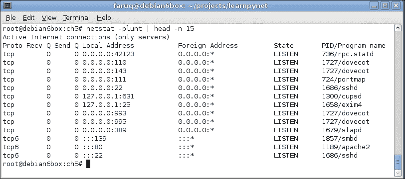
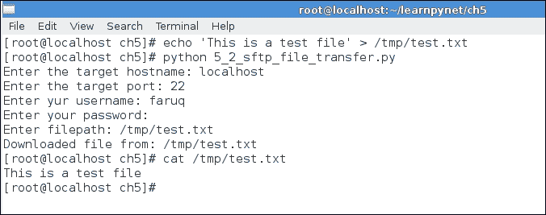
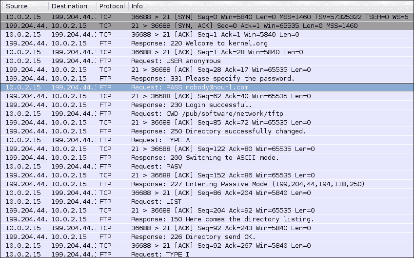
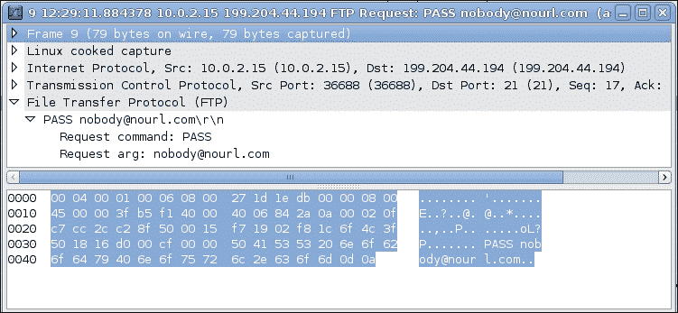
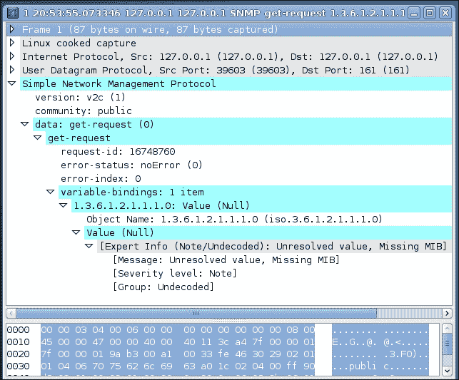
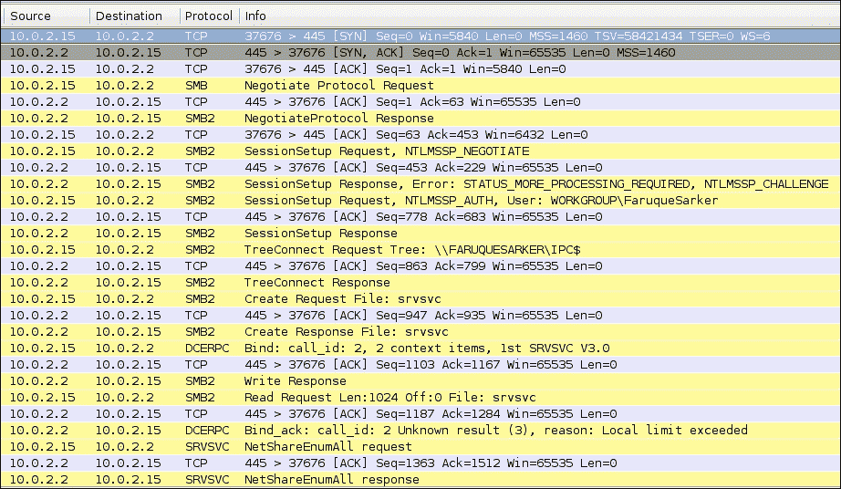

# 五、与远程系统交互

如果您的计算机已连接到 Internet 或**局域网**（**局域网**），则是时候与网络上的其他计算机通话了。在典型的家庭、办公室或校园局域网中，您会发现许多不同类型的计算机连接到网络。某些计算机充当特定服务的服务器，例如文件服务器、打印服务器、用户身份验证管理服务器等。在本章中，我们将探讨网络中的计算机如何相互交互，以及它们如何通过 Python 脚本访问一些服务。以下任务列表将为您概述本章将涉及的主题：

*   使用`paramiko`访问 SSH 终端
*   通过 SFTP 传输文件
*   利用 FTP 传输文件
*   读取 SNMP 数据包
*   读取 LDAP 数据包
*   在 SAMBA 的帮助下共享文件

本章需要很多第三方软件包，如`paramiko`、`pysnmp`等。您可以使用操作系统的包管理工具来安装它们。下面是在 Ubuntu 14、python3 和理解本章主题所需的其他模块中安装`paramiko`模块的快速操作：

```py
sudo apt-get install python3
sudo apt-get install python3-setuptools
sudo easy_install3 paramiko
sudo easy_install3 python3-ldap
sudo easy_install3 pysnmp
sudo easy_install3 pysmb

```

# 安全 shell–使用 Python 访问

SSH 已经成为一种非常流行的网络协议，用于在两台计算机之间执行安全数据通信。它提供了出色的加密支持，因此不相关的第三方在传输过程中无法看到数据的内容。SSH 协议的详细信息可以在这些 RFC 文档中找到：RFC4251-RFC4254，可在[上找到 http://www.rfc-editor.org/rfc/rfc4251.txt](http://www.rfc-editor.org/rfc/rfc4251.txt) 。

Python 的`paramiko`库为基于 SSH 的网络通信提供了非常好的支持。您可以使用 Python 脚本来受益于基于 SSH 的远程管理的优势，例如远程命令行登录、命令执行以及两台联网计算机之间的其他安全网络服务。您可能还对使用基于`paramiko`的`pysftp`模块感兴趣。有关此套餐的更多详细信息，请访问 PyPI:[https://pypi.python.org/pypi/pysftp/](https://pypi.python.org/pypi/pysftp/) 。

SSH 是一种客户机/服务器协议。双方都使用 SSH 密钥对通信进行加密。每个密钥对有一个私钥和一个公钥。公钥可以发布给任何对此感兴趣的人。私钥始终保持私密性，对除密钥所有者以外的所有人都是安全的。

SSH 公钥和私钥可以由外部或内部证书颁发机构生成和数字签名。但这会给小型组织带来大量开销。因此，或者，可以通过实用工具随机生成密钥，例如`ssh-keygen`。公钥需要可供所有参与方使用。当 SSH 客户端第一次连接到服务器时，它会在一个名为`~/.ssh/known_hosts`文件的特殊文件上注册服务器的公钥。因此，与服务器的后续连接确保客户机与之前与之通信的服务器相同。在服务器端，如果您想限制对具有特定 IP 地址的特定客户端的访问，则可以将允许主机的公钥存储到另一个名为`ssh_known_hosts`文件的特殊文件中。当然，如果您重新构建机器，例如服务器机器，那么服务器的旧公钥将与存储在`~/.ssh/known_hosts`文件中的公钥不匹配。因此，SSH 客户端将引发异常并阻止您连接到它。您可以从该文件中删除旧密钥，然后尝试重新连接，就像第一次一样。

我们可以使用`paramiko`模块创建一个 SSH 客户端，然后将其连接到 SSH 服务器。此模块将提供`SSHClient()`类。

```py
ssh_client = paramiko.SSHClient()
```

默认情况下，此客户端类的实例将拒绝未知的主机密钥。因此，您可以设置接受未知主机密钥的策略。内置的`AutoAddPolicy()`类将在发现主机密钥时添加主机密钥。现在，您需要在`ssh_client`对象上运行`set_missing_host_key_policy()`方法和以下参数。

```py
ssh_client.set_missing_host_key_policy(paramiko.AutoAddPolicy())
```

如果您想限制只连接到某些主机，那么您可以定义自己的策略并用`AutoAddPolicy()`类替换它。

您可能还对使用`load_system_host_keys()`方法添加系统主机密钥感兴趣。

```py
ssh_client.load_system_host_keys()
```

到目前为止，我们已经讨论了如何加密连接。但是，SSH 需要您的身份验证凭据。这意味着客户机需要向服务器证明特定用户在讲话，而不是其他人。这可以通过几种方式实现。最简单的方法是使用用户名和密码的组合。另一种流行的方法是使用基于密钥的身份验证方法。这意味着可以将用户的公钥复制到服务器。有一个专门的工具来做这件事。这是 SSH 的更高版本附带的。下面是一个如何使用`ssh-copy-id`的示例。

```py
ssh-copy-id -i ~/.ssh/id_rsa.pub faruq@debian6box.localdomain.loc

```

此命令将 faruq 用户的 SSH 公钥复制到机器`debian6box.localdomain.loc`：

在这里，我们可以简单地调用`connect()`方法以及目标主机名和 SSH 登录凭据。要在目标主机上运行任何命令，我们需要通过将命令作为参数传递来调用`exec_command()`方法。

```py
ssh_client.connect(hostname, port, username, password)
stdin, stdout, stderr = ssh_client.exec_command(cmd)
```

下面的代码清单显示了如何通过 SSH 登录到目标主机，然后运行一个简单的`ls`命令：

```py
#!/usr/bin/env python3

import getpass
import paramiko

HOSTNAME = 'localhost'
PORT = 22

def run_ssh_cmd(username, password, cmd, hostname=HOSTNAME, port=PORT):
    ssh_client = paramiko.SSHClient()
    ssh_client.set_missing_host_key_policy(\
        paramiko.AutoAddPolicy())
    ssh_client.load_system_host_keys()
    ssh_client.connect(hostname, port, username, password)
    stdin, stdout, stderr = ssh_client.exec_command(cmd)
    print(stdout.read())

if __name__ == '__main__':
    username = input("Enter username: ")
    password = getpass.getpass(prompt="Enter password: ")
    cmd = 'ls -l /dev'
    run_ssh_cmd(username, password, cmd)
```

在运行它之前，我们需要确保 SSH 服务器守护进程正在目标主机上运行（在本例中是本地主机）。如下面的屏幕截图所示，我们可以使用`netstat`命令来执行此操作。此命令将显示正在侦听特定端口的所有正在运行的服务：



前面的脚本将建立到本地主机的 SSH 连接，并运行`ls -l /dev/`命令。此脚本的输出类似于以下屏幕截图：


## 检查 SSH 数据包

看到客户端和服务器之间的网络数据包交换会非常有趣。我们可以使用本机`tcpdump`命令或第三方 Wireshark 工具捕获网络数据包。通过`tcpdump`可以指定目标网络接口`-i lo`和端口号（端口`22`选项。在以下数据包捕获会话中，SSH 客户端/服务器通信会话期间显示了五个数据包交换：

```py
root@debian6box:~# tcpdump -i lo port 22
tcpdump: verbose output suppressed, use -v or -vv for full protocol decode
listening on lo, link-type EN10MB (Ethernet), capture size 65535 bytes
12:18:19.761292 IP localhost.50768 > localhost.ssh: Flags [S], seq 3958510356, win 32792, options [mss 16396,sackOK,TS val 57162360 ecr 0,nop,wscale 6], length 0
12:18:19.761335 IP localhost.ssh > localhost.50768: Flags [S.], seq 1834733028, ack 3958510357, win 32768, options [mss 16396,sackOK,TS val 57162360 ecr 57162360,nop,wscale 6], length 0
12:18:19.761376 IP localhost.50768 > localhost.ssh: Flags [.], ack 1, win 513, options [nop,nop,TS val 57162360 ecr 57162360], length 0
12:18:19.769430 IP localhost.50768 > localhost.ssh: Flags [P.], seq 1:25, ack 1, win 513, options [nop,nop,TS val 57162362 ecr 57162360], length 24
12:18:19.769467 IP localhost.ssh > localhost.50768: Flags [.], ack 25, win 512, options [nop,nop,TS val 57162362 ecr 57162362], length 0

```

尽管非常快速且易于运行`tcpdump`，但该命令的解释方式与其他 GUI 工具（如 Wireshark）的解释方式不同。可以在 Wireshark 中捕获上一个会话，如以下屏幕截图所示：


这清楚地显示了前三个数据包是如何完成 TCP 握手过程的。然后，后续 SSH 数据包协商客户机和服务器之间的连接。有趣的是，可以看到客户端和服务器如何协商加密协议。在本例中，客户端端口为`50768`，服务器端口为`22`。客户机首先启动 SSH 数据包交换，然后表示希望通过`SSHv2`协议进行对话。然后，服务器同意并继续数据包交换。

# 通过 SFTP 传输文件

SSH 可以有效地用于在两个计算机节点之间安全地传输文件。本例中使用的协议是**安全文件传输协议**（**SFTP**。Python`paramiko`模块将提供创建 SFTP 会话所需的类。然后，此会话可以执行常规 SSH 登录。

```py
ssh_transport = paramiko.Transport(hostname, port)
ssh_transport.connect(username='username', password='password')
```

可以通过 SSH 传输创建 SFTP 会话。paramiko 在 SFTP 会话中的工作将支持正常的 FTP 命令，如`get()`。

```py
 sftp_session = paramiko.SFTPClient.from_transport(ssh_transport)
 sftp_session.get(source_file, target_file)
```

如您所见，SFTP`get`命令需要源文件的路径和目标文件的路径。在以下示例中，脚本将通过 SFTP 下载位于用户主目录上的`test.txt`文件：

```py
#!/usr/bin/env python3

import getpass
import paramiko

HOSTNAME = 'localhost'
PORT = 22
FILE_PATH = '/tmp/test.txt'

def sftp_download(username, password, hostname=HOSTNAME, port=PORT):
    ssh_transport = paramiko.Transport(hostname, port)
    ssh_transport.connect(username=username, password=password)
    sftp_session = paramiko.SFTPClient.from_transport(ssh_transport)
    file_path = input("Enter filepath: ") or FILE_PATH
    target_file = file_path.split('/')[-1]
    sftp_session.get(file_path, target_file)
    print("Downloaded file from: %s" %file_path)
    sftp_session.close()

if __name__ == '__main__':
    hostname = input("Enter the target hostname: ")
    port = input("Enter the target port: ")
    username = input("Enter yur username: ")
    password = getpass.getpass(prompt="Enter your password: ")
    sftp_download(username, password, hostname, int(port))
```

在本例中，在 SFTP 的帮助下下载了一个文件。注意，`paramiko`是如何使用`SFTPClient.from_transport(ssh_transport)`类创建 SFTP 会话的。

可以按照以下屏幕截图所示运行脚本。在这里，我们将首先创建一个名为`/tmp/test.txt`的临时文件，然后完成 SSH 登录，然后使用 SFTP 下载该文件。最后，我们将检查文件的内容。



# 使用 FTP 传输文件

与 SFTP 不同，FTP 使用纯文本文件传输方式。这意味着任何通过网络传输的用户名或密码都可以被无关的第三方检测到。尽管 FTP 是一种非常流行的文件传输协议，但人们经常使用它将文件从 PC 传输到远程服务器。

在 Python 中，`ftplib`是一个内置模块，用于在远程机器之间传输文件。您可以使用`FTP()`类创建匿名 FTP 客户端连接。

```py
ftp_client = ftplib.FTP(path, username, email)   
```

然后您可以调用正常的 FTP 命令，例如`CWD`。为了下载二进制文件，您需要创建一个文件处理程序，如下所示：

```py
file_handler = open(DOWNLOAD_FILE_NAME, 'wb')
```

为了从远程主机检索二进制文件，此处显示的语法可与`RETR`命令一起使用：

```py
ftp_client.retrbinary('RETR remote_file_name', file_handler.write)
```

在以下代码段中，可以看到完整 FTP 文件下载的示例：

```py
#!/usr/bin/env python
import ftplib

FTP_SERVER_URL = 'ftp.kernel.org'
DOWNLOAD_DIR_PATH = '/pub/software/network/tftp'
DOWNLOAD_FILE_NAME = 'tftp-hpa-0.11.tar.gz'

def ftp_file_download(path, username, email):
    # open ftp connection
    ftp_client = ftplib.FTP(path, username, email)
    # list the files in the download directory
    ftp_client.cwd(DOWNLOAD_DIR_PATH)
    print("File list at %s:" %path)
    files = ftp_client.dir()
    print(files)
    # downlaod a file
    file_handler = open(DOWNLOAD_FILE_NAME, 'wb')
    #ftp_cmd = 'RETR %s ' %DOWNLOAD_FILE_NAME
    ftp_client.retrbinary('RETR tftp-hpa-0.11.tar.gz', file_handler.write)
    file_handler.close()
    ftp_client.quit()

if __name__ == '__main__':
    ftp_file_download(path=FTP_SERVER_URL,  username='anonymous', email='nobody@nourl.com')
```

前面的代码说明了如何从托管 Linux 内核的官方网站[FTP.kernel.org](http://ftp.kernel.org)下载匿名 FTP。`FTP()`类接受三个参数，例如远程服务器上的初始文件系统路径、用户名和`ftp`用户的电子邮件地址。对于匿名下载，不需要用户名和密码。因此，脚本可以从`tftp-hpa-0.11.tar.gz`文件下载，该文件可以在`/pub/software/network/tftp`路径上找到。

## 检查 FTP 数据包

如果我们在公网接口的`21`端口上捕获 Wireshark 中的 FTP 会话，那么我们可以以纯文本的形式看到通信是如何发生的。这将告诉您为什么应该首选 SFTP。在下图中，我们可以看到，成功建立与客户端的连接后，服务器发送横幅消息：`220`欢迎来到 kernel.org。在此之后，客户端将匿名发送登录请求。作为响应，服务器将要求输入密码。客户端可以发送用户的电子邮件地址进行身份验证。



令您惊讶的是，您可以看到密码已以明文形式发送。在下面的屏幕截图中，显示了密码包的内容。它显示提供的假电子邮件地址`nobody@nourl.com`。



# 获取简单网管协议数据

SNMP 是一种无处不在的网络协议，由网络路由器（如交换机、服务器等）使用，用于通信设备的配置、性能数据以及用于控制设备的命令。虽然 SNMP 以单词*simple*开头，但它不是一个简单的协议。在内部，每个设备的信息存储在一种称为**管理信息库**（**MIB**的信息数据库中。SNMP 协议根据协议版本号提供不同的安全级别。在 SNMP`v1`和`v2c`中，数据由称为社区字符串的通行短语保护。在 SNMP`v3`中，存储数据需要用户名和密码。而且，数据可以通过 SSL 进行加密。在我们的示例中，我们将使用 SNMP 协议的`v1`和`v2c`版本。

SNMP 是一种基于客户端/服务器的网络协议。服务器守护进程向客户端提供请求的信息。在您的机器中，如果 SNMP 已正确安装和配置，则您可以使用`snmpwalk`实用程序命令，使用以下语法查询基本系统信息：

```py
# snmpwalk -v2c -c public localhost
iso.3.6.1.2.1.1.1.0 = STRING: "Linux debian6box 2.6.32-5-686 #1 SMP Tue May 13 16:33:32 UTC 2014 i686"
iso.3.6.1.2.1.1.2.0 = OID: iso.3.6.1.4.1.8072.3.2.10
iso.3.6.1.2.1.1.3.0 = Timeticks: (88855240) 10 days, 6:49:12.40
iso.3.6.1.2.1.1.4.0 = STRING: "Me <me@example.org>"
iso.3.6.1.2.1.1.5.0 = STRING: "debian6box"
iso.3.6.1.2.1.1.6.0 = STRING: "Sitting on the Dock of the Bay"

```

前面命令的输出将显示 MIB 编号及其值。例如，MIB 编号`iso.3.6.1.2.1.1.1.0`表示它是字符串类型的值，例如`Linux debian6box 2.6.32-5-686 #1 SMP Tue May 13 16:33:32 UTC 2014 i686`。

在 Python 中，您可以使用名为`pysnmp`的第三方库与`snmp`守护进程进行接口。您可以使用 pip 安装`pysnmp`模块。

```py
$ pip install pysnmp

```

该模块为`snmp`命令提供了一个有用的包装器。让我们学习如何创建一个`snmpwalk`命令。首先，导入命令生成器。

```py
from pysnmp.entity.rfc3413.oneliner import cmdgen
cmd_generator = cmdgen.CommandGenerator()
```

然后为连接定义必要的默认值，假设`snmpd`守护进程已在本地计算机的端口`161`上运行，并且社区字符串已设置为 public。

```py
SNMP_HOST = 'localhost'
SNMP_PORT = 161
SNMP_COMMUNITY = 'public'
```

现在在必要数据的帮助下调用`getCmd()`方法。

```py
    error_notify, error_status, error_index, var_binds = cmd_generator.getCmd(
        cmdgen.CommunityData(SNMP_COMMUNITY),
        cmdgen.UdpTransportTarget((SNMP_HOST, SNMP_PORT)),
        cmdgen.MibVariable('SNMPv2-MIB', 'sysDescr', 0),
        lookupNames=True, lookupValues=True
    )
```

您可以看到`cmdgen`采用以下参数：

*   `CommunityData()`：将社区字符串设置为 public。
*   `UdpTransportTarget()`：这是主机目标，`snmp`代理正在运行。这是在主机名和 UDP 端口对中指定的。
*   `MibVariable`：这是一个值的元组，包括 MIB 版本号和 MIB 目标字符串（在本例中为`sysDescr`；这是对系统的描述）。

此命令的输出由一个四值元组组成。其中三个与命令生成器返回的错误相关，第四个与绑定返回数据的实际变量相关。

以下示例显示了如何使用上述方法从正在运行的 SNMP 守护程序获取 SNMP 主机描述字符串：

```py
from pysnmp.entity.rfc3413.oneliner import cmdgen

SNMP_HOST = 'localhost'
SNMP_PORT = 161
SNMP_COMMUNITY = 'public'

if __name__ == '__manin__':
    cmd_generator = cmdgen.CommandGenerator()

    error_notify, error_status, error_index, var_binds = cmd_generator.getCmd(
        cmdgen.CommunityData(SNMP_COMMUNITY),
        cmdgen.UdpTransportTarget((SNMP_HOST, SNMP_PORT)),
        cmdgen.MibVariable('SNMPv2-MIB', 'sysDescr', 0),
        lookupNames=True, lookupValues=True
    )

    # Check for errors and print out results
    if error_notify:
        print(error_notify)
    elif error_status:
        print(error_status)
    else:
        for name, val in var_binds:
            print('%s = %s' % (name.prettyPrint(), val.prettyPrint()))
```

运行前面的示例后，将出现类似于以下内容的输出：

```py
$  python 5_4_snmp_read.py
SNMPv2-MIB::sysDescr."0" = Linux debian6box 2.6.32-5-686 #1 SMP Tue May 13 16:33:32 UTC 2014 i686

```

## 检查 SNMP 数据包

我们可以通过捕获网络接口端口 161 上的数据包来检查 SNMP 数据包。如果服务器在本地运行，那么监听`loopbook`接口就足够了。Wireshak 生成的`snmp-get`请求格式和`snmp-get`响应包格式如下图所示：



为了响应来自客户端的 SNMP get 请求，服务器将生成一个 SNMP get 响应。这可以在以下屏幕截图中看到：


# 读取轻量级目录访问协议数据

LDAP 长期以来一直用于访问和管理分布式目录信息。这是一个在 IP 网络上工作的应用级协议。目录服务在组织中大量用于管理有关用户、计算机系统、网络、应用等的信息。LDAP 协议包含大量的技术术语。它是一个基于客户机/服务器的协议。因此，LDAP 客户端将向正确配置的 LDAP 服务器发出请求。初始化 LDAP 连接后，需要使用几个参数对连接进行身份验证。简单的绑定操作将建立 LDAP 会话。在一个简单的情况下，您可以设置一个简单的匿名绑定，该绑定不需要密码或任何其他凭据。

如果您在`ldapsearch`的帮助下使用运行一个简单的 LDAP 查询，那么您将看到如下结果：

```py
# ldapsearch  -x -b "dc=localdomain,dc=loc" -h 10.0.2.15 -p 389

# extended LDIF
#
# LDAPv3
# base <dc=localdomain,dc=loc> with scope subtree
# filter: (objectclass=*)
# requesting: ALL
#

# localdomain.loc
dn: dc=localdomain,dc=loc
objectClass: top
objectClass: dcObject
objectClass: organization
o: localdomain.loc
dc: localdomain

# admin, localdomain.loc
dn: cn=admin,dc=localdomain,dc=loc
objectClass: simpleSecurityObject
objectClass: organizationalRole
cn: admin
description: LDAP administrator
# groups, localdomain.loc
dn: ou=groups,dc=localdomain,dc=loc
ou: groups
objectClass: organizationalUnit
objectClass: top

# users, localdomain.loc
dn: ou=users,dc=localdomain,dc=loc
ou: users
objectClass: organizationalUnit
objectClass: top

# admin, groups, localdomain.loc
dn: cn=admin,ou=groups,dc=localdomain,dc=loc
cn: admin
gidNumber: 501
objectClass: posixGroup

# Faruque Sarker, users, localdomain.loc
dn: cn=Faruque Sarker,ou=users,dc=localdomain,dc=loc
givenName: Faruque
sn: Sarker
cn: Faruque Sarker
uid: fsarker
uidNumber: 1001
gidNumber: 501
homeDirectory: /home/users/fsarker
loginShell: /bin/sh
objectClass: inetOrgPerson
objectClass: posixAccount

# search result
search: 2
result: 0 Success

# numResponses: 7
# numEntries: 6

```

在 Wireshark 的帮助下，可以捕捉到前面的 c 通信。您需要捕获端口 389 上的数据包。如下图所示，成功发送`bindRequest`后将建立 LDAP 客户机-服务器通信。与 LDAP 服务器进行匿名通信是不安全的。为了简单起见，在下面的示例中，搜索是在不绑定任何凭据的情况下完成的。


Python 的第三方`python-ldap`包提供了与 LDAP 服务器交互所需的功能。您可以在`pip`的帮助下安装此软件包。

```py
$ pip install python-ldap

```

首先，您必须初始化 LDAP 连接：

```py
import ldap
   ldap_client = ldap.initialize("ldap://10.0.2.15:389/")
```

然后下面的代码将显示如何执行简单的绑定操作：

```py
  ldap_client.simple_bind("dc=localdomain,dc=loc")
```

然后可以执行 ldap 搜索。它要求您指定必要的参数，例如基本 DN、筛选器和属性。以下是在 LDAP 服务器上搜索用户所需的语法示例：

```py
ldap_client.search_s( base_dn, ldap.SCOPE_SUBTREE, filter, attrs )
```

下面是使用 LDAP 协议查找用户信息的完整示例：

```py
import ldap

# Open a connection
ldap_client = ldap.initialize("ldap://10.0.2.15:389/")

# Bind/authenticate with a user with apropriate rights to add objects

ldap_client.simple_bind("dc=localdomain,dc=loc")

base_dn = 'ou=users,dc=localdomain,dc=loc'
filter = '(objectclass=person)'
attrs = ['sn']

result = ldap_client.search_s( base_dn, ldap.SCOPE_SUBTREE, filter, attrs )
print(result)
```

前面的代码将使用`ou=users,dc=localdomain,dc=loc`base`DN`和`[sn]`属性搜索 LDAP 目录子树。搜索仅限于 person 对象。

## 检查 LDAP 数据包

如果我们分析 LDAP 客户端和服务器之间的通信，那么我们可以看到 LDAP 搜索请求和响应的格式。我们在代码中使用的参数与 LDAP 数据包的`searchRequest`部分有直接关系。如以下 Wireshark 制作的截图所示，它包含数据，如`baseObject`、`scope`和`Filter`。


LDAP 搜索请求生成一个服务器响应，如下所示：


当 LDAP 服务器返回搜索响应时，我们可以看到响应的格式。如前面的屏幕截图所示，它包含搜索结果和相关属性。

以下是从 LDAP 服务器搜索用户的示例：

```py
#!/usr/bin/env python
import ldap
import ldap.modlist as modlist

LDAP_URI = "ldap://10.0.2.15:389/"
BIND_TO = "dc=localdomain,dc=loc"
BASE_DN = 'ou=users,dc=localdomain,dc=loc'
SEARCH_FILTER = '(objectclass=person)'
SEARCH_FILTER = ['sn']

if __name__ == '__main__':
    # Open a connection
    l = ldap.initialize(LDAP_URI)
    # bind to the server
    l.simple_bind(BIND_TO)
    result = l.search_s( BASE_DN, ldap.SCOPE_SUBTREE, SEARCH_FILTER, SEARCH_FILTER )
    print(result)
```

在正确配置的 LDAP 机器中，前面的脚本将返回类似于以下的结果：

```py
$ python 5_5_ldap_read_record.py
[('cn=Faruque Sarker,ou=users,dc=localdomain,dc=loc', {'sn': ['Sarker']})]

```

# 与 SAMBA 共享文件

在 LAN 环境中，您通常需要在不同类型的机器（如 Windows 和 Linux 机器）之间共享文件。用于在这些机器之间共享文件和打印机的协议是**服务器消息块**（**SMB**协议或其增强版本，称为**通用互联网文件系统**（**CIFS**协议。CIFS 通过 TCP/IP 运行，由 SMB 客户端和服务器使用。在 Linux 中，您会发现一个名为 Samba 的包，它实现了`SMB`协议。

如果您在 Windows 机箱内借助软件（如 VirtualBox）运行 Linux 虚拟机，那么我们可以测试 Windows 和 Linux 机器之间的文件共享。让我们在 Windows 机器上的`C:\share`处创建一个文件夹，如下图所示：


现在，右键单击文件夹，然后转到**共享**选项卡。有两个按钮：**共享**和**高级共享**。您可以单击后者，它将打开“高级共享”对话框。现在您可以调整共享权限。如果此共享处于活动状态，则您将能够从 Linux 虚拟机中看到此共享。如果在 Linux 设备上运行以下命令，则会看到先前定义的文件共享：

```py
$smbclient -L 10.0.2.2 -U WINDOWS_USERNAME%PASSWPRD  -W WORKGROUP
Domain=[FARUQUESARKER] OS=[Windows 8 9200] Server=[Windows 8 6.2]

 Sharename       Type      Comment
 ---------       ----      -------
 ADMIN$          Disk      Remote Admin
 C$              Disk      Default share
 IPC$            IPC       Remote IPC
 Share           Disk

```

如前所述，以下屏幕截图显示了如何在 Windows 7 下共享文件夹：


通过使用名为`pysmb`的第三方模块，可以从 Python 脚本访问前面的文件共享。您可以使用`pip`命令行工具安装`pysmb`：

```py
$ pip install pysmb

```

此模块提供一个`SMBConnection`类，您可以在其中传递访问 SMB/CIFS 共享所需的参数。例如，以下代码将帮助您访问文件共享：

```py
from smb.SMBConnection import SMBConnection
smb_connection = SMBConnection(username, password, client_machine_name, server_name, use_ntlm_v2 = True, domain='WORKGROUP', is_direct_tcp=True)
```

如果上述操作有效，则以下断言为真：

```py
assert smb_connection.connect(server_ip, 445)
```

您可以使用`listShares()`方法列出共享文件：

```py
shares =  smb_connection.listShares()
for share in shares:
    print share.name
```

如果您可以使用`tmpfile`模块从 windows 共享复制文件。例如，如果您在`C:\Share\test.rtf`路径中创建一个文件，则此处显示的附加代码将使用 SMB 协议复制该文件：

```py
import tempfile
files = smb_connection.listPath(share.name, '/')

for file in files:
    print file.filename

file_obj = tempfile.NamedTemporaryFile()
file_attributes, filesize = smb_connection.retrieveFile('Share', '/test.rtf', file_obj)
file_obj.close()
```

如果我们将整个代码放在一个源文件中，那么它将如下所示：

```py
#!/usr/bin/env python
import tempfile
from smb.SMBConnection import SMBConnection

SAMBA_USER_ID = 'FaruqueSarker'
PASSWORD = 'PASSWORD'
CLIENT_MACHINE_NAME = 'debian6box'
SAMBA_SERVER_NAME = 'FARUQUESARKER'
SERVER_IP = '10.0.2.2'
SERVER_PORT = 445
SERVER_SHARE_NAME = 'Share'
SHARED_FILE_PATH = '/test.rtf'

if __name__ == '__main__':

    smb_connection = SMBConnection(SAMBA_USER_ID, PASSWORD, CLIENT_MACHINE_NAME, SAMBA_SERVER_NAME, use_ntlm_v2 = True, domain='WORKGROUP', is_direct_tcp=True)
    assert smb_connection.smb_connectionect(SERVER_IP, SERVER_PORT = 445)
    shares =  smb_connection.listShares()

    for share in shares:
        print share.name

    files = smb_connection.listPath(share.name, '/')
    for file in files:
        print file.filename

    file_obj = tempfile.NamedTemporaryFile()
    file_attributes, filesize = smb_connection.retrieveFile(SERVER_SHARE_NAME, SHARED_FILE_PATH, file_obj)

    # Retrieved file contents are inside file_obj
    file_obj.close()
```

## 检查 SAMBA 数据包

如果我们捕获端口`445`上的 SMABA 数据包，那么我们可以看到 Windows 服务器如何通过 CIFS 协议与 Linux SAMBA 客户端通信。在下面的两个屏幕截图中，展示了客户端和服务器之间的详细通信。连接设置已显示在以下屏幕截图中：



以下屏幕截图显示了如何执行文件复制会话：


下面的屏幕截图显示了典型的 SAMBA 数据包格式。此数据包的重要字段是`NT_STATUS`字段。通常，如果连接成功，则会显示`STATUS_SUCESS`。否则，它将打印不同的代码。这显示在以下屏幕截图中：


# 总结

在本章中，我们遇到了几种用于与远程系统交互的网络协议和 Python 库。SSH 和 SFTP 用于将文件安全地连接和传输到远程主机。FTP 仍然用作简单的文件传输机制。但是，由于用户凭据以纯文本形式通过网络传输，因此它不安全。我们还研究了用于处理 SNMP、LDAP 和 SAMBA 数据包的 Python 库。

在下一章中，将讨论最常见的网络协议之一，即 DNS 和 IP。我们将使用 Python 脚本探索 TCP/IP 网络。