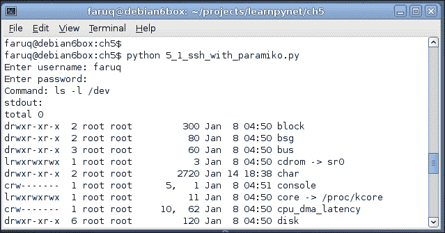
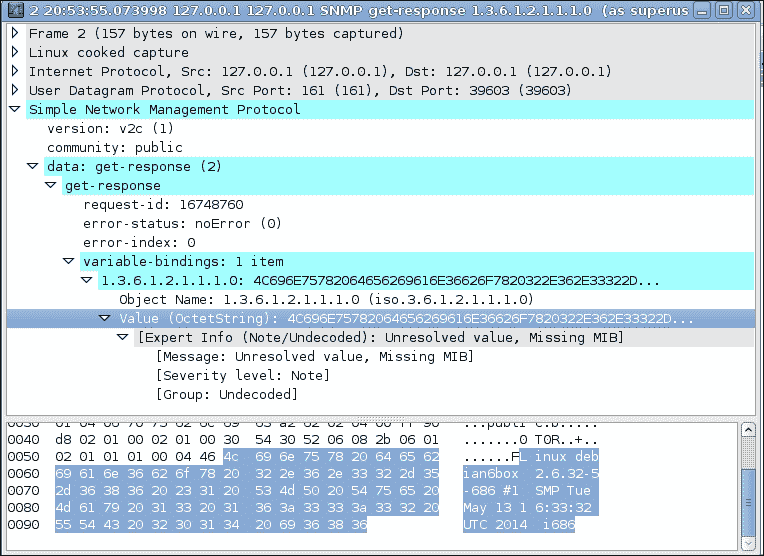
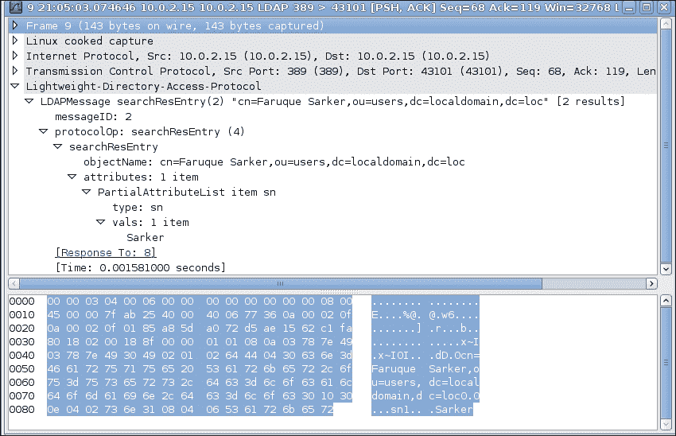
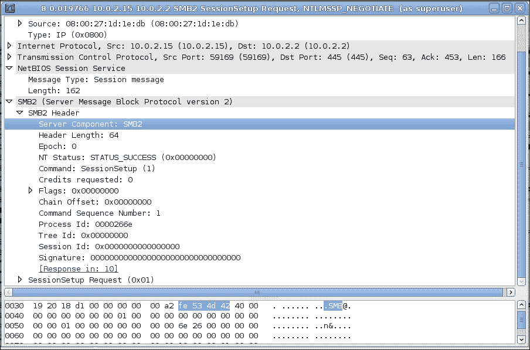

# 第五章：与远程系统交互

如果您的计算机连接到互联网或**局域网**（**LAN**），那么现在是时候与网络上的其他计算机进行通信了。在典型的家庭、办公室或校园局域网中，您会发现许多不同类型的计算机连接到网络上。一些计算机充当特定服务的服务器，例如文件服务器、打印服务器、用户认证管理服务器等。在本章中，我们将探讨网络中的计算机如何相互交互以及如何通过 Python 脚本访问一些服务。以下任务列表将为您提供本章涵盖的主题的概述：

+   使用`paramiko`访问 SSH 终端

+   通过 SFTP 传输文件

+   通过 FTP 传输文件

+   阅读 SNMP 数据包

+   阅读 LDAP 数据包

+   使用 SAMBA 共享文件

这一章需要一些第三方软件包，如`paramiko`、`pysnmp`等。您可以使用操作系统的软件包管理工具进行安装。以下是在 Ubuntu 14、python3 中安装`paramiko`模块以及本章涵盖的其他主题的理解所需的其他模块的快速操作指南：

```py
**sudo apt-get install python3**
**sudo apt-get install python3-setuptools**
**sudo easy_install3 paramiko**
**sudo easy_install3 python3-ldap**
**sudo easy_install3 pysnmp**
**sudo easy_install3 pysmb**

```

# 使用 Python 进行安全外壳访问

SSH 已经成为一种非常流行的网络协议，用于在两台计算机之间进行安全数据通信。它提供了出色的加密支持，使得无关的第三方在传输过程中无法看到数据的内容。SSH 协议的详细信息可以在这些 RFC 文档中找到：RFC4251-RFC4254，可在[`www.rfc-editor.org/rfc/rfc4251.txt`](http://www.rfc-editor.org/rfc/rfc4251.txt)上找到。

Python 的`paramiko`库为基于 SSH 的网络通信提供了非常好的支持。您可以使用 Python 脚本来从 SSH-based 远程管理中获益，例如远程命令行登录、命令执行以及两台网络计算机之间的其他安全网络服务。您可能还对使用基于`paramiko`的`pysftp`模块感兴趣。有关此软件包的更多详细信息可以在 PyPI 上找到：[`pypi.python.org/pypi/pysftp/`](https://pypi.python.org/pypi/pysftp/)。

SSH 是一种客户端/服务器协议。双方都使用 SSH 密钥对加密通信。每个密钥对都有一个私钥和一个公钥。公钥可以发布给任何可能感兴趣的人。私钥始终保持私密，并且除了密钥所有者之外，不允许任何人访问。

SSH 公钥和私钥可以由外部或内部证书颁发机构生成并进行数字签名。但这给小型组织带来了很多额外开销。因此，作为替代，可以使用`ssh-keygen`等实用工具随机生成密钥。公钥需要提供给所有参与方。当 SSH 客户端首次连接到服务器时，它会在一个名为`~/.ssh/known_hosts`的特殊文件上注册服务器的公钥。因此，随后连接到服务器可以确保客户端与之前通话的是同一台服务器。在服务器端，如果您希望限制对具有特定 IP 地址的某些客户端的访问，则可以将允许主机的公钥存储到另一个名为`ssh_known_hosts`的特殊文件中。当然，如果重新构建机器，例如服务器机器，那么服务器的旧公钥将与`~/.ssh/known_hosts`文件中存储的公钥不匹配。因此，SSH 客户端将引发异常并阻止您连接到它。您可以从该文件中删除旧密钥，然后尝试重新连接，就像第一次一样。

我们可以使用`paramiko`模块创建一个 SSH 客户端，然后将其连接到 SSH 服务器。这个模块将提供`SSHClient()`类。

```py
ssh_client = paramiko.SSHClient()
```

默认情况下，此客户端类的实例将拒绝未知的主机密钥。因此，您可以设置接受未知主机密钥的策略。内置的`AutoAddPolicy()`类将在发现时添加主机密钥。现在，您需要在`ssh_client`对象上运行`set_missing_host_key_policy()`方法以及以下参数。

```py
ssh_client.set_missing_host_key_policy(paramiko.AutoAddPolicy())
```

如果您想要限制仅连接到某些主机，那么您可以定义自己的策略并将其替换为`AutoAddPolicy()`类。

您可能还希望使用`load_system_host_keys()`方法添加系统主机密钥。

```py
ssh_client.load_system_host_keys()
```

到目前为止，我们已经讨论了如何加密连接。然而，SSH 需要您的身份验证凭据。这意味着客户端需要向服务器证明特定用户在交谈，而不是其他人。有几种方法可以做到这一点。最简单的方法是使用用户名和密码组合。另一种流行的方法是使用基于密钥的身份验证方法。这意味着用户的公钥可以复制到服务器上。有一个专门的工具可以做到这一点。这是随后版本的 SSH 附带的。以下是如何使用`ssh-copy-id`的示例。

```py
**ssh-copy-id -i ~/.ssh/id_rsa.pub faruq@debian6box.localdomain.loc**

```

此命令将 faruq 用户的 SSH 公钥复制到`debian6box.localdomain.loc`机器：

在这里，我们可以简单地调用`connect()`方法以及目标主机名和 SSH 登录凭据。要在目标主机上运行任何命令，我们需要通过将命令作为其参数来调用`exec_command()`方法。

```py
ssh_client.connect(hostname, port, username, password)
stdin, stdout, stderr = ssh_client.exec_command(cmd)
```

以下代码清单显示了如何对目标主机进行 SSH 登录，然后运行简单的`ls`命令：

```py
#!/usr/bin/env python3

import getpass
import paramiko

HOSTNAME = 'localhost'
PORT = 22

def run_ssh_cmd(username, password, cmd, hostname=HOSTNAME, port=PORT):
    ssh_client = paramiko.SSHClient()
    ssh_client.set_missing_host_key_policy(\
        paramiko.AutoAddPolicy())
    ssh_client.load_system_host_keys()
    ssh_client.connect(hostname, port, username, password)
    stdin, stdout, stderr = ssh_client.exec_command(cmd)
    print(stdout.read())

if __name__ == '__main__':
    username = input("Enter username: ")
    password = getpass.getpass(prompt="Enter password: ")
    cmd = 'ls -l /dev'
    run_ssh_cmd(username, password, cmd)
```

在运行之前，我们需要确保目标主机（在本例中为本地主机）上运行 SSH 服务器守护程序。如下面的截图所示，我们可以使用`netstat`命令来执行此操作。此命令将显示所有监听特定端口的运行服务：


前面的脚本将与本地主机建立 SSH 连接，然后运行`ls -l /dev/`命令。此脚本的输出将类似于以下截图：



## 检查 SSH 数据包

看到客户端和服务器之间的网络数据包交换将会非常有趣。我们可以使用本机`tcpdump`命令或第三方 Wireshark 工具来捕获网络数据包。使用`tcpdump`，您可以指定目标网络接口（`-i lo`）和端口号（端口`22`）选项。在以下数据包捕获会话中，在 SSH 客户端/服务器通信会话期间显示了五次数据包交换：

```py
**root@debian6box:~# tcpdump -i lo port 22**
**tcpdump: verbose output suppressed, use -v or -vv for full protocol decode**
**listening on lo, link-type EN10MB (Ethernet), capture size 65535 bytes**
**12:18:19.761292 IP localhost.50768 > localhost.ssh: Flags [S], seq 3958510356, win 32792, options [mss 16396,sackOK,TS val 57162360 ecr 0,nop,wscale 6], length 0**
**12:18:19.761335 IP localhost.ssh > localhost.50768: Flags [S.], seq 1834733028, ack 3958510357, win 32768, options [mss 16396,sackOK,TS val 57162360 ecr 57162360,nop,wscale 6], length 0**
**12:18:19.761376 IP localhost.50768 > localhost.ssh: Flags [.], ack 1, win 513, options [nop,nop,TS val 57162360 ecr 57162360], length 0**
**12:18:19.769430 IP localhost.50768 > localhost.ssh: Flags [P.], seq 1:25, ack 1, win 513, options [nop,nop,TS val 57162362 ecr 57162360], length 24**
**12:18:19.769467 IP localhost.ssh > localhost.50768: Flags [.], ack 25, win 512, options [nop,nop,TS val 57162362 ecr 57162362], length 0**

```

尽管使用`tcpdump`非常快速和简单，但该命令不会像其他 GUI 工具（如 Wireshark）那样解释它。前面的会话可以在 Wireshark 中捕获，如下面的截图所示：


这清楚地显示了前三个数据包如何完成 TCP 握手过程。然后，随后的 SSH 数据包协商了客户端和服务器之间的连接。看到客户端和服务器如何协商加密协议是很有趣的。在这个例子中，客户端端口是`50768`，服务器端口是`22`。客户端首先启动 SSH 数据包交换，然后指示它想要使用`SSHv2`协议进行通信。然后，服务器同意并继续数据包交换。

# 通过 SFTP 传输文件

SSH 可以有效地用于在两个计算机节点之间安全地传输文件。在这种情况下使用的协议是**安全文件传输协议**（**SFTP**）。Python 的`paramiko`模块将提供创建 SFTP 会话所需的类。然后，此会话可以执行常规的 SSH 登录。

```py
ssh_transport = paramiko.Transport(hostname, port)
ssh_transport.connect(username='username', password='password')
```

SFTP 会话可以从 SSH 传输中创建。paramiko 在 SFTP 会话中的工作将支持诸如`get()`之类的正常 FTP 命令。

```py
 sftp_session = paramiko.SFTPClient.from_transport(ssh_transport)
 sftp_session.get(source_file, target_file)
```

正如您所看到的，SFTP 的`get`命令需要源文件的路径和目标文件的路径。在下面的示例中，脚本将通过 SFTP 下载位于用户主目录中的`test.txt`文件：

```py
#!/usr/bin/env python3

import getpass
import paramiko

HOSTNAME = 'localhost'
PORT = 22
FILE_PATH = '/tmp/test.txt'

def sftp_download(username, password, hostname=HOSTNAME, port=PORT):
    ssh_transport = paramiko.Transport(hostname, port)
    ssh_transport.connect(username=username, password=password)
    sftp_session = paramiko.SFTPClient.from_transport(ssh_transport)
    file_path = input("Enter filepath: ") or FILE_PATH
    target_file = file_path.split('/')[-1]
    sftp_session.get(file_path, target_file)
    print("Downloaded file from: %s" %file_path)
    sftp_session.close()

if __name__ == '__main__':
    hostname = input("Enter the target hostname: ")
    port = input("Enter the target port: ")
    username = input("Enter yur username: ")
    password = getpass.getpass(prompt="Enter your password: ")
    sftp_download(username, password, hostname, int(port))
```

在这个例子中，使用 SFTP 下载了一个文件。请注意，`paramiko`使用`SFTPClient.from_transport(ssh_transport)`类创建了 SFTP 会话。

脚本可以按照以下截图所示运行。在这里，我们将首先创建一个名为`/tmp/test.txt`的临时文件，然后完成 SSH 登录，然后使用 SFTP 下载该文件。最后，我们将检查文件的内容。


# 使用 FTP 传输文件

与 SFTP 不同，FTP 使用明文文件传输方法。这意味着通过网络传输的任何用户名或密码都可以被不相关的第三方检测到。尽管 FTP 是一种非常流行的文件传输协议，但人们经常使用它将文件从他们的个人电脑传输到远程服务器。

在 Python 中，`ftplib`是一个用于在远程机器之间传输文件的内置模块。您可以使用`FTP()`类创建一个匿名 FTP 客户端连接。

```py
ftp_client = ftplib.FTP(path, username, email)   
```

然后，您可以调用正常的 FTP 命令，例如`CWD`。为了下载二进制文件，您需要创建一个文件处理程序，如下所示：

```py
file_handler = open(DOWNLOAD_FILE_NAME, 'wb')
```

为了从远程主机检索二进制文件，可以使用此处显示的语法以及`RETR`命令：

```py
ftp_client.retrbinary('RETR remote_file_name', file_handler.write)
```

在下面的代码片段中，可以看到完整的 FTP 文件下载示例：

```py
#!/usr/bin/env python
import ftplib

FTP_SERVER_URL = 'ftp.kernel.org'
DOWNLOAD_DIR_PATH = '/pub/software/network/tftp'
DOWNLOAD_FILE_NAME = 'tftp-hpa-0.11.tar.gz'

def ftp_file_download(path, username, email):
    # open ftp connection
    ftp_client = ftplib.FTP(path, username, email)
    # list the files in the download directory
    ftp_client.cwd(DOWNLOAD_DIR_PATH)
    print("File list at %s:" %path)
    files = ftp_client.dir()
    print(files)
    # downlaod a file
    file_handler = open(DOWNLOAD_FILE_NAME, 'wb')
    #ftp_cmd = 'RETR %s ' %DOWNLOAD_FILE_NAME
    ftp_client.retrbinary('RETR tftp-hpa-0.11.tar.gz', file_handler.write)
    file_handler.close()
    ftp_client.quit()

if __name__ == '__main__':
    ftp_file_download(path=FTP_SERVER_URL,  username='anonymous', email='nobody@nourl.com')
```

上述代码说明了如何从[ftp.kernel.org](http://ftp.kernel.org)下载匿名 FTP，这是托管 Linux 内核的官方网站。`FTP()`类接受三个参数，如远程服务器上的初始文件系统路径、用户名和`ftp`用户的电子邮件地址。对于匿名下载，不需要用户名和密码。因此，可以从`/pub/software/network/tftp`路径上找到的`tftp-hpa-0.11.tar.gz`文件中下载脚本。

## 检查 FTP 数据包

如果我们在公共网络接口的端口`21`上在 Wireshark 中捕获 FTP 会话，那么我们可以看到通信是如何以明文形式进行的。这将向您展示为什么应该优先使用 SFTP。在下图中，我们可以看到，在成功与客户端建立连接后，服务器发送横幅消息:`220` 欢迎来到 kernel.org。随后，客户端将匿名发送登录请求。作为回应，服务器将要求密码。客户端可以发送用户的电子邮件地址进行身份验证。

检查 FTP 数据包

令人惊讶的是，您会发现密码已经以明文形式发送。在下面的截图中，显示了密码数据包的内容。它显示了提供的虚假电子邮件地址`nobody@nourl.com`。


# 获取简单网络管理协议数据

SNMP 是一种广泛使用的网络协议，用于网络路由器（如交换机、服务器等）通信设备的配置、性能数据和控制设备的命令。尽管 SNMP 以“简单”一词开头，但它并不是一个简单的协议。在内部，每个设备的信息都存储在一种称为**管理信息库**（**MIB**）的信息数据库中。SNMP 协议根据协议版本号提供不同级别的安全性。在 SNMP `v1`和`v2c`中，数据受到称为 community 字符串的密码短语的保护。在 SNMP `v3`中，需要用户名和密码来存储数据。并且，数据可以通过 SSL 进行加密。在我们的示例中，我们将使用 SNMP 协议的`v1`和`v2c`版本。

SNMP 是一种基于客户端/服务器的网络协议。服务器守护程序向客户端提供请求的信息。在您的计算机上，如果已安装和配置了 SNMP，则可以使用`snmpwalk`实用程序命令通过以下语法查询基本系统信息：

```py
**# snmpwalk -v2c -c public localhost**
**iso.3.6.1.2.1.1.1.0 = STRING: "Linux debian6box 2.6.32-5-686 #1 SMP Tue May 13 16:33:32 UTC 2014 i686"**
**iso.3.6.1.2.1.1.2.0 = OID: iso.3.6.1.4.1.8072.3.2.10**
**iso.3.6.1.2.1.1.3.0 = Timeticks: (88855240) 10 days, 6:49:12.40**
**iso.3.6.1.2.1.1.4.0 = STRING: "Me <me@example.org>"**
**iso.3.6.1.2.1.1.5.0 = STRING: "debian6box"**
**iso.3.6.1.2.1.1.6.0 = STRING: "Sitting on the Dock of the Bay"**

```

上述命令的输出将显示 MIB 编号及其值。例如，MIB 编号`iso.3.6.1.2.1.1.1.0`显示它是一个字符串类型的值，如`Linux debian6box 2.6.32-5-686 #1 SMP Tue May 13 16:33:32 UTC 2014 i686`。

在 Python 中，您可以使用一个名为`pysnmp`的第三方库来与`snmp`守护程序进行交互。您可以使用 pip 安装`pysnmp`模块。

```py
**$ pip install pysnmp**

```

该模块为`snmp`命令提供了一个有用的包装器。让我们学习如何创建一个`snmpwalk`命令。首先，导入一个命令生成器。

```py
from pysnmp.entity.rfc3413.oneliner import cmdgen
cmd_generator = cmdgen.CommandGenerator()
```

然后假定`snmpd`守护程序在本地机器的端口`161`上运行，并且 community 字符串已设置为 public，定义连接的必要默认值。

```py
SNMP_HOST = 'localhost'
SNMP_PORT = 161
SNMP_COMMUNITY = 'public'
```

现在使用必要的数据调用`getCmd()`方法。

```py
    error_notify, error_status, error_index, var_binds = cmd_generator.getCmd(
        cmdgen.CommunityData(SNMP_COMMUNITY),
        cmdgen.UdpTransportTarget((SNMP_HOST, SNMP_PORT)),
        cmdgen.MibVariable('SNMPv2-MIB', 'sysDescr', 0),
        lookupNames=True, lookupValues=True
    )
```

您可以看到`cmdgen`接受以下参数：

+   `CommunityData()`: 将 community 字符串设置为 public。

+   `UdpTransportTarget()`: 这是主机目标，`snmp`代理正在运行的地方。这是由主机名和 UDP 端口组成的一对。

+   `MibVariable`: 这是一个值元组，包括 MIB 版本号和 MIB 目标字符串（在本例中为`sysDescr`；这是指系统的描述）。

该命令的输出由一个四值元组组成。其中三个与命令生成器返回的错误有关，第四个与绑定返回数据的实际变量有关。

以下示例显示了如何使用前面的方法从运行的 SNMP 守护程序中获取 SNMP 主机描述字符串：

```py
from pysnmp.entity.rfc3413.oneliner import cmdgen

SNMP_HOST = 'localhost'
SNMP_PORT = 161
SNMP_COMMUNITY = 'public'

if __name__ == '__manin__':
    cmd_generator = cmdgen.CommandGenerator()

    error_notify, error_status, error_index, var_binds = cmd_generator.getCmd(
        cmdgen.CommunityData(SNMP_COMMUNITY),
        cmdgen.UdpTransportTarget((SNMP_HOST, SNMP_PORT)),
        cmdgen.MibVariable('SNMPv2-MIB', 'sysDescr', 0),
        lookupNames=True, lookupValues=True
    )

    # Check for errors and print out results
    if error_notify:
        print(error_notify)
    elif error_status:
        print(error_status)
    else:
        for name, val in var_binds:
            print('%s = %s' % (name.prettyPrint(), val.prettyPrint()))
```

运行上述示例后，将出现类似以下的输出：

```py
**$  python 5_4_snmp_read.py**
**SNMPv2-MIB::sysDescr."0" = Linux debian6box 2.6.32-5-686 #1 SMP Tue May 13 16:33:32 UTC 2014 i686**

```

## 检查 SNMP 数据包

我们可以通过捕获网络接口的端口 161 上的数据包来检查 SNMP 数据包。如果服务器在本地运行，则仅需监听`loopbook`接口即可。Wireshak 生成的`snmp-get`请求格式和`snmp-get`响应数据包格式如下截图所示：


作为对客户端的 SNMP 获取请求的响应，服务器将生成一个 SNMP 获取响应。这可以在以下截图中看到：



# 读取轻量级目录访问协议数据

长期以来，LDAP 一直被用于访问和管理分布式目录信息。这是一个在 IP 网络上运行的应用级协议。目录服务在组织中被广泛用于管理有关用户、计算机系统、网络、应用程序等信息。LDAP 协议包含大量的技术术语。它是基于客户端/服务器的协议。因此，LDAP 客户端将向正确配置的 LDAP 服务器发出请求。在初始化 LDAP 连接后，连接将需要使用一些参数进行身份验证。简单的绑定操作将建立 LDAP 会话。在简单情况下，您可以设置一个简单的匿名绑定，不需要密码或其他凭据。

如果您使用`ldapsearch`运行简单的 LDAP 查询，那么您将看到如下结果：

```py
**# ldapsearch  -x -b "dc=localdomain,dc=loc" -h 10.0.2.15 -p 389**

**# extended LDIF**
**#**
**# LDAPv3**
**# base <dc=localdomain,dc=loc> with scope subtree**
**# filter: (objectclass=*)**
**# requesting: ALL**
**#**

**# localdomain.loc**
**dn: dc=localdomain,dc=loc**
**objectClass: top**
**objectClass: dcObject**
**objectClass: organization**
**o: localdomain.loc**
**dc: localdomain**

**# admin, localdomain.loc**
**dn: cn=admin,dc=localdomain,dc=loc**
**objectClass: simpleSecurityObject**
**objectClass: organizationalRole**
**cn: admin**
**description: LDAP administrator**
**# groups, localdomain.loc**
**dn: ou=groups,dc=localdomain,dc=loc**
**ou: groups**
**objectClass: organizationalUnit**
**objectClass: top**

**# users, localdomain.loc**
**dn: ou=users,dc=localdomain,dc=loc**
**ou: users**
**objectClass: organizationalUnit**
**objectClass: top**

**# admin, groups, localdomain.loc**
**dn: cn=admin,ou=groups,dc=localdomain,dc=loc**
**cn: admin**
**gidNumber: 501**
**objectClass: posixGroup**

**# Faruque Sarker, users, localdomain.loc**
**dn: cn=Faruque Sarker,ou=users,dc=localdomain,dc=loc**
**givenName: Faruque**
**sn: Sarker**
**cn: Faruque Sarker**
**uid: fsarker**
**uidNumber: 1001**
**gidNumber: 501**
**homeDirectory: /home/users/fsarker**
**loginShell: /bin/sh**
**objectClass: inetOrgPerson**
**objectClass: posixAccount**

**# search result**
**search: 2**
**result: 0 Success**

**# numResponses: 7**
**# numEntries: 6**

```

前面的通信可以通过 Wireshark 来捕获。您需要在端口 389 上捕获数据包。如下截图所示，在成功发送`bindRequest`之后，LDAP 客户端-服务器通信将建立。以匿名方式与 LDAP 服务器通信是不安全的。为了简单起见，在下面的示例中，搜索是在不绑定任何凭据的情况下进行的。


Python 的第三方`python-ldap`软件包提供了与 LDAP 服务器交互所需的功能。您可以使用`pip`安装此软件包。

```py
**$ pip install python-ldap**

```

首先，您需要初始化 LDAP 连接：

```py
import ldap
   ldap_client = ldap.initialize("ldap://10.0.2.15:389/")
```

然后以下代码将展示如何执行简单的绑定操作：

```py
  ldap_client.simple_bind("dc=localdomain,dc=loc")
```

然后您可以执行 LDAP 搜索。您需要指定必要的参数，如基本 DN、过滤器和属性。以下是在 LDAP 服务器上搜索用户所需的语法示例：

```py
ldap_client.search_s( base_dn, ldap.SCOPE_SUBTREE, filter, attrs )
```

以下是使用 LDAP 协议查找用户信息的完整示例：

```py
import ldap

# Open a connection
ldap_client = ldap.initialize("ldap://10.0.2.15:389/")

# Bind/authenticate with a user with apropriate rights to add objects

ldap_client.simple_bind("dc=localdomain,dc=loc")

base_dn = 'ou=users,dc=localdomain,dc=loc'
filter = '(objectclass=person)'
attrs = ['sn']

result = ldap_client.search_s( base_dn, ldap.SCOPE_SUBTREE, filter, attrs )
print(result)
```

前面的代码将搜索 LDAP 目录子树，使用`ou=users,dc=localdomain,dc=loc`基本`DN`和`[sn]`属性。搜索限定为人员对象。

## 检查 LDAP 数据包

如果我们分析 LDAP 客户端和服务器之间的通信，我们可以看到 LDAP 搜索请求和响应的格式。我们在我们的代码中使用的参数与 LDAP 数据包的`searchRequest`部分有直接关系。如 Wireshark 生成的以下截图所示，它包含数据，如`baseObject`、`scope`和`Filter`。


LDAP 搜索请求生成服务器响应，如下所示：



当 LDAP 服务器返回搜索响应时，我们可以看到响应的格式。如前面的截图所示，它包含了搜索结果和相关属性。

以下是从 LDAP 服务器搜索用户的示例：

```py
#!/usr/bin/env python
import ldap
import ldap.modlist as modlist

LDAP_URI = "ldap://10.0.2.15:389/"
BIND_TO = "dc=localdomain,dc=loc"
BASE_DN = 'ou=users,dc=localdomain,dc=loc'
SEARCH_FILTER = '(objectclass=person)'
SEARCH_FILTER = ['sn']

if __name__ == '__main__':
    # Open a connection
    l = ldap.initialize(LDAP_URI)
    # bind to the server
    l.simple_bind(BIND_TO)
    result = l.search_s( BASE_DN, ldap.SCOPE_SUBTREE, SEARCH_FILTER, SEARCH_FILTER )
    print(result)
```

在正确配置的 LDAP 机器中，前面的脚本将返回类似以下的结果：

```py
**$ python 5_5_ldap_read_record.py**
**[('cn=Faruque Sarker,ou=users,dc=localdomain,dc=loc', {'sn': ['Sarker']})]**

```

# 使用 SAMBA 共享文件

在局域网环境中，您经常需要在不同类型的机器之间共享文件，例如 Windows 和 Linux 机器。用于在这些机器之间共享文件和打印机的协议是**服务器消息块**（**SMB**）协议或其增强版本称为**公共互联网文件系统**（**CIFS**）协议。CIFS 运行在 TCP/IP 上，由 SMB 客户端和服务器使用。在 Linux 中，您会发现一个名为 Samba 的软件包，它实现了`SMB`协议。

如果您在 Windows 框中运行 Linux 虚拟机，并借助软件（如 VirtualBox）进行文件共享测试，则可以在 Windows 机器上创建一个名为`C:\share`的文件夹，如下屏幕截图所示：


现在，右键单击文件夹，然后转到**共享**选项卡。有两个按钮：**共享**和**高级共享**。您可以单击后者，它将打开高级共享对话框。现在您可以调整共享权限。如果此共享处于活动状态，则您将能够从 Linux 虚拟机中看到此共享。如果在 Linux 框中运行以下命令，则将看到先前定义的文件共享：

```py
**$smbclient -L 10.0.2.2 -U WINDOWS_USERNAME%PASSWPRD  -W WORKGROUP**
**Domain=[FARUQUESARKER] OS=[Windows 8 9200] Server=[Windows 8 6.2]**

 **Sharename       Type      Comment**
 **---------       ----      -------**
 **ADMIN$          Disk      Remote Admin**
 **C$              Disk      Default share**
 **IPC$            IPC       Remote IPC**
 **Share           Disk**

```

以下屏幕截图显示了如何在 Windows 7 下共享文件夹，如前所述：


可以使用第三方模块`pysmb`从 Python 脚本访问前面的文件共享。您可以使用`pip`命令行工具安装`pysmb`：

```py
**$ pip install pysmb**

```

该模块提供了一个`SMBConnection`类，您可以通过该类传递必要的参数来访问 SMB/CIFS 共享。例如，以下代码将帮助您访问文件共享：

```py
from smb.SMBConnection import SMBConnection
smb_connection = SMBConnection(username, password, client_machine_name, server_name, use_ntlm_v2 = True, domain='WORKGROUP', is_direct_tcp=True)
```

如果前面的工作正常，则以下断言将为真：

```py
assert smb_connection.connect(server_ip, 445)
```

您可以使用`listShares()`方法列出共享文件：

```py
shares =  smb_connection.listShares()
for share in shares:
    print share.name
```

如果您可以使用`tmpfile`模块从 Windows 共享复制文件。例如，如果您在`C:\Share\test.rtf`路径中创建一个文件，则以下附加代码将使用 SMB 协议复制该文件：

```py
import tempfile
files = smb_connection.listPath(share.name, '/')

for file in files:
    print file.filename

file_obj = tempfile.NamedTemporaryFile()
file_attributes, filesize = smb_connection.retrieveFile('Share', '/test.rtf', file_obj)
file_obj.close()
```

如果我们将整个代码放入单个源文件中，它将如下所示：

```py
#!/usr/bin/env python
import tempfile
from smb.SMBConnection import SMBConnection

SAMBA_USER_ID = 'FaruqueSarker'
PASSWORD = 'PASSWORD'
CLIENT_MACHINE_NAME = 'debian6box'
SAMBA_SERVER_NAME = 'FARUQUESARKER'
SERVER_IP = '10.0.2.2'
SERVER_PORT = 445
SERVER_SHARE_NAME = 'Share'
SHARED_FILE_PATH = '/test.rtf'

if __name__ == '__main__':

    smb_connection = SMBConnection(SAMBA_USER_ID, PASSWORD, CLIENT_MACHINE_NAME, SAMBA_SERVER_NAME, use_ntlm_v2 = True, domain='WORKGROUP', is_direct_tcp=True)
    assert smb_connection.smb_connectionect(SERVER_IP, SERVER_PORT = 445)
    shares =  smb_connection.listShares()

    for share in shares:
        print share.name

    files = smb_connection.listPath(share.name, '/')
    for file in files:
        print file.filename

    file_obj = tempfile.NamedTemporaryFile()
    file_attributes, filesize = smb_connection.retrieveFile(SERVER_SHARE_NAME, SHARED_FILE_PATH, file_obj)

    # Retrieved file contents are inside file_obj
    file_obj.close()
```

## 检查 SAMBA 数据包

如果我们在端口`445`上捕获 SMABA 数据包，则可以看到 Windows 服务器如何通过 CIFS 协议与 Linux SAMBA 客户端进行通信。在以下两个屏幕截图中，已呈现了客户端和服务器之间的详细通信。连接设置如下截图所示：


以下屏幕截图显示了如何执行文件复制会话：


以下屏幕截图显示了典型的 SAMBA 数据包格式。此数据包的重要字段是`NT_STATUS`字段。通常，如果连接成功，则会显示`STATUS_SUCESS`。否则，它将打印不同的代码。如下屏幕截图所示：



# 总结

在本章中，我们已经接触了几种网络协议和 Python 库，用于与远程系统进行交互。SSH 和 SFTP 用于安全连接和传输文件到远程主机。FTP 仍然用作简单的文件传输机制。但是，由于用户凭据以明文形式传输，因此不安全。我们还研究了处理 SNMP、LDAP 和 SAMBA 数据包的 Python 库。

在下一章中，将讨论最常见的网络协议之一，即 DNS 和 IP。我们将使用 Python 脚本探索 TCP/IP 网络。
