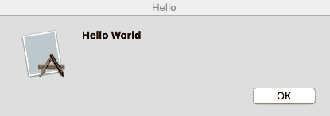
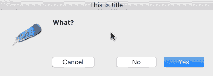
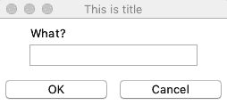
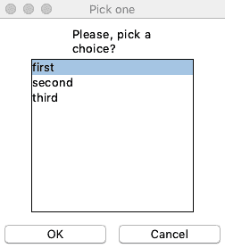
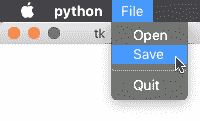

# 十三、图形用户界面

在本章中，我们将介绍以下配方：

*   在图形系统上显示警报对话框的警报
*   对话框如何使用对话框提出简单问题
*   ProgressBar 对话框如何提供图形进度对话框
*   列出如何实现可滚动的元素列表以从中选择
*   菜单如何在 GUI 应用程序中创建菜单以允许多个操作

# 介绍

Python 附带了一个编程语言很少附带的特性：内置的**图形用户界面**（**GUI**库。

Python 附带了一个工作版本的`Tk`widgets 工具包，可以通过标准库提供的`tkinter`模块进行控制。

`Tk`工具包实际上是通过一种名为`Tcl`的简单语言使用的。所有的`Tk`小部件都可以通过`Tcl`命令进行控制。

这些命令大多非常简单，并采用以下形式：

```py
classname widgetid options
```

例如，以下内容将导致按钮（标识为`mybutton`）显示红色`"click here"`文本：

```py
button .mybutton -fg red  -text "click here"
```

由于这些命令通常相对简单，Python 附带了一个内置的`Tcl`解释器，并使用它来驱动`Tk`小部件。

如今，几乎所有人，甚至是更为核心的计算机用户，都习惯于依赖 GUI 完成许多任务，特别是对于需要基本交互的简单应用程序，如选择、确认条目或显示一些进展。因此，GUI 的使用非常方便。

对于图形化应用程序，用户通常不需要浏览应用程序的帮助页面、阅读文档以及通过应用程序提供的选项来学习其特定语法。几十年来，GUI 一直在提供一种一致的交互语言，如果使用得当，它是降低软件进入门槛的好方法。

由于 Python 提供了创建功能强大的控制台应用程序和良好的 GUI 所需的工具，下次您需要创建新工具时，最好停止思考用户会发现什么更方便，如果您选择的是图形化应用程序，则转向`tkinter`。

虽然`tkinter`与功能强大的工具包（如 Qt 或 GTK）相比可能会受到限制，但它确实是一个完全独立于平台的解决方案，对于大多数应用程序来说已经足够好了。

# 警报

最简单的 GUI 类型是警报。只需在图形框中打印一些内容以通知用户结果或事件：



# 怎么做。。。

`tkinter`中的警报由`messagebox`对象管理，我们只需请求`messagebox`为我们显示一个警报，即可创建一个警报：

```py
from tkinter import messagebox

def alert(title, message, kind='info', hidemain=True):
    if kind not in ('error', 'warning', 'info'):
        raise ValueError('Unsupported alert kind.')

    show_method = getattr(messagebox, 'show{}'.format(kind))
    show_method(title, message)
```

一旦我们有了`alert`助手，我们就可以初始化`Tk`解释器，并显示任意数量的警报：

```py
from tkinter import Tk

Tk().withdraw()
alert('Hello', 'Hello World')
alert('Hello Again', 'Hello World 2', kind='warning')
```

如果一切按预期进行，我们应该看到一个弹出对话框，一旦退出，就会出现一个新的对话框`Hello Again`。

# 它是如何工作的。。。

`alert`函数本身只是`tkinter.messagebox`所提供内容的薄薄包装。

我们可以显示三种类型的消息框：`error`、`warning`和`info`。如果请求的对话框类型不受支持，我们将拒绝它：

```py
if kind not in ('error', 'warning', 'info'):
    raise ValueError('Unsupported alert kind.')
```

每种对话框都依赖于`messagebox`的不同方法显示。信息框使用`messagebox.showinfo`显示，错误使用`messagebox.showerror`显示，以此类推。

因此，我们抓住了`messagebox`的相关方法：

```py
show_method = getattr(messagebox, 'show{}'.format(kind))
```

然后，我们调用它来显示我们的框：

```py
show_method(title, message)
```

`alert`函数非常简单，但我们还需要记住一件事。

`tkinter`库通过其自身的解释器和环境与`Tk`交互，这需要创建和启动。

如果我们自己不启动一个，只要它需要发送一些命令，`tkinter`就会为我们启动一个。但是，这会导致始终创建一个空的主窗口。

因此，如果您按原样使用`alert`，您将获得警报，但您的屏幕角落也将出现空窗口。

为了避免这种情况，我们需要自己初始化`Tk`环境并禁用主窗口，因为它没有任何用处：

```py
from tkinter import Tk
Tk().withdraw()
```

然后，我们可以显示任意数量的警报，而不会有在屏幕周围漏出不需要的空窗口的风险。

# 对话框

对话框是用户界面可以提供的最简单和最常见的交互。请求一个简单的输入，如数字、文本或是/否，可以处理简单应用程序中与用户交互的许多需求。

`tkinter`在大多数情况下都有对话框，但如果您还不了解库，可能很难找到所有对话框。作为一个指针，`tkinter`提供的所有对话框共享一个非常相似的签名，因此很容易制作一个`dialog`函数，让我们可以显示所有对话框：



该对话框将显示如下所示：



打开文件的窗口如以下屏幕截图所示：


# 怎么做。。。

我们可以创建一个`dialog`函数来隐藏对话框类型之间的细微差异，并根据请求的类型调用相应的对话框：

```py
from tkinter import messagebox
from tkinter import simpledialog
from tkinter import filedialog

def dialog(ask, title, message=None, **kwargs):
    for widget in (messagebox, simpledialog, filedialog):
        show = getattr(widget, 'ask{}'.format(ask), None)
        if show:
            break
    else:
        raise ValueError('Unsupported type of dialog: {}'.format(ask))

    options = dict(kwargs, title=title)
    for arg, replacement in dialog._argsmap.get(widget, {}).items():
        options[replacement] = locals()[arg]
    return show(**options)
dialog._argsmap = {
    messagebox: {'message': 'message'},
    simpledialog: {'message': 'prompt'}
}
```

然后我们可以测试我们的`dialog`方法，以显示所有可能的对话框类型，并显示用户选择：

```py
>>> from tkinter import Tk

>>> Tk().withdraw()
>>> for ask in ('okcancel', 'retrycancel', 'yesno', 'yesnocancel',
...             'string', 'integer', 'float', 'directory', 'openfilename'):
...     choice = dialog(ask, 'This is title', 'What?')
...     print('{}: {}'.format(ask, choice))
okcancel: True
retrycancel: False
yesno: True
yesnocancel: None
string: Hello World
integer: 5
float: 1.3
directory: /Users/amol/Documents
openfilename: /Users/amol/Documents/FileZilla_3.27.1_macosx-x86.app.tar.bz2
```

# 它是如何工作的。。。

由 Type T0T 提供的对话类型分为{ TouthT1}，OrthT2}和 AutoT3}模块（你也可以考虑 To.T4，但是很少需要）。

因此，根据用户想要的对话框类型，我们需要选择正确的模块并调用显示该模块所需的函数：

```py
from tkinter import messagebox
from tkinter import simpledialog
from tkinter import filedialog

def dialog(ask, title, message=None, **kwargs):
    for widget in (messagebox, simpledialog, filedialog):
        show = getattr(widget, 'ask{}'.format(ask), None)
        if show:
            break
    else:
        raise ValueError('Unsupported type of dialog: {}'.format(ask))
```

如果没有一个模块公开一个函数来显示请求类型的对话框（所有函数都命名为`ask*`），循环将在不中断的情况下完成，因此将进入`else`子句，引发异常以通知调用方请求的类型不可用。

如果循环以`break`退出，`widget`变量将指向能够显示请求的对话框的模块，`show`变量将导致函数实际能够显示该对话框。

一旦我们有了正确的函数，我们就需要考虑各种对话框函数之间的细微差异。

主要的一个是与具有`message`参数的`messagebox`对话框相关的，`simpledialog`对话框具有提示参数，用于向用户显示消息。`filedialog`根本不需要任何信息。

这是通过使用自定义提供的选项和`title`选项创建基本的选项字典来实现的，因为它在各种对话框中始终可用：

```py
options = dict(kwargs, title=title)
```

然后，通过在`dialog._argsmap`字典中查找从`dialog`参数的名称到预期名称的映射，将`message`选项替换为正确的名称（或跳过）。

例如，在`simpledialog`的情况下，使用`{'message': 'prompt'}`映射。在函数局部变量（`locals()[arg]`中查找`message`变量，然后按照`replacement`指定的`prompt`名称将其分配给选项字典。然后，最后调用分配给`show`的函数来显示对话框：

```py
for arg, replacement in dialog._argsmap.get(widget, {}).items():
    options[replacement] = locals()[arg]
return show(**options)

dialog._argsmap = {
    messagebox: {'message': 'message'}, 
    simpledialog: {'message': 'prompt'}
}
```

# 进度条对话框

在执行长时间运行的操作时，通知用户进度的最常见方式是通过进度条。

在线程中运行操作时，我们可以更新进度条，以显示操作正在向前推进，并向用户提示完成工作可能需要的时间：


# 怎么做。。。

`simpledialog.SimpleDialog`小部件用于创建带有一些文本和按钮的简单对话框。我们将利用它来显示进度条，而不是按钮：

```py
import tkinter
from tkinter import simpledialog
from tkinter import ttk

from queue import Queue

class ProgressDialog(simpledialog.SimpleDialog):
    def __init__(self, master, text='', title=None, class_=None):
        super().__init__(master=master, text=text, title=title, 
                         class_=class_)
        self.default = None
        self.cancel = None

        self._bar = ttk.Progressbar(self.root, orient="horizontal", 
                                    length=200, mode="determinate")
        self._bar.pack(expand=True, fill=tkinter.X, side=tkinter.BOTTOM)
        self.root.attributes("-topmost", True)

        self._queue = Queue()
        self.root.after(200, self._update)

    def set_progress(self, value):
        self._queue.put(value)

    def _update(self):
        while self._queue.qsize():
            try:
                self._bar['value'] = self._queue.get(0)
            except Queue.Empty:
                pass
        self.root.after(200, self._update)
```

然后可以创建`ProgressDialog`，我们可以使用后台线程让操作进行（如下载），然后在我们的操作进行时更新进度条：

```py
if __name__ == '__main__':
    root = tkinter.Tk()
    root.withdraw()

    # Prepare the progress dialog
    p = ProgressDialog(master=root, text='Downloading Something...',
                    title='Download')

    # Simulate a download running for 5 seconds in background
    import threading
    def _do_progress():
        import time
        for i in range(1, 11):
            time.sleep(0.5)
            p.set_progress(i*10)
        p.done(0)
    t = threading.Thread(target=_do_progress)
    t.start()

    # Display the dialog and wait for the download to finish.
    p.go()
    print('Download Completed!')
```

# 它是如何工作的。。。

我们的对话框本身主要基于`simpledialog.SimpleDialog`小部件。我们创建它，然后设置`self.default = None`以防止用户通过按`<Return>`键关闭对话框，我们还设置`self.default = None`以防止用户通过按窗口上的按钮关闭对话框。我们希望对话框在完成之前保持打开状态：

```py
class ProgressDialog(simpledialog.SimpleDialog):
    def __init__(self, master, text='', title=None, class_=None):
        super().__init__(master=master, text=text, title=title, class_=class_)
        self.default = None
        self.cancel = None
```

然后我们实际上需要进度条本身，它将显示在文本消息的下面，我们还将对话框移到前面，因为我们希望用户意识到正在发生的事情：

```py
self._bar = ttk.Progressbar(self.root, orient="horizontal", 
                            length=200, mode="determinate")
self._bar.pack(expand=True, fill=tkinter.X, side=tkinter.BOTTOM)
self.root.attributes("-topmost", True)
```

在最后一部分中，我们需要安排`self._update`，它将继续循环，直到对话框退出更新进度条（如果有新的进度值可用）。进度值可以通过`self._queue`提供，通过`set_progress`方法提供时，我们将插入新的进度值：

```py
self._queue = Queue()
self.root.after(200, self._update)
```

我们需要通过`Queue`，因为带有进度条更新的对话框会阻止整个程序。

当`Tkinter mainloop`函数运行时（由`simpledialog.SimpleDialog.go()`调用），其他任何东西都不能向前移动。

因此 UI 和下载必须在两个不同的线程中进行，因为我们不能从不同的线程更新 UI，所以我们必须将产生它们的线程的进度值发送到将使用它们来更新进度条的 UI 线程。

执行操作并生成进度更新的线程可以通过`set_progress`方法将这些进度更新发送给 UI 线程：

```py
def set_progress(self, value):
    self._queue.put(value)
```

另一方面，UI 线程会连续调用`self._update`方法（每 200ms 一次），检查`self._queue`中是否有更新请求，然后应用：

```py
def _update(self):
    while self._queue.qsize():
        try:
            self._bar['value'] = self._queue.get(0)
        except Queue.Empty:
            pass
    self.root.after(200, self._update)
```

在更新结束时，该方法将重新安排自身：

```py
self.root.after(200, self._update)
```

这样，我们将继续检查进度条是否每 200 毫秒更新一次，直到`self.root mainloop`退出。

为了使用`ProgressDialog`，我们模拟了 5 秒钟的下载。这是通过创建对话框本身完成的：

```py
if __name__ == '__main__':
    root = tkinter.Tk()
    root.withdraw()

    # Prepare the progress dialog
    p = ProgressDialog(master=root, text='Downloading Something...',
                    title='Download')
```

然后我们启动了一个持续 5 秒的后台线程，每半秒更新一次进度：

```py
# Simulate a download running for 5 seconds in background
import threading

def _do_progress():
    import time
    for i in range(1, 11):
        time.sleep(0.5)
        p.set_progress(i*10)
    p.done(0)

t = threading.Thread(target=_do_progress)
t.start()
```

更新之所以发生，是因为线程调用了`p.set_progress`，这将在队列中设置一个新的进度值，并向 UI 线程发出要设置新进度值的信号。

下载完成后，将通过`p.done(0)`退出进度对话框。

下载线程就绪后，我们可以实际显示进度对话框并等待其退出：

```py
# Display the dialog and wait for the download to finish.
p.go()
print('Download Completed!')
```

# 列表

当用户有两个以上的选择时，最好通过列表来列出它们。`tkinter`模块提供了一个`ListBox`，它允许我们在可滚动的小部件中显示一组条目，供用户选择。

我们可以使用它来实现一个对话框，用户可以从众多选项中选择一个，并获取所选选项：



# 怎么做。。。

`simpledialog.Dialog`类可用于实现简单的确定/取消对话框，并允许我们为对话框的任何主体提供自定义内容。

我们可以使用它向对话框中添加消息和列表，并让用户进行选择：

```py
import tkinter
from tkinter import simpledialog

class ChoiceDialog(simpledialog.Dialog):
    def __init__(self, parent, title, text, items):
        self.selection = None
        self._items = items
        self._text = text
        super().__init__(parent, title=title)

    def body(self, parent):
        self._message = tkinter.Message(parent, text=self._text, aspect=400)
        self._message.pack(expand=1, fill=tkinter.BOTH)
        self._list = tkinter.Listbox(parent)
        self._list.pack(expand=1, fill=tkinter.BOTH, side=tkinter.TOP)
        for item in self._items:
            self._list.insert(tkinter.END, item)
        return self._list

    def validate(self):
        if not self._list.curselection():
            return 0
        return 1

    def apply(self):
        self.selection = self._items[self._list.curselection()[0]]
```

一旦我们有了`ChoiceDialog`，我们就可以用项目列表显示它，并让用户选择一个或取消对话框：

```py
if __name__ == '__main__':
    tk = tkinter.Tk()
    tk.withdraw()

    dialog = ChoiceDialog(tk, 'Pick one',
                        text='Please, pick a choice?',
                        items=['first', 'second', 'third'])
    print('Selected "{}"'.format(dialog.selection))
```

`ChoiceDialog.selection`属性将始终包含所选项目，如果对话框被取消，则为`None`。

# 它是如何工作的。。。

`simpledialog.Dialog`默认情况下创建带有`Ok`和`Cancel`按钮的对话框，仅提供标题。

在我们的例子中，除了创建对话框本身，我们还希望保持对话框的消息和项目可供选择，以便我们可以向用户显示它们。此外，默认情况下，我们希望设置尚未选择任何项目。最后，我们可以调用`simpledialog.Dialog.__init__`，因为一旦调用，主线程将被阻塞，在对话框关闭之前，我们无法执行任何其他操作：

```py
import tkinter
from tkinter import simpledialog

class ChoiceDialog(simpledialog.Dialog):
    def __init__(self, parent, title, text, items):
        self.selection = None
        self._items = items
        self._text = text
        super().__init__(parent, title=title)
```

我们可以通过重写`simpledialog.Dialog.body`方法添加任何附加内容。此方法可以将更多小部件添加为对话框主体的子项，并可以返回应具有焦点的特定小部件：

```py
def body(self, parent):
    self._message = tkinter.Message(parent, text=self._text, aspect=400)
    self._message.pack(expand=1, fill=tkinter.BOTH)
    self._list = tkinter.Listbox(parent)
    self._list.pack(expand=1, fill=tkinter.BOTH, side=tkinter.TOP)
    for item in self._items:
        self._list.insert(tkinter.END, item)
    return self._list
```

`body`方法是在`simpledialog.Dialog.__init__`中创建的，所以在阻塞主线程之前调用。

对话框内容就位后，对话框将阻塞，等待用户单击按钮。

如果点击`cancel`按钮，对话框将自动关闭，`ChoiceDialog.selection`将保持`None`。

如果单击了`Ok`，则调用`ChoiceDialog.validate`方法检查选择是否有效。我们的`validate`实现将在点击`Ok`之前检查用户是否实际选择了一个条目，并且只有在有选择的条目时才允许用户关闭对话框：

```py
def validate(self):
    if not self._list.curselection():
        return 0
    return 1
```

如果验证通过，则调用`ChoiceDialog.apply`方法确认选择，我们只需在`self.selection`中设置所选项目的名称，以便在对话框不再可见时调用者可以访问该名称：

```py
def apply(self):
    self.selection = self._items[self._list.curselection()[0]]
```

这使得可以在对话框关闭后显示对话框并从`selection`属性读回所选值：

```py
dialog = ChoiceDialog(tk, 'Pick one',
                    text='Please, pick a choice?',
                    items=['first', 'second', 'third'])
print('Selected "{}"'.format(dialog.selection))
```

# 菜单

当应用程序允许您执行多个操作时，菜单通常是允许访问这些操作的最常用方式：



# 怎么做。。。

`tkinter.Menu`类允许我们创建菜单、子菜单、操作和分隔符。因此，它提供了在基于 GUI 的应用程序中创建基本菜单所需的一切：

```py
import tkinter

def set_menu(window, choices):
    menubar = tkinter.Menu(root)
    window.config(menu=menubar)

    def _set_choices(menu, choices):
        for label, command in choices.items():
            if isinstance(command, dict):
                # Submenu
                submenu = tkinter.Menu(menu)
                menu.add_cascade(label=label, menu=submenu)
                _set_choices(submenu, command)
            elif label == '-' and command == '-':
                # Separator
                menu.add_separator()
            else:
                # Simple choice
                menu.add_command(label=label, command=command)

    _set_choices(menubar, choices)
```

`set_menu`功能允许我们轻松地从嵌套的动作和子菜单字典中创建整个菜单层次结构：

```py
import sys
root = tkinter.Tk()

from collections import OrderedDict
set_menu(root, {
    'File': OrderedDict([
        ('Open', lambda: print('Open!')),
        ('Save', lambda: print('Save')),
        ('-', '-'),
        ('Quit', lambda: sys.exit(0))
    ])
})
root.mainloop()
```

如果您使用的是 Python3.6+，您也可以避免使用`OrderedDict`，而使用普通字典，因为字典已经被订购了。

# 它是如何工作的。。。

提供一个窗口，`set_menu`函数创建一个`Menu`对象，并将其设置为窗口菜单：

```py
def set_menu(window, choices):
    menubar = tkinter.Menu(root)
    window.config(menu=menubar)
```

然后，它用通过`choices`参数提供的选项填充菜单。这应该是一个字典，其中键是菜单项的名称，值是选择该选项时应调用的可调用项，或者是另一个字典（如果该选项应指向子菜单）。最后，当标签和选项都设置为`-`时，它支持分隔符。

根据遇到的条目，通过调用`Menu.add_command`、`Menu.add_cascade`和`Menu.add_separator`的递归函数遍历选项树来填充菜单：

```py
def _set_choices(menu, choices):
    for label, command in choices.items():
        if isinstance(command, dict):
            # Submenu
            submenu = tkinter.Menu(menu)
            menu.add_cascade(label=label, menu=submenu)
            _set_choices(submenu, command)
        elif label == '-' and command == '-':
            # Separator
            menu.add_separator()
        else:
            # Simple choice
            menu.add_command(label=label, command=command)

_set_choices(menubar, choices)
```