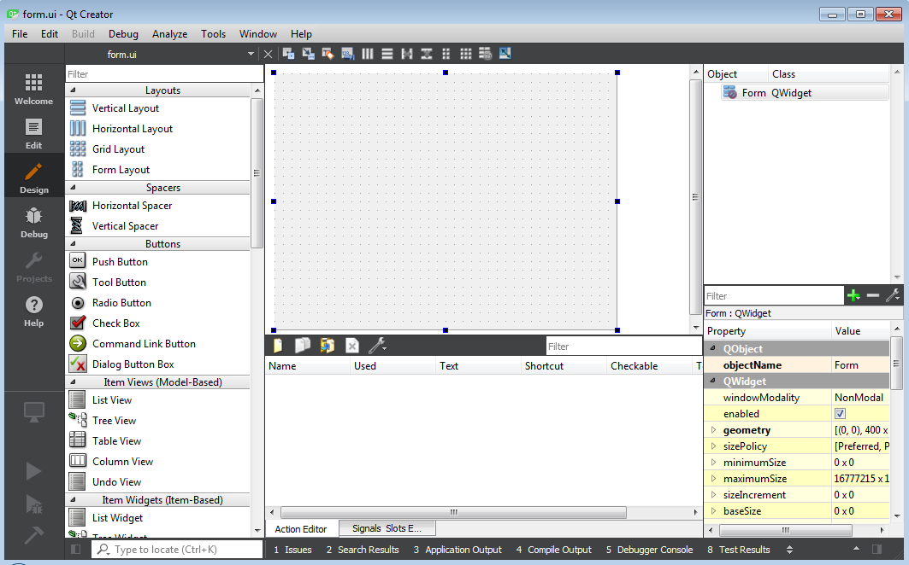

# 第一章：开始使用 PyQt

欢迎，Python 程序员！

Python 是一个用于系统管理、数据分析、Web 服务和命令行程序的优秀语言；很可能您已经在其中至少一个领域发现了 Python 的用处。然而，构建出用户可以轻松识别为程序的 GUI 驱动应用程序确实令人满意，这种技能应该是任何优秀软件开发人员的工具箱中的一部分。在本书中，您将学习如何使用 Python 和 Qt 框架开发令人惊叹的应用程序-从简单的数据输入表单到强大的多媒体工具。

我们将从以下主题开始介绍这些强大的技术：

+   介绍 Qt 和 PyQt

+   创建`Hello Qt`-我们的第一个窗口

+   创建 PyQt 应用程序模板

+   介绍 Qt Designer

# 技术要求

对于本章和本书的大部分内容，您将需要以下内容：

+   一台运行**Microsoft Windows**，**Apple macOS**或 64 位**GNU/Linux**的 PC。

+   **Python 3**，可从[`www.python.org`](http://www.python.org)获取。本书中的代码需要 Python 3.7 或更高版本。

+   **PyQt 5.12**，您可以使用以下命令从 Python 软件包索引中安装：

```py
$ pip install --user PyQt5
```

+   Linux 用户也可以从其发行版的软件包存储库中安装 PyQt5。

+   **Qt Designer 4.9**是一款来自[`www.qt.io`](https://www.qt.io)的所见即所得的 GUI 构建工具。有关安装说明，请参阅以下部分。

+   来自[`github.com/PacktPublishing/Mastering-GUI-Programming-with-Python/tree/master/Chapter01`](https://github.com/PacktPublishing/Mastering-GUI-Programming-with-Python/tree/master/Chapter01)的**示例代码**[.](https://github.com/PacktPublishing/Mastering-GUI-Programming-with-Python/tree/master/Chapter01)

查看以下视频以查看代码的运行情况：[`bit.ly/2M5OUeg`](http://bit.ly/2M5OUeg)

# 安装 Qt Designer

在 Windows 或 macOS 上，Qt Designer 是 Qt 公司的 Qt Creator IDE 的一部分。这是一个免费的 IDE，您可以用来编码，尽管在撰写本文时，它主要面向 C++，对 Python 的支持还很初级。无论您是否在 Qt Creator 中编写代码，都可以使用 Qt Designer 组件。

您可以从[`download.qt.io/official_releases/qtcreator/4.9/4.9.0/`](https://download.qt.io/official_releases/qtcreator/4.9/4.9.0/)下载 Qt Creator 的安装程序。

尽管 Qt 公司为 Linux 提供了类似的独立 Qt 安装程序，但大多数 Linux 用户更倾向于使用其发行版存储库中的软件包。一些发行版提供 Qt Designer 作为独立应用程序，而其他发行版则将其包含在其 Qt Creator 软件包中。

此表显示了在几个主要发行版中安装 Qt Designer 的软件包：

| 发行版 | 软件包名称 |
| --- | --- |
| Ubuntu，Debian，Mint | `qttools5-dev-tools` |
| Fedora，CentOS，Red Hat，SUSE | `qt-creator` |
| Arch，Manjaro，Antergos | `qt5-tools` |

# 介绍 Qt 和 PyQt

Qt 是一个为 C++设计的跨平台应用程序框架。它有商业和开源许可证（**通用公共许可证**（**GPL**）v3 和**较宽松的通用公共许可证**（**LGPL**）v3），被广泛应用于开源项目，如 KDE Plasma 和 Oracle VirtualBox，商业软件如 Adobe Photoshop Elements 和 Autodesk Maya，甚至是 LG 和 Panasonic 等公司产品中的嵌入式软件。Qt 目前由 Qt 公司（[`www.qt.io`](https://www.qt.io)）拥有和维护。

在本书中，我们将使用 Qt 5.12 的开源版本。如果您使用的是 Windows、macOS 或主要的 Linux 发行版，您不需要显式安装 Qt；当您安装 PyQt5 时，它将自动安装。

Qt 的官方发音是**cute**，尽管许多人说**Q T**。

# PyQt5

PyQt 是一个允许 Qt 框架在 Python 代码中使用的 Python 库。它是由 Riverbank Computing 在 GPL 许可下开发的，尽管商业许可证可以用于购买想要开发专有应用程序的人。（请注意，这是与 Qt 许可证分开的许可证。）它目前支持 Windows、Linux、UNIX、Android、macOS 和 iOS。

PyQt 的绑定是由一个名为**SIP**的工具自动生成的，因此，在很大程度上，使用 PyQt 就像在 Python 中使用 Qt 本身一样。换句话说，类、方法和其他对象在用法上都是相同的，除了语言语法。

Qt 公司最近发布了**Qt for Python**（也称为**PySide2**），他们自己的 Python Qt5 库，遵循 LGPL 条款。 Qt for Python 在功能上等同于 PyQt5，代码可以在它们之间进行很少的更改。本书将涵盖 PyQt5，但您学到的知识可以轻松应用于 Qt for Python，如果您需要一个 LGPL 库。

# 使用 Qt 和 PyQt

Qt 不仅仅是一个 GUI 库；它是一个应用程序框架。它包含数十个模块，数千个类。它有用于包装日期、时间、URL 或颜色值等简单数据类型的类。它有 GUI 组件，如按钮、文本输入或对话框。它有用于硬件接口，如相机或移动传感器的接口。它有一个网络库、一个线程库和一个数据库库。如果说什么，Qt 真的是第二个标准库！

Qt 是用 C++编写的，并且围绕 C++程序员的需求进行设计；它与 Python 很好地配合，但 Python 程序员可能会发现它的一些概念起初有些陌生。

例如，Qt 对象通常希望使用包装在 Qt 类中的数据。一个期望颜色值的方法不会接受字符串或 RGB 值的元组；它需要一个`QColor`对象。一个返回大小的方法不会返回`(width, height)`元组；它会返回一个`QSize`对象。PyQt 通过自动在 Qt 对象和 Python 标准库类型之间转换一些常见数据类型（例如字符串、列表、日期和时间）来减轻这种情况；然而，Python 标准库中没有与 Qt 类对应的数百个 Qt 类。

Qt 在很大程度上依赖于称为**enums**或**flags**的命名常量来表示选项设置或配置值。例如，如果您想要在最小化、浮动或最大化之间切换窗口的状态，您需要传递一个在`QtCore.Qt.WindowState`枚举中找到的常量给窗口。

在 Qt 对象上设置或检索值需要使用**访问器**方法，有时也称为设置器和获取器方法，而不是直接访问属性。

对于 Python 程序员来说，Qt 似乎有一种近乎狂热的执着于定义类和常量，你会花费很多时间在早期搜索文档以定位需要配置对象的项目。不要绝望！您很快就会适应 Qt 的工作方式。

# 理解 Qt 的文档

Qt 是一个庞大而复杂的库，没有任何印刷书籍能够详细记录其中的大部分内容。因此，学会如何访问和理解在线文档非常重要。对于 Python 程序员来说，这是一个小挑战。

Qt 本身拥有详细和优秀的文档，记录了所有 Qt 模块和类，包括示例代码和关于使用 Qt 进行编码的高级教程。然而，这些文档都是针对 C++开发的；所有示例代码都是 C++，并且没有指示 Python 的方法或解决问题的方法何时有所不同。

PyQt 的文档要少得多。它只涵盖了与 Python 相关的差异，并缺乏全面的类参考、示例代码和教程，这些都是 Qt 文档的亮点。对于任何使用 PyQt 的人来说，这是必读的，但它并不完整。

随着 Qt for Python 的发布，正在努力将 Qt 的 C++文档移植到 Python，网址为[`doc-snapshots.qt.io/qtforpython/`](https://doc-snapshots.qt.io/qtforpython/)。完成后，这也将成为 PyQt 程序员的宝贵资源。不过，在撰写本文时，这一努力还远未完成；无论如何，PyQt 和 Qt for Python 之间存在细微差异，这可能使这些文档既有帮助又令人困惑。

如果您对 C++语法有一些基本的了解，将 Qt 文档精神翻译成 Python 并不太困难，尽管在许多情况下可能会令人困惑。本书的目标之一是弥合那些对 C++不太熟悉的人的差距。

# 核心 Qt 模块

在本书的前六章中，我们将主要使用三个 Qt 模块：

+   `QtCore`包含低级数据包装类、实用函数和非 GUI 核心功能

+   `QtGui`包含特定于 GUI 的数据包装类和实用程序

+   `QtWidgets`定义了 GUI 小部件、布局和其他高级 GUI 组件

这三个模块将在我们编写的任何 PyQt 程序中使用。本书后面，我们将探索其他用于图形、网络、Web 渲染、多媒体和其他高级功能的模块。

# 创建 Hello Qt-我们的第一个窗口

现在您已经了解了 Qt5 和 PyQt5，是时候深入了解并进行一些编码了。确保一切都已安装好，打开您喜爱的 Python 编辑器或 IDE，让我们开始吧！

在您的编辑器中创建一个`hello_world.py`文件，并输入以下内容：

```py
from PyQt5 import QtWidgets
```

我们首先导入`QtWidgets`模块。该模块包含 Qt 中大部分的小部件类，以及一些其他重要的用于 GUI 创建的组件。对于这样一个简单的应用程序，我们不需要`QtGui`或`QtCore`。

接下来，我们需要创建一个`QApplication`对象，如下所示：

```py
app = QtWidgets.QApplication([])
```

`QApplication`对象表示我们运行应用程序的状态，必须在创建任何其他 Qt 小部件之前创建。`QApplication`应该接收一个传递给我们脚本的命令行参数列表，但在这里我们只是传递了一个空列表。

现在，让我们创建我们的第一个小部件：

```py
window = QtWidgets.QWidget(windowTitle='Hello Qt')
```

在 GUI 工具包术语中，**小部件**指的是 GUI 的可见组件，如按钮、标签、文本输入或空面板。在 Qt 中，最通用的小部件是`QWidget`对象，它只是一个空白窗口或面板。在创建此小部件时，我们将其`windowTitle`设置为`'Hello Qt'`。`windowTitle`就是所谓的**属性**。所有 Qt 对象和小部件都有属性，用于配置小部件的不同方面。在这种情况下，`windowTitle`是程序窗口的名称，并显示在窗口装饰、任务栏或停靠栏等其他地方，取决于您的操作系统和桌面环境。

与大多数 Python 库不同，Qt 属性和方法使用**驼峰命名法**而不是**蛇形命名法**。

用于配置 Qt 对象的属性可以通过将它们作为构造函数参数传递或使用适当的 setter 方法进行设置。通常，这只是`set`加上属性的名称，所以我们可以这样写：

```py
window = QtWidgets.QWidget()
window.setWindowTitle('Hello Qt')
```

属性也可以使用 getter 方法进行检索，这只是属性名称：

```py
print(window.windowTitle())
```

创建小部件后，我们可以通过调用`show()`使其显示，如下所示：

```py
window.show()
```

调用`show()`会自动使`window`成为自己的顶级窗口。在第二章中，*使用 Qt 小部件构建表单*，您将看到如何将小部件放置在其他小部件内，但是对于这个程序，我们只需要一个顶级小部件。

最后一行是对`app.exec()`的调用，如下所示：

```py
app.exec()
```

`app.exec()`开始`QApplication`对象的**事件循环**。事件循环将一直运行，直到应用程序退出，处理我们与 GUI 的用户交互。请注意，`app`对象从不引用`window`，`window`也不引用`app`对象。这些对象在后台自动连接；您只需确保在创建任何`QWidget`对象之前存在一个`QApplication`对象。

保存`hello_world.py`文件并从编辑器或命令行运行脚本，就像这样：

```py
python hello_world.py
```

当您运行此代码时，您应该会看到一个空白窗口，其标题文本为`Hello Qt`：


这不是一个非常激动人心的应用程序，但它确实展示了任何 PyQt 应用程序的基本工作流程：

1.  创建一个`QApplication`对象

1.  创建我们的主应用程序窗口

1.  显示我们的主应用程序窗口

1.  调用`QApplication.exec()`来启动事件循环

如果您在 Python 的**Read-Eval-Print-Loop**（**REPL**）中尝试使用 PyQt，请通过传入一个包含单个空字符串的列表来创建`QApplication`对象，就像这样：`QtWidgets.QApplication([''])`；否则，Qt 会崩溃。此外，在 REPL 中不需要调用`QApplication.exec()`，这要归功于一些特殊的 PyQt 魔法。

# 创建一个 PyQt 应用程序模板

`hello_world.py`演示了在屏幕上显示 Qt 窗口的最低限度的代码，但它过于简单，无法作为更复杂应用程序的模型。在本书中，我们将创建许多 PyQt 应用程序，因此为了简化事情，我们将组成一个基本的应用程序模板。未来的章节将参考这个模板，所以确保按照指定的方式创建它。

打开一个名为`qt_template.py`的新文件，并添加这些导入：

```py
import sys
from PyQt5 import QtWidgets as qtw
from PyQt5 import QtGui as qtg
from PyQt5 import QtCore as qtc
```

我们将从导入`sys`开始，这样我们就可以向`QApplication`传递一个实际的脚本参数列表；然后我们将导入我们的三个主要 Qt 模块。为了节省一些输入，同时避免星号导入，我们将它们别名为缩写名称。我们将在整本书中一贯使用这些别名。

星号导入（也称为**通配符导入**），例如`from PyQt5.QtWidgets import *`，在教程中很方便，但在实践中最好避免使用。这样做会使您的命名空间充满了数百个类、函数和常量，其中任何一个您可能会意外地用变量名覆盖。避免星号导入还将帮助您了解哪些模块包含哪些常用类。

接下来，我们将创建一个`MainWindow`类，如下所示：

```py
class MainWindow(qtw.QWidget):

    def __init__(self):
        """MainWindow constructor"""
        super().__init__()
        # Main UI code goes here

        # End main UI code
        self.show()
```

为了创建我们的`MainWindow`类，我们对`QWidget`进行子类化，然后重写构造方法。每当我们在未来的章节中使用这个模板时，请在注释行之间开始添加您的代码，除非另有指示。

对 PyQt 类进行子类化是一种构建 GUI 的好方法。它允许我们定制和扩展 Qt 强大的窗口部件类，而无需重新发明轮子。在许多情况下，子类化是利用某些类或完成某些自定义的唯一方法。

我们的构造函数以调用`self.show()`结束，因此我们的`MainWindow`将负责显示自己。

始终记得在子类的构造函数中调用`super().__init__()`，特别是在 Qt 类中。不这样做意味着父类没有得到正确设置，肯定会导致非常令人沮丧的错误。

我们将用主要的代码执行完成我们的模板：

```py
if __name__ == '__main__':
    app = qtw.QApplication(sys.argv)
    mw = MainWindow()
    sys.exit(app.exec())
```

在这段代码中，我们将创建我们的`QApplication`对象，制作我们的`MainWindow`对象，然后调用`QApplication.exec()`。虽然这并不是严格必要的，但最好的做法是在全局范围内创建`QApplication`对象（在任何函数或类的外部）。这确保了应用程序退出时所有 Qt 对象都能得到正确关闭和清理。

注意我们将`sys.argv`传递给`QApplication()`；Qt 有几个默认的命令行参数，可以用于调试或更改样式和主题。如果你传入`sys.argv`，这些参数将由`QApplication`构造函数处理。

还要注意，我们在调用`sys.exit`时调用了`app.exec()`；这是一个小技巧，使得`app.exec()`的退出代码传递给`sys.exit()`，这样如果底层的 Qt 实例由于某种原因崩溃，我们就可以向操作系统传递适当的退出代码。

最后，注意我们在这个检查中包装了这个块：

```py
if __name__ == '__main__':
```

如果你以前从未见过这个，这是一个常见的 Python 习语，意思是：只有在直接调用这个脚本时才运行这段代码。通过将我们的主要执行放在这个块中，我们可以想象将这个文件导入到另一个 Python 脚本中，并能够重用我们的`MainWindow`类，而不运行这个块中的任何代码。

如果你运行你的模板代码，你应该会看到一个空白的应用程序窗口。在接下来的章节中，我们将用各种小部件和功能来填充这个窗口。

# 介绍 Qt Designer

在我们结束对 Qt 的介绍之前，让我们看看 Qt 公司提供的一个免费工具，可以帮助我们创建 PyQt 应用程序——Qt Designer。

Qt Designer 是一个用于 Qt 的图形 WYSIWYG GUI 设计师。使用 Qt Designer，你可以将 GUI 组件拖放到应用程序中并配置它们，而无需编写任何代码。虽然它确实是一个可选工具，但你可能会发现它对于原型设计很有用，或者比手工编写大型和复杂的 GUI 更可取。虽然本书中的大部分代码将是手工编写的，但我们将在第二章《使用 Qt 小部件构建表单》和第三章《使用信号和槽处理事件》中介绍在 PyQt 中使用 Qt Designer。

# 使用 Qt Designer

让我们花点时间熟悉如何启动和使用 Qt Designer：

1.  启动 Qt Creator

1.  选择文件|新建文件或项目

1.  在文件和类下，选择 Qt

1.  选择 Qt Designer 表单

1.  在选择模板表单下，选择小部件，然后点击下一步

1.  给你的表单取一个名字，然后点击下一步

1.  点击完成

你应该会看到类似这样的东西：



如果你在 Linux 上将 Qt Designer 作为独立应用程序安装，可以使用`designer`命令启动它，或者从程序菜单中选择它。你不需要之前的步骤。

花几分钟时间来测试 Qt Designer：

+   从左侧窗格拖动一些小部件到基本小部件上

+   如果你愿意，可以调整小部件的大小，或者选择一个小部件并在右下角的窗格中查看它的属性

+   当你做了几次更改后，选择工具|表单编辑器|预览，或者按*Alt* + *Shift* + *R*，来预览你的 GUI。

在第二章《使用 Qt 小部件构建表单》中，我们将详细介绍如何使用 Qt Designer 构建 GUI 界面；现在，你可以在[`doc.qt.io/qt-5/qtdesigner-manual.html`](https://doc.qt.io/qt-5/qtdesigner-manual.html)的手册中找到更多关于 Qt Designer 的信息。

# 总结

在本章中，你了解了 Qt 应用程序框架和 PyQt 对 Qt 的 Python 绑定。我们编写了一个`Hello World`应用程序，并创建了一个构建更大的 Qt 应用程序的模板。最后，我们安装并初步了解了 Qt Designer，这个 GUI 编辑器。

在第二章《使用 Qt 小部件构建表单》中，我们将熟悉一些基本的 Qt 小部件，并学习如何调整和排列它们在用户界面中。然后，你将通过代码和 Qt Designer 设计一个日历应用程序来应用这些知识。

# 问题

尝试这些问题来测试你从本章学到的知识：

1.  Qt 是用 C++编写的，这是一种与 Python 非常不同的语言。这两种语言之间有哪些主要区别？在使用 Python 中的 Qt 时，这些区别可能会如何体现？

1.  GUI 由小部件组成。在计算机上打开一些 GUI 应用程序，并尝试识别尽可能多的小部件。

1.  以下程序崩溃了。找出原因，并修复它以显示一个窗口：

```py
    from PyQt5.QtWidgets import *

    app = QWidget()
    app.show()
    QApplication().exec()
```

1.  `QWidget`类有一个名为`statusTip`的属性。以下哪些最有可能是该属性的访问方法的名称？

1.  `getStatusTip()`和`setStatusTip()`

1.  `statusTip()`和`setStatusTip()`

1.  `get_statusTip()`和`change_statusTip()`

1.  `QDate`是用于封装日历日期的类。你期望在三个主要的 Qt 模块中的哪一个找到它？

1.  `QFont`是定义屏幕字体的类。你期望在三个主要的 Qt 模块中的哪一个找到它？

1.  你能使用 Qt Designer 重新创建`hello_world.py`吗？确保设置`windowTitle`。

# 进一步阅读

查看以下资源，了解有关 Qt、PyQt 和 Qt Designer 的更多信息：

+   [`pyqt.sourceforge.net/Docs/PyQt5/`](http://pyqt.sourceforge.net/Docs/PyQt5/)上的**PyQt 手册**是了解 PyQt 独特方面的方便资源

+   [`doc.qt.io/qt-5/qtmodules.html`](https://doc.qt.io/qt-5/qtmodules.html)上的**Qt 模块列表**提供了 Qt 中可用模块的概述

+   请查看[`doc.qt.io/qt-5/qapplication.html#QApplication`](https://doc.qt.io/qt-5/qapplication.html#QApplication)上的**QApplication**文档，列出了`QApplication`对象解析的所有命令行开关

+   [`doc.qt.io/qt-5/qwidget.html`](https://doc.qt.io/qt-5/qwidget.html)上的**QWidget**文档显示了`QWidget`对象中可用的属性和方法

+   [`doc.qt.io/qt-5/qtdesigner-manual.html`](https://doc.qt.io/qt-5/qtdesigner-manual.html)上的**Qt Designer 手册**将帮助您探索 Qt Designer 的全部功能

+   如果你想了解更多关于 C++的信息，请查看 Packt 提供的这些内容[`www.packtpub.com/tech/C-plus-plus`](https://www.packtpub.com/tech/C-plus-plus)
