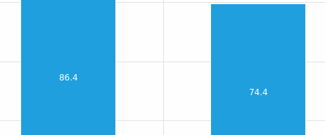
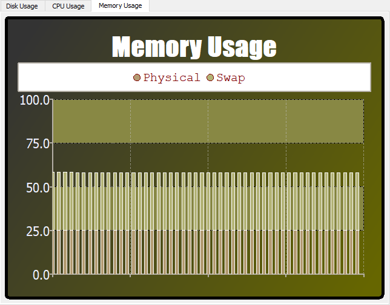

# 第十七章：使用 QtCharts 嵌入数据图

世界充满了数据。从服务器日志到财务记录，传感器遥测到人口普查统计数据，程序员们需要筛选和提取意义的原始数据似乎没有尽头。除此之外，没有什么比一个好的图表或图形更有效地将一组原始数据提炼成有意义的信息。虽然 Python 有一些很棒的图表工具，比如`matplotlib`，PyQt 还提供了自己的`QtCharts`库，这是一个用于构建图表、图形和其他数据可视化的简单工具包。

在本章中，我们将探讨以下主题中使用`QtCharts`进行数据可视化：

+   创建一个简单的图表

+   显示实时数据

+   Qt 图表样式

# 技术要求

除了我们在整本书中一直使用的基本 PyQt 设置之外，您还需要为`QtCharts`库安装 PyQt 支持。这种支持不是默认的 PyQt 安装的一部分，但可以通过 PyPI 轻松安装，如下所示：

```py
$ pip install --user PyQtChart
```

您还需要`psutil`库，可以从 PyPI 安装。我们已经在第十二章中使用过这个库，*使用 QPainter 创建 2D 图形*，所以如果您已经阅读了那一章，那么您应该已经有了它。如果没有，可以使用以下命令轻松安装：

```py
$ pip install --user psutil
```

最后，您可能希望从[`github.com/PacktPublishing/Mastering-GUI-Programming-with-Python/tree/master/Chapter14`](https://github.com/PacktPublishing/Mastering-GUI-Programming-with-Python/tree/master/Chapter14)下载本章的示例代码。

查看以下视频以查看代码的运行情况：[`bit.ly/2M5y67f`](http://bit.ly/2M5y67f)

# 创建一个简单的图表

在第十二章 *使用 QPainter 创建 2D 图形*中，我们使用 Qt 图形框架和`psutil`库创建了一个 CPU 活动图。虽然这种构建图表的方法效果很好，但是创建一个缺乏简单美观性的基本图表需要大量的工作。`QtChart`库也是基于 Qt 图形框架的，但简化了各种功能完备的图表的创建。

为了演示它的工作原理，我们将构建一个更完整的系统监控程序，其中包括几个图表，这些图表是从`psutil`库提供的数据派生出来的。

# 设置 GUI

要开始我们的程序，将 Qt 应用程序模板从第四章 *使用 QMainWindow 构建应用程序*复制到一个名为`system_monitor.py`的新文件中。

在应用程序的顶部，我们需要导入`QtChart`库：

```py
from PyQt5 import QtChart as qtch
```

我们还需要`deque`类和`psutil`库，就像我们在[第十二章](https://cdp.packtpub.com/mastering_gui_programming_with_python/wp-admin/post.php?post=37&action=edit#post_35) *使用 QPainter 创建 2D 图形*中所需要的那样：

```py
from collections import deque
import psutil
```

我们的程序将包含几个图表，每个图表都在自己的选项卡中。因此，我们将在`MainWindow.__init__()`中创建一个选项卡小部件来容纳所有的图表：

```py
        tabs = qtw.QTabWidget()
        self.setCentralWidget(tabs)
```

现在 GUI 的主要框架已经就位，我们将开始创建我们的图表类并将它们添加到 GUI 中。

# 构建磁盘使用情况图

我们将创建的第一个图表是一个条形图，用于显示计算机上每个存储分区使用的磁盘空间。每个检测到的分区都将有一个条形表示其使用空间的百分比。

让我们从为图表创建一个类开始：

```py
class DiskUsageChartView(qtch.QChartView):

    chart_title = 'Disk Usage by Partition'

    def __init__(self):
        super().__init__()
```

该类是从`QtChart.QChartView`类派生的；这个`QGraphicsView`的子类是一个可以显示`QChart`对象的小部件。就像 Qt 图形框架一样，`QtChart`框架也是基于模型-视图设计的。在这种情况下，`QChart`对象类似于`QGraphicsScene`对象，它将附加到`QChartView`对象以进行显示。

让我们创建我们的`QChart`对象，如下所示：

```py
        chart = qtch.QChart(title=self.chart_title)
        self.setChart(chart)
```

`QChart`对象接收一个标题，但是，除此之外，不需要太多的配置；请注意，它也没有说它是条形图。与您可能使用过的其他图表库不同，`QChart`对象不确定我们正在创建什么样的图表。它只是数据图的容器。

实际的图表类型是通过向图表添加一个或多个**系列**对象来确定的。一个系列代表图表上的单个绘制数据集。`QtChart`包含许多系列类，所有这些类都是从`QAbstractSeries`派生的，每个类代表不同类型的图表样式。

其中一些类如下：

| 类 | 图表类型 | 有用于 |
| --- | --- | --- |
| `QLineSeries` | 直线图 | 从连续数据中采样的点 |
| `QSplineSeries` | 线图，但带有曲线 | 从连续数据中采样的点 |
| `QBarSeries` | 条形图 | 按类别比较值 |
| `QStackedBarSeries` | 堆叠条形图 | 按类别比较细分值 |
| `QPieSeries` | 饼图 | 相对百分比 |
| `QScatterSeries` | 散点图 | 点的集合 |

可以在[`doc.qt.io/qt-5/qtcharts-overview.html`](https://doc.qt.io/qt-5/qtcharts-overview.html)找到可用系列类型的完整列表。我们的图表将比较多个分区的磁盘使用百分比，因此在这些选项中使用最合理的系列类型似乎是`QBarSeries`类。每个分区将是一个*类别*，并且将与之关联一个单个值（使用百分比）。

让我们创建`QBarSeries`类，如下：

```py
        series = qtch.QBarSeries()
        chart.addSeries(series)
```

创建系列对象后，我们可以使用`addSeries()`方法将其添加到我们的图表中。从这个方法的名称，您可能会怀疑，我们实际上可以将多个系列添加到图表中，它们不一定都是相同类型的。例如，我们可以在同一个图表中结合条形和线系列。但在我们的情况下，我们只会有一个系列。

要向我们的系列附加数据，我们必须创建一个称为**条形集**的东西：

```py
        bar_set = qtch.QBarSet('Percent Used')
        series.append(bar_set)
```

Qt 条形图旨在显示类别数据，但也允许比较这些类别中的不同数据集。例如，如果您想要比较公司产品在美国各个城市的相对销售成功情况，您可以使用城市作为类别，并为每种产品创建一个条形集。

在我们的情况下，类别将是系统上的分区，我们只有一个数据集要查看每个分区的数据 - 即磁盘使用百分比。

因此，我们将创建一个要附加到我们系列的单个条形集：

```py
        bar_set = qtch.QBarSet('Percent Used')
        series.append(bar_set)
```

`QBarSet`构造函数接受一个参数，表示数据集的标签。这个`QBarSet`对象是我们要附加实际数据的对象。

因此，让我们继续检索数据：

```py
        partitions = []
        for part in psutil.disk_partitions():
            if 'rw' in part.opts.split(','):
                partitions.append(part.device)
                usage = psutil.disk_usage(part.mountpoint)
                bar_set.append(usage.percent)
```

这段代码利用了`pustil`的`disk_partitions()`函数列出系统上所有可写的分区（我们对只读设备不感兴趣，例如光驱，因为它们的使用是无关紧要的）。对于每个分区，我们使用`disk_usage()`函数检索有关磁盘使用情况的命名元组信息。这个元组的`percent`属性包含磁盘使用百分比，因此我们将该值附加到我们的条形集。我们还将分区的设备名称附加到分区列表中。

到目前为止，我们的图表包含一个数据系列，并且可以显示数据的条形。但是，从图表中提取出很多意义将会很困难，因为没有**轴**来标记数据。为了解决这个问题，我们需要创建一对轴对象来表示*x*和*y*轴。

我们将从*x*轴开始，如下：

```py
        x_axis = qtch.QBarCategoryAxis()
        x_axis.append(partitions)
        chart.setAxisX(x_axis)
        series.attachAxis(x_axis)
```

`QtCharts`提供了不同类型的轴对象来处理组织数据的不同方法。我们的*x*轴由类别组成——每个类别代表计算机上找到的一个分区——因此，我们创建了一个`QBarCategoryAxis`对象来表示*x*轴。为了定义使用的类别，我们将一个字符串列表传递给`append()`方法。

重要的是，我们的类别的顺序要与数据附加到条形集的顺序相匹配，因为每个数据点根据其在系列中的位置进行分类。

创建后，轴必须同时附加到图表和系列上；这是因为图表需要了解轴对象，以便能够正确地标记和缩放轴。这是通过将轴对象传递给图表的`setAxisX()`方法来实现的。系列还需要了解轴对象，以便能够为图表正确地缩放绘图，我们通过将其传递给系列对象的`attachAxis()`方法来实现。

我们的*y*轴表示百分比，所以我们需要一个处理`0`到`100`之间的值的轴类型。我们将使用`QValueAxis`对象，如下所示：

```py
        y_axis = qtch.QValueAxis()
        y_axis.setRange(0, 100)
        chart.setAxisY(y_axis)
        series.attachAxis(y_axis)
```

`QValueAxis`表示显示数字值刻度的轴，并允许我们为值设置适当的范围。创建后，我们可以将其附加到图表和系列上。

此时，我们可以在`MainView.__init__()`中创建图表视图对象的实例，并将其添加到选项卡小部件中：

```py
        disk_usage_view = DiskUsageChartView()
        tabs.addTab(disk_usage_view, "Disk Usage")
```

如果此时运行应用程序，您应该会得到分区使用百分比的显示：


您的显示可能会有所不同，这取决于您的操作系统和驱动器配置。前面的图看起来很不错，但我们可以做一个小小的改进，即在我们的条形上实际放置百分比标签，以便读者可以看到精确的数据值。这可以通过在`DiskUsageChartView.__init__()`中添加以下行来完成：

```py
        series.setLabelsVisible(True)
```

现在当我们运行程序时，我们会得到带有标签的条形，如下所示：



嗯，看来这位作者需要一个更大的硬盘了！

# 显示实时数据

现在我们已经看到了创建静态图表有多么容易，让我们来看看创建实时更新图表的过程。基本上，过程是相同的，但是我们需要定期使用新数据更新图表的数据系列。为了演示这一点，让我们制作一个实时 CPU 使用率监视器。

# 构建 CPU 使用率图表

让我们在一个名为`CPUUsageView`的新类中启动我们的 CPU 监视器：

```py
class CPUUsageView(qtch.QChartView):

    num_data_points = 500
    chart_title = "CPU Utilization"

    def __init__(self):
        super().__init__()
        chart = qtch.QChart(title=self.chart_title)
        self.setChart(chart)
```

就像我们在磁盘使用图表中所做的那样，我们基于`QChartView`创建了这个类，并在构造函数中创建了一个`QChart`对象。我们还定义了一个标题，并且，就像我们在第十二章中所做的那样，*使用 QPainter 创建 2D 图形*，配置了一次显示多少个数据点。不过这次我们要显示更多的点，这样我们就可以得到更详细的图表了。

创建图表对象后，下一步是创建系列对象：

```py
        self.series = qtch.QSplineSeries(name="Percentage")
        chart.addSeries(self.series)
```

这次，我们使用`QSplineSeries`对象；我们也可以使用`QLineSeries`，但是样条版本将使用三次样条曲线连接我们的数据点，使外观更加平滑，这类似于我们在第十二章中使用贝塞尔曲线所实现的效果，*使用 QPainter 创建 2D 图形*。

接下来，我们需要使用一些默认数据填充系列对象，如下所示：

```py
        self.data = deque(
            [0] * self.num_data_points, maxlen=self.num_data_points)
        self.series.append([
            qtc.QPoint(x, y)
            for x, y in enumerate(self.data)
        ])
```

我们再次创建一个`deque`对象来存储数据点，并用零填充它。然后，我们通过使用列表推导式从我们的`deque`对象创建一个`QPoint`对象的列表，将这些数据附加到我们的系列中。与`QBarSeries`类不同，数据直接附加到`QSplineSeries`对象；对于基于线的系列，没有类似于`QBarSet`类的东西。

现在我们的系列已经设置好了，让我们来处理轴：

```py
        x_axis = qtch.QValueAxis()
        x_axis.setRange(0, self.num_data_points)
        x_axis.setLabelsVisible(False)
        y_axis = qtch.QValueAxis()
        y_axis.setRange(0, 100)
        chart.setAxisX(x_axis, self.series)
        chart.setAxisY(y_axis, self.series)
```

因为我们的数据主要是(*x*, *y*)坐标，我们的两个轴都是`QValueAxis`对象。然而，我们的*x*轴坐标的值基本上是没有意义的（它只是`deque`对象中 CPU 使用值的索引），因此我们将通过将轴的`labelsVisible`属性设置为`False`来隐藏这些标签。

请注意，这次我们在使用`setAxisX()`和`setAxisY`设置图表的*x*和*y*轴时，将系列对象与轴一起传递。这样做会自动将轴附加到系列上，并为每个轴节省了额外的方法调用。

由于我们在这里使用曲线，我们应该进行一次外观优化：

```py
        self.setRenderHint(qtg.QPainter.Antialiasing)
```

`QChartView`对象的`renderHint`属性可用于激活**抗锯齿**，这将改善样条曲线的平滑度。

我们的图表的基本框架现在已经完成；现在我们需要一种方法来收集数据并更新系列。

# 更新图表数据

更新数据的第一步是创建一个调用`psutil.cpu_percent()`并更新`deque`对象的方法：

```py
    def refresh_stats(self):
        usage = psutil.cpu_percent()
        self.data.append(usage)
```

要更新图表，我们只需要更新系列中的数据。有几种方法可以做到这一点；例如，我们可以完全删除图表中的所有数据，并`append()`新值。

更好的方法是`replace()`值，如下所示：

```py
        new_data = [
            qtc.QPoint(x, y)
            for x, y in enumerate(self.data)]
        self.series.replace(new_data)
```

首先，我们使用列表推导从我们的`deque`对象生成一组新的`QPoint`对象，然后将列表传递给系列对象的`replace()`方法，该方法交换所有数据。这种方法比清除所有数据并重新填充系列要快一些，尽管任何一种方法都可以。

现在我们有了刷新方法，我们只需要定期调用它；回到`__init__()`，让我们添加一个定时器：

```py
        self.timer = qtc.QTimer(
            interval=200, timeout=self.refresh_stats)
        self.timer.start()
```

这个定时器将每 200 毫秒调用`refresh_stats()`，更新系列，因此也更新了图表。

回到`MainView.__init__()`，让我们添加 CPU 图表：

```py
        cpu_view = CPUUsageView()
        tabs.addTab(cpu_view, "CPU Usage")
```

现在，您可以运行应用程序，单击 CPU 使用率选项卡，查看类似于以下图表的图表：


尝试进行一些 CPU 密集型任务，为图表生成一些有趣的数据。

# 在图表周围进行平移和缩放

由于我们的刷新方法每秒调用五次，因此该系列中的数据对于这样一个小图表来说相当详细。这样密集的图表可能是用户希望更详细地探索的内容。为了实现这一功能，我们可以利用`QChart`对象的方法来在图表图像周围进行平移和缩放，并允许用户更好地查看数据。

要为`CPUUsageView`类配置交互控件，我们可以重写`keyPressEvent()`方法，就像我们在第十二章中的游戏中所做的那样，*使用 QPainter 创建 2D 图形*：

```py
    def keyPressEvent(self, event):
        keymap = {
            qtc.Qt.Key_Up: lambda: self.chart().scroll(0, -10),
            qtc.Qt.Key_Down: lambda: self.chart().scroll(0, 10),
            qtc.Qt.Key_Right: lambda: self.chart().scroll(-10, 0),
            qtc.Qt.Key_Left: lambda: self.chart().scroll(10, 0),
            qtc.Qt.Key_Greater: self.chart().zoomIn,
            qtc.Qt.Key_Less: self.chart().zoomOut,
        }
        callback = keymap.get(event.key())
        if callback:
            callback()
```

这段代码与我们在坦克游戏中使用的代码类似——我们创建一个`dict`对象来将键码映射到回调函数，然后检查我们的事件对象，看看是否按下了其中一个映射的键。如果是的话，我们就调用`callback`方法。

我们映射的第一个方法是`QChart.scroll()`。`scroll()`接受*x*和*y*值，并将图表在图表视图中移动相应的量。在这里，我们将箭头键映射到`lambda`函数，以适当地滚动图表。

我们映射的其他方法是`zoomIn()`和`zoomOut()`。它们确切地执行它们的名称所暗示的操作，分别放大或缩小两倍。如果我们想要自定义缩放的量，那么我们可以交替调用`zoom()`方法，该方法接受一个表示缩放因子的浮点值。

如果您现在运行此程序，您应该会发现可以使用箭头键移动图表，并使用尖括号放大或缩小（请记住在大多数键盘上按*Shift*以获得尖括号）。

# Qt 图表样式

Qt 图表默认看起来很好，但让我们面对现实吧——在样式方面，没有人想被困在默认设置中。幸运的是，QtCharts 为我们的可视化组件提供了各种各样的样式选项。

为了探索这些选项，我们将构建第三个图表来显示物理和交换内存使用情况，然后根据我们自己的喜好进行样式化。

# 构建内存图表

我们将像在前面的部分中一样开始这个图表视图对象：

```py
class MemoryChartView(qtch.QChartView):

    chart_title = "Memory Usage"
    num_data_points = 50

    def __init__(self):
        super().__init__()
        chart = qtch.QChart(title=self.chart_title)
        self.setChart(chart)
        series = qtch.QStackedBarSeries()
        chart.addSeries(series)
        self.phys_set = qtch.QBarSet("Physical")
        self.swap_set = qtch.QBarSet("Swap")
        series.append(self.phys_set)
        series.append(self.swap_set)
```

这个类的开始方式与我们的磁盘使用图表类似——通过子类化`QChartView`，定义图表，定义系列，然后定义一些条形集。然而，这一次，我们将使用`QStackedBarSeries`。堆叠条形图与常规条形图类似，只是每个条形集是垂直堆叠而不是并排放置。这种图表对于显示一系列相对百分比很有用，这正是我们要显示的。

在这种情况下，我们将有两个条形集——一个用于物理内存使用，另一个用于交换内存使用，每个都是总内存（物理和交换）的百分比。通过使用堆叠条形图，总内存使用将由条形高度表示，而各个部分将显示该总内存的交换和物理组件。

为了保存我们的数据，我们将再次使用`deque`对象设置默认数据，并将数据附加到条形集中：

```py
        self.data = deque(
            [(0, 0)] * self.num_data_points,
            maxlen=self.num_data_points)
        for phys, swap in self.data:
            self.phys_set.append(phys)
            self.swap_set.append(swap)
```

这一次，`deque`对象中的每个数据点需要有两个值：第一个是物理数据，第二个是交换数据。我们通过使用每个数据点的两元组序列来表示这一点。

下一步，再次是设置我们的轴：

```py
        x_axis = qtch.QValueAxis()
        x_axis.setRange(0, self.num_data_points)
        x_axis.setLabelsVisible(False)
        y_axis = qtch.QValueAxis()
        y_axis.setRange(0, 100)
        chart.setAxisX(x_axis, series)
        chart.setAxisY(y_axis, series)
```

在这里，就像 CPU 使用图表一样，我们的*x*轴只表示数据的无意义索引号，所以我们只是要隐藏标签。另一方面，我们的*y*轴表示一个百分比，所以我们将其范围设置为`0`到`100`。

现在，我们将创建我们的`refresh`方法来更新图表数据：

```py
    def refresh_stats(self):
        phys = psutil.virtual_memory()
        swap = psutil.swap_memory()
        total_mem = phys.total + swap.total
        phys_pct = (phys.used / total_mem) * 100
        swap_pct = (swap.used / total_mem) * 100

        self.data.append(
            (phys_pct, swap_pct))
        for x, (phys, swap) in enumerate(self.data):
            self.phys_set.replace(x, phys)
            self.swap_set.replace(x, swap)
```

`psutil`库有两个函数用于检查内存使用情况：`virtual_memory()`返回有关物理 RAM 的信息；`swap_memory()`返回有关交换文件使用情况的信息。我们正在应用一些基本算术来找出交换和物理内存使用的总内存百分比，然后将这些数据附加到`deque`对象中，并通过迭代来替换条形集中的数据。

最后，我们将在`__init__()`中再次添加我们的定时器来调用刷新方法：

```py
        self.timer = qtc.QTimer(
            interval=1000, timeout=self.refresh_stats)
        self.timer.start()
```

图表视图类现在应该是完全功能的，所以让我们将其添加到`MainWindow`类中并进行测试。

为此，在`MainWindow.__init__()`中添加以下代码：

```py
        cpu_time_view = MemoryChartView()
        tabs.addTab(cpu_time_view, "Memory Usage")
```

如果此时运行程序，应该会有一个每秒更新一次的工作内存使用监视器。这很好，但看起来太像默认设置了；所以，让我们稍微调整一下样式。

# 图表样式

为了给我们的内存图表增添一些个性，让我们回到`MemoryChartView.__init__()`，开始添加代码来样式化图表的各个元素。

我们可以做的最简单但最有趣的改变之一是激活图表的内置动画：

```py
        chart.setAnimationOptions(qtch.QChart.AllAnimations)
```

`QChart`对象的`animationOptions`属性确定图表创建或更新时将运行哪些内置图表动画。选项包括`GridAxisAnimations`，用于动画绘制轴；`SeriesAnimations`，用于动画更新系列数据；`AllAnimations`，我们在这里使用它来激活网格和系列动画；以及`NoAnimations`，你可能猜到了，用于关闭所有动画（当然，这是默认设置）。

如果你现在运行程序，你会看到网格和轴扫过来，并且每个条形从图表底部平滑地弹出。动画本身是预设的每个系列类型；请注意，我们除了设置缓和曲线和持续时间外，无法对其进行自定义：

```py
        chart.setAnimationEasingCurve(
            qtc.QEasingCurve(qtc.QEasingCurve.OutBounce))
        chart.setAnimationDuration(1000)
```

在这里，我们将图表的`animationEasingCurve`属性设置为一个具有*out bounce*缓和曲线的`QtCore.QEasingCurve`对象。我们还将动画时间延长到整整一秒。如果你现在运行程序，你会看到动画会反弹并持续时间稍长。

我们还可以通过启用图表的阴影来进行另一个简单的调整，如下所示：

```py
        chart.setDropShadowEnabled(True)
```

将`dropShadowEnabled`设置为`True`将导致在图表绘图区域周围显示一个阴影，给它一个微妙的 3D 效果。

通过设置图表的`theme`属性，我们可以实现外观上的更明显的变化，如下所示：

```py
        chart.setTheme(qtch.QChart.ChartThemeBrownSand)
```

尽管这被称为图表主题，但它主要影响了绘图所使用的颜色。Qt 5.12 附带了八种图表主题，可以在[`doc.qt.io/qt-5/qchart.html#ChartTheme-enum`](https://doc.qt.io/qt-5/qchart.html#ChartTheme-enum)找到。在这里，我们配置了*Brown Sand*主题，它将使用土地色调来展示我们的数据绘图。

对于我们的堆叠条形图，这意味着堆栈的每个部分将从主题中获得不同的颜色。

我们可以通过设置图表的背景来进行另一个非常显著的改变。这可以通过将`backgroundBrush`属性设置为自定义的`QBrush`对象来实现：

```py
        gradient = qtg.QLinearGradient(
            chart.plotArea().topLeft(), chart.plotArea().bottomRight())
        gradient.setColorAt(0, qtg.QColor("#333"))
        gradient.setColorAt(1, qtg.QColor("#660"))
        chart.setBackgroundBrush(qtg.QBrush(gradient))
```

在这种情况下，我们创建了一个线性渐变，并使用它来创建了一个背景的`QBrush`对象（有关更多讨论，请参阅第六章，*Qt 应用程序的样式*）。

背景也有一个`QPen`对象，用于绘制绘图区域的边框：

```py
        chart.setBackgroundPen(qtg.QPen(qtg.QColor('black'), 5))
```

如果你现在运行程序，可能会发现文字有点难以阅读。不幸的是，没有一种简单的方法可以一次更新图表中所有的文字外观 - 我们需要逐个进行。我们可以从图表的标题文字开始，通过设置`titleBrush`和`titleFont`属性来实现：

```py
        chart.setTitleBrush(
            qtg.QBrush(qtc.Qt.white))
        chart.setTitleFont(qtg.QFont('Impact', 32, qtg.QFont.Bold))
```

修复剩下的文字不能通过`chart`对象完成。为此，我们需要查看如何对图表中的其他对象进行样式设置。

# 修饰轴

图表轴上使用的标签的字体和颜色必须通过我们的轴对象进行设置：

```py
        axis_font = qtg.QFont('Mono', 16)
        axis_brush = qtg.QBrush(qtg.QColor('#EEF'))
        y_axis.setLabelsFont(axis_font)
        y_axis.setLabelsBrush(axis_brush)
```

在这里，我们使用`setLabelsFont()`和`setLabelsBrush()`方法分别设置了*y*轴的字体和颜色。请注意，我们也可以设置*x*轴标签的字体和颜色，但由于我们没有显示*x*标签，所以没有太大意义。

轴对象还可以让我们通过`gridLinePen`属性来设置网格线的样式：

```py
        grid_pen = qtg.QPen(qtg.QColor('silver'))
        grid_pen.setDashPattern([1, 1, 1, 0])
        x_axis.setGridLinePen(grid_pen)
        y_axis.setGridLinePen(grid_pen)
```

在这里，我们设置了一个虚线银色的`QPen`对象来绘制*x*和*y*轴的网格线。顺便说一句，如果你想改变图表上绘制的网格线数量，可以通过设置轴对象的`tickCount`属性来实现：

```py
        y_axis.setTickCount(11)
```

默认的刻度数是`5`，最小值是`2`。请注意，这个数字包括顶部和底部的线，所以为了让网格线每 10%显示一条，我们将轴设置为`11`个刻度。

为了帮助用户区分紧密排列的网格线，我们还可以在轴对象上启用**阴影**：

```py
        y_axis.setShadesVisible(True)
        y_axis.setShadesColor(qtg.QColor('#884'))
```

如你所见，如果你运行应用程序，这会导致网格线之间的每个交替区域根据配置的颜色进行着色，而不是使用默认的背景。

# 修饰图例

在这个图表中我们可能想要修复的最后一件事是**图例**。这是图表中解释哪种颜色对应哪个条形集的部分。图例由`QLegend`对象表示，它会随着我们添加条形集或系列对象而自动创建和更新。

我们可以使用`legend()`访问器方法来检索图表的`QLegend`对象：

```py
        legend = chart.legend()
```

默认情况下，图例没有背景，只是直接绘制在图表背景上。我们可以改变这一点以提高可读性，如下所示：

```py
        legend.setBackgroundVisible(True)
        legend.setBrush(
            qtg.QBrush(qtg.QColor('white')))
```

我们首先通过将`backgroundVisible`设置为`True`来打开背景，然后通过将`brush`属性设置为`QBrush`对象来配置背景的刷子。

文本的颜色和字体也可以进行配置，如下所示：

```py
        legend.setFont(qtg.QFont('Courier', 14))
        legend.setLabelColor(qtc.Qt.darkRed)
```

我们可以使用`setLabelColor()`设置标签颜色，或者使用`setLabelBrush()`方法更精细地控制刷子。

最后，我们可以配置用于指示颜色的标记的形状：

```py
        legend.setMarkerShape(qtch.QLegend.MarkerShapeCircle)
```

这里的选项包括`MarkerShapeCircle`，`MarkerShapeRectangle`和`MarkerShapeFromSeries`，最后一个选择适合正在绘制的系列的形状（例如，线条或样条图的短线，或散点图的点）。

此时，您的内存图表应该看起来像这样：



不错！现在，尝试使用自己的颜色、刷子、笔和字体值，看看您能创造出什么！

# 摘要

在本章中，您学会了如何使用`QtChart`可视化数据。您创建了一个静态表格，一个动画实时表格，以及一个带有自定义颜色和字体的花哨图表。您还学会了如何创建柱状图、堆叠柱状图和样条图。

在下一章中，我们将探讨在树莓派上使用 PyQt 的用法。您将学习如何安装最新版本的 PyQt，以及如何利用树莓派的独特功能将您的 PyQt 应用程序与电路和外部硬件进行接口。

# 问题

尝试这些问题来测试您对本章的了解：

1.  考虑以下数据集的描述。为每个数据集建议一种图表样式：

+   按日期的 Web 服务器点击次数

+   每个销售人员每月的销售数据

+   公司部门过去一年的支持票比例

+   几百株豆类植物的产量与植物高度的图表

1.  以下代码中尚未配置哪个图表组件，结果将是什么？

```py
   data_list = [
       qtc.QPoint(2, 3),
       qtc.QPoint(4, 5),
       qtc.QPoint(6, 7)]
   chart = qtch.QChart()
   series = qtch.QLineSeries()
   series.append(data_list)
   view = qtch.QChartView()
   view.setChart(chart)
   view.show()
```

1.  以下代码有什么问题？

```py
   mainwindow = qtw.QMainWindow()
   chart = qtch.QChart()
   series = qtch.QPieSeries()
   series.append('Half', 50)
   series.append('Other Half', 50)
   mainwindow.setCentralWidget(chart)
   mainwindow.show()
```

1.  您想创建一个柱状图，比较鲍勃和爱丽丝本季度的销售数据。需要添加什么代码？请注意，这里不需要轴：

```py
   bob_sales = [2500, 1300, 800]
   alice_sales = [1700, 1850, 2010]

   chart = qtch.QChart()
   series = qtch.QBarSeries()
   chart.addSeries(series)

   # add code here

   # end code
   view = qtch.QChartView()
   view.setChart(chart)
   view.show()
```

1.  给定一个名为`chart`的`QChart`对象，写一些代码，使图表具有黑色背景和蓝色数据绘图。

1.  使用您为`内存使用情况`图表使用的技术为系统监视器脚本中的另外两个图表设置样式。尝试不同的刷子和笔，看看是否可以找到其他要设置的属性。

1.  `QPolarChart`是`QChart`的一个子类，允许您构建极坐标图。在 Qt 文档中调查极坐标图的使用，并查看是否可以创建一个适当数据集的极坐标图。

1.  `psutil.cpu_percent()`接受一个可选参数`percpu`，它将创建一个显示每个 CPU 核使用信息的值列表。更新您的应用程序以使用此选项，并分别在一个图表上显示每个 CPU 核的活动。

# 进一步阅读

有关更多信息，请参考以下链接：

+   `QtCharts`概述可以在[`doc.qt.io/qt-5/qtcharts-index.html`](https://doc.qt.io/qt-5/qtcharts-index.html)找到

+   `psutil`库的更多文档可以在[`psutil.readthedocs.io/en/latest/`](https://psutil.readthedocs.io/en/latest/)找到

+   加州大学伯克利分校的这篇指南为不同类型的数据选择合适的图表提供了一些指导：[`guides.lib.berkeley.edu/data-visualization/type`](http://guides.lib.berkeley.edu/data-visualization/type)
