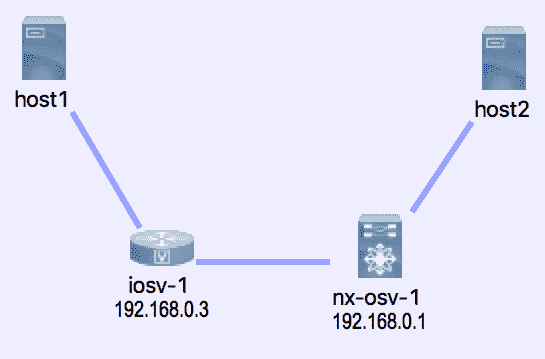
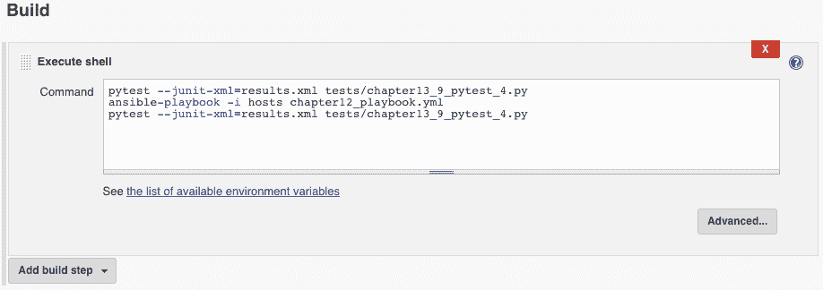
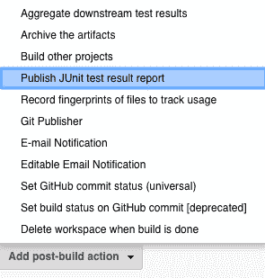
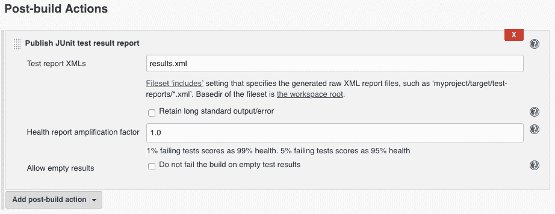
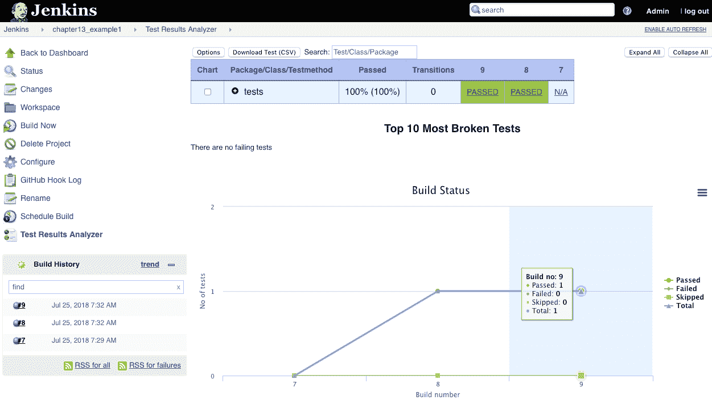
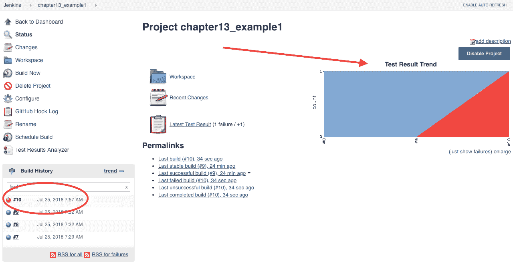

# 十三、网络测试驱动开发

**测试驱动开发**（**TDD**的想法已经存在了一段时间。美国软件工程师肯特·贝克（Kent Beck）和其他人一样，通常被认为是带来并领导了 TDD 运动以及敏捷软件开发的人。敏捷软件开发需要非常短的构建测试部署开发周期；所有的软件需求都转化为测试用例。这些测试用例通常是在编写代码之前编写的，软件代码只有在测试通过时才被接受

同样的想法也可以与网络工程并行不悖。当我们面临设计现代网络的挑战时，我们可以将该过程分解为以下步骤：

*   我们从新网络的总体需求开始。为什么我们需要设计一个新的或新网络的一部分？也许是为了新的服务器硬件、新的存储网络或新的微服务软件体系结构。
*   新需求被分解为更小、更具体的需求。这可以是一个新的交换平台，一个更高效的路由协议，或者一个新的网络拓扑（例如，fat 树）。每个较小的需求都可以分为必备和可选两类。
*   我们制定了测试计划，并根据潜在的候选解决方案对其进行评估。
*   测试计划将以相反的顺序工作；我们将从测试功能开始，然后将新功能集成到更大的拓扑中。最后，我们将尝试在尽可能接近生产环境的情况下运行测试。

关键是，即使我们没有意识到这一点，我们可能已经在网络工程中采用了测试驱动的开发方法。这是我在研究 TDD 心态时发现的一部分。我们已经在隐式地遵循这一最佳实践，而没有对方法进行形式化

通过逐渐将网络的部分作为代码移动，我们可以在网络中更多地使用 TDD。如果我们的网络拓扑是以 XML 或 JSON 的分层格式描述的，那么每个组件都可以正确地映射并以所需的状态表示。这是我们可以编写测试用例的理想状态。例如，如果我们想要的状态需要一个完整的交换机网格，我们总是可以编写一个测试用例来对照我们的生产设备检查它拥有的 BGP 邻居的数量

# 测试驱动开发概述

TDD 的顺序大致基于以下六个步骤：

1.  写一个测试，把结果记在心里
2.  运行所有测试并查看新测试是否失败
3.  编写代码
4.  再次运行测试
5.  如果测试失败，则进行必要的更改
6.  重复

我只是松散地遵循指导原则。TDD 过程要求在编写任何代码之前编写测试用例，或者在我们的实例中，在构建任何网络组件之前编写测试用例。出于个人喜好，我总是喜欢在编写测试用例之前看到工作网络或代码的工作版本。这给了我更高的信心。我也会跳过测试的各个层次；有时我测试网络的一小部分；其他时候，我执行系统级端到端测试，例如 ping 或 traceroute 测试。

关键是，我不相信在测试方面有一种一刀切的方法。这取决于个人偏好和项目范围。这对我共事过的大多数工程师来说都是正确的。记住这个框架是个好主意，因此我们有一个工作蓝图要遵循，但你是你解决问题风格的最佳评判者

# 测试定义

让我们看看 TDD 中常用的一些术语：

*   **单元测试**：检查一小段代码。这是针对单个函数或类运行的测试
*   **集成测试**：检查一个代码库的多个组件；多台机组作为一组进行组合和测试。这可以是针对 Python 模块或多个模块进行检查的测试
*   **系统测试**：端到端检查。这是一个运行与最终用户看到的内容尽可能接近的测试
*   **功能测试**：针对单个功能进行检查
*   **测试覆盖率**：定义为确定我们的测试用例是否覆盖应用程序代码的术语。这通常是通过检查运行测试用例时执行了多少代码来完成的
*   **测试夹具**：形成运行测试基线的固定状态。测试夹具的目的是确保有一个众所周知的固定环境来运行测试，因此测试是可重复的
*   **设置和拆卸**：所有先决步骤都添加到设置中，并在拆卸中进行清理

这些术语似乎非常以软件开发为中心，有些可能与网络工程无关。请记住，这些术语是我们传达概念或步骤的一种方式，我们将在本章的其余部分使用这些术语。随着我们在网络工程环境中更多地使用这些术语，它们可能会变得更加清晰。让我们深入探讨如何将网络拓扑视为代码

# 拓扑作为代码

在我们声明网络太复杂之前，不可能将其总结为代码！让我们保持开放的心态。如果我告诉你我们已经在这本书中使用代码来描述我们的拓扑结构，会有帮助吗？

如果您看一下我们在本书中使用的任何 VIRL 拓扑图，它们只是包含节点之间关系描述的 XML 文件。

在本章中，我们将在实验室中使用以下拓扑：



如果我们用文本编辑器打开拓扑文件`chapter13_topology.virl`，我们将看到该文件是一个描述节点和节点之间关系的 XML 文件。上根级别为`<topology>`节点，其子节点为`<node>`。每个子节点都由各种扩展和条目组成。设备配置也嵌入到文件中：

```py
<?xml version="1.0" encoding="UTF-8" standalone="yes"?>
<topology  xmlns:xsi="http://www.w3.org/2001/XMLSchema-instance" schemaVersion="0.95" xsi:schemaLocation="http://www.cisco.com/VIRL https://raw.github.com/CiscoVIRL/schema/v0.95/virl.xsd">
    <extensions>
        <entry key="management_network" type="String">flat</entry>
    </extensions>
    <node name="iosv-1" type="SIMPLE" subtype="IOSv" location="182,162" ipv4="192.168.0.3">
        <extensions>
            <entry key="static_ip" type="String">172.16.1.20</entry>
            <entry key="config" type="string">! IOS Config generated on 2018-07-24 00:23
! by autonetkit_0.24.0
!
hostname iosv-1
boot-start-marker
boot-end-marker
!
...
    </node>
    <node name="nx-osv-1" type="SIMPLE" subtype="NX-OSv" location="281,161" ipv4="192.168.0.1">
        <extensions>
            <entry key="static_ip" type="String">172.16.1.21</entry>
            <entry key="config" type="string">! NX-OSv Config generated on 2018-07-24 00:23
! by autonetkit_0.24.0
!
version 6.2(1)
license grace-period
!
hostname nx-osv-1

...
<node name="host2" type="SIMPLE" subtype="server" location="347,66">
        <extensions>
            <entry key="static_ip" type="String">172.16.1.23</entry>
            <entry key="config" type="string">#cloud-config
bootcmd:
- ln -s -t /etc/rc.d /etc/rc.local
hostname: host2
manage_etc_hosts: true
runcmd:
- start ttyS0
- systemctl start getty@ttyS0.service
- systemctl start rc-local
    <annotations/>
    <connection dst="/virl:topology/virl:node[1]/virl:interface[1]" src="/virl:topology/virl:node[3]/virl:interface[1]"/>
    <connection dst="/virl:topology/virl:node[2]/virl:interface[1]" src="/virl:topology/virl:node[1]/virl:interface[2]"/>
    <connection dst="/virl:topology/virl:node[4]/virl:interface[1]" src="/virl:topology/virl:node[2]/virl:interface[2]"/>
</topology>
```

通过将网络表示为代码，我们可以为我们的网络声明真相的来源。我们可以编写测试代码，将实际生产值与此蓝图进行比较。我们将使用此拓扑文件作为基础，并将生产网络值与它进行比较。但首先，我们需要从 XML 文件中获取所需的值。在`chapter13_1_xml.py`中，我们将使用`ElementTree`解析`virl`拓扑文件，并构建包含我们设备信息的字典：

```py
#!/usr/env/bin python3

import xml.etree.ElementTree as ET
import pprint

with open('chapter13_topology.virl', 'rt') as f:
    tree = ET.parse(f)

devices = {}

for node in tree.findall('./{http://www.cisco.com/VIRL}node'):
    name = node.attrib.get('name')
    devices[name] = {}
    for attr_name, attr_value in sorted(node.attrib.items()):
        devices[name][attr_name] = attr_value

# Custom attributes
devices['iosv-1']['os'] = '15.6(3)M2'
devices['nx-osv-1']['os'] = '7.3(0)D1(1)'
devices['host1']['os'] = '16.04'
devices['host2']['os'] = '16.04'

pprint.pprint(devices)
```

结果是一个 Python 字典，它根据我们的拓扑文件由设备组成。我们还可以在字典中添加习惯项：

```py
$ python3 chapter13_1_xml.py
{'host1': {'location': '117,58',
           'name': 'host1',
           'os': '16.04',
           'subtype': 'server',
           'type': 'SIMPLE'},
 'host2': {'location': '347,66',
           'name': 'host2',
           'os': '16.04',
           'subtype': 'server',
           'type': 'SIMPLE'},
 'iosv-1': {'ipv4': '192.168.0.3',
            'location': '182,162',
            'name': 'iosv-1',
            'os': '15.6(3)M2',
            'subtype': 'IOSv',
            'type': 'SIMPLE'},
 'nx-osv-1': {'ipv4': '192.168.0.1',
              'location': '281,161',
              'name': 'nx-osv-1',
              'os': '7.3(0)D1(1)',
              'subtype': 'NX-OSv',
              'type': 'SIMPLE'}}
```

我们可以使用[第 3 章](03.html)、*API 和意图驱动网络*、`cisco_nxapi_2.py`中的示例来检索 NX OSv 版本。当我们合并这两个文件时，我们可以比较从拓扑文件接收到的值以及生产设备信息。我们可以使用 Python 内置的`unittest`模块编写测试用例。

We will discuss the `unittest` module later. Feel free to skip ahead and come back to this example if you'd like. 

以下是`chapter13_2_validation.py`中的相关`unittest`部分：

```py
import unittest

# Unittest Test case
class TestNXOSVersion(unittest.TestCase):
    def test_version(self):
        self.assertEqual(nxos_version, devices['nx-osv-1']['os'])

if __name__ == '__main__':
    unittest.main()
```

当我们运行验证测试时，我们可以看到测试通过了，因为生产中的软件版本符合我们的预期：

```py
$ python3 chapter13_2_validation.py
.
----------------------------------------------------------------------
Ran 1 test in 0.000s

OK
```

如果我们手动更改预期的 NX OSv 版本值以引入故障案例，我们将看到以下失败输出：

```py
$ python3 chapter13_3_test_fail.py
F
======================================================================
FAIL: test_version (__main__.TestNXOSVersion)
----------------------------------------------------------------------
Traceback (most recent call last):
 File "chapter13_3_test_fail.py", line 50, in test_version
 self.assertEqual(nxos_version, devices['nx-osv-1']['os'])
AssertionError: '7.3(0)D1(1)' != '7.4(0)D1(1)'
- 7.3(0)D1(1)
? ^
+ 7.4(0)D1(1)
? ^

----------------------------------------------------------------------
Ran 1 test in 0.004s

FAILED (failures=1)
```

我们可以看到，测试用例结果返回为失败；失败的原因是两个值之间的版本不匹配

# Python 的单元测试模块

在前面的示例中，我们看到了如何使用`assertEqual()`方法比较两个值以返回`True`或`False`。下面是一个内置`unittest`模块的示例，用于比较两个值：

```py
$ cat chapter13_4_unittest.py
#!/usr/bin/env python3

import unittest

class SimpleTest(unittest.TestCase):
    def test(self):
        one = 'a'
        two = 'a'
        self.assertEqual(one, two)
```

`unittest`模块通过`python3`命令行界面，可以自动发现脚本中的测试用例：

```py
$ python3 -m unittest chapter13_4_unittest.py
.
----------------------------------------------------------------------
Ran 1 test in 0.000s

OK
```

除了比较两个值外，如果预期值为`True`或`False`，这里还有更多的测试示例。我们还可以在发生故障时生成自定义故障消息：

```py
$ cat chapter13_5_more_unittest.py
#!/usr/bin/env python3
# Examples from https://pymotw.com/3/unittest/index.html#module-unittest

import unittest

class Output(unittest.TestCase):
    def testPass(self):
        return

    def testFail(self):
        self.assertFalse(True, 'this is a failed message')

    def testError(self):
        raise RuntimeError('Test error!')

    def testAssesrtTrue(self):
        self.assertTrue(True)

    def testAssertFalse(self):
        self.assertFalse(False)
```

我们可以使用`-v`选项来显示更详细的输出：

```py
$ python3 -m unittest -v chapter13_5_more_unittest.py
testAssertFalse (chapter13_5_more_unittest.Output) ... ok
testAssesrtTrue (chapter13_5_more_unittest.Output) ... ok
testError (chapter13_5_more_unittest.Output) ... ERROR
testFail (chapter13_5_more_unittest.Output) ... FAIL
testPass (chapter13_5_more_unittest.Output) ... ok

======================================================================
ERROR: testError (chapter13_5_more_unittest.Output)
----------------------------------------------------------------------
Traceback (most recent call last):
 File "/home/echou/Master_Python_Networking_second_edition/Chapter13/chapter13_5_more_unittest.py", line 14, in testError
 raise RuntimeError('Test error!')
RuntimeError: Test error!

======================================================================
FAIL: testFail (chapter13_5_more_unittest.Output)
----------------------------------------------------------------------
Traceback (most recent call last):
 File "/home/echou/Master_Python_Networking_second_edition/Chapter13/chapter13_5_more_unittest.py", line 11, in testFail
 self.assertFalse(True, 'this is a failed message')
AssertionError: True is not false : this is a failed message

----------------------------------------------------------------------
Ran 5 tests in 0.001s

FAILED (failures=1, errors=1)
```

从 Python 3.3 开始，`unittest`模块默认包含`module`对象库（[https://docs.python.org/3/library/unittest.mock.html](https://docs.python.org/3/library/unittest.mock.html) ）。这是一个非常有用的模块，可以对远程资源进行假 HTTP API 调用，而不需要实际进行调用。例如，我们已经看到了使用 NX-API 检索 NX-OS 版本号的示例。如果我们想运行测试，但没有可用的 NX-OS 设备，该怎么办？我们可以使用`unittest`模拟对象

在`chapter13_5_more_unittest_mocks.py`中，我们创建了一个简单的类，该类使用一个方法进行 HTTP API 调用，并期望 JSON 响应：

```py
# Our class making API Call using requests
class MyClass:
    def fetch_json(self, url):
        response = requests.get(url)
        return response.json()
```

我们还创建了一个模拟两个 URL 调用的函数：

```py
# This method will be used by the mock to replace requests.get
def mocked_requests_get(*args, **kwargs):
    class MockResponse:
        def __init__(self, json_data, status_code):
            self.json_data = json_data
            self.status_code = status_code

        def json(self):
            return self.json_data

    if args[0] == 'http://url-1.com/test.json':
        return MockResponse({"key1": "value1"}, 200)
    elif args[0] == 'http://url-2.com/test.json':
        return MockResponse({"key2": "value2"}, 200)

    return MockResponse(None, 404)
```

最后，我们对测试用例中的两个 URL 进行 API 调用。但是，我们正在使用`mock.patch`装饰器拦截 API 调用：

```py
# Our test case class
class MyClassTestCase(unittest.TestCase):
    # We patch 'requests.get' with our own method. The mock object is passed in to our test case method.
    @mock.patch('requests.get', side_effect=mocked_requests_get)
    def test_fetch(self, mock_get):
        # Assert requests.get calls
        my_class = MyClass()
        # call to url-1
        json_data = my_class.fetch_json('http://url-1.com/test.json')
        self.assertEqual(json_data, {"key1": "value1"})
        # call to url-2
        json_data = my_class.fetch_json('http://url-2.com/test.json')
        self.assertEqual(json_data, {"key2": "value2"})
        # call to url-3 that we did not mock
        json_data = my_class.fetch_json('http://url-3.com/test.json')
        self.assertIsNone(json_data)

if __name__ == '__main__':
    unittest.main()
```

当我们运行测试时，我们将看到测试通过，而不需要对远程端点进行实际的 API 调用：

```py
$ python3 -m unittest -v chapter13_5_more_unittest_mocks.py
test_fetch (chapter13_5_more_unittest_mocks.MyClassTestCase) ... ok

----------------------------------------------------------------------
Ran 1 test in 0.001s

OK
```

有关`unittest`模块的更多信息，请参阅 Doug Hellmann 的本周 Python 模块（[https://pymotw.com/3/unittest/index.html#module-unittest](https://pymotw.com/3/unittest/index.html#module-unittest)是`unittest`模块上简短而精确的示例的优秀来源。与往常一样，Python 文档也是一个很好的信息源：[https://docs.python.org/3/library/unittest.html](https://docs.python.org/3/library/unittest.html)

# 更多关于 Python 测试的信息

除了内置的`unittest`库之外，社区中还有很多其他 Python 测试框架。Pytest 是另一个健壮的 Python 测试框架，值得一看。`pytest`可用于所有类型和级别的软件测试。它可以被开发人员、QA 工程师、实践测试驱动开发的个人和开源项目使用。许多大型开源项目已经从`unittest`或`nose`切换到`pytest`，包括 Mozilla 和 Dropbox。`pytest`的主要吸引人的特性是第三方插件模型、简单的夹具模型和断言重写

If you want to learn more about the `pytest` framework, I would highly recommend *Python Testing with PyTest* by Brian Okken (ISBN 978-1-68050-240-4). Another great source is the `pytest` documentation: [https://docs.pytest.org/en/latest/](https://docs.pytest.org/en/latest/).  

`pytest`为命令行驱动；它可以找到我们自动编写的测试并运行它们：

```py
$ sudo pip install pytest
$ sudo pip3 install pytest
$ python3
Python 3.5.2 (default, Nov 23 2017, 16:37:01)
[GCC 5.4.0 20160609] on linux
Type "help", "copyright", "credits" or "license" for more information.
>>> import pytest
>>> pytest.__version__
'3.6.3'
```

让我们看一些使用`pytest`的例子

# pytest 示例

第一个`pytest`示例是两个值的简单断言：

```py
$ cat chapter13_6_pytest_1.py
#!/usr/bin/env python3

def test_passing():
    assert(1, 2, 3) == (1, 2, 3)

def test_failing():
    assert(1, 2, 3) == (3, 2, 1)
```

当您使用`-v`选项运行时，`pytest`将为我们提供一个关于故障原因的非常可靠的答案：

```py
$ pytest -v chapter13_6_pytest_1.py
============================== test session starts ===============================
platform linux -- Python 3.5.2, pytest-3.6.3, py-1.5.4, pluggy-0.6.0 -- /usr/bin/python3
cachedir: .pytest_cache
rootdir: /home/echou/Master_Python_Networking_second_edition/Chapter13, inifile:
collected 2 items

chapter13_6_pytest_1.py::test_passing PASSED [ 50%]
chapter13_6_pytest_1.py::test_failing FAILED [100%]

==================================== FAILURES ====================================
__________________________________ test_failing __________________________________

 def test_failing():
> assert(1, 2, 3) == (3, 2, 1)
E assert (1, 2, 3) == (3, 2, 1)
E At index 0 diff: 1 != 3
E Full diff:
E - (1, 2, 3)
E ? ^ ^
E + (3, 2, 1)
E ? ^ ^

chapter13_6_pytest_1.py:7: AssertionError
======================= 1 failed, 1 passed in 0.03 seconds =======================
```

在第二个示例中，我们将创建一个`router`对象。`router`对象将使用`None`中的一些值和一些默认值启动。我们将使用`pytest`测试一个有默认值的实例，一个没有默认值的实例：

```py
$ cat chapter13_7_pytest_2.py
#!/usr/bin/env python3

class router(object):
    def __init__(self, hostname=None, os=None, device_type='cisco_ios'):
        self.hostname = hostname
        self.os = os
        self.device_type = device_type
        self.interfaces = 24

def test_defaults():
    r1 = router()
    assert r1.hostname == None
    assert r1.os == None
    assert r1.device_type == 'cisco_ios'
    assert r1.interfaces == 24

def test_non_defaults():
    r2 = router(hostname='lax-r2', os='nxos', device_type='cisco_nxos')
    assert r2.hostname == 'lax-r2'
    assert r2.os == 'nxos'
    assert r2.device_type == 'cisco_nxos'
    assert r2.interfaces == 24
```

当我们运行测试时，我们将看到是否使用默认值准确应用了实例：

```py
$ pytest chapter13_7_pytest_2.py
============================== test session starts ===============================
platform linux -- Python 3.5.2, pytest-3.6.3, py-1.5.4, pluggy-0.6.0
rootdir: /home/echou/Master_Python_Networking_second_edition/Chapter13, inifile:
collected 2 items

chapter13_7_pytest_2.py .. [100%]

============================ 2 passed in 0.04 seconds ============================
```

如果我们将前面的`unittest`示例替换为`pytest`，在`chapter13_8_pytest_3.py`中我们将有一个简单的测试用例：

```py
# pytest test case
def test_version():
    assert devices['nx-osv-1']['os'] == nxos_version
```

然后我们使用`pytest`命令行运行测试：

```py
$ pytest chapter13_8_pytest_3.py
============================== test session starts ===============================
platform linux -- Python 3.5.2, pytest-3.6.3, py-1.5.4, pluggy-0.6.0
rootdir: /home/echou/Master_Python_Networking_second_edition/Chapter13, inifile:
collected 1 item

chapter13_8_pytest_3.py . [100%]

============================ 1 passed in 0.19 seconds ============================
```

如果我们为自己编写测试，我们可以自由选择任何模块。在`unittest`和`pytest`之间，我发现`pytest`是一个更直观的工具。然而，由于`unittest`包含在标准库中，许多团队可能会倾向于使用`unittest`模块进行测试

# 编写网络测试

到目前为止，我们主要是为 Python 代码编写测试。我们使用了`unittest`和`pytest`库来断言`True/False`和`equal/Non-equal`值。我们还能够编写 mock 来拦截我们的 API 调用，当我们没有真正支持 API 的设备，但仍然希望运行我们的测试时

A few years ago, Matt Oswalt announced the **Testing On Demand: Distributed** (**ToDD**) validation tool for network changes. It is an open source framework aimed at testing network connectivity and distributed capacity. You can find more information about the project on its GitHub page: [https://github.com/toddproject/todd](https://github.com/toddproject/todd). Oswalt also talked about the project on this Packet Pushers Priority Queue 81, Network Testing with ToDD: [https://packetpushers.net/podcast/podcasts/pq-show-81-network-testing-todd/](https://packetpushers.net/podcast/podcasts/pq-show-81-network-testing-todd/). 

在本节中，让我们看看如何编写与网络世界相关的测试。在网络监控和测试方面，商业产品并不短缺。这些年来，我遇到过很多这样的人。然而，在本节中，我更喜欢使用简单的开源工具进行测试

# 可达性测试

通常，故障排除的第一步是进行小型可达性测试。对于网络工程师来说，`ping`是我们在网络可达性测试方面最好的朋友。这是一种通过网络向目的地发送一个小数据包来测试 IP 网络上主机的可达性的方法

我们可以通过`OS`模块或`subprocess`模块自动进行`ping`测试：

```py
>>> import os
>>> host_list = ['www.cisco.com', 'www.google.com']
>>> for host in host_list:
...     os.system('ping -c 1 ' + host)
...
PING e2867.dsca.akamaiedge.net (69.192.206.157) 56(84) bytes of data.
64 bytes from a69-192-206-157.deploy.static.akamaitechnologies.com (69.192.206.157): icmp_seq=1 ttl=54 time=14.7 ms

--- e2867.dsca.akamaiedge.net ping statistics ---
1 packets transmitted, 1 received, 0% packet loss, time 0ms
rtt min/avg/max/mdev = 14.781/14.781/14.781/0.000 ms
0
PING www.google.com (172.217.3.196) 56(84) bytes of data.
64 bytes from sea15s12-in-f196.1e100.net (172.217.3.196): icmp_seq=1 ttl=54 time=12.8 ms

--- www.google.com ping statistics ---
1 packets transmitted, 1 received, 0% packet loss, time 0ms
rtt min/avg/max/mdev = 12.809/12.809/12.809/0.000 ms
0
>>>
```

`subprocess`模块提供了恢复输出的额外好处：

```py
>>> import subprocess
>>> for host in host_list:
...     print('host: ' + host)
...     p = subprocess.Popen(['ping', '-c', '1', host], stdout=subprocess.PIPE)
...     print(p.communicate())
...
host: www.cisco.com
(b'PING e2867.dsca.akamaiedge.net (69.192.206.157) 56(84) bytes of data.\n64 bytes from a69-192-206-157.deploy.static.akamaitechnologies.com (69.192.206.157): icmp_seq=1 ttl=54 time=14.3 ms\n\n--- e2867.dsca.akamaiedge.net ping statistics ---\n1 packets transmitted, 1 received, 0% packet loss, time 0ms\nrtt min/avg/max/mdev = 14.317/14.317/14.317/0.000 ms\n', None)
host: www.google.com
(b'PING www.google.com (216.58.193.68) 56(84) bytes of data.\n64 bytes from sea15s07-in-f68.1e100.net (216.58.193.68): icmp_seq=1 ttl=54 time=15.6 ms\n\n--- www.google.com ping statistics ---\n1 packets transmitted, 1 received, 0% packet loss, time 0ms\nrtt min/avg/max/mdev = 15.695/15.695/15.695/0.000 ms\n', None)
>>>
```

这两个模块在许多情况下都非常有用。我们可以在 Linux 和 Unix 环境中执行的任何命令都可以通过`OS`或`subprocess`模块执行

# 网络延迟测试

网络延迟的话题有时是主观的。作为一名网络工程师，我们经常遇到用户说网络速度慢。然而，慢是一个非常主观的术语。如果我们能够构建将主观术语转化为客观值的测试，这将非常有帮助。我们应该始终如一地这样做，以便我们能够比较数据时间序列上的值

这有时很难做到，因为网络在设计上是无状态的。仅仅因为一个数据包成功并不保证下一个数据包成功。多年来我所看到的最好的方法就是频繁地在多台主机上使用 ping，并记录数据，生成 ping 网格图。我们可以利用上一个示例中使用的相同工具，捕获返回结果时间，并保留记录：

```py
$ cat chapter13_10_ping.py
#!/usr/bin/env python3

import subprocess

host_list = ['www.cisco.com', 'www.google.com']

ping_time = []

for host in host_list:
    p = subprocess.Popen(['ping', '-c', '1', host], stdout=subprocess.PIPE)
    result = p.communicate()[0]
    host = result.split()[1]
    time = result.split()[14]
    ping_time.append((host, time))

print(ping_time)
```

在这种情况下，结果保存在元组中并放入列表：

```py
$ python3 chapter13_10_ping.py
[(b'e2867.dsca.akamaiedge.net', b'time=13.8'), (b'www.google.com', b'time=14.8')]
```

这决不是完美的，只是监控和故障排除的起点。然而，在缺乏其他工具的情况下，这提供了一些客观价值的基线

# 安全测试

我们已经在[第 6 章](06.html)中看到了最好的安全测试工具，在我看来，*使用 Python 的网络安全*和 Scapy。有很多用于安全性的开源工具，但没有一个能够提供构建数据包所带来的灵活性

另一个伟大的网络安全测试工具是`hping3`（[http://www.hping.org/](http://www.hping.org/) 。它提供了一种一次生成大量数据包的简单方法。例如，您可以使用以下一个线性程序生成 TCP Syn 洪水：

```py
# DON'T DO THIS IN PRODUCTION #
echou@ubuntu:/var/log$ sudo hping3 -S -p 80 --flood 192.168.1.202
HPING 192.168.1.202 (eth0 192.168.1.202): S set, 40 headers + 0 data bytes
hping in flood mode, no replies will be shown
^C
--- 192.168.1.202 hping statistic ---
2281304 packets transmitted, 0 packets received, 100% packet loss
round-trip min/avg/max = 0.0/0.0/0.0 ms
echou@ubuntu:/var/log$
```

同样，由于这是一个命令行工具，我们可以使用`subprocess`模块来自动化我们想要的任何`hping3`测试

# 交易测试

网络是基础设施的关键部分，但它只是基础设施的一部分。用户关心的往往是在网络上运行的服务。如果用户试图观看 YouTube 视频或收听播客，但在他们看来无法观看，则服务已中断。我们可能知道这不是网络传输，但这并不能让用户感到舒适

因此，我们应该实现尽可能类似于用户体验的测试。在 YouTube 视频的例子中，我们可能无法 100%复制 YouTube 体验（除非你是 Google 的一部分），但我们可以在尽可能靠近网络边缘的地方实施第七层服务。然后，我们可以定期模拟来自客户机的事务，作为事务测试

Python`HTTP`标准库模块是我需要在 web 服务上快速测试第七层可达性时经常使用的模块：

```py
# Python 2
$ python -m SimpleHTTPServer 8080
Serving HTTP on 0.0.0.0 port 8080 ...
127.0.0.1 - - [25/Jul/2018 10:14:39] "GET / HTTP/1.1" 200 -

# Python 3 
$ python3 -m http.server 8080
Serving HTTP on 0.0.0.0 port 8080 ...
127.0.0.1 - - [25/Jul/2018 10:15:23] "GET / HTTP/1.1" 200 -
```

如果我们可以为预期的服务模拟一个完整的事务，那就更好了。但是标准库中的 Python simple`HTTP`服务器模块对于运行一些特定 web 服务测试来说总是一个很好的模块

# 网络配置测试

在我看来，网络配置的最佳测试是使用标准化模板生成配置并经常备份生产配置。我们已经了解了如何使用 Jinja2 模板来标准化每个设备类型或角色的配置。这将消除许多由人为错误引起的错误，例如复制和粘贴

一旦生成了配置，我们就可以在将配置推送到生产设备之前针对已知特性编写测试。例如，当涉及环回 IP 时，所有网络中的 IP 地址都不应该重叠，因此我们可以编写一个测试，以查看新配置是否包含跨设备唯一的环回 IP

# Ansible 测试

在我使用 Ansible 的时间里，我不记得使用了类似于`unittest`的工具来测试剧本。在大多数情况下，剧本都使用了模块开发人员测试过的模块

Ansible 为他们的模块库提供单元测试。Ansible 中的单元测试目前是在 Ansible 的持续集成过程中驱动 Python 测试的唯一方法。今天运行的单元测试可以在`/test/units`（[下找到 https://github.com/ansible/ansible/tree/devel/test/units](https://github.com/ansible/ansible/tree/devel/test/units) 。

Ansible 测试策略可在以下文件中找到：

*   **测试应答**：[https://docs.ansible.com/ansible/2.5/dev_guide/testing.html](https://docs.ansible.com/ansible/2.5/dev_guide/testing.html)
*   **单元测试**：[https://docs.ansible.com/ansible/2.5/dev_guide/testing_units.html](https://docs.ansible.com/ansible/2.5/dev_guide/testing_units.html)
*   **单元测试可扩展模块**：[https://docs.ansible.com/ansible/2.5/dev_guide/testing_units_modules.html](https://docs.ansible.com/ansible/2.5/dev_guide/testing_units_modules.html)

一个有趣的 Ansible 测试框架是**分子**（[https://pypi.org/project/molecule/2.16.0/](https://pypi.org/project/molecule/2.16.0/) ）。它旨在帮助 Ansible 角色的开发和测试。Molecular 支持使用多个实例、操作系统和发行版进行测试。我没有使用过这个工具，但是如果我想对我的 Ansible 角色进行更多的测试，我会从这个工具开始

# Jenkins 的皮特斯特

**持续集成**（**CI**）系统，如 Jenkins，经常用于在每个代码提交后启动测试。这是使用 CI 系统的主要好处之一。想象一下，有一个无形的工程师，他总是在关注网络中的任何变化；在检测到变化后，工程师将忠实地测试一系列功能，以确保没有任何中断。谁不想那样

让我们来看一个将`pytest`集成到 Jenkins 任务中的示例

# Jenkins 积分

在我们可以将测试用例插入到我们的持续集成中之前，让我们安装一些插件来帮助我们可视化操作。我们将安装的两个插件是 build name setter 和 Test Result Analyzer：


Jenkins plugin installation

我们将运行的测试将访问 NXOS 设备并检索操作系统版本号。这将确保我们可以访问 Nexus 设备的 API。全文内容可在`chapter13_9_pytest_4.py`相关`pytest`部分阅读，结果如下：

```py
def test_transaction():
     assert nxos_version != False

## Test Output
$ pytest chapter13_9_pytest_4.py
============================== test session starts ===============================
platform linux -- Python 3.5.2, pytest-3.6.3, py-1.5.4, pluggy-0.6.0
rootdir: /home/echou/Chapter13, inifile:
collected 1 item

chapter13_9_pytest_4.py . [100%]

============================ 1 passed in 0.13 seconds ============================
```

我们将使用`--junit-xml=results.xml`选项生成 Jenkins 需要的文件：

```py
$ pytest --junit-xml=results.xml chapter13_9_pytest_4.py
$ cat results.xml
<?xml version="1.0" encoding="utf-8"?><testsuite errors="0" failures="0" name="pytest" skips="0" tests="1" time="0.134"><testcase classname="chapter13_9_pytest_4" file="chapter13_9_pytest_4.py" line="25" name="test_transaction" time="0.0009090900421142578"></testcase></testsuite>
```

下一步是将此脚本签入 GitHub 存储库。我更喜欢把测试放在它的目录下。因此，我创建了一个`/test`目录，并将测试文件放在那里：


Project repository

我们将创建一个名为`chapter13_example1`的新项目：


Chapter 13 example 1

我们可以复制上一个任务，因此不需要重复所有步骤：


Copy task from chapter 12 example 2

在执行 shell 部分，我们将添加`pytest`步骤：



Project execute shell

我们将添加发布 JUnit 测试结果报告的构建后步骤：



Post-build step

我们将指定`results.xml`文件作为 JUnit 结果文件：



Test report XML location

运行构建几次后，我们将能够看到测试结果分析器图形：



Test result analyzer

测试结果也可以在项目主页上看到。让我们通过关闭 Nexus 设备的管理接口来引入测试失败。如果出现测试失败，我们将能够立即在项目仪表板上的测试结果趋势图上看到它：



Test result trend

这是一个简单但完整的示例。有很多方法可以将测试集成到 Jenkins 中

# 总结

在本章中，我们介绍了测试驱动开发以及如何将其应用于网络工程。我们从 TDD 的概述开始；然后我们看了使用`unittest`和`pytest`Python 模块的示例。Python 和简单的 Linux 命令行工具可用于构建各种网络可达性、配置和安全性测试

我们还研究了如何利用 Jenkins（一种持续集成工具）中的测试。通过将测试集成到 CI 工具中，我们可以对更改的合理性获得更多信心。至少，我们希望在用户之前发现任何错误

简单地说，如果没有测试，它就不可信。我们网络中的一切都应该尽可能地通过编程进行测试。与许多软件概念一样，测试驱动开发是一个永无止境的服务轮。我们力求尽可能多的测试覆盖率，但即使在 100%的测试覆盖率下，我们也总能找到新的方法和测试用例来实现。在网络中尤其如此，网络通常是互联网，互联网的 100%测试覆盖率是不可能的