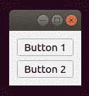
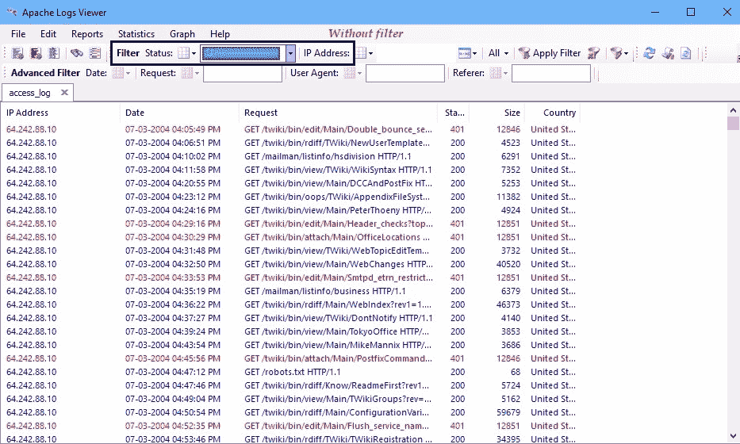
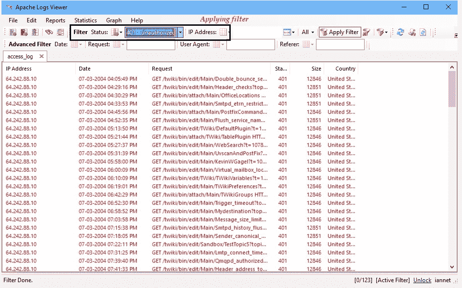

# 第十三章：构建图形用户界面

在本章中，您将学习**图形用户界面**（**GUI**）开发。有各种 Python 库可用于创建 GUI。我们将学习 PyQt5 Python 库用于 GUI 创建。

在本章中，您将学习以下主题：

+   GUI 简介

+   使用库创建基于 GUI 的应用程序

+   安装和使用 Apache Log Viewer 应用程序

# GUI 简介

在本节中，我们将学习 GUI。Python 有各种 GUI 框架。在本节中，我们将看看 PyQt5。PyQt5 具有不同的图形组件，也称为对象小部件，可以显示在屏幕上并与用户交互。以下是这些组件的列表：

+   **PyQt5 窗口**：PyQt5 窗口将创建一个简单的应用程序窗口。

+   **PyQt5 按钮**：PyQt5 按钮是一个在点击时会引发动作的按钮。

+   **PyQt5 文本框**：PyQt5 文本框小部件允许用户输入文本。

+   **PyQt5 标签**：PyQt5 标签小部件显示单行文本或图像。

+   **PyQt5 组合框**：PyQt5 组合框小部件是一个组合按钮和弹出列表。

+   **PyQt5 复选框**：PyQt5 复选框小部件是一个可以选中和取消选中的选项按钮。

+   **PyQt5 单选按钮**：PyQt5 单选按钮小部件是一个可以选中或取消选中的选项按钮。在一组单选按钮中，只能同时选中一个按钮。

+   **PyQt5 消息框**：PyQt5 消息框小部件显示一条消息。

+   **PyQt5 菜单**：PyQt5 菜单小部件提供显示的不同选择。

+   **PyQt5 表格**：PyQt5 表格小部件为应用程序提供标准表格显示功能，可以构建具有多行和列的表格。

+   **PyQt5 信号/槽**：信号将让您对发生的事件做出反应，而槽只是在信号发生时调用的函数。

+   **PyQt5 布局**：PyQt5 布局由多个小部件组成。

有几个 PyQt5 类可用，分为不同的模块。这些模块在这里列出：

+   `QtGui`：`QtGui`包含用于事件处理、图形、字体、文本和基本图像的类。

+   `QtWidgets`：`QtWidgets`包含用于创建桌面样式用户界面的类。

+   `QtCore`：`QtCore`包含核心非 GUI 功能，如时间、目录、文件、流、URL、数据类型、线程和进程。

+   `QtBluetooth`：`QtBluetooth`包含用于连接设备和与其交互的类。

+   `QtPositioning`：`QtPositioning`包含用于确定位置的类。

+   `QtMultimedia`：`QtMultimedia`包含用于 API 和多媒体内容的类。

+   `QtNetwork`：`QtNetwork`包含用于网络编程的类。

+   `QtWebKit`：`QtWebkit`包含用于 Web 浏览器实现的类。

+   `QtXml`：`QtXml`包含用于 XML 文件的类。

+   `QtSql`：`QtSql`包含用于数据库的类。

GUI 由事件驱动。现在，什么是事件？事件是指示程序中发生了某些事情的信号，例如菜单选择、鼠标移动或按钮点击。事件由函数处理，并在用户对对象执行某些操作时触发。监听器将监听事件，然后在事件发生时调用事件处理程序。

# 使用库创建基于 GUI 的应用程序

现在，我们实际上将使用 PyQt5 库创建一个简单的 GUI 应用程序。在本节中，我们将创建一个简单的窗口。在该窗口中，我们将有一个按钮和一个标签。单击该按钮后，标签中将打印一些消息。

首先，我们将看看如何创建按钮小部件。以下行将创建一个按钮小部件：

```py
            b = QPushButton('Click', self)
```

现在，我们将看看如何创建标签。以下行将创建一个标签：

```py
 l = QLabel(self)
```

现在，我们将看到如何创建按钮和标签，以及如何在点击按钮后执行操作。为此，创建一个`print_message.py`脚本，并在其中编写以下代码：

```py
import sys from PyQt5.QtWidgets import QApplication, QLabel, QPushButton, QWidget from PyQt5.QtCore import pyqtSlot from PyQt5.QtGui import QIcon class simple_app(QWidget):
 def __init__(self): super().__init__() self.title = 'Main app window' self.left = 20 self.top = 20 self.height = 300 self.width = 400 self.app_initialize() def app_initialize(self): self.setWindowTitle(self.title) self.setGeometry(self.left, self.top, self.height, self.width) b = QPushButton('Click', self) b.setToolTip('Click on the button !!') b.move(100,70) self.l = QLabel(self) self.l.resize(100,50) self.l.move(100,200) b.clicked.connect(self.on_click) self.show() @pyqtSlot() def on_click(self):self.l.setText("Hello World") if __name__ == '__main__':
 appl = QApplication(sys.argv) ex = simple_app() sys.exit(appl.exec_())
```

运行脚本，您将得到以下输出：

```py
student@ubuntu:~/gui_example$ python3 print_message.py
```


在上面的例子中，我们导入了必要的 PyQt5 模块。然后，我们创建了应用程序。`QPushButton`创建了小部件，我们输入的第一个参数是将在按钮上打印的文本。接下来，我们有一个`QLabel`小部件，我们在上面打印一条消息，当我们点击按钮时将打印出来。接下来，我们创建了一个`on_click()`函数，它将在点击按钮后执行打印操作。`on_click()`是我们创建的槽。

现在，我们将看到一个框布局的示例。为此，创建一个`box_layout.py`脚本，并在其中编写以下代码：

```py
from PyQt5.QtWidgets import QApplication, QWidget, QPushButton, QVBoxLayout appl = QApplication([]) make_window = QWidget() layout = QVBoxLayout() layout.addWidget(QPushButton('Button 1')) layout.addWidget(QPushButton('Button 2')) make_window.setLayout(l) make_window.show() appl.exec_()
```

运行脚本，您将得到以下输出：

```py
student@ubuntu:~/gui_example$ python3 box_layout.py
```



在上面的例子中，我们创建了一个框布局。在其中，我们放置了两个按钮。这个脚本只是为了解释框布局。`l = QVBoxLayout()`将创建一个框布局。

# 安装和使用 Apache 日志查看器应用程序

由于我们已经有了 Apache 日志查看器应用程序，请从以下链接下载 Apache 日志查看器应用程序：[`www.apacheviewer.com/download/`](https://www.apacheviewer.com/download/)

下载后，在您的计算机上安装该应用程序。该应用程序可用于根据其连接状态、IP 地址等分析日志文件。因此，要分析日志文件，我们可以简单地浏览访问日志文件或错误日志文件。获得文件后，我们对日志文件应用不同的操作，例如应用筛选器，例如仅对`access.log`中的未成功连接进行排序，或者按特定 IP 地址进行筛选。

以下截图显示了 Apache 日志查看器与`access.log`文件，没有应用筛选器：



以下截图显示了应用筛选器后的 Apache 日志查看器与`access.log`文件：



在第一种情况下，我们取得了访问日志文件，并在 Apache 日志查看器中打开了它。我们可以很容易地看到，在 Apache 日志查看器中打开的访问文件包含各种条目，如授权和未授权的，以及它们的状态、IP 地址、请求等。然而，在第二种情况下，我们对访问日志文件应用了筛选器，以便只能看到未经授权请求的日志条目，如截图所示。

# 摘要

在本节中，我们学习了 GUI。我们学习了 GUI 中使用的组件。我们学习了 Python 中的 PyQt5 模块。使用 PyQt5 模块，我们创建了一个简单的应用程序，在点击按钮后将在标签中打印一条消息。

在下一章中，您将学习如何处理 Apache 日志文件。

# 问题

1.  什么是 GUI？

1.  Python 中的构造函数和析构函数是什么？

1.  `self`的用途是什么？

1.  比较 Tkinter、PyQt 和 wxPython。

1.  创建一个 Python 程序，将一个文件的内容复制到另一个文件中

1.  创建一个 Python 程序，读取文本文件并计算文本文件中某个字母出现的次数。

# 进一步阅读

+   Tkinter GUI 文档：[`docs.python.org/3/library/tk.html`](https://docs.python.org/3/library/tk.html)

+   PyQt GUI 文档：[`wiki.python.org/moin/PyQt`](https://wiki.python.org/moin/PyQt)
