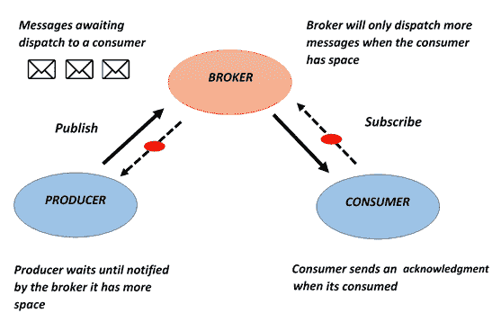
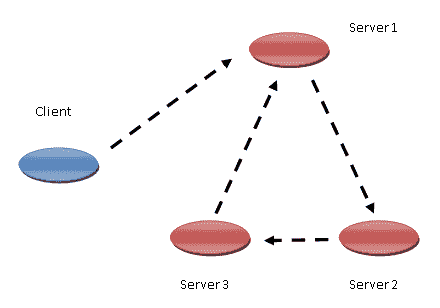

# 六、分布式 Python

本章将介绍一些用于分布式计算的重要 Python 模块。特别是，我们将描述`socket`模块，它允许您实现通过客户机-服务器模型分发的简单应用程序。

然后，我们将介绍芹菜模块，它是一个用于管理分布式任务的强大 Python 框架。最后，我们将描述`Pyro4`模块，它允许您调用在不同进程中使用的方法，可能在不同的机器上使用。

在本章中，我们将介绍以下配方：

*   介绍分布式计算
*   使用 Python 套接字模块
*   芹菜分布式任务管理
*   使用`Pyro4`的远程方法调用（RMI）

# 介绍分布式计算

*并行*和*分布式计算*是旨在增加特定任务可用处理能力的类似技术。通常，这些方法用于解决需要大量计算能力的问题。

当问题被分成许多小块时，问题的各个部分可以由多个处理器同时计算。这允许对问题使用比单个处理器所能提供的更多的处理能力。

并行处理和分布式处理之间的主要区别在于，并行配置包括单个系统中的多个处理器，而分布式配置同时利用多台计算机的处理能力。

让我们看看其他的区别：

| **并行处理** | **分布式处理** |
| 并行处理的优点是以极低的延迟提供可靠的处理能力。 | 分布式处理在逐个处理器的基础上不是非常高效，因为数据必须通过网络传输，而不是通过单个系统的内部连接。 |
| 通过将所有处理能力集中在一个系统中，数据传输造成的速度损失最小化。 | 每个处理器的处理能力比并行系统中的任何处理器都要小得多，因为数据传输造成了限制处理能力的瓶颈。 |
| 唯一的实际限制是系统中包含的处理器数量。 | 由于分布式系统中的处理器数量没有实际上限，因此该系统几乎可以无限扩展。 |

然而，在计算机应用环境中，通常要区分本地架构和分布式架构：

| **本地架构** | **分布式架构** |
| 所有部件都在同一台机器上。 | 应用程序和组件可以驻留在通过网络连接的不同节点上。 |

使用分布式计算的优点主要包括程序的并发使用、数据的集中和处理负载的分配，这些都是以更高的复杂性为代价的，特别是在不同组件之间的通信方面。

# 分布式应用程序的类型

分布式应用程序可以根据分布程度进行分类：

*   **客户端服务器应用程序**
*   **多层次应用**

# 客户机-服务器应用程序

只有两个级别，操作完全在服务器上执行。例如，我们可以提到经典的静态或动态网站。实现这些类型应用程序的工具是网络套接字，它可以用各种语言进行编程，包括 C、C++、Java，当然还有 Python。

术语*客户机-服务器系统*参考*rs*是指一种网络体系结构，其中客户机或客户机终端通常连接到服务器以使用某种服务；例如，与其他客户端共享某个硬件/软件资源，或依赖底层协议体系结构。

# 客户机-服务器体系结构

客户机-服务器体系结构是一个实现处理和数据分发的系统。该体系结构的中心元素是服务器。可以从逻辑和物理的角度来考虑服务器。从物理角度——硬件——服务器是专用于运行软件服务器的机器。

从逻辑的角度来看，服务器就是软件。服务器作为一个逻辑进程，向承担请求者或客户端角色的其他进程提供服务。通常，在客户端请求结果之前，服务器不会将结果发送给请求者。

客户机与其服务器的区别在于，客户机可以启动与服务器的事务，而服务器永远不能主动启动与客户机的事务：


Client-server architecture

事实上，客户机的特定任务是启动事务、请求特定服务、通知服务完成以及从服务器接收结果，如上图所示。

# 客户机-服务器通信

客户机和服务器之间的通信可以使用各种机制进行，从地理网络到本地网络，再到操作系统级别的应用程序之间的通信服务。此外，客户机-服务器体系结构必须独立于客户机和服务器之间存在的物理连接方法。

还应注意，客户机-服务器进程不必驻留在物理上独立的系统上。事实上，服务器进程和客户端进程可以驻留在同一个计算平台上。

在数据管理上下文中，客户机-服务器体系结构的主要目标是允许客户机应用程序访问由服务器管理的数据。服务器（从逻辑上理解为软件）通常运行在远程系统上（例如，在另一个城市或本地网络上）。

因此，客户机-服务器应用程序通常与分布式处理相关联。

# TCP/IP 客户机-服务器体系结构

TCP/IP 连接在两个应用程序之间建立点对点连接。此连接的极端情况由 IP 地址标记，IP 地址通过端口号标识工作站，从而使多个连接可以连接到同一工作站上的独立应用程序。

一旦建立了连接并且协议可以通过该连接交换数据，底层 TCP/IP 协议将负责将这些数据分为数据包从连接的一端发送到另一端。特别地，TCP 协议处理分组的组装和分解，以及管理保证连接可靠性的握手，而 IP 协议负责传输单个分组以及选择分组随网络的最佳路由。

这种机制是 TCP/IP 协议健壮性的基础，而这又是协议本身在军事领域（ARPANET）发展的原因之一。

各种现有的标准应用程序（如 web 浏览、文件传输和电子邮件）使用标准化的应用程序协议，如 HTTP、FTP、POP3、IMAP 和 SMTP。

每个特定的客户机-服务器应用程序必须定义并应用自己的专有应用程序协议。这可能涉及在固定大小的块中交换数据（这是最简单的解决方案）。

# 多层次应用

有更多的级别可以减轻服务器的处理负载。实际上，那些被细分的功能是服务器端的功能，而承担托管应用程序接口任务的客户机部分的特征基本上没有改变。此类架构的一个示例是三层模型，其结构分为三层或三个级别：

*   前端或表示层或接口
*   中间层或应用程序逻辑
*   后端或数据层或持久数据管理

这种命名法是典型的 web 应用程序。更一般地说，可以指适用于任何软件应用程序的三个级别的细分，如下所示：

*   **表示层**（**PL**）：这是用户界面所需的数据可视化部分（如输入的模块和控件）。
*   **业务逻辑层**（**BLL**）：这是应用程序的主要部分，它定义了各种实体及其关系，独立于用户可用的表示方法，并保存在档案中。
*   **数据访问层**（**DAL**）：包含持久数据管理所需的一切（本质上是数据库管理系统）。

本章将介绍 Python 为实现分布式体系结构而提出的一些解决方案。我们将从描述`socket`模块开始，通过该模块我们将实现一些基本客户机-服务器模型的示例。

# 使用 Python 套接字模块

套接字是一种软件对象，允许在远程主机（通过网络）之间或本地进程之间发送和接收数据，例如**进程间通信**（**IPC**。

套接字是作为**BSD Unix**项目的一部分在伯克利发明的。它们完全基于 Unix 文件输入和输出的管理模型。事实上，打开、读取、写入和关闭套接字的操作与 Unix 文件的管理方式相同，但应考虑的区别是通信的有用参数，如地址、端口号和协议。

socket 技术的成功和普及与互联网的发展是同步的。事实上，插座与互联网的结合使得任何类型和/或分散在世界各地的机器之间的通信变得极其容易（至少与其他系统相比是如此）。

# 准备

socket Python 模块使用**BSD***（*是**Berkeley Software Distribution**的缩写）套接字接口公开用于网络通信的低级 C API。

本模块包括`Socket`类，该类包括管理以下任务的主要方法：

*   `socket ([family [, type [, protocol]]])`：使用以下参数构建套接字：
    *   `family`地址，可以是`AF_INET (default)`、`AF_INET6`或`AF_UNIX`
    *   `type`套接字，可以是`SOCK_STREAM (default)`、`SOCK_DGRAM`或其他`"SOCK_"`常量之一
    *   `protocol`号（通常为零）
*   `gethostname()`：返回机器的当前 IP 地址。
*   `accept ()`：返回以下一对值（`conn`和`address`），其中`conn`是套接字类型的对象（用于发送/接收连接上的数据），而`address`是连接到连接另一端的套接字的地址。
*   `bind (address)`：将套接字与`address`服务器关联。

This method historically accepted a couple of parameters for the `AF_INET` addresses instead of a single tuple. 

*   `close ()`：提供与客户端通信完成后清理连接的选项。套接字由垃圾收集器关闭和收集
*   `connect(address)`：将远程套接字连接到地址。`address`格式取决于家庭地址。

# 怎么做。。。

在下面的示例中，服务器正在侦听默认端口，通过遵循 TCP/IP 连接，客户端向服务器发送建立连接的日期和时间。

以下是`server.py`的服务器实现：

1.  导入相关的 Python 模块：

```py
import socket
import time
```

2.  使用给定的地址、套接字类型和协议号创建新套接字：

```py
serversocket=socket.socket(socket.AF_INET,socket.SOCK_STREAM)
```

3.  获取本地机器名（`host`：

```py
host=socket.gethostname()
```

4.  设置`port`编号：

```py
port=9999
```

5.  将插座连接（绑定）到`host`和`port`：

```py
serversocket.bind((host,port))
```

6.  监听与插座的连接。`5`的参数指定队列中的最大连接数。最大值取决于系统（通常为`5`，最小值始终为`0`：

```py
serversocket.listen(5)
```

7.  建立连接：

```py
while True:
```

8.  然后，连接被接受。返回值是一对（`conn`、`address`），其中`conn`是用于发送和接收数据的新`socket`对象，`address`是链接到套接字的地址。一旦接受，将创建一个新套接字，它将有自己的标识符。此新套接字仅用于此特定客户端：

```py
clientsocket,addr=serversocket.accept()
```

9.  将打印出所连接的地址和端口：

```py
print ("Connected with[addr],[port]%s"%str(addr))
```

10.  `currentTime`被评估为：

```py
currentTime=time.ctime(time.time())+"\r\n"
```

11.  以下语句向套接字发送数据，返回发送的字节数：

```py
clientsocket.send(currentTime.encode('ascii'))
```

12.  以下语句表示套接字关闭（即通信通道）；套接字上的所有后续操作都将失败。插座被拒绝时会自动关闭，但始终建议使用`close()`操作关闭插座：

```py
clientsocket.close()
```

客户代码（`client.py`如下：

1.  导入`socket`库：

```py
import socket
```

2.  然后创建`socket`对象：

```py
s = socket.socket(socket.AF_INET,socket.SOCK_STREAM)
```

3.  获取本地机器名（`host`：

```py
host=socket.gethostname()
```

4.  设置`port`编号：

```py
port=9999
```

5.  设置与`host`和`port`的连接：

```py
s.connect((host,port))
```

The maximum number of bytes that can be received is no more than 1,024 bytes: (`tm=s.recv(1024)`).

6.  现在，关闭连接，最后打印到服务器的连接时间：

```py
s.close()
print ("Time connection server:%s"%tm.decode('ascii'))
```

# 它是如何工作的。。。

客户端和服务器创建各自的套接字，服务器在端口上侦听它们。客户端向服务器发出连接请求。需要注意的是，我们可以有两个不同的端口号，因为一个端口号只能用于传出流量，另一个端口号只能用于进入。这取决于主机配置。

实际上，客户端的本地端口不一定与服务器的远程端口一致。服务器接收请求，如果被接受，将创建一个新连接。现在，客户机和服务器通过套接字和服务器之间的虚拟通道进行通信，该通道是专门为数据套接字连接的数据流创建的。

与第一阶段中提到的内容一致，服务器创建数据套接字，因为第一个套接字专门用于管理请求。因此，可能有许多客户机使用服务器为其创建的数据套接字与服务器通信。TCP 协议是面向连接的，这意味着当不再需要通信时，客户机将其与服务器通信，并关闭连接。

要运行该示例，请执行服务器：

```py
C:\>python server.py 
```

然后，执行客户端（在不同的 Windows 终端中）：

```py
C:\>python client.py
```

客户端的结果应报告地址（`addr`，并报告`port`已连接：

```py
Connected with[addr],[port]('192.168.178.11', 58753)
```

但是，在服务器端，结果应如下所示：

```py
Time connection server:Sun Mar 31 20:59:38 2019
```

# 还有更多。。。

对前面的代码稍作修改，就可以创建一个用于文件传输的简单客户机-服务器应用程序。服务器实例化套接字并等待来自客户端的连接实例。连接到服务器后，客户机开始数据传输

`mytext.txt`文件中要传输的数据被逐字节复制，并通过调用`conn.send`函数发送给服务器。然后服务器接收数据并将其写入第二个文件`received.txt`。

`client2.py`的源代码如下：

```py
import socket
s =socket.socket()
host=socket.gethostname()
port=60000
s.connect((host,port))
s.send('HelloServer!'.encode())
with open('received.txt','wb') as f:
    print ('file opened')
    while True :
        print ('receiving data...')
        data=s.recv(1024)
        if not data:
            break
        print ('Data=>',data.decode())
        f.write(data)
f.close()
print ('Successfully get the file')
s.close()
print ('connection closed')
```

以下是`client.py`的源代码：

```py
import socket
port=60000
s =socket.socket()
host=socket.gethostname()
s.bind((host,port))
s.listen(15)
print('Server listening....')
while True :
    conn,addr=s.accept()
    print ('Got connection from',addr)
    data=conn.recv(1024)
    print ('Server received',repr(data.decode()))
    filename='mytext.txt'
    f =open(filename,'rb')
    l =f.read(1024)
    while True:
        conn.send(l)
        print ('Sent',repr(l.decode()))
        l =f.read(1024)
        f.close()
        print ('Done sending')
        conn.send('->Thank you for connecting'.encode())
        conn.close()
```

# 插座类型

我们可以区分以下三种类型的插座，它们的特点是连接方式：

*   **流套接字**：这些是面向连接的套接字，基于 TCP 或 SCTP 等可靠协议。
*   **数据报****套接字**：这些不是面向连接（无连接）的套接字，基于快速但不可靠的 UDP 协议。
*   **原始套接字**（原始 IP）：绕过传输层，在应用层可以访问报头。

# 流套接字

我们将只看到这种类型插座的更多细节。基于传输层协议（如 TCP），它们通过可变长度的字节流保证可靠、全双工和面向连接的通信。

通过该插座的通信包括以下阶段：

1.  **创建套接字**：客户端和服务器创建各自的套接字，服务器通过端口监听。由于服务器可以与不同的客户端（但也可以与同一个客户端）创建多个连接，因此它需要一个队列来处理各种请求。
2.  **连接请求**：客户端请求连接到服务器。请注意，我们可以有不同的端口号，因为一个端口号只能分配给传出流量，另一个端口号只能分配给入口流量。这取决于主机配置。实际上，客户端的本地端口不一定与服务器的远程端口一致。服务器收到请求，如果接受，则创建新连接。在图中，客户端套接字的端口为`8080`，而套接字服务器的端口为`80`。
3.  **通信**：现在，客户机和服务器通过虚拟通道进行通信，在客户机的套接字和为该连接的数据流专门创建的新套接字（服务器端）*：数据套接字之间。正如在第一阶段中提到的，服务器创建数据套接字，因为第一个数据套接字专门用于管理请求。因此，可能有许多客户机与服务器通信，每个客户机都使用服务器专门为其创建的数据套接字。*
**   **连接关闭**：由于 TCP 是一种面向连接的协议，当不再需要通信时，客户端将其通信给服务器，服务器解除数据套接字。*

 *通过流套接字进行通信的阶段如下图所示：


Stream socket phases

# 另见

有关 Python 套接字的更多信息，请访问[https://docs.python.org/3/howto/sockets.html](https://docs.python.org/3/howto/sockets.html) 。

# 芹菜分布式任务管理

*芹菜*是一个 Python 框架，它遵循*面向对象中间件方法管理分布式任务。它的主要特点是处理许多小任务并将它们分布在许多计算节点上。最后，将对每个任务的结果进行返工，以构成整体解决方案。*

 *要使用芹菜，需要消息代理。这是一个独立的（来自芹菜）软件组件，具有中间件功能，用于向分布式任务工作者发送和接收消息。

事实上，消息代理（也称为消息中间件）处理通信网络中的消息交换。这类中间件的寻址方案不再是点到点类型，而是面向消息的寻址。

MessageBroker 用来管理消息交换的参考体系结构基于所谓的发布/订阅范例，其描述如下：



Message broker architecture

芹菜支持多种经纪人。然而，更完整的是 RabbitMQ 和 Redis。

# 准备

要安装芹菜，请使用`pip`安装程序，如下所示：

```py
C:\>pip install celery
```

然后，必须安装 MessageBroker。有几种选择可用，但对于我们的示例，建议从以下链接安装 RabbitMQ:[http://www.rabbitmq.com/download.html](http://www.rabbitmq.com/download.html) 。

RabbitMQ is a message-oriented middleware that implements the **Advanced Message Queuing Protocol** (**AMQP**). The RabbitMQ server is written in the Erlang programming language, so in order to install it, you need to install Erlang after downloading it from [http://www.erlang.org/download.html](http://www.erlang.org/download.html). The steps involved are as follows:

1.  要检查`celery`安装，首先启动 MessageBroker（例如 RabbitMQ）。然后，键入以下内容：

```py
C:\>celery --version
```

2.  以下输出表示`celery`版本，如下所示：

```py
4.2.2 (Windowlicker)
```

接下来，让我们了解如何使用`celery`模块创建和调用任务。

`celery`提供以下两种方法来执行对任务的调用：

*   `apply_async(args[, kwargs[, ...]])`：发送任务消息。
*   `delay(*args, **kwargs)`：这是发送任务消息的快捷方式，但不支持执行选项。

The `delay` method is easier to use because it is called as a** regular function**: `task.delay(arg1, arg2, kwarg1='x', kwarg2='y')`. However, for `apply_async`, the syntax is `task.apply_async (args=[arg1,arg2] kwargs={'kwarg1':'x','kwarg2': 'y'})`.

# Windows 安装程序

要在 Windows 环境中使用芹菜，必须执行以下过程：

1.  转到系统属性|环境变量|用户或系统变量|新建。
2.  设置以下值：

*   变量名称：`FORKED_BY_MULTIPROCESSING`
*   变量值：`1`

此设置的原因是芹菜依赖于`billiard`包装（[https://github.com/celery/billiard](https://github.com/celery/billiard) ），它使用`FORKED_BY_MULTIPROCESSING`变量。

有关芹菜的 Windows 设置的更多信息，请阅读[https://www.distributedpython.com/2018/08/21/celery-4-windows/](https://www.distributedpython.com/2018/08/21/celery-4-windows/) 。

# 怎么做。。。

这里的任务是两个数字的总和。为了完成这项简单的任务，我们必须编写`addTask.py`和`addTask_main.py`脚本文件：

1.  对于`addTask.py`，开始导入芹菜框架，如下所示：

```py
from celery import Celery
```

2.  然后，定义任务。在我们的示例中，任务是两个数字的总和：

```py
app = Celery('tasks', broker='amqp://guest@localhost//')
@app.task
def add(x, y):
    return x + y
```

3.  现在，将之前定义的`addTask.py`文件导入`addtask_main.py`：

```py
import addTask
```

4.  然后，调用`addTask.py`执行两个数字之和：

```py
if __name__ == '__main__':
    result = addTask.add.delay(5,5)
```

# 它是如何工作的。。。

要使用芹菜，首先要运行 RabbitMQ 服务，然后通过键入以下内容执行芹菜工作者服务器（即，`addTask.py`文件脚本）：

```py
C:\>celery -A addTask worker --loglevel=info
```

结果如下：

```py
Microsoft Windows [Versione 10.0.17134.648]
(c) 2018 Microsoft Corporation. Tutti i diritti sono riservati.

C:\Users\Giancarlo>cd C:\Users\Giancarlo\Desktop\Python Parallel Programming CookBook 2nd edition\Python Parallel Programming NEW BOOK\chapter_6 - Distributed Python\esempi

C:\Users\Giancarlo\Desktop\Python Parallel Programming CookBook 2nd edition\Python Parallel Programming NEW BOOK\chapter_6 - Distributed Python\esempi>celery -A addTask worker --loglevel=info

 -------------- celery@pc-giancarlo v4.2.2 (windowlicker)
---- **** -----
--- * *** * -- Windows-10.0.17134 2019-04-01 21:32:37
-- * - **** ---
- ** ---------- [config]
- ** ---------- .> app: tasks:0x1deb8f46940
- ** ---------- .> transport: amqp://guest:**@localhost:5672//
- ** ---------- .> results: disabled://
- *** --- * --- .> concurrency: 4 (prefork)
-- ******* ---- .> task events: OFF (enable -E to monitor tasks in this worker)
--- ***** -----
 -------------- [queues]
 .> celery exchange=celery(direct) key=celery
[tasks]
 . addTask.add

[2019-04-01 21:32:37,650: INFO/MainProcess] Connected to amqp://guest:**@127.0.0.1:5672//
[2019-04-01 21:32:37,745: INFO/MainProcess] mingle: searching for neighbors
[2019-04-01 21:32:39,353: INFO/MainProcess] mingle: all alone
[2019-04-01 21:32:39,479: INFO/SpawnPoolWorker-2] child process 10712 calling self.run()
[2019-04-01 21:32:39,512: INFO/SpawnPoolWorker-3] child process 10696 calling self.run()
[2019-04-01 21:32:39,536: INFO/MainProcess] celery@pc-giancarlo ready.
[2019-04-01 21:32:39,551: INFO/SpawnPoolWorker-1] child process 6084 calling self.run()
[2019-04-01 21:32:39,615: INFO/SpawnPoolWorker-4] child process 2080 calling self.run()
```

然后，使用 Python 启动第二个脚本：

```py
C:\>python addTask_main.py
```

最后，在第一个命令提示符中，结果应如下所示：

```py
[2019-04-01 21:33:00,451: INFO/MainProcess] Received task: addTask.add[6fc350a9-e925-486c-bc41-c239ebd96041]
[2019-04-01 21:33:00,452: INFO/SpawnPoolWorker-2] Task addTask.add[6fc350a9-e925-486c-bc41-c239ebd96041] succeeded in 0.0s: 10
```

如您所见，结果是`10`。让我们关注第一个脚本`addTask.py`：在前两行代码中，我们创建了一个使用 RabbitMQ service broker 的`Celery`应用程序实例：

```py
from celery import Celery
app = Celery('addTask', broker='amqp://guest@localhost//')
```

`Celery`函数中的第一个参数是当前模块的名称（`addTask.py`），第二个参数是代理键盘参数；这表示用于连接代理的 URL（RabbitMQ）。

现在，让我们介绍一下要完成的任务。

每个任务都必须添加`@app.task`注释（即 decorator）；装饰器帮助`Celery`识别哪些功能可以在任务队列中调度。

完成装饰后，我们创建工人可以执行的任务：这将是一个简单的函数，执行两个数字的总和：

```py
@app.task
def add(x, y):
    return x + y
```

在第二个脚本`addTask_main.py`中，我们使用`delay()`方法调用我们的任务：

```py
if __name__ == '__main__':
    result = addTask.add.delay(5,5)
```

让我们记住，这个方法是`apply_async()`方法的一个捷径，它使我们能够更好地控制任务的执行。

# 还有更多。。。

芹菜的用法很简单。可以使用以下命令执行该命令：

```py
Usage: celery <command> [options]
```

在这里，选项如下：

```py
positional arguments:
 args

optional arguments:
 -h, --help             show this help message and exit
 --version              show program's version number and exit

Global Options:
 -A APP, --app APP
 -b BROKER, --broker BROKER
 --result-backend RESULT_BACKEND
 --loader LOADER
 --config CONFIG
 --workdir WORKDIR
 --no-color, -C
 --quiet, -q
```

主要命令如下：

```py
+ Main:
| celery worker
| celery events
| celery beat
| celery shell
| celery multi
| celery amqp

+ Remote Control:
| celery status

| celery inspect --help
| celery inspect active
| celery inspect active_queues
| celery inspect clock
| celery inspect conf [include_defaults=False]
| celery inspect memdump [n_samples=10]
| celery inspect memsample
| celery inspect objgraph [object_type=Request] [num=200 [max_depth=10]]
| celery inspect ping
| celery inspect query_task [id1 [id2 [... [idN]]]]
| celery inspect registered [attr1 [attr2 [... [attrN]]]]
| celery inspect report
| celery inspect reserved
| celery inspect revoked
| celery inspect scheduled
| celery inspect stats

| celery control --help
| celery control add_consumer <queue> [exchange [type [routing_key]]]
| celery control autoscale [max [min]]
| celery control cancel_consumer <queue>
| celery control disable_events
| celery control election
| celery control enable_events
| celery control heartbeat
| celery control pool_grow [N=1]
| celery control pool_restart
| celery control pool_shrink [N=1]
| celery control rate_limit <task_name> <rate_limit (e.g., 5/s | 5/m | 
5/h)>
| celery control revoke [id1 [id2 [... [idN]]]]
| celery control shutdown
| celery control terminate <signal> [id1 [id2 [... [idN]]]]
| celery control time_limit <task_name> <soft_secs> [hard_secs]

+ Utils:
| celery purge
| celery list
| celery call
| celery result
| celery migrate
| celery graph
| celery upgrade

+ Debugging:
| celery report
| celery logtool

+ Extensions:
| celery flower
-------------------------------------------------------------
```

芹菜协议可以使用 Webhook（[以任何语言实现 https://developer.github.com/webhooks/](https://developer.github.com/webhooks/) ）

# 另见

*   有关芹菜的更多信息，请访问[http://www.celeryproject.org/](http://www.celeryproject.org/) 。
*   推荐的消息代理（[https://en.wikipedia.org/wiki/Message_broker](https://en.wikipedia.org/wiki/Message_broker) ）是 RabbitMQ（[https://en.wikipedia.org/wiki/RabbitMQ](https://en.wikipedia.org/wiki/RabbitMQ) 或 Redis（[https://en.wikipedia.org/wiki/Redis](https://en.wikipedia.org/wiki/Redis) ）。另外还有 MongoDB（[https://en.wikipedia.org/wiki/MongoDB](https://en.wikipedia.org/wiki/MongoDB) 、豆茎、亚马逊 SQS（[https://en.wikipedia.org/wiki/Amazon_Simple_Queue_Service](https://en.wikipedia.org/wiki/Amazon_Simple_Queue_Service) 、CouchDB（[https://en.wikipedia.org/wiki/Apache_CouchDB](https://en.wikipedia.org/wiki/Apache_CouchDB) 和 IronMQ（[https://www.iron.io/mq](https://www.iron.io/mq) 。

# 含 Pyro4 的 RMI

**Pyro**是**Python 远程对象**的缩写。它的工作原理与 Java**RMI**（简称**远程方法调用**）完全相同，允许调用远程对象（属于不同进程）的方法，就像对象是本地对象一样（属于调用运行的同一进程）。

在面向对象系统中，RMI 机制的使用在项目中具有一致性和对称性的显著优势，因为该机制允许使用相同的概念工具对分布式过程之间的交互进行建模

如下图所示，`Pyro4`允许对象以客户机/服务器方式分布；这意味着`Pyro4`系统的主要部分可以从客户端调用者切换到远程对象，远程对象被调用以提供以下功能：


RMI

需要注意的是，在远程调用期间，始终有两个不同的部分：接受并执行客户端调用的客户端和服务器。

# 准备

以分布式方式管理该机制的整个方法由`Pyro4`提供。要安装最新版本的`Pyro4`，请使用`pip`安装程序（此处使用 Windows 安装）并添加以下命令：

```py
C:\>pip install Pyro4
```

我们正在使用此配方的`pyro_server.py`和`pyro_client.py`代码。

# 怎么做。。。

在本例中，我们将看到如何使用`Pyro4`中间件构建和使用简单的客户机-服务器通信。客户机的代码为`pyro_server.py`：

1.  导入`Pyro4`库：

```py
import Pyro4
```

2.  定义包含将公开的`welcomeMessage()`方法的`Server`类：

```py
class Server(object):
    @Pyro4.expose
    def welcomeMessage(self, name):
        return ("Hi welcome " + str (name))
```

Note that the decorator, `@Pyro4.expose`, means that the preceding method will be remotely accessible.

3.  `startServer`功能包含用于启动服务器的所有指令：

```py
def startServer():
```

4.  接下来，构建`Server`类的`server`实例：

```py
server = Server()
```

5.  然后，定义`Pyro4`守护进程：

```py
daemon = Pyro4.Daemon()
```

6.  要执行此脚本，我们必须运行`Pyro4`语句来定位名称服务器：

```py
ns = Pyro4.locateNS()
```

7.  将对象服务器注册为*Pyro 对象*；只有在 Pyro 守护进程中才能知道：

```py
uri = daemon.register(server)
```

8.  现在，我们可以使用名称服务器中的名称注册对象服务器：

```py
ns.register("server", uri)
```

9.  该函数以调用守护进程的`requestLoop`方法结束。这将启动服务器的事件循环并等待调用：

```py
print("Ready. Object uri =", uri)
daemon.requestLoop()
```

10.  最后通过`main`程序调用`startServer`：

```py
if __name__ == "__main__":
    startServer()
```

以下是客户端的代码（`pyro_client.py`：

1.  导入`Pyro4`库：

```py
import Pyro4
```

2.  `Pyro4`API 使开发人员能够以透明的方式分发对象。在本例中，客户端脚本向服务器程序发送请求以执行`welcomeMessage()`方法：

```py
uri = input("What is the Pyro uri of the greeting object? ").strip()
name = input("What is your name? ").strip()
```

3.  然后，创建远程调用：

```py
server = Pyro4.Proxy("PYRONAME:server")
```

4.  最后，客户端调用服务器，打印一条消息：

```py
print(server.welcomeMessage(name))
```

# 它是如何工作的。。。

前面的示例由两个主要功能组成：`pyro_server.py`和`pyro_client.py`。

在`pyro_server.py`中，`Server`类对象提供`welcomeMessage()`方法，返回一个与插入到客户端会话中的名称相等的字符串：

```py
class Server(object):
    @Pyro4.expose
    def welcomeMessage(self, name):
        return ("Hi welcome " + str (name))
```

`Pyro4`使用守护程序对象向适当的对象发送传入调用。服务器必须只创建一个守护进程来管理其实例中的所有内容。每台服务器都有一个守护进程，它知道服务器提供的所有 Pyro 对象：

```py
 daemon = Pyro4.Daemon()
```

对于`pyro_client.py`函数，首先执行远程调用并创建`Proxy`对象。具体来说，`Pyro4`客户端使用代理对象将方法调用转发给远程对象，然后将结果传递回调用代码：

```py
server = Pyro4.Proxy("PYRONAME:server")
```

为了执行客户机-服务器连接，我们需要运行一个`Pyro4`名称服务器。在命令提示下，键入以下内容：

```py
C:\>python -m Pyro4.naming
```

在此之后，您将看到以下消息：

```py
Not starting broadcast server for localhost.
NS running on localhost:9090 (127.0.0.1)
Warning: HMAC key not set. Anyone can connect to this server!
URI = PYRO:Pyro.NameServer@localhost:9090
```

前面的消息表示名称服务器正在您的网络中运行。最后，我们可以在两个单独的 Windows 控制台中启动服务器和客户端脚本：

1.  要运行`pyro_server.py`，只需键入以下内容：

```py
C:\>python pyro_server.py
```

2.  接下来，您将看到如下内容：

```py
Ready. Object uri = PYRO:obj_76046e1c9d734ad5b1b4f6a61ee77425@localhost:63269
```

3.  然后，通过键入以下命令来运行客户端：

```py
C:\>python pyro_client.py
```

4.  将打印以下消息：

```py
What is your name? 
```

5.  插入名称（例如，`Ruvika`：

```py
What is your name? Ruvika
```

6.  将显示以下欢迎信息：

```py
Hi welcome Ruvika
```

# 还有更多。。。

在`Pyro4`的特征中，有对象拓扑的创建。例如，假设我们想要构建一个遵循链式拓扑的分布式体系结构，如下所示：



Chaining objects with Pyro4

客户端向**服务器 1**发出请求，然后将请求转发到**服务器*2***，再由**服务器****3**调用。当**服务器 3**调用**服务器 1**时，链调用结束。

# 链拓扑的实现

要使用`Pyro4`**、**实现链拓扑，我们需要实现`chain`对象以及`client`和`server`对象。`Chain`类允许通过处理输入消息并重建请求应发送到的服务器地址，将调用重定向到下一个服务器。

还要注意，在本例中，`@Pyro4.expose`装饰符允许暴露类（`chainTopology.py`的所有方法：

```py
import Pyro4

@Pyro4.expose
class Chain(object):
    def __init__(self, name, next_server):
        self.name = name
        self.next_serverName = next_server
        self.next_server = None

    def process(self, message):
        if self.next_server is None:
            self.next_server = Pyro4.core.Proxy("PYRONAME:example.\
                chainTopology." + self.next_serverName)
```

如果链已关闭（最后一次调用是从`server_chain_3.py`到`server_chain_1.py`，则会打印一条关闭消息：

```py
       if self.name in message:
            print("Back at %s;the chain is closed!" % self.name)
            return ["complete at " + self.name]
```

如果链中存在下一个元素，则会打印转发消息：

```py
        else:
            print("%s forwarding the message to the object %s" %\ 
                (self.name, self.next_serverName))
            message.append(self.name)
            result = self.next_server.process(message)
            result.insert(0, "passed on from " + self.name)
            return result
```

接下来是客户端的源代码（`client_chain.py`：

```py
import Pyro4

obj = Pyro4.core.Proxy("PYRONAME:example.chainTopology.1")
print("Result=%s" % obj.process(["hello"]))
```

下面是从客户端（`server_chain_1.py`调用的链中第一台服务器`server_1`的源代码，这里导入相关库。注意，导入到前面描述的`chainTopology.py`文件：

```py
import Pyro4
import chainTopology
```

还请注意，服务器的源代码仅在链中当前和下一个服务器的定义方面有所不同：

```py
current_server= "1"
next_server = "2"
```

其余代码行定义了与链中下一个元素的通信：

```py
servername = "example.chainTopology." + current_server
daemon = Pyro4.core.Daemon()
obj = chainTopology.Chain(current_server, next_server)
uri = daemon.register(obj)
ns = Pyro4.locateNS()
ns.register(servername, uri)
print("server_%s started " % current_server)
daemon.requestLoop()
```

要执行此示例，首先运行`Pyro4`名称服务器：

```py
C:\>python -m Pyro4.naming
Not starting broadcast server for localhost.
NS running on localhost:9090 (127.0.0.1)
Warning: HMAC key not set. Anyone can connect to this server!
URI = PYRO:Pyro.NameServer@localhost:9090
```

在三个不同的终端中运行三台服务器，分别键入每台服务器（此处使用 Windows 终端）：

第一终端中的第一台服务器（`server_chain_1.py`）：

```py
C:\>python server_chain_1.py
```

然后是第二终端中的第二台服务器（`server_chain_2.py`）：

```py
C:\>python server_chain_2.py
```

最后，第三终端中的第三服务器（`server_chain_3.py`）：

```py
C:\>python server_chain_3.py
```

然后，从另一个终端运行`client_chain.py`脚本：

```py
C:\>python client_chain.py
```

这是输出，如命令提示符所示：

```py
Result=['passed on from 1','passed on from 2','passed on from 3','complete at 1']
```

在将任务已完成的事实返回给`server_chain_1`后，通过三台服务器传递的转发请求会显示上述消息。

此外，当请求被转发到链中的下一个对象时，我们可以关注对象服务器的行为（请参阅开始消息下面的消息）：

1.  启动**`server_ 1`**并将以下消息转发至`server_ 2`：

```py
server_1 started
1 forwarding the message to the object 2
```

2.  `server_2`将以下消息转发给`server_3`：

```py
server_2 started
2 forwarding the message to the object 3
```

3.  `server_ 3`将以下消息转发给`server_1`：

```py
server_3 started
3 forwarding the message to the object 1
```

4.  最后，消息返回到起始点（换句话说，`server_1`，关闭链：

```py
server_1 started
1 forwarding the message to the object 2
Back at 1; the chain is closed!
```

# 另见

`Pyro4`文件可在[获取 https://buildmedia.readthedocs.org/media/pdf/pyro4/stable/pyro4.pdf](https://buildmedia.readthedocs.org/media/pdf/pyro4/stable/pyro4.pdf) 。

本文包含 4.75 版本的说明和一些应用示例。**