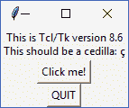
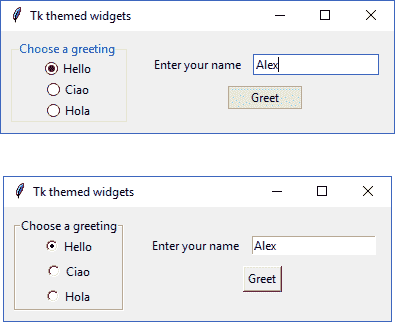
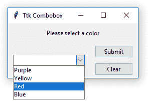
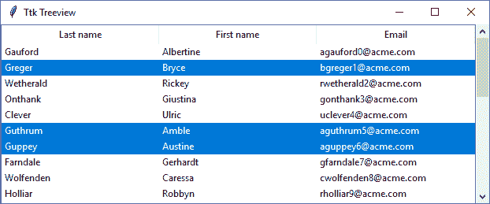
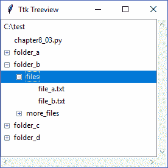
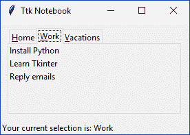

# 八、主题小部件

在本章中，我们将介绍以下配方：

*   替换基本小部件类
*   使用 Combobox 创建可编辑下拉列表
*   使用 Treeview 小部件
*   填充树视图中的嵌套项
*   使用笔记本显示选项卡式窗格
*   应用 Ttk 样式
*   创建日期选择器小部件

# 介绍

Tk 主题的小部件是 Tk 小部件的一个单独集合，具有本机的外观和感觉，它们的样式可以使用特定的 API 进行高度定制。

这些类在`tkinter.ttk`模块中定义。除了定义新的小部件（如 Treeview 和 Notebook），该模块还重新定义了经典 Tk 小部件（如按钮、标签和框架）的实现。

在本章中，我们不仅将介绍如何将应用程序 Tk 小部件更改为主题小部件，还将介绍如何设置它们的样式并使用新的小部件类。

主题 Tk 小部件集是在 Tk 8.5 中引入的，这应该不是问题，因为 Python 3.6 安装程序允许您包含 Tcl/Tk 解释器的 8.6 版本。

但是，您可以在任何平台上通过从命令行运行`python -m tkinter`进行验证，该命令行启动以下输出 Tcl/Tk 版本的程序：



# 替换基本小部件类

作为主题化 Tkinter 类的第一种方法，我们将了解如何使用这个不同模块中相同的小部件（按钮、标签、条目等），从而在应用程序中保持相同的行为。

尽管这并不能让我们充分发挥它们的造型功能，但我们可以很容易地欣赏这些视觉变化带来的主题小部件的原生外观和感觉。

# 准备

在下面的屏幕截图中，您可以注意到带有主题小部件的 GUI 与使用标准 Tkinter 小部件的同一窗口之间的差异：



我们将构建第一个窗口中显示的应用程序，但我们还将学习如何轻松地在两种样式之间切换。

请注意，这高度依赖于平台。在本例中，主题化的变体对应于 Windows 10 上主题化小部件的外观。

# 怎么做。。。

要开始使用主题小部件，您只需导入`tkinter.ttk`模块并像往常一样使用 Tkinter 应用程序中定义的小部件：

```py
import tkinter as tk
import tkinter.ttk as ttk

class App(tk.Tk):
    greetings = ("Hello", "Ciao", "Hola")

    def __init__(self):
        super().__init__()
        self.title("Tk themed widgets")

        var = tk.StringVar()
        var.set(self.greetings[0])
        label_frame = ttk.LabelFrame(self, text="Choose a greeting")
        for greeting in self.greetings:
            radio = ttk.Radiobutton(label_frame, text=greeting,
                                    variable=var, value=greeting)
            radio.pack()

        frame = ttk.Frame(self)
        label = ttk.Label(frame, text="Enter your name")
        entry = ttk.Entry(frame)

        command = lambda: print("{}, {}!".format(var.get(), 
                                         entry.get()))
        button = ttk.Button(frame, text="Greet", command=command)

        label.grid(row=0, column=0, padx=5, pady=5)
        entry.grid(row=0, column=1, padx=5, pady=5)
        button.grid(row=1, column=0, columnspan=2, pady=5)

        label_frame.pack(side=tk.LEFT, padx=10, pady=10)
        frame.pack(side=tk.LEFT, padx=10, pady=10)

if __name__ == "__main__":
    app = App()
    app.mainloop()
```

如果您希望使用常规 Tkinter 小部件运行相同的程序，请将所有出现的`ttk.`替换为`tk.`。

# 它是如何工作的。。。

开始使用主题小部件的一种常见方法是使用`import ... as`语法导入`tkinter.ttk`模块。因此，我们可以很容易地识别具有`tk`名称的标准小部件和具有`ttk`名称的主题小部件：

```py
import tkinter as tk
import tkinter.ttk as ttk
```

正如您在前面的代码中可能已经注意到的，将`tkinter`模块中的小部件替换为`tkinter.ttk`中的等效小部件与更改别名一样简单：

```py
import tkinter as tk
import tkinter.ttk as ttk

# ...
entry_1 = tk.Entry(root)
entry_2 = ttk.Entry(root)
```

在我们的示例中，我们对`ttk.Frame`、`ttk.Label`、`ttk.Entry`、`ttk.LabelFrame`和`ttk.Radiobutton`小部件执行了此操作。这些类别接受与标准 Tkinter 等价物几乎相同的基本选项；事实上，它们实际上是它们的子类。

但是，这种翻译很简单，因为我们没有移植任何样式选项，例如`foreground`或`background`。在主题小部件中，这些关键字通过`ttk.Style`类单独使用，我们将在另一个菜谱中介绍。

# 另见

*   *应用 Ttk 造型*配方

# 使用 Combobox 创建可编辑下拉列表

下拉列表是通过仅在需要时垂直显示值列表来选择值的简洁方式。允许用户输入列表中不存在的另一个选项也是很常见的。

此功能在`ttk.Combobox`类中组合，该类采用平台下拉列表的本机外观。

# 准备

我们的下一个应用程序将由一个简单的下拉条目和几个按钮组成，用于确认选择或清除其内容。

如果选择一个预定义值或单击“提交”按钮，则标准输出中将打印当前组合框值，如下所示：



# 怎么做。。。

我们的应用程序在初始化期间创建一个`ttk.Combobox`实例，传递一个预定义的值序列，这些值可以在下拉列表中选择：

```py
import tkinter as tk
import tkinter.ttk as ttk

class App(tk.Tk):
    def __init__(self):
        super().__init__()
        self.title("Ttk Combobox")
        colors = ("Purple", "Yellow", "Red", "Blue")

        self.label = ttk.Label(self, text="Please select a color")
        self.combo = ttk.Combobox(self, values=colors)
        btn_submit = ttk.Button(self, text="Submit",
                                command=self.display_color)
        btn_clear = ttk.Button(self, text="Clear",
                                command=self.clear_color)

        self.combo.bind("<<ComboboxSelected>>", self.display_color)

        self.label.pack(pady=10)
        self.combo.pack(side=tk.LEFT, padx=10, pady=5)
        btn_submit.pack(side=tk.TOP, padx=10, pady=5)
        btn_clear.pack(padx=10, pady=5)

    def display_color(self, *args):
        color = self.combo.get()
        print("Your selection is", color)

    def clear_color(self):
        self.combo.set("")

if __name__ == "__main__":
    app = App()
    app.mainloop()
```

# 它是如何工作的。。。

通常，`ttk.Combobox`小部件通过将`Tk`实例作为第一个参数传递给其构造函数而添加到我们的应用程序中。`values`选项指定单击下拉箭头时显示的可选选项列表。

我们绑定`"<<ComboboxSelected>>"`虚拟事件，该事件是在选择值列表中的一个选项时生成的：

```py
        self.label = ttk.Label(self, text="Please select a color")
        self.combo = ttk.Combobox(self, values=colors)
        btn_submit = ttk.Button(self, text="Submit",
                                command=self.display_color)
        btn_clear = ttk.Button(self, text="Clear",
                                command=self.clear_color)

        self.combo.bind("<<ComboboxSelected>>", self.display_color)
```

当您单击`Submit`按钮时，会调用相同的方法，因此它会接收用户输入的值。

我们定义了`display_color()`使用`*`语法获取变量参数列表，以安全地处理可选参数。之所以会发生这种情况，是因为通过事件绑定调用时会将事件传递给它，但从按钮回调调用时它不会收到任何参数。

在此方法中，我们通过其`get()`方法检索当前组合框值，并将其打印在标准输出中：

```py
    def display_color(self, *args):
        color = self.combo.get()
        print("Your selection is", color)
```

最后，`clear_color()`通过使用空字符串调用组合框的`set()`方法来清除组合框的内容：

```py
    def clear_color(self):
        self.combo.set("")
```

通过这些方法，我们探索了如何与当前选择的 Combobox 实例交互。

# 还有更多。。。

`ttk.Combobox`类扩展了`ttk.Entry`，而`ttk.Entry`又从`tkinter`模块扩展了`Entry`类。

这意味着，如果需要，我们还可以使用`Entry`类中已经介绍过的方法：

```py
    combobox.insert(0, "Add this at the beginning: ")
```

前面的代码比`combobox.set("Add this at the beginning: " + combobox.get())`更简单。

# 使用 Treeview 小部件

在本食谱中，我们将介绍`ttk.Treeview`类，这是一个多功能的小部件，允许我们以表格和层次结构显示信息。

添加到`ttk.Treeview`类中的每个项目被划分为一列或多列，其中第一列可能包含文本和图标，用于指示该项目是否可以展开并显示更多嵌套项目。其余列包含我们希望为每行显示的值。

`ttk.Treeview`类的第一行由标题组成，标题通过名称标识每个列，并且可以选择隐藏。

# 准备

我们将使用`ttk.Treeview`将存储在 CSV 文件中的联系人列表信息制成表格，类似于我们之前在[第 5 章](5.html)、*面向对象编程和 MVC*中所做的：



# 怎么做。。。

我们将创建一个有三列的`ttk.Treeview`小部件，其中包含每个联系人的字段：一列表示其姓，另一列表示其名，最后一列表示其电子邮件地址。

使用`csv`模块从 CSV 文件加载联系人，然后我们为`"<<TreeviewSelect>>"`虚拟元素添加绑定，该绑定在选择一个或多个项目时生成：

```py
import csv
import tkinter as tk
import tkinter.ttk as ttk

class App(tk.Tk):
    def __init__(self, path):
        super().__init__()
        self.title("Ttk Treeview")

        columns = ("#1", "#2", "#3")
        self.tree = ttk.Treeview(self, show="headings", columns=columns)
        self.tree.heading("#1", text="Last name")
        self.tree.heading("#2", text="First name")
        self.tree.heading("#3", text="Email")
        ysb = ttk.Scrollbar(self, orient=tk.VERTICAL, 
                            command=self.tree.yview)
        self.tree.configure(yscroll=ysb.set)

        with open("contacts.csv", newline="") as f:
            for contact in csv.reader(f):
                self.tree.insert("", tk.END, values=contact)
        self.tree.bind("<<TreeviewSelect>>", self.print_selection)

        self.tree.grid(row=0, column=0)
        ysb.grid(row=0, column=1, sticky=tk.N + tk.S)
        self.rowconfigure(0, weight=1)
        self.columnconfigure(0, weight=1)

    def print_selection(self, event):
        for selection in self.tree.selection():
            item = self.tree.item(selection)
            last_name, first_name, email = item["values"][0:3]
            text = "Selection: {}, {} <{}>"
            print(text.format(last_name, first_name, email))

if __name__ == "__main__":
    app = App()
    app.mainloop()
```

如果运行此程序，每次选择联系人时，其详细信息将打印在标准输出中，以说明如何检索选定行的数据。

# 它是如何工作的。。。

要创建具有多个列的`ttk.Treeview`，我们需要使用`columns`选项指示每个列的标识符。然后，我们可以通过调用`heading()`方法来配置标题文本。

我们使用了标识符`#1`、`#2`和`#3`，因为包含可展开图标和文本的第一列始终使用`#0`标识符生成。

此外，我们还将`"headings"`值传递给`show`选项，以指示我们要隐藏`#0`列，因为不会有嵌套项。

以下值对`show`选项有效：

*   `"tree"`：显示`#0`列
*   `"headings"`：显示标题行
*   `"tree headings"`：同时显示`#0`列和标题行，这是默认值
*   `""`：不显示`#0`列或标题行

之后，我们在`ttk.Treeview`小部件上附加了一个垂直滚动条：

```py
        columns = ("#1", "#2", "#3")
        self.tree = ttk.Treeview(self, show="headings", columns=columns)
        self.tree.heading("#1", text="Last name")
        self.tree.heading("#2", text="First name")
        self.tree.heading("#3", text="Email")
        ysb = ttk.Scrollbar(self, orient=tk.VERTICAL, command=self.tree.yview)
        self.tree.configure(yscroll=ysb.set)
```

为了将联系人加载到表中，我们使用`csv`模块中的`reader()`函数处理文件，并将每次迭代读取的行添加到`ttk.Treeview`。

这是通过调用`insert()`方法完成的，该方法接收父节点和放置项目的位置。

由于所有联系人都显示为顶级项目，因此我们传递一个空字符串作为第一个参数和`END`常量，以指示每个新项目插入到最后一个位置。

您可以选择向`insert()`方法提供一些关键字参数。在这里，我们指定了`values`选项，该选项采用树视图的每列中显示的值序列：

```py
        with open("contacts.csv", newline="") as f:
            for contact in csv.reader(f):
                self.tree.insert("", tk.END, values=contact)
        self.tree.bind("<<TreeviewSelect>>", self.print_selection)
```

`<<TreeviewSelect>>`事件是用户从表中选择一个或多个项目时生成的虚拟事件。在`print_selection()`处理程序中，我们通过调用`selection()`方法检索当前选择，对于每个结果，我们将执行以下步骤：

1.  通过`item()`方法，我们得到所选项目的选项和值字典
2.  我们从`item`字典中检索前三个值，它们对应于联系人的姓、名和电子邮件
3.  将值格式化并打印到标准输出中：

```py
    def print_selection(self, event):
        for selection in self.tree.selection():
            item = self.tree.item(selection)
            last_name, first_name, email = item["values"][0:3]
            text = "Selection: {}, {} <{}>"
            print(text.format(last_name, first_name, email))
```

# 还有更多。。。

到目前为止，我们已经介绍了`ttk.Treeview`类的一些基本方面，因为我们将其用作常规表。但是，也可以使用更高级的功能扩展现有的应用程序。

# 在 Treeview 项目中使用标记

标记可用于`ttk.Treeview`项，因此可以为`contacts`表的特定行绑定事件序列。

假设我们想打开一个新窗口，在双击联系人时向其发送电子邮件；但是，这仅适用于填写电子邮件字段的记录。

我们可以很容易地实现这一点，方法是在插入项目时有条件地向项目添加一个标记，然后使用`"<Double-Button-1>"`序列调用小部件实例上的`tag_bind()`，这里我们只需通过名称来引用`send_email_to_contact()`处理函数的实现：

```py
    columns = ("Last name", "First name", "Email")
    tree = ttk.Treeview(self, show="headings", columns=columns)

    for contact in csv.reader(f):
        email = contact[2]
 tags = ("dbl-click",) if email else ()
 self.tree.insert("", tk.END, values=contact, tags=tags)

 tree.tag_bind("dbl-click", "<Double-Button-1>", send_email_to_contact)
```

与将事件绑定到`Canvas`项时发生的情况类似，在调用`tag_bind()`之前，请始终记住将标记的项添加到`ttk.Treeview`，因为绑定仅添加到现有的匹配项。

# 另见

*   *填充 Treeview*配方中的嵌套项

# 填充树视图中的嵌套项

虽然`ttk.Treeview`可以用作常规表，但也可以包含层次结构。这显示为一个树，其中可以展开项以查看层次结构的更多节点。

这对于显示递归调用的结果和多层嵌套项非常有用。在本食谱中，我们将看一看适合这种结构的常见场景。

# 准备

为了说明如何在`ttk.Treeview`小部件中递归添加项，我们将创建一个基本的文件系统浏览器。可展开节点将表示文件夹，一旦打开，它们将显示其包含的文件和文件夹：



# 怎么做。。。

树最初将由`populate_node()`方法填充，该方法列出当前目录中的条目。如果一个条目是一个目录，它还会添加一个空的子项，以将其显示为一个可扩展的节点。

当代表目录的节点被打开时，它会通过再次调用`populate_node()`延迟加载目录的内容。这一次，项目不是作为顶级节点添加，而是嵌套在打开的节点中：

```py
import os
import tkinter as tk
import tkinter.ttk as ttk

class App(tk.Tk):
    def __init__(self, path):
        super().__init__()
        self.title("Ttk Treeview")

        abspath = os.path.abspath(path)
        self.nodes = {}
        self.tree = ttk.Treeview(self)
        self.tree.heading("#0", text=abspath, anchor=tk.W)
        ysb = ttk.Scrollbar(self, orient=tk.VERTICAL,
                            command=self.tree.yview)
        xsb = ttk.Scrollbar(self, orient=tk.HORIZONTAL,
                            command=self.tree.xview)
        self.tree.configure(yscroll=ysb.set, xscroll=xsb.set)

        self.tree.grid(row=0, column=0, sticky=tk.N + tk.S + tk.E +     tk.W)
        ysb.grid(row=0, column=1, sticky=tk.N + tk.S)
        xsb.grid(row=1, column=0, sticky=tk.E + tk.W)
        self.rowconfigure(0, weight=1)
        self.columnconfigure(0, weight=1)

        self.tree.bind("<<TreeviewOpen>>", self.open_node)
        self.populate_node("", abspath)

    def populate_node(self, parent, abspath):
        for entry in os.listdir(abspath):
            entry_path = os.path.join(abspath, entry)
            node = self.tree.insert(parent, tk.END, text=entry, open=False)
            if os.path.isdir(entry_path):
                self.nodes[node] = entry_path
                self.tree.insert(node, tk.END)

    def open_node(self, event):
        item = self.tree.focus()
        abspath = self.nodes.pop(item, False)
        if abspath:
            children = self.tree.get_children(item)
            self.tree.delete(children)
            self.populate_node(item, abspath)

if __name__ == "__main__":
    app = App(path=".")
    app.mainloop()
```

当您运行前面的示例时，它将显示脚本所在目录中的文件系统层次结构，但是您可以通过`App`构造函数的`path`参数显式设置所需的目录。

# 它是如何工作的。。。

在本例中，我们将使用`os`模块，它是 Python 标准库的一部分，提供了执行操作系统调用的可移植方式。

`os`模块的第一个用途是将树的初始路径转换为绝对路径，并初始化`nodes`字典，该字典将存储可展开项与它们所代表的目录路径之间的对应关系：

```py
import os
import tkinter as tk
import tkinter.ttk as ttk

class App(tk.Tk):
    def __init__(self, path):
        # ...
 abspath = os.path.abspath(path)
 self.nodes = {}
```

例如，`os.path.abspath(".")`将返回运行脚本的路径名的绝对版本。与使用相对路径相比，我们更喜欢这种方法，因为这样可以避免在应用程序中使用路径时出现任何混乱。

现在，我们使用垂直和水平滚动条初始化`ttk.Treeview`实例。图标标题的`text`将是我们前面计算的绝对路径：

```py
        self.tree = ttk.Treeview(self)
        self.tree.heading("#0", text=abspath, anchor=tk.W)
        ysb = ttk.Scrollbar(self, orient=tk.VERTICAL,
                            command=self.tree.yview)
        xsb = ttk.Scrollbar(self, orient=tk.HORIZONTAL,
                            command=self.tree.xview)
        self.tree.configure(yscroll=ysb.set, xscroll=xsb.set)
```

然后，我们使用 Grid geometry manager 放置小部件，并使`ttk.Treeview`实例在水平和垂直方向上自动调整大小。

在此之后，我们将打开可扩展项时生成的`"<<TreeviewOpen>>"`虚拟事件绑定到`open_node()`处理程序，并调用`populate_node()`加载指定目录的条目：

```py
        self.tree.bind("<<TreeviewOpen>>", self.open_node)
        self.populate_node("", abspath)
```

请注意，对该方法的第一次调用是以空字符串作为父目录进行的，这意味着它们没有任何父目录，并且显示为顶级项。

在`populate_node()`方法中，我们通过调用`os.listdir()`列出目录项的名称。对于每个条目名称，我们执行以下操作：

*   我们计算入口的绝对路径。在类 UNIX 系统上，这是通过用斜杠连接字符串来实现的，但 Windows 使用反斜杠。多亏了`os.path.join()`方法，我们可以安全地加入路径，而不必担心与平台相关的细节。
*   我们插入`entry`字符串作为所指示的`parent`节点的最后一个子节点。我们总是将节点设置为初始关闭，因为我们只想在需要时延迟加载嵌套项。
*   如果条目绝对路径是目录，我们在`nodes`属性中添加节点与路径之间的对应关系，并插入一个空的子项，允许项目展开：

```py
    def populate_node(self, parent, abspath):
        for entry in os.listdir(abspath):
            entry_path = os.path.join(abspath, entry)
            node = self.tree.insert(parent, tk.END, text=entry, open=False)
            if os.path.isdir(entry_path):
                self.nodes[node] = entry_path
                self.tree.insert(node, tk.END)
```

单击可展开项时，`open_node()`处理程序通过调用`ttk.Treeview`实例的`focus()`方法检索所选项。

此项目标识符用于获取先前添加到`nodes`属性的绝对路径。为了避免在字典中不存在节点时引发`KeyError`，我们使用了其`pop()`方法，在本例中，该方法将第二个参数返回为默认值`False`。

如果该节点存在，则清除可扩展节点的“伪”项。调用`self.tree.get_children(item)`返回`item`的子项标识符，然后通过调用`self.tree.delete(children)`将其删除。

一旦该项被清除，我们通过调用`populate_node()`并将`item`作为其父项来添加“真实”子项条目：

```py
    def open_node(self, event):
        item = self.tree.focus()
        abspath = self.nodes.pop(item, False)
        if abspath:
            children = self.tree.get_children(item)
            self.tree.delete(children)
            self.populate_node(item, abspath)
```

# 使用笔记本显示选项卡式窗格

`ttk.Notebook`类是`ttk`模块中引入的另一种新的小部件类型。它允许您在同一窗口区域中添加应用程序的多个视图，允许您通过单击与每个视图关联的选项卡来选择应显示的视图。

如果不需要同时显示多个区域的内容，选项卡式面板是重用 GUI 相同部分的好方法。

# 准备

以下应用程序显示了一些按类别划分为选项卡的待办事项列表，这些列表显示为只读数据，以简化示例：



# 怎么做。。。

我们以固定大小实例化`ttk.Notebook`，然后使用一些预定义的数据在字典上循环，这些数据将用于创建选项卡并向每个区域添加一些标签：

```py
import tkinter as tk
import tkinter.ttk as ttk

class App(tk.Tk):
    def __init__(self):
        super().__init__()
        self.title("Ttk Notebook")

        todos = {
            "Home": ["Do the laundry", "Go grocery shopping"],
            "Work": ["Install Python", "Learn Tkinter", "Reply emails"],
            "Vacations": ["Relax!"]
        }

        self.notebook = ttk.Notebook(self, width=250, height=100)
        self.label = ttk.Label(self)
        for key, value in todos.items():
            frame = ttk.Frame(self.notebook)
            self.notebook.add(frame, text=key, underline=0,
                              sticky=tk.NE + tk.SW)
            for text in value:
                ttk.Label(frame, text=text).pack(anchor=tk.W)

        self.notebook.pack()
        self.label.pack(anchor=tk.W)
        self.notebook.enable_traversal()
        self.notebook.bind("<<NotebookTabChanged>>", self.select_tab)

    def select_tab(self, event):
        tab_id = self.notebook.select()
        tab_name = self.notebook.tab(tab_id, "text")
        text = "Your current selection is: {}".format(tab_name)
        self.label.config(text=text)

if __name__ == "__main__":
    app = App()
    app.mainloop()
```

每次单击选项卡时，窗口底部的标签都会更新其内容，显示当前选项卡的名称。

# 它是如何工作的。。。

我们的`ttk.Notebook`小部件是用特定的宽度和高度以及外部填充创建的。

`todos`字典中的每个键都被用作选项卡的名称，值列表被添加为`ttk.Frame`的标签，表示窗口区域：

```py
 self.notebook = ttk.Notebook(self, width=250, height=100, padding=10)
        for key, value in todos.items():
            frame = ttk.Frame(self.notebook)
 self.notebook.add(frame, text=key,
                              underline=0, sticky=tk.NE+tk.SW)
            for text in value:
                ttk.Label(frame, text=text).pack(anchor=tk.W)
```

在此之后，我们在`ttk.Notebook`小部件上调用`enable_traversal()`。这允许用户分别使用*Ctrl*+*Shift*+*tab*和*Ctrl*+*tab*在选项卡面板之间来回切换选项卡。

还可以通过按*Alt*和带下划线的字符切换到特定的选项卡，即`Home`选项卡的*Alt*+*H*，`Work`选项卡的*Alt*+*W*和*Alt*+*V*选项卡的。

选项卡选择更改时生成`"<<NotebookTabChanged>>"`虚拟事件，并将其绑定到`select_tab()`方法。请注意，当 Tkinter 向`ttk.Notebook`添加选项卡时，会自动引发此事件：

```py
        self.notebook.pack()
        self.label.pack(anchor=tk.W)
 self.notebook.enable_traversal()
 self.notebook.bind("<<NotebookTabChanged>>", self.select_tab)
```

当我们打包项目时，不需要放置`ttk.Notebook`子窗口，因为它是通过对几何体管理器的`ttk.Notebook`调用在内部完成的：

```py
    def select_tab(self, event):
        tab_id = self.notebook.select()
        tab_name = self.notebook.tab(tab_id, "text")
        self.label.config(text=f"Your current selection is: {tab_name}")
```

# 还有更多。。。

如果要检索`ttk.Notebook`当前显示的子项，则不需要使用任何额外的数据结构将选项卡索引映射到小部件窗口。

Tkinter 的`nametowidget()`方法可用于所有小部件类，因此您可以轻松获得与小部件名称对应的小部件对象：

```py
    def select_tab(self, event):
        tab_id = self.notebook.select()
        frame = self.nametowidget(tab_id)
        # Do something with the frame
```

# 应用 Ttk 样式

正如我们在本章的第一个配方中提到的，主题小部件有一个特定的 API 来定制它们的外观。我们不能直接设置选项，例如前景颜色或内部填充，因为这些值是通过`ttk.Style`类设置的。

在这个菜谱中，我们将介绍如何修改第一个菜谱中的小部件以添加一些样式选项。

# 怎么做。。。

要添加一些默认设置，我们只需要一个`ttk.Style`对象，它提供以下方法：

*   `configure(style, opts)`：更改小部件`style`的外观`opts`。这里是我们设置选项的地方，如前景色、填充和浮雕。
*   `map(style, query)`：更改小部件`style`的动态外观。参数`query`是一个关键字参数，其中每个键都是一个样式选项，值是`(state, value)`形式的元组列表，这意味着该选项的值由其当前状态决定。

例如，我们标记了以下两种情况的示例：

```py
import tkinter as tk
import tkinter.ttk as tk

class App(tk.Tk):
    def __init__(self):
        super().__init__()
        self.title("Tk themed widgets")

        style = ttk.Style(self)
 style.configure("TLabel", padding=10)
 style.map("TButton",
 foreground=[("pressed", "grey"), ("active", "white")],
 background=[("pressed", "white"), ("active", "grey")]
 ) # ...
```

现在，每个`ttk.Label`都显示有`10`的填充，并且`ttk.Button`有一个动态样式：当状态为`pressed`时为灰色前景和白色背景，如果状态为`active`，则为白色前景和灰色背景。

# 它是如何工作的。。。

为我们的应用程序构建`ttk.Style`非常简单，我们只需要创建一个实例，将父窗口小部件作为其第一个参数。

然后，我们可以为主题小部件设置默认样式选项，使用大写字母`T`加上小部件名称：`TButton`表示`ttk.Button`，`TLabel`表示`ttk.Label`等等。但是，也有一些例外，因此建议您通过调用小部件实例上的`winfo_class()`方法，在 Python 解释器上检查类名。

我们还可以添加一个前缀来标识默认情况下不希望使用的样式，但将其显式设置为某些特定的小部件：

```py
        style.configure("My.TLabel", padding=10)
        # ...
        label = ttk.Label(master, text="Some text", style="My.TLabel")
```

# 创建日期选择器小部件

如果我们想让用户在我们的应用程序中输入日期，我们可以添加一个文本条目，强制他们使用有效的日期格式编写字符串。另一个解决方案是为日、月和年添加几个数字条目，但这也需要一些验证。

与其他 GUI 框架不同，Tkinter 不包含用于此目的的类；然而，我们可以选择应用我们对主题小部件的知识来构建日历小部件。

# 准备

在本配方中，我们将逐步介绍使用 Ttk 小部件和功能制作的 datepicker 小部件的实现：


这是[的重构版本 http://svn.python.org/projects/sandbox/trunk/ttk-gsoc/samples/ttkcalendar.py](http://svn.python.org/projects/sandbox/trunk/ttk-gsoc/samples/ttkcalendar.py) 不需要任何外部包装。

# 怎么做。。。

除了`tkinter`模块外，我们还需要标准库中的`calendar`和`datetime`模块。它们将帮助我们对小部件所持有的数据进行建模和交互。

小部件标题显示两个箭头，根据 Ttk 样式选项前后移动当前月份。小部件的主体由一个`ttk.Treeview`表组成，其中一个`Canvas`实例突出显示所选的日期单元格：

```py
import calendar
import datetime
import tkinter as tk
import tkinter.ttk as ttk
import tkinter.font as tkfont
from itertools import zip_longest

class TtkCalendar(ttk.Frame):
    def __init__(self, master=None, **kw):
        now = datetime.datetime.now()
        fwday = kw.pop('firstweekday', calendar.MONDAY)
        year = kw.pop('year', now.year)
        month = kw.pop('month', now.month)
        sel_bg = kw.pop('selectbackground', '#ecffc4')
        sel_fg = kw.pop('selectforeground', '#05640e')

        super().__init__(master, **kw)

        self.selected = None
        self.date = datetime.date(year, month, 1)
        self.cal = calendar.TextCalendar(fwday)
        self.font = tkfont.Font(self)
        self.header = self.create_header()
        self.table = self.create_table()
        self.canvas = self.create_canvas(sel_bg, sel_fg)
        self.build_calendar()

    def create_header(self):
        left_arrow = {'children': [('Button.leftarrow', None)]}
        right_arrow = {'children': [('Button.rightarrow', None)]}
        style = ttk.Style(self)
        style.layout('L.TButton', [('Button.focus', left_arrow)])
        style.layout('R.TButton', [('Button.focus', right_arrow)])

        hframe = ttk.Frame(self)
        btn_left = ttk.Button(hframe, style='L.TButton',
                              command=lambda: self.move_month(-1))
        btn_right = ttk.Button(hframe, style='R.TButton',
                               command=lambda: self.move_month(1))
        label = ttk.Label(hframe, width=15, anchor='center')

        hframe.pack(pady=5, anchor=tk.CENTER)
        btn_left.grid(row=0, column=0)
        label.grid(row=0, column=1, padx=12)
        btn_right.grid(row=0, column=2)
        return label

    def move_month(self, offset):
        self.canvas.place_forget()
        month = self.date.month - 1 + offset
        year = self.date.year + month // 12
        month = month % 12 + 1
        self.date = datetime.date(year, month, 1)
        self.build_calendar()

    def create_table(self):
        cols = self.cal.formatweekheader(3).split()
        table = ttk.Treeview(self, show='', selectmode='none',
                             height=7, columns=cols)
        table.bind('<Map>', self.minsize)
        table.pack(expand=1, fill=tk.BOTH)
        table.tag_configure('header', background='grey90')
        table.insert('', tk.END, values=cols, tag='header')
        for _ in range(6):
            table.insert('', tk.END)

        width = max(map(self.font.measure, cols))
        for col in cols:
            table.column(col, width=width, minwidth=width, anchor=tk.E)
        return table

    def minsize(self, e):
        width, height = self.master.geometry().split('x')
        height = height[:height.index('+')]
        self.master.minsize(width, height)

    def create_canvas(self, bg, fg):
        canvas = tk.Canvas(self.table, background=bg,
                           borderwidth=0, highlightthickness=0)
        canvas.text = canvas.create_text(0, 0, fill=fg, anchor=tk.W)
        handler = lambda _: canvas.place_forget()
        canvas.bind('<ButtonPress-1>', handler)
        self.table.bind('<Configure>', handler)
        self.table.bind('<ButtonPress-1>', self.pressed)
        return canvas

    def build_calendar(self):
        year, month = self.date.year, self.date.month
        month_name = self.cal.formatmonthname(year, month, 0)
        month_weeks = self.cal.monthdayscalendar(year, month)

        self.header.config(text=month_name.title())
        items = self.table.get_children()[1:]
        for week, item in zip_longest(month_weeks, items):
            week = week if week else [] 
            fmt_week = ['%02d' % day if day else '' for day in week]
            self.table.item(item, values=fmt_week)

    def pressed(self, event):
        x, y, widget = event.x, event.y, event.widget
        item = widget.identify_row(y)
        column = widget.identify_column(x)
        items = self.table.get_children()[1:]

        if not column or not item in items:
            # clicked te header or outside the columns
            return

        index = int(column[1]) - 1
        values = widget.item(item)['values']
        text = values[index] if len(values) else None
        bbox = widget.bbox(item, column)
        if bbox and text:
            self.selected = '%02d' % text
            self.show_selection(bbox)

    def show_selection(self, bbox):
        canvas, text = self.canvas, self.selected
        x, y, width, height = bbox
        textw = self.font.measure(text)
        canvas.configure(width=width, height=height)
        canvas.coords(canvas.text, width - textw, height / 2 - 1)
        canvas.itemconfigure(canvas.text, text=text)
        canvas.place(x=x, y=y)

    @property
    def selection(self):
        if self.selected:
            year, month = self.date.year, self.date.month
            return datetime.date(year, month, int(self.selected))

def main():
    root = tk.Tk()
    root.title('Tkinter Calendar')
    ttkcal = TtkCalendar(firstweekday=calendar.SUNDAY)
    ttkcal.pack(expand=True, fill=tk.BOTH)
    root.mainloop()

if __name__ == '__main__':
    main()
```

# 它是如何工作的。。。

我们的`TtkCalendar`类可以通过传递一些选项作为关键字参数来定制。它们在初始化期间被检索，如果它们不存在，则使用一些默认值；例如，如果当前日期用于日历的最初年份和月份：

```py
    def __init__(self, master=None, **kw):
        now = datetime.datetime.now()
        fwday = kw.pop('firstweekday', calendar.MONDAY)
        year = kw.pop('year', now.year)
        month = kw.pop('month', now.month)
        sel_bg = kw.pop('selectbackground', '#ecffc4')
        sel_fg = kw.pop('selectforeground', '#05640e')

        super().__init__(master, **kw)
```

然后，我们定义一些属性来存储日期信息：

*   `selected`：保存所选日期的值
*   `date`：表示日历上显示的当前月份的日期
*   `calendar`：带有周和月名称信息的公历

小部件的可视部分在`create_header()`和`create_table()`方法中进行了内部实例化，我们将在后面介绍。

我们还使用了一个`tkfont.Font`实例来帮助我们测量字体大小。

初始化这些属性后，通过调用`build_calendar()`方法排列日历的可视部分：

```py
        self.selected = None
        self.date = datetime.date(year, month, 1)
        self.cal = calendar.TextCalendar(fwday)
        self.font = tkfont.Font(self)
        self.header = self.create_header()
        self.table = self.create_table()
        self.canvas = self.create_canvas(sel_bg, sel_fg)
        self.build_calendar()
```

`create_header()`方法使用`ttk.Style`显示来回移动月份的箭头。它返回显示当前月份名称的标签：

```py
    def create_header(self):
        left_arrow = {'children': [('Button.leftarrow', None)]}
        right_arrow = {'children': [('Button.rightarrow', None)]}
        style = ttk.Style(self)
        style.layout('L.TButton', [('Button.focus', left_arrow)])
        style.layout('R.TButton', [('Button.focus', right_arrow)])

        hframe = ttk.Frame(self)
        lbtn = ttk.Button(hframe, style='L.TButton',
                          command=lambda: self.move_month(-1))
        rbtn = ttk.Button(hframe, style='R.TButton',
                          command=lambda: self.move_month(1))
        label = ttk.Label(hframe, width=15, anchor='center')

        # ...
        return label
```

`move_month()`回调隐藏使用画布字段突出显示的当前选择，并将指定的`offset`添加到当前月份，以设置`date`属性与上一个月或下一个月。然后，再次重新绘制日历，显示新月份的日期：

```py
    def move_month(self, offset):
        self.canvas.place_forget()
        month = self.date.month - 1 + offset
        year = self.date.year + month // 12
        month = month % 12 + 1
        self.date = datetime.date(year, month, 1)
        self.build_calendar()
```

日历正文是在`create_table()`中使用`ttk.Treeview`小部件创建的，该小部件连续显示当前月份的每周：

```py
    def create_table(self):
        cols = self.cal.formatweekheader(3).split()
        table = ttk.Treeview(self, show='', selectmode='none',
                             height=7, columns=cols)
        table.bind('<Map>', self.minsize)
        table.pack(expand=1, fill=tk.BOTH)
        table.tag_configure('header', background='grey90')
        table.insert('', tk.END, values=cols, tag='header')
        for _ in range(6):
            table.insert('', tk.END)

        width = max(map(self.font.measure, cols))
        for col in cols:
            table.column(col, width=width, minwidth=width, anchor=tk.E)
        return table
```

突出显示所选内容的画布在`create_canvas()`方法中实例化。由于它根据选定的项目尺寸调整其大小，因此在调整窗口大小时也会隐藏自身：

```py
    def create_canvas(self, bg, fg):
        canvas = tk.Canvas(self.table, background=bg,
                           borderwidth=0, highlightthickness=0)
        canvas.text = canvas.create_text(0, 0, fill=fg, anchor=tk.W)
        handler = lambda _: canvas.place_forget()
        canvas.bind('<ButtonPress-1>', handler)
        self.table.bind('<Configure>', handler)
        self.table.bind('<ButtonPress-1>', self.pressed)
        return canvas
```

日历是通过迭代`ttk.Treeview`表中的周和项目位置构建的。使用`itertools`模块中的`zip_longest()`函数，我们迭代包含大多数项的集合，并将缺少的天数保留为空字符串：


这种行为在每个月的第一周和最后一周都很重要，因为这是我们通常发现这些空白点的地方：

```py
    def build_calendar(self):
        year, month = self.date.year, self.date.month
        month_name = self.cal.formatmonthname(year, month, 0)
        month_weeks = self.cal.monthdayscalendar(year, month)

        self.header.config(text=month_name.title())
        items = self.table.get_children()[1:]
        for week, item in zip_longest(month_weeks, items):
            week = week if week else [] 
            fmt_week = ['%02d' % day if day else '' for day in week]
            self.table.item(item, values=fmt_week)
```

当您单击一个表项时，`pressed()`事件处理程序设置该项存在时的选择，并重新显示画布以突出显示该选择：

```py
    def pressed(self, event):
        x, y, widget = event.x, event.y, event.widget
        item = widget.identify_row(y)
        column = widget.identify_column(x)
        items = self.table.get_children()[1:]

        if not column or not item in items:
            # clicked te header or outside the columns
            return

        index = int(column[1]) - 1
        values = widget.item(item)['values']
        text = values[index] if len(values) else None
        bbox = widget.bbox(item, column)
        if bbox and text:
            self.selected = '%02d' % text
            self.show_selection(bbox)
```

`show_selection()`方法将画布放置在包含所选内容的边界框上，测量文本大小，使其适合其顶部：

```py
    def show_selection(self, bbox):
        canvas, text = self.canvas, self.selected
        x, y, width, height = bbox
        textw = self.font.measure(text)
        canvas.configure(width=width, height=height)
        canvas.coords(canvas.text, width - textw, height / 2 - 1)
        canvas.itemconfigure(canvas.text, text=text)
        canvas.place(x=x, y=y)
```

最后，`selection`属性可以将所选日期作为`datetime.date`对象获取。在我们的示例中没有直接使用它，但它是 API 的一部分，用于处理`TtkCalendar`类：

```py
    @property
    def selection(self):
        if self.selected:
            year, month = self.date.year, self.date.month
            return datetime.date(year, month, int(self.selected))
```

# 另见

*   *使用 Treeview 小部件*配方
*   *应用 Ttk 造型*配方