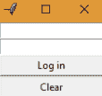
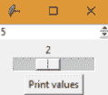
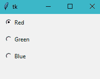

# 第一章：开始使用 Tkinter

在本章中，我们将涵盖以下内容：

+   构建 Tkinter 应用程序

+   使用按钮

+   创建文本输入

+   跟踪文本更改

+   验证文本输入

+   选择数值

+   使用单选按钮创建选择

+   使用复选框实现开关

+   显示项目列表

+   处理鼠标和键盘事件

+   设置主窗口的图标、标题和大小

# 介绍

由于其清晰的语法和广泛的库和工具生态系统，Python 已经成为一种流行的通用编程语言。从 Web 开发到自然语言处理（NLP），您可以轻松找到一个符合您应用领域需求的开源库，最后，您总是可以使用 Python 标准库中包含的任何模块。

标准库遵循“电池包含”哲学，这意味着它包含了大量的实用程序：正则表达式、数学函数、网络等。该库的标准图形用户界面（GUI）包是 Tkinter，它是 Tcl/Tk 的一个薄的面向对象的层。

从 Python 3 开始，`Tkinter`模块被重命名为`tkinter`（小写的 t）。它也影响到`tkinter.ttk`和`tkinter.tix`扩展。我们将在本书的最后一章深入探讨`tkinter.ttk`模块，因为`tkinter.tix`模块已经正式弃用。

在本章中，我们将探索`tkinter`模块的一些基本类的几种模式以及所有小部件子类共有的一些方法。

# 构建 Tkinter 应用程序

使用 Tkinter 制作应用程序的主要优势之一是，使用几行脚本非常容易设置基本 GUI。随着程序变得更加复杂，逻辑上分离每个部分变得更加困难，因此有组织的结构将帮助我们保持代码整洁。

# 准备工作

我们将以以下程序为例：

```py
from tkinter import * 

root = Tk() 
btn = Button(root, text="Click me!") 
btn.config(command=lambda: print("Hello, Tkinter!"))
btn.pack(padx=120, pady=30)
root.title("My Tkinter app")
root.mainloop()
```

它创建一个带有按钮的主窗口，每次点击按钮时都会在控制台中打印`Hello, Tkinter!`。按钮在水平轴上以 120px 的填充和垂直轴上以 30px 的填充放置。最后一条语句启动主循环，处理用户事件并更新 GUI，直到主窗口被销毁：


您可以执行该程序并验证它是否按预期工作。但是，所有我们的变量都是在全局命名空间中定义的，添加的小部件越多，理清它们的使用部分就变得越困难。

在生产代码中，强烈不建议使用通配符导入（`from ... import *`），因为它们会污染全局命名空间——我们只是在这里使用它们来说明一个常见的反模式，这在在线示例中经常见到。

这些可维护性问题可以通过基本的面向对象编程技术来解决，在所有类型的 Python 程序中都被认为是良好的实践。

# 如何做...

为了改进我们简单程序的模块化，我们将定义一个包装我们全局变量的类：

```py
import tkinter as tk 

class App(tk.Tk): 
    def __init__(self): 
        super().__init__() 
        self.btn = tk.Button(self, text="Click me!", 
                             command=self.say_hello) 
        self.btn.pack(padx=120, pady=30) 

    def say_hello(self): 
        print("Hello, Tkinter!") 

if __name__ == "__main__": 
    app = App() 
    app.title("My Tkinter app") 
    app.mainloop()
```

现在，每个变量都被封装在特定的范围内，包括`command`函数，它被移动为一个单独的方法。

# 工作原理...

首先，我们用`import ... as`语法替换了通配符导入，以便更好地控制我们的全局命名空间。

然后，我们将我们的`App`类定义为`Tk`子类，现在通过`tk`命名空间引用。为了正确初始化基类，我们将使用内置的`super()`函数调用`Tk`类的`__init__`方法。这对应以下行：

```py
class App(tk.Tk): 
    def __init__(self): 
        super().__init__() 
        # ... 
```

现在，我们有了对`App`实例的引用，使用`self`变量，所以我们将把所有的按钮小部件作为我们类的属性添加。

虽然对于这样一个简单的程序来说可能看起来有点过度，但这种重构将帮助我们理清每个部分，按钮实例化与单击时执行的回调分开，应用程序引导被移动到`if __name__ == "__main__"`块中，这是可执行 Python 脚本中的常见做法。

我们将遵循这个约定通过所有的代码示例，所以您可以将这个模板作为任何更大应用程序的起点。

# 还有更多...

在我们的示例中，我们对`Tk`类进行了子类化，但通常也会对其他小部件类进行子类化。我们这样做是为了重现在重构代码之前的相同语句。

然而，在更大的程序中，比如有多个窗口的程序中，可能更方便地对`Frame`或`Toplevel`进行子类化。这是因为 Tkinter 应用程序应该只有一个`Tk`实例，如果在创建`Tk`实例之前实例化小部件，系统会自动创建一个`Tk`实例。

请记住，这个决定不会影响我们的`App`类的结构，因为所有的小部件类都有一个`mainloop`方法，它在内部启动`Tk`主循环。

# 使用按钮

按钮小部件表示 GUI 应用程序中可点击的项目。它们通常使用文本或指示单击时将执行的操作的图像。Tkinter 允许您使用`Button`小部件类的一些标准选项轻松配置此功能。

# 如何做...

以下包含一个带有图像的按钮，单击后会被禁用，并带有不同类型可用的 relief 的按钮列表：

```py
import tkinter as tk 

RELIEFS = [tk.SUNKEN, tk.RAISED, tk.GROOVE, tk.RIDGE, tk.FLAT] 

class ButtonsApp(tk.Tk): 
    def __init__(self): 
        super().__init__() 
        self.img = tk.PhotoImage(file="python.gif") 
        self.btn = tk.Button(self, text="Button with image", 
                             image=self.img, compound=tk.LEFT, 
                             command=self.disable_btn) 
        self.btns = [self.create_btn(r) for r in RELIEFS]         
        self.btn.pack() 
        for btn in self.btns: 
            btn.pack(padx=10, pady=10, side=tk.LEFT) 

    def create_btn(self, relief): 
        return tk.Button(self, text=relief, relief=relief) 

    def disable_btn(self): 
        self.btn.config(state=tk.DISABLED) 

if __name__ == "__main__": 
    app = ButtonsApp() 
    app.mainloop()
```

这个程序的目的是显示在创建按钮小部件时可以使用的几个配置选项。

在执行上述代码后，您将得到以下输出：


# 它是如何工作的...

`Button`实例化的最基本方法是使用`text`选项设置按钮标签和引用在按钮被点击时要调用的函数的`command`选项。

在我们的示例中，我们还通过`image`选项添加了`PhotoImage`，它优先于*text*字符串。`compound`选项用于在同一个按钮中组合图像和文本，确定图像放置的位置。它接受以下常量作为有效值：`CENTER`、`BOTTOM`、`LEFT`、`RIGHT`和`TOP`。

第二行按钮是用列表推导式创建的，使用了`RELIEF`值的列表。每个按钮的标签对应于常量的名称，因此您可以注意到每个按钮外观上的差异。

# 还有更多...

我们使用了一个属性来保留对我们的`PhotoImage`实例的引用，即使我们在`__init__`方法之外没有使用它。原因是图像在垃圾收集时会被清除，如果我们将其声明为局部变量并且方法存在，则会发生这种情况。

为了避免这种情况，始终记住在窗口仍然存在时保留对每个`PhotoImage`对象的引用。

# 创建文本输入框

Entry 小部件表示以单行显示的文本输入。它与`Label`和`Button`类一样，是 Tkinter 类中最常用的类之一。

# 如何做...

这个示例演示了如何创建一个登录表单，其中有两个输入框实例用于`username`和`password`字段。`password`的每个字符都显示为星号，以避免以明文显示它：

```py
import tkinter as tk 

class LoginApp(tk.Tk): 
    def __init__(self): 
        super().__init__() 
        self.username = tk.Entry(self) 
        self.password = tk.Entry(self, show="*") 
        self.login_btn = tk.Button(self, text="Log in", 
                                   command=self.print_login) 
        self.clear_btn = tk.Button(self, text="Clear", 
                                   command=self.clear_form)         
        self.username.pack() 
        self.password.pack() 
        self.login_btn.pack(fill=tk.BOTH) 
        self.clear_btn.pack(fill=tk.BOTH) 

    def print_login(self): 
        print("Username: {}".format(self.username.get())) 
        print("Password: {}".format(self.password.get())) 

    def clear_form(self): 
        self.username.delete(0, tk.END) 
        self.password.delete(0, tk.END) 
        self.username.focus_set() 

if __name__ == "__main__": 
    app = LoginApp() 
    app.mainloop()
```

`Log in`按钮在控制台中打印值，而`Clear`按钮删除两个输入框的内容，并将焦点返回到`username`的输入框：



# 它是如何工作的...

使用父窗口或框架作为第一个参数实例化 Entry 小部件，并使用一组可选关键字参数来配置其他选项。我们没有为对应`username`字段的条目指定任何选项。为了保持密码的机密性，我们使用字符串`"*"`指定`show`参数，它将显示每个键入的字符为星号。

使用`get()`方法，我们将检索当前文本作为字符串。这在`print_login`方法中用于在标准输出中显示条目的内容。

`delete()`方法接受两个参数，指示应删除的字符范围。请记住，索引从位置 0 开始，并且不包括范围末尾的字符。如果只传递一个参数，它将删除该位置的字符。

在`clear_form()`方法中，我们从索引 0 删除到常量`END`，这意味着整个内容被删除。最后，我们将焦点设置为`username`条目。

# 还有更多...

可以使用`insert()`方法以编程方式修改 Entry 小部件的内容，该方法接受两个参数：

+   `index`：要插入文本的位置；请注意，条目位置是从 0 开始的

+   `string`：要插入的文本

使用`delete()`和`insert()`的组合可以实现重置条目内容为默认值的常见模式：

```py
entry.delete(0, tk.END) 
entry.insert(0, "default value") 
```

另一种模式是在文本光标的当前位置追加文本。在这里，您可以使用`INSERT`常量，而不必计算数值索引：

```py
entry.insert(tk.INSERT, "cursor here")
```

与`Button`类一样，`Entry`类还接受`relief`和`state`选项来修改其边框样式和状态。请注意，在状态为`"disabled"`或`"readonly"`时，对`delete()`和`insert()`的调用将被忽略。

# 另请参阅

+   *跟踪文本更改*配方

+   *验证文本输入*配方

# 跟踪文本更改

`Tk`变量允许您的应用程序在输入更改其值时得到通知。`Tkinter`中有四个变量类：`BooleanVar`、`DoubleVar`、`IntVar`和`StringVar`。每个类都包装了相应 Python 类型的值，该值应与附加到变量的输入小部件的类型匹配。

如果您希望根据某些输入小部件的当前状态自动更新应用程序的某些部分，则此功能特别有用。

# 如何做...

在以下示例中，我们将使用`textvariable`选项将`StringVar`实例与我们的条目关联；此变量跟踪写操作，并使用`show_message()`方法作为回调：

```py
import tkinter as tk 

class App(tk.Tk): 
    def __init__(self): 
        super().__init__() 
        self.var = tk.StringVar() 
        self.var.trace("w", self.show_message) 
        self.entry = tk.Entry(self, textvariable=self.var) 
        self.btn = tk.Button(self, text="Clear", 
                             command=lambda: self.var.set("")) 
        self.label = tk.Label(self) 
        self.entry.pack() 
        self.btn.pack() 
        self.label.pack() 

    def show_message(self, *args): 
        value = self.var.get() 
        text = "Hello, {}!".format(value) if value else "" 
        self.label.config(text=text) 

if __name__ == "__main__": 
    app = App() 
    app.mainloop() 
```

当您在 Entry 小部件中输入内容时，标签将使用由`Tk`变量值组成的消息更新其文本。例如，如果您输入单词`Phara`，标签将显示`Hello, Phara!`。如果输入为空，标签将不显示任何文本。为了向您展示如何以编程方式修改变量的内容，我们添加了一个按钮，当您单击它时清除条目：


# 它是如何工作的...

我们的应用程序构造函数的前几行实例化了`StringVar`并将回调附加到写入模式。有效的模式值如下：

+   `"w"`：在写入变量时调用

+   `"r"`：在读取变量时调用

+   `"u"`（对于*unset*）：在删除变量时调用

当调用时，回调函数接收三个参数：内部变量名称，空字符串（在其他类型的`Tk`变量中使用），以及触发操作的模式。通过使用`*args`声明方法，我们使这些参数变为可选，因为我们在回调中没有使用这些值。

`Tk`包装器的`get()`方法返回变量的当前值，`set()`方法更新其值。它们还通知相应的观察者，因此通过 GUI 修改输入内容或单击“清除”按钮都将触发对`show_message()`方法的调用。

# 还有更多...

对于`Entry`小部件，Tk 变量是可选的，但对于其他小部件类（例如`Checkbutton`和`Radiobutton`类）来说，它们是必要的，以便正确工作。

# 另请参阅

+   *使用单选按钮创建选择*食谱

+   *使用复选框实现开关*食谱

# 验证文本输入

通常，文本输入代表遵循某些验证规则的字段，例如具有最大长度或匹配特定格式。一些应用程序允许在这些字段中键入任何类型的内容，并在提交整个表单时触发验证。

在某些情况下，我们希望阻止用户将无效内容输入文本字段。我们将看看如何使用 Entry 小部件的验证选项来实现此行为。

# 如何做...

以下应用程序显示了如何使用正则表达式验证输入：

```py
import re 
import tkinter as tk 

class App(tk.Tk): 
    def __init__(self): 
        super().__init__() 
        self.pattern = re.compile("^\w{0,10}$") 
        self.label = tk.Label(self, text="Enter your username") 
        vcmd = (self.register(self.validate_username), "%i", "%P") 
        self.entry = tk.Entry(self, validate="key", 
                              validatecommand=vcmd, 
                              invalidcommand=self.print_error) 
        self.label.pack() 
        self.entry.pack(anchor=tk.W, padx=10, pady=10) 

    def validate_username(self, index, username): 
        print("Modification at index " + index) 
        return self.pattern.match(username) is not None 

    def print_error(self): 
        print("Invalid username character") 

if __name__ == "__main__": 
    app = App() 
    app.mainloop() 
```

如果您运行此脚本并在 Entry 小部件中键入非字母数字字符，则它将保持相同的内容并打印错误消息。当您尝试键入超过 10 个有效字符时，也会发生这种情况，因为正则表达式还限制了内容的长度。

# 工作原理...

将`validate`选项设置为``"key"``，我们将激活在任何内容修改时触发的输入验证。默认情况下，该值为``"none"``，这意味着没有验证。

其他可能的值是``"focusin"``和``"focusout"``，分别在小部件获得或失去焦点时进行验证，或者简单地使用``"focus"``在两种情况下进行验证。或者，我们可以使用``"all"``值在所有情况下进行验证。

`validatecommand`函数在每次触发验证时调用，如果新内容有效，则应返回`true`，否则返回`false`。

由于我们需要更多信息来确定内容是否有效，我们使用`Widget`类的`register`方法创建了一个围绕 Python 函数的 Tcl 包装器。然后，您可以为将传递给 Python 函数的每个参数添加百分比替换。最后，我们将这些值分组为 Python 元组。这对应于我们示例中的以下行：

```py
vcmd = (self.register(self.validate_username), "%i", "%P") 
```

一般来说，您可以使用以下任何一个替换：

+   `％d`：操作类型；插入为 1，删除为 0，否则为-1

+   `％i`：正在插入或删除的字符串的索引

+   `％P`：如果允许修改，则输入的值

+   `％s`：修改前的输入值

+   `％S`：正在插入或删除的字符串内容

+   `％v`：当前设置的验证类型

+   `％V`：触发操作的验证类型

+   `％W`：Entry 小部件的名称

`invalidcommand`选项接受一个在`validatecommand`返回`false`时调用的函数。这个选项也可以应用相同的百分比替换，但在我们的示例中，我们直接传递了我们类的`print_error()`方法。

# 还有更多...

Tcl/Tk 文档建议不要混合`validatecommand`和`textvariable`选项，因为将无效值设置为`Tk`变量将关闭验证。如果`validatecommand`函数不返回布尔值，也会发生同样的情况。

如果您不熟悉`re`模块，可以在官方 Python 文档的[`docs.python.org/3.6/howto/regex.html`](https://docs.python.org/3.6/howto/regex.html)中查看有关正则表达式的详细介绍。

# 另请参阅

+   *创建文本输入*食谱

# 选择数值

以前的食谱介绍了如何处理文本输入；我们可能希望强制某些输入只包含数字值。这是`Spinbox`和`Scale`类的用例——这两个小部件允许用户从范围或有效选项列表中选择数值，但它们在显示和配置方式上有几个不同之处。

# 如何做...

此程序具有用于从`0`到`5`选择整数值的`Spinbox`和`Scale`：

```py
import tkinter as tk 

class App(tk.Tk):
    def __init__(self): 
        super().__init__() 
        self.spinbox = tk.Spinbox(self, from_=0, to=5) 
        self.scale = tk.Scale(self, from_=0, to=5, 
                              orient=tk.HORIZONTAL) 
        self.btn = tk.Button(self, text="Print values", 
                             command=self.print_values) 
        self.spinbox.pack() 
        self.scale.pack() 
        self.btn.pack() 

    def print_values(self): 
        print("Spinbox: {}".format(self.spinbox.get())) 
        print("Scale: {}".format(self.scale.get())) 

if __name__ == "__main__": 
    app = App()
    app.mainloop()
```

在上面的代码中，出于调试目的，我们添加了一个按钮，当您单击它时，它会打印每个小部件的值：



# 它是如何工作的...

这两个类都接受`from_`和`to`选项，以指示有效值的范围——由于`from`选项最初是在 Tcl/Tk 中定义的，但它在 Python 中是一个保留关键字，因此需要添加下划线。

`Scale`类的一个方便功能是`resolution`选项，它设置了舍入的精度。例如，分辨率为 0.2 将允许用户选择值 0.0、0.2、0.4 等。此选项的默认值为 1，因此小部件将所有值舍入到最接近的整数。

与往常一样，可以使用`get()`方法检索每个小部件的值。一个重要的区别是，`Spinbox`将数字作为字符串返回，而`Scale`返回一个整数值，如果舍入接受小数值，则返回一个浮点值。

# 还有更多...

`Spinbox`类具有与 Entry 小部件类似的配置，例如`textvariable`和`validate`选项。您可以将所有这些模式应用于旋转框，主要区别在于它限制为数值。

# 另请参阅

+   *跟踪文本更改*食谱

# 使用单选按钮创建选择

使用 Radiobutton 小部件，您可以让用户在多个选项中进行选择。这种模式适用于相对较少的互斥选择。

# 如何做...

您可以使用 Tkinter 变量连接多个`Radiobutton`实例，以便当您单击未选择的选项时，它将取消选择先前选择的任何其他选项。

在下面的程序中，我们为`Red`，`Green`和`Blue`选项创建了三个单选按钮。每次单击单选按钮时，它都会打印相应颜色的小写名称：

```py
import tkinter as tk

COLORS = [("Red", "red"), ("Green", "green"), ("Blue", "blue")]

class ChoiceApp(tk.Tk):
    def __init__(self):
        super().__init__()
        self.var = tk.StringVar()
        self.var.set("red")
        self.buttons = [self.create_radio(c) for c in COLORS]
        for button in self.buttons:
            button.pack(anchor=tk.W, padx=10, pady=5)

    def create_radio(self, option):
        text, value = option
        return tk.Radiobutton(self, text=text, value=value, 
                              command=self.print_option, 
                              variable=self.var)

    def print_option(self):
        print(self.var.get())

if __name__ == "__main__": 
    app = ChoiceApp()
    app.mainloop()
```

如果您运行此脚本，它将显示已选择红色单选按钮的应用程序：



# 它是如何工作的...

为了避免重复`Radiobutton`初始化的代码，我们定义了一个实用方法，该方法从列表推导中调用。我们解压了`COLORS`列表的每个元组的值，然后将这些局部变量作为选项传递给`Radiobutton`。请记住，尽可能尝试不要重复自己。

由于`StringVar`在所有`Radiobutton`实例之间共享，它们会自动连接，并且我们强制用户只能选择一个选项。

# 还有更多...

我们在程序中设置了默认值为`"red"`；但是，如果我们省略此行，且`StringVar`的值与任何单选按钮的值都不匹配会发生什么？它将匹配`tristatevalue`选项的默认值，即空字符串。这会导致小部件显示在特殊的“三态”或不确定模式下。虽然可以使用`config()`方法修改此选项，但最好的做法是设置一个明智的默认值，以便变量以有效状态初始化。

# 使用复选框实现开关

通常使用复选框和选项列表实现两个选择之间的选择，其中每个选择与其余选择无关。正如我们将在下一个示例中看到的，这些概念可以使用 Checkbutton 小部件来实现。

# 如何做...

以下应用程序显示了如何创建 Checkbutton，它必须连接到`IntVar`变量才能检查按钮状态：

```py
import tkinter as tk

class SwitchApp(tk.Tk):
    def __init__(self):
        super().__init__() 
        self.var = tk.IntVar() 
        self.cb = tk.Checkbutton(self, text="Active?",  
                                 variable=self.var, 
                                 command=self.print_value) 
        self.cb.pack() 

    def print_value(self): 
        print(self.var.get()) 

if __name__ == "__main__": 
    app = SwitchApp() 
    app.mainloop() 
```

在上面的代码中，我们只是在每次单击小部件时打印小部件的值：


# 它是如何工作的...

与 Button 小部件一样，Checkbutton 也接受`command`和`text`选项。

使用`onvalue`和`offvalue`选项，我们可以指定按钮打开和关闭时使用的值。我们使用整数变量，因为默认情况下这些值分别为**1**和**0**；但是，您也可以将它们设置为任何其他整数值。

# 还有更多...

对于 Checkbuttons，也可以使用其他变量类型：

```py
var = tk.StringVar() 
var.set("OFF") 
checkbutton_active = tk.Checkbutton(master, text="Active?", variable=self.var, 
                                    onvalue="ON", offvalue="OFF", 
                                    command=update_value)
```

唯一的限制是要将`onvalue`和`offvalue`与 Tkinter 变量的类型匹配；在这种情况下，由于`"ON"`和`"OFF"`是字符串，因此变量应该是`StringVar`。否则，当尝试设置不同类型的相应值时，Tcl 解释器将引发错误。

# 另请参阅

+   *跟踪文本更改*的方法

+   *使用单选按钮创建选择*的方法

# 显示项目列表

Listbox 小部件包含用户可以使用鼠标或键盘选择的文本项。这种选择可以是单个的或多个的，这取决于小部件的配置。

# 如何做...

以下程序创建了一个星期几的列表选择。有一个按钮来打印实际选择，以及一个按钮列表来更改选择模式：

```py
import tkinter as tk 

DAYS = ["Monday", "Tuesday", "Wednesday", "Thursday", 
        "Friday", "Saturday", "Sunday"] 
MODES = [tk.SINGLE, tk.BROWSE, tk.MULTIPLE, tk.EXTENDED] 

class ListApp(tk.Tk): 
    def __init__(self): 
        super().__init__() 
        self.list = tk.Listbox(self)  
        self.list.insert(0, *DAYS) 
        self.print_btn = tk.Button(self, text="Print selection", 
                                   command=self.print_selection) 
        self.btns = [self.create_btn(m) for m in MODES] 

        self.list.pack() 
        self.print_btn.pack(fill=tk.BOTH) 
        for btn in self.btns: 
            btn.pack(side=tk.LEFT) 

    def create_btn(self, mode): 
        cmd = lambda: self.list.config(selectmode=mode) 
        return tk.Button(self, command=cmd, 
                         text=mode.capitalize()) 

    def print_selection(self): 
        selection = self.list.curselection() 
        print([self.list.get(i) for i in selection]) 

if __name__ == "__main__": 
    app = ListApp() 
    app.mainloop() 
```

您可以尝试更改选择模式并打印所选项目：


# 它是如何工作的...

我们创建一个空的 Listbox 对象，并使用`insert()`方法添加所有文本项。0 索引表示应在列表的开头添加项目。在下面的代码片段中，我们解包了`DAYS`列表，但是可以使用`END`常量将单独的项目附加到末尾：

```py
self.list.insert(tk.END, "New item") 
```

使用`curselection()`方法检索当前选择。它返回所选项目的索引，以便将它们转换为相应的文本项目，我们为每个索引调用了`get()`方法。最后，为了调试目的，列表将被打印在标准输出中。

在我们的示例中，`selectmode`选项可以通过编程方式进行更改，以探索不同的行为，如下所示：

+   `SINGLE`：单选

+   `BROWSE`：可以使用上下键移动的单选

+   `MULTIPLE`：多选

+   `EXTENDED`：使用*Shift*和*Ctrl*键选择范围的多选

# 还有更多...

如果文本项的数量足够大，可能需要添加垂直滚动条。您可以使用`yscrollcommand`选项轻松连接它。在我们的示例中，我们可以将两个小部件都包装在一个框架中，以保持相同的布局。记得在打包滚动条时指定`fill`选项，以便在*y*轴上填充可用空间。

```py
def __init__(self):
    self.frame = tk.Frame(self) 
    self.scroll = tk.Scrollbar(self.frame, orient=tk.VERTICAL) 
    self.list = tk.Listbox(self.frame, yscrollcommand=self.scroll.set) 
    self.scroll.config(command=self.list.yview) 
    # ... 
    self.frame.pack() 
    self.list.pack(side=tk.LEFT) 
    self.scroll.pack(side=tk.LEFT, fill=tk.Y) 
```

同样，对于水平轴，还有一个`xscrollcommand`选项。

# 另请参阅

+   *使用单选按钮创建选择*的方法

# 处理鼠标和键盘事件

能够对事件做出反应是 GUI 应用程序开发中最基本但最重要的主题之一，因为它决定了用户如何与程序进行交互。

按键盘上的键和用鼠标点击项目是一些常见的事件类型，在一些 Tkinter 类中会自动处理。例如，这种行为已经在`Button`小部件类的`command`选项上实现，它调用指定的回调函数。

有些事件可以在没有用户交互的情况下触发，例如从一个小部件到另一个小部件的程序性输入焦点更改。

# 如何做...

您可以使用`bind`方法将事件绑定到小部件。以下示例将一些鼠标事件绑定到`Frame`实例：

```py
import tkinter as tk 

class App(tk.Tk): 
    def __init__(self): 
        super().__init__() 
        frame = tk.Frame(self, bg="green", 
                         height=100, width=100) 
        frame.bind("<Button-1>", self.print_event) 
        frame.bind("<Double-Button-1>", self.print_event) 
        frame.bind("<ButtonRelease-1>", self.print_event) 
        frame.bind("<B1-Motion>", self.print_event) 
        frame.bind("<Enter>", self.print_event) 
        frame.bind("<Leave>", self.print_event) 
        frame.pack(padx=50, pady=50) 

    def print_event(self, event): 
        position = "(x={}, y={})".format(event.x, event.y) 
        print(event.type, "event", position) 

if __name__ == "__main__": 
    app = App() 
    app.mainloop() 
```

所有事件都由我们的类的`print_event()`方法处理，该方法在控制台中打印事件类型和鼠标位置。您可以通过单击鼠标上的绿色框架并在开始打印事件消息时将其移动来尝试它。

以下示例包含一个带有一对绑定的 Entry 小部件；一个用于在输入框获得焦点时触发的事件，另一个用于所有按键事件：

```py
import tkinter as tk 

class App(tk.Tk): 
    def __init__(self): 
        super().__init__() 
        entry = tk.Entry(self) 
        entry.bind("<FocusIn>", self.print_type)  
        entry.bind("<Key>", self.print_key) 
        entry.pack(padx=20, pady=20) 

    def print_type(self, event): 
        print(event.type) 

    def print_key(self, event): 
        args = event.keysym, event.keycode, event.char 
        print("Symbol: {}, Code: {}, Char: {}".format(*args)) 

if __name__ == "__main__": 
    app = App() 
    app.mainloop() 
```

该程序将输出的第一条消息是当您将焦点设置在 Entry 小部件上时的`FocusIn`事件。如果您尝试一下，您会发现它还会显示与不可打印字符不对应的键的事件，比如箭头键或回车键。

# 它是如何工作的...

`bind`方法在`widget`类中定义，并接受三个参数，一个事件`sequence`，一个`callback`函数和一个可选的`add`字符串：

```py
widget.bind(sequence, callback, add='') 
```

`sequence`字符串使用`<modifier-type-detail>`的语法。

首先，修饰符是可选的，允许您指定事件的一般类型的其他组合：

+   `Shift`: 当用户按下*Shift*键时

+   `Alt`: 当用户按下*Alt*键时

+   `控制`: 当用户按下*Ctrl*键时

+   `Lock`: 当用户按下*Shift*锁定时

+   `Double`: 当事件快速连续发生两次时

+   `Triple`: 当事件快速连续发生三次时

事件类型确定事件的一般类型：

+   `ButtonPress`或`Button`: 鼠标按钮按下时生成的事件

+   `ButtonRelease`: 鼠标按钮释放时生成的事件

+   `Enter`: 当鼠标移动到小部件上时生成的事件

+   `Leave`: 当鼠标指针离开小部件时生成的事件

+   `FocusIn`: 当小部件获得输入焦点时生成的事件

+   `FocusOut`: 当小部件失去输入焦点时生成的事件

+   `KeyPress`或`Key`: 按下键时生成的事件

+   `KeyRelease`: 松开键时生成的事件

+   `Motion`: 鼠标移动时生成的事件

详细信息也是可选的，用于指示鼠标按钮或键：

+   对于鼠标事件，1 是左按钮，2 是中间按钮，3 是右按钮。

+   对于键盘事件，它是键字符。特殊键使用键符号；一些常见的示例是回车、*Tab*、*Esc*、上、下、右、左、*Backspace*和功能键（从*F1*到*F12*）。

`callback`函数接受一个事件参数。对于鼠标事件，它具有以下属性：

+   `x`和`y`: 当前鼠标位置（以像素为单位）

+   `x_root`和`y_root`: 与`x`和`y`相同，但相对于屏幕左上角

+   `num`: 鼠标按钮编号

对于键盘事件，它包含这些属性：

+   `char`: 按下的字符代码作为字符串

+   `keysym`: 按下的键符号

+   `keycode`: 按下的键码

在这两种情况下，事件都有`widget`属性，引用生成事件的实例，以及`type`，指定事件类型。

我们强烈建议您为`callback`函数定义方法，因为您还将拥有对类实例的引用，因此您可以轻松访问每个`widget`属性。

最后，`add`参数可以是`''`，以替换`callback`函数（如果有先前的绑定），或者是`'+'`，以添加回调并保留旧的回调。

# 还有更多...

除了这里描述的事件类型之外，还有其他类型，在某些情况下可能会有用，比如当小部件被销毁时生成的`<Destroy>`事件，或者当小部件的大小或位置发生变化时发送的`<Configure>`事件。

您可以查看 Tcl/Tk 文档，了解事件类型的完整列表[`www.tcl.tk/man/tcl/TkCmd/bind.htm#M7`](https://www.tcl.tk/man/tcl/TkCmd/bind.htm#M7)。

# 另请参阅

+   *构建 Tkinter 应用程序*的配方

# 设置主窗口的图标、标题和大小

`Tk`实例与普通小部件不同，它的配置方式也不同，因此我们将探讨一些基本方法，允许我们自定义它的显示方式。

# 如何做到...

这段代码创建了一个带有自定义标题和图标的主窗口。它的宽度为 400 像素，高度为 200 像素，与屏幕左上角的每个轴向的间隔为 10 像素：

```py
import tkinter as tk 

class App(tk.Tk): 
    def __init__(self): 
        super().__init__() 
        self.title("My Tkinter app") 
        self.iconbitmap("python.ico") 
        self.geometry("400x200+10+10") 

if __name__ == "__main__": 
    app = App() 
    app.mainloop()
```

该程序假定您在脚本所在的目录中有一个名为`python.ico`的有效 ICO 文件。

# 它是如何工作的...

`Tk`类的`title()`和`iconbitmap()`方法非常自描述——第一个设置窗口标题，而第二个接受与窗口关联的图标的路径。

`geometry()`方法使用遵循以下模式的字符串配置窗口的大小：

*{width}x{height}+{offset_x}+{offset_y}*

如果您向应用程序添加更多的辅助窗口，这些方法也适用于`Toplevel`类。

# 还有更多...

如果您想使应用程序全屏，将对`geometry()`方法的调用替换为`self.state("zoomed")`。
