# 第四章：对话框和菜单

在本章中，我们将涵盖以下配方：

+   显示警报对话框

+   要求用户确认

+   选择文件和目录

+   将数据保存到文件中

+   创建菜单栏

+   在菜单中使用变量

+   显示上下文菜单

+   打开次要窗口

+   在窗口之间传递变量

+   处理窗口删除

# 介绍

几乎每个非平凡的 GUI 应用程序都由多个视图组成。在浏览器中，这是通过从一个 HTML 页面导航到另一个页面实现的，在桌面应用程序中，它由用户可以与之交互的多个窗口和对话框表示。

到目前为止，我们只学习了如何创建一个与 Tcl 解释器关联的根窗口。但是，Tkinter 允许我们在同一个应用程序下创建多个顶级窗口，并且还包括具有内置对话框的特定模块。

另一种构造应用程序导航的方法是使用菜单，通常在桌面应用程序的标题栏下显示。在 Tkinter 中，这些菜单由一个小部件类表示；我们将在稍后深入研究其方法以及如何将其与我们应用程序的其余部分集成。

# 显示警报对话框

对话框的一个常见用例是通知用户应用程序中发生的事件，例如记录已保存，或者无法打开文件。现在我们将看一下 Tkinter 中包含的一些基本函数来显示信息对话框。

# 准备就绪

我们的程序将有三个按钮，每个按钮都显示一个不同的对话框，具有静态标题和消息。这种类型的对话框框只有一个确认和关闭对话框的按钮：

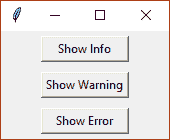

当您运行上面的示例时，请注意每个对话框都会播放由您的平台定义的相应声音，并且按钮标签会被翻译成您的语言：

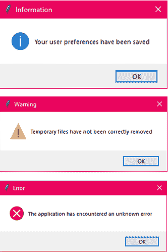

# 如何做...

在前面的*准备就绪*部分提到的三个对话框是使用`tkinter.messagebox`模块中的`showinfo`、`showwarning`和`showerror`函数打开的：

```py
import tkinter as tk
import tkinter.messagebox as mb

class App(tk.Tk):
    def __init__(self):
        super().__init__()
        btn_info = tk.Button(self, text="Show Info",
                             command=self.show_info)
        btn_warn = tk.Button(self, text="Show Warning",
                             command=self.show_warning)
        btn_error = tk.Button(self, text="Show Error",
                              command=self.show_error)

        opts = {'padx': 40, 'pady': 5, 'expand': True, 'fill': tk.BOTH}
        btn_info.pack(**opts)
        btn_warn.pack(**opts)
        btn_error.pack(**opts)

    def show_info(self):
        msg = "Your user preferences have been saved"
        mb.showinfo("Information", msg)

    def show_warning(self):
        msg = "Temporary files have not been correctly removed"
        mb.showwarning("Warning", msg)

    def show_error(self):
        msg = "The application has encountered an unknown error"
        mb.showerror("Error", msg)

if __name__ == "__main__":
    app = App()
    app.mainloop()
```

# 它是如何工作的...

首先，我们使用较短的别名`mb`导入了`tkinter.messagebox`模块。这个模块在 Python 2 中被命名为`tkMessageBox`，因此这种语法也有助于我们将兼容性问题隔离在一个语句中。

每个对话框通常根据通知给用户的信息类型而使用：

+   `showinfo`：操作成功完成

+   `showwarning`：操作已完成，但某些内容未按预期行为

+   `showerror`：由于错误操作失败

这三个函数接收两个字符串作为输入参数：第一个显示在标题栏上，第二个对应对话框显示的消息。

对话框消息也可以通过添加换行字符`\n`跨多行生成。

# 要求用户确认

Tkinter 中包括的其他类型的对话框是用于要求用户确认的对话框，例如当我们要保存文件并且要覆盖同名文件时显示的对话框。

这些对话框与前面的对话框不同，因为函数返回的值将取决于用户点击的确认按钮。这样，我们可以与程序交互，指示是否继续或取消操作。

# 准备就绪

在这个配方中，我们将涵盖`tkinter.messagebox`模块中定义的其余对话框函数。每个按钮上都标有单击时打开的对话框类型：

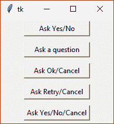

由于这些对话框之间存在一些差异，您可以尝试它们，以查看哪一个可能更适合您每种情况的需求：


# 如何做...

与我们在前面的示例中所做的一样，我们将使用`import ... as`语法导入`tkinter.messagebox`并调用每个函数与`title`和`message`： 

```py
import tkinter as tk
import tkinter.messagebox as mb

class App(tk.Tk):
    def __init__(self):
        super().__init__()
        self.create_button(mb.askyesno, "Ask Yes/No",
                           "Returns True or False")
        self.create_button(mb.askquestion, "Ask a question",
                           "Returns 'yes' or 'no'")
        self.create_button(mb.askokcancel, "Ask Ok/Cancel",
                           "Returns True or False")
        self.create_button(mb.askretrycancel, "Ask Retry/Cancel",
                           "Returns True or False")
        self.create_button(mb.askyesnocancel, "Ask Yes/No/Cancel",
                           "Returns True, False or None")

    def create_button(self, dialog, title, message):
        command = lambda: print(dialog(title, message))
        btn = tk.Button(self, text=title, command=command)
        btn.pack(padx=40, pady=5, expand=True, fill=tk.BOTH)

if __name__ == "__main__":
    app = App()
    app.mainloop()
```

# 它是如何工作的...

为了避免重复编写按钮实例化和回调方法的代码，我们定义了一个`create_button`方法，以便根据需要多次重用它以添加所有带有其对话框的按钮。命令只是简单地打印作为参数传递的`dialog`函数的结果，以便我们可以看到根据点击的按钮返回的值来回答对话框。

# 选择文件和目录

文件对话框允许用户从文件系统中选择一个或多个文件。在 Tkinter 中，这些函数声明在`tkinter.filedialog`模块中，该模块还包括用于选择目录的对话框。它还允许您自定义新对话框的行为，例如通过其扩展名过滤文件或选择对话框显示的初始目录。

# 准备工作

我们的应用程序将包含两个按钮。第一个将被标记为选择文件，并且它将显示一个对话框以选择文件。默认情况下，它只会显示具有`.txt`扩展名的文件：

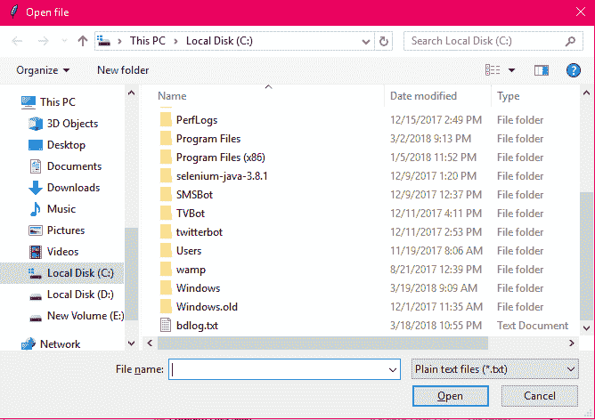

第二个按钮将是选择目录，并且它将打开一个类似的对话框以选择目录：

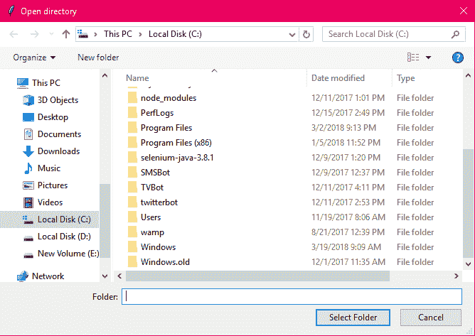

两个按钮都将打印所选文件或目录的完整路径，并且如果对话框被取消，将不执行任何操作。

# 如何做...

我们应用程序的第一个按钮将触发对`askopenfilename`函数的调用，而第二个按钮将调用`askdirectory`函数：

```py
import tkinter as tk
import tkinter.filedialog as fd

class App(tk.Tk):
    def __init__(self):
        super().__init__()
        btn_file = tk.Button(self, text="Choose file",
                             command=self.choose_file)
        btn_dir = tk.Button(self, text="Choose directory",
                             command=self.choose_directory)
        btn_file.pack(padx=60, pady=10)
        btn_dir.pack(padx=60, pady=10)

    def choose_file(self):
        filetypes = (("Plain text files", "*.txt"),
                     ("Images", "*.jpg *.gif *.png"),
                     ("All files", "*"))
        filename = fd.askopenfilename(title="Open file", 
                   initialdir="/", filetypes=filetypes)
        if filename:
            print(filename)

    def choose_directory(self):
        directory = fd.askdirectory(title="Open directory", 
                                    initialdir="/")
        if directory:
            print(directory)

if __name__ == "__main__":
    app = App()
    app.mainloop()
```

由于这些对话框可能会被关闭，我们添加了条件语句来检查对话框函数在将其打印到控制台之前是否返回了非空字符串。我们需要在任何必须对此路径执行操作的应用程序中进行此验证，例如读取或复制文件，或更改权限。

# 它是如何工作的...

我们使用`askopenfilename`函数创建第一个对话框，该函数返回一个表示所选文件的完整路径的字符串。它接受以下可选参数：

+   `title`：对话框标题栏中显示的标题。

+   `initialdir`：初始目录。

+   `filetypes`：两个字符串元组的序列。第一个是以人类可读格式指示文件类型的标签，而第二个是用于匹配文件名的模式。

+   `multiple`：布尔值，指示用户是否可以选择多个文件。

+   `defaultextension`：如果未明确给出文件名，则添加到文件名的扩展名。

在我们的示例中，我们将初始目录设置为根文件夹和自定义标题。在我们的文件类型元组中，我们有以下三个有效选择：使用`.txt`扩展名保存的文本文件；带有`.jpg`、`.gif`和`.png`扩展名的图像；以及通配符(`"*"`)以匹配所有文件。

请注意，这些模式不一定与文件中包含的数据的格式匹配，因为可以使用不同的扩展名重命名文件：

```py
filetypes = (("Plain text files", "*.txt"),
             ("Images", "*.jpg *.gif *.png"),
             ("All files", "*"))
filename = fd.askopenfilename(title="Open file", initialdir="/",
                              filetypes=filetypes)
```

`askdirectory`函数还接受`title`和`initialdir`参数，以及一个`mustexist`布尔选项，指示用户是否必须选择现有目录：

```py
directory = fd.askdirectory(title="Open directory", initialdir="/")
```

# 还有更多...

`tkinter.filedialog`模块包括这些函数的一些变体，允许您直接检索文件对象。

例如，`askopenfile`返回与所选文件对应的文件对象，而不必使用`askopenfilename`返回的路径调用`open`。我们仍然必须检查对话框在调用文件方法之前是否已被关闭：

```py
import tkinter.filedialog as fd

filetypes = (("Plain text files", "*.txt"),)
my_file = fd.askopenfile(title="Open file", filetypes=filetypes)
if my_file:
    print(my_file.readlines())
    my_file.close()
```

# 将数据保存到文件中

除了选择现有文件和目录外，还可以使用 Tkinter 对话框创建新文件。它们可用于保存应用程序生成的数据，让用户选择新文件的名称和位置。

# 准备工作

我们将使用保存文件对话框将文本窗口小部件的内容写入纯文本文件：

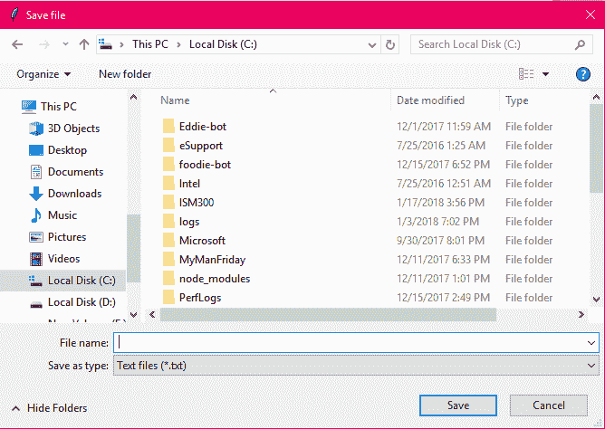

# 如何做...

要打开保存文件的对话框，我们从`tkinter.filedialog`模块调用`asksaveasfile`函数。它内部使用`'w'`模式创建文件对象进行写入，或者如果对话框被关闭，则返回`None`：

```py
import tkinter as tk
import tkinter.filedialog as fd

class App(tk.Tk):
    def __init__(self):
        super().__init__()
        self.text = tk.Text(self, height=10, width=50)
        self.btn_save = tk.Button(self, text="Save",
                                  command=self.save_file)

        self.text.pack()
        self.btn_save.pack(pady=10, ipadx=5)

    def save_file(self):
        contents = self.text.get(1.0, tk.END)
        new_file = fd.asksaveasfile(title="Save file",
                                    defaultextension=".txt",
                                    filetypes=(("Text files", 
                                                "*.txt"),))
        if new_file:
            new_file.write(contents)
            new_file.close()

if __name__ == "__main__":
    app = App()
    app.mainloop()
```

# 工作原理...

`asksaveasfile`函数接受与`askopenfile`函数相同的可选参数，但还允许您使用`defaultextension`选项默认添加文件扩展名。

为了防止用户意外覆盖先前的文件，此对话框会在您尝试保存与现有文件同名的新文件时自动警告您。

有了文件对象，我们可以写入 Text 小部件的内容-始终记得关闭文件以释放对象占用的资源：

```py
contents = self.text.get(1.0, tk.END)
new_file.write(contents)
new_file.close()
```

# 还有更多...

在前面的食谱中，我们看到有一个等价于`askopenfilename`的函数，它返回一个文件对象而不是一个字符串，名为`askopenfile`。

要保存文件，还有一个`asksaveasfilename`函数，它返回所选文件的路径。如果要在打开文件进行写入之前修改路径或执行任何验证，可以使用此函数。

# 另请参阅

+   *选择文件和目录*食谱

# 创建菜单栏

复杂的 GUI 通常使用菜单栏来组织应用程序中可用的操作和导航。这种模式也用于将紧密相关的操作分组，例如大多数文本编辑器中包含的“文件”菜单。

Tkinter 本地支持这些菜单，显示为目标桌面环境的外观和感觉。因此，您不必使用框架或标签模拟它们，因为这样会丢失 Tkinter 中已经构建的跨平台功能。

# 准备工作

我们将首先向根窗口添加一个菜单栏，并嵌套下拉菜单。在 Windows 10 上，显示如下：

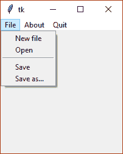

# 如何做...

Tkinter 有一个`Menu`小部件类，可用于许多种类型的菜单，包括顶部菜单栏。与任何其他小部件类一样，菜单是用父容器作为第一个参数和一些可选的配置选项来实例化的：

```py
import tkinter as tk

class App(tk.Tk):
    def __init__(self):
        super().__init__()
        menu = tk.Menu(self)
        file_menu = tk.Menu(menu, tearoff=0)

        file_menu.add_command(label="New file")
        file_menu.add_command(label="Open")
        file_menu.add_separator()
        file_menu.add_command(label="Save")
        file_menu.add_command(label="Save as...")

        menu.add_cascade(label="File", menu=file_menu)
        menu.add_command(label="About")
        menu.add_command(label="Quit", command=self.destroy)
        self.config(menu=menu)

if __name__ == "__main__":
    app = App()
    app.mainloop()
```

如果运行上述脚本，您会看到“文件”条目显示次级菜单，并且可以通过单击“退出”菜单按钮关闭应用程序。

# 工作原理...

首先，我们实例化每个菜单，指定父容器。`tearoff`选项默认设置为`1`，表示菜单可以通过单击其顶部边框的虚线分离。这种行为不适用于顶部菜单栏，但如果我们想要停用此功能，就必须将此选项设置为`0`：

```py
    def __init__(self):
        super().__init__()
        menu = tk.Menu(self)
        file_menu = tk.Menu(menu, tearoff=0)
```

菜单条目按照它们添加的顺序排列，使用`add_command`、`add_separator`和`add_cascade`方法：

```py
menu.add_cascade(label="File", menu=file_menu)
menu.add_command(label="About")
menu.add_command(label="Quit", command=self.destroy)
```

通常，`add_command`与`command`选项一起调用，当单击条目时会调用回调。与 Button 小部件的`command`选项一样，回调函数不会传递任何参数。

为了举例说明，我们只在“退出”选项中添加了这个选项，以销毁`Tk`实例并关闭应用程序。

最后，我们通过调用`self.config(menu=menu)`将菜单附加到顶层窗口。请注意，每个顶层窗口只能配置一个菜单栏。

# 在菜单中使用变量

除了调用命令和嵌套子菜单外，还可以将 Tkinter 变量连接到菜单条目。

# 准备工作

我们将向“选项”子菜单添加一个复选框条目和三个单选按钮条目，之间用分隔符分隔。将有两个基础的 Tkinter 变量来存储所选值，因此我们可以轻松地从应用程序的其他方法中检索它们：

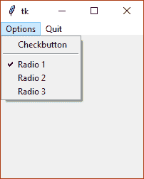

# 如何做...

这些类型的条目是使用`Menu`小部件类的`add_checkbutton`和`add_radiobutton`方法添加的。与常规单选按钮一样，所有条目都连接到相同的 Tkinter 变量，但每个条目设置不同的值：

```py
import tkinter as tk

class App(tk.Tk):
    def __init__(self):
        super().__init__()
        self.checked = tk.BooleanVar()
        self.checked.trace("w", self.mark_checked)
        self.radio = tk.StringVar()
        self.radio.set("1")
        self.radio.trace("w", self.mark_radio)

        menu = tk.Menu(self)
        submenu = tk.Menu(menu, tearoff=0)

        submenu.add_checkbutton(label="Checkbutton", onvalue=True,
                                offvalue=False, variable=self.checked)
        submenu.add_separator()
        submenu.add_radiobutton(label="Radio 1", value="1",
                                variable=self.radio)
        submenu.add_radiobutton(label="Radio 2", value="2",
                                variable=self.radio)
        submenu.add_radiobutton(label="Radio 3", value="3",
                                variable=self.radio)

        menu.add_cascade(label="Options", menu=submenu)
        menu.add_command(label="Quit", command=self.destroy)
        self.config(menu=menu)

    def mark_checked(self, *args):
        print(self.checked.get())

    def mark_radio(self, *args):
        print(self.radio.get())

if __name__ == "__main__":
    app = App()
    app.mainloop()
```

此外，我们正在跟踪变量更改，以便在运行此应用程序时可以在控制台上看到打印的值。

# 工作原理...

要将布尔变量连接到`Checkbutton`条目，我们首先定义`BooleanVar`，然后使用`variable`选项调用`add_checkbutton`创建条目。

请记住，`onvalue`和`offvalue`选项应与 Tkinter 变量的类型匹配，就像我们在常规 RadioButton 和 CheckButton 小部件中所做的那样：

```py
self.checked = tk.BooleanVar()
self.checked.trace("w", self.mark_checked)
# ...
submenu.add_checkbutton(label="Checkbutton", onvalue=True,
                        offvalue=False, variable=self.checked)
```

`Radiobutton`条目是使用`add_radiobutton`方法以类似的方式创建的，当单击单选按钮时，只需设置一个`value`选项即可将其设置为 Tkinter 变量。由于`StringVar`最初保存空字符串值，因此我们将其设置为第一个单选按钮值，以便它显示为已选中：

```py
self.radio = tk.StringVar()
self.radio.set("1")
self.radio.trace("w", self.mark_radio)
# ...        
submenu.add_radiobutton(label="Radio 1", value="1",
                        variable=self.radio)
submenu.add_radiobutton(label="Radio 2", value="2",
                        variable=self.radio)
submenu.add_radiobutton(label="Radio 3", value="3",
                        variable=self.radio)
```

两个变量都使用`mark_checked`和`mark_radio`方法跟踪更改，这些方法只是将变量值打印到控制台。

# 显示上下文菜单

Tkinter 菜单不一定要位于菜单栏上，而实际上可以自由放置在任何坐标。这些类型的菜单称为上下文菜单，通常在用户右键单击项目时显示。

上下文菜单广泛用于 GUI 应用程序；例如，文件浏览器显示它们以提供有关所选文件的可用操作，因此用户知道如何与它们交互是直观的。

# 准备工作

我们将为文本小部件构建一个上下文菜单，以显示文本编辑器的一些常见操作，例如剪切、复制、粘贴和删除：

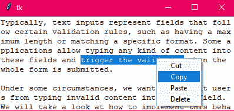

# 如何做...

不是使用顶级容器作为顶部菜单栏来配置菜单实例，而是可以使用其`post`方法将其明确放置。

菜单条目中的所有命令都调用一个使用文本实例来检索当前选择或插入位置的方法：

```py
import tkinter as tk

class App(tk.Tk):
    def __init__(self):
        super().__init__()
        self.menu = tk.Menu(self, tearoff=0)
        self.menu.add_command(label="Cut", command=self.cut_text)
        self.menu.add_command(label="Copy", command=self.copy_text)
        self.menu.add_command(label="Paste", command=self.paste_text)
        self.menu.add_command(label="Delete", command=self.delete_text)

        self.text = tk.Text(self, height=10, width=50)
        self.text.bind("<Button-3>", self.show_popup)
        self.text.pack()

    def show_popup(self, event):
        self.menu.post(event.x_root, event.y_root)

    def cut_text(self):
        self.copy_text()
        self.delete_text()

    def copy_text(self):
        selection = self.text.tag_ranges(tk.SEL)
        if selection:
            self.clipboard_clear()
            self.clipboard_append(self.text.get(*selection))

    def paste_text(self):
        self.text.insert(tk.INSERT, self.clipboard_get())

    def delete_text(self):
        selection = self.text.tag_ranges(tk.SEL)
        if selection:
            self.text.delete(*selection)

if __name__ == "__main__":
    app = App()
    app.mainloop()
```

# 工作原理...

我们将右键单击事件绑定到文本实例的`show_popup`处理程序，该处理程序将菜单显示在右键单击位置的左上角。每次触发此事件时，都会再次显示相同的菜单实例：

```py
def show_popup(self, event):
    self.menu.post(event.x_root, event.y_root)
```

对所有小部件类可用的以下方法与剪贴板交互：

+   清除剪贴板中的数据

+   `clipboard_append(string)`: 将字符串附加到剪贴板

+   `clipboard_get()`: 从剪贴板返回数据

*复制*操作的回调方法获取当前选择并将其添加到剪贴板：

```py
    def copy_text(self):
        selection = self.text.tag_ranges(tk.SEL)
        if selection:
            self.clipboard_clear()
 self.clipboard_append(self.text.get(*selection))
```

*粘贴*操作将剪贴板内容插入到由`INSERT`索引定义的插入光标位置。我们必须将此包装在`try...except`块中，因为调用`clipboard_get`会在剪贴板为空时引发`TclError`：

```py
    def paste_text(self):
        try:
 self.text.insert(tk.INSERT, self.clipboard_get())
        except tk.TclError:
            pass
```

*删除*操作不与剪贴板交互，但会删除当前选择的内容：

```py
    def delete_text(self):
        selection = self.text.tag_ranges(tk.SEL)
        if selection:
            self.text.delete(*selection)
```

由于剪切操作是复制和删除的组合，我们重用这些方法来组成其回调函数。

# 还有更多...

`postcommand`选项允许您使用`post`方法每次显示菜单时重新配置菜单。为了说明如何使用此选项，如果文本小部件中没有当前选择，则我们将禁用剪切、复制和删除条目，并且如果剪贴板中没有内容，则禁用粘贴条目。

与我们的其他回调函数一样，我们传递了对我们类的方法的引用以添加此配置选项：

```py
def __init__(self):
    super().__init__()
    self.menu = tk.Menu(self, tearoff=0, 
    postcommand=self.enable_selection)
```

然后，我们检查`SEL`范围是否存在，以确定条目的状态应为`ACTIVE`或`DISABLED`。将此值传递给`entryconfig`方法，该方法以要配置的条目的索引作为其第一个参数，并以要更新的选项列表作为其第二个参数-请记住菜单条目是`0`索引的：

```py
def enable_selection(self):
    state_selection = tk.ACTIVE if self.text.tag_ranges(tk.SEL) 
                      else tk.DISABLED
    state_clipboard = tk.ACTIVE
    try:
        self.clipboard_get()
    except tk.TclError:
        state_clipboard = tk.DISABLED

    self.menu.entryconfig(0, state=state_selection) # Cut
    self.menu.entryconfig(1, state=state_selection) # Copy
    self.menu.entryconfig(2, state=state_clipboard) # Paste
    self.menu.entryconfig(3, state=state_selection) # Delete
```

例如，如果没有选择或剪贴板上没有内容，所有条目都应该变灰。

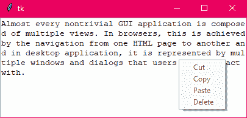

使用`entryconfig`，还可以配置许多其他选项，如标签、字体和背景。请参阅[`www.tcl.tk/man/tcl8.6/TkCmd/menu.htm#M48`](https://www.tcl.tk/man/tcl8.6/TkCmd/menu.htm#M48)以获取可用条目选项的完整参考。

# 打开一个次要窗口

根`Tk`实例代表我们 GUI 的主窗口——当它被销毁时，应用程序退出，事件主循环结束。

然而，在我们的应用程序中创建额外的顶层窗口的另一个 Tkinter 类是`Toplevel`。您可以使用这个类来显示任何类型的窗口，从自定义对话框到向导表单。

# 准备就绪

我们将首先创建一个简单的窗口，当主窗口的按钮被点击时打开。它将包含一个关闭它并将焦点返回到主窗口的按钮：

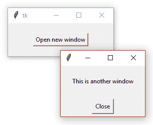

# 如何做...

`Toplevel`小部件类创建一个新的顶层窗口，它像`Tk`实例一样作为父容器。与`Tk`类不同，您可以实例化任意数量的顶层窗口：

```py
import tkinter as tk

class Window(tk.Toplevel):
    def __init__(self, parent):
        super().__init__(parent)
        self.label = tk.Label(self, text="This is another window")
        self.button = tk.Button(self, text="Close", 
                                command=self.destroy)

        self.label.pack(padx=20, pady=20)
        self.button.pack(pady=5, ipadx=2, ipady=2)

class App(tk.Tk):
    def __init__(self):
        super().__init__()
        self.btn = tk.Button(self, text="Open new window",
                             command=self.open_window)
        self.btn.pack(padx=50, pady=20)

    def open_window(self):
        window = Window(self)
        window.grab_set()

if __name__ == "__main__":
    app = App()
    app.mainloop()
```

# 它是如何工作的...

我们定义一个`Toplevel`子类来表示我们的自定义窗口，它与父窗口的关系在它的`__init__`方法中定义。小部件被添加到这个窗口，因为我们遵循与子类化`Tk`相同的约定：

```py
class Window(tk.Toplevel):
    def __init__(self, parent):
        super().__init__(parent)
```

通过简单地创建一个新实例来打开窗口，但是为了使其接收所有事件，我们必须调用它的`grab_set`方法。这可以防止用户与主窗口交互，直到该窗口关闭为止。

```py
def open_window(self):
    window = Window(self)
 window.grab_set()
```

# 处理窗口删除

在某些情况下，您可能希望在用户关闭顶层窗口之前执行某个操作，例如，以防止丢失未保存的工作。Tkinter 允许您拦截这种类型的事件以有条件地销毁窗口。

# 准备就绪

我们将重用前面一篇文章中的`App`类，并修改`Window`类以显示一个对话框来确认关闭窗口：

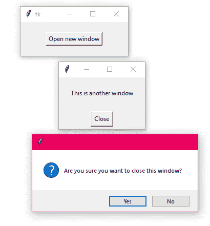

# 如何做...

在 Tkinter 中，我们可以通过为`WM_DELETE_WINDOW`协议注册处理程序函数来检测窗口即将关闭的情况。这可以通过在大多数桌面环境的标题栏上点击 X 按钮来触发：

```py
import tkinter as tk
import tkinter.messagebox as mb

class Window(tk.Toplevel):
    def __init__(self, parent):
        super().__init__(parent)
        self.protocol("WM_DELETE_WINDOW", self.confirm_delete)

        self.label = tk.Label(self, text="This is another window")
        self.button = tk.Button(self, text="Close", 
                                command=self.destroy)

        self.label.pack(padx=20, pady=20)
        self.button.pack(pady=5, ipadx=2, ipady=2)

    def confirm_delete(self):
        message = "Are you sure you want to close this window?"
        if mb.askyesno(message=message, parent=self):
            self.destroy()
```

我们的处理程序方法显示一个对话框来确认窗口删除。在更复杂的程序中，这种逻辑通常会通过额外的验证来扩展。

# 它是如何工作的...

`bind()`方法用于为小部件事件注册处理程序，`protocol`方法用于为窗口管理器协议注册处理程序。

当顶层窗口即将关闭时，`WM_DELETE_WINDOW`处理程序被调用，默认情况下，`Tk`会销毁接收到它的窗口。由于我们通过注册`confirm_delete`处理程序来覆盖此行为，如果对话框得到确认，它需要显式销毁窗口。

另一个有用的协议是`WM_TAKE_FOCUS`，当窗口获得焦点时会调用它。

# 还有更多...

请记住，为了在显示对话框时保持第二个窗口的焦点，我们必须将对顶层实例的引用，`parent`选项，传递给对话框函数：

```py
if mb.askyesno(message=message, parent=self):
    self.destroy()
```

否则，对话框将以根窗口为其父窗口，并且您会看到它弹出到第二个窗口上。这些怪癖可能会让您的用户感到困惑，因此正确设置每个顶层实例或对话框的父窗口是一个好的做法。

# 在窗口之间传递变量

在程序执行期间，两个不同的窗口可能需要共享信息。虽然这些数据可以保存到磁盘并从使用它的窗口读取，但在某些情况下，更直接地在内存中处理它并将这些信息作为变量传递可能更简单。

# 准备工作

主窗口将包含三个单选按钮，用于选择我们要创建的用户类型，并且次要窗口将打开表单以填写用户数据：

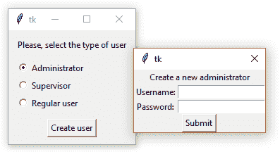

# 操作步骤...

为了保存用户数据，我们使用`namedtuple`创建了一个字段，代表每个用户实例。`collections`模块中的这个函数接收类型名称和字段名称序列，并返回一个元组子类，用于创建具有给定字段的轻量级对象：

```py
import tkinter as tk
from collections import namedtuple

User = namedtuple("User", ["username", "password", "user_type"])

class UserForm(tk.Toplevel):
    def __init__(self, parent, user_type):
        super().__init__(parent)
        self.username = tk.StringVar()
        self.password = tk.StringVar()
        self.user_type = user_type

        label = tk.Label(self, text="Create a new " + 
                         user_type.lower())
        entry_name = tk.Entry(self, textvariable=self.username)
        entry_pass = tk.Entry(self, textvariable=self.password, 
                              show="*")
        btn = tk.Button(self, text="Submit", command=self.destroy)

        label.grid(row=0, columnspan=2)
        tk.Label(self, text="Username:").grid(row=1, column=0)
        tk.Label(self, text="Password:").grid(row=2, column=0)
        entry_name.grid(row=1, column=1)
        entry_pass.grid(row=2, column=1)
        btn.grid(row=3, columnspan=2)

    def open(self):
        self.grab_set()
        self.wait_window()
        username = self.username.get()
        password = self.password.get()
        return User(username, password, self.user_type)

class App(tk.Tk):
    def __init__(self):
        super().__init__()
        user_types = ("Administrator", "Supervisor", "Regular user")
        self.user_type = tk.StringVar()
        self.user_type.set(user_types[0])

        label = tk.Label(self, text="Please, select the type of user")
        radios = [tk.Radiobutton(self, text=t, value=t, \
                  variable=self.user_type) for t in user_types]
        btn = tk.Button(self, text="Create user", 
                        command=self.open_window)

        label.pack(padx=10, pady=10)
        for radio in radios:
            radio.pack(padx=10, anchor=tk.W)
        btn.pack(pady=10)

    def open_window(self):
        window = UserForm(self, self.user_type.get())
        user = window.open()
        print(user)

if __name__ == "__main__":
    app = App()
    app.mainloop()
```

当执行流返回到主窗口时，用户数据将被打印到控制台。

# 工作原理...

这个示例的大部分代码已经在其他示例中涵盖，主要区别在于`UserForm`类的`open()`方法中，我们将调用`grab_set()`移到了那里。然而，`wait_window()`方法实际上是停止执行并防止我们在表单被修改之前返回数据的方法：

```py
    def open(self):
 self.grab_set()
 self.wait_window()
        username = self.username.get()
        password = self.password.get()
        return User(username, password, self.user_type)
```

需要强调的是，`wait_window()`进入一个本地事件循环，当窗口被销毁时结束。虽然可以传递我们想要等待移除的部件，但我们可以省略它以隐式地引用调用此方法的实例。

当`UserForm`实例被销毁时，`open()`方法的执行将继续，并返回`User`对象，现在可以在`App`类中使用：

```py
    def open_window(self):
        window = UserForm(self, self.user_type.get())
        user = window.open()
        print(user)
```
