# 五、云平台部署 Python （Distributed Computing with Python）

上一章介绍了创建 Python 分布式应用的 Celery 和其它工具。我们学习了不同的分布式计算架构：分布任务队列和分布对象。然而，还有一个课题没有涉及。这就时在多台机器上部署完成的应用。本章就来学习。

这里，我们来学习 Amazon Web Services (AWS)，它是市场领先的云服务产品，以在上面部署分布式应用。云平台不是部署应用的唯一方式，下一章，我们会学习另一种部署方式，HPC 集群。部署到 AWS 或它的竞品是一个相对廉价的方式。

## 云计算和 AWS

AWS 是云计算的领先提供商，它的产品是基于互联网的按需计算和存储服务，通常是按需定价。

通过接入庞大的算力资源池（虚拟或现实的）和云平台存储，可以让应用方便的进行水平扩展（添加更多机器）或垂直扩展（使用性能更高的硬件）。在非常短的时间内，通过动态添加或减少资源（减少花费），就可以让用户下载应用。配置资源的简易化、使用庞大的云平台资源、云平台的高可用性、低廉的价格，都是进行云平台部署的优点，尤其是对小公司和个人。

云平台的两种主要服务是计算机节点和存储。也会提供其它服务，包括可扩展的数据库服务器（关系型和非关系型数据库）、网络应用缓存、特殊计算框架（例如 Hadoop/MapReduce），以及应用服务（比如消息队列或电子邮件服务）。所有这些服务都可以进行动态扩展，以适应使用量的增加，当使用量减小时，再缩小规模。

AWS 提供前面所有的服务，然而这章只关注一些主要服务：计算机节点 Amazon Elastic Compute Cloud (EC2)，计算机节点虚拟硬盘存储 Amazon Elastic Block Store (EBS)，存储应用数据 AmazonSimple Storage Server(S3)，应用部署 Amazon Elastic Beanstalk。

## 创建 AWS 账户

为了使用 AWS，需要创建一个账户。使用一定量资源的首年是免费的，之后按照标准价格收费。

要创建账户，打开页面[https://aws.amazon.com](https://link.jianshu.com?t=https://aws.amazon.com/)，点击 Create a Free Account，如下面截屏所示：

注册需要基本的联系信息，支付手段（必须要用信用卡注册），和一些其它信息。

一旦账户激活，就可以登录管理页面，如下面截图所示：

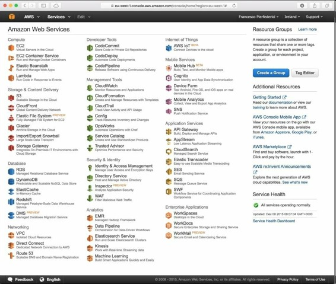

控制台页面功能繁杂，有许多图标，对应着 50 多项服务。本章会讲如何使用 EC2、Elastic Beanstalk，S3 和 Identity and Access Management 服务，它们的图标在下图中标出：

在创建虚拟运行应用和用存储仓保存数据之前，我们需要创建至少一个用户和一个用户组。要这么做，点击第二栏的 Identity and Access Management，或打开网页[https://console.aws.amazon.com/iam/](https://link.jianshu.com?t=https://console.aws.amazon.com/iam/)。点击左边栏的 Groups，然后点击 Create New Group 按钮。

然后会让你输入新用户组的名字。我通常使用`Wheel`作为管理组的名字。填入用户组名字之后，点击 Next Step 按钮。

然后，我们需要选择这个用户组的预定义规则。在这个页面，我们可以选择 AdministratorAccess。然后点击 Next Step 按钮。

在下一页检查之前的选项，如果没有问题，可以点击 Create Group。Group 页面就会列出新创建的用户组了，如下所示：

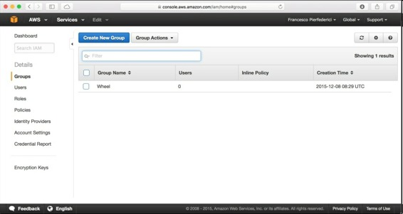

点击用户组的名字（Wheel），然后在 Permissions 栏就会显示这个组的规则，如下图所示：

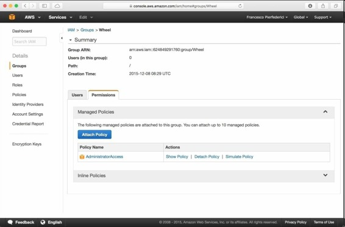

现在，创建至少一个用户，即登录虚拟机的账户。左侧栏点击 Users，然后点击页面上方的 Create New Users，在打开的页面中，一次最多可以创建五个用户。

现在来创建一个用户。在第一个空格（数字 1 旁边）输入用户名，确保勾选了选项框 Generate an access key for each user，然后点击 Create 按钮，如下图所示（我选的用户名是 bookuser）：

下面的一页很重要，呈现在我们面前的是一个用户创建流程的概括，可以在这里下载用户整数。一定要点击 Download Credentials 按钮。如果没有做，或将证书（一个 csv 文件）放错了位置，你可以创建一个新用户，再下载一个证书。

现在，我们需要将创建的用户添加到用户组。要这么做，返回 Groups 页面（点击左侧栏的 Groups），选择之前创建的管理组（Wheel），点击页面上方的 Group Actions，在弹出的页面点击 Add Users to Group。如果这个条目不能使用，确保勾选了组名旁边的选择框。

来到一个列出所有用户的新页面。点击刚刚创建的用户旁边的勾选框，然后点击页面底部的 Add Users。在下一页，点击组名，然后在 Users 栏会显示刚刚添加的用户，如下图所示：

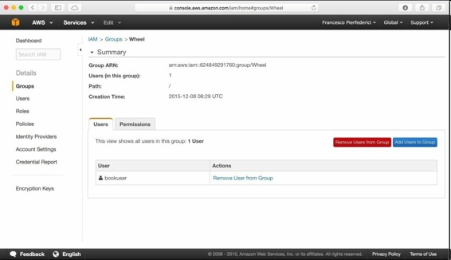

现在，创建密码。返回 Users 页面（点击左侧导航栏的 Users），点击用户名，在打开的页面点击 Security Credentials 栏。会看到类似下图的页面：

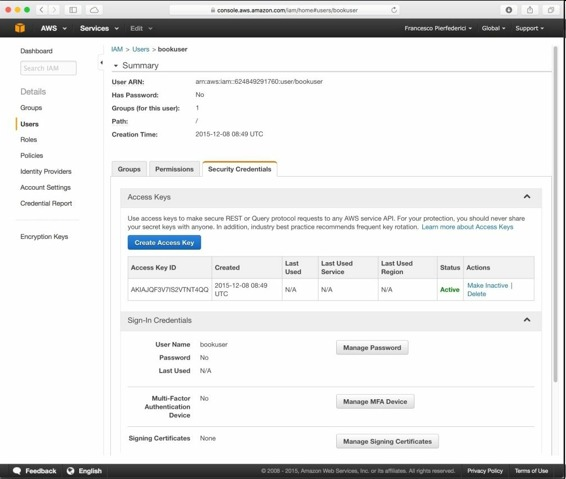

这里，在 Sign-In-Credentials 下面的 Manage Password 根据提示设置密码，我们可以让 AWS 为我们设置密码，或自定义一个密码。

快完成了。剩下的是为用户创建 SSH 密钥，以让用户能不用密码就登录 EC2 实例。这也可以用管理台来做。

登出管理台，用刚才创建的用户再次登录。为了这么做，使用刚才页面的 URL，[https://console.aws.amazon.com/iam](https://link.jianshu.com?t=https://console.aws.amazon.com/iam)，它的形式是`https://<ACCOUNT NUMBER>.signin.aws.amazon.com/console/`。

现在，在管理台页面，点击 EC2 图标，然后在左上方的弹出框选择实例的地理位置（我选择的是 Ireland）。Amazon EC2 虚拟机有多个区域，涵盖美国、欧洲、亚洲和南美。SSH 密钥是和区域有关的，也就是说，要使用两个不同区域的机器，我们要为每个区域创建两个不同的 SSH 密钥对。

选择完区域之后，点击 Key Pairs，如下所示：

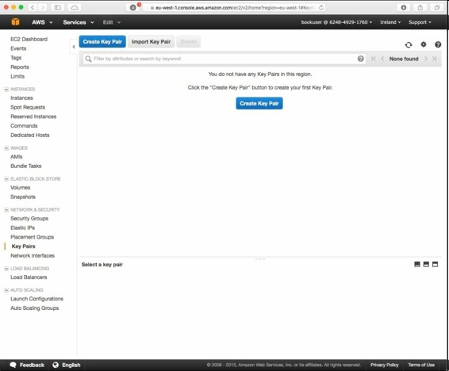

点击 Create Key Pair，给其命名（我起的名字是 bookuser-ireland-key），然后点击 Create 按钮。新创建的私钥会自动下载到你的电脑，格式是`pem`（有事下载的文件的后缀名是`.pem.txt`，可以将其重命名为`.pem`）。

确保将其安全的存放，进行备份，因为不会再次下载。如果放的位置不对，你需要使用 AWS 控制台新建一个，以删除这个密钥对。

我把密钥保存在`$HOME`的`.ssh`目录。我通常将密钥复制到这里，重命名它的后缀为`.pem`，并且只有我才能访问（即 chmod 400 ~/.ssh/bookuser-ireland-key.pem）。

## 创建一个 EC2 实例

做完了所有的配置，现在可以创建第一个虚拟机了。从我们选择的地理区域开始（记得为每个创建密钥），然后登陆运行的实例。我们现在只是用网页控制台来做。

如果你不在控制台，使用创建的用户登陆（可以使用 URL：`https://<ACCOUNTNUMBER>.signin.aws.amazon.com/console/`），然后点击 EC2 图标。

打开的 EC2 控制台如下所示：

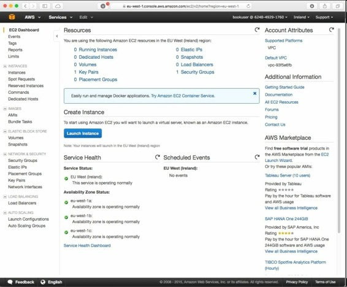

点击页面中间的蓝色按妞 Launch Instance。接下来创建虚拟机。首先，选择 Amazon Machine Image (AMI)，它是底层的操作系统，和默认的虚拟机软件包集合。

可选的配置有很多。我们选择一个免费的 AMI。我喜欢 64 位的 Ubuntu 服务器镜像，从上往下数的第四个（你也可以选其它的）：

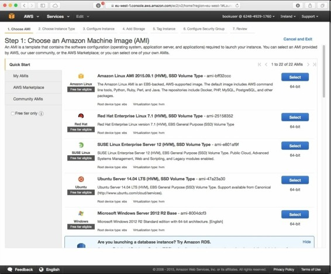

然后，要选择虚拟硬件。Amazon 提供多种配置，取决于用户的需求。例如，如果我们想运行深度学习代码，我们就要选择 GPU 强大的实例。在我们的例子中，我们选择 Free tier eligible t2.micro，下面截图中的第一个：

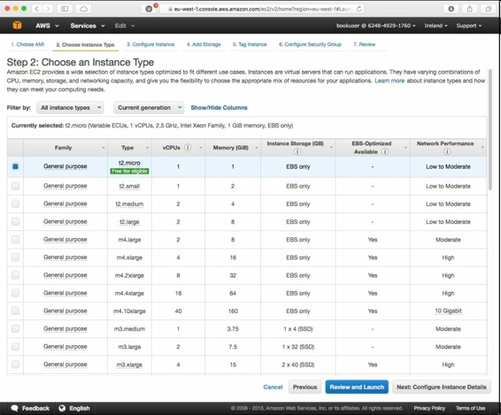

点击 Next: Configure Instance Details 会打开一个新页面，在上面可以配置将要创建的实例的一些特性。现在，只使用其默认值，但要关注一下 Purchasing option。我们现在使用的是 Spot instance，意味着如果使用了更高级的实例需要硬件资源，就会关闭之前的虚拟机。

我们现在不需要对这一项进行设置，但是要知道 Spot instance 是一种可以降低花费的手段。点击 Next: Add Storage。

这里，我们可以配置存储选项。现在，还是使用默认值，只是看一下选项的内容。Delete on Termination 是默认勾选的，它的作用是当结束实例时，和其相关的数据也会被删除。因为在默认情况下，实例是暂停而非终止，这么设置就可以。然后点击 Next: Tag Instance。我们现在不创建任何 tag，所以继续点击 Next: Configure Security Group。

这个打开的页面很重要，如下所示：

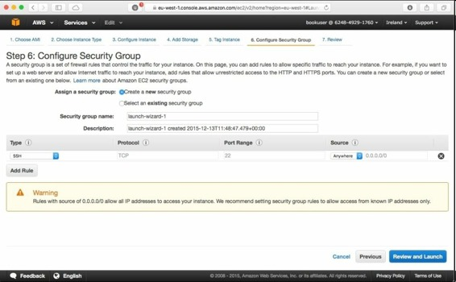

在这一页上，我们来配置实例的服务（网络端口）和登录 VM 的 IP 地址。现在，我们只是改变 SSH 的规则，以允许从 My IP 的连接（在弹出菜单的 Source 标题，SSH 行）。

例如，向 Anywhere 打开 TCP 的 80 端口，以运行一个网络服务器，或是 5672 端口（使用 RabbitMQ 的 Celery 的端口），供 Celery 应用的 IP 使用。

现在不建立任何规则，使用默认的 SSH 访问规则。设置页面如下：

最后，点击 Review and Launch，如果没有问题的话，再点击 Launch。确保可以访问正确的`.pem`文件，以访问 EC2 实例，然后点击 Launch Instances。

Amazon 现在会启动实例，需要几分钟时间。通过点击页面底部的 View Instances，可以看到实例的运行或准备状态：

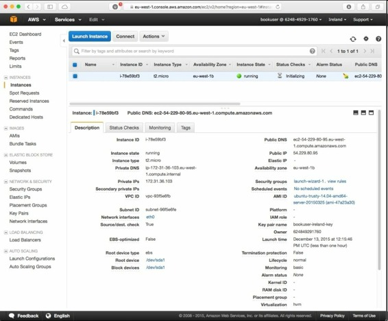

一旦 VM 运行了，就可以用 SSH 连接它。通过终端进行连接，使用实例 OS 的正确 Unix 用户名（即，Amazon Linux 是`ec2-user`，Ubuntu 是`ubuntu`，SUSE 是`root`或`ec2-user`，Fedora Linux 是`fedora`或`ec2-user`）。

在我们的例子中，登录窗口如下：

VM 中包含了一些预先安装的软件，包括 Python 2.7 和 3.4。为了实用，这个 VM 是一台 Linux 服务器。试验结束之后，可以在 Actions 弹出窗中点击 Stop 结束实例，选中实例的名字，如下图所示：

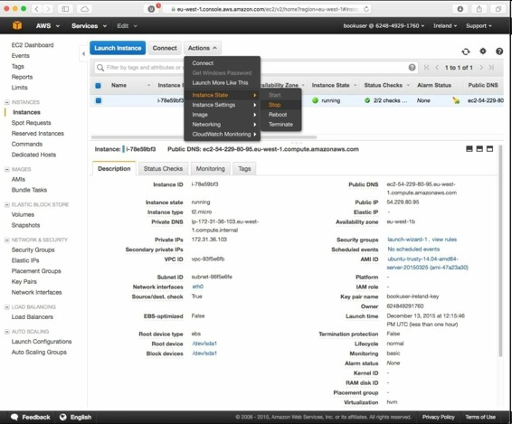

关于 EC2 实例，特别要注意虚拟的存储和虚拟机在重启、停止、关闭时，存储设备的行为。因为，无论停止还是关闭虚拟机，它的 IP 地址都会失效，下次启动时会分配新的 IP 地址。

我们创建的实例（`t2.micro`）使用存储在 EBS 的虚拟硬盘，它是 EC2 实例的高性能和高可靠性的存储。

默认情况下，当对应的实例关闭时，存储在 EBS 的虚拟硬盘会被删除（除非 Add Storage 页面的 Delete on Termination 选项没有勾选），但实例停止时，存储不会删除。停止实例会导致存储费用，而关闭实例不会。

重启一个关闭的实例是不可能的，必须要从头新建一个实例，这比重启暂停的 VM 要花费更长的时间。因为这个原因，如果想重新使用实例，最好停止而不是关闭。然而，保持 EBS 存储是一笔可观的花费，所以应该使用时间不长的实例应该关闭。

重启、关闭状态下，使应用数据保存在 EBS 的方法之一是新建一个 EBS 卷，当相关的 EC2 实例运行时，将新的卷分配给这个实例。这是通过点击 EC2 Dashboard 页面的 Volumes 链接，然而根据提示操作。要记住，初次使用一个卷时，需要进行格式化，这可以通过在运行 EC2 实例内使用专门的工具，如下图所示：

Linux 内核重新映射了 EBS 卷的设备名字，`/dev/sdf to /dev/xvdf`。

分配一个卷就像将硬盘链接电脑，它们的数据在重启之后也会保存，并可以从一个实例移动到另一个实例。要记住，每创建一个卷都要花钱，无论是否使用。

另一种（花费较低的）存储应用数据的方法是使用 S3，接下来讨论它。

## 使用 Amazon S3 存储数据

Amazon Simple Storage Service，S3，是一个存储、读取数据的网络服务。各种文件都可以存储到 S3，上到 5TB 的数据，或是源代码。

S3 远比 EBS 便宜，但是它不提供文件层，而是一个 REST API。另一个不同点是，EBS 卷一次只能分配一个运行的实例，S3 对象可以在多个实例间共享，取决于许可协议，可以网络各处访问。

使用 S3 很简单，你需要在某个地理区域（为了降低访问时间）创建一些桶（即 S3 的容器），然后添加数据。过程如下：登录 AWS 管理台，点击 Storage & Content Delivery 下面的 S3 图标，点击 Create Bucket 按钮，给桶起名字，然后给它选择区域。

对于这个例子，我们起的名气是 book-123-456，区域是爱尔兰，如下图所示：

点击 Create 按钮。因为桶的名字实在 S3 用户间分享的，像 book 这样的名字都被使用过了。因此，起的名字最好加上一些识别符。

下一页显示了创建的 S3 桶列表，见下图（点击桶名字左侧的图标，以显示桶的属性）：

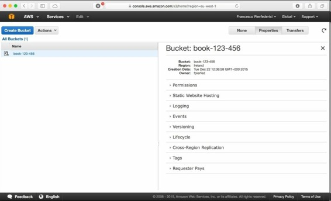

从这页开始，在桶页面上就可以查看桶的内容、上传数据、重命名、或删除，见下面截图：

Amazon S3 有一个复杂的许可协议，可以根据每个对象、每个桶执行访问。现在，向桶传一些文件，并修改访问权限。

创建一个文本文件夹，并存储一些文本文件。在我的例子中，我创建了一个文件`index.html`，内容是"Hi there!"。使用 Upload，上传到 S3.

我们可以检查这个文件的属性（包括访问权），通过选择文件，并点击右上角的 Properties。从下页可以看到，默认情况下，刚刚上传的文件只能被我们访问到：

我们可以从终端师徒访问文件（使用文件名属性下方的 URL），但是会有错误 Access Denied。我们可以添加一个许可，让任何人可以对这个文件进行读写，如下图所示（记得 Save 访问规则）：

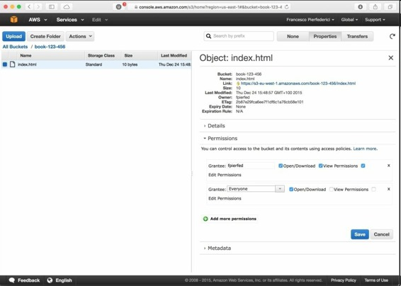

创建这个许可之后，刚上传的文件就是面向公众可读的了，例如，作为网页的静态文件。在 S3 上存储文件相对便宜，但不是完全免费。

## Amazon elastic beanstalk

Amazon Elastic Beanstalk (EB) 是将应用部署到 AWS 的简便方法，不必分别处理 EC2 和 S3.Amazon EB 功能完备，支持 Python。

最好在 Python 虚拟环境中，用命令行（使用 awsebcli 包）使用 EB。要点是，你需要创建一个 Python 应用的虚拟环境，以部署到 AWS。应用本身保存在一个文件夹内，用来打包。

使用`eb`命令，就可以创建一个初始化部署配置（`eb init`），通过写额外的配置文件（文件夹`.ebextensions`）来进行自定义，配置选项，例如需要的环境变量，或需要进行的推迟安装。

应用在本地测试完毕之后，就可以使用`eb create`部署到 AWS，使用`eb terminate`命令进行销毁。

AWS 网站有关于部署的教程，例如，一个稍显复杂的 Django 网页应用（[http://docs.aws.amazon.com/elasticbeanstalk/latest/dg/create-deploy-python-django.html#python-django-configure-for-eb](https://link.jianshu.com?t=http://docs.aws.amazon.com/elasticbeanstalk/latest/dg/create-deploy-python-django.html#python-django-configure-for-eb)），可以让你学习更多的 EB。

尽管 EB 文档大部分都是关于网页应用的，它的应用不局限于 HTTP 服务器和 WSGI 应用。

## 创建私有云平台

AWS 对大多数个人和公司都是一个不错的选择。但是，使用 AWS 也会增加成本。或者，公司的政策，或从数据的隐私性考虑，不能使用云平台。

这就需要搭建一个内部的私有云平台。使用现有的硬件，运行虚拟机（EC2）和数据存储中间件（类似于 S3），再加上其它服务，比如负载均衡、数据库等等。

这样的免费开源工具很多，比如**OpenStack**([http://www.openstack.org](https://link.jianshu.com?t=http://www.openstack.org/))， **CloudStack**([https://cloudstack.apache.org](https://link.jianshu.com?t=https://cloudstack.apache.org/))，和 **Eucalyptus**([http://www.eucalyptus.com](https://link.jianshu.com?t=http://www.eucalyptus.com/))。

Eucalyptus 可以和 AWS（EC2 和 S3）交互。使用它可以构建类似 AWS 的 API。这样，就可以扩展私有云平台，或是迁移到 EC2 和 S3，而不用重新创建虚拟机镜像、工具和管理脚本文件。

另外，Python 的与 AWS 交互的 boto 工具包（`pip install boto`）是与 Eucalyptus 兼容的。

## 总结

通过 AWS，我们学习了利用云平台进行计算和存储，用户按需支付，只需要给使用的资源付款。

这些平台在开发阶段和运行阶段，都可以用于我们的分布式应用。特别是进行伸缩性测试，让我们自己一下提供许多台机器是不现实的。更不用说，还可以使用海量的云平台资源，以及可靠性保障。

同时，云平台服务是收费。而且，通常定价不菲。另外，从时间和精力，云平台限制颇多，我们不能管理资源、不能安装软件，也不能学习某个软件工具和它的特性。从一个云平台迁移到另一个，还往往很费事。

知道了这些，就可以更好的让云平台适合我们的总体设计、开发、测试、部署。

例如，一个简单的策略是将分布式应用部署到自建的平台上，只在流量增加时使用云平台。所以，要时刻更新 VM 镜像，并引入到 Amazon EC2.

下一章，我们会学习研究者和实验室/大学人员的场景，在大型的高性能计算机（HPC）群上运行 Python。

